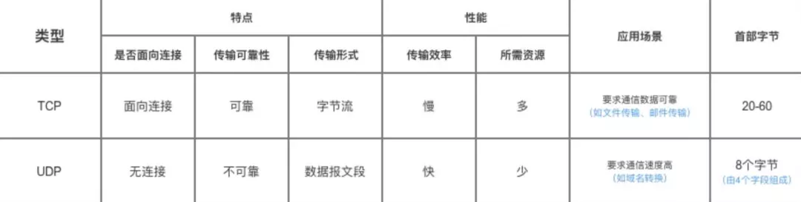

###  3~5 年经验 20k 中级~高级工程师

### 知识广度

事务原理，索引原理，SQL优化技巧

分库分表， 用数据库中间件 Sharding-JDBC 来做分库分表

###  5-8 年经验  30k 高级~资深工程师 

以下内容会随着级别增高逐渐深入

### 项目经验

首先给我说说,你们的系统有哪些库哪些表,对应的是哪些业务呢?然后告诉我,核心的表每天新增的数据量有多少,目前已经积累了多少数据了?单表是百万级?还是千万级?你们是什么时候的表?什么时候分的库?为什么?

在没有分表之前, SQL的性能大概如何?分表之后SQL的性能大概如何?分库之前每个数据库服务器上放多少GB的数据?一台服务器可以抗多少数据?分库之后拆分到几台数据库服务器上去?每台服务器现在放多少GB的数据?

没有在自己的项目中实际实践过，技术落地的细节，应该是如何设计的

### 生产经验

分布式、微服务这块,你说用过网关,网关调研了哪几种技术?对比一下他们的优缺点?最后你们是怎么进行技术选型的?你们这个系统每天的访问量多高?高峰期OPS多高?你们网关要抗多高的QPS?网关是如何部署的?部署了几台机器?每台机器的配置如何,几个核CPU1几个GB内存?

比如你的服务里加了一个新的接口,总不能你每次都手动在网关里配置一些新的接口和服务的对应关系,网关的动态路由是怎么做的?每次上线服务或者新的接口,跟你的网关动态路由是如何搭配起来的?我上网关部署的机器在生产环境,你们的访问压力下,平时的高峰期的CPU负载如何？

线上网关部署的机器在生产环境,你们的访问压力下,平时的高峰期的CPU负载如何有没有考虑过网关的扩容?如果压力过大如何进行扩容?

与没有测算过网关进行请求路由的性能如何?一般一个请求经过网关层的路由对时间的开销？

现在的话呢,假设说,网关当时在线上部署之后生产环境运行的时候有没有遇到过什么问题?比如并发的问题,性能的问题?如果要对生产环境的网关进行高并发、高性能的优化,你们是怎么做的呢?如果要做,你觉得从哪些角度入手可以去做?

### 技术深度

你有没有读过哪些开源项目的源码, RocketMaQ, RocketMQ的源码, Dubbo的源码,如果你精通一些技术的源码的话,为什么会特别的有价值,有竞争力,让面试官更加的倾向于用你呢?

技术深度决定了你的技术功底,决定了在生产环境随时你的系统使用的各种技术可能会遇到一些异常或者报错,导致系统挂掉

Dubbo, RocketMQ, Kafka, ES,随时可能有问题,比如说Dubbo随时可能会报错, RocketMQ突然异常了无法写入消息, ES突然性能巨慢,一次查询要十几秒的时间

必须需要那些精通一些技术源码的同学,现场根据异常去分析技术的源码,从源码级别定位到问题的所在,然后解决问题

### 系统设计

秒杀系统，设计一个12306火车购票系统，支持几亿用户买火车票，设计一个微信红包系统

往简单了说,就是会考察一些问题,比如说让你来设计秒杀系统,设计一个12306火车票购票系统,支撑几亿用户买火车票,你会如何来设计,让你设计一个微信红包系统,你会如何来考虑,

大厂,越是对你的能力要求很高,希望你进来以后独大是哪个一面,哪怕你就20k的薪资,也希望你是进来独当一面的,独立负责一块东西独立的设计一块系统,

独立的设计一个小的架构,此时就会要求你有一定的独立的系统设计的能力, 30k, 40k的薪资才会考察

一般来说，面试部分基本分为4个板块：自我介绍、简历提问、专业吊打、反转提问。

首先先来说说自我介绍，个人感觉自我介绍没有什么好多啰嗦了。简明扼要即可，但有一点需要注意，自我介绍需要突出两个方面：第一个是对于技术的热情，第二个是要引导面试官往自己熟悉的领域提问。

> 曾和一个阿里面试官聊天，以阿里为例，阿里主要看重的学生的三个方面：
>
> 1. 学习成绩要前列，基础知识扎实
> 2. 喜欢折腾，对于技术有极大的热情
> 3. 有无实习经历，有无参赛经历，有无论文经历。

因此，在自我介绍的部分，尽量突出以上的方面。

其次，我们再来谈谈简历提问，这一块主要是面试官对于你的简历中的技术项目会进行刨根式提问。

因此，对于你写在简历上的项目，你必须要做到非常非常熟悉，否则一提问就像没有做过的，很尴尬。

所以你可以适当的对于你的工作进行包装，但要是只是为了包装而包装，反而得不偿失。

另外，对于简历中的项目，你需要有一个完整的准备，从项目背景、项目介绍、项目角色、项目技术栈等等来进行回答，而不要随便说说我做了一个什么功能的项目。

接下来就是最紧张刺激的吊打环节了！这个环节就是刀光剑影的环节了，过不过就看这个环节了。

这个环节就是考察你的基本功的时候了，具体的知识点我就不赘述了，可以参考接下来的一部分。

我主要提醒3点：

1. 对于回答任何问题都要有逻辑，有条理。

例4：

> 是否了解synchronized关键词？
>
> (2020美团面试题)

我相信任何一个java面试者都被问过这个问题，这是一个经典问题，对于这个回答，我相信大部分人就开始了锁升级那一套的东西。

但我觉得更好的回答方式是有系统，有体系的回答：

例如：synchronized关键字是java解决并发问题一种重要方案。

我将从以下4个层面回答：

- synchronized关键字在使用层面的理解
- synchronized关键字在字节码中的体现
- synchronized关键字在JVM中的实现
- synchronized关键字在硬件方面的实现

首先，synchronized关键字可以作用在代码块或者.....

以这种有逻辑的方面回答，可以让面试管觉得你是一个专业的人，而且会让它眼前一亮，可以参考敖丙的文章，那逼写的真的通俗易懂。

1. 对于面试官的问题如果有暂时回答不出来的，或者不懂的。可以表示能否让我思考一下，或者老实的说我不知道。而不要不说话，卡着，这样大家都很尬尴，毕竟最怕突然的安静。
2. 你要主动引导面试官的提问，尽可能能突出自己的强项，以及多回答自己的理解，而不是千篇一律的背诵。

总之，这个环节，是一个需要技术基本功、有逻辑的表达而且看命的环节哈哈哈。如果大家有条件，可以去参加参加一些模拟面试，熟悉一下流程，比如敖丙的模拟面试。

最后。就是反转提问环节，就是所谓的你有什么想问我的？

这个部分见仁见智，一般可以参加的提问有：

- 对于刚刚面试环节的评价，有哪些不足之处可以改进的
- 对于技术业务的了解
- 其他问题

总之这块中规中矩即可。

以上就是面试的全部经验。

> 总结一下，面试缘分很重要，俗称看命。在面试中，尽可能引导面试官往你的强项提问，以及要有条理的回答问题，而不是想到什么说什么。最后，对于自己简历上所提到过的任何一个字都要负责。

## 第四部分：java面试高频知识点

其实面多了，就会发现核心就这些，我例举几个我认为的高频知识点。（怎么感觉和期末考试提纲一样哈哈哈）

讲道理是不太想写一块的，因为网上一搜一大把，但感觉大家特别喜欢看这块面经，还是稍微写一下。

### 集合类组合拳（尤其是HashMap）

我觉得这个已经问烂了，应该熟到条件反射的回答，

提醒一下一些冷门知识：Arrays.asList有什么特点、fail-fast与fail-safe、以及hashmap的一些参数（以及为什么）、hashmap是否可以存null值，concurrenthashmap是否可以存null值等等。

### 并发编程组合拳

例如：synchronized 的锁升级、对象头、字节码层面、openJDK层面的实现（3个队列），硬件层面的实现，

volatile的底层原理，DCL（Double Check Lock），CAS底层原理以及ABA问题，各种类型的锁，

Reentrantlock，AQS的底层源码（特别是理解设计思想），runnable和callable的区别

java中的同步工具（CountDownLatch/CyclicBarrier/Semaphore）的使用场景以及原理，

线程池（ThreadPoolExecutor核心的7个参数，4种拒绝策略，1个使用原则），写时复制等等。

### 线程与进程

这个我觉得也是老生常谈的问题。提醒一下：wait()与sleep() 方法的区别。

如果你能知道什么时候用线程，什么时候用进程就能加分了。比如你知道nginx底层的用到了什么。

### JVM组合拳

这个板块绝对是可以问到死的板块，大家适度复习就好。以hotspot为例：

例如你要知道JVM内存结构，如果还知道不同版本的区别加分。

类加载与双亲委派机制，如果知道tomcat打破双亲委派加分。

GC Roots、JVM常用参数（请拿出白纸默写）、常见的OOM、四大引用，以及经典的案例（localthread）、

四大垃圾收集算法（标记整理、标记清除、复制算法、分代收集算法）

十大垃圾收集器、JVM默认垃圾收集器、各种垃圾收集器的优劣、使用场景

如果你能聊聊CMS、G1、ZGC，面试官会开始眼前一亮

如果你能说出CMS的7个阶段（其实不止）、还能说说concurrent model failure、background & foreground collector ，增量更新+写屏障等等，面试官开始内心波动。

如果你能说出G1中的，Remembered Set、Card Table、Collect Set、young gc和Mix GC的完整流程、SATB+写屏障、Marking bitmaps和TAMS、Pause Prediction Model，面试官开始扶眼镜，流口水。

如果你还能说说ZGC中的color point，面试开始高潮

最后。对于JVM的调优的各种参数，各种命令（例如100%cpu的排查、死锁的检查）以及常用的JVM的监测的工具(例如 Arthas 等等)，还能聊聊对象的分配过程（栈上分配）、JIT、逃逸分析等等，面试官彻底高潮，不能自拔。

总之，JVM这块是无底洞，大家自行把握尺度。

### 设计模式

这块主要核心理解思想，以及不同的设计模式的具体案例（这个很重要，否则只知道概念有p用）

比如。不要只会回答单例模式（当然单例模式也是核心，5种实现方式要会）

适配器模式（Callable）、代理模式（Aop）、装饰器模式（I/O）、责任链模式 （handlerchain）、模板方法模式（tryAcquire）等等不再一一列举。

### BIO/NIO/AIO

这块也属于高频出境。知识点一搜一大把，注意NIO底层的实现，以及使用场景、如果能知道Netty，加分。

### 源码拷问灵魂（主打Spring framework，当然还有springboot、dubbo、springcloud、zookeeper等等数不清的源码 )

业界流传，不会spring就不要做java开发了。你说这块是不是要问到死？

以spring为例，（说实话我都不知道应该怎么写这些知识点，因为系统实在太庞大），我举一些基础部分：

一些非技术的问题（例如对spring的理解。这个没有标准答案，但绝对能听出你的功底）

先来Spring-Aop

比如：Spring-Aop的底层原理（开启注解的原理），如何实现的，为什么jdk代理要用接口（不要告诉我这是规范）、aop失效场景以及原因，spring是用哪个后置处理器完成aop的，aop与aspectj有什么关系，aop在spring中的流程（这个绝的可以加分，不要简单认为spring就实例化bean以后做aop这么简单）、Spring中如何设置aop暴露，aop的使用场景、如果你还能说说cglib底层用的asm，面试官直接高潮。aop相对于还是比较简单的入门，一般也比较喜欢问aop

接下来就是无底洞的Spring-context、spring-bean、spring-core的版块了。也就是传说中的IOC

比如：IOC的生命周期（这个可以回答到死、从this()方法开始到refresh()方法结束，好像这么说后面的问题都在里面了。当然百度糊弄一下说个大概面试官也懂）、说说spring的常见扩展点（这个可以直接问穿，大家自行学习，什么你不知道扩展点？）、spring的 ConfigurationClassPostProcessor 干了一些什么事情（可以直接问穿，比如@configuration注解的底层、@Import三种情况的处理、spring如何解析bean的等等，什么你不知道这个类？）、Spring中的@Autowired和 @Resource（别告诉我什么bytype，一看就是百度的）、Spring中的循环依赖（为什么要这样设计）、Spring中的bean的创建流程、Spring中的生命周期的回调、Spring中的5个核心后置处理器都做了什么、说说Spring中的factorybean等等。不再一一列举。

你以为Spring IOC结束了？不好意思。Mybatis是如何和Spring整合的（核心@MapperScan底层原理）

在接下来是Spring-webmvc、spring-tx、spring-cache、spring schedule

比如：说说Springmvc中父子容器（什么你写了这么多@controller@service@MapperScan还不知道父子容器?）、springMVC的请求流程等等、spring的事务的7种传播方式、底层的实现、Spring事务失效的场景以及原因、spring中的定时任务原理、spring中的缓存用过吗？等等

在接下来是Springboot，

比如Springboot中的watch机制了解吗？springboot自动装配了解吗？Springboot启动流程了解吗？

好吧，我不想再写了。

总之一句话。源码是最能看功底的。这一块大家各自看命吧，说好了面试官直接高潮。

大家平时一定要养成看源码的好习惯！

### Mysql组合拳

说实话这块其实也可以问到死，但毕竟不是做DBA。

大家自行百度一堆。比如innodb底层的页结构，比如隔离级别底层实现（MVCC与锁）

### Redis 组合拳

大家看敖丙的公众号。再看看redis底层的源码实现即可。

### 分布式事务与微服务架构设计

这块也的核心是场景设计、较灵活

基本的知识点有：CAP理论、BASE理论、Paxos & Raft & ZAB 一致性算法、2PC、3PC、TCC、最终一致性、 Seata等等，重点在于理解。

### MQ消息队列

这块也的核心是场景设计、较灵活，以及大家针对一个MQ把底层原理了解清楚即可。

### 算法组合拳

首当其冲的就是各种排序算法，必须熟练背诵、各种时间复杂度空间复杂度、如果你还能知道不同排序算法的优化手段，面试官会高潮。

其此是海量数据的问题，例如topK的问题，无非就是基于海量数据上的存储，处理，操作。海量就是数据量太大。导致要么无法再较短时间解决，要么是数据太大，无法一次性装入内存。

解决方案：

- 针对时间：可以采取巧妙的算法搭配合适的数据结构，如Bloom filter、Hash、bit-map、Heap、数据库索引或者倒排索引、Trie树
- 针对空间：无非就是大而化小，分而治之（hash映射），不就是规模大嘛，我就化成小的，各个击破。

如果还能知道Roaring Bitmap——解决BitMap空间稀疏问题，面试官会高潮

最后就是JDK底层如何实现排序，如果能聊聊DualPivotQuicksort和Timsort，面试官会再次高潮。

### 还有很多杂项

比如：HTTPS、TCP三次握手 四次挥手、负载均衡算法、各个JDK版本的特性、常见linux命令、CDN（这个是阿里某个bu据说必问的问题，很神奇）、分库分表、tomcat的底层原理、以及JDK组合拳（例如==与equals区别、stringbuffer与Stringbuilder区别（这个其实也能问深入)、static和final关键词、面向对象的四大特点）、cookie与session、XSS与csrf、DNS解析过程等等。

# Part1

## 我的面试标准：第一能干活，第二Java基础要好，第三最好熟悉些分布式框架！

在上周，我密集面试了若干位Java后端的候选人，工作经验在3到5年间。我的标准其实不复杂：第一能干活，第二Java基础要好，第三最好熟悉些分布式框架，我相信其它公司招初级开发时，应该也照着这个标准来面的。

我也知道，不少候选人能力其实不差，但面试时没准备或不会说，这样的人可能在进团队干活后确实能达到期望，但可能就无法通过面试，但面试官总是只根据面试情况来判断。

但现实情况是，大多数人可能面试前没准备，或准备方法不得当。要知道，我们平时干活更偏重于业务，不可能大量接触到算法，数据结构，底层代码这类面试必问的问题点，换句话说，面试准备点和平时工作要点匹配度很小。

作为面试官，我只能根据候选人的回答来决定面试结果。不过，与人方便自己方便，所以我在本文里，将通过一些常用的问题来介绍面试的准备技巧。大家在看后一定会感叹：只要方法得当，准备面试第一不难，第二用的时间也不会太多。

**1 框架是重点，但别让人感觉你只会山寨别人的代码**

在面试前，我会阅读简历以查看候选人在框架方面的项目经验，在候选人的项目介绍的环节，我也会着重关注候选人最近的框架经验，目前比较热门的是SSM。

不过，一般工作在5年内的候选人，大多仅仅是能“山寨”别人的代码，也就是说能在现有框架的基础上，照着别人写的流程，扩展出新的功能模块。比如要写个股票挂单的功能模块，是会模仿现有的下单流程，然后从前端到后端再到数据库，依样画葫芦写一遍，最多把功能相关的代码点改掉。

其实我们每个人都这样过来的，但在面试时，如果你仅仅表现出这样的能力，就和大多数人的水平差不多了，在这点就没法体现出你的优势了。

我们知道，如果单纯使用SSM框架，大多数项目都会有痛点。比如数据库性能差，或者业务模块比较复杂，并发量比较高，用Spring MVC里的Controller无法满足跳转的需求。所以我一般还会主动问：你除了依照现有框架写业务代码时，还做了哪些改动？

我听到的回答有：增加了Redis缓存，以避免频繁调用一些不变的数据。或者，在MyBitas的xml里，select语句where条件有isnull，即这个值有就增加一个where条件，对此，会对任何一个where增加一个不带isnull的查询条件，以免该语句当传入参数都是null时，做全表扫描。或者，干脆说，后端异步返回的数据量很大，时间很长，我在项目里就调大了异步返回的最大时间，或者对返回信息做了压缩处理，以增加网络传输性能。

 

对于这个问题，我不在乎听到什么回答，我只关心回答符不符逻辑。一般只要答对，我就会给出“在框架层面有自己的体会，有一定的了解”，否则，我就只会给出“只能在项目经理带领下编写框架代码，对框架本身了解不多”。

 

其实，在准备面试时，归纳框架里的要点并不难，我就不信所有人在做项目时一点积累也没，只要你说出来，可以说，这方面你就碾压了将近7成的竞争者。 

**2 别单纯看单机版的框架，适当了解些分布式**

此外，在描述项目里框架技术时，最好你再带些分布式的技术。下面我列些大家可以准备的分布式技术。

1. 反向代理方面，nginx的基本配置，比如如何通过lua语言设置规则，如何设置session粘滞。如果可以，再看些nginx的底层，比如协议，集群设置，失效转移等。
2. 远程调用dubbo方面，可以看下dubbo和zookeeper整合的知识点，再深一步，了解下dubbo底层的传输协议和序列化方式。
3. 消息队列方面，可以看下kafka或任意一种组件的使用方式，简单点可以看下配置，工作组的设置，再深入点，可以看下Kafka集群，持久化的方式，以及发送消息是用长连接还是短拦截。

以上仅仅是用3个组件举例，大家还可以看下Redis缓存，日志框架，MyCAT分库分表等。准备的方式有两大类，第一是要会说怎么用，这比较简单，能通过配置文件搭建成一个功能模块即可，第二是可以适当读些底层代码，以此了解下协议，集群和失效转移之类的高级知识点。 

如果能在面试中侃侃而谈分布式组件的底层，那么得到的评价就会比较好了，比如“深入了解框架底层”，或“框架经验丰富”，这样就算去面试架构师也行了，更何况是高级开发。

**3 数据库方面，别就知道增删改查，得了解性能优化**

在实际项目里，大多数程序员用到的可能仅仅是增删改查，当我们用Mybatis时，这个情况更普遍。不过如果你面试时也这样表现，估计你的能力就和其它竞争者差不多了。

这方面，你可以准备如下的技能。

1. SQL高级方面，比如group by, having，左连接，子查询（带in），行转列等高级用法。
2. 建表方面，你可以考虑下，你项目是用三范式还是反范式，理由是什么？
3. 尤其是优化，你可以准备下如何通过执行计划查看SQL语句改进点的方式，或者其它能改善SQL性能的方式（比如建索引等）。
4. 如果你感觉有能力，还可以准备些MySQL集群，MyCAT分库分表的技能。比如通过LVS+Keepalived实现MySQL负载均衡，MyCAT的配置方式。同样，如果可以，也看些相关的底层代码。

哪怕你在前三点表现一般，那么至少也能超越将近一般的候选人，尤其当你在SQL优化方面表现非常好，那么你在面试高级开发时，数据库层面一定是达标的，如果你连第四点也回答非常好，那么恭喜你，你在数据库方面的能力甚至达到了初级架构的级别。

**4 Java核心方面，围绕数据结构和性能优化准备面试题**

Java核心这块，网上的面试题很多，不过在此之外，大家还应当着重关注集合（即数据结构）和多线程并发这两块，在此基础上，大家可以准备些设计模式和虚拟机的说辞。

下面列些我一般会问的部分问题：

1. String a = "123"; String b = "123"; a==b的结果是什么？这包含了内存，String存储方式等诸多知识点。
2. HashMap里的hashcode方法和equal方法什么时候需要重写？如果不重写会有什么后果？对此大家可以进一步了解HashMap（甚至ConcurrentHashMap）的底层实现。
3. ArrayList和LinkedList底层实现有什么差别？它们各自适用于哪些场合？对此大家也可以了解下相关底层代码。
4. volatile关键字有什么作用？由此展开，大家可以了解下线程内存和堆内存的差别。
5. CompletableFuture，这个是JDK1.8里的新特性，通过它怎么实现多线程并发控制？
6. JVM里，new出来的对象是在哪个区？再深入一下，问下如何查看和优化JVM虚拟机内存。
7. Java的静态代理和动态代理有什么差别？最好结合底层代码来说。

通过上述的问题点，我其实不仅仅停留在“会用”级别，比如我不会问如何在ArrayList里放元素。大家可以看到，上述问题包含了“多线程并发”，“JVM优化”，“数据结构对象底层代码”等细节，大家也可以举一反三，通过看一些高级知识，多准备些其它类似面试题。

我们知道，目前Java开发是以Web框架为主，那么为什么还要问Java核心知识点呢？我这个是有切身体会的。

之前在我团队里，我见过两个人，一个是就会干活，具体表现是会用Java核心基本的API，而且也没有深入了解的意愿（估计不知道该怎么深入了解），另一位平时专门会看些Java并发，虚拟机等的高级知识。过了半年以后，后者的能力快速升级到高级开发，由于对JAVA核心知识点了解很透彻，所以看一些分布式组件的底层实现没什么大问题。而前者，一直在重复劳动，能力也只一直停留在“会干活”的层面。

 

而在现实的面试中，如果不熟悉Java核心知识点，估计升高级开发都难，更别说是面试架构师级别的岗位了。 

**5 Linux方面，至少了解如何看日志排查问题**

如果候选人能证明自己有“排查问题”和“解决问题”的能力，这绝对是个加分项，但怎么证明？

目前大多数的互联网项目，都是部署在Linux上，也就是说，日志都是在Linux，下面归纳些实际的Linux操作。

1. 能通过less命令打开文件，通过Shift+G到达文件底部，再通过?+关键字的方式来根据关键来搜索信息。
2. 能通过grep的方式查关键字，具体用法是, grep 关键字 文件名，如果要两次在结果里查找的话，就用grep 关键字1 文件名 | 关键字2 --color。最后--color是高亮关键字。
3. 能通过vi来编辑文件。
4. 能通过chmod来设置文件的权限。

当然，还有更多更实用的Linux命令，但在实际面试过程中，不少候选人连一条linux命令也不知道。还是这句话，你哪怕知道些很基本的，也比一般人强了。 

**6 通读一段底层代码，作为加分项**

如何证明自己对一个知识点非常了解?莫过于能通过底层代码来说明。我在和不少工作经验在5年之内的程序员沟通时，不少人认为这很难？确实，如果要通过阅读底层代码了解分布式组件，那难度不小，但如果如下部分的底层代码，并不难懂。

1. ArrayList,LinkedList的底层代码里，包含着基于数组和链表的实现方式，如果大家能以此讲清楚扩容，“通过枚举器遍历“等方式，绝对能证明自己。
2. HashMap直接对应着Hash表这个数据结构，在HashMap的底层代码里，包含着hashcode的put，get等的操作，甚至在ConcurrentHashMap里，还包含着Lock的逻辑。我相信，如果大家在面试中，看看而言ConcurrentHashMap，再结合在纸上边说边画，那一定能征服面试官。
3. 可以看下静态代理和动态代理的实现方式，再深入一下，可以看下Spring AOP里的实现代码。
4. 或许Spirng IOC和MVC的底层实现代码比较难看懂，但大家可以说些关键的类，根据关键流程说下它们的实现方式。 

其实准备的底层代码未必要多，而且也不限于在哪个方面，比如集合里基于红黑树的TreeSet，基于NIO的开源框架，甚至分布式组件的Dubbo，都可以准备。而且准备时未必要背出所有的底层（事实上很难做到），你只要能结合一些重要的类和方法，讲清楚思路即可（比如讲清楚HashMap如何通过hashCode快速定位）。

那么在面试时，如何找到个好机会说出你准备好的上述底层代码？在面试时，总会被问到集合，Spring MVC框架等相关知识点，你在回答时，顺便说一句，“我还了解这块的底层实现”，那么面试官一定会追问，那么你就可以说出来了。

 

不要小看这个对候选人的帮助，一旦你讲了，只要意思到位，那么最少能得到个“肯积极专业“的评价，如果描述很清楚，那么评价就会升级到“熟悉Java核心技能（或Spring MVC），且基本功扎实”。要知道，面试中，很少有人能讲清楚底层代码，所以你抛出了这个话题，哪怕最后没达到预期效果，面试官也不会由此对你降低评价。所以说，准备这块绝对是“有百利而无一害”的挣钱买卖。

**7 一切的一切，把上述技能嵌入到你做过的项目里**

在面试过程中，我经常会听到一些比较遗憾的回答，比如候选人对SQL优化技能讲得头头是道，但最后得知，这是他平时自学时掌握的，并没用在实际项目里。

当然这总比不说要好，所以我会写下“在平时自学过SQL优化技能”，但如果在项目里实践过，那么我就会写下“有实际数据库SQL优化的技能”。大家可以对比下两者的差别，一个是偏重理论，一个是直接能干活了。其实，很多场景里，我就不信在实际项目里一定没有实践过SQL优化技能。

从这个案例中，我想告诉大家的是，你之前费了千辛万苦（其实方法方向得到，也不用费太大精力）准备的很多技能和说辞，最后应该落实到你的实际项目里。

比如你有过在Linux日志里查询关键字排查问题的经验，在描述时你可以带一句，在之前的项目里我就这样干的。又如，你通过看底层代码，了解了TreeSet和HashSet的差别以及它们的适用范围，那么你就可以回想下你之前做的项目，是否有个场景仅仅适用于TreeSet？如果有，那么你就可以适当描述下项目的需求，然后说，通过读底层代码，我了解了两者的差别，而且在这个实际需求里，我就用了TreeSet，而且我还专门做了对比性试验，发现用TreeSet比HashSet要高xx个百分点。

请记得，“实践经验”一定比“理论经验”值钱，而且大多数你知道的理论上的经验，一定在你的项目里用过。所以，如果你仅仅让面试官感觉你只有“理论经验”，那就太亏了。

**8 小结：****本文更多讲述的准备面试的方法**

本文给出的面试题并不多，但本文并没有打算给出太多的面试题。从本文里，大家更多看到的是面试官发现的诸多候选人的痛点。

本文的用意是让大家别再重蹈别人的覆辙，这还不算，本文还给出了不少准备面试的方法。你的能力或许比别人出众，但如果你准备面试的方式和别人差不多，或者就拿你在项目里干的活来说事，而没有归纳出你在项目中的亮点，那么面试官还真的会看扁你。

# Part2

## 准备简历

近期面试了许多，真的是许多同学，讲道理其实我是比较有耐心的面试官，但是还是忍不住想要吐槽，因此写下这篇文章，一方面希望可以帮助到正在面试，或者在来面试路上的同学，另一方面，纯粹吐槽。

**# 面试官比候选人还难**

作为面试官，我是真心希望为团队招到优秀的候选人，招到优秀的合作伙伴，其实面试官比候选人还着急。

尽管我的问题犀利，但那绝对不是我故意要刁难，其实我都好想直接帮你回答，简直尴尬的不行。

**# 勇于面试，你就是成功了一半**

正所谓，人无完人。不可能有谁啥都会，我们也不需要教科书型的人才，因此请广大未来的师弟们，不要总是以：“算了，我觉得我还得沉淀沉淀”、“我感觉我达不到你们的要求，就不尝试了”这样的消极态度面对。

那句话咋说来着？“人如果没有梦想，和闲鱼有什么区别?”，万一成功了呢？

PS：我跟你们说，当初我师兄邀请我面试的时候，我也是一句“我感觉我不行”，还好我师兄又劝了我两句，才让我鼓起勇气，想想：“面试就面试呗，又不要钱，面不上就当照照镜子，看看自己还缺什么。”

说实话，你连面试的勇气都没有，这辈子还怎么成功啊。用一个不是很恰当的例子：买张彩票还要 2 块钱，而面试完全就是低投入，高收益。

面试成功从此走向人生新世界，面试不成，一个与你毫无交情的人，却愿意花 1-2 小时帮你梳理当前技术知识体系，甚至还有可能为你指出一条前进的明路。

相比看一千篇博客，也没有这种收益吧？怎么想都觉得是稳赚不赔啊。

**# 简历能不能好好写**

简历，真的就是敲门砖，好好写，不要那么随意，而且作为程序员，用心写一份，好好抽象几个重点模块，日后直接复用就行。

简历真的要简洁，但要有重点，有条理。从简历的结构就能看出一个人思维逻辑的正确性和条理性，有一些不需要的内容比如：身高、体重，国籍、祖籍，咱就不要写了好吧，又不是调查户口，也不是做体检。

不要太多页，字数也不要太多，注意排版，毕竟上了年纪，眼睛不好使。

重点突出最多（不是一定要有 3 个）三个亮点，可以从以下三个方面：

- 大型项目经验
- 突出学历及在校经历
- 卓越的技术贡献（比如开源技术贡献）

选择你最突出的三个亮点就行，三个亮点一定要通过某种形式比如加粗、颜色、或者排版上有明显设计，来突出他们。

例如：

- 曾收到一份前端简历，用 Vue 写的，导出 PDF 格式，还有在线网址，直接打开可以在线浏览，并且附带 GitHub 地址。
- 曾收到一份服务端简历，邮件是通过自己编写的邮件服务发送过来的，还附带了 GitHub 地址。
- 曾收到...

以上例子仅作为参考，不是鼓励大家搞花哨的东西，要透过现象看本质，上述方式，不仅发来了简历，还附带了作品。

并且作品还是可部署、可执行、可验证的，能让面试官更快的了解到个人的技术水平，因此为啥你的简历投过来就石沉大海？或许这里可以给你一些答案。

而且就像我开头说的，作为一个程序员，平时做一些个人项目总觉得好像没啥用，没动力，喏~这不就有用了，既能锻炼自己，还能派上实际用途，一次开发，日后复用。

**# 话，真的要好好说**

大哥，谁规定程序员就要沉默寡言，不善言辞。做软件很多情况是对现实世界的一种抽象，如果连现实生活都不能好好过了，话都不能好好说了，我咋能相信你代码能好好写。

大部分面试，都是以：自我介绍，作为开场白，许多同学，就：姓名、年龄、哪里人、哪里毕业。结束了...

What？Who am I？Where am I？我是走错片场了吗？这又不是小学生写作文，你的姓名年龄，简历上都写着呢。

如果你不希望在面试中莫名其妙的失败，就一定要准备好自己的面试内容，面试并不是单纯的你问我答，更多的是候选人自己的舞台，当让候选人自我介绍的时候，就是说：“请，开始你的表演”。

结果你猛地站起来，然后立刻坐下。这是怎么回事？一顿操作猛如虎，定睛一看原地杵？

很多情况下，机会就这一次，让你自我介绍，除了简单的个人信息，请不要浪费时间，赶紧报上你最自信的技术栈，最牛逼的项目，最卓越的技术贡献。

让面试官瞬间点燃，我告诉你，那你就是成功了 99.999999% 了，而剩下的无非就是唠嗑，快速把氛围点燃，你会发现它不再只是一次面试，更是一次交流，你完成的不仅是一次面试，还结交了一位志同道合的好友。

PS：说说我个人的喜好，不代表所有。我就特别喜欢那种相谈甚欢，当候选人来感觉的时候，经常会再聊的过程中，遇到一个技术点，他就会说：诶，我觉得这个 XXX，也可以聊一下，我感觉这个技术很不错...（@#……%￥*%@#￥%）。

诶，我觉得面试就是这样子的，咱们早就毕业了，我不是考官，你不是在做题，咱们就是再做一次技术交流。你在输出，我在学习，遇到我不懂的，我还跟你提问，这不是挺好的么？

最怕遇到，你问我答，讲道理，我又不知道你会什么，那你都敞开来让我问了，那是不是我就随便问了，我就不相信谁是活字典，问啥啥都会。

**# 有不会的，很正常**

面试是要讲技巧，但技巧也只是为有准备、有实力的人才管用。上述大部分论点，讲的其实就是人与人之间的一种交流方式，我们不是要通过什么套路，骗过面试官，说实在，你也骗不过。

但是所谓人有所长，扬长避短，只是为了珍惜短暂的面试时间，为了将自己更优秀的一面展现出来，避免浪费时间在没有意义的内容上。

因此遇到自己不会的领域，很正常，太正常不过了，我刚才说，没有人是什么都会的。

因此遇到自己不擅长的技术领域，请大方的，直白的，告诉我：“不好意思，这块内容我不擅长。”

这样才能节省双方的时间，但也希望你能同时告诉我：“虽然我不擅长 XXX，但我对 XXX 有一定的理解”。赶紧的，告诉我你会什么，让我可以更快的了解到你。

不要觉得遇到自己不会的就心虚，就老想要说出来点什么，你都发现自己不擅长了，你觉得你能说出什么让面试官眼前一亮的呢。

**# T 型人才，是标准**

我们不需要教科书型的人才，你啥都会，啥都不精，有啥用，真的落地干活的时候，就会发现，啥也做不好，你能做的别人都会做，还不能独立完整的完成某一项工作，那你有什么个人竞争力呢？

在某一两个领域里，有非常深入、扎实的研究，原理、设计、代码实现，都能够信手拈来。

这些领域包括但不限于开源框架，哪怕你说我框架都只是熟悉原理及使用，不了解代码实现，但是我对 JDK、JVM 特别有研究，各种虚拟机调优你都会，内部实现细节你都说的出来，JDK 里重要的常用对象的各类方法甚至可以口述代码，信手拈来，玩转各类设计模式，对它们使用场景、优势、意义，都有自己深刻的理解和思考，倒也是一大亮点，没人说一定要会 Spring 源码剖析，技术领域各有千秋。

当然技术栈也不能太窄，毕竟要完成一个项目，要用到很多技术知识，技术栈太窄也会限制你的想象，哪怕作为服务端，了解到前端技术的基本思想，也有助于团队合作。

因此在深度的基础上，保持一定的技术追求和兴趣，扩充自己技术栈的广度，也是非常有必要的，否则无异于闭门造车。

也许一个问题，在其他领域早有更合适的解决方案，但你却不知，反而用一些别扭，高成本，偏门的方式，绕了远路。

要成长，不要局限于公司的工作

作为程序员，只是完成工作内容，那只能说明你对技术的兴趣并不大。

公司的工作，往往是比较局限的，限制了你的成长，如果你对自己，对技术，都有一定的追求，在工作之余，一定要多去学习。

学习也不过是起步，有的同学只是看了很多文章，知识只停留在理论。

我非常鼓励大家，在工作之余，学习要以致用，学了没用也容易忘记，在实践的过程中还能发现一些之前没遇到的知识点，还可以再次激发自己主动探索，深入学习。

搞一个小网站，小程序，搭建一个服务器，自己做一些小东西，做的不好，纯当练手，万一做得好，说不定，下次就是你面试我了。

如今，搞一个小网站、小程序的成本真的非常非常低，在校的同学买阿里云服务器甚至就几十块一个月，出了社会的同学，阿里云 ECS 服务器，最便宜的也才 100+ 一个月，你说这么低的配置能干啥？

拜托，你的网站有多少流量？等你发现服务器撑不住的时候，估计就是我去你公司面试的时候。

自己搞一个服务器，平时学习的东西，真正的部署上公网，看看效果，还可以分享给身边小伙伴把玩把玩，它不香么？

**# 总结**

上面说的内容，是我自己当年面试总结的经验（我亦是社招，而且只投递过 1 次简历，就成功进入阿里），还有面试了 N 多人之后的总结。

说实在有的时候遇到一些真的很有实力，但是却因为各种客观、主观等可抗拒因素，无缘共事的，真的觉得超可惜。

就像当初我的师兄带我进阿里一样，耐心的帮我很多，我觉得这份精神值得我继承。

因此，这次轮到我了，来吧，还在路上的师弟们，这次，师兄带你进阿里。

本文的内容都是根据读者投稿的真实面试经历改编而来，首次尝试这种风格的文章，花了几天晚上才总算写完，希望对你有帮助。已经收录自 Guide 哥开源的 JavaGuide 中，地址：**https://github.com/Snailclimb/JavaGuide**。

本文主要涵盖下面的内容：

1. 分布式商城系统：架构图讲解；

2. 消息队列相关：削峰和解耦；

3. Redis 相关：缓存穿透问题的解决；

4. 一些基础问题：

5. - 网络相关：1.浏览器输入 URL 发生了什么? 2.TCP 和 UDP 区别? 3.TCP 如何保证传输可靠性?
   - Java 基础：1. 既然有了字节流,为什么还要有字符流? 2.深拷贝 和 浅拷贝有啥区别呢？

下面是正文！

面试开始，坐在我前面的就是这次我的面试官吗？这发量看着根本不像程序员啊？我心里正嘀咕着，只听见面试官说：“小伙，下午好，我今天就是你的面试官，咱们开始面试吧！”。

# Part3

## 面试开始

**面试官：** 我也不用多说了，你先自我介绍一下吧，简历上有的就不要再说了哈。

**我：** 内心 os:"果然如我所料，就知道会让我先自我介绍一下，还好我看了 JavaGuide[1] ，学到了一些套路。套路总结起来就是：**最好准备好两份自我介绍，一份对 hr 说的，主要讲能突出自己的经历，会的编程技术一语带过；另一份对技术面试官说的，主要讲自己会的技术细节，项目经验，经历那些就一语带过。** 所以，我按照这个套路准备了一个还算通用的模板，毕竟我懒嘛！不想多准备一个自我介绍，整个通用的多好！

> 面试官，您好！我叫小李子。大学时间我主要利用课外时间学习 Java 相关的知识。在校期间参与过一个某某系统的开发，主要负责数据库设计和后端系统开发.，期间解决了什么问题，巴拉巴拉。另外，我自己在学习过程中也参照网上的教程写过一个电商系统的网站，写这个电商网站主要是为了能让自己接触到分布式系统的开发。在学习之余，我比较喜欢通过博客整理分享自己所学知识。我现在已经是某社区的认证作者，写过一系列关于 线程池使用以及源码分析的文章深受好评。另外，我获得过省级编程比赛二等奖,我将这个获奖项目开源到 Github 还收获了 2k 的 Star 呢？

**面试官：** 你刚刚说参考网上的教程做了一个电商系统？你能画画这个电商系统的架构图吗？

**我：** 内心 os: "这可难不倒我！早知道写在简历上的项目要重视了，提前都把这个系统的架构图画了好多遍了呢！"

做过分布式电商系统的一定很熟悉上面的架构图（目前比较流行的是微服务架构，但是如果你有分布式开发经验也是非常加分的！）。

**面试官：** 简单介绍一下你做的这个系统吧！

**我：** 我一本正经的对着我刚刚画的商城架构图开始了满嘴造火箭的讲起来：

> 本系统主要分为展示层、服务层和持久层这三层。表现层顾名思义主要就是为了用来展示，比如我们的后台管理系统的页面、商城首页的页面、搜索系统的页面等等，这一层都只是作为展示，并没有提供任何服务。
>
> 展示层和服务层一般是部署在不同的机器上来提高并发量和扩展性，那么展示层和服务层怎样才能交互呢？在本系统中我们使用 Dubbo 来进行服务治理。Dubbo 是一款高性能、轻量级的开源 Java RPC 框架。Dubbo 在本系统的主要作用就是提供远程 RPC 调用。在本系统中服务层的信息通过 Dubbo 注册给 ZooKeeper，表现层通过 Dubbo 去 ZooKeeper 中获取服务的相关信息。Zookeeper 的作用仅仅是存放提供服务的服务器的地址和一些服务的相关信息，实现 RPC 远程调用功能的还是 Dubbo。如果需要引用到某个服务的时候，我们只需要在配置文件中配置相关信息就可以在代码中直接使用了，就像调用本地方法一样。假如说某个服务的使用量增加时，我们只用为这单个服务增加服务器，而不需要为整个系统添加服务。
>
> 另外，本系统的数据库使用的是常用的 MySQL，并且用到了数据库中间件 MyCat。另外，本系统还用到 redis 内存数据库来作为缓存来提高系统的反应速度。假如用户第一次访问数据库中的某些数据，这个过程会比较慢，因为是从硬盘上读取的。将该用户访问的数据存在数缓存中，这样下一次再访问这些数据的时候就可以直接从缓存中获取了。操作缓存就是直接操作内存，所以速度相当快。
>
> 系统还用到了 Elasticsearch 来提供搜索功能。使用 Elasticsearch 我们可以非常方便的为我们的商城系统添加必备的搜索功能，并且使用 Elasticsearch 还能提供其它非常实用的功能，并且很容易扩展。

**面试官：** 我看你的系统里面还用到了消息队列，能说说为什么要用它吗？

**我：**

> 使用消息队列主要是为了：
>
> 1. 减少响应所需时间和削峰。
> 2. 降低系统耦合性（解耦/提升系统可扩展性）。

**面试官：** 你这说的太简单了！能不能稍微详细一点，最好能画图给我解释一下。

**我：** 内心 os:"都 2019 年了，大部分面试者都能对消息队列的为系统带来的这两个好处倒背如流了，如果你想走的更远就要别别人懂的更深一点！"

> 当我们不使用消息队列的时候，所有的用户的请求会直接落到服务器，然后通过数据库或者缓存响应。假如在高并发的场景下，如果没有缓存或者数据库承受不了这么大的压力的话，就会造成响应速度缓慢，甚至造成数据库宕机。但是，在使用消息队列之后，用户的请求数据发送给了消息队列之后就可以立即返回，再由消息队列的消费者进程从消息队列中获取数据，异步写入数据库，不过要确保消息不被重复消费还要考虑到消息丢失问题。由于消息队列服务器处理速度快于数据库，因此响应速度得到大幅改善。
>
> 文字 is too 空洞，直接上图吧！下图展示了使用消息前后系统处理用户请求的对比（ps:我自己都被我画的这个图美到了，如果你也觉得这张图好看的话麻烦来个素质三连！）。
>
> 通过异步处理提高系统性能
>
> 通过以上分析我们可以得出**消息队列具有很好的削峰作用的功能**——即**通过异步处理，将短时间高并发产生的事务消息存储在消息队列中，从而削平高峰期的并发事务。** 举例：在电子商务一些秒杀、促销活动中，合理使用消息队列可以有效抵御促销活动刚开始大量订单涌入对系统的冲击。如下图所示：
>
> 削峰
>
> 使用消息队列还可以降低系统耦合性。我们知道如果模块之间不存在直接调用，那么新增模块或者修改模块就对其他模块影响较小，这样系统的可扩展性无疑更好一些。还是直接上图吧：
>
> 解耦
>
> 生产者（客户端）发送消息到消息队列中去，接受者（服务端）处理消息，需要消费的系统直接去消息队列取消息进行消费即可而不需要和其他系统有耦合， 这显然也提高了系统的扩展性。

**面试官：** 你觉得它有什么缺点吗？或者说怎么考虑用不用消息队列？

**我：** 内心 os: "面试官真鸡贼！这不是勾引我上钩么？还好我准备充分。"

> 我觉得可以从下面几个方面来说：
>
> 1. **系统可用性降低：** 系统可用性在某种程度上降低，为什么这样说呢？在加入 MQ 之前，你不用考虑消息丢失或者说 MQ 挂掉等等的情况，但是，引入 MQ 之后你就需要去考虑了！
> 2. **系统复杂性提高：** 加入 MQ 之后，你需要保证消息没有被重复消费、处理消息丢失的情况、保证消息传递的顺序性等等问题！
> 3. **一致性问题：** 我上面讲了消息队列可以实现异步，消息队列带来的异步确实可以提高系统响应速度。但是，万一消息的真正消费者并没有正确消费消息怎么办？这样就会导致数据不一致的情况了!

**面试官**：做项目的过程中遇到了什么问题吗？解决了吗？如果解决的话是如何解决的呢？

**我** ：内心 os: "做的过程中好像也没有遇到什么问题啊！怎么办？怎么办？突然想到可以说我在使用 Redis 过程中遇到的问题，毕竟我对 Redis 还算熟悉嘛，**把面试官往这个方向吸引**，准没错。"

> 我在使用 Redis 对常用数据进行缓冲的过程中出现了缓存穿透问题。然后，我通过谷歌搜索相关的解决方案来解决的。

**面试官：** 你还知道缓存穿透啊？不错啊！来说说什么是缓存穿透以及你最后的解决办法。

**我：** 我先来谈谈什么是缓存穿透吧！

> 缓存穿透说简单点就是大量请求的 key 根本不存在于缓存中，导致请求直接到了数据库上，根本没有经过缓存这一层。举个例子：某个黑客故意制造我们缓存中不存在的 key 发起大量请求，导致大量请求落到数据库。
>
> 总结一下就是：
>
> 1. 缓存层不命中。
> 2. 存储层不命中，不将空结果写回缓存。
> 3. 返回空结果给客户端。
>
> 一般 MySQL 默认的最大连接数在 150 左右，这个可以通过 `show variables like '%max_connections%';`命令来查看。最大连接数一个还只是一个指标，cpu，内存，磁盘，网络等物理条件都是其运行指标，这些指标都会限制其并发能力！所以，一般 3000 的并发请求就能打死大部分数据库了。

**面试官：** 小伙子不错啊！还准备问你：“为什么 3000 的并发能把支持最大连接数 4000 数据库压死？”想不到你自己就提前回答了！不错！

**我：** 别夸了！别夸了！我再来说说我知道的一些解决办法以及我最后采用的方案吧！您帮忙看看有没有问题。

> 最基本的就是首先做好参数校验，一些不合法的参数请求直接抛出异常信息返回给客户端。比如查询的数据库 id 不能小于 0、传入的邮箱格式不对的时候直接返回错误消息给客户端等等。
>
> 参数校验通过的情况还是会出现缓存穿透，我们还可以通过以下几个方案来解决这个问题：
>
> 
>
> **1）缓存无效 key** : 如果缓存和数据库都查不到某个 key 的数据就写一个到 redis 中去并设置过期时间，具体命令如下：`SET key value EX 10086`。这种方式可以解决请求的 key 变化不频繁的情况，如何黑客恶意攻击，每次构建的不同的请求 key，会导致 redis 中缓存大量无效的 key 。很明显，这种方案并不能从根本上解决此问题。如果非要用这种方式来解决穿透问题的话，尽量将无效的 key 的过期时间设置短一点比如 1 分钟。
>
> 另外，这里多说一嘴，一般情况下我们是这样设计 key 的：`表名:列名:主键名:主键值`。
>
> 
>
> **2）布隆过滤器：** 布隆过滤器是一个非常神奇的数据结构，通过它我们可以非常方便地判断一个给定数据是否存在于海量数据中。我们需要的就是判断 key 是否合法，有没有感觉布隆过滤器就是我们想要找的那个“人”。

**面试官：** 不错不错！你还知道布隆过滤器啊！来给我谈一谈。

**我：** 内心 os：“如果你准备过海量数据处理的面试题，你一定对：“如何确定一个数字是否在于包含大量数字的数字集中（数字集很大，5 亿以上！）?”这个题目很了解了！解决这道题目就要用到布隆过滤器。”

> 布隆过滤器在针对海量数据去重或者验证数据合法性的时候非常有用。**布隆过滤器的本质实际上是 “位(bit)数组”，也就是说每一个存入布隆过滤器的数据都只占一位。相比于我们平时常用的的 List、Map 、Set 等数据结构，它占用空间更少并且效率更高，但是缺点是其返回的结果是概率性的，而不是非常准确的。**
>
> **当一个元素加入布隆过滤器中的时候，会进行如下操作：**
>
> 1. 使用布隆过滤器中的哈希函数对元素值进行计算，得到哈希值（有几个哈希函数得到几个哈希值）。
> 2. 根据得到的哈希值，在位数组中把对应下标的值置为 1。
>
> **当我们需要判断一个元素是否存在于布隆过滤器的时候，会进行如下操作：**
>
> 1. 对给定元素再次进行相同的哈希计算；
> 2. 得到值之后判断位数组中的每个元素是否都为 1，如果值都为 1，那么说明这个值在布隆过滤器中，如果存在一个值不为 1，说明该元素不在布隆过滤器中。
>
> 举个简单的例子：
>
> 布隆过滤器hash计算
>
> 如图所示，当字符串存储要加入到布隆过滤器中时，该字符串首先由多个哈希函数生成不同的哈希值，然后在对应的位数组的下表的元素设置为 1（当位数组初始化时 ，所有位置均为 0）。当第二次存储相同字符串时，因为先前的对应位置已设置为 1，所以很容易知道此值已经存在（去重非常方便）。
>
> 如果我们需要判断某个字符串是否在布隆过滤器中时，只需要对给定字符串再次进行相同的哈希计算，得到值之后判断位数组中的每个元素是否都为 1，如果值都为 1，那么说明这个值在布隆过滤器中，如果存在一个值不为 1，说明该元素不在布隆过滤器中。
>
> **不同的字符串可能哈希出来的位置相同，这种情况我们可以适当增加位数组大小或者调整我们的哈希函数。**
>
> 综上，我们可以得出：**布隆过滤器说某个元素存在，小概率会误判。布隆过滤器说某个元素不在，那么这个元素一定不在。**

**面试官：** 看来你对布隆过滤器了解的还挺不错的嘛！那你快说说你最后是怎么利用它来解决缓存穿透的。

**我：** 知道了布隆过滤器的原理就之后就很容易做了。我是利用 Redis 布隆过滤器来做的。我把所有可能存在的请求的值都存放在布隆过滤器中，当用户请求过来，我会先判断用户发来的请求的值是否存在于布隆过滤器中。不存在的话，直接返回请求参数错误信息给客户端，存在的话才会走下面的流程。总结一下就是下面这张图(这张图片不是我画的，为了省事直接在网上找的)：

更多关于布隆过滤器的内容可以看我的这篇原创：[《不了解布隆过滤器？一文给你整的明明白白！》](https://mp.weixin.qq.com/s?__biz=Mzg2OTA0Njk0OA==&mid=2247485878&idx=2&sn=631a246d525f963459ff9262e11a0dd2&chksm=cea2467df9d5cf6bc43bdcae0637f10f797a67889d7ed9a19d00bce6ebed04d41e571a2e54fb&token=1475096912&lang=zh_CN&scene=21#wechat_redirect)[2] ，强烈推荐，个人感觉网上应该找不到总结的这么明明白白的文章了。

**面试官：** 好了好了。项目就暂时问到这里吧！下面有一些比较基础的问题我简单地问一下你。内心 os：难不成这家伙满口高并发，连最基础的东西都不会吧！

**我：** 好的好的！没问题！

**面试官：** 浏览器输入 URL 发生了什么?

**我：** 内心 os：“很常问的一个问题，建议拿小本本记好了！另外，百度好像最喜欢问这个问题，去百度面试可要提前备好这道题的功课哦！相似问题：打开一个网页，整个过程会使用哪些协议？”。

> 图解（图片来源：《图解 HTTP》）：
>
> 
>
> 总体来说分为以下几个过程:
>
> 1. DNS 解析
> 2. TCP 连接
> 3. 发送 HTTP 请求
> 4. 服务器处理请求并返回 HTTP 报文
> 5. 浏览器解析渲染页面
> 6. 连接结束
>
> 具体可以参考下面这篇文章：
>
> - https://segmentfault.com/a/1190000006879700[3]

**面试官：** TCP 和 UDP 区别?

**我：**

> TCP、UDP协议的区别
>
> UDP 在传送数据之前不需要先建立连接，远地主机在收到 UDP 报文后，不需要给出任何确认。虽然 UDP 不提供可靠交付，但在某些情况下 UDP 确是一种最有效的工作方式（一般用于即时通信），比如：QQ 语音、 QQ 视频 、直播等等
>
> TCP 提供面向连接的服务。在传送数据之前必须先建立连接，数据传送结束后要释放连接。TCP 不提供广播或多播服务。由于 TCP 要提供可靠的，面向连接的传输服务（TCP 的可靠体现在 TCP 在传递数据之前，会有三次握手来建立连接，而且在数据传递时，有确认、窗口、重传、拥塞控制机制，在数据传完后，还会断开连接用来节约系统资源），这一难以避免增加了许多开销，如确认，流量控制，计时器以及连接管理等。这不仅使协议数据单元的首部增大很多，还要占用许多处理机资源。TCP 一般用于文件传输、发送和接收邮件、远程登录等场景。

**面试官：** TCP 如何保证传输可靠性?

**我：**

> 1. 应用数据被分割成 TCP 认为最适合发送的数据块。
> 2. TCP 给发送的每一个包进行编号，接收方对数据包进行排序，把有序数据传送给应用层。
> 3. **校验和：** TCP 将保持它首部和数据的检验和。这是一个端到端的检验和，目的是检测数据在传输过程中的任何变化。如果收到段的检验和有差错，TCP 将丢弃这个报文段和不确认收到此报文段。
> 4. TCP 的接收端会丢弃重复的数据。
> 5. **流量控制：** TCP 连接的每一方都有固定大小的缓冲空间，TCP 的接收端只允许发送端发送接收端缓冲区能接纳的数据。当接收方来不及处理发送方的数据，能提示发送方降低发送的速率，防止包丢失。TCP 使用的流量控制协议是可变大小的滑动窗口协议。（TCP 利用滑动窗口实现流量控制）
> 6. **拥塞控制：** 当网络拥塞时，减少数据的发送。
> 7. **ARQ 协议：** 也是为了实现可靠传输的，它的基本原理就是每发完一个分组就停止发送，等待对方确认。在收到确认后再发下一个分组。
> 8. **超时重传：** 当 TCP 发出一个段后，它启动一个定时器，等待目的端确认收到这个报文段。如果不能及时收到一个确认，将重发这个报文段。

**面试官：** 我再来问你一些 Java 基础的问题吧！小伙子。

**我：** 好的。（内心 os:“你尽管来！”）

**面试官：** 既然有了字节流,为什么还要有字符流?

我：内心 os ：“问题本质想问：**不管是文件读写还是网络发送接收，信息的最小存储单元都是字节，那为什么 I/O 流操作要分为字节流操作和字符流操作呢？**”

> 字符流是由 Java 虚拟机将字节转换得到的，问题就出在这个过程还算是非常耗时，并且，如果我们不知道编码类型就很容易出现乱码问题。所以， I/O 流就干脆提供了一个直接操作字符的接口，方便我们平时对字符进行流操作。如果音频文件、图片等媒体文件用字节流比较好，如果涉及到字符的话使用字符流比较好。

**面试官**：深拷贝 和 浅拷贝有啥区别呢？

**我：**

> 1. **浅拷贝**：对基本数据类型进行值传递，对引用数据类型进行引用传递般的拷贝，此为浅拷贝。
> 2. **深拷贝**：对基本数据类型进行值传递，对引用数据类型，创建一个新的对象，并复制其内容，此为深拷贝。

# Part4

## 简历这样写，技术人都不直男了！

[三太子敖丙](javascript:void(0);) *1周前*

以下文章来源于架构之美 ，作者金泽/孙玄

[**架构之美**设计满足业务的系统架构、大数据中台、算法平台，并非易事。在这里分享一线大厂线上真实案例的思考和实践，让我们在互联网架构设计、大数据研发、机器学习实践之路上共同成长！](https://mp.weixin.qq.com/s?__biz=MzAwNDA2OTM1Ng==&mid=2453141795&idx=2&sn=bd91bd4efe359225a441f1bddc24c2f1&chksm=8cf2dba0bb8552b6e2f04b59faa6b9f9f7eaca877e94963f9e95aabb0c699d74ee56ef83fce9&mpshare=1&scene=24&srcid=&sharer_sharetime=1585541727856&sharer_shareid=cdee3f8d6dfafb67a3f348edf3dd8615#)

最近好多同学反映不知道如何写简历，自己好不容易写出来的简历，投递出去却石沉大海。所以我整理了这篇小记，说说我的一些看法和经验，希望对你们有帮助。

我将从3个方面给大家做一个梳理

\1. 为什么要写简历，一份合格简历的意义和价值

\2. 含金量高的简历，应该具备哪些特质

\3. 给大家一些我自己的建议和要避免的坑

 简历的意义 

史上最强简历大概就是python之父去面试，简历上只有一句话：“I wrote Python！”。

像这样的大神咱们暂且不说，就说玄姐这样的行业大佬，影响力在圈内都是家喻户晓，他的影响力就是他的一张天然名片。但这样的人也毕竟是少数，一般人确实做不到，所以还是很有必要认真负责、仔细的、好好用心做一份自己的个人名片的。

因为一般的hr或者技术经理都是从读你的简历开始才第一次接触到你的，所以你简历的质量直接决定了他对你的第一印象，以及后续你是否会拥有一次面试的机会。

简言之：简历是个人能力名片，面试的敲门砖

优秀简历的特质

一份简历最终被选中，一般需要经过简历的基本信息过滤筛选，项目经历初步筛选，部门经理严格筛选。

01 / 硬件条件

- 学历：校招肯定是优中择优，社招其他方面优秀学历可以适当放宽。
- 大厂经验：大厂相对来说各方面都比较成熟，如果得到大厂认可，一般情况下水平都不会太水。
- 团队管理经验：负责过20人+团队 & 业绩 & 贡献 & 职责 => 有带团队经验更好
- 项目行业经验：有电商、金融 经验优先(注重项目复杂度和含金量)；同行业同等情况下肯定优先录取; 行业专家当然就更吃香了
- 专业技能：考察综合素质 
- 专业技术能力：没事多去Boss直聘等招聘网站上看看最新的行业主流技能都需要什么，该补补，该提升提升。外面公司不会因为你长期在公司使用内部技能而在面试时候放水。持续学习提升也是程序员必备基础技能之一。
- 软技能：管理能力、沟通能力、团队合作能力。
- 外语：外企还会要求外语能力。

02 / 成长潜力

**1. 学习能力强**

态度积极主动，owner意识，做事不考虑边界，身体好，持续输出，能加班能吃苦。但你不能一直干体力活吧，一批批年轻刚毕业同学，能连续熬3宿，30+的你可以吗？会不会猝死，然后别人就会打你的孩子，害怕不？

 

**2. 深度思考**

对行业趋势的判断和看法，如果有些自己的独到的前瞻性看法，如果你是面试官是不是也会觉得你很不一样。深度思考，很有潜力，值得培养。

**3. 持续提升**

专业发展晋升情况，如果你在一个级别上停留过久还没有得到晋升，hr会认为你能力不行，会在成长潜力上给你减分。所以这时候你也要思考下，你自己长时间未晋升的原因: 

\> 是经理人事调整、项目调整 太频繁导致没有持续内容输出，导致没有晋升？=> 是自己能改变的? 对自己影响有多大? 如果自己还是可以持续提升做出业绩，晋升只是时间的问题

\> 还是确实是自己没有高要求自己每天只是CURD没做出什么贡献? => 及时反思调整状态，重新努力做出业绩贡献，取得晋升。或者跟领导说说能不能给调整做一些更有挑战的事情(毕竟CURD干1一年和干10年对你的成长帮助不大)

\> 亦或是你在团队中不受重用，能力得不到发挥,如果是这样是不是要考虑换个环境了?

03 / match度

**1. 跳槽频率 & 连续性** 

这点我咨询了一些大厂的hr同事，他们筛选简历时，确实会考虑候选人的跳槽频率，稳定性。

最好不要太频繁跳槽：一年跳2次，3年跳5次这种。还没适应新环境，你就跳槽了，何谈贡献、工作业绩。稳定性方面都会被质疑。如果你是这样最好想好合适的理由。

当然最好选择一个自己喜欢适合自己又比较有前景的行业线一直做下去。跳槽有连续性，也会在这个行业一直深耕，慢慢成为行业专家，这样也是比较不错的。

**2. 味道，团队文化匹配度**

这点阿里一些大厂很看重，基本到4-5面和hr面主要就是考察你是否符合味道，能否符合他们的价值观。

这些维度里，也许某些条件我们不占优势，但是绝大部分都是后天我们努力可以获取的，我们要善于总结发掘自己的亮点。

简历怎么写 

“简历投了就再无任何音讯了，像投入了一个无底洞，连回音都没有！”

“平时你认为能力不如你的同学，却被通知去面试顺利拿到了offer。”

你也许会怀疑自己，其实原因可能有2个：

 \1. 你自身能力还可以，但你的简历没有完全体现出来你的能力

 2.你的项目经历与招聘职位需要的经验或技能上不匹配

咱们今天主要讨论第一种，自身能力还可以，但简历表述有些弱，我们要怎么做呢？

01 / 基本原则

核心原则：我要体现什么能力? 体现哪些价值?  

换位思考：这个职位需要什么样的人? 应该具备哪些技能&能力素质?

简历定制：大厂重要职位，建议简历定制稍作调整，增加简历和职位JD匹配度。

通俗易懂：写简历一定要言简意赅，说白点，要让hr能看懂。

比如技术经理会告诉HR我需要懂微服务、DDD...的候选人。HR筛简历基本都是通过关键词标签筛选。因此体现重点、亮点的关键词很重要。

言简意赅：切忌长篇大论

之前看到过很多同学的简历，描述项目经历，每个项目写几百字，实现细节都会写进去。

千万不要这么干，首先真的没人看，HR看到这么多字第一反应是烦。看不下去，本身她又不是技术出身，更没有那么多时间和耐心看完。30s看完你的简历抓不到重点、亮点基本就会筛掉了。

 

02 / 硬实力展现

**1. 专业技能** 

专业技能不要一梭子都鲁上去，自己哪些是精通、哪些是熟悉、哪些是熟练使用、哪些是了解写清楚。面试官会依照你简历盘问，别给自己挖坑。

 

**2. 项目经历**

一定好好写，精简概括。项目描述一定要能体现自我价值和能力，做到重点突出、亮点突出。让人一看就觉得你就是我要找的人，这样才行。

建议思路：

  \1. 项目简介，包括背景、意义、价值。 (体现复杂度和项目价值)

  2.自己在项目中职责，带团队敢打敢拼，使用哪些方法，取得突破性进展。(体现个人能力)

   3.项目成果，最终在你的带领下项目取得什么业绩（用结果数据说话）

这样写既体现了项目价值，你自身的能力，最终又取得了很好的效果。用结果数据说话最实在最有底气是吧。

注意：项目经历起始时间一定不能写错，否则大厂系统可能会判定你为简历造假，尤其不能偏差好几个月这种，后续很麻烦。

**3. 自我评价**

真实质朴，积极向上，正能量，别吹牛漏风就好。

**4. 爱好**

可以拉近与面试官团队的距离，比如团队的人都喜欢打农药，你也玩的不错，是不是可以快速融入集体，这也很重要。

**5. 其他优点**

持续学习能力，总结能力（github、博客、简书 地址），奖项&专利，参与开源项目、专利等，都是你的亮点

我的建议 

**1. 尽量内推**

避免了简历筛选过程。熟人相对好一些，毕竟原来互相了解一些。

**2. 诚信第一**

简历不要造假，学历、项目经历、薪资package 造假很容易露馅, 轻则取消offer，大厂都有诚信黑名单，命中后基本再也进不去了。

但凡有点水平的面试官。跟你聊聊项目经历，如果项目都不是你做的，简单问三层,逻辑性不强技术能力不够厚的同学，很难自圆其说、前后逻辑性一定会出问题，基本你会暴露无疑，被吊打。

做人做事诚信第一，别玩火，因小失大。

**3. 适当包装**

简历可以适当包装，人之常情，但是不要过分夸大客观事实。

比如：本来项目你跟2个同学一起做。你说成你带领20个人一起干，同学后面入职会有背调的。

打铁还得自身硬，要靠实力争取你该得的，不是靠吹牛，这样得到的东西你会心里不踏实。简单可依赖一点。

**4. 知己知彼**

提前了解清楚应聘职位，对自己负责，对应聘公司做到职业人应有的基本素质：尊重 

**5.常识闭坑**

最后通读简历检查3遍，检查3遍，检查3遍

- 简历内容控制在2页内足矣
- 微软雅黑字体、字号、排版格式要统一
- 切忌不要有错别字，有错别字是一个减分项，最后一定多检查几遍 (MySQL写成mysql是很不专业的...此处可以咨询玄姐...)
- 使用pdf格式，避免简历被篡改
