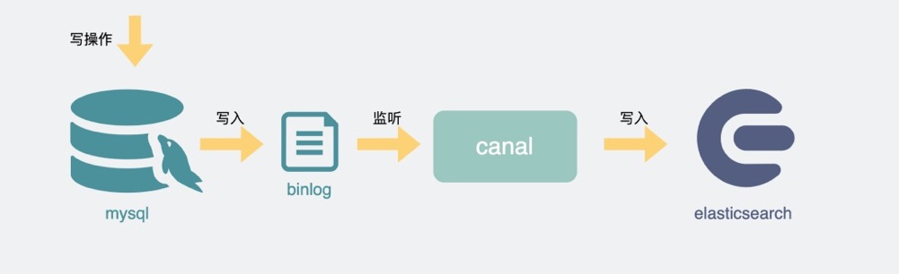
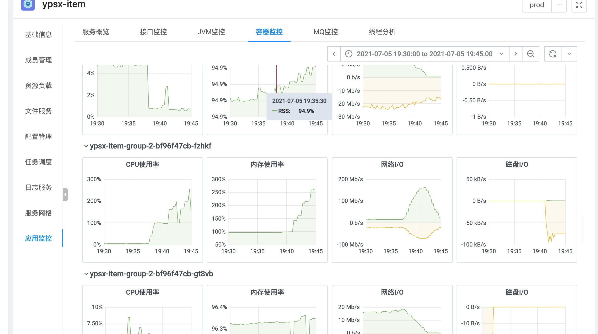
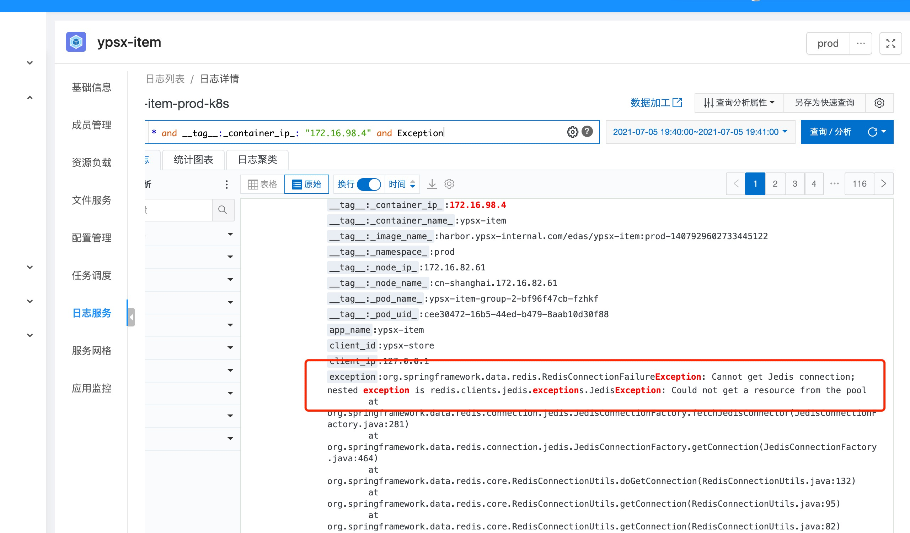
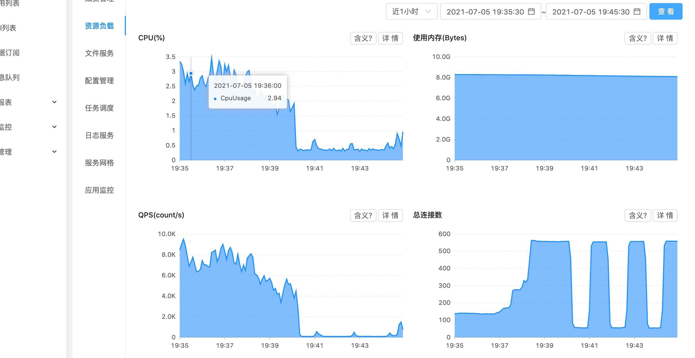
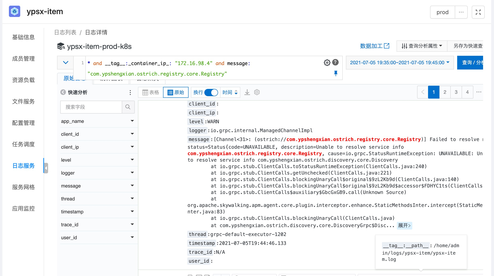
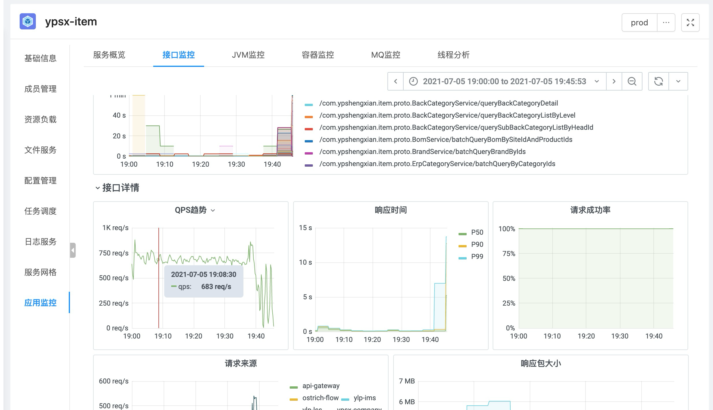

# 一、自我介绍

你好，我叫刘旺杰，19年毕业后我就来杭州这边工作了，最近两年就职于谊品到家科技有限公司，在商品团队做Java业务开发。


22年底加入政采云，一直到现在至今，一直负责溯采供应链商品测的相关功能建设。包含了早期溯采交易平台从0到1的搭建过程，再到跟外部供应商对接来进行商品的导入，通过订单商品推荐来提升溯采的GMV，以及现在负责京东物流和京东惠采相关的对接工作。


岗位职责：

商品业务Owner，制定商品层级模型和架构设计，保证系统的可扩展性和稳定性。

项⽬技术PM，牵头制定整体技术⽅案和业务需求拆解，协调上下游团队研发资源，把控研发进度和项⽬⻛险 管理等。


商品模型

订单推荐商品提升GMV

isv对接

商品标准库建设

商品铺货联动

军采副食品项目


1、商品系统本身的量级，包括流量、稳定性这条线
2、架构层面的体现
3、技术或者业务结果

面试层面除了要看本身负责的东西，还会看商品领域往外的延伸，以及这三个项目之间的联系，从erp-供应链商品-平台商品应该是一个整体。

作为架构owner，架构的设计思路、问题、难点、扩展、稳定性等等，要考虑全面，都准备下。


# 二、职业技能

## 操作系统

1. 进程通信有哪些方式，什么原理

匿名管道：只能用于有亲缘关系的进程间，通过文件描述符访问，半双工

有名管道：无亲缘关系的进程间通信，创建一个特殊的文件

消息队列：存放在内核空间，链表形式保存，如果不读取或者删除会一直保存

共享内存：两个进程不同的虚拟内存映射到同一块物理内存

信号

信号量：一种计数器，用于控制对共享内存的访问，P操作申请资源，V操作释放资源

套接字：不同主机间进行网络通信

2. 进程、线程、协程的区别

进程：

进程是操作系统分配资源的最小单位，每个进程都有自己独立的地址空间和资源进程之间相互独立，不能直接访问对方的资源

进程间切换开销较大，包括保存和恢复进程状态、切换地址空间等，通常由操作系统负责管理线程：

线程是进程内的一个执行单元，是CPU调度的最小单位，多个线程共享同一进程的地址空间和资源，包括全局变量，静态变量等

线程自己基本上不拥有系统资源，只拥有一点在运行中必不可少的资源(如程序计数器,一组寄存器和栈)

线程之间的切换开销较小，通常由操作系统的线程调度器负责管理多线程程序只要有一个线程崩溃，整个程序就崩溃了，但多进程程序中一个进程崩溃对其他进程没影响

协程：

协程是一种轻量级的线程，也称为用户态线程或者轻量级线程，它由用户程序控制而不是操作系统控制

协程可以在同一个线程内实现并发执行，通过协作式调度来切换执行权，可以实现非抢占式多任务处理协程之间的切换开销非常小，因为切换是由用户程序自己控制的，不需要操作系统介入协程常用于处理大量的、IO 密集型的并发任务，例如网络编程、异步IO 等场景

，协程是异步

3. 虚拟内存中COW（写时复制）算法的理解

通过写时复制，读时共享，实现在共享资源上进行修改而不影响其他进程（在需要修改共享资源时才复制到私有内存空间中进行修改，以减少不必要的内存拷贝，节省资源）

4. 物理内存和虚拟内存的区别

虚拟内存允许应用程序访问比实际物理内存更大的内存空间。将物理内存与磁盘空间结合，从而使应用程序能够在需要时使用更多的内存。扩展可用内存，共享内存，内存保护（使得不同的进程相互隔离避免冲突）

5. 缺页怎么处理
6. 用户态和内核态的区别

用户态只能受限地访问内存，且不允许访问系统硬件资源，没有占用CPU的能力，CPU资源可以被其它程序获取；内核态可以访问内存所有数据以及系统硬件资源，也可以进行程序的切换

当用户程序需要执行特权操作或访问受限资源时，需要通过系统调用向操作系统发起请求。系统调用会触发由用户态切换到内核态，并将控制权转移到操作系统内核，由内核执行相应的操作。

为什么要分？

安全性，封装性，利于调度

7. 一个进程open磁盘文件，read文件，write，close过程去判断内核态和用户的执行

Open:用户态调用open函数，通过系统调用进入内核态，内核进行检查，找到文件描述符返回给用户态；Read:用户态调用read函数，通过系统调用进入内核态，内核态检验文件描述符，找到文件对象，读取相应字节数到缓冲区，内核将数据从内核缓冲区拷贝到用户进程缓冲区，返回读取字节数给用户进程；Write: 用户态调用write函数，通过系统调用进入内核态，内核态检验文件描述符，将数据从用户态进程的缓冲区拷贝到内核缓冲区，再将内核缓冲区的数据写入文件，返回写入字节数给用户态进程；Close: 用户态调用close函数，通过系统调用进入内核态，检查文件描述符合法性，更新文件描述符，并返回。

8. 线程相对进程的优点
9. 用户线程和内核线程之间的映射关系是什么样的

一对一（并发性强，开销大），多对一（并发性差，开销小），一对多

10. 用户线程切换会陷入到内核态嘛

不会，用户线程是在用户空间实现的线程，不是由内核管理，是由用户态的线程库来完成线程的管理，切换也是；

11. 用户进程为什么能比线程做到更轻量
12. 多路复用/epoll、poll、select区别，epoll为什么高效

单个进程/线程可以同时处理多个IO请求。

Select：文件描述符放入一个集合中，调用select时，将这个集合从用户空间拷贝到内核空间（缺点1：每次都要复制，开销大），由内核根据就绪状态修改该集合的内容。（缺点2：集合大小有限制）；采用水平触发机制。select函数返回后，需要通过遍历这个集合，找到就绪的文件描述符（缺点3：轮询的方式效率较低），当文件描述符的数量增加时，效率会线性下降；poll：和select几乎没有区别，区别在于文件描述符的存储方式不同，poll采用链表的方式存储，没有最大存储数量的限制；相比select和poll每次查询都将文件描述符集合从用户空间拷贝到内核空间，epoll在内核空间利用红黑树对文件描述符集合进行了保存，避免了拷贝。此外，epoll在内核空间维护了一个双向链表用于保存就绪的文件描述符，当文件描述符就绪时采用回调机制将该文件描述符加入链表中；支持水平触发和边缘触发，采用边缘触发机制时，只有活跃的描述符才会触发回调函数。

13. 线程同步有哪些方式

互斥锁：互斥锁是内核对象，只有拥有互斥锁的线程才有访问共享资源的权限，保证同一时刻只有一个线程可以访问。信号量：信号量是内核对象，它允许同一时刻多个线程访问同一资源，但是需要控制同一时刻访问此资源的最大线程数量。如果为0，则将线程放入一个队列中等待

条件变量：条件变量用于线程间的同步，通常与互斥锁一起使用，用于等待某个条件成立后再继续执行。事件：允许一个线程在处理完一个任务后，主动唤醒另外一个线程执行任务。事件分为手动重置事件和自动重置事件。手动重置事件被设置为激发状态后，会唤醒所有等待的线程，而且一直保持为激发状态，直到程序重新把它设置为未激发状态。自动重置事件被设置为激发状态后，会唤醒一个等待中的线程，然后自动恢复为未激发状态。临界区：任意时刻只允许一个线程对临界资源进行访问。拥有临界区对象的线程可以访问该临界资源，其它试图访问该资源的线程将被挂起，直到临界区对象被释放

14. 同步与互斥

同步：多个进程因为合作而使得进程的执行有一定的先后顺序。比如某个进程需要另一个进程提供的消息，获得消息之前进入阻塞态；互斥：多个进程在同一时刻只有一个进程能运行到临界区

15. 并发、并行和异步

并发：在一个时间段中同时有多个程序在运行，但其实任一时刻，只有一个程序在CPU上运行，宏观上的并发是通过不断的切换实现的；并行：在多CPU系统中，多个程序无论宏观还是微观上都是同时执行的异步（和同步相比）：同步是顺序执行，异步是在等待某个资源的时候继续做自己的事

16. 锁有哪些

互斥锁，读写锁，自旋锁（自旋锁是一种忙等待的锁，当线程尝试获取锁时，如果锁已被其他线程占用，该线程将会一直在一个循环中不断地检查锁是否可用），条件变量

17. 进程调度策略有哪些

先来先服务、最短作业优先、最短剩余时间优先、时间片轮转、优先级调度、多级反馈队列调度（多个队列，优先级递减，时间片递增）

18. 阻塞IO和非阻塞IO

阻塞IO：用户执行read，线程被阻塞，直到内核数据准备好通知线程；

非阻塞IO：read后立即返回，此时不断轮询内核（需要主动去检查），询问数据是否准备好；（均为同步）

19. 同步IO和异步IO

异步IO：read后直接返回，内核自动将数据拷贝到用户空间，不用进程自己完成（不需要主动检查），完成后通知进程。

20. 零拷贝

数据不需要从一个内存区域复制到另一个内存区域，从而减少上下文切换和cpu拷贝时间。

普通的文件传输：dma拷贝进内核，read，发生1次cpu拷贝进用户空间和2次上下文切换，write发生1次cpu拷贝进内核空间和2次上下文切换，最后由dma拷贝进硬件。一共4次上下文切换和4次拷贝。mmap+write：内核缓冲区地址与用户缓冲区进行映射，从而实现内存共享，减少一次拷贝，一共4次上下文切换和3次拷贝（1次cpu拷贝从输入缓冲区到输出缓冲区）。sendfile(kafka)：直接由dma完成数据的拷贝，不需要cpu参与，一共2次上下文切换和2次拷贝（没有cpu拷贝）。

21. 死锁产生条件

互斥、占有并等待、非抢占、循环等待

22. 页式存储和段式存储

把虚拟内存和物理内存划分为大小相等的部分称为页，分配时以页为单位。虚拟内存地址被切分为页号和偏移量，根据页号从页表中查询对应的物理页号，加上偏移量后得到物理内存地址。


虚拟内存按照自身逻辑关系划分为若干个段（segment）（如代码段，数据段，堆栈段），内存空间被动态划分为长度不同的区域，分配时以段为单位，每段在内存中占据连续空间，各段可以不相邻； 

23. 有哪些页面置换算法

在程序运行过程中，如果要访问的页面不在内存中，就发生缺页中断从而将该页调入内存中。此时如果内存已无空闲空间，系统必须从内存中调出一个页面到磁盘中来腾出空间。页面置换算法的主要目标是使页面置换频率最低（也可以说缺页率最低）。

    1. 最佳页面置换算法：置换以后不需要或者最远的将来才需要的页面，是一种理论上的算法；
    2. 先进先出FIFO；
    3. 时钟算法：使用环形链表，再使用一个指针指向最老的页面，若其访问位为1，给第二次机会，并将访问位置0；
    4. 最近最少使用算法LRU: 置换出未使用时间最长的一页；实现方式：维护时间戳，或者维护一个所有页面的链表。当一个页面被访问时，将这个页面移到链表表头。这样就能保证链表表尾的页面是最近最久未访问的。

触发页面中断的原因：访问未映射的页面；访问已被置换的页面；

1. 异常控制流：陷阱、中断、异常和信号

陷阱是有意造成的“异常”，是执行一条指令的结果，主要作用是实现系统调用，当进程执行这条指令后，会中断当前的控制流，陷入到内核态；

中断由处理器外部硬件产生，包括I/O中断，定时器引起的时钟中断，断点中断等。分为上半部和下半部分：上半部直接处理硬件请求，也就是硬中断，主要是负责耗时短的工作，特点是快速执行；下半部是由内核触发，也就说软中断，主要是负责上半部未完成的工作，通常都是耗时比较长的事情，特点是延迟执行；异常是一种错误情况，是执行当前指令的结果；

信号的作用是用来通知进程发生了某种系统事件

2. CPU缓存一致性

CPU多个核心的缓存在操作共享数据时，可能造成各核心自己的缓存内数据不一致，要将修改后的数据广播出去，以及多个事务时保证串行化，可以通过MESI协议，将缓存状态定义为修改、独占、共享、失效，来减少总线压力。

## 计算机网络

全连接和半连接

- **半连接**：是指在TCP三次握手过程中，客户端向服务器发送SYN请求后，服务器收到并回复SYN+ACK，此时连接处于SYN_RCVD状态。这种状态下的连接被称为半连接，因为此时连接尚未完全建立，客户端还需要发送一个ACK确认包来完成三次握手，使连接进入ESTABLISHED状态。在Linux内核中，半连接会存储在半连接队列（SYN队列）中。
- **全连接**：是指TCP三次握手完成后，客户端和服务器之间的连接完全建立，处于ESTABLISHED状态。此时，连接被存储在全连接队列（accept队列）中，等待应用程序通过`accept`函数将其取出。


# 三、项目介绍

## 3.1 溯采供应链平台

**背景介绍**

溯采供应链平台的⽬标是帮助中⼩商家解决货物供给问题。 通过引⼊品牌⼚商或对接京东、1688等⽅式整合上游 优质供应商资源，汇集下游出货量后进⾏聚量议价，获取更具竞争⼒的定价权。⽀持⼩B从溯采供应链平台进⾏商 品铺货回采，完成交易流程。

供应链商品系统主要实现了多渠道的发品链路及商品⽣命周期管理，向外部平台的 商品铺货和信息联动 ，外部ISV 的开放接⼊能⼒，以及标准商品库的建设。

**工作成绩**

负责溯采供应链平台商品体系从 0 到 1 的 DDD 实践落地，制定 分层的商品领域模型，并根据模型进⾏微服 务拆分。

使⽤ Sharding-JDBC 对商品铺货关系表进⾏ ⽔平拆分，设计 平滑数据迁移⽅案。

通过 MQ和本地消息表 结合 任务框架 保证 千万量级 铺货商品的 商品信息联动。

通过 数据分析 挖掘业务增⻓点，结合 NER 和 类⽬预测 对⼩B订单进⾏ 商品推荐， 平均 提升有效GMV 26.7%。

基于AOP 设计 通⽤注解缓存查询组件，低代码侵⼊，结合 多级缓存技		术 提升核⼼链路性能70%。

**岗位职责**

商品业务Owner，制定商品层级模型和架构设计，保证系统的可扩展性和稳定性。

项⽬技术PM，牵头制定整体技术⽅案和业务需求拆解，协调上下游团队研发资源，把控研发进度和项⽬⻛险 管理等。

## 3.2 谊品自研ERP系统

谊品自研ERP系统，摆脱对富基、康铭泰克等第三方ERP系统的依赖。搭建数据中台和业务中台，建立数据服务层并开放数据服务能力，提供运营分析和决策支撑，以达到数据反哺业务的目标。商品中心作为业务中台之一，负责提供管理商品数据，同时要够快速支撑供应链货品和多渠道销售商品的创建和管理，及时响应业务诉求，实现业务快速扩张。

**涉及技术：**gRPC、springBoot、myBatis、pulsar、mysql、redis、elasticSearch、apollo

**岗位职责**：负责相关技术方案设计与落地、系统编码实现

**快捷开营业部**

监听商户组织变更消息，设计新开营业部后商品的同步功能，极大的缩减运营人力成本。

**门店品类箱子**

为线下门店提供品类运营能力和销售管控能力，支持清洗负毛利商品，指导清退门店非畅销品。

**问题的定位**

1. 确认刚才是否有过代码变更和部署，因为有比较高的概率是刚才变更的代码又搞坏了；（是否是由发版导致）
2. 追踪链路日志看链路是否有异常报出；（看下链路中有没有报错）
3. 通过RPC的控制台调用看接口输入输出是否符合预期；（查最终db的数据对不对）
4. 追踪关键方法的入参和出参，看是否有问题；（如果db数据对，但接口返回数据不对，那么就要看是哪个方法出问题了）
5. 定位到方法细节后，推理逻辑是否有问题；（找到对方法看逻辑是否又问题）
6. 如果无法通过推理，那就最后一招，回放异常流量debug， 这样肯定能够找到原因；（实在不行debug 一步一步看）

### 查询性能优化

某个链路耗时比较长，基于链路追踪进行性能优化步骤：

1. 通过实际流量制造一个耗时较高的trace;
2. 通过traceId进行链路耗时分析．看清楚耗时最多的原因；
3. 针对对原因找解决方案，可能的方案有
   1. 减少数据访问次数或者计算量，常见手段是增加cache;
     - 机器本地缓存
     - 分布式缓存redis
     - 页面缓存
   2. 增强处理速度，比如多线程加速；
   3. 减少循环调用次数。比如请求合并后再分发；
   4. 减少数据处理范围，比如减少查询内容，异步加载分页；
   5. 逻辑简化，比如逻辑进行优化，或者非核心逻辑异步化等；
4. 改掉以后，回放同样的case，看性能消耗是否满足预期，不满足预期继续优化；

## 3.3 谊品供应链商品系统

随着业务的迅速发展，商品系统中的一些弊端也逐渐暴露出来，例如 数据扩散问题导致地点纬度数据量过大，影响DB查询性能；商品模型定义不够明确，接口透出字段大而全，接口性能无法保证；商品中台和门店端都存在导入导出场景，并且导入的细分场景复杂繁多，需要进行功能的收口 等。

因为供应链测和销售测所关注的商品属性存在很大差异，之前这些字段都耦合在一张表里，所以要进行表的垂直拆分。同时商品系统也进行了更细粒度的微服务拆分，分离出商品基础数据、销售商品、供应链货品三个微服务系统，它们提供核心的原子服务，由上层系统进行组合编排然后对外输出业务能力。

**涉及技术**： gRPC、springBoot、pulsar、myBatisPlus、powerJob、elasticSearch、shardingjdbc、redisson、nacos

**岗位职责**：商品基础数据负责人 负责核心的领域设计与编码、CodeReview、项目发布计划以及线上运维，以及推进外域进行接口切换

对需求理解，技术选型，代码的质量把控，线上问题处理，线上的相关指标，后期的迭代和重构。

## 主导项目1-商品基础数据服务DDD实践

### 项目背景和简介

最开始的时候商品对外只有一个模型，叫做商品模型，但是后来在业务演进过程中，供应链侧（库存、仓店、采购、调拨），销售测（营销、导购、交易、订单）所关注的商品属性有很大差异。比如：货品（采购生命周期、物流模式、供应商编码，采购单位、税率），销售商品（上下架状态、销售单位、换算比例）

但是我们在模型层面没有做很好的区分，导致接口透出的数据大而全，这样导致接口的性能在压测的时候得不到保障，外域在接口的使用上也存也安全隐患（后续做了应用层面的接口粒度鉴权）。

因此为了更好的区分和使用供应链货品模型和销售商品模型，所以对老的商品系统进行了更细粒度的微服务拆分。首先是最底层的数据表结构根据销售商品和供应链货品做了垂直拆分，拆成了商家纬度的商家商品表和商家货品表，地点纬度的地点商品表和地点货品表，同时由于地点纬度的数据量较大，所以进行了分库分表。我们的查询场景更多是在某个门店下查找符合条件的商品，所以我们将地点id作为分库分表健，一共分了 4库32表。

上层的的系统也跟着拆分成了销售商品系统和供应链货品系统，商品和货品的基础属性作为商品的主档，将商品主档、品牌、类目、属性标签 这几部分划分到商品基础数据服务系统中，这样就构成了三个最底层的系统，提供核心的原子服务。

其他还有 聚合ES查询的系统、监听binlog同步ES的系统、 处理商品异步任务的系统 和 对接业务中台的系统。

### 模型的好处 

模型的作用就是简化认知的东西，可以简化人对事物的认识过程。常见的模型不止领域模型，还有 JMM内存模型、ISO的网络模型。

刚入职的时候，如何能够快速的了解业务。通过模型就是一个比较好的切入点。它里面包含了领域的实体，以及实体之间的关联关系，一下子就知道了整个业务是怎么流转的。如果一开始就去看代码，这样很容易陷入一些代码细节中，很难看到业务的全貌。但如果通过模型对业务有了一个整体的认识之后，心中大致有了一个框架，这时候再去看代码就更像是一个查漏补缺的过程，看一些开源框架的源码也是类似，也去了解主干流程，之后再选择性的了解细节。

### CQRS

CQRS表示的是“命令和查询责任分离”，它用途是在于将领域模型与查询功能进行分离，让一些复杂的查询摆脱领域模型的限制，以更为简单的 DTO 形式展现查询结果。个人理解核心是为了分离数据存储结构，让开发者按照查询的功能与需要自由的选择数据方式。

这个和MySQL读写分离很相似。但是MySQL的读写分离强调的是物理数据库的分离，而CQRS更关注的是模型层面的分离。

MySQL进行了读写分离后，主从库的数据结构还是一样的，是为了分摊了数据库的压力，提高数据库层面的性能和可用性。

但是CQRS强调的是 command与query访问的数据模型不同，根据command与query的不同特性设计对应的数据模型。比如command更强调模型的范式化、完整性约束等；而query的模型更强调性能，可以不过多地受范式的约束、可以更多的数据冗余。

例如 command 用关系数据库，query用NoSQL数据库。当然command与query使用同一个物理数据库，query使用View也是可以的，这是与读写分离的区别。

> 也可以使用不同的物理数据库，如果数据表结构一样的话就类似于MySQL的读写分离。
>
> 表结构不同的话，就需要对应的handler 来处理 command事件，来更新query的的查询结果，这种方式是event sourcing。
>
> commond 和 query 可以部署在不同的应用上，也可以在同一个应用内的不同接口上体现，核心的目标是模型的分离。

**为什么采用CQRS？**

首先最终目的一定是性能的提升。CQRS允许读取和写入的负载独立缩放，这样可以减少锁的竞争。同时它可以分离读写数据的存储结构，读和写使用不同的存储方式。比如command用db，query用es，这样可以针对性的进行优化。

虽然我们现在只在模型上分离，没有在存储上做分离，但是如果以后要分离存储的话，模型分离也是第一步。还有一点就是领域模型对象在构建时会有诸多检查和多次对象转换，使用query模型可以尽可能的避免这些点。

### **为什么采用DDD？**

毋庸置疑「领域」在 DDD 中占据了核心的地位，DDD 通过领域对象之间的交互实现业务逻辑与流程，并通过分层的方式将业务逻辑剥离出来，单独进行维护，从而控制业务本身的复杂度

所以我们才需要用DDD的分层思想去重构一下以上的代码，通过不同的代码分层和规范，拆分出逻辑清晰，职责明确的分层和模块，也便于一些通用能力的沉淀。

- **DDD可以很好的指导微服务拆分和演进。**

  通过DDD 的方法来建立领域模型，划分领域边界，再根据这些领域边界从业务视角来划分微服务边界。可以很好地实现微服务的“高内聚、低耦合”。这样就解决了拆分的问题；其次微服务内部的实体都是以聚合为单位的（传统可能是按照类型比如service，pojo），聚合内实现了高内聚的业务逻辑。如果该微服务后边需要更细粒度的拆分，就可以按照聚合进行拆分，这样可以更好的进行服务演进。

  比如老商品拆分后分为商品基础数据服务、销售商品服务、供应链货品服务，而商品基础数据服务中的主档、类目、品牌、属性标签都是按聚合划分的，后期演进时可以拆成独立的服务。

- **实体采用充血模型对核心业务进行沉淀。**

  这点是DDD和三层架构的一个比较大的区别，传统的services层中承接全部的业务逻辑，可能会包含部分重复使用但比较核心的业务逻辑。将其中部分逻辑向下沉淀，针对同一实体相关的业务逻辑都在实体类中实现，跨多个实体的逻辑在领域服务内实现。领域服务通过组合编排实体的方法，供上层的应用服务调用。这样就构成了领域层的核心。（其他还有仓储层的接口）

  DDD提倡充血模型，尽量将业务逻辑归属到实体对象上（或者领域服务里）。在设计时我们主要考虑实体自身的属性和业务行为，实现领域模型的核心行为，不必过多考虑外部操作和业务流程，这样才能保证领域模型的稳定性。

  举个例子：一个运营下架所有商品，这个需求中，商品的上下架是商品实体的行为，属于领域层。而下架所有商品，这就要判断他是否有对应操作权限，属于应用层。比如他只能下架他品类权限内的商品，这个就是数据应用层的业务逻辑。

- **仓储层不再是简单的DAO，它可以将领域模型和数据模型解耦**

  仓储层会将内存中的领域对象进行持久化操作，领域层无须关注具体存储哪张表，怎么存。只需要关注业务逻辑。

  仓储层处理基础单元是聚合根，是服务于实体的，而不是具体的表。

- **CQRS将复杂查询摆脱领域模型的限制，分离领域模型和查询功能**

  由于构建领域对象的完整性约束，所以构建一个领域实体，往往还要去构建它包含的其他实体或者值对象。构建过程比较麻烦。

  其次从DTO=〉command=〉DO=〉PO 要经过多次对象转换。

  这些在查询的场景下完全是不需要的，查询时更希望以简单DTO展现查询结果。CQRS可以帮我们很好的解决这一点。

- **建立通用语言减少沟通成本。**

  确保业务术语没有二义性，可以帮助开发、测试、产品、运营、业务更好沟通。比如商品域中的主档、商品、货品 这些名词都对应领域实体，像 上架、下架、在售、停售 这些动词都代表实体行为。这个在商品域里边可能体现的不够明显，但是在金融、保险这类专业词汇较多的行业内有很好的效果。

### DDD-落地实践

**前期准备**

- 首先是跟产品对齐商品的模型和核心的业务逻辑。
- 针对之前接口大而全的问题，包括使用场景不明确的问题，找外域进行接口梳理，包括接口的出入参、使用场景和使用字段，然后整理成表格。消息梳理也同时在进行。
- 根据整理出来的表格，梳理业务与外域诉求，细分接口职能，定义核心原子服务。
- 将改动内容总结为接口替换表和消息替换表格给到外域，包括预计上线的时间。
- 当然我们这里不是一刀切，因为涉及外域的比较多，改造内容也比较多。线上新老接口会同时保留，新老消息也都会进行发送。新老数据也会做同步。只不过老的部分不动了，只在新的上做开发，这样逐步去推动外域做改造。

**代码落地**

在工程中，我们使用CQRS架构，充血模型来落地。首先明确聚合。例如门店、仓库、公司等等是聚合根。 聚合根：具有全局标识 实体：只在聚合内有唯一标识。
在分层架构中，接口层调用应用服务层，应用服务层仅负责业务逻辑，比如说调用领域对象的行为。 例如现在有一个保存门店的方法。 在内存中构建出来一个门店对象，然后调用门店对象的行为来对内存中的领域对象进行修改。 同时行为会产生事件。 事件会存储在对象内部。当调用仓储层store方法提交事务之后，会调用事件发布将这些事件发布出去。 后续会有监听来实现 缓存清理和消息发送。

**数据同步**


### DDD-遇到问题

第一个就是消息一致性问题。因为消息是由事件来驱动。 而消息又是业务中比较重要的一环。万一事务提交了但是消息因为各种原因发送失败了，那么对于下游业务就会存在问题。存在分布式一致性问题。

**解决：**
对于业务消息，我们更改了方案，采用本地消息表，在事务中写表。然后异步线程会去发送这条消息。并将其置为已发送。 当时也考虑要引入其他团队开发的 分布式流程任务引擎来解决一致性问题，考虑到成本比较高，且我们编辑的情况不多，就采用了本地消息表。


## 主导项目2-商品异步任务系统

**使用TTL传递ThreadLocal**

**借鉴tomcat线程池，提高性能**

模版方法模式设计顶层的抽象类来控制流程，具体的业务实现

设计商品异步任务系统，承接业务对商品的大批量变更和数据导出操作。

Excel的导入导出在商品域中里有大量的应用场景，尤其是 导入操作，极大提高了业务人员操作系统的便捷性。 

在原有商品模型里，Excel导入导出处理部分是由PMS工程来完成的，在使用过程中 遇到了一些问题，如：

- 要处理的Excel数据量过大时，会占用过多系统内存，影响机器性能，甚至造成 服务不可用的情况。
- 在处理过程中，遇到机器重启或其他导致处理中断时，没有重试机制，无法保 证任务的执行结果。
- 无法对处理流程进行很好的扩展。
- 用户在操作后，无法感知任务处理的进度。

在本次的商品重构中，针对以上问题进行了一些架构方面的调整。

PMS不再负责Excel导入导出数据的解析校验，这一部分操作由独立的Task工程 来承载，

PMS只提供查询和持久化明细数据的服务。

 Task工程通过接入流程引擎Engine，来提供失败重试机制，以保证任务执行的 结果。通过流程引擎的流程编排服务还可以更方便地对流程编排控制，方便进 一步的扩展。

 后续还会提供对任务的监控，以及执行进度的感知。


## 缓存方案

https://www.51cto.com/article/709819.html

旁路缓存的模式

ES->redis-> db

为解决db的读扩散问题，

es天然分片，而且内部利用倒排索引的形式来加速数据查询。

而且将mysql接入es也非常简单，我们可以通过开源工具 canal 监听mysql的binlog日志变更，再将数据解析后写入es，这样es就能提供近实时的查询能力。



## 通用注解缓存查询组件

基于注解设计通用缓存查询组件，不侵入代码，提高接口查询性能。

https://blog.csdn.net/youbl/article/details/113052502

1. 基于注解，不侵入代码，使用Spring AOP实现，轻量级，相比Spring 提供的注解缓存，可扩展性更高一些。

2. kernelCache缓存的删除是基于binlog的，基础架构会将bin log解析发送至消息队列，我们监听消息去处理删缓存，这里也可以做一些延时双删的操作，来保证db缓存的一致性。也可以由业务逻辑内自行进行缓存删除。

3. 还有一些都是默认的Redis缓存实现不支持，需要去实现相关扩展接口的。

   - 默认的RedisCacheManager是使用JDK的序列化，性能差；我们自己的缓存组件也就是kernelCache，是可配置序列化方式，默认gson。

   - 默认的是无法配置不同的缓存过期时间；kernelcache可以根据缓存枚举中的过期时间时间来差异化配置。

   - 默认是同步写缓存的，而kernelCache是异步线程池写缓存。

## 流程引擎重试保证最终一致性

**客户端**

- 业务方引入springboot-starter包，通过SPI加载启动配置类
- 向注册中心注册引擎服务，用来和服务端进行通讯，如流程点火、接受服务端推送任务、回调通知服务端、获取服务端的配置信息等
- 扫描当前实例标识的任务步骤，完成初始化，如多种线程池（接受任务线程池、通知服务端执行结果的线程池、具体的工作线程池）

**服务端**

- 启动向服务注册中心注册引擎点火的服务

- 提供业务配置相关的流程及，向客户端请求步骤信息

  

通过注解的方式将需要进行rpc调用的步骤包装起来，可以由外部系统进行步骤的编排和远程调用。外部系统中可以控制调用的时间以及获取调用结果，还支持步骤失败的重试，以及报警。


流程引擎接入

- 调用方引入依赖包，依赖包里会使用SPI注册一个引擎的服务

- 将需要保证最终一致性的rpc调用包装成执行步骤（processor）。每个processor都有自己的唯一标识

- 将原来多次rpc调用的地方，进行引擎点火，点火需要传入序列化后的入参和指定唯一的流程id（一个流程相当于原来的本地事务）

- 去引擎的管理后台对流程进行步骤配置，步骤之间可以串行也可以并行。

  

流程引擎引擎接入：

配置相关：

1. 配置项目模块，engine 服务端 提供的中台页面配置接入引擎项目对应的项目模块
2. 配置任务流程，在中台页面的对应项目模块中，创建对应的任务流程，每个流程中细分为多个步骤。引擎系统用来 **尽可能** 保证每个任务流程的最终一致性，也就是保证流程里的每个步骤都会执行成功，如果执行失败的话支持任务的重试，如果该任务业务校验上就失败，无论重试多少次都不成功，那么这个任务会告警，需要人工介入处理。
3. 编排任务步骤，任务流程进行任务步骤的编排，可以串行，也可以并行，也可以先并行后串行，这点在系统切换中经常可以用到，比如新系统中数据变更需要发新老的消息，如果切换完成，不再需要发送老的消息，只需要将发送老消息的步骤移除即可，不需要系统发布。

代码开发：

1. 引入 engine-springboot-starter

2. 继承 `AbstractEngineStepHandler` 类实现任务步骤，在 `process()`中定义业务逻辑，并将该类用 `@EngineTask` 注解标注。

   ```java
   //根据updateKernelProduct在任务流程中编排任务
   @EngineTask(value = "updateKernelProduct", desc = "更新主档") 
   ```

3. 在需要保证分布式事务最终一致性的地方，通过 EngineOperateService 对 任务流程 进行点火。任务流程的编码也需要在业务方来指定，并在engine中台进行配置。

## 流程引擎对比本地消息表

**本地消息表**

1. 本地消息表与业务耦合在一起，难于做成通用性，不可独立伸缩。
2. 本地消息表是基于数据库来做的，而数据库是要读写磁盘IO的，因此在高并发下是有性能瓶颈的

**流程引擎**

1. 以中间件的方式存在，不与业务耦合，通用性强，可以独立伸缩。
2. 对业务失败的感知比较及时，处理手段上更便捷

## 表结构优化

- **为什么分表？**

> 首先第一点是主表字段过多了。 有很多垃圾字段。
> 另外我们希望推进外域根据业务场景来辨别实际使用的业务实体类型。根据不同的实体用不同的表。还有就是需要去掉一些类型。

- **分表方案**

> 首先是写的问题。原先依赖主键Id。现在分表了，为了兼容性，不同实体Id全局唯一。因此我们采用了分段发号策略。在主表中找到目前已有的最大的Id，加一位，然后根据不同的实体采用不同的号段。基于数据量不大的情况下，不需要引入分布式发号服务。降低复杂度。
> 同时也可以根据号段来区分新老Id与类型。

不要做过早的优化，没事别上来就分100个表，很多时候真用不上。

## 线上机器CPU100%

排查线上机器 CPU 负载 100%与服务不可用问题。

7⽉5号晚上 19点40分 接到电话反馈商品服务不可⽤，销售端相关依赖商品服务的⻚⾯展示空⽩⻚，后台ERP系统商品选品，类⽬接⼝⻚⾯提示系统异常。

以下是问题分析定位的过程： 



**第⼀步 workspace 查看监控，以及杨航反馈的截图，有⼀台商品的Pod的 CPU使⽤率和内存使⽤率飙⾼，单台POD服务不可⽤，并定位这台异常的pod的 容器Ip为 192.168.98.4**

但从反馈的频率来看，商品有26个pod实例，线上每次刷新都是空⽩⻚；从 分析上来看GRPC的负载策略是随机 +轮训，不可能每次都是空⽩⻚，⻚⾯的报错⼏乎是每次刷新必现。带着这个疑点去对⽇志进⾏了分析，从19点40 开 始，按分钟的粒度逐步查询异常的⽇志，排查的过程中发现出现了如下的⽇志：



 获取不到Jedis链接⼀般来说有两种可能： 

**1、Redis的负载很⾼，响应很慢或者没有链接可以分配，会导致客户端的连接池获取不到链接**

**2、应⽤的负载很⾼，CPU没有资源来调度应⽤线程，这个时候也会造成链接Jedis的请求⻓时间没有响应，导致新来的请求把池中的链接资源分配光但不能及时释放链接的场景，也会导致这样的错误。**

从时间上来分析，19点40的节点，应⽤的CPU使⽤已经 250%，cpuLoad全 被占⽤，内存使⽤率也满了，很容易可以分析出这个时间的应⽤线程是没有资源被CPU调度到的，都是挂起的状态，⾃然Jedis的链接是⻓时间没有响应的。推断属于第⼆种场景，于是⼜去看了Redis和MySQL的负载情况（MySQL是正常的 这⾥就不截图了） 



可以很明显的看到，Redis除了链接数激增，响应时间和负载都是正常的， ⽽QPS骤降和连接数的上升，说明了在19点40这个点 请求⼀下变少了，但是 连接数增加；验证了我们上述推断，应⽤疯狂的向连接池申请创建链接，但却很⻓时间未释放链接（因为被应⽤Hold住了）

回到Jedis异常的⽇志点，以上可以分析得出Jedis并不是问题的引起⽅，这 是应⽤负载⾼了以后的⼀种报警形式，继续按⼀分钟的粒度往前推移，发现在3 分钟内存在⼤量的如下⽇志：



**这时⼜切换了别的Pod所在的容器的IP，并⽆类似的⽇志，于是猜测有没有 可能是因为服务发现中⼼在获取服务可⽤列表的时候只发现了⼀台实例，导 致所有的流量在某⼀个时间段都路由到了同⼀个服务实例上？如果是这样的话也 就能解释为什么26个Pod只有⼀个pod出问题导致整个商品服务都是不可⽤的 了。带着这个问题⼜重新去看了应⽤的负载和监控：**


可以看到出问题的pod和其他的Pod，CPU使⽤率，内存，⽹络IO流量，磁 盘在出问题的时间点趋势完全是呈反⽐的，看上去就像所有的请求 突然从别的实 例上都转移到了这个pod上。貌似也复核了我们之前的推断，有没有可能是服务 发现的负载出了问题，可⽤服务实例列表的缺失造成的负载不均；从⽽导致单台 应⽤⽆法承载整个集群的请求量？



这个时候带着疑问，⼜去查看了在出问题的点附近 是否存在⼤量的接⼝调 ⽤，或者导⼊导出等耗资源的操作 经过排查我们排除了导⼊导出操作造成的影响，同时可以较为明显的看到19点到 问题发⽣的点并没有接⼝调⽤量的激增。

⼤体分析下来可能就是 服务发现的负载问题，导致了POD压⼒瞬间过载 从 ⽽影响整个服务。


## 商品模型

谊品

商品中心为各域提供商品基础数据，其重要性毋庸置疑。

从使用层面上来讲，商品中心分为前台和后台，

前台商品，我们可以称之为销售商品，为前台业务，包括到家商品列表，商品 详情，购物车，订单，营销活动等提供基础数据支撑。

后台商品，我们可以称之为供应链货品，为采购、wms、库存等提供基础数据 支撑。

从管理层面上来讲，商品中心分为，商品基础资料（主档）、商家商品、地点 商品，

商品基础资料（主档），控制了商品编码的唯一性，作为商品的一个基础数据 模板；

商家层面，主要为中台商品，提供管理能力，商家商品的变更，影响到下发的 地点商品，商家商品也分为商家货品、商家销售商品。 地点层面，才是真正销售或采购的内容，地点商品也分为地点货品，地点销 售商品。基于商户组织的划分，商家商品维度，绑定的是商家id；地点商品维度对 于谊品生鲜（线下）绑定的是门店id、配送中心id，对于谊品到家（线上）绑定的 是营业部id、配送中心id。

本次系统改造只对接到家销售渠道， 对于平台销售商品测， 下发到地点是 通过运营组控制一批营业部进行下发的。 所以本次地点商品， 主要是到运营组 维度的商品ES查询列表。

政采云

商品模型分为

基础支撑层：品牌库 类目库 类目属性库

模版规则层：产品规格库    标准商品库 spu/cspu库

平台层：平台商品库  供应链商品库 

供应货品层：机构商品库  供应链店铺商品库

销售商品层：基础商品库 协议商品库


 

## 系统拆分

ypsx-kernel-product：商品基础数据服务，提供商品主档，类目，品牌，属性等管 理和查询能力。

ypsx-kernel-item：销售商品服务，提供商家商品，销售范围，地点商品的创建、修 改等管理能力，以及支撑外域对销售商品属性查询的能力。

ypsx-kernel-goods：供应链货品服务，提供商家货品，供货范围，地点货品的创 建、修改等管理能力，以及支撑外域对货品属性查询的能力。

ypsx-titan：DB同步到ES的数据通道，解析数据库binlog，聚合商品ES的数据结 果，存储到ES。内部直接连接商品的数据库，监听到binlog消息，反向查数据库组 装数据，binlog的解析采用了Maxwell。

ypsx-matrix：ES读取服务，将DB的查询服务与ES的查询服务解耦，提供统一索引 查询入口。针对索引维度的通用抽象查询方法。

ypsx-kernel-flow：商品流程服务，用于聚合整体的商品发布流程，里面通过流程引 擎保证分布式事务中数据的最终一致性。例如：商家商品提报发布时，最终需要先 下发营业部商品，然后修改商家商品的状态为可见同时创建商家商品和运营组的关系。这个流程里有两步，可以通过flow来编排好流程，提供完整的方法给管理后台 调用。

 ypsx-kernel-pms：商品管理后台的api服务，提供和前端交互的api接口，内部聚合 商品、价格、库存的底层服务，有自己的防腐层和内部针对管理后台的领域模型， 以商品为骨架，聚合价格和库存，支持后续其他系统的扩展。会包含较多的校验逻辑


## 线上数据指标

### 数据量大小

商品主档有10w左右，常用的商品大概在3000，剩下很多是业务早期

商家纬度有 

地点纬度有 目前总共2亿多 3000家门店  6个渠道 每家店有1.5w商品，地点商品是到具体的sku纬度，像快消品存在多规格的情况，称重品是存在多pluCode的情况，例如一颗白菜，早中晚的新鲜程度不一样，所以价格也不一样，就是通过plucode来做的区分，这样的话一颗白菜也算3个商品。而且1.5w是下发下去的商品，门店不一定会真正售卖。

### 机器指标

谊品

4核8G内存，26个pod

线上QPS平均是2000左右  高峰期是能上万

RT时间 是99%100ms之内  90%50ms

 

3w并发  30台机器   平均每台1000qps   RT 99%200ms  90% 100   单个线程1s可以处理5个请求


政采

core

6台4C8G

item-center

10台 6C16G 

### 线上tomcat配置

```
最大工作线程数，默认200。
server.tomcat.max-threads	1000
 
最大连接数默认是10000
server.tomcat.max-connections=10000
 
等待队列长度，默认100。
server.tomcat.accept-count=100
 
最小工作空闲线程数，默认10。
server.tomcat.min-spare-threads=100
```


## 技术方案设计

1. 看清楚之前的需求，把这个需求所在的场景和链路大致阅读一遍

2. 找到需求的变化点；

3. 分析变更的方案，涉及的内容可能会有：

   1. 数据结构会不会变，如何变；

   2. 交互协议会不会变，如何变，

      交互协议分为：

      1. 端和组件要不要变；
      2. 和下游接口要不要变；

   3. 执行逻辑会不会变，如何变，执行逻辑变更的细化考虑点：

      1. 是否变更域服务；
      2. 是否变更流程编排；
      3. 是否变更主干逻辑；
      4. 是否变更扩展点；
      5. 是否变更扩展点的内部逻辑，变更内部逻辑的时候，又可以进一步拆解：
         1. 重构原有的方法，覆盖之前的逻辑，那就需要进行回归；
         2. 通过逻辑路由到新的方法，这里需要增加路由逻辑；

   4. 稳定性方案；

   5. 发布方案；

## 服务稳定性

雪崩、隔离、服务降级、突发流量、缓存、数据冗余、熔断、限流、CDN、 数据库、CI、网络等方面， 聊聊如何保证基于微服务的系统稳定性。

### **服务雪崩**

微服务化后，一条完整链路由多个微服务协同完成，如果一个调用链上的某个节点出问题，很可能引发整个调用链路崩溃。

假设A服务依赖B服务，B服务依赖C服务，此时如果C服务故障，B的调用就不能及时返回，B的线程可能会阻塞等待和重试，如果这个时候还有源源不断的请求从A过来，B会在一定时间后因为线程阻塞耗尽线程池所有线程，同样A也会因为B服务的调用阻塞耗尽线程，最终A和B都无法对外提供服务，这样这条链路都发生了故障。

### **服务降级**

为了避免这种服务雪崩，我们需要做好服务降级，例如对接口超时进行兜底，返回默认值或者调用其他备用服务接口（根据实际业务）

常见的方式有 熔断， 限流， 数据冗余， 都属于服务降级的范畴。 还有手动降级的例子， 比如关掉一些非核心链路的耗时服务，像是对接ISV商品推品的接口， 避免影响到核心的服务。不管什么降级方式， 目的都是让系统可用性更高， 容错能力更强， 更稳定。

**熔断**隔离组件：Hystrix

**限流：**

促销活动或秒杀时， 访问量往往会猛增数倍。 技术团队在活动开始前一般都会根据预估访问量适当增加节点， 但是假如流量预估少了（实际访问量远大于预估的访问量）， 系统就 可能会被压垮。 所以我们可以在网关层（Zuul， Gateway， Nginx等）做限流， 如果访问量超出系统承载能力， 就按照一定策略抛弃超出阈值的访问请求（也要注意用户体验， 可以给用户返回一个友好的页面提示）。

可以从全局， IP， userID等多维度做限流。 限流的两个主要目的：1.应对突发流量， 避 免系统被压垮（全局限流和IP限流）2.防刷， 防止机器人脚本等频繁调用服务（userID 限流和IP限流）

除了网关层面的限流，还要做好应用层面的限流，这个通常会搭配鉴权来一起做，比如我们会限制哪些应用能调用我们的哪些服务，甚至可以细化到接口纬度，以及调用量的并发限制，这个的主要目的：1.统计管理外部对自身服务的依赖情况，知道有哪些业务哪些场景在调用我们的接口，后续做重构或者接口收口的时候可以找到具体的调用方，2.对外部调用流量进行限制，防止部分流量激增，造成整体的服务不可用。

可以使用Guava的RateLimiter单机版限流，也可以使用Redis分布式限流，还可以使用阿里开源组件sentinel限流。

**鉴权：**

从应用纬度管理对外提供dubbo服务调用情况，方便调用管理和流量分配。

**数据冗余**

在核心链路上， 服务可以冗余它依赖的服务的数据， 依赖的服务故障时， 服务尽量做到自保。 比如订单服务依赖库存服务。 我们可以在订单服务冗余库存数据（注意控制合理的安全库存， 防超卖）。 下单减库存时， 如果库存服务挂了， 我们可以直接从订单服务取库 存。 可以结合熔断一起使用， 作为熔断的Fallback（后备）方案。

**关闭非核心功能**

在服务压力过大时， 关闭非核心功能， 避免核心功能被拖垮。

例如， 电商平台基本都支持物流查询功能， 而物流查询往往要依赖第三方物流公司的系统 接口。 物流公司的系统性能往往不会太好。 所以我们经常会在双11这种大型促销活动期 间把物流接口屏蔽掉， 在页面上也关掉物流查询功能。 这样就避免了我们自己的服务被拖 垮， 也保证了重要功能的正常运行。

### 压力测试

了解系统的瓶颈

设计高并发系统，离不开最重要的一环，就是压力测试。就是在系统上线前，需要对系统进行压力测试，测清楚你的系统支撑的最大并发是多少，确定系统的瓶颈点，让自己心里有底，最好预防措施。 压测完要分析整个调用链路，性能可能出现问题是网络层（如带宽）、Nginx层、服务层、还是数据库或者缓存等中间件等等。
 loadrunner是一款不错的压力测试工具，jmeter则是接口性能测试工具，都可以来做下压测。


### CI测试&性能测试

CI测试， 持续集成测试， 在我们每次提交代码到发布分支前自动构建项目并执行所有测试 用例， 如果有测试用例执行失败， 拒绝将代码合并到发布分支， 本次集成失败。 CI测试可 以保证上线质量， 适用于用例不会经常变化的稳定业务。

性能测试， 为了保证上线性能， 所有用户侧功能需要进行性能测试。 上线前要保证性能测 试通过。 而且要定期做全链路压测， 有性能问题可以及时发现。


### APM系统

**系统日志**

**链路追踪**

服务化后， 一次请求会跨多个服务， 追踪问题也会变麻烦。 这时就需要能够追踪整个调用 链 路 的 工 具 ， 协 助 我 们 排 查 问 题 。 常 见 的 开 源 全 链 路 监 控 工 具 有 （ pinpoint ， skywaking， cat等）， 以Pinpoint为例简单介绍一下： Pinpoint基于JAVA， 利用字节码增强技术， 对服务零侵入， 以traceID串联各个服务， 已Plugin的方式支持不同API和中间件的监控， 灵活方便。

**系统监控**

我们需要一套完善的监控系统， 系统出问题时能够快速告警， 最好是系统出问题前能提前 预警。 包括系统监控（CPU， 内存， 网络IO， 带宽等监控）， 数据库监控（QPS， TPS， 慢查询， 大结果集等监控）， 缓存中间件监控（如Redis）， JVM监控（堆内存， GC， 线程等监控）， 全链路监控（pinpoint， skywaking， cat等）， 各种接口监控（QPS， TPS等）

### CDN

可以充分利用CDN。 除了提高用户访问速度之外， 页面静态化之后存放到CDN， 用CDN 扛流量， 可以大幅减少系统（源站）的访问压力。 同时也减少了网站带宽压力。 对系统稳 定性非常有好处。


## 性能指标

**TPS**

Transactions Per Second，意思是每秒事务数，一个事务是指一个客户机向服务器发送请求然后服务器做出反应的过程。客户机在发送请求时开始计时，收到服务器响应后结束计时，以此来计算使用的时间和完成的事务个数。

每个事务包括了如下3个过程：

- 用户请求服务器
- 服务器自己的内部处理（包含应用服务器、数据库服务器等） 　　
- 服务器返回给用户 　　

如果每秒能够完成N次这三个过程，tps就是N；有时，可能会将多个请求定义为一个事务，那么，完成一次这几个请求，就算一个tps。

通常 tps = 最大并发数 / 平均rt时间

**RT**

 响应时间RT(Response-time)，是一个系统最重要的指标之一，它的数值大小直接反应了系统的快慢。具体的是执行一个请求从开始到最后收到响应数据所花费的总体时间，即从客户端发起请求到收到服务器响应结果的时间。

**QPS**

Queries Per Second，意思是每秒查询率，是一台服务器每秒能够响应的查询次数，是对一个特定的查询服务器（比如是读写分离的架构，就是读的服务器）在规定时间内所处理流量多少的衡量标准。

区别

如果对一个页面请求一次，形成一个tps，但一次页面请求，可能产生多次对服务器的请求（页面上有很多资源，比如图片等），服务器对这些请求，就可计入“qps”之中；

但是，如今的项目基本上都是前后端分离的，性能也分为前端性能和后端性能，通常默认是后端性能，即服务端性能，也就是对服务端接口做压测

1. 如果是对一个接口（单场景）压测，且这个接口内部不会再去请求其它接口，那么tps=qps，否则，tps≠qps
2. 如果是对多个接口（混合场景）压测，不加事务控制器，jmeter会统计每个接口的tps，而混合场景是要测试这个场景的tps，显然这样得不到混合场景的tps，所以，要加了事物控制器，结果才是整个场景的tps

**PV**

PV（page view）即页面浏览量，通常是衡量一个网络新闻频道或网站甚至一条网络新闻的主要指标。
PV 即 page view，页面浏览量。用户每一次对网站中的每个页面访问均被记录 1 次。用户对同一页面的多次刷新，访问量累计。

根据这个特性，刷网站的 PV 就很好刷了。

与 PV 相关的还有 RV，即重复访问者数量（repeat visitors）。

**UV**

UV 访问数（Unique Visitor）指独立访客访问数，统计1天内访问某站点的用户数(以 cookie 为依据)，一台电脑终端为一个访客。

**IP**

IP（Internet Protocol）独立 IP 数，是指 1 天内多少个独立的 IP 浏览了页面，即统计不同的 IP 浏览用户数量。同一 IP 不管访问了几个页面，独立 IP 数均为 1；不同的 IP 浏览页面，计数会加 1。IP 是基于用户广域网 IP 地址来区分不同的访问者的，所以，多个用户（多个局域网 IP）在同一个路由器（同一个广域网 IP）内上网，可能被记录为一个独立 IP 访问者。如果用户不断更换 IP，则有可能被多次统计。

**GMV**

GMV，是 Gross Merchandise Volume 的简称。只要是订单，不管消费者是否付款、卖家是否发货、是否退货，都可放进 GMV 。

**RPS**

RPS 代表吞吐率，即 Requests Per Second 的缩写。吞吐率是服务器并发处理能力的量化描述，单位是 reqs/s，指的是某个并发用户数下单位时间内处理的请求数。
某个并发用户数下单位时间内能处理的最大的请求数，称之为最大吞吐率。

有人把 RPS 说等效于 QPS。其实可以看作同一个统计方式，只是叫法不同而已。RPS/QPS，可以使用 apche ab 工具进行测量

# 四、解决方案

## 分布式事务

常见的解决方案有：可靠消息最终一致性、最大努力通知型、TCC补偿性，项目示例基于`Spring Cloud`实现可靠消息最终一致性和TCC补偿性。

**1.可靠消息最终一致性**

服务模式：可查询操作，幂等操作

约束：被动方的处理结果不影响主动方的处理结果，被动方的消息处理操作是幂等操作

适用范围：

- 消息数据独立存储、独立伸缩，降低业务系统与消息系统间的耦合
- 对最终一致性时间敏感度较高，降低业务被动方实现成本

**2. 最大努力通知型（定期校对）**

服务模式：可查询操作，幂等操作

约束：被动方的处理结果不影响主动方的处理结果

适用范围：

- 对业务最终一致性的时间敏感度低
- 跨企业的业务活动

**3.TCC 补偿事务**

服务模式：

- TCC操作
- 可补偿操作
- 可查询操作
- 幂等操作

适用范围：

- 强隔离性、严格一致性要求的业务活动
- 适用于执行时间较短的业务（比如处理账户、收费等业务）


## 高并发常用方案

所谓设计高并发系统，就是设计一个系统，保证它整体可用的同时，能够处理很高的并发用户请求，能够承受很大的流量冲击。 我们要设计高并发的系统，那就需要处理好一些常见的系统瓶颈问题，如内存不足、磁盘空间不足，连接数不够，网络宽带不够等等，以应对突发的流量洪峰。

**1. 分而治之，横向扩展**

如果你只部署一个应用，只部署一台服务器，那抗住的流量请求是非常有限的。并且，单体的应用，有单点的风险，如果它挂了，那服务就不可用了。 因此，设计一个高并发系统，我们可以分而治之，横向扩展。也就是说，采用分布式部署的方式，部署多台服务器，把流量分流开，让每个服务器都承担一部分的并发和流量，提升整体系统的并发能力。

**2. 微服务拆分（系统拆分）**

要提高系统的吞吐，提高系统的处理并发请求的能力。除了采用分布式部署的方式外，还可以做微服务拆分，这样就可以达到分摊请求流量的目的，提高了并发能力。 所谓的微服务拆分，其实就是把一个单体的应用，按功能单一性，拆分为多个服务模块。比如一个电商系统，拆分为用户系统、订单系统、商品系统等等。 图片

**3. 分库分表**

当业务量暴增的话，MySQL单机磁盘容量会撑爆。并且，我们知道数据库连接数是有限的。在高并发的场景下，大量请求访问数据库，MySQL单机是扛不住的！高并发场景下，会出现too many connections报错。
 所以高并发的系统，需要考虑拆分为多个数据库，来抗住高并发的毒打。而假如你的单表数据量非常大，存储和查询的性能就会遇到瓶颈了，如果你做了很多优化之后还是无法提升效率的时候，就需要考虑做分表了。一般千万级别数据量，就需要分表，每个表的数据量少一点，提升SQL查询性能。
 当面试官问要求你设计一个高并发系统的时候，一般都要说到分库分表这个点。

**4. 池化技术**

在高并发的场景下，数据库连接数可能成为瓶颈，因为连接数是有限的。
 我们的请求调用数据库时，都会先获取数据库的连接，然后依靠这个连接来查询数据，搞完收工，最后关闭连接，释放资源。如果我们不用数据库连接池的话，每次执行SQL，都要创建连接和销毁连接，这就会导致每个查询请求都变得更慢了，相应的，系统处理用户请求的能力就降低了。
 因此，需要使用池化技术，即数据库连接池、HTTP 连接池、Redis 连接池等等。使用数据库连接池，可以避免每次查询都新建连接，减少不必要的资源开销，通过复用连接池，提高系统处理高并发请求的能力。
 同理，我们使用线程池，也能让任务并行处理，更高效地完成任务。大家可以看下我之前线程池的这篇文章，到时候面试官问到这块时，刚好可以扩展开来讲

**5. 主从分离**

通常来说，一台单机的MySQL服务器，可以支持500左右的TPS和10000左右的QPS，即单机支撑的请求访问是有限的。因此你做了分布式部署，部署了多台机器，部署了主数据库、从数据库。
 但是，如果双十一搞活动，流量肯定会猛增的。如果所有的查询请求，都走主库的话，主库肯定扛不住，因为查询请求量是非常非常大的。因此一般都要求做主从分离，然后实时性要求不高的读请求，都去读从库，写的请求或者实时性要求高的请求，才走主库。这样就很好保护了主库，也提高了系统的吞吐。
 当然，如果回答了主从分离，面试官可能扩展开问你主从复制原理，问你主从延迟问题等等，这块大家需要全方位复习好。

**6. 使用缓存**

无论是操作系统，浏览器，还是一些复杂的中间件，你都可以看到缓存的影子。我们使用缓存，主要是提升系统接口的性能，这样高并发场景，你的系统就可以支持更多的用户同时访问。
 常用的缓存包括：Redis缓存，JVM本地缓存，memcached等等。就拿Redis来说，它单机就能轻轻松松应对几万的并发，你读场景的业务，可以用缓存来抗高并发。
 缓存虽然用得爽，但是要注意缓存使用的一些问题：
 缓存与数据库的一致性问题
 缓存雪崩
 缓存穿透
 缓存击穿

**7. CDN，加速静态资源访问**

商品图片，icon等等静态资源，可以对页面做静态化处理，减少访问服务端的请求。如果用户分布在全国各地，有的在上海，有的在深圳，地域相差很远，网速也各不相同。为了让用户最快访问到页面，可以使用CDN。CDN可以让用户就近获取所需内容。

**8. 消息队列，削峰**

我们搞一些双十一、双十二等运营活动时，需要避免流量暴涨，打垮应用系统的风险。因此一般会引入消息队列，来应对高并发的场景。
 假设你的应用系统每秒最多可以处理2k个请求，每秒却有5k的请求过来，可以引入消息队列，应用系统每秒从消息队列拉2k请求处理得了。 有些伙伴担心这样可能会出现消息积压的问题：
 首先，搞一些运营活动，不会每时每刻都那么多请求过来你的系统（除非有人恶意攻击），高峰期过去后，积压的请求可以慢慢处理；
 其次，如果消息队列长度超过最大数量，可以直接抛弃用户请求或跳转到错误页面；

**9. ElasticSearch**

Elasticsearch，大家都使用得比较多了吧，一般搜索功能都会用到它。它是一个分布式、高扩展、高实时的搜索与数据分析引擎，简称为ES。
 我们在聊高并发，为啥聊到ES呢？因为ES可以扩容方便，天然支撑高并发。当数据量大的时候，不用动不动就加机器扩容，分库等等，可以考虑用ES来支持简单的查询搜索、统计类的操作。

**10. 降级熔断**

熔断降级是保护系统的一种手段。当前互联网系统一般都是分布式部署的。而分布式系统中偶尔会出现某个基础服务不可用，最终导致整个系统不可用的情况, 这种现象被称为服务雪崩效应。
 比如分布式调用链路A->B->C
 如果服务C出现问题，比如是因为慢SQL导致调用缓慢，那将导致B也会延迟，从而A也会延迟。堵住的A请求会消耗占用系统的线程、IO、CPU等资源。当请求A的服务越来越多，占用计算机的资源也越来越多，最终会导致系统瓶颈出现，造成其他的请求同样不可用，最后导致业务系统崩溃。
 为了应对服务雪崩, 常见的做法是熔断和降级。最简单是加开关控制，当下游系统出问题时，开关打开降级，不再调用下游系统。还可以选用开源组件Hystrix来支持。

**11. 限流**

限流也是我们应对高并发的一种方案。我们当然希望，在高并发大流量过来时，系统能全部请求都正常处理。但是有时候没办法，系统的CPU、网络带宽、内存、线程等资源都是有限的。因此，我们要考虑限流。
 如果你的系统每秒扛住的请求是一千，如果一秒钟来了十万请求呢？换个角度就是说，高并发的时候，流量洪峰来了，超过系统的承载能力，怎么办呢？
 这时候，我们可以采取限流方案。就是为了保护系统，多余的请求，直接丢弃。
 什么是限流：在计算机网络中，限流就是控制网络接口发送或接收请求的速率，它可防止DoS攻击和限制Web爬虫。限流，也称流量控制。是指系统在面临高并发，或者大流量请求的情况下，限制新的请求对系统的访问，从而保证系统的稳定性。
 可以使用Guava的RateLimiter单机版限流，也可以使用Redis分布式限流，还可以使用阿里开源组件sentinel限流。

**12. 异步**

回忆一下什么是同步，什么是异步呢？以方法调用为例，它代表调用方要阻塞等待被调用方法中的逻辑执行完成。这种方式下，当被调用方法响应时间较长时，会造成调用方长久的阻塞，在高并发下会造成整体系统性能下降甚至发生雪崩。异步调用恰恰相反，调用方不需要等待方法逻辑执行完成就可以返回执行其他的逻辑，在被调用方法执行完毕后再通过回调、事件通知等方式将结果反馈给调用方。
 因此，设计一个高并发的系统，需要在恰当的场景使用异步。如何使用异步呢？后端可以借用消息队列实现。比如在海量秒杀请求过来时，先放到消息队列中，快速响应用户，告诉用户请求正在处理中，这样就可以释放资源来处理更多的请求。秒杀请求处理完后，通知用户秒杀抢购成功或者失败。

**13. 压力测试确定系统瓶颈**

设计高并发系统，离不开最重要的一环，就是压力测试。就是在系统上线前，需要对系统进行压力测试，测清楚你的系统支撑的最大并发是多少，确定系统的瓶颈点，让自己心里有底，最好预防措施。 压测完要分析整个调用链路，性能可能出现问题是网络层（如带宽）、Nginx层、服务层、还是数据路缓存等中间件等等。
 loadrunner是一款不错的压力测试工具，jmeter则是接口性能测试工具，都可以来做下压测。

**14. 应对突发流量峰值：扩容+切流量**

如果是突发的流量高峰，除了降级、限流保证系统不跨，我们可以采用这两种方案，保证系统尽可能服务用户请求：
 扩容：比如增加从库、提升配置的方式，提升系统/组件的流量承载能力。比如增加MySQL、Redis从库来处理查询请求。
 切流量：服务多机房部署，如果高并发流量来了，把流量从一个机房切换到另一个机房。


# 五、场景题

## 短链系统

节省发送的内容，如短信发送的长度限制最大长度限制。

短链的生成是 发号器+62进制编码 ，对原始链接通过创建唯一id，然后讲id进行62进制转换。

访问到短链平台后再找出原链接进行重定向。

## 秒杀


**1、\**\**3000个数里面找最大的k个数**：堆排序，构造大/小根堆：从后到前，从倒数第一个非叶子节点len/2-1开始（buildHeap）；从上到下，根和大于根的最大子节点交换（adjustOnce）；排序：首尾交换，重新构造大/小根堆，重复操作。

时间复杂度：O(nlogk)

排序算法场景分析：

数据量较少：插入、选择

基本有序（原本有序，新插入元素）：插入、冒泡

随机分布：快速

数据量大：快速、堆、归并

稳定：归并、冒泡、插入、桶、基数

不稳定：选择、快速、堆

**外部排序：**将数据分成若干个小块，每个小块都能够放入内存中进行排序。通过归并排序等算法对每个小块进行排序后，再将所有小块合并成一个有序的大块（大根堆or小根堆）。

**2、****有一个文件，里面全部是不重复的整数，整数最大值不超过七位数，input是文件，output是一个文件，将文件里面整数排****序**：使用位图，每个位只代表整数是否存在，遍历每个读取到的整数，将位图中对应索引的值设为true，遍历位图，按顺序将值位true的数写入文件。

如何优化离散数据分布：采用分段位图，将数据分为多个段，仅当段内有数据时，才分配内存。

**3、\**\**亿级别搜索日志**，从中筛选出**top10的热词**。将数据分成多个小块，并在多台计算机上同时运行分布式程序。每个计算机都执行“map”和“reduce”两个阶段的操作：Map阶段：输入数据被分割成小块，每个块由一个特定的计算机节点处理。对于每个块，该节点会应用用户定义的“map”函数，将输入键值对映射为中间键值对。比如可以把文本文件中的每一行转化为(word, 1)的形式。Reduce阶段：所有中间键值对被收集合并，然后按照键进行排序，最终输出结果。每个计算节点都会应用用户定义的“reduce”函数，将具有相同键的值聚合在一起，生成最终结果。例如在上述例子中，reduce阶段可以把所有key为word的value相加，得到这个单词在文本中出现的次数。

**4、两个50亿url的文件**，找到其中**相同的url**，也是哈希分桶，接着内存够用了，接着在桶内用哈希表再查找相同的，也可以构建前缀树进行查找，若长度不会很长的话。

**5、**海量数据如何寻找中位数，从二进制最高位开始以0和1进行分治，找中点。

**6、\**\**秒杀系统**：发布秒杀活动时，将商品与库存写入redis。当用户进行抢购时，直接对redis的库存进行操作。扣减redis内库存数量后，发送扣减成功的消息到消息队列，由后续的订单服务和支付服务进行处理。最后再由mysql进行库存扣减。**超卖问题**：秒杀时分两步：首先判断库存是否充足，之后扣减库存数量。这两步必须要保证操作原子性；少卖问题：扣减了库存，但是消息没发出，订单生成失败，导致没有卖出去。扣减库存后，发送消息队列需要有重试策略，如果消息发送失败需要重试，超过重试次数后，则需要持久化到磁盘记录下来，由补偿服务扫描是否存在少卖问题，进行后续业务处理。

**7、\**\**40亿个qq号怎么去重**：大数据去重可以是用bitmap，可以分批次读入内存（将Bitmap按照一定的规则进行划分（如按照数据区间划分，0-10000是一个Bitmap），将其分成若干个较小的区块，每个区块对应一个Bitmap。这样可以避免一次性将整个Bitmap加载到内存中），将qq号对应的位置置为1，最后遍历位图即可得到去重过的qq号。进一步节省空间可以考虑使用位图压缩算法，或者多层级的位图，适用于较稀疏的数据分布。若对结果的准确性没有很严格的要求，也可以使用布隆过滤器，会存在一定的误判。

**8、\**\**密码如何传输和存储**：传输一定得用https，在服务端，通过原密码+salt经过哈希加密算法（可以使用慢哈希）进行比对，服务端一般不存储原始密码，而比较加密之后的密钥。多次输错后如何锁定：限制IP或限制用户，一般来说限制IP。基于Redis，key为标识IP登录的唯一标识符，value为输错次数；或者直接在mysql表内存储相应字段也可以。

**9、****推荐系统设计：**召回：粗筛->精排粗筛：对每个视频抽取特征进行聚类，计算每个视频和类中心的相关性，按照相关性进行排序。用户特征到来后，计算和每一类中心的相关性，筛选出相关性最高的前k类视频。精排：在前k类视频中，对每一类选出和相关性正相关数量的视频，推荐给用户

**10、\**\**广告系统设计：**

**架构层面：**

前端展示：用户通过微信客户端查看朋友圈页面。后端服务：负载均衡器分发请求，广告投放服务选择广告，用户画像服务构建用户画像，广告效果监测服务记录效果。数据存储：使用 MySQL存储数据，Redis 缓存高频数据，Kafka 或 RabbitMQ 处理异步任务。 （存储用户数据（基本信息、行为数据如点击历史、偏好设置），广告数据（存储广告的基本信息，投放规则，排期信息等），广告投放记录（记录广告的展示、点击等行为））**业务逻辑层面：**

广告选择：根据用户画像和广告排期规则选择广告。广告展示：展示广告给用户，并从缓存或数据库中获取广告数据。广告点击处理：记录点击行为，并将用户添加到广告屏蔽列表中。广告效果监测：记录点击率和转化率等指标，并优化广告投放策略。

**11、****分布式kv一致性哈希：**一致性哈希：包含两步：对存储节点进行哈希计算，如计算存储节点的IP哈希值，结果对2^32取余；对key进行哈希计算，结果对2^32取余；根据key的哈希值，顺时针寻找到的第一个存储节点，就是存储该key的存储节点。在一致哈希算法中，如果增加或者移除一个节点，仅影响该节点在哈希环上顺时针相邻的后继节点，其它数据也不会受到影响，但是一致性哈希算法并不保证节点能够在哈希环上分布均匀。为了解决分布不均匀的问题，加入虚拟节点，因为节点越多，分布越均匀。不再将真实节点映射到哈希环上，而是将虚拟节点映射到哈希环上，并将虚拟节点映射到实际节点，所以这里有「两层」映射关系。

## 其他

有几台机器存储着一亿淘宝搜索日志，你只有一台2G的电脑，怎么选出搜索热度最高的十个搜索关键词？

1. 分而治之，对原始数据进行分片，例如一亿的数据一次性无法全部加载统计，可以通过hash将数据分片到多个子文件，如1000个，这样一个文件的大小就只有10万的量级。还需要确保的是同一个关键词的所有记录只能出现在同一个文件中。
2. 局部统计，使用hash表分别统计每个子文件中，各个关键词出现的频率，然后记录每一个文件中的Top10，
3. 全局合并，收集每个文件中的Top10，共（1000*10）条记录，使用最小堆维护全局Top10，遍历获取最终结果。

过程中可能会存在极端的情况，例如1亿数据中，9000w是同一个词，这样就算根据hash拆分1000个子文件，但其中某一个文件还是会包含9000w的数据，出现这种情况的话，其实只要不一次性读取整个文件流到内存就行，可以通过逐行读取方式。


📝面试官：美团首页每天会从10000个商家里面推荐50个商家置顶，每个商家有一个权值，你如何来推荐？第二天怎么更新推荐的家？

📝面试官：如果一个外卖配送单子要发布，现在有200个骑手都想要接这一单，如何保证只有一个骑手接到单子？

📝面试官：实现长地址请求到服务端，然后服务端重定向短地址给客户端，如何实现长短地址的互相映射？

📝面试官：怎么设计一个分布式ID生成器，并保证ID按时间粗略有序？雪花算法了解过吗？多台数据库服务器组成一个分布式发号器了解过吗？

📝面试官：怎么实现一个定时任务调度器？如果是分布式下的呢?

📝面试官：API rate Limiting，系统有模块A、B、C、D各模块的处理能力不同，A模块只能支撑100QPS，B能支撑200QPS，C能支撑300QPS，D能支撑400QPS。设计一个通用限流模块支持A、B、C、D的并发能力。

📝面试官：假设现在有 N 台机器，M 个文件，文件可以以任意方式存放到任意机器上，文件可任意分割成若干块。假设这 N 台机器的宕机率小于 1/3，想在宕机时可以从其他未宕机的机器中完整导出这 M 个文件，给出你认为最好的存放与分割策略？

