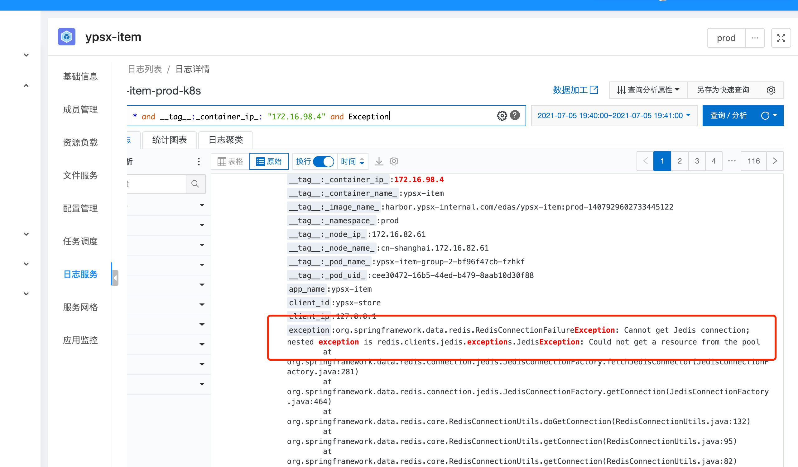

## 自我介绍

## 职业规划

Q: 你的职业规划？
要点： 讲下你要成为怎么样的人

找准自身的定位和想要达成的目标，一年规划，三年规划

Q: 为此你做过什么努力？

## 讲下你的优缺点

## 项目介绍

**项⽬名称**：谊品供应链商品系统 

**项⽬背景**： 供应链测和销售测所关注的商品属性存在很⼤差异，之前这些字段都耦合在商品表⾥，所以要对表进⾏垂直拆分。 同时商品系统也进⾏拆分，分离出商品基础数据、销售商品、供应链货品三个⼦系统，以及若⼲底层服务系统。并 将价格和库存从商品的模型⾥分离出去，提供单独的服务。

**涉及技术**： gRPC、springBoot、pulsar、myBatisPlus、powerJob、elasticSearch、shardingjdbc、redisson、nacos ⼯作成绩：

商品基础数据服务的领域架构设计，采⽤ CQRS 架构，从 0 到 1 落地 DDD。 针对接⼝⼤⽽全的问题，梳理业务与外域诉求，细分接⼝职能，定义核⼼原⼦服务能⼒。 设计商品任务系统，承接业务对商品的批量操作，采⽤⾃研框架保证任务最终⼀致性。 参与商品与价格的服务拆分、设计价格模型。 基于注解设计通⽤缓存查询组件，不侵⼊代码，提⾼接⼝查询性能。 排查线上机器 CPU 负载 100%与服务不可⽤问题。

**担任⻆⾊**：

商品基础数据负责⼈，负责领域设计⽅案与编码 负责推进外域切换与项⽬落地


**项⽬名称**：谊品⾃研ERP系统 

**项⽬背景**： 搭建谊品⾃⼰的数据中台，摆脱对富基、康铭泰克等第三⽅ERP系统的依赖。同时能够快速⽀撑供应链货品、多渠 道销售商品的创建和管理。及时响应业务诉求，实现业务快速扩张的⽬标。

**涉及技术**： gRPC、springBoot、myBatis、pulsar、mysql、redis、elasticSearch ⼯作成绩：

监听商户组织变更消息，设计新开营业部后商品的同步功能，极⼤的缩减运营⼈⼒成本。 为线下⻔店提供品类运营能⼒和销售管控能⼒，⽀持清洗负⽑利商品，指导清退⻔店⾮畅销品。 性能瓶颈问题的优化。

**担任⻆⾊**：

负责相关技术⽅案设计与落地 系统编码实现


## 商品模型

商品中心为各域提供商品基础数据，其重要性毋庸置疑。

从使用层面上来讲，商品中心分为前台和后台，

前台商品，我们可以称之为销售商品，为前台业务，包括到家商品列表，商品 详情，购物车，订单，营销活动等提供基础数据支撑。

后台商品，我们可以称之为供应链货品，为采购、wms、库存等提供基础数据 支撑。

从管理层面上来讲，商品中心分为，商品基础资料（主档）、商家商品、地点 商品，

商品基础资料（主档），控制了商品编码的唯一性，作为商品的一个基础数据 模板；

商家层面，主要为中台商品，提供管理能力，商家商品的变更，影响到下发的 地点商品，商家商品也分为商家货品、商家销售商品。 地点层面，才是真正销售或采购的内容，地点商品也分为地点货品，地点销 售商品。基于商户组织的划分，商家商品维度，绑定的是商家id；地点商品维度对 于谊品生鲜（线下）绑定的是门店id、配送中心id，对于谊品到家（线上）绑定的 是营业部id、配送中心id。

本次系统改造只对接到家销售渠道， 对于平台销售商品测， 下发到地点是 通过运营组控制一批营业部进行下发的。 所以本次地点商品， 主要是到运营组 维度的商品ES查询列表。

## 系统拆分

ypsx-kernel-product：商品基础数据服务，提供商品主档，类目，品牌，属性等管 理和查询能力。

ypsx-kernel-item：销售商品服务，提供商家商品，销售范围，地点商品的创建、修 改等管理能力，以及支撑外域对销售商品属性查询的能力。

ypsx-kernel-goods：供应链货品服务，提供商家货品，供货范围，地点货品的创 建、修改等管理能力，以及支撑外域对货品属性查询的能力。

ypsx-titan：DB同步到ES的数据通道，解析数据库binlog，聚合商品ES的数据结 果，存储到ES。内部直接连接商品的数据库，监听到binlog消息，反向查数据库组 装数据，binlog的解析采用了Maxwell。

ypsx-matrix：ES读取服务，将DB的查询服务与ES的查询服务解耦，提供统一索引 查询入口。针对索引维度的通用抽象查询方法。

ypsx-kernel-flow：商品流程服务，用于聚合整体的商品发布流程，里面通过流程引 擎保证分布式事务中数据的最终一致性。例如：商家商品提报发布时，最终需要先 下发营业部商品，然后修改商家商品的状态为可见同时创建商家商品和运营组的关 系。这个流程里有两步，可以通过flow来编排好流程，提供完整的方法给管理后台 调用。

 ypsx-kernel-pms：商品管理后台的api服务，提供和前端交互的api接口，内部聚合 商品、价格、库存的底层服务，有自己的防腐层和内部针对管理后台的领域模型， 以商品为骨架，聚合价格和库存，支持后续其他系统的扩展。会包含较多的校验逻辑

## 任务中心

Excel的导入导出在商品域中里有大量的应用场景，尤其是 导入操作，极大提高了业务人员操作系统的便捷性。 

在原有商品模型里，Excel导入导出处理部分是由PMS工程来完成的，在使用过程中 遇到了一些问题，如：

- 要处理的Excel数据量过大时，会占用过多系统内存，影响机器性能，甚至造成 服务不可用的情况。
-  在处理过程中，遇到机器重启或其他导致处理中断时，没有重试机制，无法保 证任务的执行结果。
- 无法对处理流程进行很好的扩展。
- 用户在操作后，无法感知任务处理的进度。

在本次的商品重构中，针对以上问题进行了一些架构方面的调整。

PMS不再负责Excel导入导出数据的解析校验，这一部分操作由独立的Task工程 来承载，

PMS只提供查询和持久化明细数据的服务。

 Task工程通过接入流程引擎Engine，来提供失败重试机制，以保证任务执行的 结果。通过流程引擎的流程编排服务还可以更方便地对流程编排控制，方便进 一步的扩展。

 后续还会提供对任务的监控，以及执行进度的感知。

## 职业技能

- 研读过 JDK 源码，如集合、多线程、AQS 等基础框架 
- 熟悉 JVM 原理，如内存模型、类加载机制、垃圾回收算法 
- 熟练掌握 Redis，对其原理有深⼊了解，设计过通⽤缓存查询组件 
- 熟悉 Spring、 SpringBoot、Mybatis、Netty 等主流开源框架 
- 熟悉 MySQL，有线上 SQL 调优经验 
- 熟悉 DDD 思想，完成过从 0 到 1 的系统实践 
- 了解分布式相关理论，参与过中型分布式系统的开发

### 项目简介

> 我简单介绍一下项目背景吧。 我们主数据商户只有一个工程。该工程既向外提供了原子查询服务的能力。又提供中台的管理能力。

### 为什么要重写？

> 有几个原因吧。
>
> - 第一个原因是包含许多的废弃业务逻辑。无法响应业务的快速发展。比如说审核流。
> - 第二个原因是工程被许多团队维护过。代码风格极其不统一。
> - 第三个原因是接口设计不合理，存在许多相同功能的接口。
> - 第四个原因是部分接口性能出现问题。
>   综合下来 所以采用的是重写工程而不是重构。

### 重写方案

- **准备阶段**

> 我说一下我们的重写方案吧。首先是与产品和测试对齐重写方针。
> 在准备阶段我们与产品首先确定商户的业务模型。比如确定销售商模型、营业部模型、公司模型等等。依照公司现有的业务逻辑。
> 依旧是准备阶段，开发会去收集各域依赖的接口。 我们当时的操作是直接拿到外域的代码权限。拉下来查看依赖的接口以及出入参。 然后形成表格之后与外域对接口。明确接口用途。这一步非常重要，它将直接影响你新接口的设计。

- **方案设计**

> 首先我们在工程中采用CQRS架构，将中台管理服务与对外原子查询服务分开，使用两个工程来实现。分别是phoenix和owl工程。两个工程都可以访问数据库。我们这么设计的目的是希望它们发布不会影响。 然后区别于管理服务调用原子服务，它没有分布式事务问题。
>
> 接口定义上，我们针对不同的业务实体定义了不同的接口。首先定义了一个基础属性的接口。该接口只包含基本信息，然后就是根据不同类型分别设计详细信息接口。然后就是关联关系接口。
> 并行开发。
> 然后就是外域切换。
> 系统下线。
> 数据模型变更。

- **实施**

> 开发阶段
> 对于OWL工程，我们采用DDD来落地。

- **为什么采用DDD？**

> 为了解决代码散乱，无法体现出业务与领域模型的这种情况。我们采用DDD，因为DDD可以直接在模型层了解到业务逻辑与领域行为。 然后就是DDD的模式可以解耦。 领域层和仓储层解耦，领域层无须关注具体存储哪张表。 让开发者对业务有更深层次的了解。 同时我认为它可以敏捷迭代。

- **你们的DDD是如何落地的？**

> 在工程中，我们使用CQRS架构，充血模型来落地。首先明确聚合。例如门店、仓库、公司等等是聚合根。 聚合根：具有全局标识 实体：只在聚合内有唯一标识。
> 在分层架构中，接口层调用应用服务层，应用服务层仅负责业务逻辑，比如说调用领域对象的行为。 例如现在有一个保存门店的方法。 在内存中构建出来一个门店对象，然后调用门店对象的行为来对内存中的领域对象进行修改。 同时行为会产生事件。 事件会存储在对象内部。当调用仓储层store方法提交事务之后，会调用事件发布将这些事件发布出去。 后续会有监听来实现 缓存清理和消息发送。

- **你们落地DDD的时候有没有遇到什么问题？是怎么解决的？**

> 第一个就是消息一致性问题。因为消息是由事件来驱动。 而消息又是业务中比较重要的一环。万一事务提交了但是消息因为各种原因发送失败了，那么对于下游业务就会存在问题。存在分布式一致性问题。
>
> **解决：**
> 对于业务消息，我们更改了方案，采用本地消息表，在事务中写表。然后异步线程会去发送这条消息。并将其置为已发送。 当时也考虑要引入其他团队开发的 分布式流程任务引擎来解决一致性问题，考虑到成本比较高，且我们编辑的情况不多，就采用了本地消息表。

- **讲一下你们的缓存方案吧**
- **你说你们进行了表结构优化，是做了哪方面的优化？**
- **你们有采集BinLog来同步ES的操作，对于消息乱序你们是如何解决的？**

经过后续跟进与查看源代码。 发现k8s环境下经典服务注册服务发现已经由K8S接管。询问基础架构组同学得知是因为ETCD服务宕机导致服务发现出现问题。

### 分表问题

- **为什么分表？**

> 首先第一点是主表字段过多了。 有很多垃圾字段。
> 另外我们希望推进外域根据业务场景来辨别实际使用的业务实体类型。根据不同的实体用不同的表。还有就是需要去掉一些类型。

- **分表方案**

> 首先是写的问题。原先依赖主键Id。现在分表了，为了兼容性，不同实体Id全局唯一。因此我们采用了分段发号策略。在主表中找到目前已有的最大的Id，加一位，然后根据不同的实体采用不同的号段。基于数据量不大的情况下，不需要引入分布式发号服务。降低复杂度。
> 同时也可以根据号段来区分新老Id与类型。

### **服务器指标**

1. 线上QPS最高是到5000
2. RT时间 是99%200ms之内  90%50ms
3. 线上GC回收基本保持在20ms以内

## 线上CPU100%的问题排查

7⽉5号晚上 19点40分 接到电话反馈商品服务不可⽤，销售端相关依赖商品服务的⻚⾯展示空⽩⻚，后台ERP系统商品选品，类⽬接⼝⻚⾯提示系统异常。

以下是问题分析定位的过程： 

**第⼀步 workspace 查看监控，以及杨航反馈的截图，有⼀台商品的Pod的 CPU使⽤率和内存使⽤率飙⾼，单台POD服务不可⽤，并定位这台异常的pod的 容器Ip为 192.168.98.4**

但从反馈的频率来看，商品有26个pod实例，线上每次刷新都是空⽩⻚；从 分析上来看GRPC的负载策略是随机 +轮训，不可能每次都是空⽩⻚，⻚⾯的报错⼏乎是每次刷新必现。带着这个疑点去对⽇志进⾏了分析，从19点40 开 始，按分钟的粒度逐步查询异常的⽇志，排查的过程中发现出现了如下的⽇志：



 获取不到Jedis链接⼀般来说有两种可能： 

**1、Redis的负载很⾼，响应很慢或者没有链接可以分配，会导致客户端的连接池获取不到链接**

**2、应⽤的负载很⾼，CPU没有资源来调度应⽤线程，这个时候也会造成链接Jedis的请求⻓时间没有响应，导致新来的请求把池中的链接资源分配光但不能及时释放链接的场景，也会导致这样的错误。**

从时间上来分析，19点40的节点，应⽤的CPU使⽤已经 250%，cpuLoad全 被占⽤，内存使⽤率也满了，很容易可以分析出这个时间的应⽤线程是没有资源被CPU调度到的，都是挂起的状态，⾃然Jedis的链接是⻓时间没有响应的。推断属于第⼆种场景，于是⼜去看了Redis和MySQL的负载情况（MySQL是正常的 这⾥就不截图了） 可以很明显的看到，Redis除了链接数激增，响应时间和负载都是正常的， ⽽QPS骤降和连接数的上升，说明了在19点40这个点 请求⼀下变少了，但是 连接数增加；验证了我们上述推断，应⽤疯狂的向连接池申请创建链接，但却很⻓时间未释放链接（因为被应⽤Hold住了）

回到Jedis异常的⽇志点，以上可以分析得出Jedis并不是问题的引起⽅，这 是应⽤负载⾼了以后的⼀种报警形式，继续按⼀分钟的粒度往前推移，发现在3 分钟内存在⼤量的如下⽇志：


**这时⼜切换了别的Pod所在的容器的IP，并⽆类似的⽇志，于是猜测有没有 可能是因为服务发现中⼼在获取服务可⽤列表的时候只发现了⼀台实例，导 致所有的流量在某⼀个时间段都路由到了同⼀个服务实例上？如果是这样的话也 就能解释为什么26个Pod只有⼀个pod出问题导致整个商品服务都是不可⽤的 了。带着这个问题⼜重新去看了应⽤的负载和监控：**

可以看到出问题的pod和其他的Pod，CPU使⽤率，内存，⽹络IO流量，磁 盘在出问题的时间点趋势完全是呈反⽐的，看上去就像所有的请求 突然从别的实 例上都转移到了这个pod上。貌似也复核了我们之前的推断，有没有可能是服务 发现的负载出了问题，可⽤服务实例列表的缺失造成的负载不均；从⽽导致单台 应⽤⽆法承载整个集群的请求量？

这个时候带着疑问，⼜去查看了在出问题的点附近 是否存在⼤量的接⼝调 ⽤，或者导⼊导出等耗资源的操作 经过排查我们排除了导⼊导出操作造成的影响，同时可以较为明显的看到19点到 问题发⽣的点并没有接⼝调⽤量的激增。

⼤体分析下来可能就是 服务发现的负载问题，导致了POD压⼒瞬间过载 从 ⽽影响整个服务。

## 轻量级缓存组件

https://blog.csdn.net/youbl/article/details/113052502

1. 基于注解，不侵入代码，使用Spring AOP实现，轻量级，相比Spring 提供的注解缓存，可扩展性更高一些。

2. kernelCache缓存的删除是基于binlog的，基础架构会将bin log解析发送至消息队列，我们监听消息去处理删缓存，这里也可以做一些延时双删的操作，来保证db缓存的一致性。

3. 还有一些都是默认的Redis缓存实现不支持，需要去实现相关扩展接口的。

   - 默认的RedisCacheManager是使用JDK的序列化，性能差；我们自己的缓存组件也就是kernelCache，是可配置序列化方式，默认gson。

   - 默认的是无法配置不同的缓存过期时间；kernelcache可以根据缓存枚举中的过期时间时间来差异化配置。

   - 默认是同步写缓存的，而kernelCache是异步线程池写缓存。

     


## 流程引擎

通过注解的方式将需要进行rpc调用的步骤包装起来，可以由外部系统进行步骤的编排和远程调用。外部系统中可以控制调用的时间以及获取调用结果，还支持步骤失败的重试，以及报警。

底层运用到了netty springbootstart rpc调用相关技术。

流程引擎接入

- 调用方引入依赖包，依赖包里会使用SPI注册一个引擎的服务

- 将需要保证最终一致性的rpc调用包装成执行步骤（processor）。每个processor都有自己的唯一标识

- 将原来多次rpc调用的地方，进行引擎点火，点火需要传入序列化后的入参和指定唯一的流程id（一个流程相当于原来的本地事务）

- 去引擎的管理后台对流程进行步骤配置，步骤之间可以串行也可以并行。

  

客户端：

业务方引入springboot-starter包，通过SPI加载启动配置类，配置类会进行如下操作：

1. 初始化 ManagedChannelFactory。该工厂持有注册中心的discoveryStub，可以通过gRPC接口调用进行服务发现。
2. 自动为业务方向服务注册中心，注册EngineTaskService服务（在engine-client实现），该服务支持通过receiveTask来接收engine服务端的task。并向注册中心获取EngineOperateService服务（由engine服务端提供）的stub，支持引擎的点火fire、唤醒wakeup、回调callback、立即执行exec四种方式，该服务用来将业务方的task推送给engine服务端。
3. 初始化并启动引擎
   - 扫描并缓存业务方中被@EngineTask注解标识的任务步骤。
   - 创建用于当前机器点火和回调的线程池。
   - 创建引擎后台配置刷新线程和任务拉取线程。


业务方使用

配置相关：

1. 配置项目模块，engine 服务端 提供的中台页面配置接入引擎项目对应的项目模块
2. 配置任务流程，在中台页面的对应项目模块中，创建对应的任务流程，每个流程中细分为多个步骤。引擎系统用来 **尽可能** 保证每个任务流程的最终一致性，也就是保证流程里的每个步骤都会执行成功，如果执行失败的话支持任务的重试，如果该任务业务校验上就失败，无论重试多少次都不成功，那么这个任务会告警，需要人工介入处理。
3. 编排任务步骤，任务流程进行任务步骤的编排，可以串行，也可以并行，也可以先并行后串行，这点在系统切换中经常可以用到，比如新系统中数据变更需要发新老的消息，如果切换完成，不再需要发送老的消息，只需要将发送老消息的步骤移除即可，不需要系统发布。

代码开发：

1. 引入 engine-springboot-starter

2. 继承 `AbstractEngineStepHandler` 类实现任务步骤，在 `process()`中定义业务逻辑，并将该类用 `@EngineTask` 注解标注。

   ```java
   //根据updateKernelProduct在任务流程中编排任务
   @EngineTask(value = "updateKernelProduct", desc = "更新主档") 
   ```

3. 在需要保证分布式事务最终一致性的地方，通过 EngineOperateService 对 任务流程 进行点火。任务流程的编码也需要在业务方来指定，并在engine中台进行配置。


## 技术面试官问题

1. 技术栈相关
2. 服务运行在云上吗，云平台 云原生
3. 业务体量，服务器的一些指标 QPS  RT 
4. 此次面试的评价

## TL问题

1. 团队的人员，在做的项目，未来规划，业务体量
2. 有过有幸入职前，我需要准备或者学习的内容
3. 您觉得我还有哪些不足的地方

## HR问题

1. 公司有没有一些系统性的培训，可以更快的融入公司
2. 绩效评估和考核
3. 薪资结构

base 21 12薪 年终 0～3 公积金2w 按12%的比例  一年未涨薪

实际

21*12 =25w   26\*12=31w	


## 当贝

A B C D  0～6 平均1～2 个月 

社保最低 公积金工资的5%

6险一金

年假5天

朝9晚6  8、9点下班

8点饭补 9点车补

4，10晋升 


 

