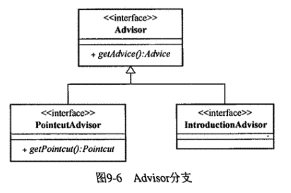
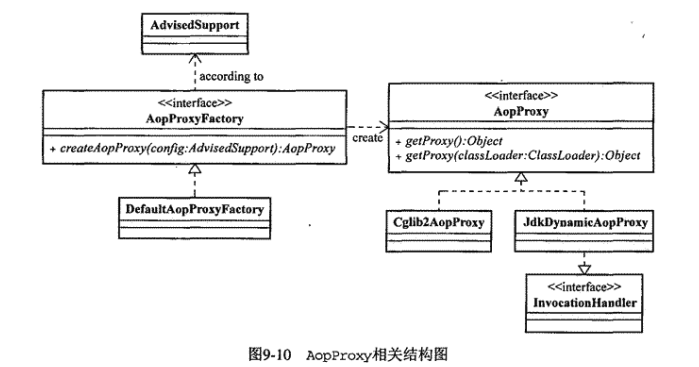

## Spring - AOP

[AOP相关概念理解](#AOP相关概念理解)  
[Joinpoint](#Joinpoint)  
[Pointcut](#Pointcut)  
[Advice](#Advice)  
[Aspect](#Aspect)  
[Weaving](#Weaving)  

### AOP相关概念理解
- Spring-Aop和AOP的关系  
首先要明白的是AOP这个概念不是Spring特有的，Spring-Aop只是AOP一种实现，AOP还有其他的Java实现，例如AspectJ，Spring-Aop和AOP的关系好比Java和面向对象编程。   
- AOP可以用来做什么      
准确来说，AOP其实是一种设计理念，它被设计出来是为了解决横向代码重复的问题，例如日志的记录和事务的开启
- AOP的由来  
软件的开发一直在追求更高效、更易维护、更易扩展的方式。从面向过程的编程再到面向对象的编程(Object-Oriented Programming)  
软件开发最终目的是为了解决各种需求，这其中包括业务需求和系统需求，业务需求可以通过OOP来进行抽象和封装，使其模块化，例如用户相关的模块，通过操作封装的UserBean来简化其业务开发；
对于业务需求而言，需求与其具体实现基本上是一对一的，但对于系统需求，如日志、监控、事务等。这些需求需要集成到业务需求中。
用通俗来讲就是，需要把日志记录的代码加入到之前写的所有业务中。如果有很多的业务，我们总不能一个一个手动的去添加，如果系统需求发生了变化，难不成还要再一个一个手动的去修改，这种做法断然是不可取  
既然有公共的代码，那不妨把公共的系统需求代码抽取出来，写成静态类的静态方法，这样只需要在业务执行前后调用该方法不就解决了。
这样的做法对于简单的系统需求可以解决，比如记录调用时间，但如果系统需求稍微复杂一些，需获取方法调用时所传递的参数和获取调用完成返回的结果，这种方式就无法满足了，这时候AOP就登场了。
- AOP到底是什么  
AOP全称(Aspect-Oriented Programming) 可以理解为 面向切面编程，简化了系统需求和业务需求之间的关系，使整个系统更具模块化  
基于上面遇到的问题，抽取静态类的静态方法的方式，虽然不够灵活和全面，但是提供了一种思路，将公共的代码抽取出来，进行相关的配置，在目标执行前后执行公共代码  


### Joinpoint
**连接点**  被拦截到的点，因为Spring只支持方法类型的连接点，所以在Spring中连接点指的就是被拦截到的方法，实际上连接点还可以是字段或者构造器

### Pointcut
**切点** 对连接点进行拦截的定义，切到哪里
```java
public interface Pointcut {
    ClassFilter getClassFilter();
    MethodMatcher getMethodMatcher();
    Pointcut TRUE = TruePointcut.INSTANCE;
}
```
该接口中定义了两个方法来帮助捕获系统中的Joinpoint，以及提供了一个TruePointcut类型实例，该实例会对系统中所有对象支持的Joinpoint进行匹配

**MethMatcher**
```java
public interface MethMatcher{
    boolean isRuntime();
    boolean matches(Method method, Class<?> targetClass);
    boolean matches(Method method, Class<?> targetClass, Object... args);
}
```
- StaticMethodMatcherPointcut   
isRuntime() 返回false 则当前MethodMatcher为StaticMethodMatcher  
matches(Method method, Class<?> targetClass)的匹配结果会成为所属PointCut的主要依据  
忽略每次方法执行的对参数的拦截，因为不用每次都检查参数，对于同类型方法匹配结果，可以在框架内部进行缓存以提高性能。

- DynamicMethodMatcherPointcut  
isRuntime() 返回true 则当前MethodMatcher为DynamicMethodMatcherPointcut
每次方法执行都会从对参数进行检查，以强化拦截条件，限定特定用户  
只有两个参数的matches返回true时，在执行三个参数的matches方法

**常见的Pointcut实现类**
- NameMatchMethodPointcut  
根据传入的指定方法名称进行匹配，可以传入一个或多个，还可以使用*，实现简单的模糊匹配

- AbstractRegexpMethodPointcut
    - JdkRegexpMethodPointcut 
    - Per15RegexpMethodPointcut  
使用正则表达式匹配方法签名(Method Signature)，方法签名和方法名称不同，方法签名为com.lwj.test.Mytest.test1 匹配的是Mytest类下的test1方法，spring-aop中最常用的也是这个

- AnnotationMatchingPointcut  
根据目标对象中是否存在指定注解来匹配Joinpoint，这里可以搭配自定义注解使用  
AnnotationMatchingPointcut pointcut=new AnnotationMatchingPointcut(ClassLevelAnnotation.class)  
被该注解注释的类中所有方法都会被匹配到  
AnnotationMatchingPointcut pointcut=new AnnotationMatchingPointcut(MethodLevelAnnotation.class)
被该注解注释的所有方法都会被匹配到  
AnnotationMatchingPointcut pointcut=new AnnotationMatchingPointcut(ClassLevelAnnotation.class,MethodLevelAnnotation.class)
只有被注解类中的注解方法会被匹配到

- ComposablePointcut  
可以进行Pointcut之间的逻辑运算功能，如“并”“交”运算，Spring中提供了Pointcuts工具类进行Pointcut间的逻辑组合运算

- ControFlowPointcut
new ControFlowPointcut(TargetCaller.class,"callMethod")
指定类的(指定)方法会被匹配到，其他地方对于该方法的调用不会被匹配到

- 自定义
继承 StaticMethodMatcherPointcut 或 DynamicMethodMatcherPointcut


###  Advice
**通知** 指拦截到连接点之后要执行的代码 把什么切进去
Advice按照其自身实例(instance) 能否在目标对象类的所有实例中共享这一标准分为两大类
- per-class 类型的 Advice  
该类型的Advice实例可以在目标对象类的所有实例间共享  
    - Before Advice  
    该Advice在Joinpoint之前执行，在Before Advice执行完成后，程序执行流程会从Joinpoint处继续执行，Before Advice通常不会打断程序执行流程，除非抛出异常 
    - Throws Advice  
    对异常进行拦截的通知，可以指定具体的异常类型
    - AfterReturning Advice  
    方法正常返回的情况下执行，通过Spring中的AfterReturningAdvice，我们可以访问当前Joinpoint的方法返回值，方法，方法参数及所在的目标对象，但不可以更改返回值
    - Around Advice  
    Spring中没有直接定义Around Advice的接口，而是直接采用AOP Alliance的标准接口  
    即MethodInterceptor
    Object invoke(MethodInvocation invocation) throws Throwable;  
    实现该接口记得 Object obj=invocation.proceed()  obj为目标方法的执行结果

- per-instance 类型的 Advice  
该类型的Advice实例不会在目标对象类的所有实例间共享  
**Introduction**  引介增强  是Spring AOP中唯一per-instance型的Advcice  
Introduction可以在不改动目标类定义的情况下，对目标添加新的属性或方法

DelegatingtIntroductionInterceptor
DelegatePerTargetObjectIntroductionInterceptor

简单demo：https://blog.csdn.net/autfish/article/details/51124919
实际案例： https://blog.csdn.net/qwe6112071/article/details/50962613#commentsedit


### Aspect
**切面** 由Pointcut和Advice组成，在Spring中Advisor代表Aspect  



**PointcutAdvisor**


- DefaultPointcutAdvisor  
最通用的PointcutAdvisor实现，除了不能为Inroduction类型的Advice外，其他的Advice和Pointcut都可以
- NameMatchMethodPointcutAdvisor  
Pointcut限制为NameMethodPointcut，Advic不能为Inroduction类型
- RegexpMethodPoincutAdvisor  
Pointcut限制为AbstractRegexpMethodPointcut，Advic不能为Inroduction类型
- DefultBeanFactoryPointcutAdvisor  
自身绑定了BeanFactory，所以必须绑定到Spring容器，该类作用为但Pointcut匹配成功后才会去实例化对应的Advice，减少了容器启动初期Advisor和Advice的耦合性


**IntroductionAdvisor**  
IntroductionAdvisor与PointcutAdvisor最本质上的区别是，前者只能用于类级别的拦截，只能用Introduction类型的Advice，而不可以像PointcutAdvisor那样使用任意Pointcut和Advice


**Order**  
对于相同切点的不同切面，需要调整优先级来控制执行顺序 如权限检测和异常捕获


### Weaving
**织入** 将切面应用到目标对象并创建代理对象的过程
AspectJ 采用ajc编译器作为织入器，直接动态修改了字节码文件  
JBoss AOP 使用自定义的ClassLoader作为织入器
Spring AOP 使用ProxyFactory作为织入器

```java
public interface ITask {
    void execute (TaskExecutionContext ctx);
    }
public class MockTask implements ITask {
    public void execute (TaskExecutionContext ctx) (
        System,out.println("task executed.");
        }
    }
```

- 基于接口的代理  JDK动态代理   
```java
MockTask task = new MockTask();
ProxyFactory weaver = new ProxyFactory (task);
weaver.setInterfaces (new Class [] (ITask.clasa));  //这里如果不设置的话，会对所有实现接口的类代理
NaneMatchMethodPointcutAdvisor advisor = new NameMatchMethodPointcutAdvisor();
advisor.setMappedName ("execute");
advisor.setAdvice (new PerformancelethodInterceptor());
weaver. addAdvisor (advisor) ;
ITask proxyobiect =(ITask) weaver.getProxy();
proxyobject.execute (null) ;
```
- 基于类的代理  CGLIB代理   
```java
ProxyFactory weaver =new ProxyFactory(new MockTask());
//设置ProxyTargerClass 强制使用CGLIB代理 不管目标类有没有实现任何接口
//设置optimize  也可以强制使用CGLIB代理
weaver.setProxyTargetclass (true) ;
NameMatchMethodPointcutAdvisor advisor = new NameMatchMethodPointcutAdvisor();
advisor.setMappedName ("execute");  //设置切点要匹配到的方法
advisor.setAdvice (new PerformanceMethodInterceptor ());
weaver.addadvisor (advisor);
MockTask proxyobject =(MockTask) weaver.getProxy();
proxyObject.execute(null);
System.out.println (proxyobject.getClass();
```
- Introduction的织入  
Introduction可以为已经存在的对象添加新的行为，应用对类级别的拦截，而不是Advice的方法级别的拦截，所以只需要指定目标接口类型，不用知道Pointcut  
Spring的Introduction只能通过接口定义为目标对象添加新的行为
```java
//Introduction 基于接口的织入
ProxyFactory weaver =  new ProxyFactory(new Developer());
weaver.setInterfaces(new Class[]{IDeveloper.class,ITest.class});
TesterFeatureIntroductionInterceptor advice=new TesterFeatureIntroductionInterceptor();
weaver.addAdvice(advice);
//DeafultIntroductionAdvisor advisor = new DeafultIntroductionAdvisor(advice);
//weaver.addAdvisor(advisor);
Object prosy=weaver.getProxy();
((ITester)proxy).testSoftware();
((IDeveloper)proxy).developSoftware();

//Introduction 基于类的织入
ProxyFactory weaver =  new ProxyFactory(new Developer());
weaver.setProxyTargetclass (true) ;
weaver.setInterfaces(new Class[]{ITest.class});
TesterFeatureIntroductionInterceptor advice=new TesterFeatureIntroductionInterceptor();
weaver.addAdvice(advice);
Object proxy=weaver.getProxy();
((ITester)proxy).testSoftware();
((Developer)proxy).developSoftware();  //此处必须是 Developer 而不是 IDeveloper
```


### ProxyFactory的本质
```java
public interface AopProxy {
	Object getProxy();
	Object getProxy(ClassLoader classLoader);
}
```



ProxyConfig 记录生成代理对象的控制信息 
- proxyTargetClass 是否使用CGLIB对目标对象进行代理
- optimize 该属性用于告知代理对象是否需要进一步的优化措施，如代理对象生成后，即使为其添加或移除相应Advice，代理对象也可以忽略这种变动,为true时，使用CGLIB生成代理  
- opaque 控制代理对象是否可以强转为Advised，可以通过Advice查询代理对象的一些状态,默认可以强转
- exposeProxy 可以让Srpign AOP框架生成代理对象时，自动绑定到ThreadLocal，通过AopContext.currentProxy()取得，默认关闭
- frozen 为true时，代理对象生成的各项信息配置完成后不容许修改，可以优化生成性能，默认false


Advised 记录生成代理对象所需要的信息，如目标类，Advice，Advisor

###　ProxyFactoryBean　容器中的织入器　
Proxy＋FactoryBean　　生产Proxy的FactoryBean
如果容器中某个对象持有某个FactoryBean的引用，它取得的不是FactoryBean本身，而是FactoryBean的getObject()方法返回的对象
如果某个对象依赖ProxyFactoryBean，那么它将使用到ProxyFactoryBean的getObject()方法返回的代理对象

//ToStudy


### @AspectJ 形式的 Spring AOP
- 可以使用POJO类来配置Aspect了，如@Aspect @Pointcut  
- 可以使用新的pointcut表述方式，如exection()  
常用的pointcut  标志符：  
    - exection  
    匹配对应方法签名的Joinpoint，如 execution(void com..*.doSomething(*))  
    - within  
    匹配指定类型下的Joinpoint，因为SpringAOP只支持方法级别的Joinpoint，所以会匹配对应类的所有方法
    - args  
    帮助我们捕获有指定参数类型，指定参数数量的方法级Joinpoint
    - @within  
    匹配标注指定注解的类 下所有方法级Joinpoint
    - @args  
    会检查传入参数类型是否有@args所指定的注解
    - @annotation  
    会检查系统中所有对象的所有方法级的Joinpoint，如果方法上标志指定类型的注解，将会被匹配到，可以应用在事务管理方面

以上这些标志符都是 Spring AOP借用AspectJ中的Pointcut表述语言，当然还有很多没有支持，如get、set、handler等，但足够我们日常使用了，Spring AOP将这些概念借用过来后也做了些修改，语义可能和AspectJ中有所不同，但底层还是Spring AOP最初的机制

- 使用XSD简化DTD的xml配置方式  
XSD:<aop:aspectj-autoproxy proxy-target-class="true">/<aop:aspectj-autoproxy >
DTD:<bean class="org.springframework.aop.aspectj.annotation.AnnotationAwareAspectJAutoProxyCreator">
    <property name="proxyTargetClass" value="true"></property>
</bean>

AnnotationAwareAspectJAutoProxyCreator 会自动搜集IoC容器中注册的Aspect，并用的Pointcut定义的各个对象上

@AspectJ 声明的所有Pointcut表达式，都会由Spring AOP 进行解析，转换成具体的Pointcut对象


在AspectJProxyFactory或者AnnotationAwareAspectJAutoProxyCreator通过反射获取了Aspect中AspectJ形式的Pointcut后，Spring AOP会在内部构造一个对应的AspectJExpressionPointcut实例，该实例持有Pointcut表达式，并且委托AspectJ类库来做相关工作，委托PointcutParser解析持有的Pointcut表达式，返回PointcutExpression对象，后续的匹配工作就交给PointcutExpression对象来处理  

可以使用Joinpoint获取全部参数，也可以使用args等标志符获取指定参数

```java
//@Before  
@Before(value="exection(* ..(..))" && args(taskName) && @annotation(txInfo))
public void test1(String taskName,Transactional txInfo){}

//@AfterThrowing
@AfterThrowing(pointcut="exection(* ..(..))",throwing="e")
public void test1(Joinpoint joinpotin,RuntimeException e){
    joinpoint.getArgs();    
}

//@AfterReturning
@AfterReturning(value = "pointcut()", returning = "result")
public void logReturn(Object result) {
        System.out.println("@AfterReturning  " + result);
}

//@After(Finally)
@After(pointcut="exection(* ..(..))")
public void test1(){
    //处理网络连接的释放、数据库资源的释放
}

//@Around
@Around("pointcut()")
public Object around(ProceedingJoinPoint point) throws Throwable {
    System.out.println("@Around 执行目标方法之前");
    Object proceed = point.proceed();
    System.out.println("@Around 执行目标方法之后 ");
    return proceed;
}

//@DeclareParents
用于标注Introduction类型的Advice，标注的对象的域(Field)，而不是方法
@Aspect
public class IntroductionAspect{
    @Declareparents{value="com.lwj..MockTask",defaultImpl-CounterImpl.class}
    public ICounter counter;
}
Object task=app.getBean("task");
(ICounter)task.getCounter();
目标对象的scope通常为prototype
```

同样让Aspect类实现Order接口，可以指定该切面类中所有通知的执行优先级，但仅限于IoC容器中，如果编程方式使用Aspect则执行顺序根据添加到AspectJProxyFactory的顺序来决定


 


### 具体通知方法
通知方法：
- 前置通知：@Before 在目标方法之前运行
- 后置通知：@After 在目标方法结束后运行，不管有没有异常
- 返回通知：@AfterRuning 在目标方法正常返回值后运行
- 异常通知：@AfterThrowing 在目标方法出异常后运行
- 环绕通知：@Around 动态代理，需要手动执行joinPoint.procced() 前置通知+后置通知(如果出异常则不执行后置)

```java
执行结果如下:

@Around 执行目标方法之前
@Before int com.lwj.aoptest.TargetClass.targetMethod(int,int) 参数：[2, 1]
目标方法
@Around 执行目标方法之后 
@After
@AfterReturning  2

@Around 执行目标方法之前
@Before int com.lwj.aoptest.TargetClass.targetMethod(int,int) 参数：[2, 0]
目标方法
@After
@AfterThrowing  / by zero


@Aspect
public class LogAspects {
    @Pointcut("execution(* com.lwj.aoptest.TargetClass.*(..))")
    public void pointcut() {
    }

    @Before("pointcut()")
    public void logStart(ProceedingJoinPoint point) {
        point.getArgs();
        // Object[] getArgs：返回目标方法的参数
        // Signature getSignature：返回目标方法的签名
        // Object getTarget：返回被织入增强处理的目标对象
        // Object getThis：返回AOP框架为目标对象生成的代理对象
        System.out.println("@Before");
    }

    @After("pointcut()")
    public void logEnd() {
        System.out.println("@After");
    }

    @AfterReturning("pointcut()")
    public void logReturn() {
        System.out.println("@AfterReturning ");
    }

    @AfterThrowing("pointcut()")
    public void logThrowing() {
        System.out.println("@AfterThrowing");
    }

    @Around("pointcut()")
    public Object around(ProceedingJoinPoint point) throws Throwable {
        System.out.println("@Around 执行目标方法之前");
        Object proceed = point.proceed();
        System.out.println("@Around 执行目标方法之后 ");
        return proceed;
    }
}

@Configuration
@EnableAspectJAutoProxy
public class AopConfiguration {
    @Bean
    public TargetClass targetClass(){
        return new TargetClass();
    }
    @Bean
    public LogAspects logAspects(){
        return new LogAspects();
    }
}
```


#### AOP核心流程

```java
@Import(AspectJAutoProxyRegistrar.class)
public @interface EnableAspectJAutoProxy {

public void registerBeanDefinitions(AnnotationMetadata importingClassMetadata, registry) {
    AopConfigUtils.registerAspectJAnnotationAutoProxyCreatorIfNecessary(registry);

public static BeanDefinition registerAspectJAnnotationAutoProxyCreatorIfNecessary(BeanDefinitionRegistry registry) {
		return registerAspectJAnnotationAutoProxyCreatorIfNecessary(registry, null);
	}

public static BeanDefinition registerAspectJAnnotationAutoProxyCreatorIfNecessary(BeanDefinitionRegistry registry, Object source) {
		return registerOrEscalateApcAsRequired(AnnotationAwareAspectJAutoProxyCreator.class, registry, source);
	}

private static BeanDefinition registerOrEscalateApcAsRequired(Class<?> cls, BeanDefinitionRegistry registry, Object source) {
    registry.registerBeanDefinition(AUTO_PROXY_CREATOR_BEAN_NAME, beanDefinition);
    public static final String AUTO_PROXY_CREATOR_BEAN_NAME = org.springframework.aop.config.internalAutoProxyCreator

AnnotationAwareAspectJAutoProxyCreator  //AOP核心类
    AspectJAwareAdvisorAutoProxyCreator
        AbstractAdvisorAutoProxyCreator
            AbstractAutoProxyCreator extends ProxyProcessorSupport implements SmartInstantiationAwareBeanPostProcessor, BeanFactoryAware {
```