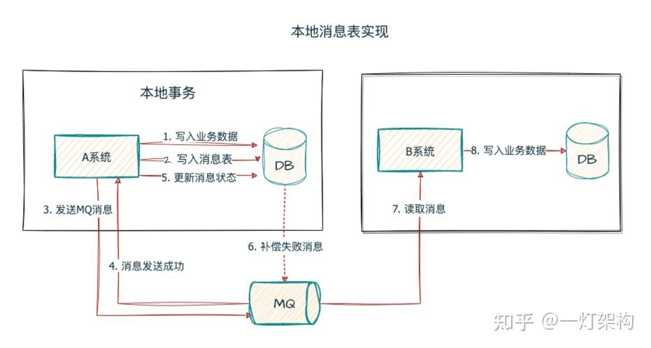

再讲应用架构  业务架构 再到应用架构

应用架构为什么这么设计

商品模型

1、商品系统本身的量级，包括流量、稳定性这条线
2、架构层面的体现
3、技术或者业务结果

面试层面除了要看本身负责的东西，还会看商品领域往外的延伸，以及这三个项目之间的联系，从erp-供应链商品-平台商品应该是一个整体。作为架构owner，架构的设计思路、问题、难点、扩展、稳定性等等，要考虑全面，都准备下。


我们要清晰的分辨出一个问题会带来哪些影响和损失，这些影响和损失在我们当前业务阶段是否可以接受？是否是瓶颈？同时我们也要清晰的了解要解决这些问题我们所要付出的代价。一定要综合评估，讲究一个投入产出比。某些问题虽然是问题，但是在某些阶段和场景下并不需要我们投入解决。而有些问题则对于我们当前业务发展阶段是瓶颈，我们不得不去解决。我们在架构设计或者程序设计中，方案一定要简单，合适。并预估一些提前量留有一定的演化空间。


redis 旁路缓存 提升


可扩展性：

无状态：横向扩展，增强服务容错能力

松耦合：业务模块之间的松耦合，可以在不影响系统其他部分的情况下对该微服务或者模块进行横向扩展

异步处理：事件驱动，让服务直接的交互从同步等待响应转为异步，这种方式有助于缓解耦合，降低复杂系统中出现级联故障的风险

当然，异步也会带来一致性的问题复杂性，商品创建的异步设计


扩展策略：垂直扩展和水平扩展

垂直扩展：提升机器的CPU、内存、存储等性能，对于因一致性限制而难以水平分布的数据库来说，垂直扩展更可取

水平扩展：增加更多的机器来分担工作量，带来数据一致性问题，网络开销，以及分布式系统管理复杂性

例如分库分表的拆分数量


## Java

研读过 JDK 源码，如集合、ThreadLocal、线程池、AQS 等基础框架； 

## JVM

熟悉 JVM，如 JMM、类加载机制、GC算法，进⾏过线上 JVM 的调优； 

### 线上 JVM 的调优

## Redis

[Redis.md](../Database/Redis/Redis.md)

熟练掌握 Redis，对底层数据结构、持久化机制有深⼊解

### Redis为什么快

1. **基于内存操作**

   相较于硬盘来讲速度更快，高吞吐和低延迟，因为硬盘是物理结构，一次读取包含磁头的寻道时间+盘片旋转将数据所在扇区移至磁头下方+数据传输时间

   

2. **基于单线程操作**

   减少线程上下文切换，多线程会带来频繁的上下文切换

   减少锁竞争带来的开销，如果存在锁竞争，那么没抢到锁的线程会被阻塞，这个过程中涉及到系统调用，而系统调用的产生会从用户态切换到内核态，这个过程也需要保存上下文信息，对性能有影响。（vmstat 是针对CPU、内存的监控工具，可以通过 cs 查看切换次数）

   作为Reids本身来讲，它是一个基于内存的非关型数据库，它的性能瓶颈其实不在CPU，而是在内存和网络IO，例如内存分配的大小，包括key的存活和失效，读写的时候网络的带宽以及传输过程中IO的效率。

   redis6.0 增加了多线程来处理IO 部分的读写，核心的计算逻辑还是由redis 主线程来完成。	 

3. **IO多路复用模型**

   [think of Java：Java IO](../Java/JavaBase/md/think of Java：Java IO.md)

   UNIX中定义的IO模型通常包含两个阶段：

   1. 等待数据准备好
   2. 将数据从内核缓冲区复制到用户空间（实际的IO操作）

   **同步阻塞IO**：用户空间中调用recvfrom，发生系统调用，如果内核缓冲区没准备好数据，那么线程在此期间会一直等待。

   **同步非阻塞**IO：用户空间中调用recvfrom前，将socket设置为非阻塞，这样当内核缓冲区数据没有准备好的时候，线程不会等待，而是直接返回一个错误，然后由调用方去不停的轮训数据是否准备好。

   **IO多路复用**：Linux内核提供了select/poll/epoll函数来支持由一个线程监听一组socket的数据是否处于准备就绪，当某个socket数据准备就绪后，select等函数会返回对应的连接，再真正调用recvfrom函数将数据从内核复制到用户态返回。本质上还是同步IO。

   

4. **高效的内部数据结构**

   SDS：简单动态字符串，是string类型的底层数据结构之一。

   QuickList：快速链表，是list类型的底层数据结构。

   ZipList：压缩列表，是hash类型的底层数据结构之一。

   ZSkipList：跳表，是zset类型的底层数据结果之一。跳表其实就是对普通的有序链表建立了索引层，比如将有序链表中的奇数节点提取到上一级，这样可以就可以借助二分查找到思想加快链表的遍历和读写操作。


## MySQL

熟练掌握 MySQL，对索引、数据库锁、MVCC有深⼊理解； 

### 行锁

数据库中的行锁（Row-Level Locking）住要用于控制并发事务对同一行数据的访问操作，确保数据的一致性。

锁住某一行的记录变更，行锁通常是加在索引上，而且物理记录上，如果是使用的是二级索引的话，行锁还同时会加在主键索引上，以防止不同事务通过不同索引修改同一行记录。

**行锁的两种类型**，共享锁也称S Lock，排他锁 x Lock。

共享锁：允许事务读取某一行记录，其他事物也可以加共享锁，但是不能加排他锁。语法如：SELECT   LOCK IN SHARE MODE

排他锁：允许事务更新或删除数据，阻止其他事务加任何锁，语法如：SELECT FOR UPDATE，或 UPDATE 、DELETE 语句。

**行锁的范围**：

记录锁

### MVCC

## 分库分表 平滑迁移

使用 Sharding-JDBC 对商品铺货关系表进行 水平拆分，优化单节点数据过载问题。设计 平滑数据迁移方案。

**背景** 我们有一个铺货关系表，用于维护小B的货物供给关系，该表当时差不多2000w数据，因为和其他业务的表存在同一个数据库中，所以出现慢SQL等异常情况时会响应其他表的业务，为了提升系统整体的可靠性和稳定性，以及保证该表后续的读写性能，所以我们将该表从原有的数据库中迁移，在迁移中进行水平拆分，同时要保证数据的平衡迁移。

**数据现状** 23年开始 100w的商品 20w存在铺货 30w的小B中 存在铺货的小B有5w  至24年中一年内总共铺货关系2000w

**容量规划** 1w家活跃店铺平均铺货1w个商品，当时预估从24年中至25年中能能增长1亿。至2027年中能增长到10亿。考虑到成本和这张表的读写压力，按照单表1000w纬度，差不多需要100张表。所以我们拆分成2个实例，每个实例2个库，每库32表，累积2x2x32=128张表。如果后续实例压力提升可以去进行实例配置升级或者进行数据库迁移至新实例，升级成本较小。

**数据迁移** 

整个过程包含：

- 前期准备

  - 确定分库分表的规则，因为业务上都是按照机构纬度去查询，所以我们将机构id作为分库分表键。
  - 确保数据表有发号器生成的唯一键，有创建时间、更新时间和版本号。
  - 数据迁移脚本开发

- 数据同步

  - 开启binlog监听MQ（不消费）=〉全量数据同步新库 =〉开始消费binlogMQ =〉关闭binlog监听MQ =〉新老双写 =〉全量双向校验 =〉增量双向校验 =〉动态校验 =〉灰度切流  =〉 切流观察 =〉关闭双写双读

  - 历史数据全量同步：DBA协助帮忙处理历史数据hash后到新的库表中（也可以脚本select全量数据hash后插入新库表），在开始同步之前就要打开老库binlog消息订阅ROW模式，保存在MQ中，但是不消费，等到全量同步完成后新库开始消费消息（因为在复制过程中可能存在复制过的数据又发生了更新或删除动作，这样新库如果不处理这个操作，那么就会出现数据不一致的情况）
  - 实时数据同步：通过双写的方式实时保证新老库数据一致，当新库把binlog消息消费完后，就可以开启新老库实时双写，双写之前要停掉binlog的监听。先写老库，后写新库，如果老库写入失败，那请求返还失败，如果老库成功，新库失败那就记录失败日志，整体返回成功。这样确保老库的数据始终是准确的（如果对时延要求比较高的话，新库的写入可以异步完成）

- 数据校验

  - 全量双向校验：等到双写开始之后，我们可以基本认定新老库的数据是一致的，但也可能因为双写写入失败出现不一致的数据，而且我们的link关系是可以物理删除的，保险起见，我们进行新老库双向的校验检查，遍历老库中的数据，检查在新库中是否存在以及数据是否一致（因为可能新库创建失败）。遍历新库中的数据，检查在老库中是否存在以及数据是否一致（因为可能新库删除失败）。不一致的时候就记录类型和数据，方便后续捞取日志进行人工补偿。
  - 增量双向校验：定时任务每10min检查最近一小时更新数据是否一致，校验逻辑和全量双向校验一样。因为可能存在老库操作后，新库还没来得及更新，这种短暂不一致的情况，在此期间触发了定时任务的校验产生的告警，这个我们会根据告警id的出现次数来过滤这种情况，比如只去检查同一条数据告警次数统计大于3的记录
  - 动态校验：对灰度切读的机构，在查询的时候进行动态校验。同时查新老库的数据，比对新老库数据，如果不一致以老库数据为准，记录告警日志。

- 灰度切流

  - **机构打标灰度**，通过运营对机构打标的方式分批去对用户做读流量的迁移，打了标的读新库，没打标的读老库。如果通过白名单这种偏配置的对于需要配置的数据量太大不好处理，而且运营挑选的机构都是和平台配合度比较高，有问题的话影响面也会控制在一定范围内。
  - **确保随时能回切，**双写在彻底切换完成前都要开启，保证随时能够回切，切回的方式也很简单，机构去标就可以。


## DDD落地

负责溯采供应链平台商品体系从 0 到 1 的 DDD 实践落地，制定分层的商品领域模型，并根据模型进行微服务拆分。


CQRS

这个和MySQL读写分离很相似。但是MySQL的读写分离强调的是物理数据库的分离，而CQRS更关注的是模型层面的分离。

首先最终目的一定是性能的提升。CQRS允许读取和写入的负载独立缩放，这样可以减少锁的竞争。同时它可以分离读写数据的存储结构，读和写使用不同的存储方式。比如command用db，query用es，这样可以针对性的进行优化。

虽然我们现在只在模型上分离，没有在存储上做分离，但是如果以后要分离存储的话，模型分离也是第一步。还有一点就是领域模型对象在构建时会有诸多检查和多次对象转换，使用query模型可以尽可能的避免这些点。

为什么使用DDD

毋庸置疑「领域」在 DDD 中占据了核心的地位，DDD 通过领域对象之间的交互实现业务逻辑与流程，并通过分层的方式将业务逻辑剥离出来，单独进行维护，从而控制业务本身的复杂度

所以我们才需要用DDD的分层思想去重构一下以上的代码，通过不同的代码分层和规范，拆分出逻辑清晰，职责明确的分层和模块，也便于一些通用能力的沉淀。

- **DDD可以很好的指导微服务拆分和演进。**

  通过DDD 的方法来建立领域模型，划分领域边界，再根据这些领域边界从业务视角来划分微服务边界。可以很好地实现微服务的“高内聚、低耦合”。这样就解决了拆分的问题；其次微服务内部的实体都是以聚合为单位的（传统可能是按照类型比如service，pojo），聚合内实现了高内聚的业务逻辑。如果该微服务后边需要更细粒度的拆分，就可以按照聚合进行拆分，这样可以更好的进行服务演进。

  比如老商品拆分后分为商品基础数据服务、销售商品服务、供应链货品服务，而商品基础数据服务中的主档、类目、品牌、属性标签都是按聚合划分的，后期演进时可以拆成独立的服务。

- **实体采用充血模型对核心业务进行沉淀。**

  这点是DDD和三层架构的一个比较大的区别，传统的services层中承接全部的业务逻辑，可能会包含部分重复使用但比较核心的业务逻辑。将其中部分逻辑向下沉淀，针对同一实体相关的业务逻辑都在实体类中实现，跨多个实体的逻辑在领域服务内实现。领域服务通过组合编排实体的方法，供上层的应用服务调用。这样就构成了领域层的核心。（其他还有仓储层的接口）

  DDD提倡充血模型，尽量将业务逻辑归属到实体对象上（或者领域服务里）。在设计时我们主要考虑实体自身的属性和业务行为，实现领域模型的核心行为，不必过多考虑外部操作和业务流程，这样才能保证领域模型的稳定性。

  举个例子：一个运营下架所有商品，这个需求中，商品的上下架是商品实体的行为，属于领域层。而下架所有商品，这就要判断他是否有对应操作权限，属于应用层。比如他只能下架他品类权限内的商品，这个就是数据应用层的业务逻辑。

- **仓储层不再是简单的DAO，它可以将领域模型和数据模型解耦**

  仓储层会将内存中的领域对象进行持久化操作，领域层无须关注具体存储哪张表，怎么存。只需要关注业务逻辑。

  仓储层处理基础单元是聚合根，是服务于实体的，而不是具体的表。

- **CQRS将复杂查询摆脱领域模型的限制，分离领域模型和查询功能**

  由于构建领域对象的完整性约束，所以构建一个领域实体，往往还要去构建它包含的其他实体或者值对象。构建过程比较麻烦。

  其次从DTO=〉command=〉DO=〉PO 要经过多次对象转换。

  这些在查询的场景下完全是不需要的，查询时更希望以简单DTO展现查询结果。CQRS可以帮我们很好的解决这一点。

- **建立通用语言减少沟通成本。**

  确保业务术语没有二义性，可以帮助开发、测试、产品、运营、业务更好沟通。比如商品域中的主档、商品、货品 这些名词都对应领域实体，像 上架、下架、在售、停售 这些动词都代表实体行为。这个在商品域里边可能体现的不够明显，但是在金融、保险这类专业词汇较多的行业内有很好的效果。

**前期准备**

- 首先是跟产品对齐商品的模型和核心的业务逻辑。
- 针对之前接口大而全的问题，包括使用场景不明确的问题，找外域进行接口梳理，包括接口的出入参、使用场景和使用字段，然后整理成表格。消息梳理也同时在进行。
- 根据整理出来的表格，梳理业务与外域诉求，细分接口职能，定义核心原子服务。
- 将改动内容总结为接口替换表和消息替换表格给到外域，包括预计上线的时间。
- 当然我们这里不是一刀切，因为涉及外域的比较多，改造内容也比较多。线上新老接口会同时保留，新老消息也都会进行发送。新老数据也会做同步。只不过老的部分不动了，只在新的上做开发，这样逐步去推动外域做改造。

**代码落地**

在工程中，我们使用CQRS架构，充血模型来落地。首先明确聚合。例如门店、仓库、公司等等是聚合根。 聚合根：具有全局标识 实体：只在聚合内有唯一标识。
在分层架构中，接口层调用应用服务层，应用服务层仅负责业务逻辑，比如说调用领域对象的行为。 例如现在有一个保存门店的方法。 在内存中构建出来一个门店对象，然后调用门店对象的行为来对内存中的领域对象进行修改。 同时行为会产生事件。 事件会存储在对象内部。当调用仓储层store方法提交事务之后，会调用事件发布将这些事件发布出去。 后续会有监听来实现 缓存清理和消息发送。

**数据同步**


**DDD-遇到问题**

第一个就是消息一致性问题。因为消息是由事件来驱动。 而消息又是业务中比较重要的一环。万一事务提交了但是消息因为各种原因发送失败了，那么对于下游业务就会存在问题。存在分布式一致性问题。

**解决：**
对于业务消息，我们更改了方案，采用本地消息表，在事务中写表。然后异步线程会去发送这条消息。并将其置为已发送。 当时也考虑要引入其他团队开发的 分布式流程任务引擎来解决一致性问题，考虑到成本比较高，且我们编辑的情况不多，就采用了本地消息表。


## 商品推荐 

通过 数据分析 挖掘业务增长点，结合 NER 和 类目预测 对小B订单进行 商品推荐， 平均 提升有效GMV 26.7%。

**背景**：以往我们平台的成交流量都是来自于订单回采，所谓的订单回采是，小B供应商把我们供应链平台的商品铺货到面向用户的交易平台上，产生商品供货关系，然后当交易平台产生了对应商品的订单时，同时会在我们平台产生采购订单，完成履约链路。实现订单回采和一件代发。

可以看出订单回采的前提是，建立供货关系，但这个关系是小B手动去建立的。因为我们的供应链平台成立的比较晚，交易平台之前存在的大量商品是没有供货关系的，所以我们这个商品推荐其实就是去挖掘这一部分的潜在价值。

**action：** 

1.大数据报表统计分析，我们首先是通过大数据拉取过去一年网超交易平台的GMV，光浙江省一年的采购交易GMV就高达20多个亿，而我们供应链平台的交易渗透率不到1%，也就是说只有2000w的交易是和我们相关的，如果能把这个渗透率做到10%，那我们平台就有2个亿的GMV，抽佣2%也有400w的利润，这还只是一个省的，所以我们认为这个事情是值得去做的。

2.提升商品覆盖率，确保价格优势。我们先统计了热销商品前5000的热销商品覆盖率、以及热销品牌类目前100覆盖率，没有的话就去招商，谈价格。

3.建设判断同品的能力，简单来说就是根据两份异构的商品信息判断是否是相同的商品。

- 确定判断同品的指标：关键属性（品牌、类目、型号）和销售属性（不同类目的销售属性不同，如手机这个类目的销售属性有颜色、内存、容量）
- 建立用于商品推荐的索引：通过基础架构团队自建的NER来进行商品辅助分词，增强对于品类的识别，避免IK分词不准确的问题，例如有的品牌叫得力/Deli 有的是得力，通过NER来辅助识别这种情况。

4.应用场景落地，从工程测对这个项目在实际的应用场景下进行落地。比如应用我们通过监听交易平台的订单消息，然后去分析这些销售单在我们供应链平台有没有同款的商品

5.能力沉淀，商品推荐能力在其他场景的应用。

- IM即时聊天中的商品推荐，根据用户对话上下文信息，进行商品推荐。
- 询价业务中的商品推荐，根据用户输入信息智能匹配商品。

复盘：这个项目


## 商品标准化

- 品牌治理
- 类目治理
- 类目属性治理
- spu/cspu合并


## 商品库存扣减优化

原始流程：

根据订单号加分布式锁，防止订单重复扣减 =〉校验对应单号是否存在扣减流水 =〉将库存查询至内存判断是否足额库存 =〉开启事务，事务内扣减库存(sql层面确保剩余库存大于0) 和 插入扣减流水和本地消息表，如果影响行数为0则更新失败，事务回滚

优化点：

**1.降低锁的粒度，将库存进行更细粒度的拆分**

将库存进行更细粒度的拆分，一条库存记录拆分成多条库存行，每个库存行绑定不同的仓库，不同的仓库对应的配送范围不同，在下单前需要去检查收获地址对应的仓库，获取到对应的库存行来进行扣减。这样就降低了锁的粒度。 

**2.减少锁的持有时间，调整SQL执行顺序**

事务中将插入流水的动作 放到 扣减动作 之前，因为扣减库存的时候会持有该记录的行锁，为了提高并发度，应该尽可能减少事务持有行锁的时间，而向流水表中插入数据，流水表本身数据量会比较大，而且插入还要维护相关索引信息，所以这个插入的耗时会越来越大。

**3.合并处理扣减请求，合并批处理**

合并批处理 借鉴OS刷盘机制，将多个用户对同一个商品库存行的扣减请求合并成一个内存队列，由定时任务去触发这个队列中的请求合并处理，将多次库存扣减请求合并成一个请求进行扣减，这样就把多次IO合并成了一次IO，当然这个定时任务触发的时间间隔非常短，200ms左右。 如果判断合并后的库存大于实际库存，那么会退化成优先从扣减数量大的请求来循环处理。

是否生成合并处理队列是根据当前商品库存行的并发度来判断的，通过内存中的计数器来统计滑动时间窗口内的单个商品的扣减次数决定商品的并发度。

**4.优化扣减失败处理逻辑**

优化前 扣减失败的时候：上游订单发送订单下单失败消息，判断有无流水，有流水释放库存插入释放流水，无流水直接返回消费成功。

库存扣减超时或者异步任务线程执行报错，导致上游的扣减请求拿到的结果都是扣减失败，这时候上游订单模块下单动作整体是失败的，这里边会涉及到分布式事务的回滚操作，上游会推送订单失败消息，我们接收到后会进行库存的释放。在释放前会去判断扣减流水是否存在。如果存在的话 返还库存并且插入释放库存的流水。

如果不存在的话，有两种情况，分别对应异步线程事务提交前和事务提交后，第一种情况的订单没有流水，所以也不用返还库存。第二种情况是，事务还没执行完上游接口就超时了，认为下单失败，发送回滚消息，但后续事务正常提交了，那就出现信息不一致的问题了，流水和订单就对不上。所以针对这种问题我们的处理方式是统一将将没有扣减流水的订单失败消息 进行消息转发重新消费，然后提交消息消费位点，防止阻塞其他顺序消息。

**5.优化更新库存时的缓存删除操作**

我们之前使用的时候旁路缓存模式，在更新的时候删除缓存，在查询的时候先查缓存，不存在的话查询数据库，并将查询结果缓存至redis。更新库存的时候也会去删除缓存，为了优化掉这个删除缓存的动作，对我们的缓存组件进行了调整，将手动删除的动作调整为监听数据库的binlog消息和监听领域事件消息进行缓存双删。


缺点：

本地消息表的方式依赖数据库，可能性能会成为瓶颈。可以考虑替换为事务消息。

不能通过横向扩容解决性能问题，因为加了机器后合并效果会变差。打到数据库的异步线程也会变多

链路长，复杂度较高，排查问题的成本和后续维护的成本会增加


## 本地消息表 任务框架 亿级商品信息联动

通过 MQ和本地消息表 结合 任务框架 保证 亿级 铺货商品的 商品信息联动。

**数据现状** 23年开始 100w的商品 20w存在铺货 30w的小B中 存在铺货的小B有5w  至24年中总共铺货关系2000w，到25年中总共铺货关系近1亿。

这个铺货关系一端是我们供应链平台的货品，另一端是交易平台的销售商品，是一对多的关系。如果我们平台的商品发生了变更，我们的业务需要根据供货关系同步到交易平台对应的销售商品，例如商品信息、价格、库存这些。

因为联动的商品数据量可能会比较大，而且可能中间出现各种异常的场景，为了确保变更结果一定能够触达到我们的小B用户，所以自己实现的一套任务框架来完成信息的联动的。而联动任务的创建则是基于商品变更的领域消息来做的。

**1.本地消息表确保消息一定能够发送**

为了确保商品变更的领域消息一定能够发送成功，我们引入了本地消息表，将商品的变更操作和领域消息的创建放在一个本地事务中提交。同时在提交事务后根据创建的本地消息记录id异步去发送消息并且修改消息发送状态，最终是由异步任务定时扫描消息表进行兜底。




**优点：**

1. 实现简单，只使用一张消息表来维护消息的发送状态。
2. 容错性较高，如果消息发送失败，可以使用补偿任务重新发送。
3. 实现了分布式系统中数据的最终一致性。

**缺点：**

1. 数据一致性延迟较高，由于依赖异步消息传递，不能立即保证数据一致性，只能实现最终一致性。

**2.消费变更消息创建具体的任务和任务明细**

创建任务和添加任务明细后，启动联动任务，返回消息消费成功。

联动任务启动后就是由任务框架去遍历任务的每一条任务明细去进行商品更新，如果更新失败，则记录


具体流程：

- 写入业务操作和消息记录：

- 在同一个事务中，执行业务操作，并将消息写入消息表中，消息表记录至少包含消息ID、消息内容、目标系统和状态等。

- 事务提交后，业务操作和消息记录都会被持久化到数据库。

- 发送消息和更新消息状态：

- 发送消息到MQ（[消息队列](https://zhida.zhihu.com/search?content_id=245072008&content_type=Article&match_order=1&q=消息队列&zhida_source=entity)）系统。

- 发送成功后，更新消息表状态为已发送。

- 补偿任务处理：

- 消息记录被写入消息表后，补偿任务会定期扫描消息表，寻找尚未被处理的消息，重新发送消息到MQ（消息队列）系统。

- 消费端[幂等处理](https://zhida.zhihu.com/search?content_id=245072008&content_type=Article&match_order=1&q=幂等处理&zhida_source=entity)：

- 消费者收到消息之后，需要确保操作具有幂等性，因为消息可能会被重复处理。

- 请求异步化解耦上下游依赖关系。


本地消息表是[Base理论](https://zhida.zhihu.com/search?content_id=245072008&content_type=Article&match_order=1&q=Base理论&zhida_source=entity)的应用，实现了数据的最终一致性，是分布式服务中最常用的数据一致性解决方案。实现简单，不过数据延迟性较高。

本地消息表的核心思路就是将分布式事务拆解为本地事务和发送MQ消息，跟[RocketMQ](https://zhida.zhihu.com/search?content_id=245072008&content_type=Article&match_order=1&q=RocketMQ&zhida_source=entity)事务消息类型，不过实现起来更为简单，当然缺点就是数据延迟性更高。

在分布式服务中，虽然不能提供强一致性，但通过本地事务与消息表相结合，可以确保消息不会丢失，并最终实现事务的一致性。

1. 写入业务操作和消息记录：
2. 在同一个事务中，执行业务操作，并将消息写入消息表中，消息表记录至少包含消息ID、消息内容、目标系统和状态等。
3. 事务提交后，业务操作和消息记录都会被持久化到数据库。
4. 发送消息和更新消息状态：
5. 发送消息到MQ（[消息队列](https://zhida.zhihu.com/search?content_id=245072008&content_type=Article&match_order=1&q=消息队列&zhida_source=entity)）系统。
6. 发送成功后，更新消息表状态为已发送。
7. 补偿任务处理：
8. 消息记录被写入消息表后，补偿任务会定期扫描消息表，寻找尚未被处理的消息，重新发送消息到MQ（消息队列）系统。
9. 消费端[幂等处理](https://zhida.zhihu.com/search?content_id=245072008&content_type=Article&match_order=1&q=幂等处理&zhida_source=entity)：
10. 消费者收到消息之后，需要确保操作具有幂等性，因为消息可能会被重复处理。

**注意：**第一步和第二步写入业务数据和写入消息表，需要在同一个本地事务中。第三步、第四步、第五步由于涉及第三方MQ系统，所以无法放在一个本地事务中。

1. 


## 注解缓存组件 多级缓存

基于AOP 设计 通⽤注解缓存查询组件，低代码侵⼊，结合多级缓存技术 提升核心链路性能70%。

[Spring Cache缓存使用问题整理](https://blog.csdn.net/youbl/article/details/113052502)


1. 基于注解，不侵入代码，使用Spring AOP实现，轻量级，相比Spring 提供的注解缓存，可扩展性更高一些。

2. kernelCache缓存的删除是基于binlog的，基础架构会将bin log解析发送至消息队列，我们监听消息去处理删缓存，这里也可以做一些延时双删的操作，来保证db缓存的一致性。也可以由业务逻辑内自行进行缓存删除。

3. 还有一些都是默认的Redis缓存实现不支持，需要去实现相关扩展接口的。

   - 默认的RedisCacheManager是使用JDK的序列化，性能差；我们自己的缓存组件也就是kernelCache，是可配置序列化方式，默认gson。

   - 默认的是无法配置不同的缓存过期时间；kernelcache可以根据缓存枚举中的过期时间时间来差异化配置。

   - 默认是同步写缓存的，而kernelCache是异步线程池写缓存。


**多级缓存/缓存一致性** 支持高性能

cache aside  先更新数据库 再删缓存，也可以异步化 通过canal+MQ 监听数据库变更来刷新缓存，最终保证缓存和数据库的最终一致

优点：可以减少操作缓存的时间

缺点：

引入中间件，需要保证中间件的高可用，会增加系统成本

相比同步操作，异步操作的一致性的时间会拉长，因为涉及到MQ就可能存在消息堆积的场景，这个需要从业务上考虑是否可以容忍这种情况。

每个微服务基于自己的业务去封装存储的细节，数据库也应该独立拆分，

大Key


并且，为了防止缓存雪崩问题、缓存击穿问题，我们通常会采用多级缓存的解决方案，所谓的多级缓存就是：分布式缓存（Redis 或 Memcached）+本地缓存（Guava Cache 或 Caffeine）。因为分布式缓存可能会失效、可能会挂掉，所以为了系统的稳定性，多级缓存策略使用的非常广泛。

那么，问题来了，怎么保证本地缓存的一致性？

> 所谓的一致性是指在同时使用缓存和数据库的场景下，要确保数据在缓存与数据库中的更新操作保持同步。也就是当对数据进行修改时，无论是先修改缓存还是先修改数据库，最终都要保证两者的数据是一样的，不会出现数据不一样的问题。

### 1.如何保证本地缓存的一致性？

在分布式系统中，使用本地缓存最大的问题就是一致性问题，所谓的一致性问题指的是当数据库发生数据变更时，缓存也要跟着一起变更。而分布式系统中每台机器都有自己的本地缓存，所以想要保证（本地缓存的）一致性是一个比较难的问题，但通过以下手段可以最大程度的保证本地缓存的一致性问题。

**① 设置本地缓存短时间内失效**

设置本地缓存短时间内失效，短的存活周期，保证了数据的时效性比较高，当数据失效之后，再次访问数据就会拉取新的数据了，这样能尽可能的保证数据的一致性。

它的特点是：代码实现简单，不需要写多余的代码；缺点是，效果不是很明显，不适合高并发的系统。

**② 通过配置中心协调和同步**

通过微服务中的配置中心（例如 Nacos）来协调，因为所有服务器都会连接到配置中心，所以当数据修改之后，可以修改配置中心的配置，然后配置中心再把配置变更的事件推送给各个服务，各个服务感知到配置中心的配置发生更改之后，再更新自己的本地缓存，这样就实现了本地缓存的数据一致性。

**③ 本地缓存自动更新功能**

使用本地缓存框架的自动更新功能，例如 Caffeine 中的 refresh 功能来自动刷新缓存，这样就可以设置很短的时间来更新最新的数据，从而也能尽可能的保证数据的一致性，如下代码所示：

```java
// 创建 Caffeine 缓存实例
Cache<String, String> caffeineCache = Caffeine.newBuilder()
// 设置缓存项在 5s 后开始自动更新
.refreshAfterWrite(5, TimeUnit.SECONDS)
// 自定义缓存更新逻辑（即获取新值逻辑）
.build(new CacheLoader<String, String>() {
    @Override
    public void reload(String key, String oldValue) throws Exception {
        // 模拟更新缓存的操作
        updateCache(key, oldValue);
    }
});
```

### 2.实际工作中会使用哪种方案？

不同的业务系统，会采用不同的解决方案，例如以下这些场景和对应的解决方案：

- 如果对数据一致性要求不是很高，并且程序的并发压力不大的情况下，可能使用方案 1，也就是设置本地缓存短时间内失效的解决方案，因为它的实现最简单。
- 如果对数据的一致性要求极高，且有配置中心的情况下，可使用配置中心协调和同步本地缓存。
- 相反，如果对一致性要求没有那么高，且为高并发的系统，那么可以采用本地缓存的自动更新功能来实现。

### 小结

在多级缓存中，本地缓存是不可或缺的组成部分，而想要保证本地缓存的数据一致性，可能采用：设置较短的本地缓存过期时间、通过配置中心来协调和同步本地缓存，以及使用本地缓存框架的自动更新功能保证数据的一致性等解决方案，而不同的业务场景，选择的解决方案也是不同的。


## 分布式事务

 保证分布式事务的最终一致性。

**1. 本地消息表**

**本地消息表**是一种在本地数据库中维护消息状态的机制，通常用于实现分布式事务的最终一致性。它通过在本地数据库中记录消息的发送状态，确保消息的可靠发送。

本地消息表字段：业务id，业务类型，消息内容，消息状态（待投递、成功或失败），消息描述，创建时间，重试次数

- 应用程序在本地数据库中插入一条消息记录，标记为“待发送”状态。
- 通过定时应用程序调用消息中间件（如RocketMQ）发送消息。
- 如果消息发送成功，更新本地消息表中的记录状态为“已发送”。
- 如果消息发送失败，应用程序定期重试发送。

**优点**

- **简单易实现**：通过本地数据库记录消息状态，实现相对简单。
- **可靠性高**：通过重试机制确保消息的可靠发送。
- **最终一致性**：通过本地消息表和消息中间件的结合，最终确保消息的发送和消费。

**缺点**

- **性能问题**：数据库操作可能会成为性能瓶颈，尤其是在高并发场景下。
- **依赖数据库**：依赖本地数据库的可靠性，如果数据库故障，可能会导致消息丢失。

**2. 事务消息**

**事务消息**是一种由消息中间件提供的机制，用于确保消息的发送和本地事务的提交是原子性的。它通过两阶段提交协议来实现分布式事务的一致性。

- 应用程序开始一个本地事务。
- 应用程序调用消息中间件发送消息，消息中间件进入“半消息”状态。
- 应用程序提交本地事务。
- 消息中间件检查本地事务是否成功提交，如果成功，则将“半消息”标记为“可投递”状态；如果失败，则丢弃“半消息”。

**优点**

- **强一致性**：通过两阶段提交协议，确保消息的发送和本地事务的提交是原子性的。
- **性能优化**：消息中间件通常会进行性能优化，减少数据库操作的开销。
- **简化开发**：由消息中间件管理事务的一致性，减少了应用层的复杂性。

**缺点**

- **复杂性**：两阶段提交协议本身比较复杂，可能会引入额外的性能开销。
- **依赖中间件**：依赖消息中间件的事务管理能力，如果中间件故障，可能会导致事务不一致。
- **回查机制**：在某些情况下，可能需要回查本地事务的状态，增加了系统的复杂性。

3. **比较**

| 特性           | 本地消息表               | 事务消息               |
| -------------- | ------------------------ | ---------------------- |
| **实现复杂度** | 简单，依赖本地数据库     | 复杂，依赖消息中间件   |
| **一致性**     | 最终一致性               | 强一致性               |
| **性能**       | 可能成为瓶颈             | 通常更优               |
| **依赖**       | 本地数据库               | 消息中间件             |
| **适用场景**   | 读多写少，对性能要求不高 | 高并发，对一致性要求高 |

**4. 适用场景**

- **本地消息表**：
  - 适用于读多写少的场景，对性能要求不高，但需要确保消息的最终一致性。
  - 适用于对消息发送的可靠性要求较高，但可以接受一定的延迟。
- **事务消息**：
  - 适用于高并发场景，对消息的一致性要求较高。
  - 适用于需要强一致性的业务场景，如金融交易、订单处理等。


## 分布式锁

商品的创建、库存的扣减都会用到分布式锁


测试环境 redis CLUSTER部署

10.11.3.234:6379,10.11.7.251:6379,10.11.9.221:6379,10.11.15.45:6379,10.11.2.140:6379,10.11.11.176:6379

看门狗自动续锁

分布式锁保证库存并发扣减的一致性

销售库存大多都是虚拟库存，所以采用的逻辑是 下单扣库存，取消支付返还库存，

插入库存扣减流水


## 线上问题排查

### 线程池死锁

父子异步任务公用一个线程池，当并发度比较高的时候，父方法会直接将核心线程数打满，等到子方法中将任务在提交异步任务到线程池后，核心线程就被挂起，阻塞在子异步任务的future返回上，子方法需要核心线程来执行任务，但所有的核心线程都被挂起了，导致了线程池死锁。

后续action ：

线程池改造

线程池检测

动态线程池

codeReview，线程池命名


https://juejin.cn/post/7065098084606279693

### 接口压测优化

观测火焰图


## 其他

商品发品

商品铺货

标准库的建设

线上CPU100% 问题排查

系统流量激增100倍


## 职业规划发展

- 供应链方向：从最开始ERP商品，到后来的谊品供应链商品，再到现在的溯采平台商品，不同的商品系统的侧重点有所不同，导致商品的上

- C端方向：更靠近用户一些，对于系统设计上，并发流量上的挑战也会大一些。


