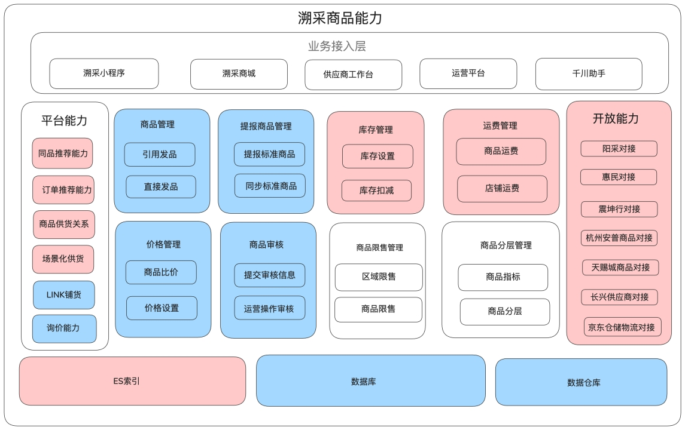

## 分布式设计

### 分布式事务

 保证分布式事务的最终一致性。

**1. 本地消息表**

**本地消息表**是一种在本地数据库中维护消息状态的机制，通常用于实现分布式事务的最终一致性。它通过在本地数据库中记录消息的发送状态，确保消息的可靠发送。

本地消息表字段：业务id，业务类型，消息内容，消息状态（待投递、成功或失败），消息描述，创建时间，重试次数

- 应用程序在本地数据库中插入一条消息记录，标记为“待发送”状态。
- 通过定时应用程序调用消息中间件（如RocketMQ）发送消息。
- 如果消息发送成功，更新本地消息表中的记录状态为“已发送”。
- 如果消息发送失败，应用程序定期重试发送。

**优点**

- **简单易实现**：通过本地数据库记录消息状态，实现相对简单。
- **可靠性高**：通过重试机制确保消息的可靠发送。
- **最终一致性**：通过本地消息表和消息中间件的结合，最终确保消息的发送和消费。

**缺点**

- **性能问题**：数据库操作可能会成为性能瓶颈，尤其是在高并发场景下。
- **依赖数据库**：依赖本地数据库的可靠性，如果数据库故障，可能会导致消息丢失。

**2. 事务消息**

**事务消息**是一种由消息中间件提供的机制，用于确保消息的发送和本地事务的提交是原子性的。它通过两阶段提交协议来实现分布式事务的一致性。

- 应用程序开始一个本地事务。
- 应用程序调用消息中间件发送消息，消息中间件进入“半消息”状态。
- 应用程序提交本地事务。
- 消息中间件检查本地事务是否成功提交，如果成功，则将“半消息”标记为“可投递”状态；如果失败，则丢弃“半消息”。

**优点**

- **强一致性**：通过两阶段提交协议，确保消息的发送和本地事务的提交是原子性的。
- **性能优化**：消息中间件通常会进行性能优化，减少数据库操作的开销。
- **简化开发**：由消息中间件管理事务的一致性，减少了应用层的复杂性。

**缺点**

- **复杂性**：两阶段提交协议本身比较复杂，可能会引入额外的性能开销。
- **依赖中间件**：依赖消息中间件的事务管理能力，如果中间件故障，可能会导致事务不一致。
- **回查机制**：在某些情况下，可能需要回查本地事务的状态，增加了系统的复杂性。

3. **比较**

| 特性           | 本地消息表               | 事务消息               |
| -------------- | ------------------------ | ---------------------- |
| **实现复杂度** | 简单，依赖本地数据库     | 复杂，依赖消息中间件   |
| **一致性**     | 最终一致性               | 强一致性               |
| **性能**       | 可能成为瓶颈             | 通常更优               |
| **依赖**       | 本地数据库               | 消息中间件             |
| **适用场景**   | 读多写少，对性能要求不高 | 高并发，对一致性要求高 |

**4. 适用场景**

- **本地消息表**：
  - 适用于读多写少的场景，对性能要求不高，但需要确保消息的最终一致性。
  - 适用于对消息发送的可靠性要求较高，但可以接受一定的延迟。
- **事务消息**：
  - 适用于高并发场景，对消息的一致性要求较高。
  - 适用于需要强一致性的业务场景，如金融交易、订单处理等。


### 本地消息表 任务框架 亿级商品联动

通过 MQ和本地消息表 结合 任务框架 保证 亿级 铺货商品的 商品信息联动。

**数据现状** 23年开始 100w的商品 20w存在铺货 30w的小B中 存在铺货的小B有5w  至24年中总共铺货关系2000w，到25年中总共铺货关系近1亿。

这个铺货关系一端是我们供应链平台的货品，另一端是交易平台的销售商品，是一对多的关系。如果我们平台的商品发生了变更，我们的业务需要根据供货关系同步到交易平台对应的销售商品，例如商品信息、价格、库存这些。

因为联动的商品数据量可能会比较大，而且可能中间出现各种异常的场景，为了确保变更结果一定能够触达到我们的小B用户，所以自己实现的一套任务框架来完成信息的联动的。而联动任务的创建则是基于商品变更的领域消息来做的。

如果销售商品是一品一规，而供货商品是一品多规的场景，那么一个供货商品在销售端端一个店铺中可能会关联多个销售商品


### 本地消息表和事务消息对比

**优点：**

1. 实现简单，只使用一张消息表来维护消息的发送状态。
2. 容错性较高，如果消息发送失败，可以使用补偿任务重新发送。
3. 实现了分布式系统中数据的最终一致性。

**缺点：**

1. 数据一致性延迟较高，由于依赖异步消息传递，不能立即保证数据一致性，只能实现最终一致性。


## Java

研读过 JDK 源码，如集合、ThreadLocal、线程池、AQS 等基础框架； 

### ThreadLocal 原理

threadlocal 是线程本地变量，

ThreadLocal 内部有一个静态内部类 ThreadLocalMap 这个Map的key是ThreadLocal对象，Value是我们要存储的值。

这里的key和value会包装成一个Entry对象，这个Entry是ThreadLocalMap的静态内部类，同时继承自 WeakReferene 。表示Entry的key 存放的ThreadLocal对象是弱引用的。

每个线程 Thread内部都会持有一个ThreadLocalMap对象threadLocals，这个对象是每条线程用来存储当前线程对应的threadlocal变量信息的，后续通过threadlocal.get()的时候，也是先拿到当前线程的threadLocals对象，然后再根据 threadLocal 获取 value。

在向 ThreadLocalMap 添加元素的时候，如果遇到hash冲突会通过开放寻址法中的 **线性探测** 来实现，这里没有像HashMap一样使用拉链法的原因是，拉链法更适合于解决频繁产生哈希冲突的场景，Thread持有的ThreadLocal对象不会很多，所以这里发生的hash冲突的几率是比较小的。

### AQS原理

### 线程池原理

[Java线程池实现原理及其在美团业务中的实践](https://tech.meituan.com/2020/04/02/java-pooling-pratice-in-meituan.html)

**创建Worker**

具体的worker工作线程 继承了AQS类实现了Runnable接口，并持有一个线程thread，一个初始化的任务firstTask。thread是在调用构造方法时通过ThreadFactory来创建的线程，可以用来执行任务；firstTask用它来保存传入的第一个任务，这个任务可以有也可以为null。如果这个值是非空的，那么线程就会在启动初期立即执行这个任务，也就对应核心线程创建时的情况；如果这个值是null，那么就需要创建一个线程去执行任务列表（workQueue）中的任务，也就是非核心线程的创建。


 如果执行中的线程抛出了未捕获的异常，那么会根据任务的提交方式不同决定线程是否销毁，如果是submit任务的话，工作线程抛出的异常会被捕获存放到对应的Future中，所以线程不会销毁。如果是execute任务的话，抛出未捕获的运行时异常，线程会中断。


### 线程池死锁

https://juejin.cn/post/7065098084606279693

父子异步任务公用一个线程池，当并发度比较高的时候，父方法会直接将核心线程数打满，等到子方法中将任务在提交异步任务到线程池后，核心线程就被挂起，阻塞在子异步任务的future返回上，子方法需要核心线程来执行任务，但所有的核心线程都被挂起了，导致了线程池死锁。

**排查过程**

首先是收到


后续action：

**线程池改造**

借鉴了tomcat的线程策略

JDK 默认线程池是 先创建核心线程 再添加队列 队列满了才创建非核心线程。

tomcat 先创建核心线程 然后创建非核心线程 最后才添加队列。

简单来说就是重写了execute()方法，当抛出拒绝策略了尝试一次往阻塞队列里插入任务，尽最大努力的去执行任务，新增阻塞队列继承了 LinkedBlockingQueue，重写了offer()方法，重写了offer()方法，每次向队列插入任务，判断如果当前线程数小于最大线程数则插入失败。进而让线程池创建新线程来处理任务。

**线程池设置问题**

核心线程池数设置过小，没有做好流量预估，导致触发拒绝策略 和 接口降级

线程池阻塞队列设置过长，最大线程数设置失效，导致请求数量增加时，大量任务堆积在队列中，任务执行时间过长，最终导致下游服务的大量调用超时失败。

**动态线程池**：

因为线程池的参数需要根据线上业务实际情况进行合理的设置，需要不断的观察和调整，所以线程池需要支持动态的配置，为了方便调整配置，所以我们将配置参数保存在我们已有的分布式配置中心apollo上，通过apollo的配置监听功能，监听对应的参数变化然后去修改我们对应的线程池参数。

```java
@Component
public class SomeBean {
    @Value("${request.timeout:200}")
    private int timeout;
 
    @ApolloConfigChangeListener
    private void someChangeHandler(ConfigChangeEvent changeEvent) {
        if (changeEvent.isChanged("request.timeout")) {
            refreshTimeout();
        }
    }
}
```


如果动态设置了setCorePoolSize，会直接覆盖之前的corePoolSize值，并且基于当前值和原始值的比较结果采取不同的处理策略。对于当前值小于当前工作线程数的情况，说明有多余的worker线程，此时会向当前空闲worker线程发起中断请求以实现回收，多余的worker在下次idel的时候也会被回收；对于当前值大于原始值且当前队列中有待执行任务，则线程池会创建新的worker线程来执行队列任务

**线程池监控**：

监控线程池的状态、核心参数、以及任务挤压到一定程度的预警，或者触发拒绝策略的


## JVM

熟悉 JVM，如 JMM、类加载机制、GC算法，进⾏过线上 JVM 的调优； 

### G1和CMS区别 TODO

可预测的停顿模型、动态分区，保留了分区的概念，但没有垃圾分代，

### JVM调优 TODO

[从实际案例聊聊Java应用的GC优化](https://tech.meituan.com/2017/12/29/jvm-optimize.html)

[加一个JVM参数，让系统可用率从95%提高到99.995%](https://mp.weixin.qq.com/s/CSTbvMk9_LcFXFJRD45RlA?clicktime=1750236045&enterid=1750236045&scene=90&subscene=236&xtrack=1)

[高并发场景下JVM调优实践之路](https://www.cnblogs.com/vivotech/p/15492162.html)


### GC问题排查 JVM优化

早期出现这个问题的时候 我们用的是2核4G的机器，一共4台。用的是ParNew+CMS

我们线上的GC情况是 老年代的垃圾回收次数很少，但新生代很频繁

**调整新生代比例**，以及JVM实例子占用机器的内存 

增大新生代比例。 只需要修改JVM参数配置即可， 说起来很简单， 但是需要多次调整并 进行压测， 最终找到一个平衡点， 在保证Full GC的频次和耗时都在合理范围内的前提 下， 把Young GC频次降到最低。

贸然增大新生代比例， 虽然可能降低GC的频次，但是会导致单次GC耗时增加，

首先， 我们需要先明确， 目前主流的新生代收集器大多采用标记-复制算法， ParNew也 一样。 研究表明， 绝大多数应用场景， 新生代中98%的对象生命周期很短， 在毫秒级 别， 基本上被使用一次后就会变成垃圾对象， 会在下一次GC时被清理掉。 在很多JVM中 将堆内存分为一块较大的Eden空间和两块较小的Survivor空间(下图的S0和S1)， 新生对 象存放在Eden区。 当发生Young GC时， 将Eden和当前Survivor中存活的对象一次性复 制到另外一块Survivor中， 最后整体清理Eden和当前的Survivor空间。 每次Young GC 时两块Survivor区互相更换。 HotSpot虚拟机默认Eden和两块Survivor的大小比例是 8:1:1， 也就是说每次新生代中可用内存为整个新生代容量的90%（80%+10%）， 只有 10%的内存会被“浪费”。 

GC时间 = 扫描新生代时间 + 复制对象时间（Eden和当前Survivor复 制到另一个Survivor）。

 JVM实例 占用了2G，新生：老年 是 1:2  新生代占1/3    调整到 4/10

现在我们清楚了ParNew回收器采用了标记-复制算法。 现在来分析一下ParNew回收器 GC耗时和新生代大小的关系。 我们知道标记-复制算法分为两个阶段， 标记阶段和复制阶 段。 为了简化问题我们暂且认为标记阶段只扫描新生代的存活对象， 其实该阶段还需要扫 描部分老年代对象。 假设我们要把新生代扩容1.5倍。

• 扩容前：新生代容量为2G， 假设某对象A的存活时间为600ms， Young GC间隔 500ms， 那么本次GC时间 = 扫描新生代时间 + 复制对象时间（Eden和当前Survivor复 制到另一个Survivor）。

• 扩容后：新生代容量为3G ， 对象A的生命周期为600ms， 但是由于新生代扩容了1.5 倍， 所以Young GC间隔理论上增加到了750ms。 此时发生Young GC， 对象A已经用完 了生命周期， 成为了垃圾对象， 就不需要把对象A复制到另一个Survivor区了。 那么本次 GC时间 = 1.5 × 扫描新生代时间， 没有增加复制时间。

所以， 当扩大新生代容量时， 实际上每次GC需要复制的存活对象并不会按照扩容比例递 增。 容量扩大到1.5倍， 增加的存活对象会远小于1.5倍。 虽然标记阶段消耗的时间提高到 了1.5倍， 但是复制阶段耗时并没有明显提高。 更重要的是， 对于虚拟机来说， 复制对象 的成本要远高于扫描标记的成本， 所以， 单次Young GC时间更多取决于存活对象的数 量， 而非Eden区的大小。 所以， 如果堆内存中存在大量短生命周期的对象（大部分场景 是这样的）， 那么扩容新生代后， Young GC时间不会显著增加。

经过反复调试和压测后， 我们把新生代调整到了2.9G。 机器配置所限， 整个堆内存大小 没变， 保持在8G。

**分代调整**

此外， 观察了各代龄的对象数量情况后， 对代龄设置也做了调整。

前文提到， 当发生Young GC时， 会将Eden和当前的Survivor中存活的对象一次性复制 到另外一块Survivor中， 最后整体清理Eden和当前的Survivor空间。 每次Young GC时 两块Survivor区会互相更换。 存活对象在两块Survivor区之间每交换一次， 对象年龄就 会增长一岁。 直到达到MaxTenuringThreshold设置的年龄（默认是15岁）时， 相应的 对象就会被转移到老年代。 所以为了减少复制成本， MaxTenuringThreshold要尽量合 理， 不能设置太大， 否则有些长寿对象在每次GC时都会在两个Survivor区之间来回复 制， 无疑是增加了复制阶段的耗时。

 在15个分代中， 7岁以上的对象80%都会被转移到老年代（769.02除以980.48 ≈ 80% ）。 于是我们把 MaxTenuringThreshold 的值调整为 7， 将年龄超过7岁的对象 直接转移到老年代。 这样就减少了长寿对象在两个 survivor 区之间来回复制带来的性能 开销。

**最终**

经 过 一 轮 调 整 和 压 测 ， 最 终 新 生 代 调 整 到 了 2.9G ， 整 个 堆 内 存 保 持 8G 不 变 ， MaxTenuringThreshold调成了7。 新生代增大了将近1.5倍， Young GC 的频率减少了 大概1/3。 GC 的吞量提高了3.8%， 达到了96.8%， 。 Young GC 平均耗时稍有上升， 从 60ms上升到了71ms， 基本符合预期。 另外Full GC 的频率和耗时也在可接受的范围。


## Spring

### spring事务管理

主要分为申明式事务和编程式事务。

核心原理：首先在spring容器加载阶段会扫描识别出@Transactional注解的方法，并获取注解上的事务属性如事务的隔离级别、传播机行为和超时时间，同时还会使用 JDK 的动态代理或者Cglib 代理生成对应的代理对象，当代理对象中被代理的方法在被调用会进入事务拦截器 TransactionInterceptor 的事务处理逻辑，例如：根据事务的属性判断是否要新开启事务，以及事务的提交和回滚逻辑。这其中的事务上下文会被存放在 TransactionSynchronizationManager 的 ThreadLocal 中，用来传递事务相关的资源信息，如数据库连接。


## Redis

[Redis.md](../Database/Redis/Redis.md)

熟练掌握 Redis，对底层数据结构、持久化机制有深⼊解

### Redis为什么快

1. **基于内存操作**

   相较于硬盘来讲速度更快，高吞吐和低延迟，因为硬盘是物理结构，一次读取包含磁头的寻道时间+盘片旋转将数据所在扇区移至磁头下方+数据传输时间

   

2. **基于单线程操作**

   减少线程上下文切换，多线程会带来频繁的上下文切换

   减少锁竞争带来的开销，如果存在锁竞争，那么没抢到锁的线程会被阻塞，这个过程中涉及到系统调用，而系统调用的产生会从用户态切换到内核态，这个过程也需要保存上下文信息，对性能有影响。（vmstat 是针对CPU、内存的监控工具，可以通过 cs 查看切换次数）

   作为Reids本身来讲，它是一个基于内存的非关型数据库，它的性能瓶颈其实不在CPU，而是在内存和网络IO，例如内存分配的大小，包括key的存活和失效，读写的时候网络的带宽以及传输过程中IO的效率。

   redis6.0 增加了多线程来处理IO 部分的读写，核心的计算逻辑还是由redis 主线程来完成。	 

3. **IO多路复用模型**

   [think of Java：Java IO](../Java/JavaBase/md/think of Java：Java IO.md)

   UNIX中定义的IO模型通常包含两个阶段：

   1. 等待数据准备好
   2. 将数据从内核缓冲区复制到用户空间（实际的IO操作）

   **同步阻塞IO**：用户空间中调用recvfrom，发生系统调用，如果内核缓冲区没准备好数据，那么线程在此期间会一直等待。

   **同步非阻塞**IO：用户空间中调用recvfrom前，将socket设置为非阻塞，这样当内核缓冲区数据没有准备好的时候，线程不会等待，而是直接返回一个错误，然后由调用方去不停的轮训数据是否准备好。

   **IO多路复用**：Linux内核提供了select/poll/epoll函数来支持由一个线程监听一组socket的数据是否处于准备就绪，当某个socket数据准备就绪后，select等函数会返回对应的连接，再真正调用recvfrom函数将数据从内核复制到用户态返回。本质上还是同步IO。

   

4. **高效的内部数据结构**

   SDS：简单动态字符串，是string类型的底层数据结构之一。

   QuickList：快速链表，是list类型的底层数据结构。

   ZipList：压缩列表，是hash类型的底层数据结构之一。

   ZSkipList：跳表，是zset类型的底层数据结果之一。跳表其实就是对普通的有序链表建立了索引层，比如将有序链表中的奇数节点提取到上一级，这样可以就可以借助二分查找到思想加快链表的遍历和读写操作。


### 分布式锁

当多个分布式系统需要竞争同一资源时，例如商品的创建、更新、库存的扣减都会用到分布式锁，来保证资源的互斥访问。

**三种实现方式：**

**mysql 实现**：通过唯一索引实现锁，优点：简单易懂，缺点：数据库连接数有限，在高并发下会成为性能瓶颈，而且锁的可靠性依赖数据库，一旦数据库故障，锁会失效。

**redis 实现**：通常是使用 SET NX + PX 过期时间，优点：性能会比较好，缺点：redis单节点故障问题，如果主节点挂了，从节点还没有同步，会导致锁丢失。

```java
SET resource_name my_random_value NX PX 30000
NX：仅在不存在 key 的时候才能被执行成功；PX：失效时间，传入 30000，就是 30s 后自动释放锁；
```

**zk 实现**：基于强一致性，通过临时有序节点实现 优点： 能够很好的保证锁的公平性和可靠性，缺点：在高并发的场景下，zk的写操作需要集群内的投票，会有一定的延迟。

**使用注意：**

在使用上还要注意尽量细化锁的粒度，以及设置好锁的过期时间，并且还要有锁的自动续租机制，避免锁提前失效。

在加锁的时候，将value设置为当前获取锁的线程，防止其他线程释放当前线程的锁。（考虑到线程id可能会重复，可以通过拼接全局唯一的信息，如当前节点的分片序号）

在释放锁的时候，根据value判断删除的线程id是否为加锁的线程id，如果一致才能进行删除，其中需要通过lua脚本来保证 get 和 del 命令的原子操作。

### Redisson

redisson 是 redis 官方推荐的Java版客户端，它在通信上是基于NIO的netty框架，保证网络通信的高性能，并且提供了多种功能的分布式锁实现，如：可重入锁（ReentrantLock）、公平锁（FairLock）红锁（RedLock）联锁（MultiLock）、读写锁（ReadWriteLock）等。

**可重入锁ReentrantLock实现**

底层是通过hash这种数据结构，结合lua脚本实现了锁的可重入，通过将线程id设置hash的 field，将锁的重入次数设置value。

**公平锁FairLock实现**

实现类似于AQS的原理。

排队机制：使用Redis的List结构维护等待队列

订阅发布：通过Redis的pub/sub通知下一个等待者

双重检查：获取锁时检查自己是否在队列头部

**联锁MultiLock实现**

同时对多个key同时进行加锁，所有的锁加锁成功才返回成功。整个操作是在lua脚本中保证原子性。

顺序加锁：按传入锁的顺序依次尝试获取

失败回滚：任意一个锁获取失败时，释放已获得的所有锁

统一过期时间：所有锁使用相同的过期时间

**红锁RedLock实现(不建议使用)**

如果对分布式锁的性能、可靠性、容错性方面有很高的要求的话，可以使用分布式锁的集群方案，这样能通过集群的容错性，来避免单节点故障。但是集群下锁仍然可能因为故障转移而导致失效。如：

1. 客户端 A 从 master 获取到锁
2. 在 master 将锁同步到 slave 之前，master 宕掉了。
3. slave 节点被晋级为 master 节点
4. 客户端 B 从新的master 节点获取到同一把锁。

针对这个问题，Redis 作者 提出了RedLock的概念，核心思路是通过多个redis的master节点来实现锁的获取和释放，提高可靠性。只有当**超过半数的实例加锁成功**后才认为获取到锁（同时也要满足整体加锁时间小于锁过期时间的一半）。这个就需要使用者来保证加锁的key分散在不同的master节点上。

而且该算法依赖系统时钟的准确性，如果多个节点的时间同步存在差异，可能导致锁提前失效，引发安全问题。

还有在性能是


RedLock的底层实现是基于联锁MultiLock的，联锁是要求所有key都加锁成功，而红锁要求半数加锁成功。


### Redis 集群模式

测试环境 redis CLUSTER部署 6台机器

10.11.3.234:6379,10.11.7.251:6379,10.11.9.221:6379,10.11.15.45:6379,10.11.2.140:6379,10.11.11.176:6379

Redis 集群中，如果某台节点（Master 节点）挂了，Redis Cluster 会自动执行故障转移，将挂了的Master 节点的从节点（Slave）提升为新的Master 节点，从而保证集群的正常运行。

需要注意的是，如果集群中某个Master 节点挂了，且该节点没有从节点，那么这个集群就会挂掉。所以为了保证集群的高可用性，建议每个Master 节点都有至少一个从节点。

**Redis 哈希槽**

2^14=16384 没有用一致性hash。原因是一致性哈希的节点分布基于圆环，无法很好的手动设置数据分布。


### 注解缓存组件 多级缓存

基于AOP 设计 通⽤注解缓存查询组件，低代码侵⼊，结合多级缓存技术 提升核心链路性能70%。

[Spring Cache缓存使用问题整理](https://blog.csdn.net/youbl/article/details/113052502)


1. 基于注解，不侵入代码，使用Spring AOP实现，轻量级，相比Spring 提供的注解缓存，可扩展性更高一些。

2. kernelCache缓存的删除是基于binlog的，基础架构会将bin log解析发送至消息队列，我们监听消息去处理删缓存，这里也可以做一些延时双删的操作，来保证db缓存的一致性。也可以由业务逻辑内自行进行缓存删除。

3. 还有一些都是默认的Redis缓存实现不支持，需要去实现相关扩展接口的。

   - 默认的RedisCacheManager是使用JDK的序列化，性能差；我们自己的缓存组件也就是kernelCache，是可配置序列化方式，默认gson。

   - 默认的是无法配置不同的缓存过期时间；kernelcache可以根据缓存枚举中的过期时间时间来差异化配置。

   - 默认是同步写缓存的，而kernelCache是异步线程池写缓存。


**多级缓存/缓存一致性** 支持高性能

cache aside  先更新数据库 再删缓存，也可以异步化 通过canal+MQ 监听数据库变更来刷新缓存，最终保证缓存和数据库的最终一致

优点：可以减少操作缓存的时间

缺点：

引入中间件，需要保证中间件的高可用，会增加系统成本

相比同步操作，异步操作的一致性的时间会拉长，因为涉及到MQ就可能存在消息堆积的场景，这个需要从业务上考虑是否可以容忍这种情况。

每个微服务基于自己的业务去封装存储的细节，数据库也应该独立拆分，

大Key


并且，为了防止缓存雪崩问题、缓存击穿问题，我们通常会采用多级缓存的解决方案，所谓的多级缓存就是：分布式缓存（Redis 或 Memcached）+本地缓存（Guava Cache 或 Caffeine）。因为分布式缓存可能会失效、可能会挂掉，所以为了系统的稳定性，多级缓存策略使用的非常广泛。

那么，问题来了，怎么保证本地缓存的一致性？

> 所谓的一致性是指在同时使用缓存和数据库的场景下，要确保数据在缓存与数据库中的更新操作保持同步。也就是当对数据进行修改时，无论是先修改缓存还是先修改数据库，最终都要保证两者的数据是一样的，不会出现数据不一样的问题。

**1.如何保证本地缓存的一致性？**

在分布式系统中，使用本地缓存最大的问题就是一致性问题，所谓的一致性问题指的是当数据库发生数据变更时，缓存也要跟着一起变更。而分布式系统中每台机器都有自己的本地缓存，所以想要保证（本地缓存的）一致性是一个比较难的问题，但通过以下手段可以最大程度的保证本地缓存的一致性问题。

**① 设置本地缓存短时间内失效**

设置本地缓存短时间内失效，短的存活周期，保证了数据的时效性比较高，当数据失效之后，再次访问数据就会拉取新的数据了，这样能尽可能的保证数据的一致性。

它的特点是：代码实现简单，不需要写多余的代码；缺点是，效果不是很明显，不适合高并发的系统。

**② 通过配置中心协调和同步**

通过微服务中的配置中心（例如 Nacos）来协调，因为所有服务器都会连接到配置中心，所以当数据修改之后，可以修改配置中心的配置，然后配置中心再把配置变更的事件推送给各个服务，各个服务感知到配置中心的配置发生更改之后，再更新自己的本地缓存，这样就实现了本地缓存的数据一致性。

**③ 本地缓存自动更新功能**

使用本地缓存框架的自动更新功能，例如 Caffeine 中的 refresh 功能来自动刷新缓存，这样就可以设置很短的时间来更新最新的数据，从而也能尽可能的保证数据的一致性，如下代码所示：

```java
// 创建 Caffeine 缓存实例
Cache<String, String> caffeineCache = Caffeine.newBuilder()
// 设置缓存项在 5s 后开始自动更新
.refreshAfterWrite(5, TimeUnit.SECONDS)
// 自定义缓存更新逻辑（即获取新值逻辑）
.build(new CacheLoader<String, String>() {
    @Override
    public void reload(String key, String oldValue) throws Exception {
        // 模拟更新缓存的操作
        updateCache(key, oldValue);
    }
});
```

**2.实际工作中会使用哪种方案？**

不同的业务系统，会采用不同的解决方案，例如以下这些场景和对应的解决方案：

- 如果对数据一致性要求不是很高，并且程序的并发压力不大的情况下，可能使用方案 1，也就是设置本地缓存短时间内失效的解决方案，因为它的实现最简单。

- 如果对数据的一致性要求极高，且有配置中心的情况下，可使用配置中心协调和同步本地缓存。

- 相反，如果对一致性要求没有那么高，且为高并发的系统，那么可以采用本地缓存的自动更新功能来实现。

  

在多级缓存中，本地缓存是不可或缺的组成部分，而想要保证本地缓存的数据一致性，可能采用：设置较短的本地缓存过期时间、通过配置中心来协调和同步本地缓存，以及使用本地缓存框架的自动更新功能保证数据的一致性等解决方案，而不同的业务场景，选择的解决方案也是不同的。


## MySQL

熟练掌握 MySQL，对索引、数据库锁、MVCC有深⼊理解； 

数据库指标

10台 每台 400 DB支持最大8000连接

版本是5.6 升 8.0


### 数据库锁

[MySQL.md](/Users/networkcavalry/Documents/GitHub/Framework/Database/MySQL/MySQL.md)

### 大表添加字段

[大表加锁 Online DDL](https://blog.csdn.net/qq_26664043/article/details/132067933)

MySQL 8.0 对 DDL  的实现重新进行了设计，Online DDL  支持 instant 算法，可以更快的添加列 和 字段默认值。

其原理是 只需修改数据字典中的元数据，无需拷贝数据也无需重建表，同样也无需加排他 MDL 锁，原表数据也不受影响。整个 DDL 过程几乎是瞬间完成的，也不会阻塞 DML。


在线DDL功能的实现涉及以下关键步骤和优化：1 创建临时表：通过创建临时表来存储将要进行的DDL操作所需的新结构。这样，旧表仍然可用于读写操作。
2 数据复制和同步：将旧表中的数据逐步复制到临时表中，并保持旧表数据与临时表数据的同步。这一过程确保了数据在DDL操作期间的完整性和一致性。
3 变更捕获和重放：通过使用日志和重做日志等机制，捕获在执行DDL操作期间发生的数据变更，并将其重放到临时表中。这确保了DDL操作完成后数据的一致性。
4 最终切换：当DDL操作完成时，数据库引擎将在适当的时机切换到临时表，使其成为新的表结构，并且对新表进行后续的读写操作。


### 分库分表 数据平滑迁移方案

前提：优化索引=>加缓存=>异步化=>分库分表

分库，并发量导致数据库的连接数不够用了。

分表，是因为单表的数据量太大，导致索引的维护成本高和查询效率低。

使用 Sharding-JDBC 对商品铺货关系表进行 水平拆分，优化单节点数据过载问题。设计 平滑数据迁移方案。

**业务背景** 我们有一个铺货关系表，用于维护小B的货物供给关系，该表当时差不多2000w数据，因为和其他业务的表存在同一个数据库中，所以出现慢SQL等异常情况时会响应其他表的业务，为了提升系统整体的可靠性和稳定性，以及保证该表后续的读写性能，所以我们将该表从原有的数据库中迁移，在迁移中进行水平拆分，同时要保证数据的平滑迁移。

**问题**  大表添加字段的问题 数据库设计规范中新加字段必须要默认值，数据库版本升级从5.6 升级到 8.0 ，出现慢SQL影响其他业务 

需要物理删除的数据 在同一个事务中，转移点开归档表 ，归档表中会创建代理主键，删除时间，删除原因，删除人id

**数据现状** 23年开始 100w的商品 20w存在铺货 30w的小B中 存在铺货的小B有5w  **至24年中一年内总共铺货关系2000w**

**容量规划** 1w家活跃店铺平均铺货1w个商品，**当时预估从24年中至25年中能能增长1亿。至2027年中能增长到10亿**。考虑到成本和这张表的读写压力，按照单表1000w纬度，差不多需要100张表。所以我们4库128表，其中4个库分布在2个实例下，每库32表，累积2x2x32=128张表。如果后续实例压力提升可以去进行实例配置升级或者进行数据库迁移至新实例，升级成本较小。

**数据迁移** 

整个过程包含：

- 前期准备
  - 分析数据现状
  - 进行容量规划
  - 确定方案，开发数据迁移脚本
  - 确定分库分表的规则，因为业务上都是按照机构纬度去查询，所以我们将机构id作为分库分表键。
  - 确保数据表有发号器生成的唯一键，有创建时间、更新时间和版本号。
- 数据同步
  - 主要是分为全量同步+增量同步

  - 开启binlog监听MQ（不消费）=〉全量数据同步新库 =〉开始消费binlogMQ =〉关闭binlog监听MQ =〉新老双写 =〉全量双向校验 =〉增量双向校验 =〉动态校验 =〉灰度切流  =〉 切流观察 =〉关闭双写双读

  - 历史数据全量同步：DBA协助帮忙处理历史数据hash后到新的库表中（也可以脚本select全量数据hash后插入新库表），在开始同步之前就要打开老库binlog消息订阅ROW模式，保存在MQ中，但是不消费，等到全量同步完成后新库开始消费消息（因为在复制过程中可能存在复制过的数据又发生了更新或删除动作，这样新库如果不处理这个操作，那么就会出现数据不一致的情况）
  - 实时数据同步：通过双写的方式实时保证新老库数据一致，当新库把binlog消息消费完后，就可以开启新老库实时双写，双写之前要停掉binlog的监听。先写老库，后写新库，如果老库写入失败，那请求返还失败，如果老库成功，新库失败那就记录失败日志，整体返回成功。这样确保老库的数据始终是准确的（如果对时延要求比较高的话，新库的写入可以异步完成）
- 数据校验

  - 全量双向校验：等到双写开始之后，我们可以基本认定新老库的数据是一致的，但也可能因为双写写入失败出现不一致的数据，而且我们的link关系是可以物理删除的，保险起见，我们进行新老库双向的校验检查，遍历老库中的数据，检查在新库中是否存在以及数据是否一致（因为可能新库创建失败）。遍历新库中的数据，检查在老库中是否存在以及数据是否一致（因为可能新库删除失败）。不一致的时候就记录类型和数据，方便后续捞取日志进行人工补偿。
  - 增量双向校验：定时任务每10min检查最近一小时更新数据是否一致，校验逻辑和全量双向校验一样。因为可能存在老库操作后，新库还没来得及更新，这种短暂不一致的情况，在此期间触发了定时任务的校验产生的告警，这个我们会根据告警id的出现次数来过滤这种情况，比如只去检查同一条数据告警次数统计大于3的记录
  - 动态校验：对灰度切读的机构，在查询的时候进行动态校验。同时查新老库的数据，比对新老库数据，如果不一致以老库数据为准，记录告警日志。
- 灰度切流

  - **机构打标灰度**，通过运营对机构打标的方式分批去对用户做读流量的迁移，打了标的读新库，没打标的读老库。如果通过白名单这种偏配置的对于需要配置的数据量太大不好处理，而且运营挑选的机构都是和平台配合度比较高，有问题的话影响面也会控制在一定范围内。
  - **确保随时能回切，**双写在彻底切换完成前都要开启，保证随时能够回切，切回的方式也很简单，机构去标就可以。

我先补充一下前提
1.我们的商品消息都使用的是RocketMQ的顺序消息
针对你刚才提到的问题：

1. 全量数据库同步到开始消费binlog之间，是否会有新写入的部分数据丢失？（这里貌似MQ堆积，后续消费，但部分数据是否可能重复写入，幂等如何解决）

   答：基本不会出现数据丢失（出现的话后边通过数据检验模块进行人工干预），同步期间产生的数据变更，会由架构团队保证binlog能投递到MQ中，同一个商品的变化，发送端按照顺序去投递，消费端按照顺序去消费，消费的时候也有分布式锁来保证，只要能保证变更的MQ不乱序，但重复消费也不会影响数据的最终一致性

2. 新老双写的一致性是否类似分布式事务？双写新库失败的策略是什么？

   答：新老双写不存在分布式事务，代码流程是先写老库再写新库，如果老库写入失败，那请求返还失败，如果老库成功但新库失败那就记录失败日志，整体返回成功。这样确保老库的数据始终是准确的

3. 校验对账，是否存在正在双写中的数据误报的情况？

   答：可能会存在误报，因为这种误报大多数是短暂的不一致导致的，所以在增量数据校验的时候，是10分钟检查1个小时的数据，不一致的次数达到3次才会进行告警记录，避免这种短暂不一致导致的误报

4. 在老库hash到新表的过程中，是否会给老库带来类似慢SQL压力？如何控制风险

   答：这个的话几个办法，a 在业务低峰期执行，b 通过延长同步时间的方式来减少查询老库的速率和请求压力，c 使用阿里的DTS对读库进行查询

5. 新库把binlog消费完，开启新老双写，如何控制MQ生产消费速度保证出现0堆积（消费完）

   答：新库消费完然后开启双写这个是通过配置来控制的，时间是很短暂的，如果产生了数据不一致那就靠后边的人工补偿

6. “如果老库成功，新库失败那就记录失败日志，整体返回成功”，这个数据不一致如何处理？

   答：这个需要排查失败原因，然后人工补偿，确保线上双写没问题一段时间后才会进行后续的步骤

7. “定时任务每10min检查最近一小时更新数据是否一致”，为什么是10min检查1小时？这两个时间如何评估的？

   答：这个是根据我们的写入量来进行的评估，确保10分钟的这个间隔的变更量不会太大或者太小  1个小时的这个是根据我们那个3次的失败阈值来评估的，这个阈值可以调整，最大的话不超过5次

8. 动态校验，新老都查，是串行查询么，那是否所有数据库查询操作理论都是2倍rt，是否存在风险，是否可以并行查？如果一个数据库响应过慢是否会阻塞请求？

   答：双读这个校验是异步任务去执行的，查询的链路不会有任何影响，有查询老库的时候会用本地消息队列或者MQ的方式去异步的完成数据校验

9. 切换过程中做重构

10. 切读的过程中读老的不读新的，什么时候断开双写

11. 功能重构时 做切换升级，需要考虑新老数据结构的差异，双读双写的开启时机和断开时机


### 数据库优化思路

- 硬件方面，如果SQL复杂需要有大量计算逻辑的考虑升级CPU配置，如果说都是简单SQL，但是偏向大数据量的考虑升级内存，提升数据库内存缓冲区的大小。
- 存储引擎，不要求事务的话，可以不使用InnoDB
- 隔离级别，越高的隔离级别，为了数据的一致性，所付出的锁的代价就越高，例如RR可重复读的隔离级别下，为了解决幻读会产生额外的间隙锁。
- 数据库的连接数
- 建表字段类型的选择，反范式设计
- 索引的创建和优化
  - 加索引字段的区分度比较高，尽量避免索引失效的场景，例如参数过多导致
  - 索引覆盖，通过非聚簇索引就能满足查询字段，就不用回表到聚簇索引上查询其他字段。
  - 索引下推，将一部分数据过滤能力从服务层下沉到存储引擎里。从而减少回表的次数以及上传到服务层的数据。
- 分库分表，考虑ROI投入产出比
- 读写分离，考虑主从延迟带来的影响

### 慢SQL处理方案

| 种类           | 原因                                  |
| :------------- | :------------------------------------ |
| 索引缺失或失效 | 查询字段未建索引，或索引未命中        |
| 查询字段过多   | SELECT * 查询不必要字段，增加 IO 负担 |
| 表数据量过大   | 单表数据量过大，查询效率下降          |
| JOIN 过多      | 多表关联查询，尤其大表 JOIN 大表      |
| 子查询嵌套     | 子查询执行效率低，尤其相关子查询      |
| 锁等待         | 查询涉及锁竞争，导致阻塞              |
| 不合理的分页   | 深分页（如 limit 100000, 20）性能差   |
| SQL 写法问题   | 使用了不合理的 SQL 语法或逻辑         |

业务场景合理性

缓存层级

通过在存储引擎层通过索引覆盖降低回表和优化排序

报表数仓+提前计算

有些慢SQL可能无法完全避免，考虑数据库的主从架构，做读写分离。

### 索引失效场景

- **模糊查询，**当我们使用左或者左右模糊匹配的时候，也就是 like %xx 或者 like %xx%这两种方式都会造成索引失效；
- **使用函数，**当我们在查询条件中对索引列使用函数，就会导致索引失效。
- **隐式类型转换，**MySQL 在遇到字符串和数字比较的时候，会自动把字符串转为数字，然后再进行比较。如果字符串是索引列，而条件语句中的输入参数是数字的话，那么索引列会发生隐式类型转换，由于隐式类型转换是通过 CAST 函数实现的，等同于对索引列使用了函数，所以就会导致索引失效。
- **未满足最左前缀匹配原则，**联合索引要能正确使用需要遵循最左匹配原则，也就是按照最左优先的方式进行索引的匹配，否则就会导致索引失效。
- **查询的数据量过大**，的时候也会导致索引失效，可以通过业务层来限制传入参数
- 在 WHERE 子句中，如果在 OR 前的条件列是索引列，而在 OR后的条件列不是索引列，那么索引会失效。


### MySQL架构


文件存储为.ibd文件

bufferPool 在磁盘和内存之间加一层进程纬度的缓存， 缓存的是16k的数据和索引页，读数据优先度读buffer pool。

文件系统中也有一个文件缓存，文件读取也会将文件加载到操作系统的文件缓存中，同样都是缓存，MySQL 设计进程纬度的缓存 bufferPool  是为了实现更多缓存淘汰策略，还能使用加锁等高级特性，因此有了 bufferPool 就不需要使用操作系统的文件缓存了，所以 bufferPool 通过直接IO模式，绕过操作系统的缓存机制，直接从磁盘读取数据。  

自适应Hash索引

ChangeBuffer，数据在更新的时候除了要更新主键索引外，还要维护对应字段的普通索引，可以将数据变更写入到 ChangeBuffer 中，然后等到对应的索引页要写入bufferPool的时候，再将对应更新应用到索引页中。通过这种方式来减少磁盘IO，提升性能。

UndoLog，为了保证数据的一致性，在事务回滚的时候需要对事务中执行成功的数据做回滚操作，这里就需要知道这条数据变更之前的版本， 所以在更新bufferPool中的数据页的时候，会根据旧数据生成对应的 UndoLog 记录。 存储在 bufferPool 中的特殊 UndoLog 内存页中。并随着bufferPool 的刷盘机制不定时写入到磁盘的 UndoLog 文件中。

RedoLog，在bufferPool的操作都是内存操作，如果内存操作只写了一半到磁盘中，数据库进程就崩了，事务还没来及的回滚，那么进程恢复的时候，需要保证事务的一致性。这就需要将事务中更新数据行的操作，都写入 RedoLogBuffer内存中，在事务提交的时候，进行RedoLog 刷盘，将数据固化到物理磁盘中。

数据库Server层，Server层本质上就是SQL语句和存储引擎的中间层。 一方面用于管理来自应用的网络连接，并提供 **分析器** 用于检查SQL语句的语法，提供 **优化器** 用于根据对应规则和索引生成对印的执行计划，以及提供 **执行器** 根据执行计划调用存储引擎层接口函数。Server层和存储引擎层共同构成一个完整的数据库。

binLog，Server层会将所有的变更操作，记录到磁盘上的binLog日志文件中，一旦误删表就可以通过 binLog 来恢复数据。

**语句执行流程**

客户端和Server建立网络连接，将SQL发送到Server层，然后分析器检查语法，优化器生成执行计划，执行调用存储引擎接口函数来执行。

读接口：判断 bufferPool 中是否存在所需的B+树数据页，如果存在则直接返回数据，不存在则从磁盘中读取相应的数据页加载到bufferPool中，再返回数据。

写接口：会将数据先写入 BufferPool 中，并生成对应的UndoLog 日志，以便在事务回滚时，能够恢复数据的原始状态。同时还会将写操作记录到 RedoLogBuffer中，这些RedoLogBuffer会周期的写入到磁盘 RedoLog 文件中，就算数据库奔溃，对于已提交的事务更新也不会丢失，对于辅助索引的更新操作，InnoDB 会将更新存在ChangeBuffer中，等到相关的索引页被读取到BufferPool时，再进行实际的更新操作，从而减少磁盘IO，提高写入性能。


**常见问题**

Mysql是什么？ 数据页是什么？ Mysql数据页为什么是16KB. B+树是什么？ 数据页和索引页是什么？ Buffer Pool是什么？ 自适应哈希索引是什么？ Change Buffer是什么？ Undo log是什么？ Redo log是什么？ InnoDB是什么？ Myisam是什么？ Mysql Server是什么？ Binlog是什么？ 有Redo log为什么还要有binlog？ Mysql连接器是什么 Mysql优化器是什么 Mysql执行器是什么 Mysql分析器是什么？ Mysql执行计划是什么？ 数据库查询流程 数据库更新流程

第一个为什么不能只用 redo log？

尽管 redo log 能保证崩溃恢复，但它有以下局限性：

redo log 只适用于 InnoDB 存储引擎，而 binlog 适用于所有存储引擎（如 MyISAM）。

redo log 是循环写的，日志空间固定，写满后会覆盖旧日志，无法用于长期数据恢复。

redo log 无法进行主从复制，MySQL 的主从同步机制依赖 binlog。

二、为什么不能只用 binlog？

虽然 binlog 记录了所有事务操作，但它也有局限性：

binlog 只是逻辑日志，记录的是SQL 语句或行级变更，但不保证事务的持久性。

binlog写入时机比 redo log 晚，如果数据库崩溃，binlog 可能还没来得及写入，导致数据丢失。

binlog只能用于恢复和同步，不提供崩溃恢复功能，因此不能替代 redo log。总结：为什么 MySQL 需要 redo log 和 binlog ？

redo log 解决的是崩溃恢复问题，保证事务的持久性。

binlog解决的是数据恢复、主从复制问题，记录所有数据变更，确保主从同步和时间点恢复（PITR）。

MySQL 事务提交的顺序是先写 redo log，再写 binlog，确保数据一致性。 

## MQ

### Kafka 架构 

kafka中也是 producer broker consumer 的概念。

kafka中 为了提升单个topic的性能，将单个topic拆分为多个partition，类比RocketMQ中的MessageQueue。

同时为了保证系统的扩展性，会将多个partition 分别部署到不同的broker上。

同时为了保证系统的可用性，为 Partition 增加了多个副本。

为了协调和管理 kafka 的数据消息，引入 zk 作为协调节点。

- ZK 在 kafka 架构中会和 broker通信，维护集群信息。当有新的 broker 加入集群后，其他的 broker 也会立马感知到，不过当新的broker加入后，它默认是没有数据的，需要通过kafka管理工具来重新分配分区和副本，重新分配分区涉及到数据迁移，需要谨慎操作，以免对集群性能造成影响。


### RocketMQ 架构

RocketMq 在 kafka 的基础上做了架构的简化和功能的增加。


### RocketMq 和Kafka 架构区别 

RocketMQ 设计是借鉴了Kafka的设计理念，并在架构上做了减法，在功能上做了加法。

**简化一：简化了分布式协调节点 zk**

Zookeeper 作为分布式服务协调节点，它不仅可以用于服务注册和发现，还可以用于分布式锁和配置管理等场景。 Kafka其实只用到了它的部分功能。对于消息队列本身来说可能太重了，所以 RockMQ 中直接将 Zookeeper去掉，换成Nameserver 用一种更轻量的方式管理消息队列中的集群信息。

> zk 在2.8版本后也支持移除 ZooKeeper，通过 broker 之间加入一致性算法 Raft 实现同样的效果。

**简化二：简化分区**

 Kafka 中会将一个topic 拆分成多个 Partition 分区，来提升消息消费的并发性能，RocketMQ 中将一个topic 也拆分成了多个MessageQueue 分区。Kafka 的Partition 中会存放完整的消息体，而 RocketMQ 中的 MessageQueue 中只存一些简要信息，比如消息的偏移量 offset。而消息的完整数据会存放在  CommitLog 中，通过 offset 可以快速定位到 CommitLog 上的某条消息。

因此在消费消息时，Kafka 只需要从 Partition 中读取完整消息消费，而 RocketMQ 需要先获取消息的偏移量offset，然后再根据偏移量到 CommitLog 中找到对应的完整消息。

**简化三：简化底层存储**

Kafka 的 Partition 分区在底层其实是由多个 segment 段来组成的， 每个 segment 都可以看作为是个小文件，将消息数据写入某个 Partition分区，其实本质是就是将数据写入到某个 segment 文件下。众所周知，顺序写磁盘的效率要远远高于随机写文件，所以单个的 segment 文件的写入是顺序写，但是由于kafka 中会有很多 topic，每个topic有多个 Partition 分区，然后每个 Partition 分区又对应多个 segment 文件。那么当同时写多个 topic 的时候，底层会触发对多个文件的读写，虽然每个文件内部都是顺序写，但是多个文件存放在磁盘的不同地方，原本的顺序写文件就可能劣化成随机写。于是写的性能就降低了。

RocketMQ 为了缓解同时写多个文件带来的随机写问题，它将单个 broker 下的多个topic 数据都统一写入到一个 文件 CommitLog 中，这个就消除了随机写多文件的问题，将所有写操作都变成了顺序写，大大的提升了 RocketMQ 在多 topic 场景下的写性能。

**简化四：简化备份模型**

Kafka 会将多个 Partition 分散到多个 broker 中，并为每个 Partition 配置副本，将 Partition 分为 leader 和 follower，也就是主从 Partition，主从 Partition 之间会建立数据同步，本质上就是同步 Partition 底下的 segment 文件数据。

RocketMQ 简化了底层存储，整个 broker 上的消息都存放在 CommitLog 中，所以 RocketMQ 直接同步 CommitLog 文件，以 broker 纬度来区分主从。保持高可用的同时也同时简化了数据备份模型。

**增加功能一：消息过滤**

RocketMQ 支持通过标签过滤消息的功能，而 Kafka 只能收到消息后在使用测根据自定义的消息类型来过滤。

**增加功能二：事务消息**

Kafka 的事务消息是保证多条消息发送的原子性，保证同时成功或者同时失败。而我们日常业务中更需要的是

业务代码和消息发送的一致性，RocketMQ 的事务半消息就能支持这样的场景。

**增加功能三：延时队列**

RocketMQ 通过延时队列支持延时消息的发送。

**增加功能四：死信队列**


### 顺序消息

例如商品的先改价再上架，如果不保证顺序性的和 他们

**生产方**

生产方线程通过实现**`MessageQueueSelector`** 接口，通过对分片键取模的方式，保证相同ID的商品变更消息会投放到同一个MessageQueue中。

**在业务层面上我们通过分布式锁的方式保证一个商品的变更消息是顺序的。**

**消息存储**

**Broker，会将所有消息按到达顺序追加到CommitLog文件，确保物理存储顺序与发送顺序一致。**

**消费方**

RocketMQ对提供了两种消费模式，一种是并发的消费方式 **MessageListenerConcurrently** ，和有序消费模式 **MessageListenerOrderly**，

顺序消息需要确保消费者注册的时候使用后者，每个消费者的消费端都是通过线程池的方式来消费消息的，只不过采用有序消费模式后，会分布式锁和本地锁来保证消息的有序消费。**确保同时只有一个消费者线程去消费一个消息队列中的消息。**

**即顺序消费模式使用3把锁来保证消费的顺序性：**

1.**broker端的分布式锁：**

- 在负载均衡的处理新分配队列的updateProcessQueueTableInRebalance方法，以及ConsumeMessageOrderlyService服务启动时的start方法中，都会尝试向broker申请当前消费者客户端分配到的messageQueue的分布式锁。
- broker端的分布式锁存储结构为ConcurrentMap<String/* group */, ConcurrentHashMap<MessageQueue, LockEntry>>，**该分布式锁保证同一个消费组consumerGroup下同一个消息队列messageQueue只会被分配给一个消费者客户端consumerClient。**
- 如果拿不到这个锁，则不会创建对应的ProcessQueue，同样也不会发送对应的消费请求。
- 获取到的broker端的分布式锁，在client端的表现形式为processQueue. locked属性为true，且该分布式锁在broker端默认60s过期，而在client端默认30s过期，因此ConsumeMessageOrderlyService#start会启动一个定时任务，每过20s向broker申请分布式锁，刷新过期时间。而负载均衡服务也是每20s进行一次负载均衡。

2.**messageQueue的本地synchronized锁：**

- 在执行消费任务的开头，便会获取该messageQueue的本地锁对象objLock，它是一个Object对象，然后通过synchronized实现锁定。
- 这个锁的锁对象存储在MessageQueueLock.mqLockTable属性中，结构为ConcurrentMap<MessageQueue, Object>，所以说，一个MessageQueue对应一个锁，不同的MessageQueue有不同的锁。
- 因为顺序消费也是通过线程池消费的，所以这个**synchronized锁用来当前这个消费者客户端中，保证同一时刻对于同一个队列只有一个消费线程去消费它。**

3.**ProcessQueue的本地consumeLock：**

- **消费线程具体消费某一条消息前要加的锁。**因为消费者会拉取一批消息处理。这个主要是因为负载均衡的场景，broker可能会把某个队列分配给新的消费者，那么当前持有这个队列的消费者需要进行释放，这个不是能随时中断的，需要等待处理完当前消息，提交消费位点后，完成consumeLock的解锁，才能取解分布式锁。

- ProcessQueue ，它是一个队列消费快照，消息拉取的时候，会将实际消息体、拉取相关的操作存放在其中。还有消费状态处理、offset提交等功能层面都是由ProcessQueue提供。

- **在获取到前两把锁后，每次在执行真正的消息消费的逻辑messageListener#consumeMessage之前**，会获取ProcessQueue的consumeLock，这把本地锁是一个ReentrantLock。**它的作用是防止消息被其他消费者客户端重复消费。**
- 因为在发生负载均衡的时候，消息队列可以会分配给新的消费者，那么当前客户端消费者需要对该队列进行释放，调用removeUnnecessaryMessageQueue方法请求broker端分布式锁的解锁。而在请求broker分布式锁解锁的时候，一个重要的操作就是首先尝试获取这个messageQueue对应的ProcessQueue的本地consumeLock。只有获取了这个锁，才能尝试请求broker端对该messageQueue的分布式锁解锁。
- 因为消费线程会拉取一批消息，在每次消费前都会加consumeLock，消费结束后释放consumeLock。如在消费过程中，消费了但还没提交消费位点，此时如果别的消费者客户端重新获取了当前消息队列，那么它也能拉到当前线程消费的消息，所以可能会导致消息重复消费。


## JD

业务：本地零售商品业务架构设计和开发落地

- 商品模型设计，商品基础模型设计
- 发品能力，多渠道商品发布能力，基于AIGC的智能发品
- 平台商品库的建设，标品库的建设（spu/cspu/条码库）
- 支持零售搜索和选品能力等应用场景
- 不同商家的商品管理功能持续迭代优化、独立撰写技术方案和系统设计，持续优化系统和业务架构，保障系统的稳定性。
- 具备数据分析能力，对大数据处理有一定经验。
- 了解AI、大模型

技术：

- Java 基础，了解JVM原理
- IO、多线程、集合，熟悉分布式系统的设计和应用
- 熟悉性能分析和调优，并了解背后原理


## IDEA

再讲应用架构  业务架构 再到应用架构  应用架构为什么这么设计

商品模型

1、商品系统本身的量级，包括流量、稳定性这条线
2、架构层面的体现
3、技术或者业务结果

面试层面除了要看本身负责的东西，还会看商品领域往外的延伸，以及这三个项目之间的联系，从erp-供应链商品-平台商品应该是一个整体。作为架构owner，架构的设计思路、问题、难点、扩展、稳定性等等，要考虑全面，都准备下。

项目解决了什么问题  我的角色 遇到了什么挑战 怎么解决的  通过解决这个问题有什么成长


可扩展性 scalability

可用性 availability

一致性 consistency


团队人才的密度是否提升

价值观是否契合

人的稳定性和可塑性

更关注于我对项目的价值，对项目的目标和关键决策的考察

为什么要做  为什么要这么做  不做会怎样

做事情复盘，分析项目中的亮点和不足  总结和归纳成功的一些关键性的因素  形成一套做事的体系方法，来确保这种成功是可复制的，是有稳定度的

对业务 对产品  对市场 对用户的认知思考


用户需求的变化   新的技术对业务的影响是怎么样的


讲我们的业务模式、然后就是模型和链路，和遇到的问题


平台和客户建联不够深入

平台服务价值体现不够

价格不具备竞争力


我们要清晰的分辨出一个问题会带来哪些影响和损失，这些影响和损失在我们当前业务阶段是否可以接受？是否是瓶颈？同时我们也要清晰的了解要解决这些问题我们所要付出的代价。一定要综合评估，讲究一个投入产出比。某些问题虽然是问题，但是在某些阶段和场景下并不需要我们投入解决。而有些问题则对于我们当前业务发展阶段是瓶颈，我们不得不去解决。我们在架构设计或者程序设计中，方案一定要简单，合适。并预估一些提前量留有一定的演化空间。


## show

面试官你好，我叫刘旺杰，我是2019年毕业，之后就来杭州这边从事Java后端相关的工作，从20年到22年，这两年间就职于谊品生鲜，这公司是做生鲜新零售的，分线上和线下业务，（线上的话是当时比较火的社区团购和到家业务，线下的话是仓配一体生鲜门店业务），我当时是在商品团队，负责多渠道销售商品相关的业务（商品根据前台和后台拆分为销售商品和采购货品）。

从2022年至今，就职于zcy，这家公司是做政府采购平台的。类似于面向政府采购单位使用的淘宝（B2G），我所在部门是供应链团队，核心目标是为了解决采购平台商家的货物供给问题（B2B2G），定位类似于1688。

我自己在团队里担任商品业务的Owner，主要负责商品底层模型设计、整体的架构设计，还有一些商品核心链路的开发工作（如商品发品、商品管理、商品铺货），同时还会协助TL做一些团队管理和项目管理的工作。

项⽬技术PM：牵头制定整体技术⽅案和业务需求拆解，协调上下游团队研发资源，把控研发进度和项⽬⻛险 管理等。

团队情况：团队7个人，3个前端，4个后端

平台规模：销售平台（10亿的商品量级 500w的供应商）  采供平台（100w的商品，亿级的供货关系）


## 商品架构设计

保证系统的可用性和可扩展性。

### 核心业务链路

大B在我们的供应商工作台操作商品的发布上架，小B通过选品的工具可以看到这些商品，他可以直接进行采购，也可以把商品铺货到自己在销售平台的店铺中，之后采购单位就可以进行下单了，后续的话就是订单回流，交易资金结算。

这条链路中商品流主要有两个阶段，大B测的商品发布和管理，小B测的商品铺货和联动。

> 商品联动指的是 货源商品的信息 价格 库存发生了变动，需要去同步至下游。


### 应用架构

我们的应用架构主要分为两层，上层是我们的业务接入层，底层是核心能力层；

上层的接入层根据不同的角色提供不同操作端，例如：供应商端、买家端、平台运营端、商城端。

底层的话是商品这边是分为两个核心应用，一个负责商品业务，一个负责铺货业务。

上层拆分是为了可以独立部署，分开迭代

下层是为了将商品的两个核心业务做一个拆分，铺货业务是和商品比较强关联的一个业务，而且两个应用对应的底层模型，数据库实例都不同，数据的量级也不同。

### 业务架构




### 可用性

按照需求开发生命周期介绍一下。

- 业务分析：在需求阶段，就需要对需求进行数据分析，不光是分析可行性，还有数据规模，影响范围等，包括ROI。
- 方案设计：做好技术文档沉淀，做好熔断限流，可以结合DDD简化业务理解。
- 代码质量：对于新人业务owner一定要做好codeReview，尽可能的保证团队统一编码规范，还要做好单测和回归测试。
- 测试阶段：根据场景做好性能压测，容量规划，以及一些调优。
- 运维监控：指标监控、日志分析、告警机制
- 应急响应：故障预案、演练、复盘机制，提前需要准备数据工具来应对突发情况。
- 核心链路：针对核心链路要建立自动化测试，出现问题要能第一时间发现。


### 可扩展性

流量的不稳定，可能会出现突发流量，所以要保证应用具备一定的可扩展性。

这就要求我们在系统设计阶段就要尽量保证应用是 无状态 和 松耦合的。

无状态：横向扩展，增强服务容错能力

松耦合：业务模块之间的松耦合，可以在不影响系统其他部分的情况下对该微服务或者模块进行横向扩展

异步处理：事件驱动，让服务直接的交互从同步等待响应转为异步，这种方式有助于缓解耦合，降低复杂系统中出现级联故障的风险


**扩展策略：垂直扩展和水平扩展**

垂直扩展：提升机器的CPU、内存、存储等性能，对于因一致性限制而难以水平分布的数据库来说，垂直扩展更可取

水平扩展：增加更多的机器来分担工作量，带来数据一致性问题，网络开销，以及分布式系统管理复杂性，例如分库分表的拆分数量


**设计动态扩缩容**

- 如何鉴别突发流量
- 如何自动完成扩缩容
- 扩缩容对机器的影响点 如数据库的压力 下游的压力 是否应该扩缩容，选择搭配熔断限流还是扩缩容？


## DDD落地

负责溯采供应链平台商品体系从 0 到 1 的 DDD 实践落地，制定分层的商品领域模型，并根据模型进行微服务拆分。

业务的抽象

核心业务方法的沉淀为实体能力

**模型的作用**

模型的作用就是简化认知的东西，可以简化人对事物的认识过程。常见的模型不止领域模型，还有 JMM内存模型、ISO的网络模型。

刚入职的时候，如何能够快速的了解业务。通过模型就是一个比较好的切入点。它里面包含了领域的实体，以及实体之间的关联关系，一下子就知道了整个业务是怎么流转的。如果一开始就去看代码，这样很容易陷入一些代码细节中，很难看到业务的全貌。但如果通过模型对业务有了一个整体的认识之后，心中大致有了一个框架，这时候再去看代码就更像是一个查漏补缺的过程，看一些开源框架的源码也是类似，也去了解主干流程，之后再选择性的了解细节。

**商品领域对象**

商品域（聚合根）

- 商品基础信息域 

- 商品详情域

- 类目值对象

- 品牌值对象

- 商品属性域

- 商品标签域

- 商品服务承诺域

- 扩展字段域

- 商品SKU域

  - SKU价格域，细分为多个价格行，记录价格类型+ skuId
  - SKU库存域，细分为多个库存行，记录仓库id + 可用库存 + skuId


CQRS

这个和MySQL读写分离很相似。但是MySQL的读写分离强调的是物理数据库的分离，而CQRS更关注的是模型层面的分离。

首先最终目的一定是性能的提升。CQRS允许读取和写入的负载独立缩放，这样可以减少锁的竞争。同时它可以分离读写数据的存储结构，读和写使用不同的存储方式。比如command用db，query用es，这样可以针对性的进行优化。

虽然我们现在只在模型上分离，没有在存储上做分离，但是如果以后要分离存储的话，模型分离也是第一步。还有一点就是领域模型对象在构建时会有诸多检查和多次对象转换，使用query模型可以尽可能的避免这些点。

**为什么使用DDD**

毋庸置疑「领域」在 DDD 中占据了核心的地位，DDD 通过领域对象之间的交互实现业务逻辑与流程，并通过分层的方式将业务逻辑剥离出来，单独进行维护，从而控制业务本身的复杂度

所以我们才需要用DDD的分层思想去重构一下以上的代码，通过不同的代码分层和规范，拆分出逻辑清晰，职责明确的分层和模块，也便于一些通用能力的沉淀。

- **DDD可以很好的指导微服务拆分和演进。**

  通过DDD 的方法来建立领域模型，划分领域边界，再根据这些领域边界从业务视角来划分微服务边界。可以很好地实现微服务的“高内聚、低耦合”。这样就解决了拆分的问题；其次微服务内部的实体都是以聚合为单位的（传统可能是按照类型比如service，pojo），聚合内实现了高内聚的业务逻辑。如果该微服务后边需要更细粒度的拆分，就可以按照聚合进行拆分，这样可以更好的进行服务演进。

  比如老商品拆分后分为商品基础数据服务、销售商品服务、供应链货品服务，而商品基础数据服务中的主档、类目、品牌、属性标签都是按聚合划分的，后期演进时可以拆成独立的服务。

- **实体采用充血模型对核心业务进行沉淀。**

  这点是DDD和三层架构的一个比较大的区别，传统的services层中承接全部的业务逻辑，可能会包含部分重复使用但比较核心的业务逻辑。将其中部分逻辑向下沉淀，针对同一实体相关的业务逻辑都在实体类中实现，跨多个实体的逻辑在领域服务内实现。领域服务通过组合编排实体的方法，供上层的应用服务调用。这样就构成了领域层的核心。（其他还有仓储层的接口）

  DDD提倡充血模型，尽量将业务逻辑归属到实体对象上（或者领域服务里）。在设计时我们主要考虑实体自身的属性和业务行为，实现领域模型的核心行为，不必过多考虑外部操作和业务流程，这样才能保证领域模型的稳定性。

  举个例子：一个运营下架所有商品，这个需求中，商品的上下架是商品实体的行为，属于领域层。而下架所有商品，这就要判断他是否有对应操作权限，属于应用层。比如他只能下架他品类权限内的商品，这个就是数据应用层的业务逻辑。

- **仓储层不再是简单的DAO，它可以将领域模型和数据模型解耦**

  仓储层会将内存中的领域对象进行持久化操作，领域层无须关注具体存储哪张表，怎么存。只需要关注业务逻辑。

  仓储层处理基础单元是聚合根，是服务于实体的，而不是具体的表。

- **CQRS将复杂查询摆脱领域模型的限制，分离领域模型和查询功能**

  由于构建领域对象的完整性约束，所以构建一个领域实体，往往还要去构建它包含的其他实体或者值对象。构建过程比较麻烦。

  其次从DTO=〉command=〉DO=〉PO 要经过多次对象转换。

  这些在查询的场景下完全是不需要的，查询时更希望以简单DTO展现查询结果。CQRS可以帮我们很好的解决这一点。

- **建立通用语言减少沟通成本。**

  确保业务术语没有二义性，可以帮助开发、测试、产品、运营、业务更好沟通。比如商品域中的主档、商品、货品 这些名词都对应领域实体，像 上架、下架、在售、停售 这些动词都代表实体行为。这个在商品域里边可能体现的不够明显，但是在金融、保险这类专业词汇较多的行业内有很好的效果。

**前期准备**

- 首先是跟产品对齐商品的模型和核心的业务逻辑。
- 针对之前接口大而全的问题，包括使用场景不明确的问题，找外域进行接口梳理，包括接口的出入参、使用场景和使用字段，然后整理成表格。消息梳理也同时在进行。
- 根据整理出来的表格，梳理业务与外域诉求，细分接口职能，定义核心原子服务。
- 将改动内容总结为接口替换表和消息替换表格给到外域，包括预计上线的时间。
- 当然我们这里不是一刀切，因为涉及外域的比较多，改造内容也比较多。线上新老接口会同时保留，新老消息也都会进行发送。新老数据也会做同步。只不过老的部分不动了，只在新的上做开发，这样逐步去推动外域做改造。

**代码落地**

在工程中，我们使用CQRS架构，充血模型来落地。首先明确聚合。例如门店、仓库、公司等等是聚合根。 聚合根：具有全局标识 实体：只在聚合内有唯一标识。
在分层架构中，接口层调用应用服务层，应用服务层仅负责业务逻辑，比如说调用领域对象的行为。 例如现在有一个保存门店的方法。 在内存中构建出来一个门店对象，然后调用门店对象的行为来对内存中的领域对象进行修改。 同时行为会产生事件。 事件会存储在对象内部。当调用仓储层store方法提交事务之后，会调用事件发布将这些事件发布出去。 后续会有监听来实现 缓存清理和消息发送。

**数据同步**


**DDD-遇到问题**

第一个就是消息一致性问题。因为消息是由事件来驱动。 而消息又是业务中比较重要的一环。万一事务提交了但是消息因为各种原因发送失败了，那么对于下游业务就会存在问题。存在分布式一致性问题。

**解决：**
对于业务消息，我们更改了方案，采用本地消息表，在事务中写表。然后异步线程会去发送这条消息。并将其置为已发送。 


## 商品标准化 

判断同品的能力

合规的能力

品牌治理

类目治理

类目属性治理

1spu/cspu合并

一品一规合并一品多规类目映射

类目属性映射


## 外部ISV对接

**业务背景**

- 商品数量少


​	• 品类覆盖度低 • 价格优势小 • 履约能力不足

- 业务节奏快


​	• 业务变化快 • 工期时间紧迫

- 对接复杂度高


​	• 跨企业沟通成本高 • 技术架构差异大 • 平台能力不完善

**面临挑战**

- 商品模型差异大

​	• 商品模型异构 • 无法直接导入

- 销售平台商品标准高


​	• 品牌映射 • 类目映射关系复杂 • 类目属性映射和补全

**解决方案**

- 商品模型差异大

​	方案一：补充标准库商品   • 接人链路长 • 影响面和改动范围可控  • 时间不可控

​	方案二：建设溯采机构商品库   • 数据缓冲层  • 模型适配  • 支持快速接入 • 业务字段上也有接收的地方

- 销售平台商品标准高

  方案一：补全类目属性   • 对接人力成本高 • 时间不可控

  方案二：自建溯采类目体系  • 减少类目映射范围  • 动态调整类目约束  • 通过业务能力增加补全链路

**最终结果**

 	在规定期限内完成业务目标，成功导入了50w的商品。

**复盘**

​	如果重新再去这块的事情的话，可能会结合AI大模型来做一些类目映射的工作，然后再由运营人工确认。


## 商品推荐

通过 数据分析 挖掘业务增长点，结合 NER 和 类目预测 对小B订单进行 商品推荐， 平均 提升有效GMV 26.7%。

**背景**：以往我们平台的成交流量都是来自于订单回采，所谓的订单回采是，小B供应商把我们供应链平台的商品铺货到面向用户的交易平台上，产生商品供货关系，然后当交易平台产生了对应商品的订单时，同时会在我们平台产生采购订单，完成履约链路。实现订单回采和一件代发。

可以看出订单回采的前提是，建立供货关系，但这个关系是小B手动去建立的。因为我们的供应链平台成立的比较晚，交易平台之前存在的大量商品是没有供货关系的，所以我们这个商品推荐其实就是去挖掘这一部分的潜在价值。

**action：** 

1.大数据报表统计分析，我们首先是通过大数据拉取过去一年网超交易平台的GMV，光浙江省一年的采购交易GMV就高达20多个亿，而我们供应链平台的交易渗透率不到1%，也就是说只有2000w的交易是和我们相关的，如果能把这个渗透率做到10%，那我们平台就有2个亿的GMV，抽佣2%也有400w的利润，这还只是一个省的，所以我们认为这个事情是值得去做的。

2.提升商品覆盖率，确保价格优势。我们先统计了热销商品前5000的热销商品覆盖率、以及热销品牌类目前100覆盖率，没有的话就去招商，谈价格。

3.建设判断同品的能力，简单来说就是根据两份异构的商品信息判断是否是相同的商品。

- 确定判断同品的指标：关键属性（品牌、类目、型号）和销售属性（不同类目的销售属性不同，如手机这个类目的销售属性有颜色、内存、容量）
- 建立用于商品推荐的索引：通过基础架构团队自建的NER来进行商品辅助分词，增强对于品类的识别，避免IK分词不准确的问题，例如有的品牌叫得力/Deli 有的是得力，通过NER来辅助识别这种情况。

4.应用场景落地，从工程测对这个项目在实际的应用场景下进行落地。比如应用我们通过监听交易平台的订单消息，然后去分析这些销售单在我们供应链平台有没有同款的商品

5.能力沉淀，商品推荐能力在其他场景的应用。

- IM即时聊天中的商品推荐，根据用户对话上下文信息，进行商品推荐。
- 询价业务中的商品推荐，根据用户输入信息智能匹配商品。

**复盘**：最终提升有效GMV27%


## AI快速发品

```
大模型版本：Qwen2.5-32B
{{#context#}}，任务目标：将电商平台的商品属性精准映射到zcy平台的属性体系。

输入数据格式：
1. 电商平台商品数据：
   - 标题：字符串；
   - 属性：{key:value}键值对，分号分隔；
2. zcy平台属性列表：{属性名:可选值}，逗号分隔可选值，"-"表示需填充；

处理规则：
1. 匹配优先级：
   - 完全匹配（相同属性名）；
   - 语义匹配（近义词/同义词）；
   - 上下文推导（根据商品标题/其他属性）；
2. 值映射逻辑：
   - zcy属性值为"-"时：直接采用电商平台对应值；
   - zcy属性有预设值时：返回与电商平台值最接近的预设值；
   - 无匹配时：基于电商平台数据进行智能推导；
3. 特殊处理：
   - 单位转换（如mm→cm）；
   - 枚举值标准化（如"是/否"→"支持/不支持"）；
   - 多值处理（保持原始分隔符）；

输出规范：
{
  "严格遵循的规则": [
    "仅包含zcy平台存在的属性名",
    "空值属性自动过滤",
    "多值用英文逗号分隔",
    "无匹配时返回空对象",
    "严格按照所说结构进行返回，不能添加其他信息"
  ],
  "示例输出": {
    "外观设计": "黑色钛金属",
    "ROM容量 (GB)": "128",
    "数据线接口": "USB-C",
    "是否支持音乐播放": "是"
  }
}

异常处理：
1. 冲突检测：当电商平台多个属性可映射到同一zcy属性时，取置信度最高者；
2. 模糊匹配：启用语义相似度算法（余弦相似度>0.7）；
3. 放弃条件：推导置信度<60%时放弃该属性。
```


## 考虑的原因

业务瓶颈期

商品基础能力建设也比较稳定

收政策的一个影响会比较大一些，政策的制约和扶持


## 问题

外卖作为即时零售的起点，通过高频订单培养用户习惯，进而拓展至3C数码、生鲜、医药等高利润品类。例如，京东通过“自营秒送”将3C产品配送时效压缩至28分钟，美团闪购则通过家电品类复购率35%的提升反哺核心业务。在全场景闭环构建方面：美团以“零售+科技”战略打通到店与到家场景；京东通过“1店+N仓”模式实现本地化服务；阿里则通过淘宝闪购整合饿了么、天猫、盒马等资源，形成“电商+本地生活”的超级生态。

饿了么入淘 订单激增 日订单量6000万

用户点外卖的高评 增加用户停留淘宝的时间  为淘宝带来流量

### 问题一：未来规划

因为我们团队最近在制定下半年的一个整体的业务规划和工作计划，我想了解一下 饿了么这边对于即时零售业务或者即时零售商品业务这块下半年的一个大致规划。有没有一些比较明确的发力方向。

### 问题二：核心竞争力

我看到饿了么并入阿里电商事业群，然后京东也开通了外卖闪送业务，可以看出最近即时零售这个赛道还是比较火热的，我个人还是挺看好饿了么未来发展的，因为我觉得阿里的生态协同和资源整合能力是数一数二的。您觉得饿了么零售还有哪些比较核心的竞争力？

**传统的电商模式和即时零售看法**

传统的电商模式和即时零售的关系就好比是数据库和缓存的关系，传统电商包含的商品类比是数据库里边的数据大而全，但是查询的性能会比较低，类比传统的电商的物流履约大概要1～3天，即时零售的商品像是缓存，虽然数据量少，但都是高频次的商品，更加聚焦于用户对时效性要求比较高的场景。

### 问题三：用户体验

我最后还有一个比较小的点想听听您的看法，这个您要是没关注过也没关系。

美团外卖APP的底部操作栏中，分别是 首页 神券 红包膨胀 订单 我的

然后饿了么APP底部的操作栏是，分别是 首页 爆红包  消息 购物车 我的

饿了的这个是和淘宝的底部操作栏比较相似，淘宝里很多商品的详情可能描述的比较复杂或者不够准确时，用户是有这种和商家沟通交流从来快速获取核心信息的诉求，但是在饿了么APP中，它的定位是外卖+即使零售 用户购买的东西应该都是所见即所得，用户和商家的沟通也有电话这种时效性更高更便利的方式，消息推送的话手机上也有APP通知，如果有什么备注的信息在下单的时候也会去通知商家，所以这个设计是有什么考量在里边吗？

还有就是美团外卖订单的这个位置，饿了么对应的是购物车，我理解应该话会查看订单比查看购物车的使用频次更高，比查看订单关注送达时间，或者查看订单 然后再来一单 这种场景。


## 优缺点

优势

丰富的供应链商品经验 新零售

业务match，做的事情类似

价值观契合 稳定性高 个人自驱力强

缺点

表达能力上的欠缺  如何优化


## 其他

**入职时间**

我确实是想早点入职的，但是公司那边还有些手头的项目需要交接，可能还有家里的一些事情需要处理，大概一个月左右吧，公司这边是个什么情况，大概是怎么考量的，希望我大概什么时候入职 这个岗位目前着急吗


**确保商品变更的消息一定要发送成功，**  本地消息表+顺序消息

商品管理和铺货信息的联动解耦


铺货应用监听商品变化，然后会创建

**联动不能丢失，通过本地消息表的方式解决**

为了确保商品变更的领域消息一定能够发送成功，我们引入了本地消息表，将商品的变更操作和领域消息的创建放在一个本地事务中提交。同时在提交事务后根据创建的本地消息记录id异步去发送消息并且修改消息发送状态，最终是由异步任务定时扫描消息表进行兜底。


联动不能出现覆盖丢失


A改了价格 B改了库存  那么


商品发品

商品铺货

标准库的建设

线上CPU100% 问题排查

系统流量激增100倍


监听商品价格变更消息  读取link关系   遍历link关系 判断是否售价亏本 来下架对应商品

监听商品价格变更消息  读取link关系   遍历link关系  zset 根据机构设置 涨价商品id，score 为过期时间

Redis Zremrangebyscore 命令用于移除有序集中，指定分数（score）区间内的所有成员。


商品架构

- 


涨价 通知或者下架小B商品

小B 需要知道近7天涨价商品，因为多对多关系 读多写少 场景 所以把

电商订单场景需要消息通知下游，可以在事务提交后异步发送消息，考虑到消息可能会发送失败，所以还需要给下游提供反查的接口，查询时间区间内的订单接口，由消费端查缺补漏，这个方案优点：对于发送端实现比较简单，同时降低了事务的大小，提高了数据库的并发能力。但对于消费端而言，需要做额外的补偿工作。其次在使用场景上也有一定限制，例如商品变更就不太好反查，商品更新的消息会根据商品变更的领域事件类型，区分更细分的业务场景，例如价格变更、库存变更或者商品基础信息变更


发送失败不就是重试吗？重试的方案无非就那几个，简单重试、本地消息表重试、数据库消息表+(分布式)定时任务重试。至于使用哪种方案无非就是看系统的重要程度。 对于大部分非核心的业务来说，用简单重试或本地消息表重试就够了，Java有现成的本地消息表可以用，没的话，用简单重试也是可以的，然后再在消费端实现下定时任务对账就行了。 对于核心的大体量业务来说，用本地消息表是不够的，万一节点宕机，又启动不起来，那么依旧会存在数据丢失的风险，所以必须是数据库消息表+(分布式)定时任务来保证消息能发出去，但是不管是实施哪种方案，谁都是无法保证100%，所以消费端依旧还是得做好定时任务对账的工作。

价格同步和 高于售价冲突 

价格联动  库存联动 上下架联动 


问的慢sql 整体的一个方案 

线上问题排查

最有挑战

成就感的事情

业务指标和应用指标

还问了DDD 的模型 

还有coderevicew


sync和ReentranLock 区别

dubbo的一个核心原理


平台商品标准化

40亿


稳定性

图片上传

流量评估  流量隔离 路径是否单点  是否能够


ISV 商品库  存放的是一些商品信息

参考 京东商品接入设计


分库分表键的选择考量


商品的顺序消费 

a->b->c

查询b gc 准备写入 b  要确保消费方保证要加分布式锁（这个可能会造成更大的锁），因为我们无法要求所有的消费方都做这个东西，索性直接使用顺序消息，这样的话下游来接入的时候省了很多步骤

查询c  写入c 


顺序消息

查询b gc 写入b 

查询c 写入c

 

性能优化整体 

- 慢SQL
- 慢dubbo
- 慢HTTP


后续的优化 如果重新设计的话  会怎么做

回答需要体系化  总分总的结构  

人设要立住，关注的点上 

减少细节 多关注整体


问题？

对账是怎么做的

db和缓存的一致性 变更完成后更新缓存，那如果更新失败的话，在缓存失效前 这个数据就一直是脏数据了


 


