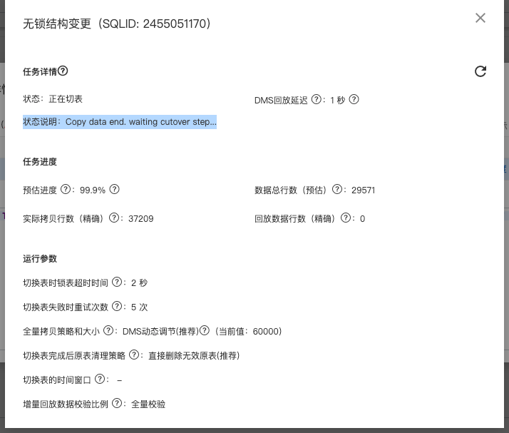

## 商品库存扣减优化

原始流程：

根据订单号加分布式锁，防止订单重复扣减 =〉校验对应单号是否存在扣减流水 =〉将库存查询至内存判断是否足额库存 =〉开启事务，事务内扣减库存(sql层面确保剩余库存大于0) 和 插入扣减流水和本地消息表，如果影响行数为0则更新失败，事务回滚

优化点：

**1.降低锁的粒度，将库存进行更细粒度的拆分**

将库存进行更细粒度的拆分，一条库存记录拆分成多条库存行，每个库存行绑定不同的仓库，不同的仓库对应的配送范围不同，在下单前需要去检查收获地址对应的仓库，获取到对应的库存行来进行扣减。这样就降低了锁的粒度。 

**2.减少锁的持有时间，调整SQL执行顺序**

事务中将插入流水的动作 放到 扣减动作 之前，因为扣减库存的时候会持有该记录的行锁，为了提高并发度，应该尽可能减少事务持有行锁的时间，而向流水表中插入数据，流水表本身数据量会比较大，而且插入还要维护相关索引信息，所以这个插入的耗时会越来越大。

**3.合并处理扣减请求，合并批处理**

合并批处理 借鉴OS刷盘机制，将多个用户对同一个商品库存行的扣减请求合并成一个内存队列，由定时任务去触发这个队列中的请求合并处理，将多次库存扣减请求合并成一个请求进行扣减，这样就把多次IO合并成了一次IO，当然这个定时任务触发的时间间隔非常短，200ms左右。 如果判断合并后的库存大于实际库存，那么会退化成优先从扣减数量大的请求来循环处理。

是否生成合并处理队列是根据当前商品库存行的并发度来判断的，通过内存中的计数器来统计滑动时间窗口内的单个商品的扣减次数决定商品的并发度。

**4.优化扣减失败处理逻辑**

优化前 扣减失败的时候：上游订单发送订单下单失败消息，判断有无流水，有流水释放库存插入释放流水，无流水直接返回消费成功。

库存扣减超时或者异步任务线程执行报错，导致上游的扣减请求拿到的结果都是扣减失败，这时候上游订单模块下单动作整体是失败的，这里边会涉及到分布式事务的回滚操作，上游会推送订单失败消息，我们接收到后会进行库存的释放。在释放前会去判断扣减流水是否存在。如果存在的话 返还库存并且插入释放库存的流水。

如果不存在的话，有两种情况，分别对应异步线程事务提交前和事务提交后，第一种情况的订单没有流水，所以也不用返还库存。第二种情况是，事务还没执行完上游接口就超时了，认为下单失败，发送回滚消息，但后续事务正常提交了，那就出现信息不一致的问题了，流水和订单就对不上。所以针对这种问题我们的处理方式是统一将将没有扣减流水的订单失败消息 进行消息转发重新消费，然后提交消息消费位点，防止阻塞其他顺序消息。

**5.优化更新库存时的缓存删除操作**

我们之前使用的时候旁路缓存模式，在更新的时候删除缓存，在查询的时候先查缓存，不存在的话查询数据库，并将查询结果缓存至redis。更新库存的时候也会去删除缓存，为了优化掉这个删除缓存的动作，对我们的缓存组件进行了调整，将手动删除的动作调整为监听数据库的binlog消息和监听领域事件消息进行缓存双删。

缺点：

本地消息表的方式依赖数据库，可能性能会成为瓶颈。可以考虑替换为事务消息。

不能通过横向扩容解决性能问题，因为加了机器后合并效果会变差。打到数据库的异步线程也会变多

链路长，复杂度较高，排查问题的成本和后续维护的成本会增加

### DMS DML处理

慢SQL的识别

慢SQL的处理

当前任务变更ID为：8704001，变更采用的临时表名是：tp_8704001_ogt_scm_shop_item_log,tp_8704001_del_scm_shop_item_log

DMS回放延迟 ：1 秒  回放延迟大于30秒，DMS会自动降低原表拷贝速率，如果此时延迟持续不断增加，说明原表的DML太高，无锁结构变更执行成功的几率较小，建议先暂停任务，并且在业务的低峰期重试任务。

状态说明：Job will scheduling in thread pool  状态说明：Copy data end. waiting cutover step...

切换表时锁表超时时间 ：2 秒    在切换表阶段，DMS需要同时给原表和临时表加锁禁写（加锁等待期间，也会阻塞表上的DML），然后实现两表的互换，该参数可以控制给表加锁的等待超时时间（DMS缺省为2秒）。时间越长，加锁成功率越高，但对业务DML影响时间越大。当表上有大事务、大查询导致频繁加锁失败时，可以酌情增加超时时间。

切换表失败时重试次数 ：5 次   在切换表阶段，当无法获取表的MDL锁或其它原因导致切表失败时，DMS缺省尝试3次切表过程，该参数可以控制累计重试次数。重试次数越多，切换表成功率越高，但同时短时间内频繁尝试切换表对业务的影响也会越大（获取MDL锁失败时，DMS间隔30秒重试一次）。

全量拷贝策略和大小 ：DMS动态调节(推荐)（当前值：60000）

在全量拷贝阶段，将原表分为N个小块逐个拷贝到临时表，DMS缺省根据数据库的性能动态调整每个小块的大小，兼顾对业务的影响和拷贝的速率，该参数可以更改拷贝策略和手动指定单次拷贝的大小。单次拷贝越大，全量拷贝的时间越短，但同时对业务的影响越大。

DMS根据数据库的性能，自动调整每次拷贝行数大小，单次拷贝锁表时间控制在1.5秒以内，兼顾速率和稳定性，推荐使用。

切换表完成后原表清理策略 ：直接删除无效原表(推荐) 在切换表完成后，DMS缺省直接删除原表（已无效），以尽快释放实例的空间，该参数可以控制切换表完成后原表清理方法。删除策略，可以在变更完成后自动释放实例空间；移动和保留策略，需要您后续手动删除无效的原表。

切换表的时间窗口 ： 

当原表全量拷贝完成并且增量追平后，DMS缺省立即开始切换表流程，如果此时正巧碰到业务高峰，可能会业务产生一些影响或者导致切表失败，该参数可以控制切换表的时间窗口，指定当满足切换表的条件并且在时间窗口以内时才进行切换，未在窗口内时则一直等待窗口。说明：SQL通过原生执行时，切表窗口无效。

增量回放数据校验比例 ：全量校验

在增量回放阶段，为保证数据一致性，DMS缺省会全量校验所有的binlog事件（校验对回放性能有轻微影响），该参数可以控制增量校验的比例。DMS推荐您校验全量数据，最大限度保证变更前后的数据一致性。如果回放延迟长期超过30秒，并且DMS已经回放了大量数据，可尝试降低校验比例提升回放性能（注意：回放延迟受多方面因素影响，该操作不一定有效）。

[ERROR] DMS-OnlineDDL Failed:无法获取到原表上的MDL锁，已尝试5次，请排查原表上的大事务、大查询，或到业务低峰期时重试任务
