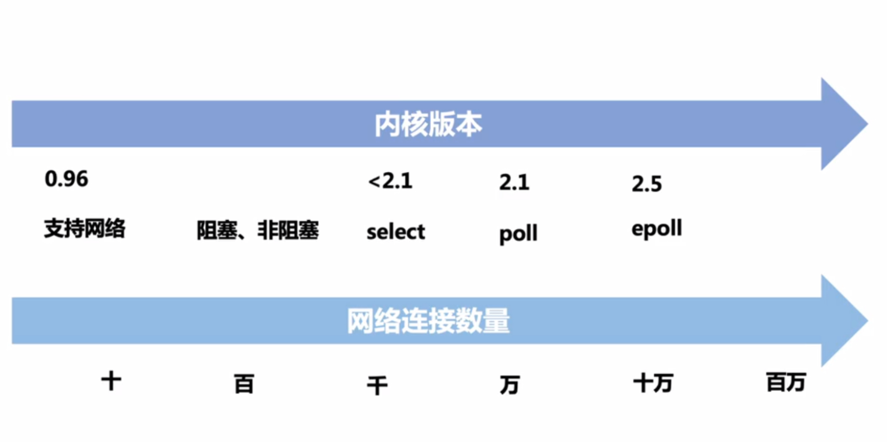
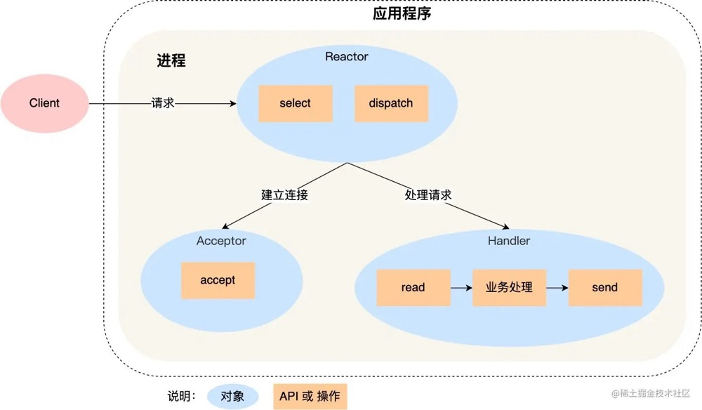
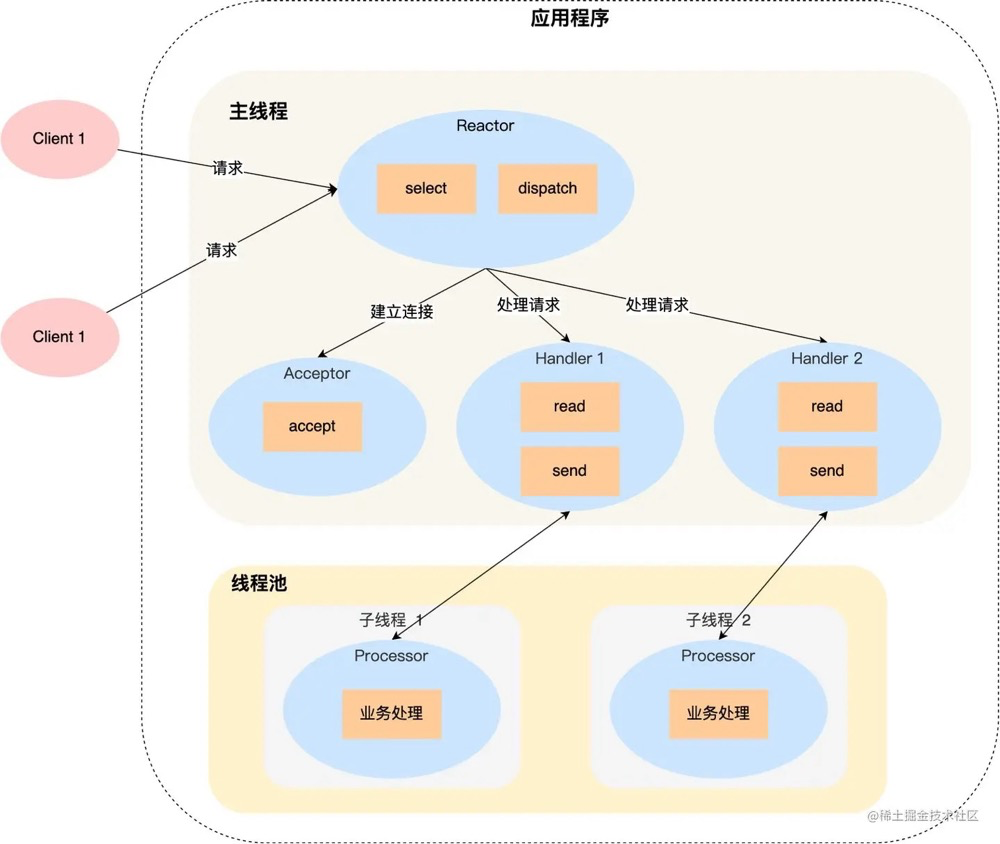
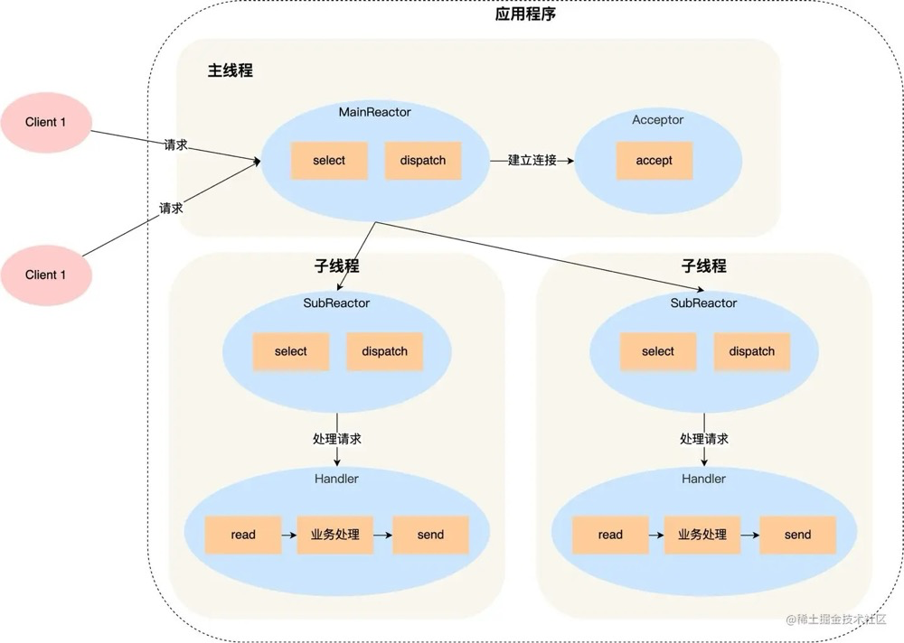
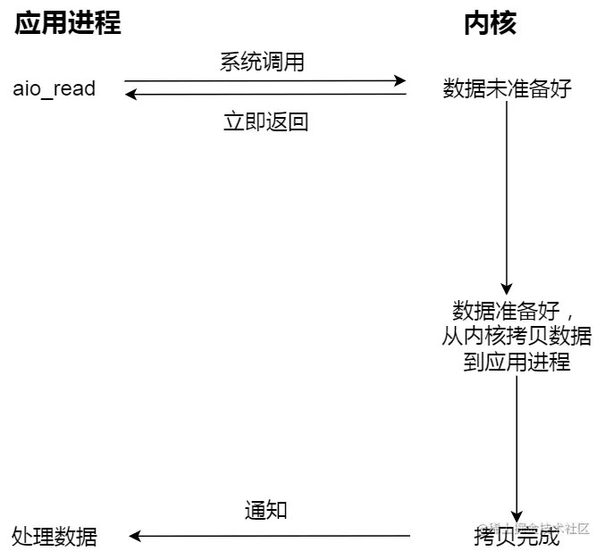
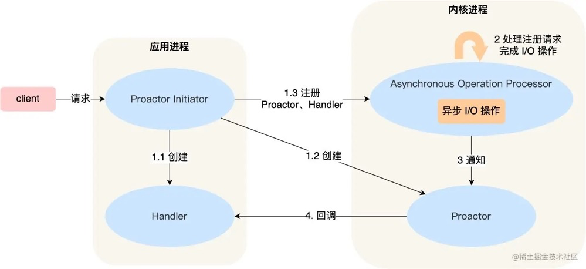
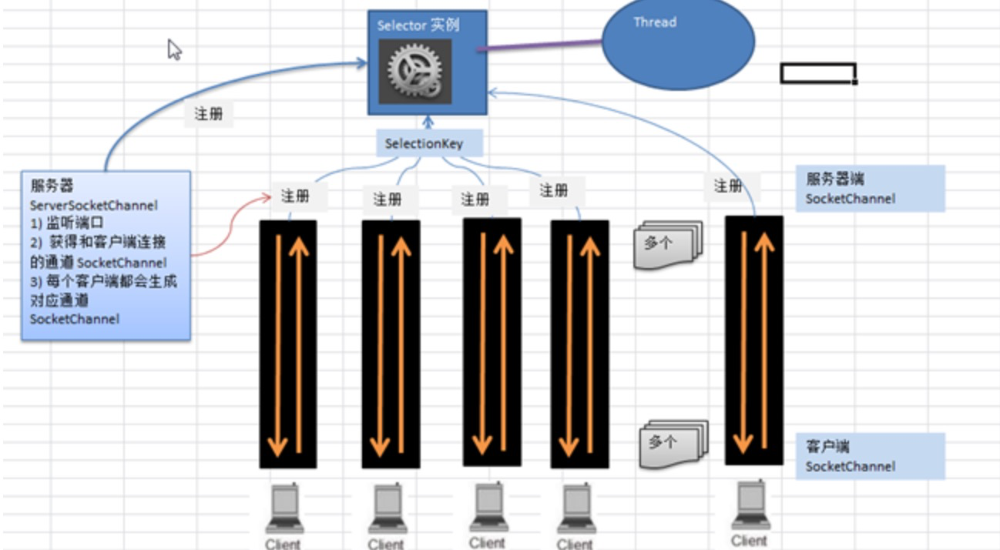

# 一、I/O 模型

## 1.概念理解

### 内核演进和网络连接数量

### 同步异步

同步和异步是针对应用程序和内核的交互而言的。 同步需要主动去询问，而异步的时候内核在IO事件发生的时候通知应用程序

### 阻塞非阻塞

阻塞和非阻塞是针对于进程在访问数据的时候，根据IO操作的就绪状态来采取的不同方式，说白了是一种读取或者写入操作函数的实现方式，阻塞方式下读取或者写入函数将一直等待，而非阻塞方式下，读取或者写入函数会立即返回一个状态值。

| 编号 | 名词   | 解释                                                         | 举例                                                         |
| ---- | ------ | ------------------------------------------------------------ | ------------------------------------------------------------ |
| 1    | 同步   | 指的是用户进程触发IO操作并等待或者轮询的去查看IO操作是否就绪 | 自己上街买衣服，自己亲自干这件事，别的事干不了。             |
| 2    | 异步   | 异步是指用户进程触发IO操作以后便开始做自己的事情，而当IO操作已经完成的时候会得到IO完成的通知（异步的特点就是通知） | 告诉朋友自己合适衣服的尺寸，大小，颜色，让朋友委托去卖，然后自己可以去干别的事。（使用异步IO时，Java将IO读写委托给OS处理，需要将数据缓冲区地址和大小传给OS） |
| 3    | 阻塞   | 所谓阻塞方式的意思是指, 当试图对该文件描述符进行读写时, 如果当时没有东西可读,或者暂时不可写, 程序就进入等待 状态, 直到有东西可读或者可写为止 | 去公交站充值，发现这个时候，充值员不在（可能上厕所去了），然后我们就在这里等待，一直等到充值员回来为止。（当然现实社会，可不是这样，但是在计算机里确实如此。） |
| 4    | 非阻塞 | 非阻塞状态下, 如果没有东西可读, 或者不可写, 读写函数马上返回, 而不会等待， | 银行里取款办业务时，领取一张小票，领取完后我们自己可以玩玩手机，或者与别人聊聊天，当轮我们时，银行的喇叭会通知，这时候我们就可以去了。 |

### 内核空间和用户空间

应用程序运行在用户空间下，操作系统和驱动程序运行在内核空间。

### 用户进程为什么会挂起

1. NIC（网卡） 接收到数据，通过 DMA 方式写入内存(Ring Buffer 和 sk_buff)。
2. NIC 发出中断请求（IRQ），告诉内核有新的数据过来了。
3. Linux 内核响应中断，系统切换为内核态，处理 Interrupt Handler，从RingBuffer 拿出一个 Packet， 并处理协议栈，填充 Socket 并交给用户进程。
4. 系统切换为用户态，用户进程处理数据内容。

网卡何时接收到数据是依赖发送方和传输路径的，这个延迟通常都很高，是毫秒(ms)级别的。而应用程序处理数据是纳秒(ns)级别的。也就是说整个过程中，内核态等待数据，处理协议栈是个相对很慢的过程。这么长的时间里，用户态的进程是无事可做的，因此用到了阻塞（挂起）。

## 2. I/O 模型

这里用的是UNIX下的几种I/O模型。

一个I/O操作通常包括两个不同的阶段。

1. 等待数据准备好
2. 将数据从内核缓冲区复制到用户空间（实际的IO操作）

### 同步阻塞式I/O

同步阻塞I/O模型：最常用的I/O模型就是阻塞I/O模型，缺省情形下，所有文件操作都是阻塞的。在进程空间中调用recvfrom，**其系统调用直到数据包到达且被复制到应用进程的缓冲区中或者发生错误时才返回**（最常见的错误是系统调用被信号中断），在此期间一直会等待，进程在从调用recvfrom开始到它返回的整段时间内都是被阻塞的，因此被称为阻塞I/O模型。


当线程触发系统调用时会发生阻塞，因此服务端需要对每个客户端连接都生成一个线程进行处理，Java 中的BIO就是阻塞式的IO模型。

在最原始的I/O模型中，对文件设备数据的读写需要同步等待操作系统内核，即使文件设备并没有数据可读，线程也会被阻塞住，虽然阻塞时不占用CPU时钟周期，但是若需要支持并发连接，则必须启用大量的线程，即每个连接一个线程。这样必不可少的会造成线程大量的上下文切换，随着并发量的增高，性能越来越差。


### 同步非阻塞式I/O

同步非阻塞I/O模型：将一个套接字设置成非阻塞是在通知内核，当系统调用recvfrom从应用层到内核的时候，如果该缓冲区没有数据的话，就直接返回一个EWOULDBLOCK错误，而不是让该进程睡眠。一般都对非阻塞I/O模型进行轮询检查这个状态，看内核是不是有数据到来。


上图中前两次调用recvfrom 时没有数据可返回，因此内核立即返回一个EWOULDBLOCK 错误。第三次调用recvfrom 时数据报已经准备好，数据会复制到应用进程缓冲区，于是recvfrom 成功返回。我们接着处理数据。

当一个应用进程像这样对一个非阻塞描述符循环调用recvfrom 时，我们称之为轮询 （polling）。应用进程持续轮询内核，以查看某个操作是否就绪。这么做往往耗费大量CPU时间。

**同步阻塞式I/O和同步非阻塞式I/O主要区别在于** 内核中数据未就绪时，如何处理。对于阻塞式IO则一直处于阻塞状态，直到数据就绪并从内核态拷贝到用户态才返回；而非阻塞式IO，则当数据未就绪时，直接返回用户一个EWOULDBLOCK错误，当数据就绪时，和同步阻塞式IO的处理方式一致。

### I/O复用

> I/O多路复用其实就是，Linux内核提供了select/poll/epoll函数来支持由一个线程监听一组socket的数据是否处于准备就绪，当某个socket数据准备就绪后，select等函数会返回对应的连接，再真正调用recvfrom函数将数据从内核复制到用户态返回。本质上还是同步IO。

I/O复用模型：Linux提供select/poll函数，进程通过将一个或多个fd传递给select或poll系统调用，阻塞在select操作上，而不是阻塞在真正的I/O系统调用recvfrom上。这样select/poll可以帮我们侦测多个fd是否处于就绪状态，等待数据报套接字变为可读。当select 返回套接字可读这一条件时，我们调用recvfrom 把所读数据报复制到应用进程缓冲区。

select/poll是顺序扫描fd是否就绪，而且支持的fd数量有限（默认1024），因此它的使用受到了一些制约。Linux还提供了一个epoll系统调用，epoll使用基于事件驱动方式代替顺序扫描，因此性能更高。当有fd就绪时，立即回调函数rollback。

epoll和kqueue比select 和poll的优势在于监听的更多的文件描述符，也就是socket的fd。

这里的监听的socket其实是有潜在条件的，指的是非活跃的网络连接。epoll 在应对大量网络连接时，只有活跃连接很少的情况下才能表现的性能优异。换句话说，epoll 在处理大量非活跃的连接时性能才会表现的优异。如果15000个 socket 都是活跃的，epoll 和 select 其实差不了太多。

Java 中的NIO 非阻塞模式就是采用的IO多路复用模型。


与I/O复用密切相关的另一种I/O模型是在多线程中使用阻塞式I/O，这里暂称其为伪异步I/O。这种模型与上述模型极为相似，但它没有使用select 阻塞在多个文件描述符上，而是使用多个线程（每个文件描述符一个线程），这样每个线程都可以自由地调用诸如recvfrom 之类的阻塞式I/O系统调用了。

由于使用的是阻塞式I/O，当调用OutputStream的write方法写输出流的时候，它将会被阻塞，直到所有要发送的字节全部写入完毕，或者发生异常。这其中存在一定风险，当消息的接收方处理缓慢的时候，将不能及时地从TCP缓冲区读取数据，由接收方控制的滑动窗口也会越来越小，同时将会导致发送方的TCP window size不断减小，直到为0，双方处于Keep-Alive状态，消息发送方将不能再向TCP缓冲区写入消息，这时如果采用的是同步阻塞I/O，write操作将会被无限期阻塞，直到TCP window size大于0或者发生I/O异常。

我们了解到读和写操作都是同步阻塞的，阻塞的时间取决于对方I/O线程的处理速度和网络I/O的传输速度。本质上来讲，我们无法保证生产环境的网络状况和对端的应用程序能足够快，如果我们的应用程序依赖对方的处理速度，它的可靠性就非常差。也许在实验室进行的性能测试结果令人满意，但是一旦上线运行，面对恶劣的网络环境和良莠不齐的第三方系统，问题就会如火山一样喷发。

伪异步I/O实际上仅仅是对之前阻塞I/O线程模型的一个简单优化，它无法从根本上解决同步I/O导致的通信线程阻塞问题。

为了解决同步阻塞带来线程过多导致的性能问题，同步非阻塞方案产生。通过一个线程不断的判断文件句柄数组是否有准备就绪的文件设备，这样就不需要每个线程同步等待，减少了大量线程，降低了线程上下文切换带来的性能损失，提高了线程利用率。这种方式也称为I/O多路复用技术。但是由于数组是有数组长度上限的(linux默认是1024)，而且select模型需要对数组进行遍历，因此时间复杂度是O(n)因此当高并发量的时候，select模型性能会越来越差。

poll模型和select模型类似，但是它使用链表存储而非数组存储，解决了并发上限的限制，但是并没有解决select模型的高并发性能底下的根本问题。

在linux2.6支持了epoll模型，epoll模型解决了select模型的性能瓶颈问题。它通过注册回调事件的方式，当数据可读写时，将其加入到通过回调方式，将其加入到一个可读写事件的队列中。这样每次用户获取时不需要遍历所有句柄，时间复杂度降低为O(1)。因此epoll不会随着并发量的增加而性能降低。随着epoll模型的出现C10K的问题已经完美解决。

### 异步I/O

异步I/O：告知内核启动某个操作，并让内核在整个操作完成后（包括将数据从内核复制到用户自己的缓冲区）通知我们。此时用户进程只需要对数据进行处理就好了，不需要进行实际的IO读写操作，因为真正的IO读取或者写入操作已经由内核完成了。

对应Java中的AIO。


当收到一个异步I/O请求时，该请求会被传递给设备驱动程序并加入到设备驱动程序的请求队列中，然后直接返回`IO_PENDDING`状态表示请求受理成功，此时发送请求的线程（也就是应用程序的线程）并不需要阻塞等待I/O请求的完成，可以继续执行其他任务。而实际的I/O操作则由设备驱动程序以DMA（直接访问内存）的方式进行大量数据的 I/O 操作，它会将队列中的I/O请求传给指定硬件设备的设备控制器执行。当底层设备完成了真实的I/O请求后会通过中断控制器通过中断操作通知CPU，CPU会调度一个线程通知上层设备驱动程序,将完成通知加入到完成队列中。此时上层应用即可获取到完成通知。

当我们在读取socket数据时，虽然我们在代码仅仅是调用了一个`Read`操作，但是实际操作系统层面做了许多事情。首先操作系统需要从用户模式转换为内核模式，处理器不会直接操控硬件，因此它会通过网卡驱动对网卡控制器进行操作，网卡控制器则控制网卡。

早期的I/O都是通过CPU直接控制外围设备，后来为了提高效率，后来增加了DMA控制器，它可以模拟处理器获得内存总线控制权，进行I/O的读写。当处理器将控制权交给DMA控制器之后，DMA处理器会先让I/O硬件设备将数据放到I/O硬件的缓冲区中，然后DMA控制器就可以开始传输数据了。在此过程中处理器无需消耗时钟周期。当DMA操作完成时，会通过中断操作通知处理器。

前面讲的几种模型都是同步I/O模型，异步I/O模型指的是发生数据读写时完全不同步阻塞等待，换句话来说就是数据从网卡传输到用户空间的过程时完全异步的，不用阻塞CPU。为了更详细的说明同步I/O与异步I/O的区别，接下来举一个实际例子。

当应用程序需要从网卡读取数据时，首先需要分配一个用户内存空间用来保存需要读取的数据。操作系统内核会调用网卡缓冲区读取数据到内核空间的缓冲区，然后再复制到用户空间。在这个过程中，同步阻塞I/O在数据读取到用户空间之前都会被阻塞，同步非阻塞I/O只知道数据已就绪，但是从内核空间缓冲区拷贝到用户空间时，线程依然会被阻塞。而异步I/O模型在接收到I/O完成通知时，数据已经传输到用户空间。因此整个I/O操作都是完全异步的，因此异步I/O模型的性能是最佳的。

### 同步I/O和异步I/O对比

举个你去饭堂吃饭的例子，你好比应用程序，饭堂好比操作系统。

阻塞 I/O 好比，你去饭堂吃饭，但是饭堂的菜还没做好，然后你就一直在那里等啊等，等了好长一段时间终于等到饭堂阿姨把菜端了出来（数据准备的过程），但是你还得继续等阿姨把菜（内核空间）打到你的饭盒里（用户空间），经历完这两个过程，你才可以离开。

非阻塞 I/O 好比，你去了饭堂，问阿姨菜做好了没有，阿姨告诉你没，你就离开了，过几十分钟，你又来饭堂问阿姨，阿姨说做好了，于是阿姨帮你把菜打到你的饭盒里，这个过程你是得等待的。

异步 I/O 好比，你让饭堂阿姨将菜做好并把菜打到饭盒里后，把饭盒送到你面前，整个过程你都不需要任何等待。

很明显，异步 I/O 比同步 I/O 性能更好，因为异步 I/O 在「内核数据准备好」和「数据从内核空间拷贝到用户空间」这两个过程都不用等待。


POSIX把这两个术语定义如下：

同步 I/O操作 （synchronous I/O opetation）导致请求进程阻塞，直到I/O操作完成；
异步 I/O操作 （asynchronous I/O opetation）不导致请求进程阻塞。
根据上述定义，我们的前4种模型：

阻塞式I/O模型、非阻塞式I/O模型、I/O复用模型和信号驱动式I/O模型都是同步I/O模型，因为其中真正的I/O操作（recvfrom ）将阻塞进程。只有异步I/O模型与POSIX定义的异步I/O相匹配。

使用异步I/O和完成端口实现高性能I/O操作的主要原因有三点：

- 减少线程，减少I/O上下文切换
- 异步不阻塞线程
- 避免内存复制

## 3.Reactor和Proactor

https://zhuanlan.zhihu.com/p/368089289

Reactor 和 Proactor 是对底层的I/O多路复用，根据面向对象思想做的一层封装。便于提供高性能的网络模式。

### Reactor

也叫 Dispatcher 模式， **I/O 多路复用监听事件，收到事件后，根据事件类型分配（Dispatch）给某个进程 / 线程**。

Reactor 模式主要由 Reactor 和处理资源池这两个核心部分组成，它俩负责的事情如下：

- Reactor 负责监听和分发事件，事件类型包含连接事件、读写事件；
- 处理资源池负责处理事件，如 read -> 业务逻辑 -> send；

Reactor 模式是灵活多变的，可以应对不同的业务场景，灵活在于：

- Reactor 的数量可以只有一个，也可以有多个；
- 处理资源池可以是单个进程 / 线程，也可以是多个进程 /线程；

应用在实际的项目中：

- 单 Reactor 单进程 / 线程；
- 单 Reactor 多线程 / 进程；
- 多 Reactor 多进程 / 线程；

#### 单 Reactor 单进程 / 线程

一般来说，C 语言实现的是「**单 Reactor** ***单进程\***」的方案，因为 C 语编写完的程序，运行后就是一个独立的进程，不需要在进程中再创建线程。

而 Java 语言实现的是「**单 Reactor** ***单线程\***」的方案，因为 Java 程序是跑在 Java 虚拟机这个进程上面的，虚拟机中有很多线程，我们写的 Java 程序只是其中的一个线程而已。

我们来看看「**单 Reactor 单进程**」的方案示意图：




可以看到进程里有 **Reactor、Acceptor、Handler** 这三个对象：

- Reactor 对象的作用是监听和分发事件；
- Acceptor 对象的作用是获取连接；
- Handler 对象的作用是处理业务；

对象里的 select、accept、read、send 是系统调用函数，dispatch 和 「业务处理」是需要完成的操作，其中 dispatch 是分发事件操作。

接下来，介绍下「单 Reactor 单进程」这个方案：

- Reactor 对象通过 select （IO 多路复用接口） 监听事件，收到事件后通过 dispatch 进行分发，具体分发给 Acceptor 对象还是 Handler 对象，还要看收到的事件类型；
- 如果是连接建立的事件，则交由 Acceptor 对象进行处理，Acceptor 对象会通过 accept 方法 获取连接，并创建一个 Handler 对象来处理后续的响应事件；
- 如果不是连接建立事件， 则交由当前连接对应的 Handler 对象来进行响应；
- Handler 对象通过 read -> 业务处理 -> send 的流程来完成完整的业务流程。

单 Reactor 单进程的方案因为全部工作都在同一个进程内完成，所以实现起来比较简单，不需要考虑进程间通信，也不用担心多进程竞争。

但是，这种方案存在 2 个缺点：

- 第一个缺点，因为只有一个进程，**无法充分利用 多核 CPU 的性能**；
- 第二个缺点，Handler 对象在业务处理时，整个进程是无法处理其他连接的事件的，**如果业务处理耗时比较长，那么就造成响应的延迟**；

所以，单 Reactor 单进程的方案**不适用计算机密集型的场景，只适用于业务处理非常快速的场景**。

Redis 是由 C 语言实现的，它采用的正是「单 Reactor 单进程」的方案，因为 Redis 业务处理主要是在内存中完成，操作的速度是很快的，性能瓶颈不在 CPU 上，所以 Redis 对于命令的处理是单进程的方案。

#### 单 Reactor 多线程 / 多进程

如果要克服「单 Reactor 单线程 / 进程」方案的缺点，那么就需要引入多线程 / 多进程，这样就产生了**单 Reactor 多线程 / 多进程**的方案。

闻其名不如看其图，先来看看「单 Reactor 多线程」方案的示意图如下：



详细说一下这个方案：

- Reactor 对象通过 select （IO 多路复用接口） 监听事件，收到事件后通过 dispatch 进行分发，具体分发给 Acceptor 对象还是 Handler 对象，还要看收到的事件类型；
- 如果是连接建立的事件，则交由 Acceptor 对象进行处理，Acceptor 对象会通过 accept 方法 获取连接，并创建一个 Handler 对象来处理后续的响应事件；
- 如果不是连接建立事件， 则交由当前连接对应的 Handler 对象来进行响应；

上面的三个步骤和单 Reactor 单线程方案是一样的，接下来的步骤就开始不一样了：

- Handler 对象不再负责业务处理，只负责数据的接收和发送，Handler 对象通过 read 读取到数据后，会将数据发给子线程里的 Processor 对象进行业务处理；
- 子线程里的 Processor 对象就进行业务处理，处理完后，将结果发给主线程中的 Handler 对象，接着由 Handler 通过 send 方法将响应结果发送给 client；

单 Reator 多线程的方案优势在于**能够充分利用多核 CPU 的能**，那既然引入多线程，那么自然就带来了多线程竞争资源的问题。

例如，子线程完成业务处理后，要把结果传递给主线程的 Reactor 进行发送，这里涉及共享数据的竞争。

要避免多线程由于竞争共享资源而导致数据错乱的问题，就需要在操作共享资源前加上互斥锁，以保证任意时间里只有一个线程在操作共享资源，待该线程操作完释放互斥锁后，其他线程才有机会操作共享数据。

聊完单 Reactor 多线程的方案，接着来看看单 Reactor 多进程的方案。

事实上，单 Reactor 多进程相比单 Reactor 多线程实现起来很麻烦，主要因为要考虑子进程 <-> 父进程的双向通信，并且父进程还得知道子进程要将数据发送给哪个客户端。

而多线程间可以共享数据，虽然要额外考虑并发问题，但是这远比进程间通信的复杂度低得多，因此实际应用中也看不到单 Reactor 多进程的模式。

另外，「单 Reactor」的模式还有个问题，**因为一个 Reactor 对象承担所有事件的监听和响应，而且只在主线程中运行，在面对瞬间高并发的场景时，容易成为性能的瓶颈的地方**。

#### 多 Reactor 多进程 / 线程

要解决「单 Reactor」的问题，就是将「单 Reactor」实现成「多 Reactor」，这样就产生了第 **多 Reactor 多进程 / 线程**的方案。

老规矩，闻其名不如看其图。多 Reactor 多进程 / 线程方案的示意图如下（以线程为例）：



方案详细说明如下：

- 主线程中的 MainReactor 对象通过 select 监控连接建立事件，收到事件后通过 Acceptor 对象中的 accept 获取连接，将新的连接分配给某个子线程；
- 子线程中的 SubReactor 对象将 MainReactor 对象分配的连接加入 select 继续进行监听，并创建一个 Handler 用于处理连接的响应事件。
- 如果有新的事件发生时，SubReactor 对象会调用当前连接对应的 Handler 对象来进行响应。
- Handler 对象通过 read -> 业务处理 -> send 的流程来完成完整的业务流程。

多 Reactor 多线程的方案虽然看起来复杂的，但是实际实现时比单 Reactor 多线程的方案要简单的多，原因如下：

- 主线程和子线程分工明确，主线程只负责接收新连接，子线程负责完成后续的业务处理。
- 主线程和子线程的交互很简单，主线程只需要把新连接传给子线程，子线程无须返回数据，直接就可以在子线程将处理结果发送给客户端。

大名鼎鼎的两个开源软件 Netty 和 Memcache 都采用了「多 Reactor 多线程」的方案。

采用了「多 Reactor 多进程」方案的开源软件是 Nginx，不过方案与标准的多 Reactor 多进程有些差异。

具体差异表现在主进程中仅仅用来初始化 socket，并没有创建 mainReactor 来 accept 连接，而是由子进程的 Reactor 来 accept 连接，通过锁来控制一次只有一个子进程进行 accept（防止出现惊群现象），子进程 accept 新连接后就放到自己的 Reactor 进行处理，不会再分配给其他子进程。

### Proactor

前面提到的 Reactor 是非阻塞同步I/O模型，而 Proactor 是异步I/O模型。

先来看看**阻塞 I/O**，当用户程序执行 `read` ，线程会被阻塞，一直等到内核数据准备好，并把数据从内核缓冲区拷贝到应用程序的缓冲区中，当拷贝过程完成，`read` 才会返回。

注意，**阻塞等待的是「内核数据准备好」和「数据从内核态拷贝到用户态」这两个过程**。

而**同步非阻塞 I/O**，非阻塞的 read 请求在数据未准备好的情况下立即返回，可以继续往下执行，此时应用程序不断轮询内核，直到数据准备好，内核将数据拷贝到应用程序缓冲区，`read` 调用才可以获取到结果。过程如下图：

Proactor 正是采用了异步 I/O 技术，所以被称为异步网络模型。

而真正的**异步 I/O 是「内核数据准备好」和「数据从内核态拷贝到用户态」这两个过程都不用等待**。

当我们发起 `aio_read` （异步 I/O） 之后，就立即返回，内核自动将数据从内核空间拷贝到用户空间，这个拷贝过程同样是异步的，内核自动完成的，和前面的同步操作不一样，**应用程序并不需要主动发起拷贝动作**。过程如下图：




现在我们再来理解 Reactor 和 Proactor 的区别，就比较清晰了。

- **Reactor 是非阻塞同步网络模式，感知的是就绪可读写事件**。在每次感知到有事件发生（比如可读就绪事件）后，就需要应用进程主动调用 read 方法来完成数据的读取，也就是要应用进程主动将 socket 接收缓存中的数据读到应用进程内存中，这个过程是同步的，读取完数据后应用进程才能处理数据。
- **Proactor 是异步网络模式， 感知的是已完成的读写事件**。在发起异步读写请求时，需要传入数据缓冲区的地址（用来存放结果数据）等信息，这样系统内核才可以自动帮我们把数据的读写工作完成，这里的读写工作全程由操作系统来做，并不需要像 Reactor 那样还需要应用进程主动发起 read/write 来读写数据，操作系统完成读写工作后，就会通知应用进程直接处理数据。

因此，**Reactor 可以理解为「来了事件操作系统通知应用进程，让应用进程来处理」**，而 **Proactor 可以理解为「来了事件操作系统来处理，处理完再通知应用进程」**。这里的「事件」就是有新连接、有数据可读、有数据可写的这些 I/O 事件这里的「处理」包含从驱动读取到内核以及从内核读取到用户空间。

举个实际生活中的例子，Reactor 模式就是快递员在楼下，给你打电话告诉你快递到你家小区了，你需要自己下楼来拿快递。而在 Proactor 模式下，快递员直接将快递送到你家门口，然后通知你。

无论是 Reactor，还是 Proactor，都是一种基于「事件分发」的网络编程模式，区别在于 **Reactor 模式是基于「待完成」的 I/O 事件，而 Proactor 模式则是基于「已完成」的 I/O 事件**。

接下来，一起看看 Proactor 模式的示意图：



介绍一下 Proactor 模式的工作流程：

- Proactor Initiator 负责创建 Proactor 和 Handler 对象，并将 Proactor 和 Handler 都通过 Asynchronous Operation Processor 注册到内核；
- Asynchronous Operation Processor 负责处理注册请求，并处理 I/O 操作；
- Asynchronous Operation Processor 完成 I/O 操作后通知 Proactor；
- Proactor 根据不同的事件类型回调不同的 Handler 进行业务处理；
- Handler 完成业务处理；

可惜的是，**在 Linux 下的异步 I/O 是不完善的， `aio` 系列函数是由 POSIX 定义的异步操作接口，不是真正的操作系统级别支持的，而是在用户空间模拟出来的异步，并且仅仅支持基于本地文件的 aio 异步操作，网络编程中的 socket 是不支持的**，这也使得基于 Linux 的高性能网络程序都是使用 Reactor 方案。

而 Windows 里实现了一套完整的支持 socket 的异步编程接口，这套接口就是 `IOCP`，是由操作系统级别实现的异步 I/O，真正意义上异步 I/O，因此在 Windows 里实现高性能网络程序可以使用效率更高的 Proactor 方案。


### Reactor和Proactor总结

常见的 Reactor 实现方案有三种。

第一种方案**单 Reactor 单进程 / 线程**，不用考虑进程间通信以及数据同步的问题，因此实现起来比较简单，这种方案的缺陷在于无法充分利用多核 CPU，而且处理业务逻辑的时间不能太长，否则会延迟响应，所以不适用于计算机密集型的场景，适用于业务处理快速的场景，比如 Redis 采用的是单 Reactor 单进程的方案。

第二种方案单 Reactor 多线程，通过多线程的方式解决了方案一的缺陷，但它离高并发还差一点距离，差在只有一个 Reactor 对象来承担所有事件的监听和响应，而且只在主线程中运行，在面对瞬间高并发的场景时，容易成为性能的瓶颈的地方。

第三种方案**多 Reactor 多进程 / 线程**，通过多个 Reactor 来解决了方案二的缺陷，主 Reactor 只负责监听事件，响应事件的工作交给了从 Reactor，Netty 和 Memcache 都采用了「多 Reactor 多线程」的方案，Nginx 则采用了类似于 「多 Reactor 多进程」的方案。

Reactor 可以理解为「来了事件操作系统通知应用进程，让应用进程来处理」，而 Proactor 可以理解为「来了事件操作系统来处理，处理完再通知应用进程」。

因此，真正的大杀器还是 Proactor，它是采用异步 I/O 实现的异步网络模型，感知的是已完成的读写事件，而不需要像 Reactor 感知到事件后，还需要调用 read 来从内核中获取数据。

不过，无论是 Reactor，还是 Proactor，都是一种基于「事件分发」的网络编程模式，区别在于 Reactor 模式是基于「待完成」的 I/O 事件，而 Proactor 模式则是基于「已完成」的 I/O 事件。


## 4. Java 中的I/O

### BIO

BIO（Blocking I/O）：**同步阻塞**（传统阻塞型），服务器实现模式为一个网络连接对应一个线程，即服务端收到客户端的连接请求时，就启动一个线程进行处理，如果这个连接在保持的状态的下不做任何事情，就会造成不必要的线程开销，如果在读的时候没有读到东西，会发生阻塞。

**BIO编程的简单流程：**

- 服务端启动一个ServerSocket
- 客户端启动Socket对服务器进行通信（默认情况下服务端需要对每个客户建立一个线程与之通讯）。
- 客户端发出请求后，判断服务器是否有线程响应，如果没有则会一直等待至请求超时，或者收到服务端拒绝连接的响应。
- 如果有响应，客户端线程会等待请求结束后，再继续执行。

**BIO 问题分析**：

- 每个请求都需要创建独立的线程，与对应的客户端进行数据Read，业务处理，数据Write。
- 当并发数较大时，需要 **创建大量线程来处理连接**，系统资源占用较大。
- 连接建立后，如果当前线程暂时没有数据可读，则线程就阻塞在Read操作上，造成线程资源浪费。

### NIO

NIO（non -blocking IO）：**同步非阻塞** ，服务器实现模式为一个线程处理多个连接请求，即客户端发送的连接请求都会注册到多路复用器（Selector 选择器）上，多路复用器轮询到连接有I/O请求就进行处理。JDK1.4开始支持，NIO相关类都在java.nio包及子包下。

NIO 有三大核心部分：Channel（通道）、Buffer（缓冲区）、Secletor（选择器）：

NIO 是面向缓冲区的，数据读取到一个它稍后处理的缓冲区，需要时可在缓冲区中前后移动，这样就增加了处理过程中的灵活性，使用它可以提供非阻塞式的高性能伸缩网络。

Java NIO 的非阻塞模式，使一个线程从某个通道发送请求或者读取数据，但是它仅能得到目前可用的数据，如果目前没有数据可用时，就什么都不会获取，而不是保持线程的阻塞，所以直至读到数据之前，该线程可以继续做任何事情。非阻塞写也是如此，一个线程请求写入一些数据到某通道，但不需要等待它完全写入，这个线程同时可以去做别的事情。通俗理解为：NIO 可以做到一个线程来处理多个请求的操作。

HTTP2.0使用了多路复用的技术，做到同个连接并发处理多个请求，而且并发请求的数量比HTTP1.1打了好几个数量级。

 **BIO和 NIO 的比较**：

- BIO 以流的方式处理数据，而NIO 以缓存区的方式处理数据，缓冲区IO效率比流IO高很多。
- BIO 是阻塞的，NIO 是非阻塞的。
- BIO 基于字节流和字符流操作，而NIO基于 Channel（通道）和 Buffer（缓冲区）进行操作，数据总是从通道读到缓冲区中，或者是从缓冲区写到通道中。Selector（选择器）用于监听多个通道的事件（如：连接请求，数据到达等），因此一个线程就可以监听多个客户端通道。

**NIO 三大核心关系：**

- Selector 对应一个线程，但一个线程对应多个Channel。
- 每个Channel 都对应一个Buffer。
- 每个线程切换到哪个Channel由事件（Event ）决定，Selector 会根据不同的事件，在各个 Channel 上切换
- Buffer 本身就一个内存块，底层是一个数组。
- NIO 的数据的读取写入是通过Buffer，Buffer 可以读也可以写，需要 flip（） 切换，  而 BIO 要么是输出流，要么是输入流，不能双向。
- Channel 也是双向的，可以返回底层操作系统的情况，比如Linux，底层的操作系统通道就是双向的。

### AIO

AIO（NIO2）：异步非阻塞，AIO引入异步通道的概念，采用了Proactor模式，简化了程序编写，有效的请求才启动线程，它的特点是由操作系统完成后才通知服务端程序启动线程去处理，一般适用于连接数较多且连接时间较长的应用。JDK7开始支持。

JDK 7 引入了 Asynchronous I/O，即 AIO。在进行 I/O 编程中，常用到两种模式：Reactor和 Proactor。Java 的 NIO 就是 Reactor，当有事件触发时，服务器端得到通知，进行相应的处理

AIO 即 NIO2.0，叫做异步不阻塞的 IO。AIO 引入异步通道的概念，采用了 Proactor 模式，简化了程序编写，有效的请求才启动线程，它的特点是先由操作系统完成后才通知服务端程序启动线程去处理，一般适用于连接数较多且连接时间较长的应用

目前 AIO 还没有广泛应用，Netty 也是基于NIO, 而不是AIO， 


### 


# 二、深入了解 NIO 

### 3.1 Buffer

#### 3.1.1 基本介绍

缓冲区（Buffer）：缓冲区本质上是一个可以读写数据的内存块，可以理解成一个容器对象（含数组），该对象提供了一组方法，可以轻松的使用缓冲区，并且该对象内置了一些机制，能够追踪和记录缓冲区的状态变化情况，Channel提供了从文件、网络读取数据的渠道，但是读取或写入的数据都必须经由Buffer。

NIO程序 《- data -》  缓冲区  《- Channel -》 文件

该类为抽象类,有CharBuffer、IntBuffer、LongBuffer等7个抽象子类，不包含boolean类型  
在Buffer其中定义了缓冲区的共有特性和对其的操作方法   
**0  <=  mark  <=  position  <=  limit  <=  capacity**  

间接缓冲区：CharBuffer <=> JVM的中间缓冲区 <=> 硬盘  
直接缓冲区：CharBuffer <=> 硬盘

#### 3.1.2 Buffer方法列表

|               方法               |                             作用                             |
| :------------------------------: | :----------------------------------------------------------: |
|          int capacity()          |             返回 缓冲区的 capacity (容量) 总大小             |
|           int limit()            |                   返回 limit (限制) 的大小                   |
|    Buffer limit(int newLimit)    |   设置 limit  其所在的索引位置及后边的位置无法被读取或写入   |
|          int position()          |                     返回 position (位置)                     |
| Buffer position(int newPosition) |                设置下一次读取或写入的索引位置                |
|          Buffer mark()           |                  mark (标记)缓冲区当前位置                   |
|          Buffer reset()          |                   使 position 回到标记位置                   |
|         int remaining()          |               返回当前位置与limit之间的元素数                |
|      boolean hasRemaining()      |           返回当前位置与limit之间的是否有剩余元素            |
|       boolean isReadOnly()       |                 返回该缓冲区是否为只读缓冲区                 |
|        boolean isDirect()        |                 返回该缓冲区是否为直接缓冲区                 |
|          Buffer clear()          | 一切为默认，清理缓冲区的标志位，不会清理数据，<br />mark=-1，posistion=0,limit=capacity |
|        boolean hasArray()        | 判读此缓冲区是否具有可访问的底层实现数组，<br />间接缓冲区返回true，直接缓冲区返回false |
|        int arrayOffset()         | 返回此缓冲区的底层实现数组中第一个缓冲区元素的偏移量 <br />这个值在文档中标注为“可选操作”，子类也可以不处该值 |
|          Buffer flip()           | 当向缓冲区中存储数据，然后再从缓冲区是中读取这些数据时，<br />就是flip()方法的最佳时机  反转此缓冲区.首先将限制设置为当前位置,<br />然后将位置设置为0,如果已定义标记,则丢弃该标记. |
|             rewind()             |          侧重于“重新”，重新读取、重新写入时可以使用          |

#### 3.1.3 ByteBuffer基本介绍

Buffer的子类(例如ByteBuffer)对Buffer中的方法进行重写及补充，并添加产生对应缓冲区实例的静态方法  
具体的数据也是保存在该抽象类中  final char[] hb  

static ByteBuffer allocate(int capacity)  

根据capacity创建一个固定大小的间接缓冲区，具有底层实现数组，缓冲区类型为HeapByteBuffer  

static ByteBuffer allocateDirect(int capacity)   

根据capacity创建一个固定大小的直接缓冲区，缓冲区实际类型为DirectByteBuffer  
使用allocateDirect()创建ByteBuffer缓冲区时,capacity 指的是字节的个数  
而创建IntBuffer缓冲区时,capacity指的是int值得数目，转换成字节的话，还需乘以4  
直接缓冲区是直接与操作系统直接通信，间接缓冲区在内部对byte[]hb 字节数组操作，在JVM堆中进行数据处理

NIO还提供了MappedByteBuffer 抽象类（底层是DirectByteBuffer），可以让文件直接在内存（堆外内存）中进行修改，由NIO来完成同步到文件。

```java
public void test2() throws IOException {
    RandomAccessFile randomAccessFile = new RandomAccessFile("a.txt","rw");
    FileChannel channel = randomAccessFile.getChannel();
    /*
            (MapMode mode)FileChannel.MapMode.READ_WRITE  读写模式
            (long position) 0   可以直接修改内存的起始位置
            (long size) 5   映射到内存的大小

         */
    MappedByteBuffer mappedByteBuffer = channel.map(FileChannel.MapMode.READ_WRITE, 0, 5);
    mappedByteBuffer.put(0, (byte) 'H');
    randomAccessFile.close();
}
```

如何释放直接缓冲区的内存  ：

- 手动释放内存  
  通过反射调用DirectByteBuffer的cleaner,获取执行清理方法的对象，调用该对象的clean方法,立即回收内存

- 交给JVM来处理  
  不做处理，等待JVM的GC垃圾回器进行垃圾回收

  

#### 3.1.4 ByteBuffer 方法列表

|                                                              |                                                              |
| :----------------------------------------------------------: | ------------------------------------------------------------ |
|              static ByteBuffer swap(byte[] arr)              | 将传入数组封装为对应类型的间接缓冲区，使用数组作为储存空间，通过该数组的其他引用修改该数组，会影响缓冲区中的数据，反之亦然 |
|  static ByteBuffer swap(byte[] array,int offset,int length)  | capacity 为 array.length  posistion 为 offset  limit 为 offset+length |
| ByteBuffer put()/put(char[] src)/put(byte[]src,int offset,int length) | 向缓冲区中添加数据,offset 为数组的偏移量                     |
| ByteBuffer get()/get(char [] src)/get(byte[]dst,int offset,int length) | 从缓冲区position所在索引位置取出数据,offset 为数组的偏移量   |
|          put(int index, byte b) 和  get(int index)           | 写入/读取指定索引位置的值                                    |
|                        byte[] array()                        | 将缓冲区中的元素，存入对应数组返回                           |
|                      ByteBuffer slice()                      | 创建新的字节缓冲区，其内容为调用者的缓冲区内容的共享子序列，新缓冲区从调用者缓冲区的当前位置开始 |
|                    ByteBuffer duplicate()                    | 创建共享此缓冲区内容的新的字节缓冲区，修改双方亦可见，capacity、position、limit两者相同但独立 |
|                  CharBuffer asCharBuffer()                   | 转为字符缓冲区，capacity和limit减半                          |
|                ByteBuffer asReadOnlyBuffer()                 | 创建只读缓冲区，共用内容，但制度缓冲区不能做修改             |
|                          compact()                           | 压缩此缓冲区，将缓冲区的当前位置和限制之间的字节复制到缓冲区的开始处 |
|                           equals()                           | 比较两个缓冲区position与limit之间的数据是否完全一样          |
|                         compareTo()                          | 如果在开始与结束的范围之间有一个字节不同，折返回两者的减数<br/>如果在开始与结束的范围之间每个字节都相同，则返回两者remaining()的减数 |
|                ByteBuffer wrap(byte[] array)                 | 将一个字节数组包装到一个ByteBuffer中返回                     |

#### 3.1.5 操作示例

将数量大于10的数组元素，循环放入小于10的缓冲区中

```java
public void test(){
    byte[] byteArrayIn1 ={1,2,3,4,5,6,7,8,9,10,11,12}
    ByteBuffer bytebuffer = ByteBuffer.allocate(10);
    int getArrayIndex = 0;
    while( getArrayIndex < byteArrayIn1.length){
        int readLength = Math.min(bytebuffer.ramaining(),byteArrayIn1.length-getArrayIndex);
        bytebuffer.put(byteArrayIn1,getArrayIndex,readLength);
        bytebuffer.flip();
        byte [] getArray = bytebuffer.array();
        for(int i=0;i<bytebuffer.limit();i++){
            System.out.print(getArray[i]+ "" );
        }
        getArrayIndex = getArrayIndex +readLength;
        System.out.print();
        bytebuffer.clear();
    }
}
1 2 3 4 5 6 7 8 9 10
11 12
```

将数量大于10的缓冲区，循环取出放入小于10的数组中

```java
public void test () {
    byte [] byteArrayIn = {1, 2, 3, 4, 5, 6, 7, 8, 9, 10, 11, 12 };
    ByteBuffer bytebuffer = ByteBuffer.wrap (byteArrayIn);
    byte[] byteArrayOut = new byte [5];
    while (bytebuffer.hasRemaining()){
        int readLength =Math.min(bytebuffer.remaining (), byteArrayOut.length);
        bytebuffer.get (byteArrayout, o, readLength);
        for (int i0; i i++) {
            System. out.print (byteArrayout [i] +"");
        }
        System. out.println();
    }
}
1 2 3 4 5
6 7 8 9 10
11 12
```

### 3.2 Channel

#### 3.2.1 基本介绍

NIO的通道类似于流，但也有如下区别：

- 既可以从通道中读取数据，又可以写数据到通道。但流的读写通常是单向的。
- SocketChannel类可以选择是否以非阻塞模式运行，这样就不用每个socket连接使用一个线程。因为如果操作阻塞的话，线程会进入等待，会被操作系统挂起，这样操作系统就会管理很多的线程，而且大量的线程的上下文切换也有很大的开销。非阻塞的模式，一个线程就可以管理多个活动的socket连接。
- 通道中的数据总是要先读到一个 Buffer，或者总是要从一个 Buffer 中写入。
- 请求先到服务器，服务器的ServerSocketChannel对该客户端生成一个SocketChannel，之后通过该Channel与客户端那边的SocketChannel进行通讯。
- socket通道类（DatagramChannel、SocketChannel和ServerSocketChannel）在被实例化时都会创建一个对等socket对象。这些是我们所熟悉的来自java.net的类（Socket、ServerSocket和DatagramSocket），它们已经被更新以识别通道。socket通道类可以通过调用socket( )方法从一个通道上获取对应的socket。此外，这三个java.net类现在都有getChannel( )方法来获取对应通道。
- Socket通道将与通信协议相关的操作委托给相应的socket对象。socket的方法看起来好像在通道类中重复了一遍，但实际上通道类上的方法会有一些新的或者不同的行为。

**下面是JAVA NIO中的一些主要Channel的实现： java.nio.channels包中的Channel接口的已知实现类**

- FileChannel：从文件中读写数据，只能使用阻塞模式。
- DatagramChannel：能通过UDP读写网络中的数据。
- SocketChannel：能通过TCP读写网络中的数据。
- ServerSocketChannel：可以监听新进来的TCP连接，像Web服务器那样。对每一个新进来的连接都会创建一个SocketChannel，它本身从不传输数据。

#### 3.2.2 FileChannel 类的常用方法

```java
//从 通道 读出数据到 缓冲区，对通道进行读操作，读出的数据输出到dst中
public int read(ByteBuffer dst) 
//把 缓冲区 写入数据到  通道，对通道进行写操作，要写入的数据存放在src中
public int write(ByteBuffer src)
//从目标通道中复制数据到当前通道
public long transferFrom(ReadableByteBuffer src ,long position ,long count) 
//把数据从当前通道复制给目标通道
public long transferTo(long position ,long count ,ReadableByteBuffer target)   
    
```

#### 3.2.3 示例1：本地文件写

```java
public static void main(String[] args) throws IOException {
    //先定义输出流
    FileOutputStream fileOutputStream = new FileOutputStream("c://a.txt");
    //通过该流获取对应的Channel
    FileChannel channel = fileOutputStream.getChannel();
    //创建一个ByteBuffer
    ByteBuffer byteBuffer = ByteBuffer.allocate(1024);
    //将str放入Buffer，并进行flip
    byteBuffer.put("hello".getBytes()).flip();
    //将缓冲区的内容写到Channel
    int write = channel.write(byteBuffer);
    //关闭输出流
    fileOutputStream.close();
}
```

#### 3.2.4 示例2：本地文件读

```java
    public void test1() throws IOException {
        FileInputStream fileInputStream = new FileInputStream("a.txt");
        FileChannel channel = fileInputStream.getChannel();
        ByteBuffer byteBuffer = ByteBuffer.allocate(1024);
        channel.read(byteBuffer);
        System.out.println(new String(byteBuffer.array()));
        fileInputStream.close();
    }
```

#### 3.2.5 示例3：文件拷贝1

```java
public void test2() throws IOException {
    FileInputStream fileInputStream = new FileInputStream("a.txt");
    FileOutputStream fileOutputStream = new FileOutputStream("b.txt");
    FileChannel inputStreamChannel = fileInputStream.getChannel();
    FileChannel outputStreamChannel = fileOutputStream.getChannel();
    ByteBuffer byteBuffer = ByteBuffer.allocate(1024);
    while (true) {
        byteBuffer.clear(); // 1
        int write = inputStreamChannel.read(byteBuffer); //
        if (write == -1) {
            break;
        } else {
            byteBuffer.flip();
            outputStreamChannel.write(byteBuffer);
            //              byteBuffer.flip();  2
            //				操作 1 和 2 必须保留一个，因为write操作后，position与limit重合，需要对position进行复位才能进行后续操作
        }
    }
    fileInputStream.close();
    fileOutputStream.close();
}
```

#### 3.2.6 示例4：文件拷贝

```java
public void test4() throws IOException {
    //resource在发布时会打包到classpath下
    URL resource = getClass().getClassLoader().getResource("girl.png");
    FileInputStream fileInputStream = new FileInputStream(resource.getFile());
    FileChannel inputStreamChannel = fileInputStream.getChannel();
    FileOutputStream fileOutputStream = new FileOutputStream("mm.jpg");
    FileChannel outputStreamChannel = fileOutputStream.getChannel();
    //        	inputStreamChannel.transferTo(0,inputStreamChannel.size(),outputStreamChannel);
    outputStreamChannel.transferFrom(inputStreamChannel,0,inputStreamChannel.size());
    inputStreamChannel.close();
    outputStreamChannel.close();
    fileInputStream.close();
    fileOutputStream.close();
}
```


### 3.3  Selector

- Java 的 NIO，用非阻塞的 IO 方式。可以用一个线程，处理多个的客户端连接，就会使用到Selector（选择器）

- Selector 能够检测多个注册的通道上是否有事件发生（注意 Channel 以事件的方式可以注册到同一个Selector），如果有事件发生，便获取事件然后针对每个事件进行相应的处理。这样就可以只用一个单线程去管理多个通道，也就是管理多个连接和请求。
- 只有在 连接/通道 真正有读写事件发生时，才会进行读写，就大大地减少了系统开销，并且不必为每个连接都创建一个线程，不用去维护多个线程
- 避免了多线程之间的上下文切换导致的开销

要点说明：

- Netty 的 IO 线程 NioEventLoop 聚合了 Selector(选择器，也叫多路复用器)，可以同时并发处理成百上千个客户端连接。
- 当线程从某客户端 Socket 通道进行读写数据时，若没有数据可用时，该线程可以进行其他任务。
- 线程通常将非阻塞 IO 的空闲时间用于在其他通道上执行 IO 操作，所以单独的线程可以管理多个输入和输出通道。
- 由于读写操作都是非阻塞的，这就可以充分提升 IO 线程的运行效率，避免由于频繁 I/O 阻塞导致的线程挂起。
- 一个 I/O 线程可以并发处理 N 个客户端连接和读写操作，这从根本上解决了传统同步阻塞 I/O 一连接一线程模型，架构的性能、弹性伸缩能力和可靠性都得到了极大的提升。

Selector 类是一个抽象类，常用的方法和说明如下：

public abstract class Selector implements Closeable {}

- public static Selector open（）；	//得到一个选择器对象
- public abstract int select() throws IOException;	//阻塞的，一直监听直到注册的Channel中有事件返回，并将Selectionkey加入内部集合
- public abstract Selector wakeup()；	//唤醒selector
- public abstract int selectNow() throws IOException;	//不阻塞，立马返还
- public int select （long timeout）;	//监控所有注册的通道，当其中有 IO 操作可以进行时，将对应的SelectionKey 加入到内部集合中并返回，参数用来设置超时时间
- public Set<SelectionKey> selectedKeys（）;	//从内部集合中得到所有的 SelectionKey 


#### 3.3.1 NIO 非阻塞式网络编程原理分析图



- 当客户端连接时，会通过ServerSocketChannel 得到 SocketChannel
- selector 开始监听，通过 阻塞的select（）或者非阻塞的 select（timeout）方法，返回有事件发生的通道个数，这也就是为什么select方法返回的是int值。
- 将socketChannel 对象注册到 Selecotor 上，register（Selector sel ，int ops），一个Seletor可以注册多个Channel
- 注册后返回一个SelectionKey，这个key 会被该Selector 保存到内部的集合中
- 进一步得到所有发生事件的SelectionKey
- 再通过 SelectionKey 中的方法 channel() 反向获取 SocketChannel 
- 可以通过得到的Channel，完成业务处理

#### 3.3.2 ServerSocketChannel 类

在服务端监听新的客户端Socket连接

```java
public abstract class ServerSocketChannel extends AbstractSelectableChannel
	implements NetworkChannel{
    public static ServerSocketChannel open();//得到一个ServerSocketChannel通道
 	public final ServerSocketChannel bind(SocketAddress local); //设置服务器信息（ip和端口）
    public final SelectableChannel configureBlocking(boolean block);//设置阻塞或非阻塞模式，取值false表示采用非阻塞模式
    public abstract SocketChannel accept(); //接受一个连接，返回代表这个链接的通道对象
    public final SelectionKey register(Selector sel, int ops);//注册一个选择器并设置监听事件
     

}
```

#### 3.3.3 SocketChannel 类

网络IO通道，具体负责进行读写操作，NIO把缓冲区的数据写入通道，或者把通道里的数据读到缓冲区。

```java
public abstract class SocketChannel extends AbstractSelectableChannel  implements ByteChannel, ScatteringByteChannel, GatheringByteChannel, NetworkChannel{
public static SocketChannel open();//得到一个 SocketChannel 通道
public final SelectableChannel configureBlocking(boolean block);//设置阻塞或非阻塞模式，取值 false 表示采用非阻塞模式
public boolean connect(SocketAddress remote);//连接服务器
public boolean finishConnect();//如果上面的方法连接失败，接下来就要通过该方法完成连接操作
public int write(ByteBuffer src);//往通道里写数据
public int read(ByteBuffer dst);//从通道里读数据
public final SelectionKey register(Selector sel, int ops, Object att);//注册一个选择器并设置监听事件，最后一个参数可以设置共享数据
public final void close();//关闭通道
}

```

#### 3.3.4 SelectionKey 类

```java
public abstract class SelectionKey {
    protected SelectionKey() { }
    
    //返回与SelectionKey对应的channel对象
    public abstract SelectableChannel channel();

    //返回生成该key的Selector对象
    public abstract Selector selector();

    public abstract boolean isValid();

    public abstract void cancel();

    public abstract int interestOps();

    public abstract SelectionKey interestOps(int ops);

    public abstract int readyOps();

    public static final int OP_READ = 1 << 0;	//读操作 1
    public static final int OP_WRITE = 1 << 2;	//写操作 4
    public static final int OP_CONNECT = 1 << 3; //连接已建立 8
    public static final int OP_ACCEPT = 1 << 4;	//有新的网络可以连接 16

    //判断操作类型的方法
    public final boolean isReadable() 
    public final boolean isWritable() 
    public final boolean isConnectable() 
    public final boolean isAcceptable() 

    //用来存放共享缓冲区
    private volatile Object attachment = null;
   
    //可以将一个缓冲区绑定到Key上
    public final Object attach(Object ob) {
        return attachmentUpdater.getAndSet(this, ob);
    }
	
    //返回该Key对应的缓冲区
    public final Object attachment() {
        return attachment;
    }

}
```


#### 3.3.5 NIO小程序

服务器端的NIO监听程序：

```java
	/**
     * 服务器端的NIO监听程序
     */
    public static void main(String[] args) throws IOException {
        // 创建ServerSocketChannel
        ServerSocketChannel serverSocketChannel = ServerSocketChannel.open();
        // 创建Selector
        Selector selector = Selector.open();
        // 绑定ip
        serverSocketChannel.socket().bind(new InetSocketAddress(6666));
        // 设置为不阻塞
        serverSocketChannel.configureBlocking(false);
        // 将ServerSocketChannel注册到selector。指定关心的事件为OP_ACCEPT，
        serverSocketChannel.register(selector, SelectionKey.OP_ACCEPT);
        // 当有关心的事件发生时，会返回这个SelectionKey，通过SelectionKey可以拿到Channel
        while (true) {
            // Selector监听，等于0说明此时没有事件发生。
            if (selector.select(1000) == 0) {
                System.out.println("server monitor 1s");
                continue;
            }
            Set<SelectionKey> keys = selector.selectedKeys();   //获取所有已注册的Channel中发生事件的SelectionKey，
//            Set<SelectionKey> keys1 = selector.keys();    // 获取所有已注册的Channel的SelectionKey
            Iterator<SelectionKey> iterator = keys.iterator();
            while (iterator.hasNext()) {
                // 获得SocketChannel，此处的accept不会阻塞
                SelectionKey key = iterator.next();
                if (key.isAcceptable()) {
                    SocketChannel socketChannel = serverSocketChannel.accept();
                    // 此处socketChannel也要设置为非阻塞模式
                    socketChannel.configureBlocking(false);
                    // 注册Selector。第三个参数是连接的对象，通过SelectionKey可以连接到这个对象
                    socketChannel.register(selector, SelectionKey.OP_READ, ByteBuffer.allocate(1024));
                    System.out.println("client has connect , socketChannel: " + socketChannel.hashCode());
                }
                if (key.isReadable()) {
                    SocketChannel socketChannel = (SocketChannel) key.channel();
                    ByteBuffer byteBuffer = (ByteBuffer) key.attachment();
                    socketChannel.read(byteBuffer);
                    System.out.println("client :" + new String(byteBuffer.array()));
                }
                // 手动删除避免重复
                iterator.remove();
            }

        }
    }
```


客户端

```java
 public static void main(String[] args) throws IOException {
        //得到一个网络通道
        SocketChannel socketChannel = SocketChannel.open();
        //设置非阻塞
        socketChannel.configureBlocking(false);
        //提供服务器的IP和端口
        InetSocketAddress inetSocketAddress = new InetSocketAddress("127.0.0.1", 6666);
        //连接服务器
        if(!socketChannel.connect(inetSocketAddress)){
            while(!socketChannel.finishConnect()){
                System.out.println("因为连接需要时间，客户端不会阻塞，可以做其他工作");
            }
        }
        //连接成功，发送数据
        String str="hello";
        ByteBuffer byteBuffer = ByteBuffer.wrap(str.getBytes());
        socketChannel.write(byteBuffer);
        System.in.read();
    }
```

#### 3.3.6 群聊系统

iterator.remove(); 和 key.cancel();的区别？

服务端代码：

```java
/**
 * create by lwj on 2020/3/1
 */
public class ChatServer {
    public Selector selector;
    private ServerSocketChannel listenChannel;
    private static final int PORT = 6667;

    public ChatServer() {
        try {
            selector = Selector.open();
            listenChannel = ServerSocketChannel.open();
            listenChannel.socket().bind(new InetSocketAddress(PORT));
            listenChannel.configureBlocking(false);
            listenChannel.register(selector, SelectionKey.OP_ACCEPT);
        } catch (IOException e) {
            System.out.println("server start fail");
        }
    }

    public static void main(String[] args) {
        ChatServer chatServer = new ChatServer();
        chatServer.listen();
    }

    private void listen() {
        System.out.println("server start ok");
        try {
            while (true) {
                int select = selector.select();
                if (select > 0) {
                    Iterator<SelectionKey> iterator = selector.selectedKeys().iterator();
                    while (iterator.hasNext()) {
                        SelectionKey key = iterator.next();
                        //监听到accept
                        if (key.isAcceptable()) {
                            SocketChannel socketChannel = listenChannel.accept();
                            socketChannel.configureBlocking(false);
                            socketChannel.register(selector, SelectionKey.OP_READ);
                            System.out.println(socketChannel.getRemoteAddress() + " on line");
                        }
                        if (key.isReadable()) {
                            readData(key);
                        }
                        //当前的key 删除，防止重复处理
                        iterator.remove();
                    }
                }
            }
        } catch (IOException e) {
            e.printStackTrace();
        } finally {
            try {
                System.out.println("server close");
                listenChannel.close();
            } catch (IOException e) {
                e.printStackTrace();
            }
        }

    }

    private void readData(SelectionKey key) {
        SocketChannel socketChannel = null;
        ByteBuffer byteBuffer;
        try {
            socketChannel = (SocketChannel) key.channel();
            byteBuffer = ByteBuffer.allocate(1024);
            int readSize = socketChannel.read(byteBuffer);
            if (readSize > 0) {
                String msg = new String(byteBuffer.array());
                System.out.println("from client " + socketChannel.getRemoteAddress() + " :" + msg);
                //消息转发给其他客户端
                sendMsgToOtherClient(msg, key);
            }
        } catch (IOException e) {
            try {
                System.out.println(socketChannel.getRemoteAddress() + " off line");
                key.cancel();
                socketChannel.close();
            } catch (IOException ex) {
                ex.printStackTrace();
            }
        }
    }

    private void sendMsgToOtherClient(String msg, SelectionKey srcKey) throws IOException {
        Channel channel;
        SocketChannel targetChannel;
        for (SelectionKey key : selector.keys()) {
            //这里既要排除自己，还要排除SeverSocketChannel
            if (key != srcKey && (channel = key.channel()) instanceof SocketChannel) {
                targetChannel = (SocketChannel) channel;
                targetChannel.write(ByteBuffer.wrap(msg.getBytes()));
            }

        }
    }
}

```


客户端代码：

```java
/**
 * create by lwj on 2020/3/1
 */
public class ChatClient {
    //定义相关的属性
    private final String HOST = "127.0.0.1"; // 服务器的ip
    private final int PORT = 6667; //服务器端口
    private Selector selector;
    private SocketChannel socketChannel;
    private String username;

    public ChatClient() throws IOException {
        selector = Selector.open();
        socketChannel = SocketChannel.open(new InetSocketAddress(HOST, PORT));
        socketChannel.configureBlocking(false);
        socketChannel.register(selector, SelectionKey.OP_READ);
        username = socketChannel.getLocalAddress().toString().substring(1);
        System.out.println(username + " is ok...");
    }

    public static void main(String[] args) throws IOException {
        ChatClient chatClient = new ChatClient();
        new Thread(() -> {
            while (true) {
                chatClient.readInfo();
                try {
                    TimeUnit.SECONDS.sleep(2);
                } catch (InterruptedException e) {
                    e.printStackTrace();
                }
            }
        }).start();
        Scanner scanner = new Scanner(System.in);
        while (scanner.hasNextLine()) {
            String str = scanner.nextLine();
            chatClient.sendInfo(str);
        }

    }

    private void readInfo() {
        try {
            int select = selector.select();
            if (select > 0) {
                Iterator<SelectionKey> iterator = selector.selectedKeys().iterator();
                while (iterator.hasNext()) {
                    SelectionKey key = iterator.next();
                    if (key.isReadable()) {
                        SocketChannel socketChannel = (SocketChannel) key.channel();
                        ByteBuffer byteBuffer = ByteBuffer.allocate(1024);
                        socketChannel.read(byteBuffer);
                        System.out.println(new String(byteBuffer.array()));
                    }
                    iterator.remove();
                }
            }
        } catch (IOException e) {
            System.out.println("server is close");
        }
    }

    private void sendInfo(String msg) throws IOException {
        msg = username + " 说：" + msg;
        socketChannel.write(ByteBuffer.wrap(msg.getBytes()));
    }


}

```


### 零拷贝

参考链接： https://juejin.im/post/5c1c532551882579520b1f47

- 零拷贝是网络编程的关键，很多性能优化都离不开，

- Java程序中，常用的零拷贝有mmap（内存映射）和sendFile。

- 零拷贝从操作系统角度来看，是没有CPU拷贝。


mmap和sendFile的区别：

1. mmap适合小数据量读写；sendFile适合大文件传输
2. mmap需要4次上下文切换，3次数据拷贝；sendFile 需要 3 次上下文切换，最少 2 次数据拷贝。
3. sendFile 可以利用 DMA 方式，减少 CPU 拷贝，mmap 则不能（必须从内核拷贝到 Socket 缓冲区）。

NIO的零拷贝由`transferTo()`方法实现。transferTo()方法将数据从**FileChannel**对象传送到可写的字节通道（如Socket Channel等）。在内部实现中，由native方法`transferTo0()`来实现，它依赖底层操作系统的支持。在UNIX和Linux系统中，调用这个方法将会引起sendfile()系统调用。在linux下一个transferTo 方法就可以完成传输，在windows 下 一次调用 transferTo 只能发送8m ，就需要分段传输文件。

使用场景一般是：

- 文件较大，读写较慢，追求速度

- JVM内存不足，不能加载太大数据

- 内存带宽不够，即存在其他程序或线程存在大量的IO操作，导致带宽本来就小


### NIO的直接内存

首先，它的作用位置处于传统IO（BIO）与零拷贝之间，为何这么说？

- 传统IO，可以把磁盘的文件经过内核空间，读到JVM空间，然后进行**各种操作**，最后再写到磁盘或是发送到网络，效率较慢但支持数据文件操作。
- 零拷贝则是直接在内核空间完成文件读取并转到磁盘（或发送到网络）。由于它没有读取文件数据到JVM这一环，因此程序无法操作该文件数据，尽管效率很高！

而直接内存则介于两者之间，效率一般且**可操作文件数据**。直接内存（mmap技术）将文件直接映射到内核空间的内存，返回一个**操作地址**（address），它解决了文件数据需要拷贝到JVM才能进行操作的窘境。而是直接在内核空间直接进行操作，**省去了内核空间拷贝到用户空间**这一步操作。

NIO的直接内存是由`MappedByteBuffer`实现的。核心即是`map()`方法，该方法把文件映射到内存中，获得内存地址addr，然后通过这个addr构造MappedByteBuffer类，以暴露各种文件操作API。

由于MappedByteBuffer申请的是堆外内存，因此**不受Minor GC控制**，只能在发生Full GC时才能被回收。而`DirectByteBuffer`改善了这一情况，它是MappedByteBuffer类的子类，同时它实现了DirectBuffer接口，维护一个Cleaner对象来完成内存回收。因此它既可以通过**Full GC**来回收内存，也可以调用`clean()`方法来进行回收。

另外，**直接内存**的大小可通过jvm参数来设置：`-XX:MaxDirectMemorySize`。

NIO的MappedByteBuffer还有一个兄弟叫做`HeapByteBuffer`。顾名思义，它用来在堆中申请内存，本质是一个数组。由于它位于堆中，因此可受GC管控，易于回收。


**write,read,pwrite,pread等函数进行系统调用时,需要传入buffer的起始地址和buffer count作为参数,因此JVM在执行读写时会做判断,若是HeapByteBuffer,就将其拷贝到直接内存后再调用系统调用执行步骤2.** **代码在sun.nio.ch.IOUtil.write()和sun.nio.ch.IOUtil.read()中,我们看下write()的代码:**

如果是直接内存，直接调用底层直接写入，否则， 创建一个临时直接内存。存入数据，发送完毕后，再释放掉 为什么在执行网络IO或者文件IO时，一定要通过堆外内存呢？ 如果是使用DirectBuffer就会少一次内存拷贝。如果是非DirectBuffer，JDK会先创建一个DirectBuffer，再去执行真正的写操作。这是因为，当我们把一个地址通过JNI传递给底层的C库的时候，有一个基本的要求，就是这个地址上的内容不能失效。然而，在GC管理下的对象是会在Java堆中移动的。也就是说，有可能我把一个地址传给底层的write，但是这段内存却因为GC整理内存而失效了。所以我必须要把待发送的数据放到一个GC管不着的地方。这就是调用native方法之前，数据一定要在堆外内存的原因。可见，DirectBuffer并没有节省什么内存拷贝，只是因为HeapBuffer必须多做一次拷贝，才显得DirectBuffer更快一点而已。

在将数据写到文件的过程中需要将数据拷贝到内核空间吗? 需要.在步骤3中,是不能直接将数据从直接内存拷贝到文件中的,需要将数据从直接内存->内核空间->文件,因此使用DirectByteBuffer代替HeapByteBuffer也只是减少了数据拷贝的一个步骤,但对性能已经有提升了.


### 使用堆外内存的优点

- 减少了垃圾回收 因为垃圾回收会暂停其他的工作。
- 加快了复制的速度 堆内在flush到远程时，会先复制到直接内存（非堆内存），然后在发送；而堆外内存相当于省略掉了这个工作。

### 使用DirectByteBuffer的注意事项

同样任何一个事物使用起来有优点就会有缺点，堆外内存的缺点就是内存难以控制，使用了堆外内存就间接失去了JVM管理内存的可行性，改由自己来管理，当发生内存溢出时排查起来非常困难。 java.nio.DirectByteBuffer对象在创建过程中会先通过Unsafe接口直接通过os::malloc来分配内存，然后将内存的起始地址和大小存到java.nio.DirectByteBuffer对象里，这样就可以直接操作这些内存。这些内存只有在DirectByteBuffer回收掉之后才有机会被回收，因此如果这些对象大部分都移到了old，但是一直没有触发CMS GC或者Full GC，那么悲剧将会发生，因为你的物理内存被他们耗尽了，因此为了避免这种悲剧的发生，通过-XX:MaxDirectMemorySize来指定最大的堆外内存大小，当使用达到了阈值的时候将调用System.gc来做一次full gc，以此来回收掉没有被使用的堆外内存。


