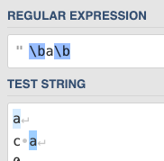

## [正则表达式在线验证工具](https://regex101.com/r/Fq77xF/3)


## 正则表达式介绍

正则表达式（regex）用来高效匹配，Java标准库 `java.util.regex` 包内置了正则表达式引擎。

而我们只需要一个描述一个字符串规则就可以判断目标字符串是否匹配规则。

```java
//检测是否是11位手机号
String phoneRegex = "152xxxxxxxx";
boolean res = phone.matches("\\d{11}");
```

上例中，用 ` \d` 表示一个数字，`{11}` 表示有前边类型的个数。（在Java的字符串中，反斜线`\` 表示转义字符，比如 `\r` 表示回车 `\n` 表示换行，而 `\\` 则表示一个 反斜线 `\`）。

```java
String s1 = "152\\d{8}" //表示152开头的总共11位数字
```


## 单个字符匹配

单个字符的匹配规则如下：

| 元字符 | 说明                                                         |
| ------ | ------------------------------------------------------------ |
| .      | 匹配除换行符以外的任意字符                                   |
| \w     | 匹配字母或数字或下划线或汉字                                 |
| \s     | 匹配任意的空白符                                             |
| \d     | 匹配数字                                                     |
| \b     | [匹配单词的开始或结束](https://www.cnblogs.com/litmmp/p/4925374.html) |
| ^      | 匹配字符串的开始                                             |
| $      | 匹配字符串的结束                                             |


## 重复

单个字符的匹配重复次数

| 元字符   | 规则             | 可以匹配                 |
| :------- | :--------------- | :----------------------- |
| `A*`     | 任意个数字符     | 空，`A`，`AA`，`AAA`，…… |
| `A+`     | 至少1个字符      | `A`，`AA`，`AAA`，……     |
| `A?`     | 0个或1个字符     | 空，`A`                  |
| `A{3}`   | 指定个数字符     | `AAA`                    |
| `A{2,3}` | 指定范围个数字符 | `AA`，`AAA`              |
| `A{2,}`  | 至少n个字符      | `AA`，`AAA`，`AAAA`，……  |
| `A{0,3}` | 最多n个字符      | 空，`A`，`AA`，`AAA`     |

元字符 ^ 和 \$ 都匹配一个位置。^匹配你要用来查找的字符串的开头，\$匹配结尾。

^ 和 \$ 和 \b 有点类似，但是也有区别。如下：



这两个元字符在验证输入的内容时非常有用，比如一个网站如果要求你填写的QQ号必须为5位到12位数字时，可以使用：

```tex
^\d{5,12}$
```

如果不使用^和$的话，对于\d{5,12}而言，使用这样的方法就只能保证字符串里包含5到12连续位数字，而不是整个字符串就是5到12位数字。


## 范围 []

要想查找数字，字母或数字，空白是很简单的，因为已经有了对应这些字符集合的元字符，但是如果你想匹配没有预定义元字符的字符集合(比如元音字母a,e,i,o,u),应该怎么办？

很简单，你只需要在方括号里列出它们就行了，像[aeiou]就匹配任何一个英文元音字母，[.?!]匹配标点符号(.或?或!)。

我们也可以轻松地指定一个字符**范围**，像[0-9]代表的含意与\d就是完全一致的：一位数字；同理[a-z0-9A-Z_]也完全等同于\w（如果只考虑英文的话）。

下面是一个更复杂的表达式：

```tex
\(?0\d{2}[) -]?\d{8}
```

这个表达式可以匹配几种格式的电话号码，像*(010)88886666*，或*022-22334455*，或*02912345678*等。我们对它进行一些分析吧：首先是一个转义字符\(,它能出现0次或1次(?),然后是一个0，后面跟着2个数字(\d{2})，然后是)或-或空格中的一个，它出现1次或不出现(?)，最后是8个数字(\d{8})。


## 分支 |

不幸的是，上面那个表达式也能匹配*010)12345678*或*(022-87654321*这样的不正确的格式。

要解决这个问题，我们需要用到**分枝条件**。正则表达式里的**分枝条件**指的是有几种规则，如果满足其中任意一种规则都应该当成匹配，具体方法是用|把不同的规则分隔开。例子：

```tex
\(0\d{2}\)\d{8}|^0\d{2}[ -]?\d{8}
```


**使用分枝条件时，要注意各个条件的顺序**。分枝条件匹配时，将会从左到右地测试每个条件，如果满足了某个分枝的话，就不会去再管其它的条件了。

## 分组 ()

单个字符的重复可以通过直接加元字符，那如果多个字符想要重复的话，就需要使用分组。用小括号来指定**子表达式**，也叫做**分组**，然后就可以指定子表达式的重复次数，还是使用的是前边的元字符。

例如匹配ip地址，可以通过下面的表达式：

```tex
(\d{1,3}\.){3}\d{1,3}
```

这个只能匹配正确的ip地址，如果是 256.300.888.999，这种不存在的ip地址就无法解析出来了，因为正则表达式无法提供数学判断的功能，所以只能使用冗长的分组来匹配：

```tex
((2[0-4]\d|25[0-5]|[01]?\d\d?)\.){3}(2[0-4]\d|25[0-5]|[01]?\d\d?)
```

除了以上的功能，`()`中的子表达式所捕获的内容可以在表达式或者其他程序中做下一步处理。

默认情况下，每个分组会自动拥有一个**组号**，规则是：从左向右，以分组的左括号为标志，第一个出现的分组的组号为1，第二个为2，以此类推。


**后向引用**

后向引用用于重复搜索前面某个分组匹配的文本。例如，\1代表分组1匹配的文本。示例：

```tex
\b(\w+)\b\s+\1\b
```

可以用来匹配重复的单词，像*go go*, 或者*kitty kitty*。这个表达式首先是一个单词，也就是单词开始处和结束处之间的多于一个的字母或数字(\b(\w+)\b)，这个单词会被捕获到编号为1的分组中，然后是1个或几个空白符(\s+)，最后是分组1中捕获的内容（也就是前面匹配的那个单词）(\1)。

你也可以自己指定子表达式的**组名**。要指定一个子表达式的组名，请使用这样的语法：(?\<Word>\w+)(或者把尖括号换成'也行：(?'Word'\w+)),这样就把\w+的组名指定为Word了。要反向引用这个分组**捕获**的内容，你可以使用\k\<Word>,所以上一个例子也可以写成这样：\b(?\<Word>\w+)\b\s+\k\<Word>\b。


| 分类     | 代码/语法     | 说明                                                         |
| -------- | ------------- | ------------------------------------------------------------ |
| 捕获     | (exp)         | 匹配exp,并捕获文本到自动命名的组里                           |
|          | (?\<name>exp) | 匹配exp,并捕获文本到名称为name的组里，也可以写成(?'name'exp) |
|          | (?:exp)       | 匹配exp,不捕获匹配的文本，也不给此分组分配组号               |
| 零宽断言 | (?=exp)       | 匹配exp前面的位置                                            |
|          | (?<=exp)      | 匹配exp后面的位置                                            |
|          | (?!exp)       | 匹配后面跟的不是exp的位置                                    |
|          | (?<!exp)      | 匹配前面不是exp的位置                                        |
| 注释     | (?#comment)   | 这种类型的分组不对正则表达式的处理产生任何影响，用于提供注释让人阅读 |


## 反义 ^

`^` 也可以用来做反义

| 元字符   | 说明                                       |
| -------- | ------------------------------------------ |
| \W       | 匹配任意不是字母，数字，下划线，汉字的字符 |
| \S       | 匹配任意不是空白符的字符                   |
| \D       | 匹配任意非数字的字符                       |
| \B       | 匹配不是单词开头或结束的位置               |
| [^x]     | 匹配除了x以外的任意字符                    |
| [^aeiou] | 匹配除了aeiou这几个字母以外的任意字符      |


## 贪婪与懒惰 ？

贪婪是尽可能多的匹配，懒惰是尽可能少的匹配。

当正则表达式中包含能接受重复的限定符时，通常的行为是（在使整个表达式能得到匹配的前提下）匹配**尽可能多**的字符。以这个表达式为例：`a.*b`，它将会匹配最长的以a开始，以b结束的字符串。如果用它来搜索 `aabab `的话，它会匹配整个字符串 `aabab`。这被称为**贪婪**匹配。

有时，我们更需要**懒惰**匹配，也就是匹配**尽可能少**的字符。前面给出的限定符都可以被转化为懒惰匹配模式，只要在它后面加上一个问号?。这样.*?就意味着匹配任意数量的重复，但是在能使整个匹配成功的前提下使用最少的重复。现在看看懒惰版的例子吧：

`a.*?b`匹配最短的，以a开始，以b结束的字符串。如果把它应用于*aabab*的话，它会匹配aab（第一到第三个字符）和ab（第四到第五个字符）。

| 代码/语法 | 说明                            |
| --------- | ------------------------------- |
| *?        | 重复任意次，但尽可能少重复      |
| +?        | 重复1次或更多次，但尽可能少重复 |
| ??        | 重复0次或1次，但尽可能少重复    |
| {n,m}?    | 重复n到m次，但尽可能少重复      |
| {n,}?     | 重复n次以上，但尽可能少重复     |

## 
