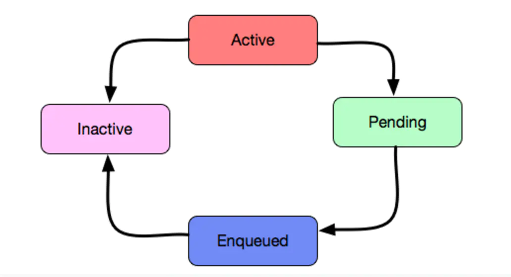
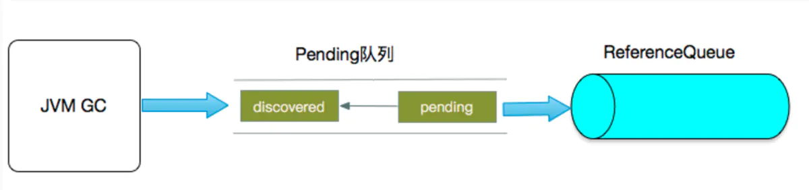
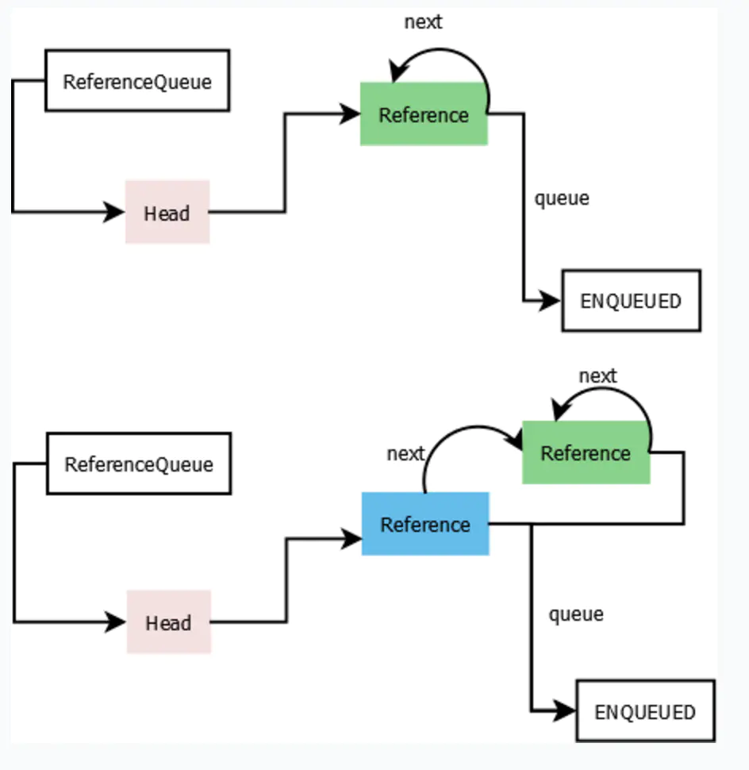
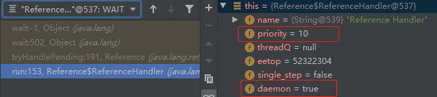
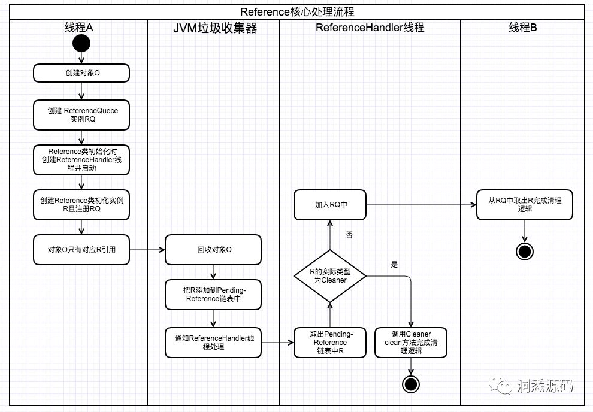

# 深入理解Java中的引用

本系列文章首先会介绍Reference类，为之后介绍的强引用、软引用、弱引用和虚引用打下基础。
 最后会介绍虚引用在DirectBuffer回收中的应用。

## 引用（Reference）

在介绍四种不同类型的引用之前先看一下他们的父类：`java.lang.ref.Reference`。看以看到Reference 有五个成员变量：**referent，queue，pending，next，discovered。**下面会一一介绍各个成员变量的作用。

### Reference状态

在介绍五个成员变量之前，首页要明确一点，Reference是有状态的，Reference对象的一共有四种状态。如下图所示



image.png

Reference对象所处状态不同，成员变量的值也会变化。

- **Active**: Reference对象新建时处于该状态。
- **Pending**: 当Reference包装的referent 对象要被垃圾回收时，JVM会把Reference设置成pending状态。如果Reference创建时指定了ReferenceQueue，那么会被ReferenceHandler线程处理进入到ReferenceQueue队列中，如果没有就进入Inactive状态。
- **Enqueue**: 进入ReferenceQueue中的对象
- **Inactive**: Reference对象从ReferenceQueue取出来并被处理掉。处于Inactive的Reference对象状态不能再改变

### 核心成员变量

1）**referent**: 表示被包装的对象
 下面代码中 obj 就是被包装的对象。

```java
Object obj = new Object()
WeakReference<Object> wo = new WeakReference<Object>(obj);
```

2） **queue**: 表示被包装的对象被回收时，需要被通知的队列，该队列在Reference构造函数中指定。当referent被回收的时候，Reference对象就处在了Pending状态，Reference会被放入到该队列中，如果构造函数没有指定队列，那么就进入Inactive状态。

```java
public abstract class Reference<T> {
    private T referent;
	volatile ReferenceQueue<? super T> queue;
    
    Reference(T referent) {
        this(referent, null);
    }

    Reference(T referent, ReferenceQueue<? super T> queue) {
        this.referent = referent;
        this.queue = (queue == null) ? ReferenceQueue.NULL : queue;
    }
}
```

3）**pending**: 表示等待被加入到queue的Reference 列表。

```java
    /* List of References waiting to be enqueued.  The collector adds
     * References to this list, while the Reference-handler thread removes
     * them.  This list is protected by the above lock object. The
     * list uses the discovered field to link its elements.
     */
    private static Reference<Object> pending = null;
```

这里有两个需要注意的点：

- 一是要区分Pending是引用状态，而pending是Reference的静态字段。
- 二是理解pending的意义，该字段用static 修饰，表示内存中的引用实例会共用这个静态变量，pending理解链表有点费解，因为代码层面上看这明明就是Reference对象。其实当Reference处在Pending状态时，他的pending字段被赋值成了下一个要处理的对象（即下面讲的discovered），通过discovered可以拿到下一个对象并且赋值给pending，直到最后一个，所以这里就可以把它当成一个链表。而discovered是JVM的垃圾回收器添加进去的，大家可以不用关心底层细节。

4）**discovered**: 当处于Reference处在Pending状态：discovered为pending集合中的下一个元素；其他状态：discovered为null

```java
    /* When active:   next element in a discovered reference list maintained by GC (or this if last)
     *     pending:   next element in the pending list (or null if last)
     *   otherwise:   NULL
     */
    transient private Reference<T> discovered;  /* used by VM */
```

上述discovered与pending的关系可以用下图表示



5） **next**: 当Reference对象在queue中时（即Reference处于Enqueued状态），next描述当前引用节点所存储的下一个即将被处理的节点。

```java
   /* When active:   NULL
     *     pending:   this
     *    Enqueued:   next reference in queue (or this if last)
     *    Inactive:   this
     */
    @SuppressWarnings("rawtypes")
    Reference next;
```

ReferenceHandler线程会把Pending状态的Reference放入ReferenceQueue中，上面说的**next，discovered** 字段在入队之后也会发生变化，下一小节会介绍。

### ReferenceQueue入队过程

上面说到ReferenceHandler线程会把Pending状态的Reference对象放入到ReferenceQueue队列中。
 查看ReferenceQueue中入队源代码。

```java
boolean enqueue(Reference<? extends T> r) { /* Called only by Reference class */
        synchronized (lock) {
            // Check that since getting the lock this reference hasn't already been
            // enqueued (and even then removed)
            ReferenceQueue<?> queue = r.queue;
            if ((queue == NULL) || (queue == ENQUEUED)) {
                return false;
            }
            assert queue == this;
            //设置queue状态
            r.queue = ENQUEUED;
            //改变next指针
            r.next = (head == null) ? r : head;
            head = r;
            queueLength++;
            if (r instanceof FinalReference) {
                sun.misc.VM.addFinalRefCount(1);
            }
            lock.notifyAll();
            return true;
        }
    }
```

可以看到入队的Reference节点r进入队列，Reference节点被放在队列头，所以这是一个**先进后出队列**。 入队的示意图如下：




### ReferenceHandler线程

Reference类中另一个比较重要的成员是ReferenceHandler，ReferenceHandler是一个守护线程。当JVM加载Reference的时候，就会启动这个线程，并且线性优先级被设置为**高优先级**。

```java
public abstract class Reference<T> {
	static {
		...
        Thread handler = new ReferenceHandler(tg, "Reference Handler");

        handler.setPriority(Thread.MAX_PRIORITY);
        handler.setDaemon(true);
        handler.start();
	    ...
    }
    private static class ReferenceHandler extends Thread {
        ...
    }
}
```



```java
private static class ReferenceHandler extends Thread {
    ReferenceHandler(ThreadGroup g, String name) {
        super(g, name);
    }

    public void run() {
        while (true) {
            tryHandlePending(true);
        }
    }
    
    static boolean tryHandlePending(boolean waitForNotify) {
        Reference<Object> r;
        Cleaner c;
        try {
            synchronized (lock) {
                if (pending != null) {
                    r = pending;
                    //instanceof 可能会抛出OOME，所以在将r从pending链上断开前，做这个处理
                    c = r instanceof Cleaner ? (Cleaner) r : null;
                    //将将r从pending链上断开
                    pending = r.discovered;
                    r.discovered = null;
                } else {
                    //等待CG后的通知
                    if (waitForNotify) {
                        lock.wait();
                    }
                     //重试
                    return waitForNotify;
                }
            }
        } catch (OutOfMemoryError x) {
			// 当抛出OOME时，放弃CPU的运行时间，这样有希望收回一些存活的引用并且GC能回收部分空间。
            // 同时能避免频繁地自旋重试，导致连续的OOME异常

            Thread.yield();
            return true;
        } catch (InterruptedException x) {
            return true;
        }

        // Cleaner是 虚引用的子类
		// 如果是Cleaner类型的Reference调用其clean方法并退出。
        if (c != null) {
            c.clean();
            return true;
        }

        // 进行入队操作
        ReferenceQueue<? super Object> q = r.queue;
        // 如果Reference有注册ReferenceQueue，
        // 则处理pending指向的Reference结点将其加入ReferenceQueue中
        if (q != ReferenceQueue.NULL) q.enqueue(r);
        return true;
    }
}
```

ReferenceHandler线程内部的run方法会不断地从Reference构成的pending链表上获取Reference对象，如果能获取则根据Reference的具体类型进行不同的处理，不能则调用wait方法等待GC回收对象处理pending链表的通知。

### Cleaner

同样先看一下Cleaner的成员变量，再看主要的方法实现。

```java
//继承了PhantomReference类也就是虚引用，PhantomReference源码很简单只是重写了get方法返回null
public class Cleaner extends PhantomReference<Object> {
    /* 虚队列，命名很到位。之前说CG把ReferenceQueue加入pending-Reference链中后，ReferenceHandler线程在处理时
     * 是不会将对应的Reference加入列队的，而是调用Cleaner.clean方法。但如果Reference不注册ReferenceQueue，GC处理时
     * 又无法把他加入到pending-Reference链中，所以Cleaner里面有了一个dummyQueue成员变量。
     */
    private static final ReferenceQueue<Object> dummyQueue = new ReferenceQueue();
    //Cleaner链表的头结点
    private static Cleaner first = null;
    //当前Cleaner节点的后续节点
    private Cleaner next = null;
    //当前Cleaner节点的前续节点
    private Cleaner prev = null;
    //真正执行清理工作的Runnable对象，实际clean内部调用thunk.run()方法
    private final Runnable thunk;
}
```

从上面的成变量分析知道Cleaner实现了双向链表的结构。先看构造函数与clean方法。

```java
//私有方法，不能直接new
private Cleaner(Object var1, Runnable var2) {
    super(var1, dummyQueue);
    this.thunk = var2;
}
//创建Cleaner对象，同时加入Cleaner链中。
public static Cleaner create(Object var0, Runnable var1) {
    return var1 == null ? null : add(new Cleaner(var0, var1));
}
//头插法将新创意的Cleaner对象加入双向链表，synchronized保证同步
private static synchronized Cleaner add(Cleaner var0) {
    if (first != null) {
        var0.next = first;
        first.prev = var0;
    }
    //更新头节点引用
    first = var0;
    return var0;
}
public void clean() {
    //从Cleaner链表中先移除当前节点
    if (remove(this)) {
        try {
            //调用thunk.run()方法执行对应清理逻辑
            this.thunk.run();
        } catch (final Throwable var2) {
            //省略部分代码..
        }
    }
}
```

## 总结

Reference具有的**Active（活跃状态）、Pending（未决定状态）、Enqueued（入队状态）、Inactive（不活跃状态）**四种状态。

- 在Reference对象创建时，引用处于**Active**的状态，除了要传入指向的对象 referent，还支持传入一个ReferenceQueue，如果不传入ReferenceQueue，则指向对象被垃圾回收时，Reference对象会直接进入 Inactive状态。

- 在传入ReferenceQueue的情况下，当referent 指向的对象被垃圾回收后，Reference对象会进入**Pending** 状态。

  在Reference类中有一个静态成员 pending，该成员用来形成一个由Reference构成的链表。GC在回收 referent后将Reference对象加入pending-Reference链表。

  同时会通知 ReferenceHandler 进行处理，检查 pending 在不为 null的前提下，判断Cleaner类型，从而决定进行Cleaner.clean() 或将当前Reference对象入队（先进后出的队列）。

  并将pending指向下一个需要入队的Reference，也就是discovered 指向的对象，pending-Reference会采用discovered引用 连接链表的下个节点。

- 如果是Cleaner（ Cleaner是 虚引用的子类）则会在入队前调用 clean() 方法，完成入队后，Reference对象的状态变为 **Enqueued**。

- Reference对象从ReferenceQueue取出来并被处理会变成**Inactive**。

  

### Reference 核心处理流程：



Reference的核心处理流程：JVM在GC时如果当前对象只被Reference对象引用，JVM会根据Reference具体类型与堆内存的使用情况决定是否把对应的Reference对象加入到一个由Reference构成的pending链表上，如果能加入pending链表JVM同时会通知ReferenceHandler线程进行处理。ReferenceHandler线程收到通知后会调用Cleaner#clean或ReferenceQueue#enqueue方法进行处理。如果引用当前对象的Reference类型为WeakReference且堆内存不足，那么JMV就会把WeakReference加入到pending-Reference链表上，然后ReferenceHandler线程收到通知后会异步地做入队列操作。而我们的应用程序中的线程便可以不断地去拉取ReferenceQueue中的元素来感知JMV的堆内存是否出现了不足的情况，最终达到根据堆内存的情况来做一些处理的操作。实际上WeakHashMap低层便是过通上述过程实现的，只不过实现细节上有所偏差，这个后面再分析。再来看看ReferenceHandler线程收到通知后可能会调用的另外一个类Cleaner的实现。

### DirectByteBuffer堆外内存回收

```java
// 分配堆外内存的方法
DirectByteBuffer(int cap) {                   // package-private
    super(-1, 0, cap, cap);
    boolean pa = VM.isDirectMemoryPageAligned();
    int ps = Bits.pageSize();
    long size = Math.max(1L, (long)cap + (pa ? ps : 0));
    Bits.reserveMemory(size, cap);

    long base = 0;
    try {
        base = unsafe.allocateMemory(size);
    } catch (OutOfMemoryError x) {
        Bits.unreserveMemory(size, cap);
        throw x;
    }
    unsafe.setMemory(base, size, (byte) 0);
    if (pa && (base % ps != 0)) {
        // Round up to page boundary
        address = base + ps - (base & (ps - 1));
    } else {
        address = base;
    }
    // 对负责操作堆外内存的引用对象指定了cleaner对象，
    cleaner = Cleaner.create(this, new Deallocator(base, size, cap));
    att = null;
}

// Deallocator的run方法定义具体的清理动作
private static class Deallocator implements Runnable
    {
        private static Unsafe unsafe = Unsafe.getUnsafe();

        private long address;
        private long size;
        private int capacity;

        private Deallocator(long address, long size, int capacity) {
            assert (address != 0);
            this.address = address;
            this.size = size;
            this.capacity = capacity;
        }

        public void run() {
            if (address == 0) {
                // Paranoia
                return;
            }
            unsafe.freeMemory(address);
            address = 0;
            Bits.unreserveMemory(size, capacity);
        }

    }
```

创建 DirectByteBuffer 对象时会为其创建一个Cleaner对象，Cleaner对象持有了DirectByteBuffer对象的引用。当GC将 DirectByteBuffer 对象回收时，会发现有个虚引用（Cleaner 继承自虚引用）指向该对象，JVM会将其对应的Cleaner加入到 Reference 的pending-reference 链表中，同时会唤醒 ReferenceHandler 线程来处理，Handler会将非Cleaner的引用进行入队操作，而对于Cleaner类型的引用，会在Handler所在的线程（高优先级的守护线程）中执行Cleaner的 clean（）方法。而对于DirectByteBuffer创建的Cleaner对象其clean方法内部会调用unsafe.freeMemory释放堆外内存。最终达到了DirectByteBuffer对象被GC回收其对应的堆外内存也被回收的目的。

### WeakHashMap敏感内存回收

```java
public V put(K key, V value) {
    Object k = maskNull(key);
    int h = hash(k);
    Entry<K,V>[] tab = getTable();
    int i = indexFor(h, tab.length);

    for (Entry<K,V> e = tab[i]; e != null; e = e.next) {
        if (h == e.hash && eq(k, e.get())) {
            V oldValue = e.value;
            if (value != oldValue)
                e.value = value;
            return oldValue;
        }
    }

    modCount++;
    Entry<K,V> e = tab[i];
    // 每次put都会创建一个Entry
    tab[i] = new Entry<>(k, value, queue, h, e);
    if (++size >= threshold)
        resize(tab.length * 2);
    return null;
}

private static class Entry<K,V> extends WeakReference<Object> implements Map.Entry<K,V> {
        V value;
        final int hash;
        Entry<K,V> next;

        /**
         * 可以看到Entry继承自 WeakReference
         */
        Entry(Object key, V value,
              ReferenceQueue<Object> queue,
              int hash, Entry<K,V> next) {
            // 把Entry的key当作referent
            // 当key只被Entry引用时,也就是key只被弱引用指向时,会触发前面讲到的一系列操作
            // 最终弱引用会进入queue 队列中
            // WeakHashMap中对敏感内存的回收就是在队列中完成的
            super(key, queue);
            this.value = value;
            this.hash  = hash;
            this.next  = next;
        }
    
    	// ...
```

这是ReferenceQueue中做的事情：

```java
private void expungeStaleEntries() {
    //不断地从ReferenceQueue中取出，那些只有被WeakReference对象引用的对象的Reference
    for (Object x; (x = queue.poll()) != null; ) {
        synchronized (queue) {
            //转为 entry 
            Entry<K,V> e = (Entry<K,V>) x;
            //计算其对应的桶的下标
            int i = indexFor(e.hash, table.length);
            //取出桶中元素
            Entry<K,V> prev = table[i];
            Entry<K,V> p = prev;
            //桶中对应位置有元素，遍历桶链表所有元素
            while (p != null) {
                Entry<K,V> next = p.next;
                //如果当前元素(也就是entry)与queue取出的一致，将entry从链表中去除 
                if (p == e) {
                    if (prev == e)
                        table[i] = next;
                    else
                        prev.next = next;
                    //清空entry对应的value
                    e.value = null; // Help GC
                    size--;
                    break;
                }
                prev = p;
                p = next;
            }
        }
    }
}
```

检查引用队列是否为空，如果不为空则意味着有key失效，则需要执行HashMap的remove操作，只要对WeakHashMap进行操作就会调用expungeStaleEntries方法，没用的Key对应的Entry就会被清除。

**最后再来总结一下 为什么WeakHashMap适合作为内存敏感缓存的实现。**

当JVM 在GC时，如果发现WeakHashMap里面某些Key**变得软可达(没有强引用的指向)**，JVM会将其对应的WeakReference对象加入到pending-reference链表上，并通知ReferenceHandler线程处理。而ReferenceHandler线程收到通知后将对应引用Key的WeakReference对象加入到 WeakHashMap内部的ReferenceQueue中，下次再对WeakHashMap做操作时，WeakHashMap内部会清除那些没有被引用的Key对应的Entry。

这样就达到了每操作WeakHashMap时，自动的检索并清量那些Key不再被引用的Entry。


**Reference**

https://www.jianshu.com/p/d275812816e5

https://www.jianshu.com/p/e279b8b492aa

[http://ifeve.com/java-reference%E6%A0%B8%E5%BF%83%E5%8E%9F%E7%90%86%E5%88%86%E6%9E%90/](http://ifeve.com/java-reference核心原理分析/)