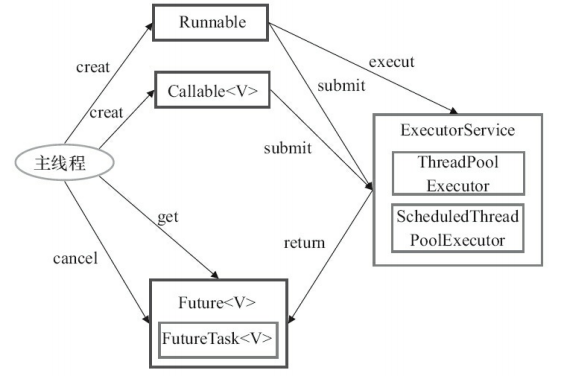
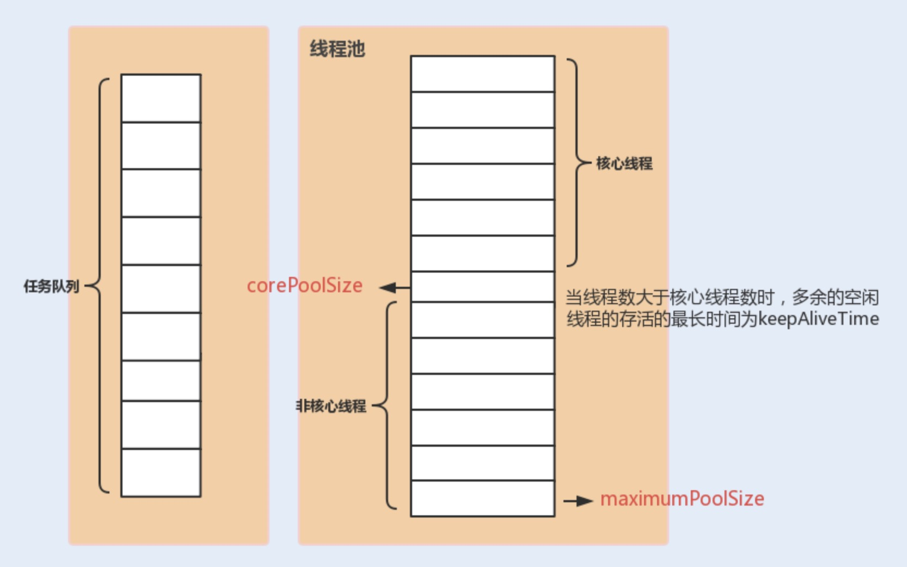
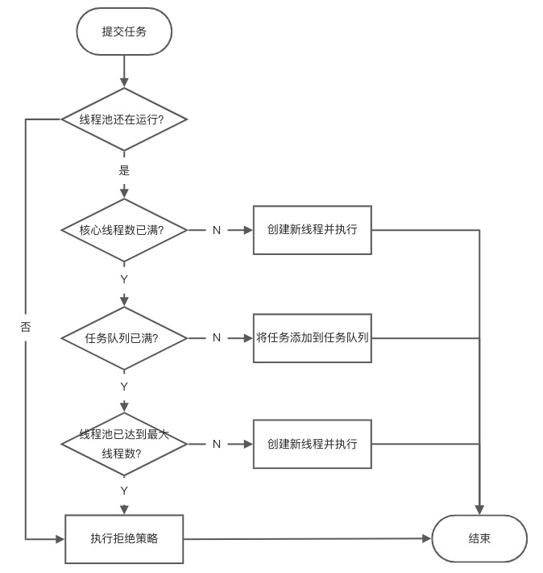
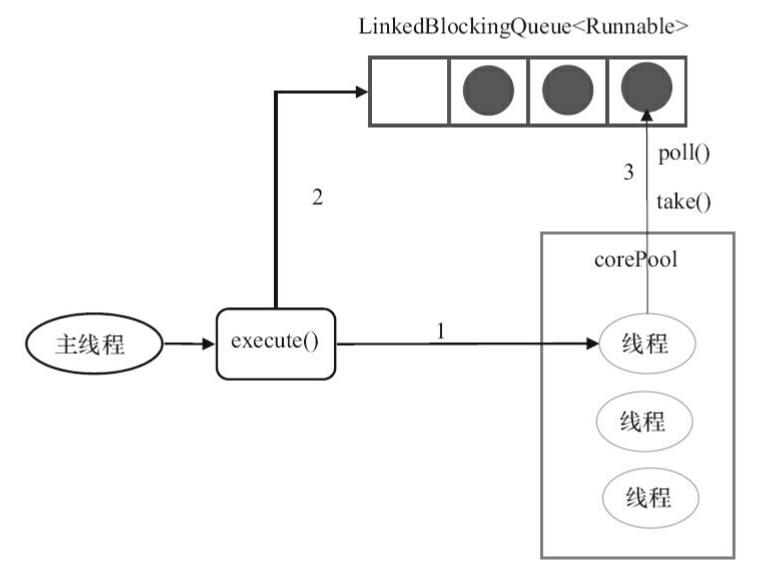

**前言：**

线程池是并发编程中的核心内容，本篇会对创建和使用线程池进行详细的讲解。 也会对 Executor 框架进行介绍，方便后面我们学习异步编程。

[toc]

**面试问题**

Q ：自定义线程池的参数都有哪些？分别起什么作用？

Q ：为什么不建议使用 Executors 中提供的线程池？

## 1.为什么要使用线程池

### 1.1 使用线程池的好处

虽然在Java语言中创建线程看上去就像创建一个对象一样简单,只需要new Thread)就可以了,但实际上创建线程远不是创建一个对象那么简单。创建对象,仅仅是在JVM的堆里分配一块内存而已;而创建一个线程,却需要调用操作系统内核的API,然后操作系统要为线程分配一系列的资源,这个成本就很高了,所以**线程是一个重量级的对象,应该避免频繁创建和销毁。**

那如何避免呢？应对方案估计你已经知道了，那就是线程池。

> 池化技术相比大家已经屡见不鲜了，线程池、数据库连接池、Http 连接池等等都是对这个思想的应用。池化技术的思想主要是为了减少每次获取资源的消耗，提高对资源的利用率。

**线程池**提供了一种限制和管理资源（包括执行一个任务）。 每个**线程池**还维护一些基本统计信息，例如已完成任务的数量。

线程池是一种“池化”的线程使用模式，通过创建一定数量的线程，让这些线程处于就绪状态来提高系统响应速度，在线程使用完成后归还到线程池来达到重复利用的目标，从而降低系统资源的消耗。


这里借用《Java 并发编程的艺术》提到的来说一下**使用线程池的好处**：

- **降低资源消耗**。通过重复利用已创建的线程降低线程创建和销毁造成的消耗。
- **提高响应速度**。当任务到达时，任务可以不需要的等到线程创建就能立即执行。
- **提高线程的可管理性**。线程是稀缺资源，如果无限制的创建，不仅会消耗系统资源，还会降低系统的稳定性，使用线程池可以进行统一的分配，调优和监控。

### 1.2 初探线程池

线程池其实可以看作一种生产者-消费者模式，线程池的使用方是生产者，线程池本身是消费者。

下面通过一个简单的线程池，来理解其内部原理。

```java
//简化的线程池，理解其工作原理
public class MyThreadPool {
    //利用阻塞队列实现生产者-消费者模式
    BlockingQueue<Runnable> workQueue;
    //保存内部的工作线程
    List<WorkerThread> threads = new ArrayList<>();

    // 构造方法
    MyThreadPool(int poolSize, BlockingQueue<Runnable> workQueue) {
        this.workQueue = workQueue;
        // 创建工作线程
        for (int idx = 0; idx < poolSize; idx++) {
            WorkerThread work = new WorkerThread();
            work.start();
            threads.add(work);
        }
    }

    // 提交任务
    void execute(Runnable command) throws InterruptedException {
        workQueue.put(command);
    }

    // 工作线程负责消费任务，并执行任务
    class WorkerThread extends Thread {
        public void run() {
            //循环取任务并执行
            while (true) {
                Runnable task = null;
                try {
                    task = workQueue.take();
                } catch (InterruptedException e) {
                    e.printStackTrace();
                }
                task.run();
            }
        }
    }

    public static void main(String[] args) throws InterruptedException {
        // 创建有界阻塞队列
        BlockingQueue<Runnable> workQueue = new LinkedBlockingQueue<>(2);
        // 创建线程池
        MyThreadPool pool = new MyThreadPool(5, workQueue);
        // 提交任务
        for (int i = 0; i < 10; i++) {
            int finalI = i;
            pool.execute(() -> {
                System.out.println(Thread.currentThread().getName() + " say: hello " + finalI);
            });
        }
    }
}

//Output
Thread-0 say: hello 0
Thread-0 say: hello 1
Thread-1 say: hello 2
Thread-1 say: hello 3
Thread-4 say: hello 4
Thread-1 say: hello 6
Thread-1 say: hello 7
Thread-0 say: hello 5
Thread-2 say: hello 8
Thread-4 say: hello 9
```

在这个简单的模型内部，维护着一个用于保存任务的阻塞队列 workQueue 和一组用于执行任务的工作线程，工作线程的最大个数由构造函数中的 poolSize 来指定，阻塞队列所能容纳的最大任务个数也可以指定。实例 pool 的 execute（）方法，仅仅是将任务加入到 workQueue 中，这一步相等于生产者。工作线程会一直去 workQueue 拿任务来执行，如果没有拿到的话，会进行等待直到拿到任务。

## 2.Executor

Executor 框架是 Java5 之后引进的，其内部使用了线程池机制。通过 Executor 来启动线程比使用 Thread 的 start 方法更好，除了更易管理，效率更好（用线程池实现，节约开销）外，还有的一点：有助于避免 this 逃逸问题。

> 补充：this 逃逸是指在构造函数返回之前其他线程就持有该对象的引用. 调用尚未构造完全的对象的方法可能引发令人疑惑的错误。

Executor 框架不仅包括了线程池的管理，还提供了线程工厂、队列以及拒绝策略等，Executor 框架让并发编程变得更加简单。

### 2.1 任务的定义(Runnable /Callable)

在[线程的生命周期]()中有提过，无论是无返回值的 Runnable 还是有返回值的 Callbale，其实都可以当作是一个要执行的任务。

```java
public interface Executor {
    // 执行一个任务
    void execute(Runnable command);
}

public interface ExecutorService extends Executor {
    // 提交Callable任务
    <T> Future<T> submit(Callable<T> task);
    // 提交Runnable任务 
    Future<?> submit(Runnable task);
    // 提交RUnnable任务及结果引用
    <T> Future<T> submit(Runnable task, T result);
}
```

- **void execute(Runnable command)** 方法只能传入 **Runnable**，仅仅是执行一个任务，对其执行结果并不关注。

- **<T> Future<T> submit(Callable<T> task)** 方法提交一个 **Callable** 接口，它只有一个 **call()** 方法，且有返回值的，所以该 **submit**() 方法返回的 Future 对象可以通过调用其 **get()** 方法来获取任务执行结果。

- **Future<?> submit(Runnable task)** 方法提交的是 **Runnable** 接口，该接口是没有返回值的，因此这个方法返回的 Future 对象仅可以用来判断该任务是否执行结束，类似于 **Thread.join()**。

- **<T> Future<T> submit(Runnable task, T result)** 方法弥补了 **Runnable**  接口无法返回执行结果的缺陷。通过传入一个结果引用，作为 Runnable 保存结果 和 Future 获取结果的桥梁，使得主线程和子线程可以共享数据。

  通过下边这段代码可以更好的理解，传入结果引用的作用。

  ```java
  public class ThreadPoolTest1 {
      public static void main(String[] args) throws ExecutionException, InterruptedException {
          ExecutorService executorService = Executors.newFixedThreadPool(5);
          Result res = new Result();
          Future<Result> future = executorService.submit(new Task(res), res);
          System.out.println(future.get());
      }
  
      static class Task implements Runnable {
          Result res;
          public Task(Result res) {
              this.res = res;
          }
  
          @Override
          public void run() {
              res.setNum(1);
          }
      }
  
      static class Result {
          private int num = 0;
          //getter() and setter()
          //toString()
      }
  }
  ```

  

### 2.2 任务的执行(Executor)


如上图所示，包括任务执行机制的核心接口 **Executor** ，以及继承自 Executor 接口的 **ExecutorService 接口。ForkJoinPool、ThreadPoolExecutor** 和 **ScheduledThreadPoolExecutor** 对 ExecutorService 接口进行了实现。

- **ThreadPoolExecutor**  是我们接下来着重要学习的类，它是实现线程池的核心类。
- **ForkJoinPool**  是并行计算框架中的一部分，另一部分是**ForkJoinTask**，这两者的关系类似于 ThreadPoolExecutor 和 Runnable 的关系。
- **ScheduledThreadPoolExecutor** 是一个类似于定时任务的线程池。

### 2.3 异步执行的结果(Future)

在任务的定义中，可以看到 **submit（）** 总是返回一个 **Future** 。这个单词的意思是未来，也就是某个任务的执行结果，个人理解为票据可能更通俗些，这个就像是我们点餐的时候收银台给我们的票据，我们可以通过这个票据去咨询做饭的进度，也可以通过该票据去取消该次点餐。

```java
public interface Future<V> {
    // 取消任务
    boolean cancel(boolean mayInterruptIfRunning);
    // 判断任务是否被取消
    boolean isCancelled();
    // 判断任务是否已结束
    boolean isDone();
    // 获取任务执行结果
    V get() throws InterruptedException, ExecutionException;
    // 获取任务执行结果，支持超时
    V get(long timeout, TimeUnit unit)	
        	throws InterruptedException, ExecutionException, TimeoutException;
}
```

下面我们来看看 **Future** 的继承结构。


- **FunctionalInterface** 这个注解接口是 Java8 的新特性，**Runnable** 接口使用了该注解，意味着我们可以使用 Lambda 表达式来定义任务，而不用通过繁琐的匿名内部类的方式。

- **Future** 接口及其子接口用于表示异步计算的结果，**RunnableFuture、ScheduledFuture、ForkJoinTask** 对应上面的三种线程池返回的计算结果。

-  **FutureTask** 该类实现了 Runnable 接口，可以将 FutureTask 对象作为任务直接提交给 ThreadPoolExecutor 去执行，具体的执行方式无论是 `Executor.execute(Runnable)` 还是 `ExecutorService.submit()`，又或者是直接被 Thread 执行。同时它还实现了Future接口，因此可以获得任务的执行结果。

  将 FutureTask 作为任务提交给 ThreadPoolExecutor 执行：

  ```java
  // 创建FutureTask
  FutureTask<Integer> futureTask = new FutureTask<>(()-> 1+2);
  // 创建线程池
  ExecutorService es =Executors.newCachedThreadPool();
  // 提交FutureTask
  es.submit(futureTask);
  // 获取计算结果
  Integer result = futureTask.get();
  ```

  直接被 Thread 执行：

  ```java
  // 创建FutureTask
  FutureTask<Integer> futureTask = new FutureTask<>(()->1+2);
  // 创建并启动线程
  new Thread(futureTask).start();
  // 获取计算结果
  Integer result = futureTask.get();
  ```

### 2.4 Executor使用示例

就以烧水泡茶这个工序来举例，用两个线程T1和T2来完成烧水泡茶程序，T1负责洗水壶、烧开水、泡茶这三道工序，T2负责洗茶壶、洗茶杯、拿茶叶三道工序，其中T1在执行泡茶这道工序时需要等待T2完成拿茶叶的工序。对于T1的这个等待动作，可以有很多种办法，例如Thread.join()、CountDownLatch，甚至阻塞队列都可以解决，不过今天我们用Future特性来实现。


代码实现：

```java
public static void main(String[] args) throws ExecutionException, InterruptedException {
        Executor executor = Executors.newFixedThreadPool(2);
        FutureTask<String> f2 = new FutureTask<>(() -> {
            System.out.println("T2 洗茶壶");
            TimeUnit.SECONDS.sleep(2);
            System.out.println("T2 洗茶杯子");
            TimeUnit.SECONDS.sleep(2);
            System.out.println("T2 拿到茶叶");
            TimeUnit.SECONDS.sleep(2);
            return "西湖龙井";
        });
        FutureTask<String> f1 = new FutureTask<>(() -> {
            System.out.println("T1 准备烧水");
            TimeUnit.SECONDS.sleep(2);
            System.out.println("T1 水开了");
            TimeUnit.SECONDS.sleep(2);
            String tea = f2.get();
            System.out.println("T1 泡茶");
            TimeUnit.SECONDS.sleep(2);
            return "上茶: " + tea;
        });
        executor.execute(f1);
        executor.execute(f2);
        System.out.println("main 在等上茶");
        System.out.println(f1.get());
    }
```

### 2.5 Executor 使用分析



1. 主线程首先要创建实现 Runnable 或者 Callable 接口的任务对象，也可以直接创建 FutureTask 对象。

2. 把创建完成的任务对象直接交给 ExecutorService 执行。

   `ExecutorService.execute(Runnable command)` 或者是`ExecutorService.submit(...)`。这里有个需要注意的点，如果使用 `ExecuteService.submit()`自己创建的 FutureTask 对象，submit()  本身也会返回一个 Future 对象，这样我们就有了两个 Future 对象了，这两个对象有所不同，task2是由 `Future<?> submit(Runnable task)` 这个接口产生的，而这个接口是没有返回值的，但task1可以拿到返回值，取值的时候注意别取错了。

   ```java
   FutureTask task1 = new FutureTask(....);
   FutureTask task2 = ExecutorService.submit(task1);
   ```

3. `FutureTask.get()`方法来获取任务的执行结果。也可以执行` FutureTask.cancel（boolean mayInterruptIfRunning）`来取消此任务的执行。


## 3.ThreadPoolExecutor

线程池实现类 ThreadPoolExecutor 是 Executor 框架最核心的类，前面我们使用的 **ExecutorService** 都是通过工具类 **Executors** 来创建的，底层还是调用 ThreadPoolExecutor 的构造器，**Executors** 会为我们提供几种常用的线程池，但有时候不够灵活，我们就需要自定义线程池，并且我们也应当这么做，线程池是一个很敏感的资源，稍有不慎就会导致系统资源耗尽，因此我们需要通过了解每个参数来正确的配置及使用它。

### 3.1 ThreadPoolExecutor 构造参数解析

```java
    public ThreadPoolExecutor(int corePoolSize,
                              int maximumPoolSize,
                              long keepAliveTime,
                              TimeUnit unit,
                              BlockingQueue<Runnable> workQueue,
                              ThreadFactory threadFactory,
                              RejectedExecutionHandler handler)
```

**ThreadPoolExecutor 3 个最重要的参数：**

1. **corePoolSize :** 核心线程数，定义了最小可以同时运行的线程数量，也是正常情况下我们期望的线程数量。
2. **maximumPoolSize :** 当工作队列中存放的任务达到队列容量的时候，当前可以同时运行的线程数量变为最大线程数。当工作队列满了后，新提交来的任务，只能通过增加工作线程来处理。
3. **workQueue:** 临时存放任务的阻塞队列。当新任务来的时候会先判断当前运行的线程数量是否达到核心线程数，如果达到的话，就会被存放在队列中。线程池任务队列的常用实现类有：
   - ArrayBlockingQueue ：一个数组实现的有界阻塞队列，此队列按照FIFO的原则对元素进行排序，支持公平访问队列。
   - LinkedBlockingQueue ：一个由链表结构组成的可选有界阻塞队列，如果不指定大小，则使用Integer.MAX_VALUE作为队列大小，按照FIFO的原则对元素进行排序。
   - PriorityBlockingQueue ：一个支持优先级排序的无界阻塞队列，默认情况下采用自然顺序排列，也可以指定Comparator。
   - DelayQueue：一个支持延时获取元素的无界阻塞队列，创建元素时可以指定多久以后才能从队列中获取当前元素，常用于缓存系统设计与定时任务调度等。
   - SynchronousQueue：一个不存储元素的阻塞队列。存入操作必须等待获取操作，反之亦然。
   - LinkedTransferQueue：一个由链表结构组成的无界阻塞队列，与LinkedBlockingQueue相比多了transfer和tryTranfer方法，该方法在有消费者等待接收元素时会立即将元素传递给消费者。
   - LinkedBlockingDeque：一个由链表结构组成的双端阻塞队列，可以从队列的两端插入和删除元素。

这三者关系可以这样理解：**corePoolSize** 就像正式的员工，**maximumPoolSize** 像是临时招聘的外包人员，**workQueue** 类比为工作进度安排。提交来的任务就好比是需求。

当有需求进来时，会让**corePoolSize** 也就是正式员工来完成这些需求，随着需求来增加正式员工的数量，当**corePoolSize**达到最大时，也就是公司坐不下了，但需求还不断的提交过来，给每个正式员工排了满满一年的工作安排，这时候就相当于 **workQueue** 满了，为了处理这些需求，只能招一些外包人员来做，也就是 **maximumPoolSize** 创建线程来完成需求。



**ThreadPoolExecutor 其他常见参数:**

1. **keepAliveTime**：当线程池中的线程数量大于 `corePoolSize` 的时候，如果这时没有新的任务提交，核心线程外的线程不会立即销毁，而是会等待，直到等待的时间超过了 `keepAliveTime`才会被回收销毁；

   做完项目之后不会立即把外包撤走，等个一段时间，正式员工能处理过来需求，就可以撤外包了。

2. **unit**： `keepAliveTime` 参数的时间单位。

   等待的时间单位，是周 还是 月。

3. **threadFactory**：executor 创建新线程的时候会用到。通过这个参数你可以自定义如何创建线程，例如你可以给线程指定一个有意义的名字。threadFactory表示线程工厂。用于指定为线程池创建新线程的方式，threadFactory可以设置线程名称、线程组、优先级等参数。如通过Google工具包可以设置线程池里的线程名。

4. **handler** ：拒绝策略，通过这个参数你可以自定义任务的拒绝策略。如果线程池中所有的线程都在忙碌，并且工作队列也满了（前提是工作队列是有界队列），那么此时提交任务，线程池就会拒绝接收。至于拒绝的策略，你可以通过handler这个参数来指定。ThreadPoolExecutor已经提供了以下4种策略。    

   - **ThreadPoolExecutor.AbortPolicy**：默认的拒绝策略，抛出 `RejectedExecutionException`来拒绝新任务的处理。
   - **ThreadPoolExecutor.CallerRunsPolicy**：调用执行自己的线程运行任务，也就是直接在调用`execute`方法的线程中运行(`run`)被拒绝的任务，如果执行程序已关闭，则会丢弃该任务。因此这种策略会降低对于新任务提交速度，影响程序的整体性能。另外，这个策略喜欢增加队列容量。如果您的应用程序可以承受此延迟并且你不能任务丢弃任何一个任务请求的话，你可以选择这个策略。
   - **ThreadPoolExecutor.DiscardPolicy：** 不处理新任务，直接丢弃掉。
   - **ThreadPoolExecutor.DiscardOldestPolicy：** 此策略将丢弃最早的未处理的任务请求，其实就是把最早进入工作队列的任务丢弃，然后把新任务加入到工作队列。

   rejectedExecutionHandler表示拒绝策略。当达到最大线程数且队列任务已满时需要执行的拒绝策略，常见的拒绝策略如下：

   

   1. ThreadPoolExecutor.AbortPolicy：默认策略，当任务队列满时抛出RejectedExecutionException异常。
   2. ThreadPoolExecutor.DiscardPolicy：丢弃掉不能执行的新任务，不抛任何异常。
   3. ThreadPoolExecutor.CallerRunsPolicy：当任务队列满时使用调用者的线程直接执行该任务。
   4. ThreadPoolExecutor.DiscardOldestPolicy：当任务队列满时丢弃阻塞队列头部的任务（即最老的任务），然后添加当前任务。

举个例子：

> Spring 通过 `ThreadPoolTaskExecutor` 或者我们直接通过 `ThreadPoolExecutor` 的构造函数创建线程池的时候，当我们不指定 `RejectedExecutionHandler` 饱和策略的话来配置线程池的时候默认使用的是 `ThreadPoolExecutor.AbortPolicy`。在默认情况下，`ThreadPoolExecutor` 将抛出 `RejectedExecutionException` 来拒绝新来的任务 ，这代表你将丢失对这个任务的处理。 对于可伸缩的应用程序，建议使用 `ThreadPoolExecutor.CallerRunsPolicy`。当最大池被填满时，此策略为我们提供可伸缩队列。（这个直接查看 `ThreadPoolExecutor` 的构造函数源码就可以看出，比较简单的原因，这里就不贴代码了。）

### 3.1 线程池的几种状态

ThreadPoolExecutor线程池有如下几种状态：

1. RUNNING：运行状态，接受新任务，持续处理任务队列里的任务；
2. SHUTDOWN：不再接受新任务，但要处理任务队列里的任务；
3. STOP：不再接受新任务，不再处理任务队列里的任务，中断正在进行中的任务；
4. TIDYING：表示线程池正在停止运作，中止所有任务，销毁所有工作线程，当线程池执行terminated()方法时进入TIDYING状态；
5. TERMINATED：表示线程池已停止运作，所有工作线程已被销毁，所有任务已被清空或执行完毕，terminated()方法执行完成；


### 3.2 ThreadPoolExecutor 使用示例

```java
public class ThreadPoolTest4 {
    private static final int CORE_POOL_SIZE = 2;
    private static final int MAX_POOL_SIZE = 10;
    private static final int QUEUE_CAPACITY = 4;
    private static final Long KEEP_ALIVE_TIME = 1L;

    public static void main(String[] args) {

        //使用阿里巴巴推荐的创建线程池的方式
        //通过ThreadPoolExecutor构造函数自定义参数创建
        ThreadPoolExecutor executor = new ThreadPoolExecutor(
                CORE_POOL_SIZE,
                MAX_POOL_SIZE,
                KEEP_ALIVE_TIME,
                TimeUnit.SECONDS,
                new ArrayBlockingQueue<>(QUEUE_CAPACITY),
                new ThreadPoolExecutor.CallerRunsPolicy());

        for (int i = 0; i < 10; i++) {
            //创建WorkerThread对象（WorkerThread类实现了Runnable 接口）
            int finalI = i;
            executor.execute(()->{
                System.out.println(Thread.currentThread().getName()+" start 任务 "+ finalI);
                try {
                    TimeUnit.SECONDS.sleep(5);
                } catch (InterruptedException e) {
                    e.printStackTrace();
                }
            });
        }
        //终止线程池
        executor.shutdown();
        while (!executor.isTerminated()) {
        }
        System.out.println("Finished all threads");
    }
}
```

可以看到我们上面的代码指定了：

1. `corePoolSize`: 核心线程数为 2。
2. `maximumPoolSize` ：最大线程数 10
3. `keepAliveTime` : 等待时间为 1L。
4. `unit`: 等待时间的单位为 TimeUnit.SECONDS。
5. `workQueue`：任务队列为 `ArrayBlockingQueue`，并且容量为 4;
6. `handler`:饱和策略为 `CallerRunsPolicy`。

**Output：**

```java
pool-1-thread-1 start  任务 0
pool-1-thread-2 start  任务 1
pool-1-thread-3 start  任务 6
pool-1-thread-6 start  任务 9
pool-1-thread-5 start  任务 8
pool-1-thread-4 start  任务 7
//这里会停顿5s再打印后边内容
pool-1-thread-6 start  任务 2
pool-1-thread-2 start  任务 4
pool-1-thread-1 start  任务 5
pool-1-thread-3 start  任务 3
Finished all threads
```

### 3.3 ThreadPoolExecutor 原理分析

执行逻辑如下图所示：



线程池提交一个任务时任务调度的主要步骤如下：


1. 当线程池里存活的核心线程数小于corePoolSize核心线程数参数的值时，线程池会创建一个核心线程去处理提交的任务；
2. 如果线程池核心线程数已满，即线程数已经等于corePoolSize，新提交的任务会被尝试放进任务队列workQueue中等待执行；
3. 当线程池里面存活的线程数已经等于corePoolSize了，且任务队列workQueue已满，再判断当前线程数是否已达到maximumPoolSize，即最大线程数是否已满，如果没到达，创建一个非核心线程执行提交的任务；
4. 如果当前的线程数已达到了maximumPoolSize，还有新的任务提交过来时，执行拒绝策略进行处理。

**源码分析**

```java
   // 存放线程池的运行状态 (runState) 和线程池内有效线程的数量 (workerCount)
   private final AtomicInteger ctl = new AtomicInteger(ctlOf(RUNNING, 0));

    private static int workerCountOf(int c) {
        return c & CAPACITY;
    }

    private final BlockingQueue<Runnable> workQueue;

    public void execute(Runnable command) {
        // 如果任务为null，则抛出异常。
        if (command == null)
            throw new NullPointerException();
        // ctl 中保存的线程池当前的一些状态信息
        int c = ctl.get();

        //  下面会涉及到 3 步 操作
        // 1.首先判断当前线程池中之行的任务数量是否小于 corePoolSize
        // 如果小于的话，通过addWorker(command, true)新建一个线程，并将任务(command)添加到该线程中；然后，启动该线程从而执行任务。
        if (workerCountOf(c) < corePoolSize) {
            if (addWorker(command, true))
                return;
            c = ctl.get();
        }
        // 2.如果当前之行的任务数量大于等于 corePoolSize 的时候就会走到这里
        // 通过 isRunning 方法判断线程池状态，线程池处于 RUNNING 状态才会被并且队列可以加入任务，该任务才会被加入进去
        if (isRunning(c) && workQueue.offer(command)) {
            int recheck = ctl.get();
            // 再次获取线程池状态，如果线程池状态不是 RUNNING 状态就需要从任务队列中移除任务，并尝试判断线程是否全部执行完毕。同时执行拒绝策略。
            if (!isRunning(recheck) && remove(command))
                reject(command);
                // 如果当前线程池为空就新创建一个线程并执行。
            else if (workerCountOf(recheck) == 0)
                addWorker(null, false);
        }
        //3. 通过addWorker(command, false)新建一个线程，并将任务(command)添加到该线程中；然后，启动该线程从而执行任务。
        //如果addWorker(command, false)执行失败，则通过reject()执行相应的拒绝策略的内容。
        else if (!addWorker(command, false))
            reject(command);
    }
```


### 3.4 终止线程池

- **shutdown()** ：当线程池调用该方法时，线程池的状态立刻变为SHUTDOWN状态。此时，不能再往线程池中添加任何任务，否则将会抛出RejectedExecutionException。但是，此时线程池不会立刻退出，直到添加到线程池中的任务都已经处理完成，才会退出。

- **shutdownNow()** ：执行该方法，拒绝接收新提交的任务，（1）线程池的状态立即变为STOP，（2）并试图阻止所有正在执行的线程，（3）不再处理还在线程池队列中等待的任务，当然，它会返回那些未执行的任务。

  它试图阻止线程的方法是通过调用Thread.interrupt方法来实现的，但是这种方法的作用有限，如果线程中没有sleep、wait、Condition、定时锁等应用，interrupt是无法中断当前线程的。所以，shutdownNow并不代表线程池一定会立刻退出，它可能需要等待所有正在执行的任务都执行完毕才会退出。

- **isShutDown** 当调用 `shutdown()` 方法后返回为 true。

- **isTerminated** 当调用 `shutdown()` 方法后，并且所有提交的任务完成后返回为 true

### 3.5 核心线程数量设置建议

**如果我们设置的线程池数量太小的话，如果同一时间有大量任务/请求需要处理，可能会导致大量的请求/任务在任务队列中排队等待执行，甚至会出现任务队列满了之后任务/请求无法处理的情况，或者大量任务堆积在任务队列导致 OOM。这样很明显是有问题的！ CPU 根本没有得到充分利用。**

**但是，如果我们设置线程数量太大，大量线程可能会同时在争取 CPU 资源，这样会导致大量的上下文切换，从而增加线程的执行时间，影响了整体执行效率。**

> 上下文切换：
>
> 多线程编程中一般线程的个数都大于 CPU 核心的个数，而一个 CPU 核心在任意时刻只能被一个线程使用，为了让这些线程都能得到有效执行，CPU 采取的策略是为每个线程分配时间片并轮转的形式。当一个线程的时间片用完的时候就会重新处于就绪状态让给其他线程使用，这个过程就属于一次上下文切换。概括来说就是：当前任务在执行完 CPU 时间片切换到另一个任务之前会先保存自己的状态，以便下次再切换回这个任务时，可以再加载这个任务的状态。**任务从保存到再加载的过程就是一次上下文切换**。
>
> 上下文切换通常是计算密集型的。也就是说，它需要相当可观的处理器时间，在每秒几十上百次的切换中，每次切换都需要纳秒量级的时间。所以，上下文切换对系统来说意味着消耗大量的 CPU 时间，事实上，可能是操作系统中时间消耗最大的操作。
>
> Linux 相比与其他操作系统（包括其他类 Unix 系统）有很多的优点，其中有一项就是，其上下文切换和模式切换的时间消耗非常少。

有一个简单并且适用面比较广的公式：

- **CPU 密集型任务(N+1)：** 这种任务消耗的主要是 CPU 资源，可以将线程数设置为 N（CPU 核心数）+1，比 CPU 核心数多出来的一个线程是为了防止线程偶发的缺页中断，或者其它原因导致的任务暂停而带来的影响。一旦任务暂停，CPU 就会处于空闲状态，而在这种情况下多出来的一个线程就可以充分利用 CPU 的空闲时间。
- **I/O 密集型任务(2N)：** 这种任务应用起来，系统会用大部分的时间来处理 I/O 交互，而线程在处理 I/O 的时间段内不会占用 CPU 来处理，这时就可以将 CPU 交出给其它线程使用。因此在 I/O 密集型任务的应用中，我们可以多配置一些线程，具体的计算方法是 2N。

## 4.常见线程池详解

大厂的编码规范中基本上都不建议使用 Executors 提供的默认线程池，其原因是保证程序的内存资源不被耗尽。

### 4.1 FixedThreadPool

`FixedThreadPool` 被称为可重用固定线程数的线程池。创建一个指定工作线程数量的线程池。每当提交一个任务就创建一个工作线程，如果工作线程数量达到线程池初始的最大数，则将提交的任务存入到池队列中。 

其 `execute()` 方法运行示意图：

1. 如果当前运行的线程数小于 corePoolSize， 如果再来新任务的话，就创建新的线程来执行任务；
2. 当前运行的线程数等于 corePoolSize 后， 如果再来新任务的话，会将任务加入 `LinkedBlockingQueue`；
3. 线程池中的线程执行完 手头的任务后，会在循环中反复从 `LinkedBlockingQueue` 中获取任务来执行；

**为什么不推荐使用 FixedThreadPool**

**FixedThreadPool 使用无界队列 LinkedBlockingQueue（队列的容量为 Intger.MAX_VALUE）作为线程池的工作队列会对线程池带来如下影响 ：**

1. 当线程池中的线程数达到 `corePoolSize` 后，新任务将在无界队列中等待，因此线程池中的线程数不会超过 corePoolSize；
2. 由于使用无界队列时 `maximumPoolSize` 将是一个无效参数，因为不可能存在任务队列满的情况。所以，通过创建 `FixedThreadPool`的源码可以看出创建的 `FixedThreadPool` 的 `corePoolSize` 和 `maximumPoolSize` 被设置为同一个值。
3. 由于 1 和 2，使用无界队列时 `keepAliveTime` 将是一个无效参数；
4. 运行中的 `FixedThreadPool`（未执行 `shutdown()`或 `shutdownNow()`）不会拒绝任务，在任务比较多的时候会导致 OOM（内存溢出）。

### 4.2 SingleThreadExecutor

`SingleThreadExecutor` 是只有一个线程的线程池。可以保证任务执行的顺序 且在任意给定的时间不会有多个线程是活动的 .包含一个无界队列，保证所有任务按照指定顺序（FIFO/LIFO/优先级）执行；

SingleThreadExecutor 的运行示意图：

**上图说明;**

1. 如果当前运行的线程数少于 corePoolSize，则创建一个新的线程执行任务；
2. 当前线程池中有一个运行的线程后，将任务加入 `LinkedBlockingQueue`
3. 线程执行完当前的任务后，会在循环中反复从`LinkedBlockingQueue` 中获取任务来执行；

**为什么不推荐使用 FixedThreadPool**

`SingleThreadExecutor` 使用无界队列 `LinkedBlockingQueue` 作为线程池的工作队列（队列的容量为 Intger.MAX_VALUE）。`SingleThreadExecuto`r 使用无界队列作为线程池的工作队列会对线程池带来的影响与 `FixedThreadPool` 相同。说简单点就是可能会导致 OOM。

### 4.3 CachedThreadPool 

`CachedThreadPool` 创建一个可缓存的线程池，调用execute将重用以前构造的线程(如果线程可用)，如果当前没有可用线程，则创建一个新线程并添加到池中，终止并从缓存中移除那些已有60s钟未被使用的线程

下面通过源码来看看 `CachedThreadPool` 的实现：

```java
    /**
     * 创建一个线程池，根据需要创建新线程，但会在先前构建的线程可用时重用它。
     */
    public static ExecutorService newCachedThreadPool(ThreadFactory threadFactory) {
        return new ThreadPoolExecutor(0, Integer.MAX_VALUE,
                                      60L, TimeUnit.SECONDS,
                                      new SynchronousQueue<Runnable>(),
                                      threadFactory);
    }
    public static ExecutorService newCachedThreadPool() {
        return new ThreadPoolExecutor(0, Integer.MAX_VALUE,
                                      60L, TimeUnit.SECONDS,
                                      new SynchronousQueue<Runnable>());
    }
```

`CachedThreadPool` 的`corePoolSize` 被设置为空（0），`maximumPoolSize`被设置为 Integer.MAX.VALUE，即它是无界的，这也就意味着如果主线程提交任务的速度高于 `maximumPool` 中线程处理任务的速度时，`CachedThreadPool` 会不断创建新的线程。极端情况下，这样会导致耗尽 cpu 和内存资源。

**CachedThreadPool 的 execute()方法的执行示意图（该图片来源：《Java 并发编程的艺术》）：** 

**上图说明：**

1. 首先执行 `SynchronousQueue.offer(Runnable task)` 提交任务到任务队列。如果当前 `maximumPool` 中有闲线程正在执行 `SynchronousQueue.poll(keepAliveTime,TimeUnit.NANOSECONDS)`，那么主线程执行 offer 操作与空闲线程执行的 `poll` 操作配对成功，主线程把任务交给空闲线程执行，`execute()`方法执行完成，否则执行下面的步骤 2；
2. 当初始 `maximumPool` 为空，或者 `maximumPool` 中没有空闲线程时，将没有线程执行 `SynchronousQueue.poll(keepAliveTime,TimeUnit.NANOSECONDS)`。这种情况下，步骤 1 将失败，此时 `CachedThreadPool` 会创建新线程执行任务，execute 方法执行完成；

**为什么不推荐使用 CachedThreadPool**

`CachedThreadPool`允许创建的线程数量为 Integer.MAX_VALUE ，可能会创建大量线程，从而导致 OOM。

### 4.4 WorkStealingPool

newWorkStealingPool()  根据CPU核数，产生相同数目的线程，线程执行完成后会执行其他队列的任务，底层是ForkJoinPool

### 4.5 ForkJoinPool

其所有的线程数demon线程(守护线程，精灵线程) JVM不退出，则会在后台一直运行，主线程阻塞才能看到其执行结果

### 4.6 ScheduledThreadPool

newScheduledThreadPool(int corePoolSize)：创建一个支持定时及周期性任务执行的定长线程池，多数情况下可用来代替Timer类。上一个运行完之后隔2s钟

```java
    public ScheduledFuture<?> scheduleAtFixedRate(Runnable command,
                                                  long initialDelay,
                                                  long period,
                                                  TimeUnit unit);
```

- initialDelay 任务多久后启动
- period 循环执行该任务的周期时间


1. newCachedThreadPool()：创建一个可缓存的线程池，调用 execute 将重用以前构造的线程（如果线程可用）。如果没有可用的线程，则创建一个新线程并添加到线程池中。终止并从缓存中移除那些已有 60 秒钟未被使用的线程。CachedThreadPool适用于并发执行大量短期耗时短的任务，或者负载较轻的服务器；
2. newFiexedThreadPool(int nThreads)：创建固定数目线程的线程池，线程数小于nThreads时，提交新的任务会创建新的线程，当线程数等于nThreads时，提交新的任务后任务会被加入到阻塞队列，正在执行的线程执行完毕后从队列中取任务执行，FiexedThreadPool适用于负载略重但任务不是特别多的场景，为了合理利用资源，需要限制线程数量；
3. newSingleThreadExecutor() 创建一个单线程化的 Executor，SingleThreadExecutor适用于串行执行任务的场景，每个任务按顺序执行，不需要并发执行；
4. newScheduledThreadPool(int corePoolSize) 创建一个支持定时及周期性的任务执行的线程池，多数情况下可用来替代 Timer 类。ScheduledThreadPool中，返回了一个ScheduledThreadPoolExecutor实例，而ScheduledThreadPoolExecutor实际上继承了ThreadPoolExecutor。从代码中可以看出，ScheduledThreadPool基于ThreadPoolExecutor，corePoolSize大小为传入的corePoolSize，maximumPoolSize大小为Integer.MAX_VALUE，超时时间为0，workQueue为DelayedWorkQueue。实际上ScheduledThreadPool是一个调度池，其实现了schedule、scheduleAtFixedRate、scheduleWithFixedDelay三个方法，可以实现延迟执行、周期执行等操作；
5. newSingleThreadScheduledExecutor() 创建一个corePoolSize为1的ScheduledThreadPoolExecutor；
6. newWorkStealingPool(int parallelism)返回一个ForkJoinPool实例，ForkJoinPool 主要用于实现“分而治之”的算法，适合于计算密集型的任务。

## 5.线程池源码解析

https://tech.meituan.com/2020/04/02/java-pooling-pratice-in-meituan.html

```java
    // 使用原子操作类AtomicInteger的ctl变量，前3位记录线程池的状态，后29位记录线程数
    private final AtomicInteger ctl = new AtomicInteger(ctlOf(RUNNING, 0));
    // Integer的范围为[-2^31,2^31 -1], Integer.SIZE-3 =32-3= 29，用来辅助左移位运算
    private static final int COUNT_BITS = Integer.SIZE - 3;
    // 高三位用来存储线程池运行状态，其余位数表示线程池的容量
    private static final int CAPACITY   = (1 << COUNT_BITS) - 1;

    // 线程池状态以常量值被存储在高三位中
    private static final int RUNNING    = -1 << COUNT_BITS; // 线程池接受新任务并会处理阻塞队列中的任务
    private static final int SHUTDOWN   =  0 << COUNT_BITS; // 线程池不接受新任务，但会处理阻塞队列中的任务
    private static final int STOP       =  1 << COUNT_BITS; // 线程池不接受新的任务且不会处理阻塞队列中的任务，并且会中断正在执行的任务
    private static final int TIDYING    =  2 << COUNT_BITS; // 所有任务都执行完成，且工作线程数为0，将调用terminated方法
    private static final int TERMINATED =  3 << COUNT_BITS; // 最终状态，为执行terminated()方法后的状态

    // ctl变量的封箱拆箱相关的方法
    private static int runStateOf(int c)     { return c & ~CAPACITY; } // 获取线程池运行状态
    private static int workerCountOf(int c)  { return c & CAPACITY; } // 获取线程池运行线程数
    private static int ctlOf(int rs, int wc) { return rs | wc; } // 获取ctl对象

```

```java
public void execute(Runnable command) {
    if (command == null) // 任务为空，抛出NPE
        throw new NullPointerException();
        
    int c = ctl.get(); // 获取当前工作线程数和线程池运行状态（共32位，前3位为运行状态，后29位为运行线程数）
    if (workerCountOf(c) < corePoolSize) { // 如果当前工作线程数小于核心线程数
        if (addWorker(command, true)) // 在addWorker中创建工作线程并执行任务
            return;
        c = ctl.get();
    }
    
    // 核心线程数已满（工作线程数>核心线程数）才会走下面的逻辑
    if (isRunning(c) && workQueue.offer(command)) { // 如果当前线程池状态为RUNNING，并且任务成功添加到阻塞队列
        int recheck = ctl.get(); // 双重检查，因为从上次检查到进入此方法，线程池可能已成为SHUTDOWN状态
        if (! isRunning(recheck) && remove(command)) // 如果当前线程池状态不是RUNNING则从队列删除任务
            reject(command); // 执行拒绝策略
        else if (workerCountOf(recheck) == 0) // 当线程池中的workerCount为0时，此时workQueue中还有待执行的任务，则新增一个addWorker，消费workqueue中的任务
            addWorker(null, false);
    }
    // 阻塞队列已满才会走下面的逻辑
    else if (!addWorker(command, false)) // 尝试增加工作线程执行command
        // 如果当前线程池为SHUTDOWN状态或者线程池已饱和
        reject(command); // 执行拒绝策略
}

```

[ctl解析](https://www.cnblogs.com/moonfair/p/13477974.html)

它的主要作用是记录线程池的生命周期状态和当前工作的线程数。

1. 如果运行的线程少于corePoolSize，尝试用给定的命令启动一个新线程作为它的第一个任务。对addWorker的调用自动地检查runState和workerCount，因此通过返回false，可以防止在不应该添加线程时出现错误警报。
2. 如果一个任务可以成功排队，那么我们仍然需要再次检查是否应该添加一个线程(因为在上次检查之后已有的线程已经死亡)，或者在进入这个方法之后池已经关闭。因此，我们重新检查状态，如果有必要，如果队列停止，则回滚队列，如果没有线程，则启动一个新线程。
3. 如果不能对任务进行队列，则尝试添加一个新线程。如果失败，我们知道我们已经关闭或饱和，因此拒绝任务。


## 最佳实践

### 避免用Executors 的创建线程池

1. FiexedThreadPool和SingleThreadPool任务队列长度为Integer.MAX_VALUE，可能会堆积大量的请求，从而导致OOM；
2. CachedThreadPool和ScheduledThreadPool允许创建的线程数量为Integer.MAX_VALUE，可能会创建大量的线程，从而导致OOM；

使用线程时，可以直接调用 ThreadPoolExecutor 的构造函数来创建线程池，并根据业务实际场景来设置corePoolSize、blockingQueue、RejectedExecuteHandler等参数。

### 避免使用局部线程池

使用局部线程池时，若任务执行完后没有执行shutdown()方法或有其他不当引用，极易造成系统资源耗尽。

### 合理设置线程池参数

在工程实践中，通常使用下述公式来计算核心线程数：
$$
nThreads=(w+c)/c*n*u=(w/c+1)*n*u
$$
其中，w为等待时间，c为计算时间，n为CPU核心数（通常可通过 Runtime.getRuntime().availableProcessors()方法获取），u为CPU目标利用率（取值区间为[0, 1]）；在最大化CPU利用率的情况下，当处理的任务为计算密集型任务时，即等待时间w为0，此时核心线程数等于CPU核心数。

上述计算公式是理想情况下的建议核心线程数，而不同系统/应用在运行不同的任务时可能会有一定的差异，因此最佳线程数参数还需要根据任务的实际运行情况和压测表现进行微调。

### 增加异常处理

- 在任务代码处增加try...catch异常处理
- 如果使用的Future方式，则可通过Future对象的get方法接收抛出的异常

[Java 线程池的异常处理机制](https://www.jianshu.com/p/281958d20b04)

submit是提交一个任务，execute是执行一个任务。

submit会返回一个Future对象来保存执行结果，如果执行任务抛出异常，那么异常需要手动调用get方法才会被重新抛出来。

execute则会在执行期间就抛出异常，因此针对线程配置的UncaughtExceptionHandler会生效，而submit则不会生效。

线程在执行过程中抛出异常会导致线程异常退出，当有新任务提交到线程池后，线程池会创建新线程来执行。这样其实很影响线程池的性能，所以建议在任务中做好try..catch，使用 UncaughtExceptionHandler 是不合适的。


使用有界队列，当任务过多时，线程池会触发执行拒绝策略，线程池默认的拒绝策略会throw
RejectedExecutionException 这是个运行时异常，对于运行时异常编译器并不强制catch它，所以开发人员
很容易忽略。因此 默认拒绝策略要慎重使用。如果线程池处理的任务非常重要，建议自定义自己的拒绝策
略；并且在实际工作中，自定义的拒绝策略往往和降级策略配合使用。

使用线程池，还要注意异常处理的问题，例如通过ThreadPoolExecutor对象的execute()方法提交任务时，
如果任务在执行的过程中出现运行时异常，会导致执行任务的线程终止；不过，最致命的是任务虽然异常
了，但是你却获取不到任何通知，这会让你误以为任务都执行得很正常。虽然线程池提供了很多用于异常处
理的方法，但是最稳妥和简单的方案还是捕获所有异常并按需处理。


- ### 优雅关闭线程池

```java
public void destroy() {
        try {
            poolExecutor.shutdown();
            if (!poolExecutor.awaitTermination(AWAIT_TIMEOUT, TimeUnit.SECONDS)) {
                poolExecutor.shutdownNow();
            }
        } catch (InterruptedException e) {
            // 如果当前线程被中断，重新取消所有任务
            pool.shutdownNow();
            // 保持中断状态
            Thread.currentThread().interrupt();
        }
    }
```

为了实现优雅停机的目标，我们应当先调用shutdown方法，调用这个方法也就意味着，这个线程池不会再接收任何新的任务，但是已经提交的任务还会继续执行。之后我们还应当调用awaitTermination方法，这个方法可以设定线程池在关闭之前的最大超时时间，如果在超时时间结束之前线程池能够正常关闭则会返回true，否则，超时会返回false。通常我们需要根据业务场景预估一个合理的超时时间，然后调用该方法。

如果awaitTermination方法返回false，但又希望尽可能在线程池关闭之后再做其他资源回收工作，可以考虑再调用一下shutdownNow方法，此时队列中所有尚未被处理的任务都会被丢弃，同时会设置线程池中每个线程的中断标志位。shutdownNow并不保证一定可以让正在运行的线程停止工作，除非提交给线程的任务能够正确响应中断。