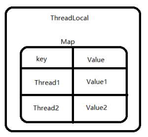
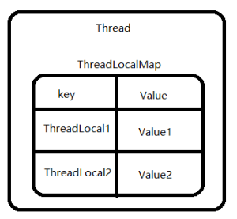
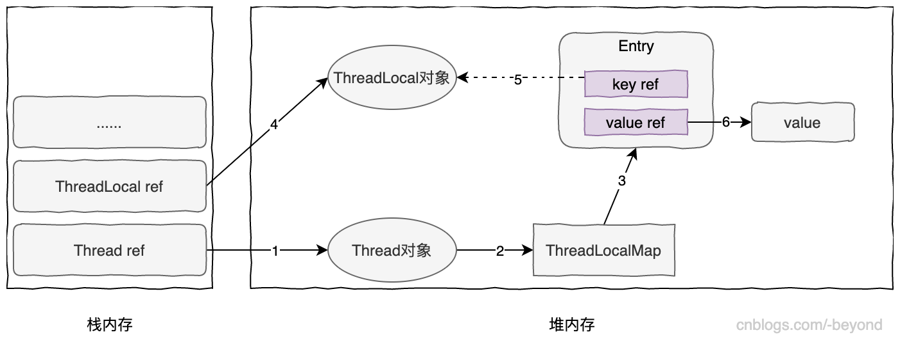

## 前言

大家好，这是我初次在团队中做技术分享，内容可能有所欠缺，欢迎大家及时纠正和补充。

本次分享的主题是 ThreadLocal，我会从开发应用的层面来介绍，主要分为下面几部分：

- ThreadLocal 的介绍

- ThreadLocal 的简单使用

- ThreadLocal 的设计考量

- ThreadLocal 使用注意事项

- 场景的应用场景

  

## 一、ThreadLocal是什么

多线程同时读写同一个共享变量的时候会发生线程安全问题。我们可以通过加锁的方式来控制多个线程轮流去访问共享变量。还可以在共享变量上寻找突破口。每个线程都拥有自己的变量，彼此之间不共享，没有共享变量自然也不会有线程安全问题。

线程本地存储（ThreadLocal） 就是出于这个原因而被设计出来的。被 ThreadLocal 修饰的变量，我们可以称其为 线程本地变量。

它与全局变量的区别在于 ，每个使用该变量的线程都会为其创建一份完全独立的实例副本。

它与局部变量也很相似。方法执行结束时，方法中的局部变量随着栈帧的出栈一同销毁，线程结束时，线程所使用的所有ThreadLocal 实例副本都可以被回收。两者本质上都是通过避免共享来规避并发问题，但局部变量是方法层面，ThreadLocal 是在线程层面。

总体来说，ThreadLocal 解决了 **线程需要拥有自己独立的变量，且变量在线程间相互隔离，但在线程内的方法或类之间共享**  的问题。

## 二、ThreadLocal 的使用示例

```java
	/** 局部变量 **/
    static String memberVar = "old memberVar";
    /** 线程本地变量 **/
    static ThreadLocal<String> threadLocalVar = ThreadLocal.withInitial(() -> "old threadLocalVar");

    /**
     * 普通局部变量与ThreadLocal变量的区别
     *
     * @throws InterruptedException
     */
    @Test
    public void test() throws InterruptedException {
        Thread thread1 = new Thread(() -> {
            System.out.println(Thread.currentThread().getName()+" 修改前"+" : "+memberVar);
            System.out.println(Thread.currentThread().getName()+" 修改前"+" : "+threadLocalVar.get());
            memberVar = "new memberVar";
            threadLocalVar.set("new threadLocalVar");
            System.out.println(Thread.currentThread().getName()+" 修改后"+" : "+memberVar);
            System.out.println(Thread.currentThread().getName()+" 修改后"+" : "+threadLocalVar.get());
        }, "thread1");
        
        thread1.start();
        thread1.join();
        
        Thread thread2 = new Thread(() -> {
            System.out.println(Thread.currentThread().getName()+" : "+memberVar);
            System.out.println(Thread.currentThread().getName()+" : "+threadLocalVar.get());
        }, "thread2");
        
        thread2.start();
        thread2.join();
    }


/* Output
thread1 修改前 : old memberVar
thread1 修改前 : old threadLocalVar
thread1 修改后 : new memberVar
thread1 修改后 : new threadLocalVar
thread2 : new memberVar
thread2 : old threadLocalVar
*/

```

## 三、ThreadLocal 的原理

### 3.1  尝试自己实现 ThreadLocal 

我们已经了解 ThreadLocal 的功能，如果是让我们自己来设计这个类，该如何去做。

ThreadLocal 的目标很简单，**就是针对同一个变量，让不同的线程拥有不同的变量。**最先容易想到的是借助Map，它的key是线程，它的Value就是每个线程拥有的变量，这个 Map 定义在ThreadLocal 类就可以了，实现出来大概是这样的。



简单的实现如下：

```java
class MyThreadLocal<T> {
    // 考虑到多线程并发的情况
	Map<Thread, T> locals = new ConcurrentHashMap<>();
	// 获取线程变量
	T get() {
		return locals.get(Thread.currentThread());
	}	
	// 设置线程变量
	void set(T t) {
	locals.put(Thread.currentThread(), t);
	}
}
```

看起来很容易实现，但这种实现方式中存在很多问题，比如 **容易产生内存泄漏**。这里简单提一下内存泄漏。

> 假如一个短生命周期的对象被一个长生命周期对象长期持有引用，将会导致该短生命周期对象使用完之后得不到释放，从而导致内存越用越少。
>
> 有个比较形象的例子来描述 内存溢出 和 内存泄漏。
>
> 内存溢出：有个水池（运行内存），不停的往里边注水（对象），最后水溢出了。
>
> 内存泄漏：还是那个水池（运行内存），不停的往里边注入混有泥沙的水（对象），使用结束后池里的水放掉了（GC），但是泥沙还在，最后水池可注入的水越来越少。

在我们实现的方式中，ThreadLocal持有的Map会持有Thread对象的引用，这就意味着，只要ThreadLocal对象存在，那么Map中的Thread对象就永远不会被回收。ThreadLocal的生命周期往往都比线程要长，所以这种设计方案很容易导致内存泄露。

还有就是多线程操作的 **线程安全问题**，虽然我们我们使用了 ConcurrentHashMap，但势必会影响到它的性能。

接下来我们来看看 JDK 是如何实现 ThreadLocal 的。

### 3.2  JDK 中 ThreadLocal 的实现 

JDK8 中 ThreadLocal 实现时，也用到了一个Map，叫做 ThreadLocalMap。不过持有这个Map的类不是ThreadLocal，而是 Thread。这个是和我们的实现中的一个差一点。Thread 类中 有一个成员变量 threadLocals，其类型就是ThreadLocalMap，这个Map是定义在 ThreadLocal类中的一个静态内部类。ThreadLocalMap 的 Key 就是 ThreadLocal。



精简之后的JDK代码：

```java
class Thread {
    // 内部持有ThreadLocalMap
    ThreadLocal.ThreadLocalMap threadLocals;
}

class ThreadLocal<T>{
	public T get() {
	// ⾸先获取线程持有的ThreadLocalMap
	ThreadLocalMap map =Thread.currentThread().threadLocals;
	// 在ThreadLocalMap中查找变量
	Entry e =map.getEntry(this);
	return e.value;
	}
    
	static class ThreadLocalMap{
        // 内部是数组
        Entry[] table;
        // 根据ThreadLocal查找Entry
        Entry getEntry(ThreadLocal key){
            //省略查找逻辑
        }
        // Entry定义
        // key使用了弱引用，value使用了强引用
    	static class Entry extends WeakReference<ThreadLocal>{
            Object value;
            Entry(ThreadLocal<?> k, Object v) {
                    super(k);
                    value = v;
			}
		}
	}
}
```

Java 的实现方式和我们的方式，最大的区别是 **Map的归属问题**，由于ThreadLocal仅仅是一个代理工具类，其内部并不应该持有任何和现场相关的数据，因此将所有和线程相关的数据都存储在Thread里面，这样不仅容易理解，而且 **还不容易产生内存泄漏**。所以应该由 Thread 类持有 ThreadLocalMap。

结合网上的一张 ThreadLocal 内存图看一下。




**为什么ThreadLocalMap使用弱引用存储ThreadLocal？**

ThreadLocalMap 里对 ThreadLocal 的引用还是弱引用（WeakReference），只要Thread对象可以被回收，那ThreadLocalMap 就能被回收。对应的 ThreadLocal 也可以被回收。假如使用强引用，当ThreadLocal不再使用需要回收时，发现某个线程中ThreadLocalMap存在该ThreadLocal的强引用，无法回收，造成内存泄漏。

> **弱引用**
>
> Java 语言中为对象的引用分为了四个级别，分别为 强引用 、软引用、弱引用、虚引用。
>
> 弱引用具体指的是java.lang.ref.WeakReference类。
>
> 指向对象的弱引用不会影响垃圾回收器回收该对象，即如果一个对象只有弱引用存在了，则下次GC将会回收掉该对象（不管当前内存空间足够与否）。

**使用弱引用存储 ThreadLocal 后还会不会发生内存泄漏？**

会的。

ThreadLocalMap 中的Entry对象，虽然 Key(ThreadLocal) 是通过弱引用引入的，但是value即变量值本身是通过强引用引入。

这就导致，假如不作任何处理，由于ThreadLocalMap和线程的生命周期是一致的，当线程资源长期不释放，即使ThreadLocal本身由于弱引用机制已经回收掉了，但 Entry 中的 value 却是被 Entry 强引用的，所以即便 value的生命周期结束了，value 也是无法被回收的。即存在 key 为 null，但 value 却有值的无效Entry。导致内存泄漏。

实际上，ThreadLocal内部已经为我们做了一定的防止内存泄漏的工作，

在每次调用ThreadLocal的get、set、remove方法时都会执行`expungeStaleEntry()`方法，来进行key为null的Entry的清理工作，该方法的具体操作是擦除某个下标的Entry（置为null，可以回收），同时检测整个Entry[]中对key为null的Entry一并擦除，重新调整索引。

但是该工作是有触发条件的，需要调用相应方法，如果我们使用完之后不做任何处理是不会触发的。

## 四、使用注意事项

### 4.1 ThreadLocal 是否使用 static 修饰

ThreadLocal一般会采用 static 修饰。这样做既有好处，也有坏处。

好处是它一定程度上可以避免错误，至少它可以避免重复创建TSO（Thread Specific Object，即ThreadLocal 所关联的对象）所导致的浪费。一个 ThreadLocal 实例对应当前线程中的一个TSO实例。因此，如果把 ThreadLocal 声明为某个类的成员变量，而不是静态变量。则每次其所在类实例化时，都会有 ThreadLocal 创建，同一个线程可能会访问到同一个类的不同 ThreadLocal 实例，这即便不会导致错误，也会导致浪费。因此，一般我们将 ThreadLocal 使用static修饰。

坏处是这样做可能正好形成内存泄漏所需的条件。因为静态变量的生命周期和类的生命周期是一致的，而类的卸载时机可以说比较苛刻，这会导致静态 hreadLocal 无法被垃圾回收，容易出现内存泄漏。

### 4.2  ThreadLocal 的内存泄漏

前面我们提到 ThreadLocal 存在内存泄漏问题，这个在搭配使用线程池的时候更容易出现。

线程池是为了避免重复创建线程所带来的性能消耗，因此线程池中的线程存活时间会很长，往往是和程序同生共死的，这就意味着 Thread 持有的 ThreadLocalMap 一直都不会被回收，再加上 ThreadLocalMap 中的无效Entry（key为null，value不为null），所以更容易导致内存泄漏问题。

避免这个问题也很简单，ThreadLocal 已经为我们提供了一种选择。 

**在代码逻辑中使用ThreadLocal前后，显式调用remove方法，及时清理，一方面防止内存泄漏，另一方面及时清除旧值，避免因使用了上次未清除的值而产生业务问题**

示例如下：

```java
ExecutorService es;
ThreadLocal tl;
es.execute(()->{
	//ThreadLocal增加变量
	tl.set(obj);
	try {
	// 省略业务逻辑代码
	}finally {
	//⼿动清理ThreadLocal
	tl.remove();
	}
});
```

## 五、常见的应用场景

2. 保证 SimpleDateFormat 的线程安全，

   因为SimpleDateFormat 在解析和格式化日期时，其中会涉及到非原子性操作，因此在并发时，可能导致程序抛出异常。

2. Spring事务管理保存事务信息

   Spring事务管理的底层实现就用到了 ThreadLocal 来绑定 connection 到当前线程，便于后续通过 connection 来执行事务的提交或回滚，以及归还连接到连接池。

3. web 中保存 Session 信息

   对于 Java Web 应用而言，Session 保存了很多信息，经常需要获取和修改 Session 信息。一方面需要保证**每个线程有自己单独的 Session 实例**。另一方面，由于很多地方都需要操作 Session，存在**多方法共享 Session** 的需求，这里就很适合使用 ThreadLocal，轻松的保证了每个线程拥有自己独立的实例，且可以随时访问。

4. 数据库的连接池
## 六、InheritableThreadLocal

通过ThreadLocal创建的线程变量，其子线程是无法继承的。也就是说你在线程中通过 ThreadLocal 创建了线程本地变量，而后该线程创建了子线程，子线程中是无法通过 ThreadLocal 来访问父线程的线程变量的。

如果你需要子线程继承父线程的线程变量，可以使用 InheritableThreadLocal 来支持这种特性，InheritableThreadLocal是ThreadLocal子类，所以用法和
ThreadLocal相同，原理是在创建子线程时将父线程中 InheritableThreadLocal 中的 ThreadLocalMap 拷贝到了子线程。

## 七、TransmittableThreadLocal

TransmittableThreadLocal 是 阿里开源，针对 非父子线程传递 ThreadLocal 变量的解决方案。可以看作是 InheritableThreadLocal 的增强版。

## 八、自己实现TTL

实现思路：在 Runnable 任务提交到线程池之前，由当前线程对任务进行封装，这样就有机会获取当前线程中的 ThreadLocal 变量集合，将获取的 ThreadLocal 集合和 原本的任务封装成一个新的任务，这个新任务就像一个代理，而被代理对象就是原本的任务。所以它的 run 方法里还是要去调用原本任务的 run 方法，不过在调用之前可以将提交线程传入的 ThreadLocal 变量重新设置在当前执行线程中。

简单的代码示例：

```java
public class MThreadLocalDemo {
    public static void main(String[] args) throws InterruptedException {
        MThreadLocal<Integer> mThreadLocal = new MThreadLocal<>();
        mThreadLocal.set(1);
        MThreadLocal<String> mThreadLocal2 = new MThreadLocal<>();
        mThreadLocal2.set("abc");
        new Thread(MRunnable.get(() -> {
            System.out.println(mThreadLocal.get());
            System.out.println(mThreadLocal2.get());
        })).start();
    }
}

class MThreadLocal<T> extends ThreadLocal<T> {
    public static Set<ThreadLocal<Object>> keys = new HashSet<>();

    @Override
    @SuppressWarnings("unchecked")
    public void set(T value) {
        super.set(value);
        keys.add((ThreadLocal<Object>) this);
    }

    public static SnapShot copy() {
        HashMap<ThreadLocal<Object>, Object> hashMap = new HashMap<>();
        for (ThreadLocal<Object> key : keys) {
            hashMap.put(key, key.get());
        }
        return new SnapShot(hashMap);
    }

    public static void replay(SnapShot snapShot) {
        HashMap<ThreadLocal<Object>, Object> hashMap = snapShot.threadLocalValueMap;
        hashMap.forEach(ThreadLocal::set);
    }

    public static class SnapShot {
        private final HashMap<ThreadLocal<Object>, Object> threadLocalValueMap;

        public SnapShot(HashMap<ThreadLocal<Object>, Object> threadLocalValueMap) {
            this.threadLocalValueMap = threadLocalValueMap;
        }
    }
}


class MRunnable implements Runnable {
    private Runnable runnable;
    private MThreadLocal.SnapShot snapShot;

    @Override
    public void run() {
        MThreadLocal.replay(snapShot);
        runnable.run();
    }

    public static MRunnable get(Runnable runnable) {
        MRunnable mRunnable = new MRunnable();
        MThreadLocal.SnapShot snapShot = MThreadLocal.copy();
        mRunnable.runnable = runnable;
        mRunnable.snapShot = snapShot;
        return mRunnable;
    }
}
```

## 九、最后

由于项目和时间的缘故，本次分享就到此为止。感谢大家的参与，也感谢 @永恺 给我的这次分享机会。

ThreadLocal 中还有很多设计巧妙的地方，例如：

- ThreadLocalMap 是如何使用`HASH_INCREMENT = 0x61c88647`（斐波那契数）来使 hash值 分布非常均匀。
- 以及在发生Hash冲突时，ThreadLocalMap 并没有采用像HashMap 的拉链法来解决 key值重复的问题，而是通过 开放地址法来解决。
- 还有我们之前提到的 `expungeStaleEntry ()` 方法清理过期 key 的流程。

如果大家感兴趣，文末有相关文章的链接。

# 感谢阅读！！

## Reference

- https://www.zhihu.com/question/35250439
- http://www.jasongj.com/java/threadlocal/
- https://www.cnblogs.com/-beyond/p/13093032.html
- https://segmentfault.com/a/1190000022663697