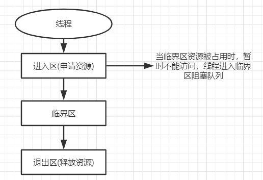

**前言**： 

上一篇中我们了解到进程和线程的区别，以及使用多线程的优缺点，本篇主要讲在Java中是如何去创建一个线程，以及线程的生命周期。

[TOC]


**面试问题**

Q ：线程的实现方式?  
Q ：start()和run()的区别?
Q ：线程的生命周期和状态?  


## 1.如何创建一个线程

### 1.1实现Runnable接口
&emsp;&emsp;实现Runnable接口，重写run方法。  
&emsp;&emsp;Runnable的意思是“任务”，是通过实现Runnable接口，定义一个子任务，交由Thread对象执行，然后通过调用Thread的start方法来创建一个新线程来执行该任务，具体的执行内容定义在run方法中。但如果直接调用run方法，则会被当作当前线程的一次普通方法调用，不会创建一个新线程。 
```java
    public class MyThread implements Runnable {
        public void run() {
            System.out.println("MyThread");
        }
        
        public static void main(String[] args){
            new MyThread().start();
        }
    }
```

### 1.2继承Thread类
&emsp;&emsp;继承Thread类，重写run方法，run方法中定义这个线程要执行的任务。  
&emsp;&emsp;Thread是java中的线程类，通过new Thread()可以创建一个线程对象，JVM会根据这个线程对象来创建一个操作系统层面的线程,而这个线程要做的事也就是run方法中的内容.Thread类实现了Runnable接口，我们通过继承Thread类创建线程，这种方式相当于对实现Runnable接口的方式做了一个简化，不需要通过单独创建Thread对象来执行任务，因为自身就是一个Thread对象，重写的run方法中定义了要执行的任务内容，可以直接调用自身的start方法，开启一个新线程执行该任务。不足在于java是单继承的，如果还需要继承其他类，则只能选择Runnable接口。  
```java
    public class MyThread extends Thread {
        public void run() {
            System.out.println("MyThread");
        }
        
        public static void main(String[] args){
             new MyThread().start();
        }
    }
```

17. Runnable与Callable<V>的区别
    Runable 没有返回值，不能抛异常，而Callable<V> 可以,若抛异常 则Future的get方法就什么也取不到了


### 1.3实现Callable接口
&emsp;&emsp;实现Callable接口，重写call方法，在泛型中定义返回值类型。  
&emsp;&emsp;Runnable的执行是没有返回值的，Callable可以返回执行结果。通过FutureTask类来封装一个有返回值的任务，将任务交由Thread类执行，最后通过FutureTask拿到执行结果。FutureTask实现了RunnableFuture接口，RunnableFuture分别实现了Runnable和Future接口。Runnable接口提供了run方法，使其可以交由线程来执行，Future接口提供get方法，使其可以拿到返回值。  
```java
    public class MyThread implements Callable<String> {
        public String call() throws Exception {
            return "Callable";
        }
        
        public static void main(String[] args){
            FutureTask<String> task = new FutureTask<>(new MyThread()));
            new Thread(task).start();
            System.out.println(task.get());
        }
    }
```
**Future模式**

&emsp;&emsp;我们了解了FutureTask接口的继承结构，知道它有什么功能，但具体是如何实现的呢。  
&emsp;&emsp;下面简单的模拟一下Callable的实现原理，只模拟Future接口get方法的实现，用FutureData
来模拟FutureTask类。  
```java
        public interface MyFuture{
            String get();
        }

        public class FutureData implements Runnable, MyFuture {
            Callable<String> callable;
            private String result;

            public FutureData(Callable callable) {
                this.callable = callable;
            }

            public String get() {
                return result;
            }

            public void run() {
                try {
                    result = callable.call();
                } catch (Exception e) {
                    result = null;
                }
            }
        }

        public class MyThread implements Callable<String> {
            public String call() {
                return Thread.currentThread().getName() + " call()";
            }

            public static void main(String[] args) throws ExecutionException, InterruptedException {
                FutureTask<String> task = new FutureTask<>(new MyThread());
                new Thread(task).start();
                TimeUnit.MILLISECONDS.sleep(100);
                System.out.println(task.get());

                FutureData data = new FutureData(new MyThread());
                new Thread(data).start();
                TimeUnit.MILLISECONDS.sleep(100);
                System.out.println(data.get());
            }
        }

        //Output
        // Thread-0 call()
        // Thread-1 call()
```
&emsp;&emsp;通过上面的例子可以看出，FutureData内部有两个字段，Callable用来接收你定义的任务；result用来存放任务的返回值。start（）后会单独开辟一个线程执行任务，在这个过程中并不影响主线程的工作，上一篇中提到了多线程的优势之一的异步化事件处理，程序响应更快。在这种模式就有所体现。在任务执行完成后，把返回值存放在reslut中，等待被其他线程取出，如果其他线程在任务还没执行的时候就调用get方法去拿result中的值，只能拿到null，这样就有个一问题，到底是任务执行结果为null还是任务没开始执行。在FutureTask中是通过设置一个标志位来判断任务当前的状态，如果任务还没执行或者没执行完成，那么get（）方法将会被阻塞，直至任务执行完成。


### 1.4对创建线程的一些个人理解
&emsp;&emsp;个人觉得创建线程只有new Thread（）这种方式，定义任务有Runnable接口和Callable接口两种方式，继承Thread类间接实现Runnable接口和直接实现Runnable接口，都是为了重写run方法，这个方法中定义的是线程需要执行的内容，更像是一个任务，如果将接口名改为Task接口也许更好些，run方法没有返回值，我们可以通过实现Callable的call方法来定义一个有返回值的任务。


## 2.线程的生命周期和状态
&emsp;&emsp;Java中线程的状态和操作系统中的状态有所出入。以下为Java中线程的各个状态，是虚拟机层面上暴露给我们的状态，这些状态是由枚举类Thread.State中明确定义的，


- 初始状态：当线程被创建且还没有调用start（）方法时,它会处于这种状态。此时它已经分配了必需的系统资源,并执行了初始化。线程当前还没有资格获取CPU的时间片。
```java
        Thread thread = new Thread("MyThread");
        System.out.println(thread.getName()+"当前状态："+thread.getState());
        
        //Output
        // MyThread当前状态：NEW
```

- 运行状态：在初始状态下调用start（）方法会进入当前状态，线程已经有资格获得CPU时间片了，在这种状态下，只要调度器把时间片分配给线程，线程就可以运行，处于运行中状态；如果没有拿到，只能等待获取时间片，此时线程处于就绪状态，统称为运行状态。
  
  > 只有在运行状态下才会分配时间片。
```java
        Thread thread = new Thread("MyThread");
        thread.start();
        System.out.println(thread.getName()+"当前状态："+thread.getState());
                
        //Output
        // MyThread当前状态：RUNNABLE

```
- 阻塞状态：线程本来能够运行，但由于等待获取某个锁而阻止它的运行。当线程处于阻塞状态时，调度器将忽略线程，不会分配给线程任何CPU时间。直到线程重新进入了就绪状态,它才有可能执行操作。
```java
        Object lock = new Object();
        Thread thread = new Thread("MyThread") {
            public void run() {
                synchronized (lock) {
                    while (true) {}
                }
            }
        };

        Thread thread2 = new Thread("MyThread2") {
            public void run() {
                synchronized (lock) {
                    while (true) {}
                }
            }
        };
        thread.start();
        thread2.start();
        Thread.sleep(100);
        System.out.println(thread.getName() + "当前状态：" + thread.getState());
        System.out.println(thread2.getName() + "当前状态：" + thread2.getState());

        //Output
        // MyThread当前状态：RUNNABLE
        // MyThread2当前状态：BLOCKED

```
- 等待状态：线程进入等待状态后不会被分到时间片，无法继续执行，而且必须要其他线程进行操作才能被唤醒。
```java
        Thread thread = new Thread("MyThread") {
            public void run() {
                synchronized (this) {
                    try {
                        wait();
                    } catch (InterruptedException e) {
                        e.printStackTrace();
                    }
                }
            }
        };
        thread.start();
        Thread.sleep(100);
        System.out.println(thread.getName() + "当前状态：" + thread.getState());

        //Output
        // MyThread当前状态：WAITING
```
- 超时等待状态：和等待状态类似，区别在于这个状态会待一段时间，时间到了线程可以将自己唤醒。
```java
        Thread thread = new Thread("MyThread") {
            public void run() {
                synchronized (this) {
                    try {
                        wait(1000);
                    } catch (InterruptedException e) {
                        e.printStackTrace();
                    }
                }
            }
        };
        thread.start();
        Thread.sleep(100);
        System.out.println(thread.getName() + "当前状态：" + thread.getState());

        //Output
        // MyThread当前状态：TIMED_WAITING
```

- 终止状态：终止状态的线程将不再是可调度的,再也不会得到CPU时间,它的任务已结束。任务终止通常是run()方法执行完成，或者程序抛出异常。
```java
        Thread thread = new Thread("MyThread") {
            public void run() {
                System.out.println((Thread.currentThread().getName() + " 执行完毕"));
            }
        };
        Thread thread2 = new Thread("MyThread2") {
            public void run() {
                throw new RuntimeException("程序执行出错了");
            }
        };
        thread.start();
        thread2.start();
        thread.join();
        thread2.join();
        System.out.println(thread.getName() + "当前状态：" + thread.getState());
        System.out.println(thread2.getName() + "当前状态：" + thread2.getState());

        //Output
        // MyThread 执行完毕
        // Exception in thread "MyThread2" java.lang.RuntimeException: 程序执行出错了
        // 	 at tmp.NewThreadTest$4.run(NewThreadTest.java:47)
        // MyThread当前状态：TERMINATED
        // MyThread2当前状态：TERMINATED
```

**临界区**

&emsp;&emsp;临界区用来表示一种公共资源或者说是共享数据，可以被多个线程使用，但是每次只能一个线程使用它，一旦临界区资源被占用，其他线程想要使用这个资源，就必须等待。



**阻塞(Blocking)和非阻塞(Non-Blocking)**

https://blog.csdn.net/historyasamirror/article/details/5778378  

&emsp;&emsp;阻塞非阻塞是关于线程与进程的。
&emsp;&emsp;阻塞是指调用线程或者进程被操作系统挂起。非阻塞是指调用线程或者进程不会被操作系统挂起。

&emsp;&emsp;阻塞和非阻塞通常用来形容多线程间的相互影响，比如一个线程占用了临界区资源，那么其他所有需要这个资源的线程就必须在这个临界区外进行等待，等待会导致线程挂起。这种情况就是阻塞。此时，如果占用资源的线程一直不愿意释放资源，那么其他所有阻塞在这个临界区上的线程都不能工作。  


## Reference
&emsp;&emsp;《Java 并发编程实战》  
&emsp;&emsp;《Java 编程思想(第4版)》  
&emsp;&emsp;https://blog.csdn.net/justloveyou_/article/details/54347954 
&emsp;&emsp;https://snailclimb.gitee.io/javaguide/#/

**感谢阅读！**

**若想有所改变，必须做出舍弃。** 