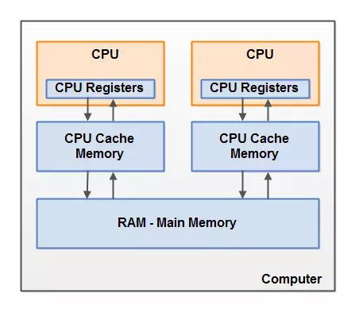
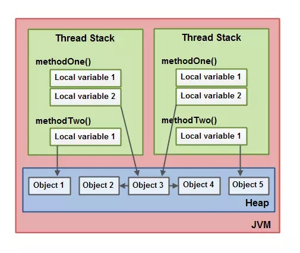
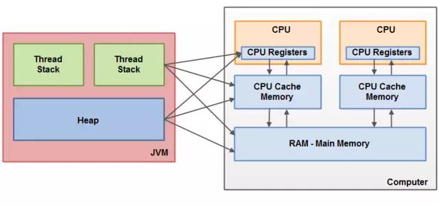
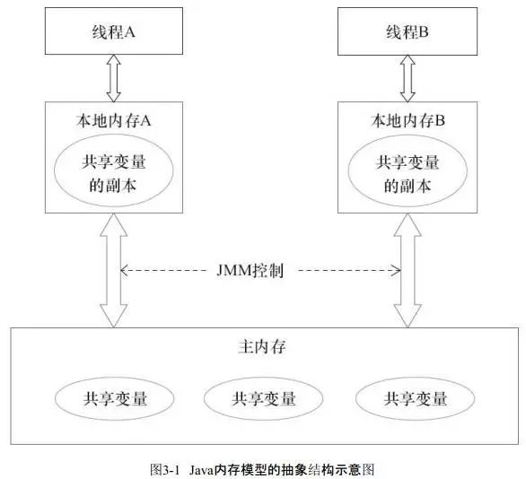
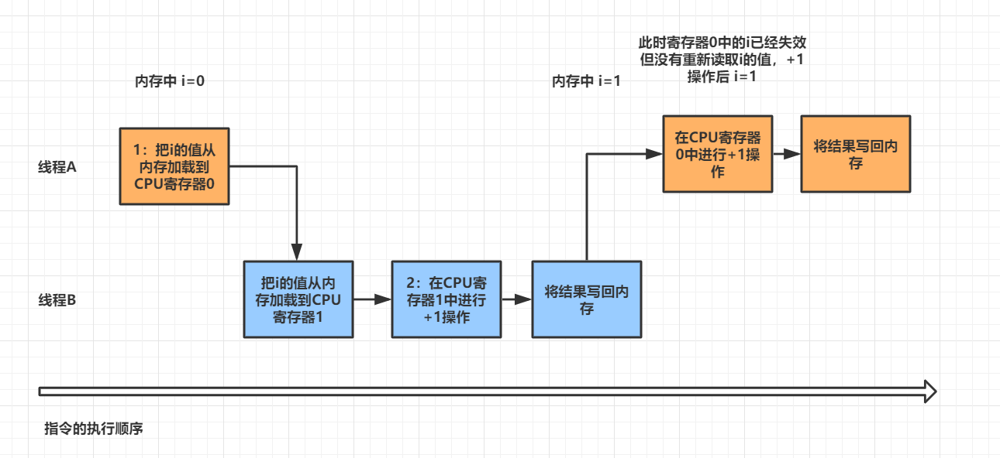
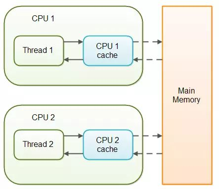
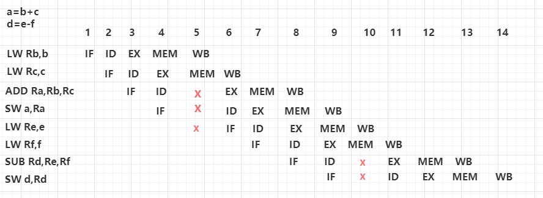
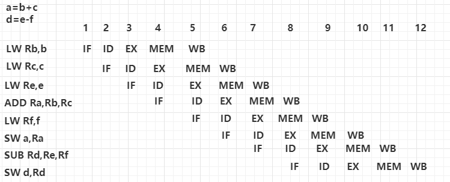
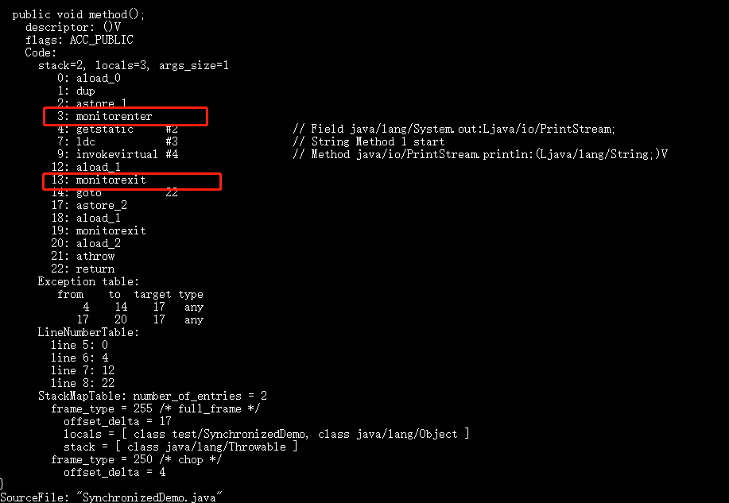

**前言**： 
在[线程和进程]()一篇中提到了多线程带来的风险，本篇将阐述风险之一的数据安全性问题是如何产生的，以及解决办法，开篇会介绍硬件中的内存架构以便更好的理解Java内存模型。

[TOC]

**面试问题**
Q ：谈谈Java内存模型？
Q ：volatile是如何保证可见性？
Q ：synchronized和volatile的区别？

## 1.硬件内存架构、Java内存结构和Java内存模型

### 1.1 硬件内存架构



CPU <=> 寄存器 <=> 缓存 <=> 主内存

**CPU寄存器**：寄存器是CPU的组成部分，也是CPU运算时取指令和数据的地方，寄存器是有限存贮容量的高速存贮部件。CPU访问寄存器的速度远远大于主内存。

> 每个CPU都包含一系列的寄存器，包含的寄存器有指令寄存器(IR)和程序计数器(PC)。在中央处理器的算术及逻辑部件中，包含的寄存器有累加器(ACC)。

**高速缓存Cache**：高速缓存Cache位于CPU与主内存间的一种容量较小但速度很高的存储器。由于CPU与主内存的运算速度之间有着几个数量级的差距，所以加入读写速度尽可能接近处理器运算速度的高速缓存来作为内存与处理器之间的缓冲。将运算需要使用到的数据复制到缓存中，让运算能快速进行。当运算结束后再从缓存同步回内存之中，这样处理器就无须等待缓慢的内存读写了。
&emsp;&emsp;每个CPU可以有多个CPU缓存层。在某一时刻，一个或者多个缓存行（cache lines）可能被读到缓存，一个或者多个缓存行可能再被刷新回主存。

**主内存**：所有的CPU都可以访问主存。主存通常比CPU中的缓存大得多。用于存放数据的单元，以及与硬盘等外部存储器交换的数据。

**运作原理**：通常情况下，当一个CPU需要读取主存时，它会将主存的部分读到CPU缓存中。它甚至可能将缓存中的部分内容读到它的内部寄存器中，然后在寄存器中执行操作。当CPU需要将结果写回到主存中去时，它会将内部寄存器的值刷新到缓存中，然后在某个时间点将值刷新回主存，在刷回主存前缓存的值将对其他CPU不可见。


### 1.2 Java内存结构
&emsp;&emsp;注意这里说的是Java内存结构，而不是Java内存模型，这两个是不同的概念，Java内存结构指的是JVM的内存分区，Java内存模型则为了解决多线程对共享数据访问而建立的抽象模型。


- 存储基本类型的本地变量会被保存在线程栈中。
- 存储一个堆中对象地址的本地变量，这个本地变量（也叫做对象的引用）存放在线程栈中。
- 存储在堆中的对象，其方法中的本地变量也存放在线程栈中。但是对象中的成员变量跟着对象自身存放在堆中，无论该成员变量是基础类型还是引用类型。
- 静态成员变量跟随着类定义一起也存放在堆上。
- 存放在堆上的对象可以通过指向这个对象的引用来访问。

### 1.3 Java内存模型
**Java内存模型简介**
&emsp;&emsp;Java内存模型(Java Memory Model)是通过各种操作来定义的，包括对变量的读/写操作，监视器的加锁和释放操作，以及线程的启动和合并操作。JMM是和多线程相关的，JMM为程序中所有的操作定义了一个偏序关系，称为Happens-Before。要想保证执行操作B的线程看到操作A的结果，无论A和B是否在同一个线程中执行，那么A和B之间必须满足Happens-Before关系。如果两个操作之间缺乏Happens-Before关系，那么JVM可以对它们任意的排序。

&emsp;&emsp;简单来说，Java的多线程之间是通过共享内存进行通信的，而由于采用共享内存进行通信，在通信过程中会存在一系列如可见性、原子性、顺序性等问题，而JMM就是围绕着多线程通信以及与其相关的一系列特性而建立的模型。JMM定义了一些语法集和规则(Happens-Before)，这些语法集映射到Java语言中就是volatile、synchronized等关键字，而这些关键字使用JMM定义的规则来保障共享数据的正确访问。

**Java内存结构和硬件内存架构之间的桥接**
&emsp;&emsp;Java内存结构与硬件内存架构之间存在一定的差异。硬件内存架构没有区分线程栈和堆。对于硬件，所有的线程栈和堆都分布在主内存中。部分线程栈和堆可能有时候会出现在CPU缓存中和CPU内部的寄存器中。如下图所示：


JMM定义了线程和主内存之间的抽象关系：


- 线程之间的共享变量存储在主内存（Main Memory）。
- 每个线程都有一个私有的本地内存（Local Memory），本地内存是JMM的一个抽象概念，并不真实存在，它涵盖了缓存、写缓冲区、寄存器以及其他的硬件和编译器优化。本地内存中存储了该线程以读/写共享变量的拷贝副本。
从更低的层次来说，主内存就是硬件的内存，而为了获取更好的运行速度，虚拟机及硬件系统可能会让工作内存优先存储于寄存器和高速缓存中。
- Java内存模型中线程的工作内存（working memory）是cpu的寄存器和高速缓存的抽象描述。而Java内存结构(JVM的内存分区)只是一种对内存的物理划分，而且只局限在JVM的内存。


## 2.线程安全问题的源头
### 2.1 原子性问题
&emsp;&emsp;我们知道线程在分配到CPU时间片后才能继续执行，这种分时复用CPU的方式，使得程序中一个线程在等待 I/O 操作结束的时侯，另一个线程可以继续运行。当然更多的时候可能是多个线程交替执行。交替的时机大多是在时间片结束，交替前CPU会执行完当前的CPU指令，注意，这里是CPU指令，并不是Java中的一条语句，高级语言中的一条语句往往需要多条CPU指令完成，例如i++，至少需要三条CPU指令：

- 指令1：把i的值从内存加载到CPU寄存器；
- 指令2：在CPU寄存器中进行+1操作；
- 指令3：将结果写回内存；

&emsp;&emsp;原子性的特点是不可分割，但上面的每一条指令结束都有可能发生线程切换，如果在指令1结束后线程切换，新线程修改了内存中i的值，随后切回当前线程继续执行指令2，这三条指令的执行就被其他线程分割，因此i++操作不具有原子性。还需要注意的是CPU能保证的原子性是CPU指令级别的，而不是高级语言的一条执行语句。大部分情况下我们要保证的原子性是高级语言层面的。
&emsp;&emsp;接下来用一个示例展示原子性问题，两个线程对同一个变量 i 执行i++操作：

&emsp;&emsp;执行两次i++，应该是2，但结果却是1。

&emsp;&emsp;i++操作的CPU指令，是一个“读取-修改-写入”的操作序列，它的结果依赖于之前读取的状态，由于不具备原子性，导致读取的状态可能失效，基于一个失效的状态产生的结果必然是不正确的。这种由于不恰当的执行时序而出现的不正确结果的情况被称为**竟态条件**（Race Condition），还用一种常见的竟态条件类型：“先检查后执行”。

**非原子的64位操作**
&emsp;&emsp;Java内存模型要求，变量的读取和写入都必须是原子操作。
&emsp;&emsp;对于非volatile类型的64位数值变量double和long，32位操作系统中的JVM允许将64位的操作分解为32位的操作，如果对该变量的读操作和写操作在不同线程执行，可能读到某个值的高32位和另一个值的低32位，因此多线程中使用共享且可变的long和double的变量也是不安全的，除非用volatile声明他们，或者加锁synchronized。


### 2.2 可见性问题
&emsp;&emsp;**可见性**：线程对共享变量修改的可见性。当一个线程修改了共享变量的值，其他线程能够立刻得知这个修改。
在单核CPU的多个线程，共同操作同一个CPU缓存（高速缓存cache），一个线程对缓存的写，对另外一个线程一定可见。
在多核CPU的多线程环境下，每个CPU都有自己的CPU缓存。CPU缓存不会与内存实时同步，Thread1对CPU1cache的操作，Thread2对CPU2cache操作，所以两个线程之间的操作对彼此是不可见的。这也是前边示例结果不正确的原因之一。

可见性问题不仅会发生在CPU缓存上，还会发生在虚拟机层面。  


### 2.3 有序性问题
&emsp;&emsp;近些年计算机性能的提升原因除了时钟频率的提高，其他很大程度上归功于指令重排序措施，在编译器中生成的指令顺序，可以与源代码中的顺序不同。

**指令重排序**
&emsp;&emsp;一行高级语言的语句可以拆分为多个指令，而一个指令还可以拆分为多个小步骤。可以简化为 IF ID EX MEM WB 。 
- **IF**：取指令阶段是将一条指令从主存中取到指令寄存器的过程。
- **ID**：取出指令后，计算机立即进入指令译码阶段。指令译码器对取回的指令进行拆分和解释。
- **EX**：在取指令和指令译码阶段之后，接着进入执行指令阶段。完成指令所规定的各种操作，此时CPU的不同部分被连接起来，输入端提供需要相加的数值，而输出端将含有最后的运算结果。
- **MEM**：可能要访问主存读取操作数，该阶段会根据指令地址码，得到操作数在主存中的地址，并从主存中读取该操作数用于运算。
- **WB**：结果写回阶段把执行指令阶段的运行结果数据写回，可能会写到CPU内部寄存器中，或者主存。

&emsp;&emsp;上面的每个步骤都会有对应的部件,这些部件相当于流水线上的工人，IF一直在取指，ID一直在译码，有的部件有时候可能无法跟上前边的速度，下图中，如果执行“ADD Ra,Rb,Rc” 指令时，上一条指令的MEM步骤还没有返回，所以当前指令的EX步骤无法继续执行，存在一个“空档期”(红色的X)，直到前一个MEM步骤完成时当前的EX步骤才会继续执行，CPU执行完这两条语句需要14个机器周期。其中2个机器周期是由于“空档期”所导致的，不要小看它，量变引起质变，优化这个“空档期”问题，会使CPU有极大的性能提升。

&emsp;&emsp;接下来该指令重排序登场了，指令重排是改变指令的的执行顺序，来填补这些“空档期”，但是指令重排不能改变程序语义的串行性，也就是说有A依赖B的结果，那么A不会被排在B前边，示例中变量间没有依赖性，因此允许编译器和CPU进行任意的指令重排，重排序过程不会影响到单线程程序的执行，却会影响到多线程并发执行的正确性，因为多线程之间的变量依赖关系编译器和CPU是不知道的。
&emsp;&emsp;下面为重排序后的指令执行顺序，将“LW Re,e” 调整到“ADD Ra,Rb,Rc”之前，这样在执行EX步骤的时候需要的值已经准备好了。也就不存在“空档期”了。CPU执行完这两条语句需要12个机器周期，比之前快了2个机器周期。



**有序性问题的原因**
&emsp;&emsp;凡事都有利弊，性能提高的同时也带来了有序性问题，前面的优化只提前了一条语句的部分指令，如果将一条语句的全部指令提前，那么就相当于这条语句被提前执行了。这种情况结合之前的原子性就会发生意想不到的问题，如下图：
```java
public class OrderExample{
    int a = 0;
    boolean flag = false;
    public void writer(){
        a = 1;
        flag = true;
    }
    public int reader(){
        if(flag){
            return a;
        }
        return -1;
    }
}
```
&emsp;&emsp;两个线程分别执行writer()和reader(),预期的结果是1或-1，但实际还有可能为0，是重排序可能导致 "flag = true"先于"a = 1"执行，因为在执行writer()线程的CPU中，觉得这两条语句没有关联，调换一下顺序也没毛病，换完后执行了"flag = true"，并将结果刷回内存，就去干别的事了，回头再来执行"a = 1"，此时执行reader()线程的CPU开始干活了，先判断flag为true，返回当前内存中的a，a没来得及被修改，所以还是0，于是出现了预期之外的结果，这个就是有序性导致的问题。

前面是两条语句之间发生指令重排导致的有序性问题，一条语句内的指令重排也会造成有序性问题。

**双重检查锁**

```java
public class SingleClass{
    private static Resource resource;
    public static Resource getInstance(){
        if(resource == null){
            synchronized(this){
                if(resource == null){
                    resource = new Resource();
                }
            }
        }
        return resource;
    }
}
```
上例是利用双重检查创建单例对象，可能会发布一个部分构建的实例，在于new Resource()的执行过程中发生重排序。

我们以为的new 操作：
- 1.分配一块内存M；
- 2.在内存M上初始化Resource对象；
- 3.将M的地址赋值给resource变量；

实际优化后的执行顺序：
- 1.分配一块内存M；
- 2.将M的地址赋值给resource变量；
- 3.在内存M上初始化Resource对象；

&emsp;&emsp;这样就导致，在第2步执行后，resource就指向一块内存地址，其他线程调用getInstance的时候，resource != null，返回了一个未被初始化或者被部分初始化的单例，在实际使用中可能会出现空指针异常。
&emsp;&emsp;不过在JDK5之后，将resource声明为volatile类型，就可以使用双重检查锁了，因为volatile禁止了指令重排序，volatile变量的读取操作性能通常只是略高于非volatile变量读取性能操作。


## 3.Java如何解决数据安全性问题

### 3.1 Happens-Before
&emsp;&emsp;“Happens-Before”字面意思是先发生，但理解为**前一个操作的结果对后一个操作是可见的** 更好些，需要注意的是，A对B可见(A Happens-Before B)，不代表A一定会在B之前发生，而是如果A在B之前发生了，那么B一定能看到A的执行结果，如果B先发生，那么A不一定能看到B的执行结果。
- **程序的顺序性规则**：一个线程内保证语义的串行性，就是单线程内，前面的操作对后续的任意操作是可见的。
- **volatile规则**：volatile变量的写对后续的读是可见的，这条保证了volatile变量的可见性。
- **传递性规则**：A Happens-Before B，B Happens-Before C，那么A必 Happens-Before C。
    ```java
    public class OrderExample{
        int a = 0;
        volatile boolean flag = false;
        public void writer(){
            a = 1;
            flag = true;
        }
        public int reader(){
            if(flag){
                return a;
            }
            return -1;
        }
    }
    ```
    &emsp;&emsp;线程A执行writer()方法，根据程序的顺序性规则 所以 “a = 1” Happens-Before “flag = true”。
    &emsp;&emsp;线程B执行reader()方法，根据volatile规则，writer()写“ flag = true ” Happens-Before reader()读“flag”。
    &emsp;&emsp;在根据传递性规则，线程A 的writer() “a = 1” Happens-Before 线程B 的reader() 读 “flag”，前者对后者可见，因此会在保证这两者可见性不变的情况下，进行最大程度的指令重排优化，所以也就不会发生 “flag = true” 跑到“ a =  1” 前边执行的情况。并且，volatile关键字还会禁止CPU缓存，必须从主存中读取或写入，对应在JMM中就是禁止从工作内存中读取，直接操作主存，保证了可见性。
- **锁规则**：解锁对后续的加锁是可见的。
    ```java
    synchronized(this){ //此处自动加锁
        a=1;
        b=2;
    }   //此处自动解锁
    ```
    &emsp;&emsp;有了前边的铺垫，这个就很好理解了，线程A执行上边的操作修改a，b，然后解锁，线程B先加锁，再读取a，b，根据锁规则和传递性规则，所以A线程对a，b的修改操作 对 B线程的读取a，b是可见的。

- **线程的start()规则**：A线程启动B线程，那么A线程 Happens-Before B线程。
- **线程join()规则**：主线程A等待子线程B完成(在主线程A中执行线程B的join()方法实现)，当子线程B完成后(主线程A中的join()方法返回)，主线程能够看到子线程的操作。也可以理解为线程B中的任意操作 Happens-Before 与该join()操作的返回。
- **中断规则**：对线程interrupt()方法的调用先行发送与被中断线程的代码检测到中断事件的发生，可以通过Thread.interrupted()方法检测到是否有中断发生。
- **终结器规则**：对象的构造函数执行对finalize()方法可见。

&emsp;&emsp;总的来说，“Happens-Before”规则帮我们解决了可见性问题。

### 3.2 volatile
我们已经知道volatile可以保证可见性和有序性，那么它是如何做到的。
首先要了解一个CPU指令，内存屏障(Memory Barrier)，也可以被称为内存栅栏。

- 它可以保证特定操作的执行顺序。
Happens-Before中，通过在需要保证可见性的指令之间插入内存屏障，来禁止在内存屏障前后的指令执行重排序优化。
- 保证某些变量的内存可见性。
每次修改操作，都会强制将CPU中的volatile变量从缓存刷到内存，读操作的时候也会强制从主存中读，这样任何线程都能读取到这些数据的最新版本。

### 3.3 synchronized
&emsp;&emsp;原子性问题的起因是做了一半发生了线程切换，就像现实中我们不会连续工作一整天，中午肯定要去吃饭，回来继续之前的工作，但走之前肯定会将桌面锁定，防止别人不小心碰到你的键盘修改了某些内容。
&emsp;&emsp;synchronized做的事情也类似，区别在于你锁的自己的资源，而synchronized锁的是公共的资源。
&emsp;&emsp;对于被锁定的公共资源，就算发生线程切换，其他线程也无法对其操作，只能进入阻塞队列中等待锁的释放。通过这样的方式就能保证一组复合操作的原子性。

&emsp;&emsp;synchronized关键字底层原理属于JVM层面，在此就简单介绍一下。

**同步代码块**

```java
public class SynchronizedDemo {
    public void method() {
        synchronized (this) {
            System.out.println("synchronized 代码块");
        }
    }
}
```



&emsp;&emsp;**synchronized 同步语句块的实现使用的是 monitorenter 和 monitorexit 指令，其中 monitorenter 指令指向同步代码块的开始位置，monitorexit 指令则指明同步代码块的结束位置。** 当执行 monitorenter 指令时，线程试图获取锁也就是获取 monitor(monitor对象存在于每个Java对象的对象头中，synchronized 锁便是通过这种方式获取锁的，也是为什么Java中任意对象可以作为锁的原因) 的持有权。当计数器为0则可以成功获取，获取后将锁计数器设为1也就是加1。相应的在执行 monitorexit 指令后，将锁计数器设为0，表明锁被释放。如果获取对象锁失败，那当前线程就要阻塞等待，直到锁被另外一个线程释放为止。

**同步方法**

```java
public class SynchronizedDemo2 {
    public synchronized void method() {
        System.out.println("synchronized 方法");
    }
}
```


&emsp;&emsp;synchronized 修饰的方法并没有 monitorenter 指令和 monitorexit 指令，取得代之的确实是 ACC_SYNCHRONIZED 标识，该标识指明了该方法是一个同步方法，JVM 通过该 ACC_SYNCHRONIZED 访问标志来辨别一个方法是否声明为同步方法，从而执行相应的同步调用。


**synchronized关键字和volatile关键字比较**

- volatile关键字是线程同步的轻量级实现，所以volatile性能肯定比synchronized关键字要好。但是volatile关键字只能用于变量而synchronized关键字可以修饰方法以及代码块。synchronized关键字在JavaSE1.6之后进行了主要包括为了减少获得锁和释放锁带来的性能消耗而引入的偏向锁和轻量级锁以及其它各种优化之后执行效率有了显著提升，实际开发中使用 synchronized 关键字的场景还是更多一些。
- 多线程访问volatile关键字不会发生阻塞，而synchronized关键字可能会发生阻塞。
- volatile关键字能保证数据的可见性，但不能保证数据的原子性。synchronized关键字两者都能保证。
- volatile关键字主要用于解决变量在多个线程之间的可见性，而 synchronized关键字解决的是多个线程之间访问资源的同步性。

## Reference
&emsp;&emsp;《Java 并发编程实战》  
&emsp;&emsp;《Java 编程思想(第4版)》  
&emsp;&emsp;https://snailclimb.gitee.io/javaguide/#/
&emsp;&emsp;https://zhuanlan.zhihu.com/p/29881777
&emsp;&emsp;https://time.geekbang.org/column/intro/159
&emsp;&emsp;https://www.cnblogs.com/dolphin0520/p/3920373.html

**不成体系的知识，犹如一块满身是孔的奶酪。**
**感谢阅读！**