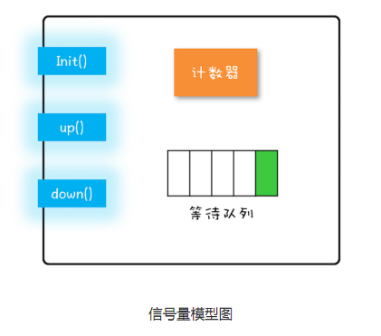

**前言：**

在[Lock & Condition]()中我们学习了管程这种并发编程模型，在管程模型提出之前，信号量模型一直是并发编程领域的终结者，几乎所有支持并发编程的语言都支持信号量机制，今天就来看看Java中的信号量实现--Semaphore。

[TOC]

**面试问题**
Q ：谈谈对Semaphore的理解？


## 1.信号量模型

在正式开始前，我们先简单回顾一下管程模型，管程模型中对共享变量互斥访问，只能有一个线程成功进入临界区，其他尝试失败的线程会在临界区外等待区的入口等待队列中等待，进入临界区中的线程，如果需要等待某个条件变量，则会释放锁，唤醒入口等待队列中等待的线程，同时在该条件变量对应的等待队列中等待，线程也会进入等待状态，直到被其他线程唤醒，才会从条件变量的等待队列中移除，加入到入口等待队列中重新尝试进入临界区。                                                                                                                                                                                                                                                                                                                                                                                                                                                                                                                                                                                                                                                                                                                                                                                                                                                                                                                                                                                                                                 

信号量与管程最大的不同：信号量可以允许多个线程访问同一个临界区，而管程只允许一个线程访问临界区。

信号量模型可以简单概括：一个计数器、一个等待队列，三个方法。在信号量模型里，计数器和等待队列对外是透明的，只能通过信号量模型提供的方法来访问。

**init**(int permits)：设置计数器的初始值，最多允许多少个线程同时访问临界区。

**down**(int permits)：计数器的值减去permits个许可，如果计数器中暂时没有足够的许可，则将当前线程阻塞，并加入到等待队列。

**up**(int permits)：计数器的值加上permits个许可，并根据归还后许可的个数，唤醒等待队列中一个线程，




举个简单的例子，在哲学家用餐问题中，我们可以通过**破坏请求与保持条件**，一次性申请所有的资源来解决死锁问题，具体的操作就是把筷子都放桌子中央，需要吃饭的人一次拿两根。筷子不够两根的话，进行等待。

桌子中央的5根筷子就相当于信号量中的5个许可，在Init()时设置，当某个哲学家打算用餐时，则通过down(2)，拿走两根筷子(许可)，用餐完毕后up(2)归还筷子，如果中间只剩一根筷子，那么再执行down(2)并不会拿走剩下的这一根筷子，而是会进入等待队列，当有筷子被归还时，先排队的人会尝试去拿筷子，如果此时没有其他哲学家竞争的话，就可以拿到筷子进行用餐，用餐结束后，归还筷子，并通知排在他后边的人可以去拿了。

## 2.Semaphore使用

**申请多少信号量，记得释放多少信号量。**


 **一旦(one egg) 进入等待队列中，只有前驱节点释放或取消后继才会被唤醒。**

举个例子：

线程A和线程B分别需要10个和5个许可，信号量一开始只剩4个许可，A先申请，申请不到，挂起A，B后申请，也申请不到，挂起B，注意，**等待队列中A是排在B前边的**。过了一会有线程归还了1个许可，此时信号量中有5个空闲许可，而线程B也刚好需要5个。那么是不是线程B就可以被唤醒了？不是的，B线程只能被其前驱节点唤醒，在被唤醒前是出于挂起（等待）状态的，对许可的个数变化是不知情的。


**构造时传入的许可数，并不代表信号量最大支持的许可数**

构造传入的许可数，代表的AQS先帮你指定初始的数量，你在后边的使用中还可以继续通过release继续往上加，只要不超过int最大值都可以。所以记得用多少，还多少。少还的话，其他线程不够用，多还则程序会抛出错误。


**Semaphore(1）是不是可以当ReentrantLock使用**

看着功能挺像的，但内部实现完全不同，一个是共享模式，一个是独占模式，建议不要这样做。


## 3.Semaphore解析

Semaphorey底层依旧是通过AQS实现，其静态内部抽象类Sync实现类AQS中共享模式的主要方法，FairSync与NonfairSync继承自Sync，各自通过重写tryAcquireShared分别实现了公平模式与非公平模式。

**公平模式**：在申请**相同数量许可**的前提下，调用acquire的顺序就是获取许可的顺序；如果申请许可数量不同，那么信号量会根据等待队列中的顺序，优先满足申请数量小于等于空闲数量的线程。

**非公平模式**：在进入等待队列前尝试去获取许可，恰好此时有一个许可释放，并被该线程申请到，那么就不用进入等待队列了。

Semaphore 对应的两个构造方法如下：

```java
   public Semaphore(int permits) {
        sync = new NonfairSync(permits);
    }

    public Semaphore(int permits, boolean fair) {
        sync = fair ? new FairSync(permits) : new NonfairSync(permits);
    }
```

在构造的时候必填permits，作为信号量中许可的初始化个数。fair选填，默认非公平模式。


### 3.1 申请许可

在之前学习中，我们更多关注的是工具类实现AQS的部分，没有从整体的角度来学习它，在后边的内容中，我们试着去了解AQS是如何设计的，是怎样通过简单的实现就可以自定义同步组件。

在我们调用 `semaphore.acquire()`后，Semaphore调用的是内部的 `sync.acquireSharedInterruptibly(1)` 如果调用的是 `acquire(int permits)` 则会调用 `sync.acquireSharedInterruptibly(permits)` 。

acquireSharedInterruptibly（）定义在AQS中，获取可响应中断的共享，代码如下：

```java
//AbstractQueuedSynchronizer
public final void acquireSharedInterruptibly(int arg)
            throws InterruptedException {
    	//如果线程被中断了，抛出中断异常
        if (Thread.interrupted())
            throw new InterruptedException();
    	/*
    	下面这个方法名是不是很眼熟，在上一篇讲ReadLock部分时主要介绍的就是这个方法，
    	但两者的内容是完全不同的，各个工具类通过实现各自的tryAcquireShared来提供不同的功能。
    	tryAcquireShared方法表示尝试去获取，能成功是运气好，失败才是常态。
    	如果返回值<0，则尝试获取许可失败，执行doAcquireSharedInterruptibly(arg);
    	*/
        if (tryAcquireShared(arg) < 0)
            doAcquireSharedInterruptibly(arg);
    }
```


tryAcquireShared()在Semaphore中有公平模式和非公平模式两种实现。

```java
//非公平模式        
        final int nonfairTryAcquireShared(int acquires) {//要申请的许可个数
            for (;;) {
                //目前信号量中空闲的许可个数。
                int available = getState();
                //remaining表示经过当前操作后剩下空闲许可的个数，
                //remaining >= 0，表示可以满足当前线程申请的许可数，申请成功
                //remaining < 0，无法满足当前线程申请的许可数，申请失败
                int remaining = available - acquires;
                if (remaining < 0 ||
                    //AQS中的volatile变量state在不同的工具类中有不同的含义，
                    //在Semaphore中表示剩余的信号量。
                    compareAndSetState(available, remaining))
                    //返回剩余的许可
                    return remaining;
            }
        }
```


```java
//公平模式        
		protected int tryAcquireShared(int acquires) {
            for (;;) 
                /*
                公平模式与非公平模式一区别在于下边这行代码。
                公平就是前边有线程在等待的话，当前线程需要排队。
                hasQueuedPredecessors()用来判断是否需要排队
                */
                if (hasQueuedPredecessors())
                //如果需要排队，为了保证公平性，不进行尝试获取，直接返回
                    return -1;
                int available = getState();
                int remaining = available - acquires;
                if (remaining < 0 ||
                    compareAndSetState(available, remaining))
                    return remaining;
            }
        }
```

```java
//AbstractQueuedSynchronizer    
	public final boolean hasQueuedPredecessors() {
        /*
        检查信号量模型图中的等待队列，首节点是否是当前线程。
             ____          ____          ____
      head  | \\ |  -->   | t1 |  -->   | t2 |	tail
            |____|  <--   |____|  <--   |____|
            头节点	         首节点
        */
        Node t = tail; 
        Node h = head;
        Node s;
        return h != t &&
            ((s = h.next) == null || s.thread != Thread.currentThread());
    }
```


至此**acquireSharedInterruptibly( arg)**中的**tryAcquireShared(arg)** 方法执行完成，返回值大于等于0，可表示尝试成功；小于0则尝试失败，会进入**doAcquireSharedInterruptibly(arg)**方法。

```java
//AbstractQueuedSynchronizer   
	/*
	该方法是AQS中尝试获取共享失败后的处理方法，上一篇中的ReadLock尝试
	获取读锁失败后，也会执行该方法中定义的逻辑，而且还会做额外的中间检查。
	*/
	private void doAcquireSharedInterruptibly(int arg)
        throws InterruptedException {
        //把当前线程封装为共享类型的节点添加至等待队列，
        //该方法的具体操作见 代码块-1
        final Node node = addWaiter(Node.SHARED);
        boolean failed = true;
        try {
            for (;;) {
                //返回当前线程节点的前一个节点，代码块-3
                final Node p = node.predecessor();
                //只要p==head时，也就是当前线程节点为等待队列中的首节点，则可以尝试获取共享状态
                if (p == head) {
                    //这里再次去尝试获取arg个共享状态，也就是arg个许可
                    int r = tryAcquireShared(arg);
                    //CAS已经成功修改了信号量，获取到了需要的许可数
                    if (r >= 0) {
                        /*
                        当前线程节点目前处于等待队列中的首节点，获取后则需要让出首节点的位置，
                        其他线程成为首节点，才能进行尝试获取共享状态的操作。
                        setHeadAndPropagate()便是如何将当前线程节点的下一个节点
                        变成首节点的方法，并且如果后继节点是共享类型，还会唤醒后继节点方法
                        具体内容在代码块-4。
                        */
                        setHeadAndPropagate(node, r);
                        p.next = null; // help GC
                        failed = false;
                        return;
                    }
                }
                /*
                代码块-7，从最开始的尝试获取到添加节点后判断是否为头节点，
                两次尝试都失败，则会在此处判断当前线程是否应该被挂起(可以理解为进入等待)
                在此处会将前驱节点的waitStatus设置为SIGNAL，表示当前节点需要被唤醒
                而具体的唤醒方法是由前驱节点来调用的，可以理解为，在排队时你告诉你前边的人
                让他买完后叫你一下(设置前驱节点的waitStatus为SIGNAL)，
                这样你就可以低头玩手机了(挂起线程)。
               	*/
                if (shouldParkAfterFailedAcquire(p, node) &&
                    //代码块-8，挂起当前线程
                    parkAndCheckInterrupt())
                    throw new InterruptedException();
            }
        } finally {
            if (failed)
                cancelAcquire(node);
        }
    }
```

**代码块-1:**

```java
//AbstractQueuedSynchronizer 
	//向等待队列尾部中添加节点，在
	private Node addWaiter(Node mode) {//前边传过来的节点类型 Node.SHARED
        //将当前线程封装为共享类型的节点。
        Node node = new Node(Thread.currentThread(), mode);
        //pred表示前驱节点，指向当前队列的尾节点。
        Node pred = tail;
        //当前队列尾节点不为空，表示当前队列不为空。
        if (pred != null) {
            //将当前线程节点的前驱节点指向尾节点。
            //高并发时，多个线程节点的前驱指向同一个尾节点，但最后CAS只能成功一个。
            node.prev = pred;
            if (compareAndSetTail(pred, node)) {
                //CAS成功设置尾节点后，才将pred节点的后继指向确定后的尾节点。
                pred.next = node;
                return node;
            }
        }
        //前边队列尾节点为空或CAS失败后会执行该方法。
        enq(node);
        return node;
    }
```

**代码块-2:**

```java
 //AbstractQueuedSynchronizer 
	//自旋向队列末尾添加节点，如果队列为空则初始化等待队列。
	private Node enq(final Node node) {
        //这里是一个CAS自旋操作
        for (;;) {
            Node t = tail;
            if (t == null) { // Must initialize
                //初始化头节点
                if (compareAndSetHead(new Node()))
                    tail = head;
            } else {
                node.prev = t;
                if (compareAndSetTail(t, node)) {
                    t.next = node;
                    return t;
                }
            }
        }
    }
```

**代码块-3:**

```Java
 //AbstractQueuedSynchronizer的静态内部Node
	//返回当前线程节点的前一个节点
    final Node predecessor() throws NullPointerException {
        Node p = prev;
        if (p == null)
            throw new NullPointerException();
        else
            return p;
    }
```

**代码块-4:**

```Java
//AbstractQueuedSynchronizer
	//方法名称直译为设置头节点和传播
	//参数propagate是获取成功后剩余的许可，node则是获取的许可的线程
	private void setHeadAndPropagate(Node node, int propagate) {
        //下边的检查需要用到旧的头节点
        Node h = head;  
        //设置结果如下图
        setHead(node);
        /*
        	  h			   head
             ____          ____          ____
            | \\ |  -->   | t1 |  -->   | t2 |	tail
            |___ |  <--   |____|  <--   |___ |
           				   头节点	       首节点
        */

        /*
         * 这里是唤醒后续节点的健壮性判断。  
         * 在JDK 6u11,6u17中，只判断了propagate > 0 && node.waitStatus != 0
         * 会导致并发释放信号量所导致部分请求信号量的线程无法被唤醒的问题，
         * 详见 BUG – JDK-6801020 
         * 仅用propagate > 0 判断是否唤醒后续节点是不充分的
         */
        if (propagate > 0 || h == null || h.waitStatus < 0 ||
            (h = head) == null || h.waitStatus < 0) {
            Node s = node.next;
            //后续节点为共享类型，则唤醒该节点
            if (s == null || s.isShared())
                doReleaseShared();
        }
    }
```

**代码块-5:**

```java
//AbstractQueuedSynchronizer
	//该方法用于在 acquires/releases 存在竞争的情况下，确保唤醒动作向后传播
	private void doReleaseShared() {
      	/*
         * 下面的循环在 head 节点存在后继节点的情况下，做了两件事情：
         * 1. 如果 head 节点等待状态为 SIGNAL，则将 head 节点状态设为 0，并唤醒后继节点
         * 2. 如果 head 节点等待状态为 0，则将 head 节点状态设为 PROPAGATE，保证唤醒能够正
         *    常传播下去。
         */
        for (;;) {
            Node h = head;
            if (h != null && h != tail) {
                int ws = h.waitStatus;
                if (ws == Node.SIGNAL) {
                    if (!compareAndSetWaitStatus(h, Node.SIGNAL, 0))
                        continue;            // loop to recheck cases
                    //代码块-6 唤醒后续节点
                    unparkSuccessor(h);
                }
            /* 
             * ws = 0 的情况下，这里要尝试将状态从 0 设为 PROPAGATE，保证唤醒向后
             * 传播。setHeadAndPropagate 在读到 h.waitStatus < 0 时，可以继续唤醒
             * 后面的节点。
             */
                else if (ws == 0 &&
                         !compareAndSetWaitStatus(h, 0, Node.PROPAGATE))
                    continue;                // loop on failed CAS
            }
            if (h == head)                   // loop if head changed
                break;
        }
    }
```

**代码块-6:**

```java
 //AbstractQueuedSynchronizer
	//唤醒后续节点
	private void unparkSuccessor(Node node) {
        int ws = node.waitStatus;
        if (ws < 0)
            compareAndSetWaitStatus(node, ws, 0);

        /*
         * 找到下一个没有被取消的节点唤醒
         */
        Node s = node.next;
        if (s == null || s.waitStatus > 0) {
            s = null;
            for (Node t = tail; t != null && t != node; t = t.prev)
                if (t.waitStatus <= 0)
                    s = t;
        }
        if (s != null)
            LockSupport.unpark(s.thread);
    }
```

**代码块-7:**

```java
 //AbstractQueuedSynchronizer
	private static boolean shouldParkAfterFailedAcquire(Node pred, Node node) {
        /*
         * static final int CANCELLED =  1;
      	 * static final int SIGNAL    = -1;
         * static final int CONDITION = -2;
         * static final int PROPAGATE = -3;

         * 线程节点在被创建的时候，waitStatus默认为0
         * 所以第一次进人该方法一定会返回false，在返回前设置为SIGNAL
         * 下次再进入该方法的时候才会返回true
         */
        int ws = pred.waitStatus;
        if (ws == Node.SIGNAL)
            //返回true，后续会挂起线程
            return true;
        if (ws > 0) {
            //如果前驱节点取消了，那么会一直找到前边没被取消的节点
            do {
                node.prev = pred = pred.prev;
            } while (pred.waitStatus > 0);
            pred.next = node;
        } else {
            /*
             * 只有waitStatus为0时或者为-3时，才能到这里。
             * 第一次进入该方法时，调用方需要再确认一下，如果还是获取不到再挂起。
             * 返回false，重新回到doAcquireSharedInterruptibly中自旋，
             * 再次看看自己是否可以获取，获取不到会再次进入该方法。
             * 下次进入时，waitStatus就等于SIGNAL了，该方法就可以返回true
             * 线程才会被真正挂起，进入等待。
             */
            compareAndSetWaitStatus(pred, ws, Node.SIGNAL);
        }
        return false;
    }
```

**代码块-8:**

```java
//AbstractQueuedSynchronizer
	private final boolean parkAndCheckInterrupt() {
     	//调用LockSupport挂起当前线程
        LockSupport.park(this);
		//被唤醒后会返回等待中是否被中断     	
        return Thread.interrupted();
    }
```


### 3.2 释放许可

跟前边获取许可的代码相比，释放许可就很轻松了。

```java
//AbstractQueuedSynchronizer
	public final boolean releaseShared(int arg) {
        //尝试去释放许可
        if (tryReleaseShared(arg)) {
            //代码块-5,
            doReleaseShared();
            return true;
        }
        return false;
    }
```


```java
//Semaphore
	//尝试获取的时候是尝试一次，尝试释放的时候是不停的尝试直到成功
	protected final boolean tryReleaseShared(int releases) {
        for (;;) {
            int current = getState();
            int next = current + releases;
            if (next < current) // overflow
                throw new Error("Maximum permit count exceeded");
            if (compareAndSetState(current, next))
                return true;
        }
    }
```

### 3.3 小结

**非公平模式调用获取许可方法**，先CAS尝试。尝试失败后进入`doAcquireSharedInterruptibly()`

在该方法中，首先会向等待队列的队尾添加新的共享类型节点，新节点waitStatus为0。


检查是否为首节点，是的话再尝试一次，尝试失败或不是首节点，执行`shouldParkAfterFailedAcquire()`。

该方法中会设置前驱节点的等待状态为SIGNAL `compareAndSetWaitStatus(pred, ws, Node.SIGNAL)`。

如果前驱节点waitStatus为-2(取消状态)，则会从后向前遍历找到未取消的前驱节点 ，然后再设置为SIGNAL。

设置成功后，就可以安心挂起了，反正有人通知。

被唤醒后先检查中断状态，如果未被中断则会回到`doAcquireSharedInterruptibly()`中的自旋操作。


继续检查是否为首节点，不是的话继续挂起，是首节点，并且尝试成功后，返会剩余许可数`int r = tryAcquireShared(arg)`。

共享型节点在唤醒后还需要将这个唤醒操作传递给后继结点，这也是与独占型节点的区别。

独占模式在此处只需要重新设置head节点，共享模式则在设置head节点的同时还要向后继传播唤醒。

`setHeadAndPropagate()`，将当前线程节点设置为head节点，如果出现以下情况则会向后传播唤醒：

- 还有剩余的许可。
- 旧的head节点为空或者waitStatus小于0，也就是SIGNAL和PROPAGATE这两种状态。
- 新的head节点也就是当前线程节点的为空或者waitStatus小于0。


具体的传播动作定义在`doReleaseShared()`中。这个方法其实也是释放许可所使用的核心方法。

在该方法中会在head节点存在后继节点的情况下，做两件事：

1. 如果 head 节点等待状态为 SIGNAL，则将 head 节点状态设为 0，并唤醒后继节点
2. 如果 head 节点等待状态为 0，则将 head 节点状态设为 PROPAGATE，保证唤醒能够正
   常传播下去。

唤醒后续节点后，`doAcquireSharedInterruptibly()`主要流程就完了。


**非公平模式调用释放许可方法**，会进入`releaseShared()`，尝试释放锁直到成功。

后续的执行前边提到的`doReleaseShared()`。


## 4.总结

这篇文章把共享锁的整个流程走了一遍，其中有很多实现的细节有待深入，比如设置state时什么时候需要用CAS，什么时候不需用；在添加节点时，为什么先将当前节点指向尾节点，等CAS修改成功后，再将尾节点指向当前节点，还有等待队列为什么是从后向前遍历等等。

限于本人的能力，这些实现细节还没有更深入的理解，目前只能看懂大概流程。后边会专门写一篇AQS的文章，来对J.U.C中的工具类做一个总结，也这些细节也进行一一剖析。

**附上学习AQS的一点心得：**

第一阶段：先熟悉一下各个方法大概都是做什么的，心里有个底。

第二阶段：Debug！一边跟方法，一边要记住等待队列中的各个节点的waitStatus以及head和tail的指向的变化，最好能画成图，熟悉AQS流程和waitStatus的变化。

第三阶段：熟悉了整体流程后，通过线程断点控制线程的执行流程，其实就是人工模拟CPU切换线程，使线程走到AQS中之前没有通过的判断逻辑中，看看会发生什么，比如setHeadAndPropagate()方法中那一长串的判断。

第四阶段：向 Doug Lea 致敬 ！

## Reference

&emsp;&emsp;[http://www.tianxiaobo.com](http://www.tianxiaobo.com/)

**感谢阅读**！