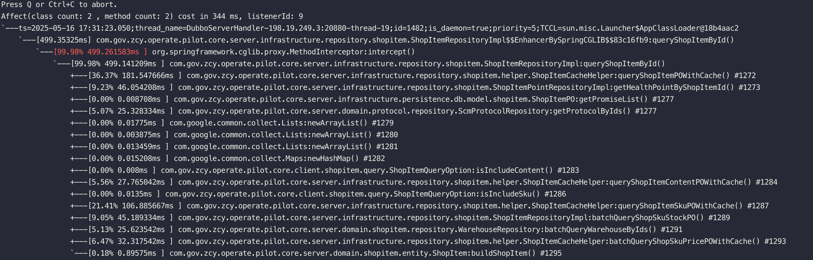
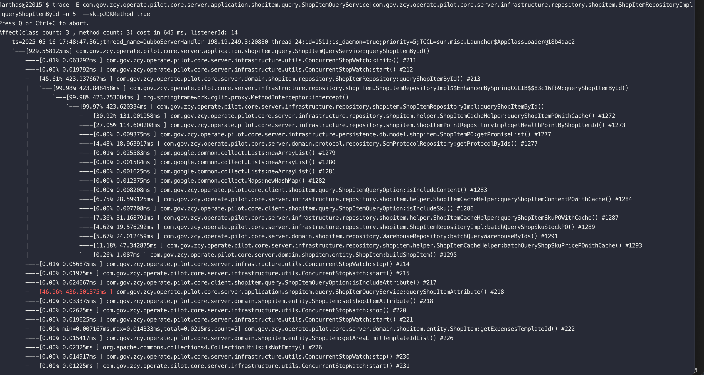
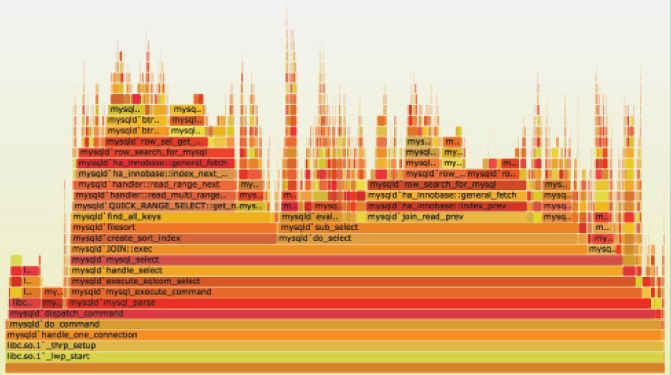

## [Arthas命令列表](https://arthas.aliyun.com/doc/commands.html)

### 启动 arthas

```sh
curl -O https://arthas.aliyun.com/arthas-boot.jar
java -jar arthas-boot.jar
```

### dashboard 查看进程信息和内存概要信息

```bash
dashboard
```

```java
$ dashboard
ID     NAME                   GROUP          PRIORI STATE  %CPU    TIME   INTERRU DAEMON
17     pool-2-thread-1        system         5      WAITIN 67      0:0    false   false
27     Timer-for-arthas-dashb system         10     RUNNAB 32      0:0    false   true
11     AsyncAppender-Worker-a system         9      WAITIN 0       0:0    false   true
9      Attach Listener        system         9      RUNNAB 0       0:0    false   true
3      Finalizer              system         8      WAITIN 0       0:0    false   true
2      Reference Handler      system         10     WAITIN 0       0:0    false   true
4      Signal Dispatcher      system         9      RUNNAB 0       0:0    false   true
26     as-command-execute-dae system         10     TIMED_ 0       0:0    false   true
13     job-timeout            system         9      TIMED_ 0       0:0    false   true
1      main                   main           5      TIMED_ 0       0:0    false   false
14     nioEventLoopGroup-2-1  system         10     RUNNAB 0       0:0    false   false
18     nioEventLoopGroup-2-2  system         10     RUNNAB 0       0:0    false   false
23     nioEventLoopGroup-2-3  system         10     RUNNAB 0       0:0    false   false
15     nioEventLoopGroup-3-1  system         10     RUNNAB 0       0:0    false   false
Memory             used   total max    usage GC
heap               32M    155M  1820M  1.77% gc.ps_scavenge.count  4
ps_eden_space      14M    65M   672M   2.21% gc.ps_scavenge.time(m 166
ps_survivor_space  4M     5M    5M           s)
ps_old_gen         12M    85M   1365M  0.91% gc.ps_marksweep.count 0
nonheap            20M    23M   -1           gc.ps_marksweep.time( 0
code_cache         3M     5M    240M   1.32% ms)
Runtime
os.name                Mac OS X
os.version             10.13.4
java.version           1.8.0_162
java.home              /Library/Java/JavaVir
                       tualMachines/jdk1.8.0
                       _162.jdk/Contents/Hom
                       e/jre

```


### thread 获取线程堆栈


###  jad 反编译 Class

> JD-GUI 反编译后的文件显示的是最开始的源码
>
> JAD反编译后的文件是处理过语法糖的源代码
>
> javap -c 反编译class文件，显示的是字节码文件

```java
jad com.demo.MathGame
```

```java
ClassLoader:
+-sun.misc.Launcher$AppClassLoader@3d4eac69
  +-sun.misc.Launcher$ExtClassLoader@66350f69

Location:
/tmp/math-game.jar

/*

 * Decompiled with CFR 0_132.
   */
   package demo;

import java.io.PrintStream;
import java.util.ArrayList;
import java.util.Iterator;
import java.util.List;
import java.util.Random;
import java.util.concurrent.TimeUnit;

public class MathGame {
    private static Random random = new Random();
    private int illegalArgumentCount = 0;
public static void main(String[] args) throws InterruptedException {
    MathGame game = new MathGame();
    do {
        game.run();
        TimeUnit.SECONDS.sleep(1L);
    } while (true);
}

public void run() throws InterruptedException {
    try {
        int number = random.nextInt();
        List<Integer> primeFactors = this.primeFactors(number);
        MathGame.print(number, primeFactors);
    }
    catch (Exception e) {
        System.out.println(String.format("illegalArgumentCount:%3d, ", this.illegalArgumentCount) + e.getMessage());
    }
}

public static void print(int number, List<Integer> primeFactors) {
    StringBuffer sb = new StringBuffer("" + number + "=");
    Iterator<Integer> iterator = primeFactors.iterator();
    while (iterator.hasNext()) {
        int factor = iterator.next();
        sb.append(factor).append('*');
    }
    if (sb.charAt(sb.length() - 1) == '*') {
        sb.deleteCharAt(sb.length() - 1);
    }
    System.out.println(sb);
}

public List<Integer> primeFactors(int number) {
    if (number < 2) {
        ++this.illegalArgumentCount;
        throw new IllegalArgumentException("number is: " + number + ", need >= 2");
    }
    ArrayList<Integer> result = new ArrayList<Integer>();
    int i = 2;
    while (i <= number) {
        if (number % i == 0) {
            result.add(i);
            number /= i;
            i = 2;
            continue;
        }
        ++i;
    }
    return result;
}
```
### Watch 查看函数运行时入参返回和异常

[watch 官方文档](https://arthas.aliyun.com/doc/watch.html)

[Arthas watch 的一些特殊用法文档说明](https://github.com/alibaba/arthas/issues/71)

|            参数名称 | 参数说明                                                     |
| ------------------: | :----------------------------------------------------------- |
|     *class-pattern* | 类名表达式匹配                                               |
|    *method-pattern* | 函数名表达式匹配                                             |
|           *express* | 观察表达式，默认值：`{params, target, returnObj}`            |
| *condition-express* | 条件表达式                                                   |
|                 [b] | 在**函数调用之前**观察                                       |
|                 [e] | 在**函数异常之后**观察                                       |
|                 [s] | 在**函数返回之后**观察                                       |
|                 [f] | 在**函数结束之后**(正常返回和异常返回)观察                   |
|                 [E] | 开启正则表达式匹配，默认为通配符匹配                         |
|                [x:] | 指定输出结果的属性遍历深度，默认为 1，最大值是 4             |
|         `[m <arg>]` | 指定 Class 最大匹配数量，默认值为 50。长格式为`[maxMatch <arg>]`。 |

```java
watch demo.MathGame funName {params,target,returnObj} -x 1
watch demo.MathGame funName {params,target,returnObj} -x 
```

```java
$ watch demo.MathGame primeFactors returnObj
Press Ctrl+C to abort.
Affect(class-cnt:1 , method-cnt:1) cost in 107 ms.
ts=2018-11-28 19:22:30; [cost=1.715367ms] result=null
ts=2018-11-28 19:22:31; [cost=0.185203ms] result=null
ts=2018-11-28 19:22:32; [cost=19.012416ms] result=@ArrayList[
    @Integer[5],
    @Integer[47],
    @Integer[2675531],
]
ts=2018-11-28 19:22:33; [cost=0.311395ms] result=@ArrayList[
    @Integer[2],
    @Integer[5],
    @Integer[317],
    @Integer[503],
    @Integer[887],
]
ts=2018-11-28 19:22:34; [cost=10.136007ms] result=@ArrayList[
    @Integer[2],
    @Integer[2],
    @Integer[3],
    @Integer[3],
    @Integer[31],
    @Integer[717593],
]
ts=2018-11-28 19:22:35; [cost=29.969732ms] result=@ArrayList[
    @Integer[5],
    @Integer[29],
    @Integer[7651739],
]

```


### vmtool 实现查询内存对象

**根据类名获取实例**

```sh
[arthas@22015]$ vmtool  --action getInstances --className 
com.gov.zcy.operate.pilot.core.server.infrastructure.config.apollo.ApolloConfig --limit 5 -x 1

@ApolloConfig[][    @ApolloConfig[com.gov.zcy.operate.pilot.core.server.infrastructure.config.apollo.ApolloConfig@3a9af0cf],
]
```

**指定返回结果展开层数**

`getInstances` action 返回结果绑定到`instances`变量上，它是数组。

通过 `-x`/`--expand` 参数可以指定结果的展开层次，默认值是 1。

```bash
vmtool --action getInstances -c 19469ea2 --className org.springframework.context.ApplicationContext -x 2
```

**根据类名获取实例字段**

`getInstances` action 返回结果绑定到`instances`变量上，它是数组。可以通过`--express`参数执行指定的表达式。

```sh
[arthas@22015]$ vmtool  --action getInstances --className com.gov.zcy.operate.pilot.core.server.infrastructure.config.apollo.ApolloConfig --limit 5 -x 1  --express 'instances[0].modelFilter'

@LinkedHashSet[
    @String[测试],
    @String[测试型号],
]
```

**强制GC**

```sh
vmtool --action forceGc
```

- 可以结合 [`vmoption`](https://arthas.aliyun.com/doc/vmoption.html) 命令动态打开`PrintGC`开关。


### trace 统计方法内调用路径和耗时

`trace` 命令能主动搜索 `class-pattern`／`method-pattern` 对应的方法调用路径，渲染和统计整个调用链路上的所有性能开销和追踪调用链路。

```sh
[arthas@22015]$ trace com.gov.zcy.operate.pilot.core.server.infrastructure.repository.shopitem.ShopItemRepositoryImpl queryShopItemById  -n 5 --skipJDKMethod true
```



**trace 多个类或者多个函数**

trace 命令只会 trace 匹配到的函数里的子调用，并不会向下 trace 多层。因为 trace 是代价比较贵的，多层 trace 可能会导致最终要 trace 的类和函数非常多。

可以用正则表匹配路径上的多个类和函数（例如父子函数嵌套）一定程度上达到多层 trace 的效果。

```sh
trace -E com.test.ClassA|org.test.ClassB method1|method2|method3
```

```sh
trace -E com.gov.zcy.operate.pilot.core.server.application.shopitem.query.ShopItemQueryService|com.gov.zcy.operate.pilot.core.server.infrastructure.repository.shopitem.ShopItemRepositoryImpl queryShopItemById -n 5  --skipJDKMethod true 
```




### tt 方法执行数据的时空隧道

记录下指定方法每次调用的入参和返回信息，并能对这些不同的时间下调用进行观测


### profiler 查看火焰图

https://arthas.aliyun.com/doc/profiler.html

通过抽样统计CPU当前的执行函数栈来分析软件的性能瓶颈，除了CPU还支持别的指标。

```bash
  cpu
  alloc
  lock
  wall
  itimer
  ctimer
```

profiler 默认的采集间隔是10ms，那么每秒采集的量100次，频率也就是 100Hz，如果100次都返回同一个函数名，那就说明 CPU 这一秒钟都在执行同一个函数，可能存在性能问题。以上是单核的情况，多核还需要乘上对应核数。

启动

```sh
profiler start 
```

查看采样数

```sh
profiler getSamples  
profiler start --duration 300
```

 查看profiling状态

```sh
profiler status
```

结束

```sh
profiler stop 
```

结束后会生成SVG可交互的火焰图。

示例：https://zcy-distribute.oss-cn-hangzhou.aliyuncs.com/zdebug/a.html



y 轴表示调用栈，每一层都是一个函数。调用栈越深，火焰就越高，顶部就是正在执行的函数，下方都是它的父函数。

x 轴表示抽样数，如果一个函数在 x 轴占据的宽度越宽，就表示它被抽到的次数多，即执行的时间长。注意，x 轴不代表时间，而是所有的调用栈合并后，按字母顺序排列的。

**火焰图就是看顶层的哪个函数占据的宽度最大。只要有"平顶"（plateaus），就表示该函数可能存在性能问题。**