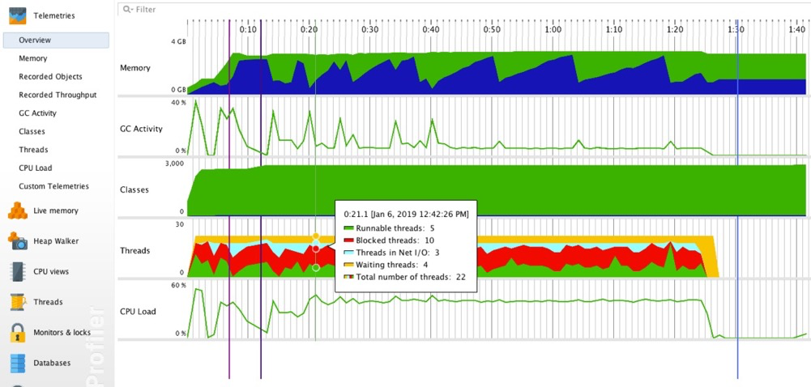
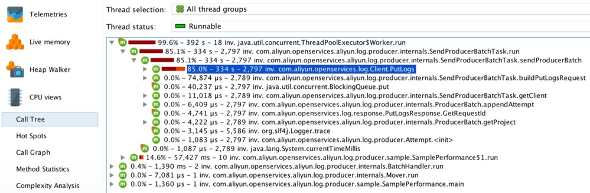
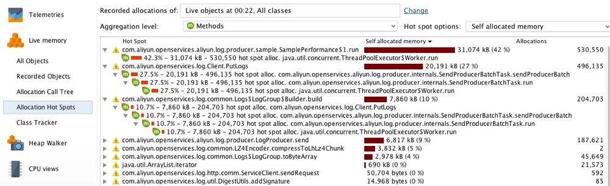
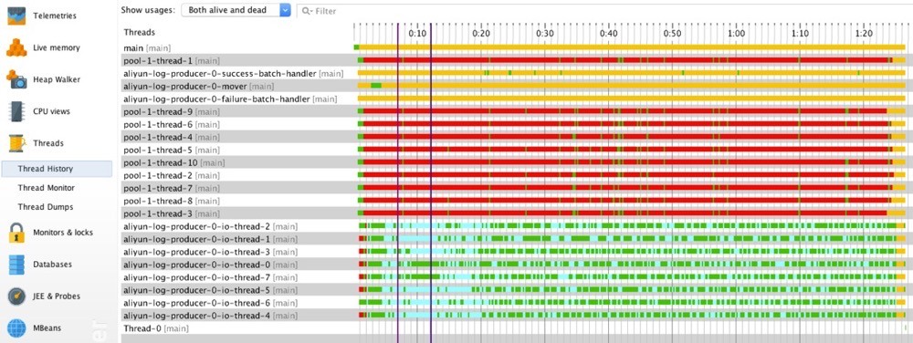

## 什么是JProfiler？

JProfiler是一个用于分析运行JVM内部情况的专业工具。 在开发中你可以使用它，用于质量保证，也可以解决你的生产系统遇到的问题。

JProfiler处理四个主要问题:

- **方法调用**

  这通常被称为"CPU分析"。方法调用可以通过不同的方式进行测量和可视化， 分析方法调用可以帮助了解你的应用程序正在做什么，并找到提高其性能的方法。

- **对象分配**

  分析堆上对象的分配、引用链和垃圾回收属于"内存分析"的范畴。 这个功能可以让你解决内存泄漏，总之使用更少的内存，分配更少的临时对象。

- **线程和锁**

  线程可以持有锁，例如通过在一个对象上做同步。当多个线程协作时，可能会出现死锁，JProfiler可以为你可视化这种情况。 此外，锁可能被争用，这意味着线程在获得锁之前必须等待。通过JProfiler可以深入了解线程及其各种锁情形。

- **高层子系统**

  许多性能问题发生在更高的语义层面。例如，对于JDBC调用，你可能想找出哪条SQL语句是最慢的。 对于这样的子系统，JProfiler提供了"探针"，将特定有效载荷附加到调用树。

JProfiler的UI是一个桌面应用程序。你可以以交互的方式实时分析JVM，也可以在不使用UI的情况下，自动化分析。 保存在快照中的分析数据，可以通过JProfiler UI打开。此外，命令行工具和构建工具集成可以帮助你自动分析会话。

## 功能简介

### Overview

在概览页我们可以清晰的看到内存使用量、垃圾收集活动、类加载数量、线程个数和状态、CPU 使用率等指标随时间变化的趋势。

通过此图，我们可以作出如下基本判断：

1. 程序在运行过程中会产生大量对象，但这些对象生命周期极短，大部分都能被垃圾收集器及时回收，不会造成内存无限增长。
2. 加载类的数量在程序初始时增长较快，随后保持平稳，符合预期。
3. 在程序运行过程中，有大量线程处于阻塞状态，需要重点关注。
4. 在程序刚启动时，CPU 使用率较高，需要进一步探究其原因。

### Call Tree

Call tree 通过树形图清晰地展现了方法间的层次调用关系。同时，JProfiler 将子方法按照它们的执行总时间由大到小排序，这能让您快速定位关键方法。

### **Allocation Hot Spots**

如果方法比较多，您还可以通过 Allocation Hot Spots 视图快速找出分配对象最多的方法。

### 监测线程

监测应用启动后，直观地展示了各线程在不同时间点的状态。用于查看线程的状态特征都是符合预期的，以及线程池配置的数量在业务高峰期的表现。

不同线程执行的任务不同，所展现的状态特征也不同。

- 线程`pool-1-thread-<M>`会循环调用`producer.send()`方法异步发送数据，它们在程序刚启动时一直处于运行状态，但随后在大部分时间里处于阻塞状态。这是因为 producer 发送数据的速率低于数据的产生速率，且单个 producer 实例能缓存的数据大小有限。在程序运行初始，producer 有足够空间缓存待发送数据，所以`pool-1-thread-<M>`一直处于运行状态，这也就解释了为何程序在刚启动时 CPU 使用率较高。随着时间的推移，producer 的缓存被逐渐耗尽，`pool-1-thread-<M>`必须等到 producer “释放”出足够的空间才有机会继续运行，这也是为什么我们会观察到大量线程处于阻塞状态。
- `aliyun-log-producer-0-mover`负责将超时 batch 投递到发送线程池中。由于发送速率较快，batch 会因缓存的数据达到了上限被`pool-1-thread-<M>`直接投递到发送线程池中，因此 mover 线程在大部分时间里都处于等待状态。
- `aliyun-log-producer-0-io-thread-<N>`作为真正执行数据发送任务的线程有一部分时间花在了网络 I/O 状态。
- `aliyun-log-producer-0-success-batch-handler`用于处理发送成功的 batch。由于回调函数比较简单，执行时间短，它在大部分时间里都处于等待状态。
- `aliyun-log-producer-0-failure-batch-handler`用于处理发送失败的 batch。由于没有数据发送失败，它一直处于等待状态。

通过上述分析可知，这些线程的状态特征都是符合预期的。

