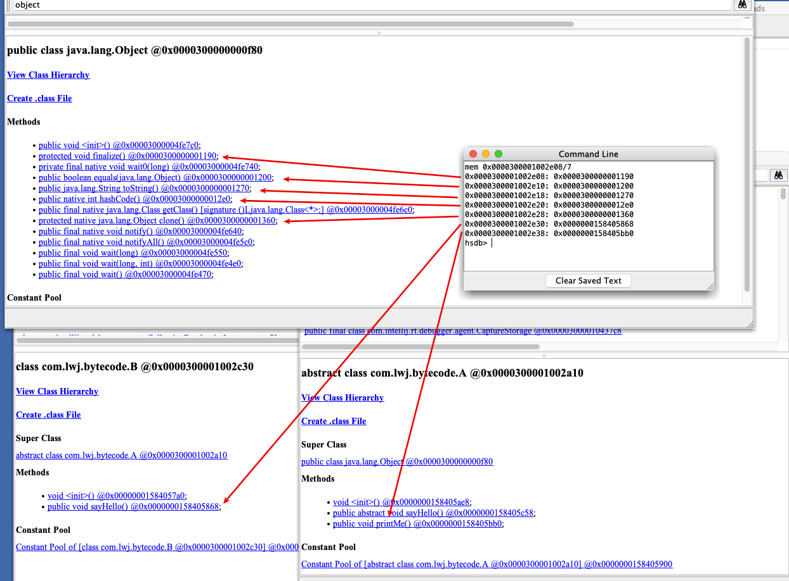

# JVM源码

## 编译JDK

https://juejin.cn/post/6969389200416178213

https://www.jianshu.com/p/ee7e9176632c


https://developer.apple.com/download/all/?q=command

https://jdk.java.net/java-se-ri/22

```sh
bash configure --with-debug-level=slowdebug --with-jvm-variants=server --enable-dtrace --disable-warnings-as-errors
```


```sh
#第一次编译的话需要编译全量  
make all

#也可以使用 compiledb
compiledb make all

#如修改了jdk后，增量的编译镜像
make images
```

## JVM 启动源码

```sh
java -classpath /Users/networkcavalry/Documents/GitHub/Framework/Java/JavaVirtualMachine/jvm/arthas/src/main/java  com.lwj.arthas.ArthasQuickStart2

```

https://www.cnblogs.com/springmorning/p/17478964.html


# 类加载器相关


## 源码阅读工具

source insight


## Oop-Klass模型

https://juejin.cn/post/6844904054561193992

JVM参数：

-XX:+TraceClassLoading	打印类的加载日志

## 加载阶段

对.class文件加载到内存进行解析后生成klass信息，这些元信息存储在方法区。然后在堆区生成运行时class对象，也就是InstanceMirrorKlass的实例，也就是通过反射获取的class对象。

InstanceKlass 实例klass

- InstanceMirrorKlass 描述java.lang.class的实例，镜像Klass
- InstanceRefKlass 描述java.lang.ref.Reference的子类

ArrayKlass 数组klass

- TypeArrayKlass 基本类型数组对应的数据结构
- ObjArrayKlass 引用类型数组对应的数据结构


Klass中定义的静态属性也会保留在堆区


## 连接阶段（验证-准备-解析）

**验证**

1、文件格式验证
2、元数据验证
3、 宇节码验证
4、 符号引用验证

**准备**

为class对象中的静态变量分配内存，赋初值，就是数据类型的默认值


个人理解：因为我们的代码中可以只声明静态变量而不赋值，所以在class对象中需要提前把变量定义好，如果准备阶段不对静态属性赋值，后边jvm运行阶段中的class对象中则没有这个字段了。 

如果被fina/修饰，在编译的时候会给属性添加ConstantValue属性，准备阶段直接完成赋值，即没有初始化这一步

**解析**

类被加载后不一定会立马进行解析和初始化。初始化的时候会去检查是否完成解析。 

符号引用转换为直接引用，因为在加载阶段

符号引用：静态常量池的索引，此时还是类的全限定描述


直接引用：内存地址，可以看到下图中索引为3的常量就指向了一个内存地址值，这个就是指向类的class对象


常量池：

- 静态常量池
- 运行时常量池（存在运行时常量池缓存）
- 字符串常量池


类或接口的解析

字段解析

类方法解析

接口方法解析

方法类型解析

方法句柄解析

调用点限定符解析


## 初始化阶段

通过执行\<clinit>方法，对静态变量、静态代码块进行初始化。

如果只定义了静态变量但未赋值，也表示没有需要初始化的内容，不会生成\<clinit>方法。

如果静态变量被final修饰，表示该变量的指向不会变化，那么直接可以在准备阶段完成赋值，在初始化阶段同样不会生成\<clinit>方法。

一个字节码文件只有一个 \<clinit>方法，且clinit方法中代码顺序和java代码中的顺序一致。


类加载时不一定会触发该类的clinit调用。只有下边的情况会触发clinit方法：

1. new、getstatic、putstatic、invokestatic
2. 反射
3. 初始化一个子类的clinit会去加载并初始化其父类
4. 启动类（main函数所在类） 


### clinit初始化死锁

这种情况的死锁不是java级别的，而是jvm级别的死锁。因此像jstack或者jconsole监测不到死锁。

```java
package com.lwj.classLoader;

import java.util.concurrent.TimeUnit;

/**
 * Date: 2024/6/21
 * <p>
 * Description:
 *
 * @author 乌柏
 */
public class ClassLoaderDeadLock {

    public static void main(String[] args) {
        new Thread(() -> A.test()).start();
        new Thread(() -> B.test()).start();
    }

}

class A {
    static {
        System.out.println("classA init");

        try {
            TimeUnit.SECONDS.sleep(1);
        } catch (InterruptedException e) {
            throw new RuntimeException(e);
        }

        new B();
    }

    public static void test() {
        System.out.println("AAA");
    }
}


class B {
    static {
        System.out.println("classB init");

        try {
            TimeUnit.SECONDS.sleep(1);
        } catch (InterruptedException e) {
            throw new RuntimeException(e);
        }

        new A();
    }

    public static void test() {
        System.out.println("BBB");
    }
}
```


## 双亲委派机制

当发现一个类需要加载的时候，先委托其父类去加载该类，比如应用类加载器委托扩展类加载器，扩展类加载器委托启动类加载器，优先让顶级的类加载去加载类，如果父级加载不到，再由当前类加载器去加载。这样能保证核心路径的类优先被加载，比如rt.jar包所在的路径。


# 字节码

**Java 虚拟机规定义了 u1、u2、u4 三种数据结构来表示 1、2、4 字节无符号整数，**相同类型的若干条数据集合用表（table）的形式来存储。表是一个变长的结构，由代表长度的表头（n）和 紧随着的 n 个数据项组成。class 文件采用类似 C 语言的结构体来存储数据。

## 常量池

常量池结构如下所示：

```c
{
    u2             constant_pool_count;
    cp_info        constant_pool[constant_pool_count-1];
}
```

- 常量池大小（cp_info_count），常量池是 class 文件中第一个出现的变长结构，既然是池，就有大小，常量池大小的由两个字节表示。假设为值为 n，常量池真正有效的索引是 1 ~ n-1。0 属于保留索引，用来表示不指向任何常量池项。

- 常量池项（cp_info）集合，最多包含 n-1 个。为什么是最多呢？Long 和 Double 类型的常量会占用两个索引位置，如果常量池包含了这两种类型，实际的常量池项的元素个数比 n-1 要小。

  

常量池由常量项组成，Java 虚拟机目前一共定义了 14 种常量类型，这些常量名都以 "CONSTANT" 开头，以 "info" 结尾

每个常量项都由两部分构成：表示类型的 tag 和表示内容的字节数组，但u1可表示的范围是2个字节的有符号整数的范围。1个字节是8个二进制位，表示的范围是256个数字，字节码中是以16进制来表示的，只需要2位就能表示一个字节。

```c
cp_info {
    u1 tag;
    u1 info[];
}
```

字节码中是以16进制来表示的，1位可以表示16个数字，1个字节是8个二进制位，


**CONSTANT_Integer_info、CONSTANT_Float_info**

这两种结构分别用来表示 int 和 float 类型的常量，这两种类型的结构很类似，都用四个字节来表示具体的数值常量，它们的结构定义如下：

```c
CONSTANT_Integer_info {
    u1 tag;	 	 // 3 表示是为一个integer的常量项
    u4 bytes;  // 表示这个常量项需要4个字节，对应在字节码中就是8位
}

CONSTANT_Float_info {
    u1 tag; 	 // 4 表示是为一个float的常量项
    u4 bytes;	
}
```


Java 语言规范还定义了 boolean、byte、short 和 char 类型的变量，但在常量池中都会被当做 CONSTANT_Integer_info 来处理。


**CONSTANT_Long_info 和 CONSTANT_Double_info**

这两种结构分别用来表示 long 和 double 类型的常量，这两个结构类似，都用 8 个字节表示具体的常量数值。它们的结构如下：

```c
CONSTANT_Long_info {
    u1 tag;  // tag为5
    u4 high_bytes;
    u4 low_bytes;
}

CONSTANT_Double_info {
    u1 tag; // tag为6
    u4 high_bytes;
    u4 low_bytes;
}
```

**CONSTANT_Utf8_info**

CONSTANT_Utf8_info 存储的是经过 MUTF-8(modified UTF-8) 编码的字符串，结构如下:

```c
CONSTANT_Utf8_info {
    u1 tag; //tag为1
    u2 length; //表示长度
    u1 bytes[length]; //字节数组
}
```

由三部分构成：第一个字节是 tag，值为固定为 1，tag 之后的两个字节 length 表示字符串的长度，第三部分是采用 MUTF-8 编码的长度为 length 的字节数组。

如果要存储的字符串是"hello"，存储结构如下图所示


## 栈帧

主要是由局部变量表和操作数栈组成。

# 虚拟机指令	

if_icmpge     21    // 将操作数栈顶的两个元素进行比较, 如果 次顶部元素 >= 顶部元素，则重定向到偏移量为 21 的指令

像这种需要多个参数的指令，靠近栈顶的是最靠后的参数。


## 5种方法调用指令

- invokestatic：用于调用静态方法
- invokespecial：用于调用priveate私有实例方法、final修饰的方法，构造器，以及使用 super 关键字调用父类的实例方法或构造器，和所实现接口的默认方法
- invokevirtual：用于调用非私有实例方法
- invokeinterface：用于调用接口方法
- invokedynamic：用于调用动态方法


## 静态绑定和动态绑定

在编译时时能确定目标方法叫做**静态绑定**，相反地，需要在运行时根据调用者的类型动态识别的叫**动态绑定**。

- invokestatic 用来调用静态方法，即使用 static 关键字修饰的方法。 它要调用的方法在编译期间确定，运行期不会修改，属于静态绑定。

- invokespecial 用在在类加载时就能确定需要调用的具体方法，而不需要等到运行时去根据实际的对象值去调用该对象的方法。private 方法不会因为继承被覆写的，所以 private 方法归为了 invokespecial 这一类。

- invokevirtual 用在方法要根据对象类型不同动态选择的情况，在编译期不确定。invokevirtual 会根据对象的实际类型进行分派（虚方法分派），在编译期间不能确定最终会调用子类还是父类的方法。

- invokeinterface 每个类文件都关联着一个「虚方法表」（virtual method table），这个表中包含了父类的方法和自己扩展的方法。为了在运行时快速确定调用的是父类方法或者当前类方法，B继承A类的时候，同样也会继承A的虚方法表，如果B重写了method2方法，同时也会替换虚方法表的函数引用，invokevirtual 可以直接根据固定索引快速定位要执行的方法。

  而invokevirtual 调用 methodX 就不能直接从固定的虚方法表索引位置拿到对应的方法链接。invokeinterface 不得不搜索整个虚方法表来找到对应方法，效率上远不如 invokevirtual

  

## 多态原理—HSDB查看虚方法表

HSDB 查看代理类class

HSDB：HotSpot Debugger Jvm自带工具，用于查看JVM运行时的状态

使用jhsdb时，保证作为attach目标的进程JDK版本和jhsdb所在的JDK版本一致

```java
jhsdb hsdb 
```

**测试代码**

```java
abstract class A {
    public void printMe() {
        System.out.println("I love vim");
    }

    public abstract void sayHello();
}

class B extends A {
    @Override
    public void sayHello() {
        System.out.println("hello, i am child B");
    }
}

public class MyTest extends Object {
    public static void main(String[] args) throws IOException {
        A obj = new B();
        A obj2 = new B();
        System.out.println(obj);
        System.in.read();
    }
}
```

通过class Brower查看类元信息的内存地址，再通过Inspector查看klass模型的信息内容。可以看到 vtable虚方法表的长度是7个，表示有7个函数，其中5个是继承自Object的方法，剩下两个一个是继承A类的printMe方法，另一个是B类自己定义的sayHello方法。如果想看到虚方法表在内存的地址，需要用到hsdb的控制台命令mem，使用该命令可以看到虚方法表中的实际的方法执行地址。


JVM中虚方法表是紧挨instanceKlass的，上图中B类的instanceKlass的起始地址是0x0000300001002c30，instanceKlass的长度需要通过 sizeof（instanceKlass）来获取，通过jdk源码获取 472=0x1D8（不同环境会有不同），所以vtable的偏移量地址是 0x0000300001002c30 + 0x1d8 =  0x0000300001002e08


通过 mem 0x0000300001002e08/7 查看往后的7个引用地址。可以看到B类的虚方法中前5个首先是指向Object中未被final修饰的方法，第六个方法重写了父类sayHello方法，指向自己，第七个方法指向父类A的printMe方法。

这个为什么只有非final方法的指向，原因是这个虚方法表主要是为invokevirtual指令来确定在运行时期的真正方法调用的，也就是多态的真正调用方法。private、final static修饰的方法在类加载就能确定具体方法。



## 


# 其他

## 对象实例化

每一个构造方法都会对应一个\<init>方法，每个\<init>方法中都会包含类中定义的代码块，每次调用时都会触发代码块的调用。


准备阶段为静态变量赋初值，初始化阶段完成静态变量初始化。


## 同时编译父类和子类

// -g 编译时会加上局部变量表

javac -g Son.java Father.java

javap -c -p -v -l  Son


JDK7 支持动态类型语言，新增了 invokedynamic 指令。

https://www.cnblogs.com/wade-luffy/p/6058087.html


