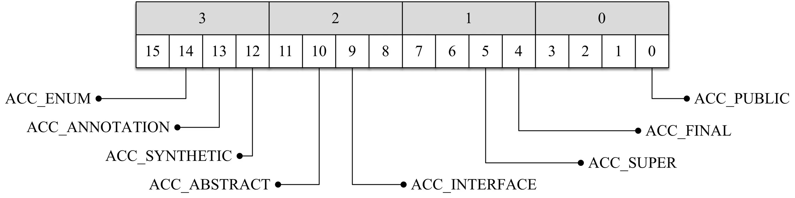
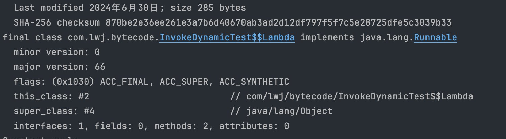

invokedynamic

https://www.cnblogs.com/wade-luffy/p/6058087.html


# JVM源码

## 编译JDK

一定要注意版本，要新都新

https://juejin.cn/post/6969389200416178213

https://www.jianshu.com/p/ee7e9176632c


https://developer.apple.com/download/all/?q=command

https://jdk.java.net/java-se-ri/22

```java
xcode-select  -v
xcode-select version 2405.
  
xcode-select --print-path
/Applications/Xcode.app/Contents/Developer
```


```sh
bash configure --with-debug-level=slowdebug --with-jvm-variants=server --enable-dtrace --disable-warnings-as-errors
```


```sh
#第一次编译的话需要编译全量  
make all

#也可以使用 compiledb
compiledb make all

#如修改了jdk后，增量的编译镜像
make images
```

## JVM 启动源码

```sh
java -classpath /Users/networkcavalry/Documents/GitHub/Framework/Java/JavaVirtualMachine/jvm/arthas/src/main/java  com.lwj.arthas.ArthasQuickStart2
java -cp . com.lwj.arthas.ArthasQuickStart2
java -c . com.lwj.arthas.ArthasQuickStart2
```

https://www.cnblogs.com/springmorning/p/17478964.html


# 类加载器相关


## 源码阅读工具

source insight


## Oop-Klass模型

https://juejin.cn/post/6844904054561193992

JVM参数：

-XX:+TraceClassLoading	打印类的加载日志

## 加载阶段

对.class文件加载到内存进行解析后生成klass信息，这些元信息存储在方法区。然后在堆区生成运行时class对象，也就是InstanceMirrorKlass的实例，也就是通过反射获取的class对象。

InstanceKlass 实例klass

- InstanceMirrorKlass 描述java.lang.class的实例，镜像Klass
- InstanceRefKlass 描述java.lang.ref.Reference的子类

ArrayKlass 数组klass

- TypeArrayKlass 基本类型数组对应的数据结构
- ObjArrayKlass 引用类型数组对应的数据结构


Klass中定义的静态属性也会保留在堆区


## 连接阶段（验证-准备-解析）

**验证**

1、文件格式验证
2、元数据验证
3、 宇节码验证
4、 符号引用验证

**准备**

为class对象中的静态变量分配内存，赋初值，就是数据类型的默认值


个人理解：因为我们的代码中可以只声明静态变量而不赋值，所以在class对象中需要提前把变量定义好，如果准备阶段不对静态属性赋值，后边jvm运行阶段中的class对象中则没有这个字段了。 

如果被fina/修饰，在编译的时候会给属性添加ConstantValue属性，准备阶段直接完成赋值，即没有初始化这一步

**解析**

类被加载后不一定会立马进行解析和初始化。初始化的时候会去检查是否完成解析。 

符号引用转换为直接引用，因为在加载阶段

符号引用：静态常量池的索引，此时还是类的全限定描述


直接引用：内存地址，可以看到下图中索引为3的常量就指向了一个内存地址值，这个就是指向类的class对象


常量池：

- 静态常量池
- 运行时常量池（存在运行时常量池缓存）
- 字符串常量池


类或接口的解析

字段解析

类方法解析

接口方法解析

方法类型解析

方法句柄解析

调用点限定符解析


## 初始化阶段

通过执行\<clinit>方法，对静态变量、静态代码块进行初始化。

如果只定义了静态变量但未赋值，也表示没有需要初始化的内容，不会生成\<clinit>方法。

如果静态变量被final修饰，表示该变量的指向不会变化，那么直接可以在准备阶段完成赋值，在初始化阶段同样不会生成\<clinit>方法。

一个字节码文件只有一个 \<clinit>方法，且clinit方法中代码顺序和java代码中的顺序一致。


类加载时不一定会触发该类的clinit调用。只有下边的情况会触发clinit方法：

1. new、getstatic、putstatic、invokestatic
2. 反射
3. 初始化一个子类的clinit会去加载并初始化其父类
4. 启动类（main函数所在类） 


### clinit初始化死锁

这种情况的死锁不是java级别的，而是jvm级别的死锁。因此像jstack或者jconsole监测不到死锁。

```java
package com.lwj.classLoader;

import java.util.concurrent.TimeUnit;

/**
 * Date: 2024/6/21
 * <p>
 * Description:
 *
 * @author 乌柏
 */
public class ClassLoaderDeadLock {

    public static void main(String[] args) {
        new Thread(() -> A.test()).start();
        new Thread(() -> B.test()).start();
    }

}

class A {
    static {
        System.out.println("classA init");

        try {
            TimeUnit.SECONDS.sleep(1);
        } catch (InterruptedException e) {
            throw new RuntimeException(e);
        }

        new B();
    }

    public static void test() {
        System.out.println("AAA");
    }
}


class B {
    static {
        System.out.println("classB init");

        try {
            TimeUnit.SECONDS.sleep(1);
        } catch (InterruptedException e) {
            throw new RuntimeException(e);
        }

        new A();
    }

    public static void test() {
        System.out.println("BBB");
    }
}
```


## 双亲委派机制

当发现一个类需要加载的时候，先委托其父类去加载该类，比如应用类加载器委托扩展类加载器，扩展类加载器委托启动类加载器，优先让顶级的类加载去加载类，如果父级加载不到，再由当前类加载器去加载。这样能保证核心路径的类优先被加载，比如rt.jar包所在的路径。


# 字节码

javac 编译java源文件

javac -g 编译时会加上局部变量表

同时编译父类和子类 javac -g Son.java Father.java

javap -c -v -p -l 反编译查看字节码

## 字段描述符


**方法描述符**（Method Descriptor）表示一个方法所需参数和返回值信息，表示形式为`( ParameterDescriptor* ) ReturnDescriptor`。 ParameterDescriptor 表示参数类型，ReturnDescriptor表示返回值信息，当没有返回值时用`V`表示。比如方法`Object foo(int i, double d, Thread t)`的描述符为`(IDLjava/lang/Thread;)Ljava/lang/Object;`


**Java 虚拟机规定义了 u1、u2、u4 三种数据结构来表示 1、2、4 字节无符号整数，**相同类型的若干条数据集合用表（table）的形式来存储。表是一个变长的结构，由代表长度的表头（n）和 紧随着的 n 个数据项组成。class 文件采用类似 C 语言的结构体来存储数据。

## 常量池

常量池结构如下所示：

```c
{
    u2             constant_pool_count;
    cp_info        constant_pool[constant_pool_count-1];
}
```

- 常量池大小（cp_info_count），常量池是 class 文件中第一个出现的变长结构，既然是池，就有大小，常量池大小的由两个字节表示。假设为值为 n，常量池真正有效的索引是 1 ~ n-1。0 属于保留索引，用来表示不指向任何常量池项。

- 常量池项（cp_info）集合，最多包含 n-1 个。为什么是最多呢？Long 和 Double 类型的常量会占用两个索引位置，如果常量池包含了这两种类型，实际的常量池项的元素个数比 n-1 要小。

  

常量池由常量项组成，Java 虚拟机目前一共定义了 14 种常量类型，这些常量名都以 "CONSTANT" 开头，以 "info" 结尾

每个常量项都由两部分构成：表示类型的 tag 和表示内容的字节数组，但u1可表示的范围是2个字节的有符号整数的范围。1个字节是8个二进制位，表示的范围是256个数字，字节码中是以16进制来表示的，只需要2位就能表示一个字节。

```c
cp_info {
    u1 tag;
    u1 info[];
}
```

字节码中是以16进制来表示的，1位可以表示16个数字，1个字节是8个二进制位，


**CONSTANT_Integer_info、CONSTANT_Float_info**

这两种结构分别用来表示 int 和 float 类型的常量，这两种类型的结构很类似，都用四个字节来表示具体的数值常量，它们的结构定义如下：

```c
CONSTANT_Integer_info {
    u1 tag;	 	 // 3 表示是为一个integer的常量项
    u4 bytes;  // 表示这个常量项需要4个字节，对应在字节码中就是8位
}

CONSTANT_Float_info {
    u1 tag; 	 // 4 表示是为一个float的常量项
    u4 bytes;	
}
```


Java 语言规范还定义了 boolean、byte、short 和 char 类型的变量，但在常量池中都会被当做 CONSTANT_Integer_info 来处理。


**CONSTANT_Long_info 和 CONSTANT_Double_info**

这两种结构分别用来表示 long 和 double 类型的常量，这两个结构类似，都用 8 个字节表示具体的常量数值。它们的结构如下：

```c
CONSTANT_Long_info {
    u1 tag;  // tag为5
    u4 high_bytes;
    u4 low_bytes;
}

CONSTANT_Double_info {
    u1 tag; // tag为6
    u4 high_bytes;
    u4 low_bytes;
}
```

**CONSTANT_Utf8_info**

CONSTANT_Utf8_info 存储的是经过 MUTF-8(modified UTF-8) 编码的字符串，结构如下:

```c
CONSTANT_Utf8_info {
    u1 tag; //tag为1
    u2 length; //表示长度
    u1 bytes[length]; //字节数组
}
```

由三部分构成：第一个字节是 tag，值为固定为 1，tag 之后的两个字节 length 表示字符串的长度，第三部分是采用 MUTF-8 编码的长度为 length 的字节数组。

如果要存储的字符串是"hello"，存储结构如下图所示


## 类访问标记

常量池之后存储的是访问标记（Access flags），用来标识一个类是是不是final、abstract 等，由两个字节表示总共可以有 16 个标记位可供使用，目前只使用了其中的 8 个。



具体的标记位含义如下：

| Flag Name      | Value | Interpretation                         |
| -------------- | ----- | -------------------------------------- |
| ACC_PUBLIC     | 1     | 标识是否是 public                      |
| ACC_FINAL      | 10    | 标识是否是 final                       |
| ACC_SUPER      | 20    | 已经不用了                             |
| ACC_INTERFACE  | 200   | 标识是类还是接口                       |
| ACC_ABSTRACT   | 400   | 标识是否是 abstract                    |
| ACC_SYNTHETIC  | 1000  | 编译器自动生成，不是用户源代码编译生成 |
| ACC_ANNOTATION | 2000  | 标识是否是注解类                       |
| ACC_ENUM       | 4000  | 标识是否是枚举类                       |

比如在使用Lambda的时候，JVM会在运行时使用ASM技术，动态生成对应的匿名内部类。

具体生成的过程可以参考invokeDynamic命令。


## 栈帧

主要是由局部变量表和操作数栈组成。

# 虚拟机指令	

if_icmpge     21    // 将操作数栈顶的两个元素进行比较, 如果 次顶部元素 >= 顶部元素，则重定向到偏移量为 21 的指令

像这种需要多个参数的指令，靠近栈顶的是最靠后的参数。


## 5种方法调用指令

- invokestatic：用于调用静态方法
- invokespecial：用于调用priveate私有实例方法、final修饰的方法，构造器，以及使用 super 关键字调用父类的实例方法或构造器，和所实现接口的默认方法
- invokevirtual：用于调用非私有实例方法
- invokeinterface：用于调用接口方法
- invokedynamic：用于调用动态方法


**静态绑定和动态绑定**

在编译时时能确定目标方法叫做**静态绑定**，相反地，需要在运行时根据调用者的类型动态识别的叫**动态绑定**。

- invokestatic 用来调用静态方法，即使用 static 关键字修饰的方法。 它要调用的方法在编译期间确定，运行期不会修改，属于静态绑定。

- invokespecial 用在在类加载时就能确定需要调用的具体方法，而不需要等到运行时去根据实际的对象值去调用该对象的方法。private 方法不会因为继承被覆写的，所以 private 方法归为了 invokespecial 这一类。

- invokevirtual 用在方法要根据对象类型不同动态选择的情况，在编译期不确定。invokevirtual 会根据对象的实际类型进行分派（虚方法分派），在编译期间不能确定最终会调用子类还是父类的方法。

- invokeinterface 每个类文件都关联着一个「虚方法表」（virtual method table），这个表中包含了父类的方法和自己扩展的方法。为了在运行时快速确定调用的是父类方法或者当前类方法，B继承A类的时候，同样也会继承A的虚方法表，如果B重写了method2方法，同时也会替换虚方法表的函数引用，invokevirtual 可以直接根据固定索引快速定位要执行的方法。

  示例如下：

  ```java
  // invokevirtual
  class A {
      public void method1() { }
      public void method2() { }
      public void method3() { }
  }
  
  class B extends A {
      public void method2() { } // overridden from BaseClass
      public void method4() { }
  }
  
  ```
  
  对应的虚方法表如下：
  
  
  
  而invokevirtual 调用 methodX 就不能直接从固定的虚方法表索引位置拿到对应的方法链接。invokeinterface 不得不搜索整个虚方法表来找到对应方法，效率上远不如 invokevirtual
  
  ```java
  // invokeinterface
  interface X {
      void methodX()
  }
  class B extends A implements X {
      public void method2() { } // overridden from BaseClass
      public void method4() { }
      public void methodX() { }
  }
  Class C implements X {
      public void methodC() { }
      public void methodX() { }
  }
  
  ```
  
  

**invokedynamic指令**

首先补充一些前置知识。

java的是强类型语言，编译的时候会检查入参的类型和返回值的类型，在方法调用的时候还会去检查调用的对象类和调用对象是否包含该方法名。

MethodHandle

方法句柄或者方法指针。它为了支持Java中把函数作为参数传递。它类似反射中的Method类。但比Method更灵活和轻量级。

```java
public class Foo {
    public void print(String s) {
        System.out.println("hello, " + s);
    }
    public static void main(String[] args) throws Throwable {
        Foo foo = new Foo();

        MethodType methodType = MethodType.methodType(void.class, String.class);
        MethodHandle methodHandle = MethodHandles.lookup().findVirtual(Foo.class, "print", methodType);
        methodHandle.invokeExact(foo, "world");
    }
}

运行输出
hello, world
```


invokedynamic指令在第一次调用的时候不知道具体调用哪个方法，会先调用一次 Bootstrap方法，该方法会返回一个CallSite对象。

```java
public static CallSite bootstrap(
    Lookup caller, // the caller
    String callType, // the type of the call
    MethodType type, // the MethodType
    String name, // the real method name
    int flags // call flags
    ) {
}
```

其中就包含了真正要调用的MethodType。后续的调用会直接调用目标方法，不经过Bootstrap Method方法。


简化成伪代码：

```java
public static void main(String[] args) throws Throwable {
    MethodHandles.Lookup lookup = MethodHandles.lookup();
    MethodType mt = MethodType.methodType(Object.class,
            Object.class, Object.class);
    CallSite callSite =
            IndyInterface.bootstrap(lookup, "invoke", mt, "add", 0);
    MethodHandle mh = callSite.getTarget();
    mh.invoke(obj, "hello", "world");
}
```


invokeDynamic提供了一种调用方法的新方式，将动态方法的分派逻辑下放到了语言实现层。它告诉JVM可以延迟确认真正的目标方法。一开始执行的时候不知道具体的调用目标，只有第一次调用引导方法（Bootstrap Method）后，由这个引导方法决定哪个目标方法进行调用。而且这个指令是JVM层面的，只要能生成对应的指令，都可以在JVM上执行，不区分到底是什么编程语言。目前Java 虚拟机已经可以支持很多除Java *语言*以外的*语言*了，如Kotlin、Groovy、JRuby、Jython、Scala 等。


## lambda背后的字节码原理

```java
public class InvokeDynamicTest {
    public static void main(String[] args) {
        Runnable r = () -> {
            System.out.println("hello, lambda");
        };
        r.run();
    }
}
```

编译后的字节码指令中，除了main方法，还额外生成了lambda\$main$0方法，这个方法是 private static synthetic（编译器生成的），里边包含了我们定义的方法内容。再来看main方法，就lambda表达式声明的地方会生成一个 invokedynamic指令，同时还生成了对应的引导方法 Bootstrap Methods。


```java
BootstrapMethods:
  0: #43 REF_invokeStatic java/lang/invoke/LambdaMetafactory.metafactory:(Ljava/lang/invoke/MethodHandles$Lookup; Ljava/lang/String; Ljava/lang/invoke/MethodType; Ljava/lang/invoke/MethodType; Ljava/lang/invoke/MethodHandle; Ljava/lang/invoke/MethodType;) Ljava/lang/invoke/CallSite;
    Method arguments:
      #39 ()V
      #40 REF_invokeStatic com/lwj/bytecode/InvokeDynamicTest.lambda$main$0:()V
      #39 ()V

```

第一次执行的invokedynamic指令时，会调用到引导方法，java.lang.invoke包下的LambdaMetafactory.metafactory方法，该方法返回一个动态调用对象CallSite，这个CallSite中的MethodHandle就是最终要执行的方法句柄或者说方法指针。

```java
 public static CallSite metafactory(
    MethodHandles.Lookup caller,
    String invokedName,
    MethodType invokedType,
    MethodType samMethodType,
    MethodHandle implMethod,
    MethodType instantiatedMethodType
)
 /**
metafactory 各个参数含义如下：

- caller：JVM 提供的查找上下文
- invokedName：表示调用函数名，在本例中 invokedName 为 "run"
- samMethodType：函数式接口定义的方法签名（参数类型和返回值类型），本例中为 run 方法的签名 "()void"
- implMethod：编译时生成的 lambda 表达式对应的静态方法`invokestatic Test.lambda$main$0`
- instantiatedMethodType：一般和 samMethodType 是一样或是它的一个特例，在本例中是 "()void"
*/
```

LambdaMetafactory.metafactory方法，中的核心逻辑是 new InnerClassLambdaMetafactory，这里边会通过ASM生成对应的匿名内部类。

```java
  public static CallSite metafactory(MethodHandles.Lookup caller,
                                       String interfaceMethodName,
                                       MethodType factoryType,
                                       MethodType interfaceMethodType,
                                       MethodHandle implementation,
                                       MethodType dynamicMethodType)
            throws LambdaConversionException {
        AbstractValidatingLambdaMetafactory mf;
	    //核心方法
        mf = new InnerClassLambdaMetafactory(Objects.requireNonNull(caller),
                                             Objects.requireNonNull(factoryType),
                                             Objects.requireNonNull(interfaceMethodName),
                                             Objects.requireNonNull(interfaceMethodType),
                                             Objects.requireNonNull(implementation),
                                             Objects.requireNonNull(dynamicMethodType),
                                             false,
                                             EMPTY_CLASS_ARRAY,
                                             EMPTY_MT_ARRAY);
        mf.validateMetafactoryArgs();
        return mf.buildCallSite();
    }
```

通过打印的方式查看类名，可以看出这个类是InvokeDynamicTest的内部类，因为内部类才能调用外部类私有方法。

```java
Runnable r = ()->{
    System.out.println("hello, lambda");
};

System.out.println(r.getClass().getName());

//输出：
com.lwj.bytecode.InvokeDynamicTest$$Lambda/0x0000180001003528
```

可以通过 `-Djdk.invoke.LambdaMetafactory.dumpProxyClassFiles` 参数将生成类dump出来，生成路径是java/DUMP_LAMBDA_PROXY_CLASS_FILES/com/lwj/bytecode/InvokeDynamicTest$$Lambda.0x000007f001000a10.class，直接idea查看反编译后的源码，可以看到run方法的具体实现中，直接去调用InvokeDynamicTest中的编译器生成的静态方法 lambda$main$0。

```java
//
// Source code recreated from a .class file by IntelliJ IDEA
// (powered by FernFlower decompiler)
//

package com.lwj.bytecode;

// $FF: synthetic class
final class InvokeDynamicTest$$Lambda implements Runnable {
    private InvokeDynamicTest$$Lambda() {
    }

    public void run() {
        InvokeDynamicTest.lambda$main$0();
    }
}

```

通过javap命令查看字节码文件，也可以看到具体的实现。com.lwj.bytecode.InvokeDynamicTest$$Lambda/0x0000180001003528

由于ASM生成的字节码没有源文件，无法通过jclasslib查看字节码，所以通过javap命令来查看。

```java
 javap -c -p -v  InvokeDynamicTest\$\$Lambda.0x0000180001003528.class 
```




总结一下，编译器会对lambda表达式的内容生成对应的私有静态方法，并且在调用的地方生成invokeDynamic指令和引导方法。在第一次执行指令时，会由引导方法中的 LambdaMetafactory.metafactory 工厂方法 通过ASM动态生成实现对应接口的匿名内部类，具体接口的实现逻辑则是回调了前边的私有静态方法（lambda定义类中编译器生成的），真正执行lambda时还是通过 invokeinterface指令，因为本质是还是生成了实现该接口的匿名内部类。

关于 invokedynamic 补充说明：

> invokedynamic 与之前四个 invoke 指令最大的不同就在于它把方法分派的逻辑从虚拟机层面下放到程序语言。 lambda 表达式采用的方式是不在编译期间就生成匿名内部类，而是提供了一个稳定的字节码二进制表示规范，对用户而言看到的只有 invokedynamic 这样一个非常简单的指令。用 invokedynamic 来实现就是把翻译的逻辑隐藏在 JDK 的实现中，后续想替换实现方式非常简单，只用修改 LambdaMetafactory.metafactory 里面的逻辑就可以了，这种方法把 lambda 翻译的策略由编译期间推迟到运行时。


## 多态原理—HSDB查看虚方法表

HSDB 查看代理类class

HSDB：HotSpot Debugger Jvm自带工具，用于查看JVM运行时的状态

使用jhsdb时，保证作为attach目标的进程JDK版本和jhsdb所在的JDK版本一致

```java
jhsdb hsdb 
```

**测试代码**

```java
abstract class A {
    public void printMe() {
        System.out.println("I love vim");
    }

    public abstract void sayHello();
}

class B extends A {
    @Override
    public void sayHello() {
        System.out.println("hello, i am child B");
    }
}

public class MyTest extends Object {
    public static void main(String[] args) throws IOException {
        A obj = new B();
        A obj2 = new B();
        System.out.println(obj);
        System.in.read();
    }
}
```

通过class Brower查看类元信息的内存地址，再通过Inspector查看klass模型的信息内容。可以看到 vtable虚方法表的长度是7个，表示有7个函数，其中5个是继承自Object的方法，剩下两个一个是继承A类的printMe方法，另一个是B类自己定义的sayHello方法。如果想看到虚方法表在内存的地址，需要用到hsdb的控制台命令mem，使用该命令可以看到虚方法表中的实际的方法执行地址。


JVM中虚方法表是紧挨instanceKlass的，上图中B类的instanceKlass的起始地址是0x0000300001002c30，instanceKlass的长度需要通过 sizeof（instanceKlass）来获取，通过jdk源码获取 472=0x1D8（不同环境会有不同），所以vtable的偏移量地址是 0x0000300001002c30 + 0x1d8 =  0x0000300001002e08


通过 mem 0x0000300001002e08/7 查看往后的7个引用地址。可以看到B类的虚方法中前5个首先是指向Object中未被final修饰的方法，第六个方法重写了父类sayHello方法，指向自己，第七个方法指向父类A的printMe方法。

这个为什么只有非final方法的指向，原因是这个虚方法表主要是为invokevirtual指令来确定在运行时期的真正方法调用的，也就是多态的真正调用方法。private、final static修饰的方法在类加载就能确定具体方法。


## i++ 和 ++i

iinc 0 by 1 对局部变量表中 index为0 的变量增加 1

```java
public static int foo3() {
      int x = 1;
      x = x++;
      return x;
  }
// output 1
0 iconst_1
1 istore_0
2 iload_0
3 iinc 0 by 1 
6 istore_0
7 iload_0
8 ireturn
```

```java
public static int foo4() {
    int x = 1;
    x = ++x;
    return x;
}
// output 2
0 iconst_1
1 istore_0
2 iinc 0 by 1
5 iload_0
6 istore_0
7 iload_0
8 ireturn
```

## try catch finally

finally中的代码复制到所以可能函数退出的地方，比如try代码块和catch代码块中。

## try with resource

```java
public static void foo() throws Exception {
    AutoCloseable c = null;
    Exception tmpException = null;
    try {
        c = dummy();
        bar();
    } catch (Exception e) {
      //这里把业务异常保留了下来
        tmpException = e;
        throw e;
    } finally {
        if (c != null) {
            if (tmpException != null) {
                try {
                    c.close();
                } catch (Exception e) {
                  //这里将close失败被压制的异常添加回来
                    tmpException.addSuppressed(e);
                }
            } else {
                c.close();
            }
        }
    }
}

```


## synchronized

**对于代码块级的synchronized**

字节码中使用 monitorenter来完成加锁，使用 monitorexit来完成解锁，无论方法是否正常返回，锁都会释放。

因为编译器必须保证，无论同步代码块中的代码以何种方式结束（正常 return 或者异常退出），代码中每次调用 monitorenter 必须执行对应的 monitorexit 指令。为了保证这一点，编译器会自动生成一个异常处理器，这个异常处理器的目的就是为了同步代码块抛出异常时能执行 monitorexit。这也是字节码中，只有一个 monitorenter 却有两个 monitorexit 的原因。

**方法级的synchronized**

方法级的同步与上述有所不同，它是由常量池中方法的 ACC_SYNCHRONIZED 标志来隐式实现的。

JVM 不会使用特殊的字节码来调用同步方法，当 JVM 解析方法的符号引用时，它会判断方法是不是同步的（检查方法 ACC_SYNCHRONIZED 是否被设置）。如果是，执行线程会先尝试获取锁。如果是实例方法，JVM 会尝试获取实例对象的锁，如果是类方法，JVM 会尝试获取类锁。类锁其实锁的类class对象。在同步方法完成以后，不管是正常返回还是异常返回，都会释放锁。

验证类锁锁的是class对象：

```java
public class ClassSynchronizedTest {

    public void test1() {
        synchronized (ClassSynchronizedTest.class) {
            try {
                System.out.println(1);
                TimeUnit.SECONDS.sleep(1000);
            } catch (InterruptedException e) {
                throw new RuntimeException(e);
            }
        }
    }

    public static synchronized void test2() {
        System.out.println(2);
    }

    public static void main(String[] args) {
        new ClassSynchronizedTest().test1();
        test2();
    }
}
```


# 其他

## 对象实例化

每一个构造方法都会对应一个\<init>方法，每个\<init>方法中都会包含类中定义的代码块，每次调用时都会触发代码块的调用。

准备阶段为静态变量赋初值，初始化阶段完成静态变量初始化。
