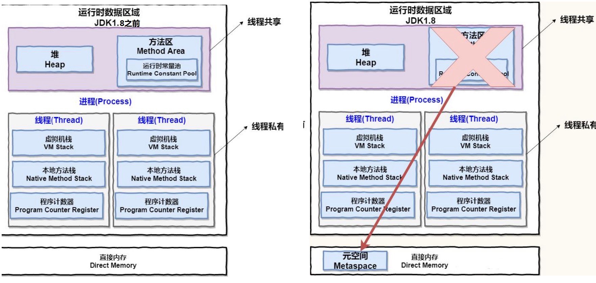
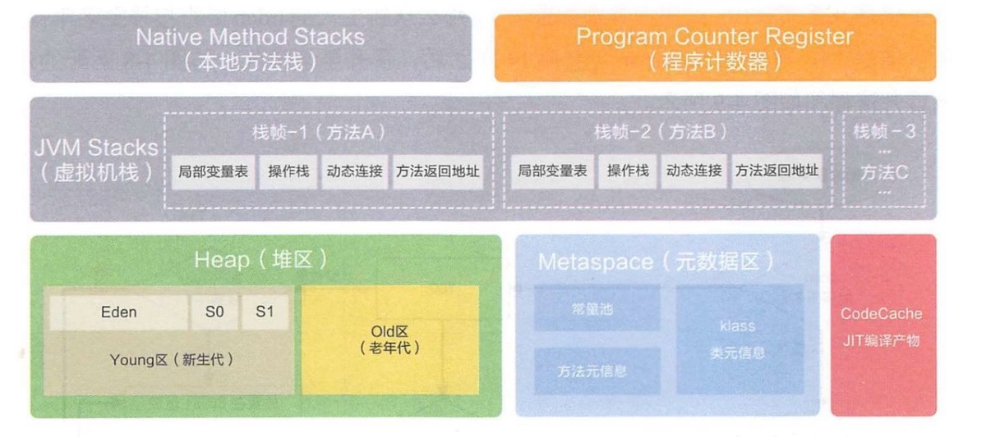

20集

# Java 内存结构变化

https://blog.csdn.net/xiaojin21cen/article/details/105300521

https://www.cnblogs.com/holos/p/6603379.html

## Java7 和 Java8的内存结构差异

1. 移除了永久代（PermGen），替换为元空间（Metaspace）

   方法区只是一种概念上的区域，实际的实现方式是永久代，而方法区改名为元空间。元空间的实现方式是直接内存。

2. 常量池调整，常量池区分字符串常量池和运行时常量池。

   - 字符串常量池（interned Strings），在Java 6及之前位于 方法区 中，从Java 7开始，被移动到 堆内存 中。
   - 运行时常量池 ，运行时常量池 是方法区的一部分，跟随着方式区的变化而变化 。在Java 7之前位于 方法区（永久代） 中，从Java 8开始，变成 方法区 （元空间 Metaspace）。

3. 永久代中的class metadata（类元信息）转移到了native memory（本地内存，而不是虚拟机） 

4. 永久代中的class static variables（类静态变量）转移到了Java heap 

5. 永久代参数（PermSize MaxPermSize）-> 元空间参数（MetaspaceSize MaxMetaspaceSize）