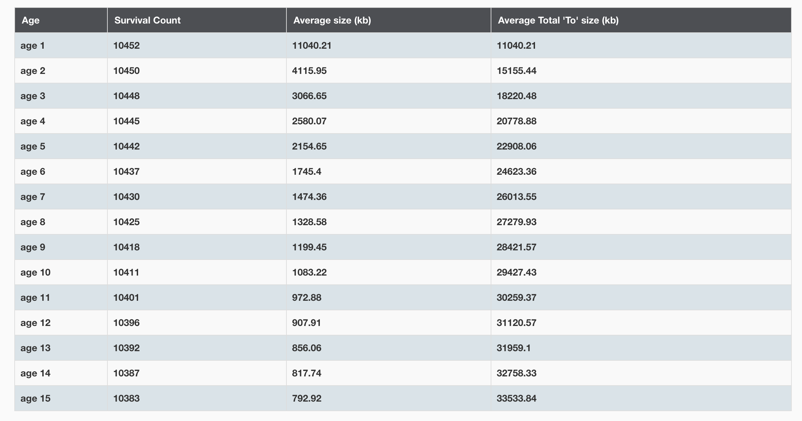

20集

# Java 内存结构变化

https://blog.csdn.net/xiaojin21cen/article/details/105300521

https://www.cnblogs.com/holos/p/6603379.html


## Java7 和 Java8的内存结构差异

1. 移除了永久代（PermGen），替换为元空间（Metaspace）

   方法区只是一种概念上的区域，实际的实现方式是永久代，而方法区改名为元空间。元空间的实现方式是直接内存。

2. 常量池调整，常量池区分字符串常量池和运行时常量池。

   - 字符串常量池（interned Strings），在Java 6及之前位于 方法区 中，从Java 7开始，被移动到 堆内存 中。
   - 运行时常量池 ，运行时常量池 是方法区的一部分，跟随着方式区的变化而变化 。在Java 7之前位于 方法区（永久代） 中，从Java 8开始，变成 方法区 （元空间 Metaspace）。

3. 永久代中的class metadata（类元信息）转移到了native memory（本地内存，而不是虚拟机） 

4. 永久代中的class static variables（类静态变量）转移到了Java heap 

5. 永久代参数（PermSize MaxPermSize）-> 元空间参数（MetaspaceSize MaxMetaspaceSize）


pilot-core

6台4C8G

```
-Xmx5440M -Xms5440M -XX:MaxMetaspaceSize=512M -XX:MetaspaceSize=512M -XX:+UnlockExperimentalVMOptions -XX:+UseG1GC -XX:MaxGCPauseMillis=100 -XX:+ParallelRefProcEnabled -XX:ErrorFile=/opt/hs_err_pid%p.log -XX:HeapDumpPath=/opt/zcy/modules/java.hprof -XX:+HeapDumpOnOutOfMemoryError -Xloggc:/opt/zcy/modules/gc.log -XX:+PrintGCDateStamps -XX:+PrintGCDetails -XX:+PrintGCApplicationStoppedTime -XX:+PrintGCApplicationConcurrentTime -XX:+PrintGCCause -XX:+PrintPromotionFailure -XX:+PrintTenuringDistribution -XX:+PrintHeapAtGC -XX:+PrintAdaptiveSizePolicy -XX:+PrintCommandLineFlags
```

item-center

10台 6C16G 

```
-Xmx8g -Xms8g -XX:+UnlockExperimentalVMOptions -XX:+UseG1GC -XX:MaxGCPauseMillis=200 -XX:G1MaxNewSizePercent=45 -XX:G1ReservePercent=10 -XX:InitiatingHeapOccupancyPercent=40 -XX:G1HeapRegionSize=32M -XX:+PrintAdaptiveSizePolicy -XX:+PrintCommandLineFlags -XX:ErrorFile=/opt/zcy/modules/log/hs_err_%p.log -XX:+HeapDumpOnOutOfMemoryError -XX:HeapDumpPath=/opt/zcy/modules/log/ -Xloggc:/opt/zcy/modules/log/gc.log -XX:+PrintGCDateStamps -XX:+PrintGCDetails -XX:+PrintGCApplicationStoppedTime -XX:+PrintGCCause -XX:+PrintPromotionFailure -XX:+PrintTenuringDistribution -XX:+PrintHeapAtGC -Drocketmq.client.logFileMaxIndex=4 -Drocketmq.client.logFileMaxSize=67108864 -Dons.client.logFileMaxIndex=2 -javaagent:/opt/artisan-agent/artisan-agent.jar=collector.backend_service=http://ipaas.cai-inc.com,agent.service_name=item-microservice-center	
```

线上jvm优化

观察分代情况，发现age10到age15 中80%的对象都会晋升，而且老年代的占用是比较低的 ，所以可以调低新生代晋升老年代的晋升年龄到age10，这样可以减少从survivor from 到 survivor to的重复对象复制，因为在垃圾回收过程中，对象的复制成本是比较高的。

