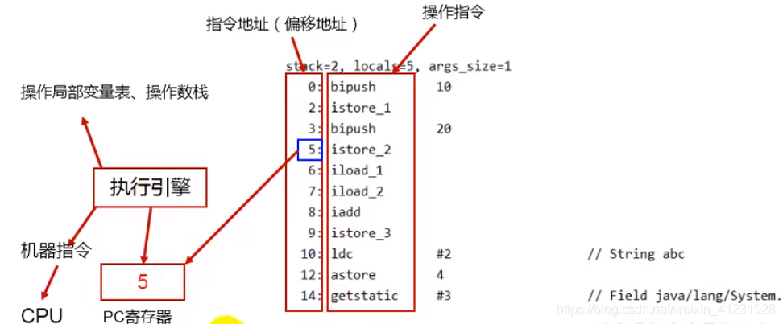
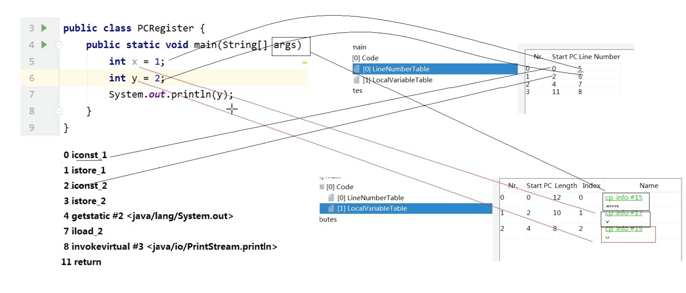
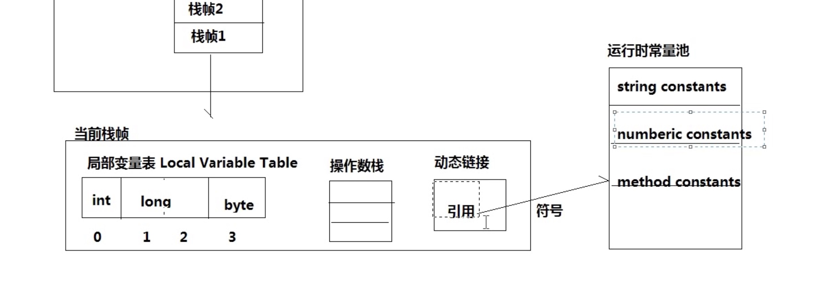
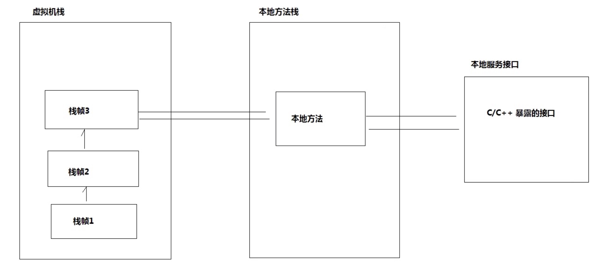

### 方法区Java8之后的变化

- 移除了永久代（PermGen），替换为元空间（Metaspace） 

- 永久代中的class metadata（类元信息）转移到了native memory（本地内存，而不是虚拟机） 

- 永久代中的interned Strings（字符串常量池） 和 class static variables（类静态变量）转移到了Java heap 

- 永久代参数（PermSize MaxPermSize）-> 元空间参数（MetaspaceSize MaxMetaspaceSize）

  

在 Hotspot 中 **永久代（Permanent Generation）从 JDK 1.8 中已经废弃 **，并且永久代不等于方法区，Hotspot 虚拟机（其他虚拟机不存在永久代概念）使用永久代来实现方法区




### PC 程序计数器

什么是程序计数器

程序计数器（Program Counter Register）:也叫PC寄存器，是一块较小的内存空间，它可以看做是当前线程所执行 的字节码的行号指示器。在虚拟机的概念模型里，字节码解释器工作时就是通过改变这个计数器的值来选取下一条 需要执行的字节码指令、分支、循环、跳转、异常处理、线程恢复等基础功能都需要依赖这个计数器来完成。

PC寄存器的特点

（1）区别于计算机硬件的pc寄存器，两者不略有不同。计算机用pc寄存器来存放“伪指令”或地址，而相对于虚拟 机，pc寄存器它表现为一块内存，虚拟机的pc寄存器的功能也是存放伪指令，更确切的说存放的是将要执行指令的 地址。

（2）当虚拟机正在执行的方法是一个本地（native）方法的时候，jvm的pc寄存器存储的值是undefined。

（3）程序计数器是线程私有的，它的生命周期与线程相同，每个线程都有一个。

（4）此内存区域是唯一一个在Java虚拟机规范中没有规定任何OutOfMemoryError情况的区域。


Java虚拟机的多线程是通过线程轮流切换并分配处理器执行时间的方式来实现的，在任何一个确定的时刻，一个处 理器只会执行一条线程中的指令。

因此，为了线程切换后能恢复到正确的执行位置，每条线程都需要有一个独立的程序计数器，各条线程之间的计数 器互不影响，独立存储，我们称这类内存区域为“线程私有”的内存。


   



### 局部变量表

```
NetworkCavalry-MBP:memory networkcavalry$ javac -g:vars PCRegister.java 
NetworkCavalry-MBP:memory networkcavalry$ javap -v -l PCRegister.class 
```

局部变量表中首先会依次存放方法的入参

 iconst_1 将int 1 保存到操作数栈中

istore_1 将栈顶元素保存到局部变变量表中1号索引的位置

iload_2 将局部变量表中2号索引位置的元素压入操作数栈中

 

### 动态链接

Java虚拟机栈中，每个栈帧都包含一个指向运行时常量池中该栈所属方法的符号引用，持有这个引用的目的是为了 支持方法调用过程中的动态链接(Dynamic Linking)。

动态链接的作用:将符号引用转换成直接引用。




可以看到  invokestatic #2 <java/lang/Math.random : ()D>   这里就是符号引用，无法直接去调用，需要在转换为直接引用才能执行

具体的Math.random（）是在常量池中定义


### 本地方法栈




比如说，在多线程环境下，其他线程可能会更新已经访问过的对象中的引用，从而造成误报（将引用设置为 null）或者漏报（将引用设置为未被访问过的对象）。

误报并没有什么伤害，Java 虚拟机至多损失了部分垃圾回收的机会。漏报则比较麻烦，因为垃圾回收器可能回收事实上仍被引用的对象内存。一旦从原引用访问已经被回收了的对象，则很有可能会直接导致 Java 虚拟机崩溃。

=======================

这里我觉得讲的不太好，容易让人误解，特地加了下自己的理解，如有错误，忘指正。

原文中 “其他线程可能会更新已经访问过的对象中的引用”，这里已经访问过的对象，应该指的是已经被GC 回收器根据可达性分析算法标记过（标记成存活或者死亡）的对象。

然后误报跟漏报的场景，也没有讲清楚，我理了下具体可能存在的场景：

比如GC Roots集合：[a,b,c,d,e,f]其中a,b,c,d,e,f 都是存活对象，g,h,i,j,k,l 都是可回收对象，GC回收线程回收时，假如有另一个线程，将引用a 对象的引用设置为null，此时理论上a 对象也应该被回收，但是a 对象处于GC Roots集合中，所以只能等到下次GC回收。如果另一个线程，创建并引用了一个新的对象m, 因为m 不在GC Roots 集合中，所以也会被垃圾回收器回收掉，这就导致另一个线程访问了被回收的对象。
