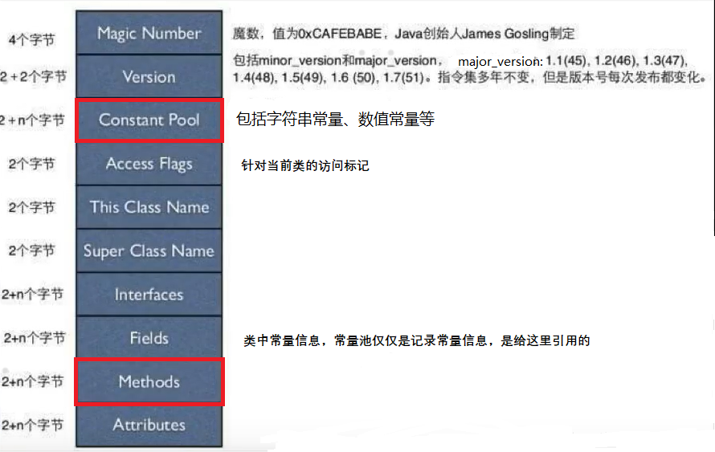
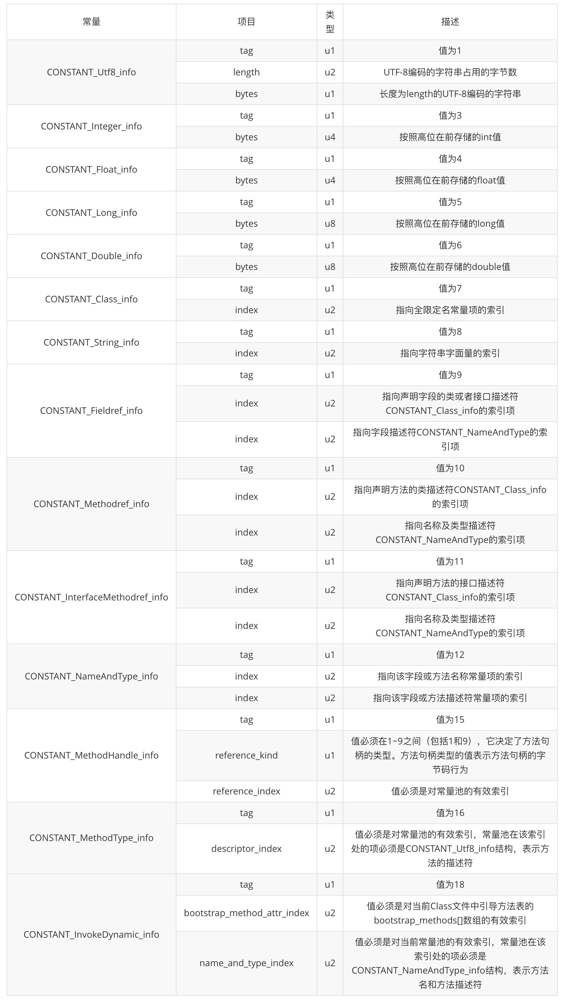
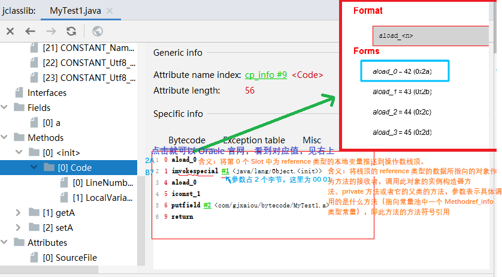
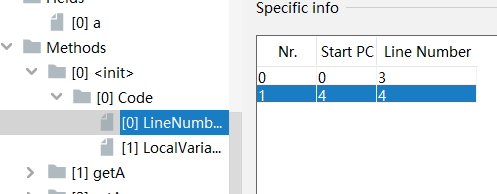
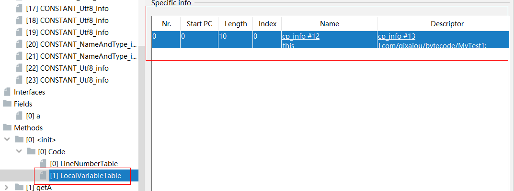
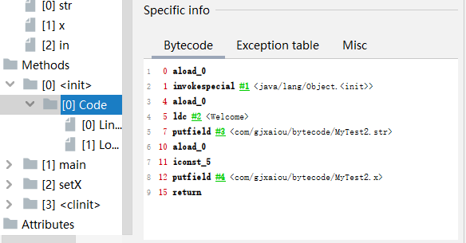

分析工具：IDEA + Jclasslib 

​		字节码（ByteCode），是构成 **平台无关性** 和 **语言无关性** 的基石，是一个承上启下的部分，“承上” 是指不关注语言本身，只关注其编译后的产物——字节码，只要符合JVM规范的，就可以在虚拟机上执行，如Java、Kotlin、Scala和Groovy；”启下“是指不关注操作系统，就像那句非常著名的口号：“一次编写，到处运行”，虚拟机厂商提供运行在各种不同平台上的虚拟机，这些虚拟机都可以运行与平台无关的字节码。

----


下面将从该程序编译生成的字节码文件和其对应的十六进制进行分析

```java
package com.lwj.bytecode;

public class Test1{
    private int a=1;
    public int getA(){
        return a;
    }
    public void setA(int a){
        this.a=a;
    }
}
```

通过 javac Test1.java  编译生成 Test1.class 文件，直接打开的内容如下：


​		这些十六进制的数字其实就是Class 文件的真面目，第一次看可能有些不适应，毫无头绪。毕竟字节码需要能在机器识别的前提下做到最精简，因此各个数据部分严格按照顺序紧凑的排列在Class文件中，中间没有添加任何分隔符。其实这些数字都是有规律可循的，当然我们需要参考一些资料。

​		上面是按照十六进制的单字节格式进行显示，每两个字节之间使用空格隔开，一个字节是8位，一个16进制数（就是上面一个字母或者一个数，0～f对应0～15）占据四位，所以两个在一起正好是一个字节；

​		备注：二进制，是计算机为了快速方便而采用的一种记数方式，十六进制也是一种常用的记数方式。位（bit）就是一个二进制位，即可表示0和1，而字节(Byte)是计算机更通用的计算单位，1字节等于8位，可以代表256个数字（在编程中可以通过这些数字作为判断），int类型一般为4字节，即32位。一个十六进制数，如0xf，代表16个数字，2的4次方，即4位，所以两个十六进制数如0xff就是一个字节。

​		接下来就让我们来一探究竟，看看这些字节码是如何表示Java代码的。

# 1. 字节码整体结构

## 1.1 概述

**Class 字节码中有两种数据类型**：

- 字节数据直接量（无符号数）：这是基本的数据类型。共细分为u1、u2、u4、u8四种，分别代表连续的1个字节、2个字节、4个字节、8个字节组成的无符号数据，可以用来描述数字、索引引用、数量值或者按照 UTF-8 编码构成的字符串值。
- 表/数组（无符号表）：表是由多个基本数据或其他表，按照既定顺序组成的大的数据集合。表都以 “_info" 结尾，表是有结构的，它的结构体表现在：组成表的成分所在的位置和顺序都是已经严格定义好的。**整个 class 文件本质上就是一张表**

- 字节码文件的结构图：

  [](./img/20190823162350340.png)

  

- 更加详细的结构为： Class 文件格式

  | **类型**       | **名称**                          | **数量**                |
  | -------------- | --------------------------------- | ----------------------- |
  | u4             | magic（魔数）                     | 1                       |
  | u2             | minor_version（次版本号）         | 1                       |
  | u2             | major_version（主版本号）         | 1                       |
  | u2             | constant_pool_count（常量个数）   | 1                       |
  | cp_info        | constant_pool（常量池表）         | constant_pool_count - 1 |
  | u2             | access_flags（类的访问控制权限）  | 1                       |
  | u2             | this_class（类名）                | 1                       |
  | u2             | super_class（父类名）             | 1                       |
  | u2             | interfaces_count（接口个数）      | 1                       |
  | u2             | interfaces（接口名）              | interfaces_count        |
  | u2             | fields_count（域个数）            | 1                       |
  | field_info     | fields（域的表）                  | fields_count            |
  | u2             | methods_count（方法的个数）       | 1                       |
  | method_info    | methods（方法表）                 | methods_count           |
  | u2             | attribute_count（附加属性的个数） | 1                       |
  | attribute_info | attributes（附加属性的表）        | attributes_count        |

  字节码的排列也是严格按照这个顺序来的。

# 2. 字节码文件具体分析

## 2.1 魔数（magic）

- Class文件格式表中第一项就是就是magic，是u4类型，代表占用4个字节，对应.class文件中的前四个字节`cafebabe`

- 用于确定这个文件是否为一个能被虚拟机接受的 Class 文件（相比文件后缀名更加安全）。

  

## 2.版本号（version）

- 魔数后面 4 个字节是版本信息，前两个字节表示 minor_version（次版本号），后两个字节表示major_version（主版本号），因此这里值 `00 00 00 34 `对应十进制为 `00 00 00 52`，表示次版本号为 0，主版本号为 1.8（ 52对应 jdk 1.8）。**低版本的编译器编译的字节码可以在高版本的JVM下运行，反过来则不行**。

  ```doc
  // 主版本号：1.8，次版本号为：0，更新号为：144
  $ java -version
  java version "1.8.0_144"
  Java(TM) SE Runtime Environment (build 1.8.0_144-b01)
  Java HotSpot(TM) 64-Bit Server VM (build 25.144-b01, mixed mode)
  ```


## 3.常量池（constant pool）：

​	为了方便在解释概念的时候举例，这里先贴出一份使用`javap -v `反编译后的常量池截图：

​	

​		主版本号之后的就是常量池部分，**一个 Java 类定义的很多信息都是由常量池来维护和描述的**，可以将常量池看作是 Class 文件的资源仓库，包括 Java 类定义的方法和变量信息，**常量池中主要存储两类常量：字面量和符号引用**。

- 字面量（Literal）：如文本字符串、Java 中声明的 final 常量值等，如上图中Utf8类型的内容，如`a`、`I`、`<init>`等。

- 符号引用（Symbolic References）：如类和接口的全局限定名（包名加类名，如#4  com/lwj/bytecode/Test1），字段的名称和描述符，方法的名称和描述符（注：这里的描述符不是像源代码中的 public void 这样的，而是各种源代码中描述符的一种对应的映射，不同 JVM 中同样表示 public 含义不同修饰值的对应描述符是一致的，简单来说就是描述这个方法的参数类型及返回值类型 或者是 字段的类型，如#6就是int类型，#12是无参方法返回int类型，#14是一个int类型参数方法且无返回值）。
  
  原因：因为使用 Javac 编译的时候不会连接，是 JVM 加载 Class 文件时候进行动态连接，因此如果**不经过运行期的转换，字段和方法的符号引用就找不到真正的内存地址，则无法被 JVM 使用**，因此需要当 JVM 运行的时候从常量池中获取对应的符号引用，然后在类创建或者运行时候解析获取到真正的内存地址。

​		常量池部分主要由**常量池数量**和**常量池数组**（又称为表结构）两部分共同构成，u2类型的常量池数量紧跟在主版本号后面，占据两个字节；接着就是常量池表中的一个个常量了。

- 示例中的常量池数量为`0x0015`，对应十进制就是21，意味着常量池中有21个常量，但是编译后的常量池截图中确是从#1到#20，一个20个常量，这是由于在Class文件格式规范制定之时，设计者将第#0项常量空出来表达“不引用任何一个常量池项目”的含义，所以常量池中的索引都是从1开始，对于其他的集合类型，如接口索引集合、字段表集合、方法表集合等均从 0 开始。

- 常量池数组与一般数组不同的是：常量池数组中元素的类型、结构都是不同的，长度当然也就不同，但是每一种元素的第一个数据都是一个 u1 类型标志位，占据一个字节，JVM 在解析常量池时，就会根据这个u1 类型的来获取对应的元素的具体类型。 

  常量池中每一项常量都是一个表，下面是 14 种不同的表结构，后三种为 1.7 之后增加了支持动态语言调用：`CONSTANT_MethodHandle_info、CONSTANT_MethodType_info、CONSTANT_InvokeDynamic_info`，**14 种表中所有的表的第一位都是一个 u1 类型的标志位（tag），具体取值看下面对应的描述**；

[](./img/595137-20181219204338051-305022474.png)

以 CONSTANT_UTF-8_info 型常量结构为例，bytes 中是一个长度为 length 字节的连续数据是一个使用 UTF-8 缩略编码表示的字符串，UTF-8 缩略编码和普通 UTF-8 编码的区别：`\u0001` 到 `\u007f`之间字符（相当于 1- 127 ASCII 码）的缩略编码使用一个字节表示，`\u0080` 到 `\u07ff`，使用 2 个字符，`\u0800` 到 `\uffff` 之间和普通编码一样使用三个字节表示。（该类型常量最大值为 65535，应为 Class 文件中方法、字段都是引用该类型常量，因此变量名和方法名最大长度Wie 64KB）

----

有了上面的知识储备，现在我们可以来看看有哪些常量了。

- 1 ：`0a`表示十进制的 10，通过查表得到对应的常量类型是：`CONSTANT_Methodref_info` ，这个常量类型包含两个指向常量池的索引项，分别指向声明该方法的 **类描述符** 和该方法的 **名称及类型描述符**，这两个index各占两个字节，分别对应字节码中的`0x0004`和`0x0011`。指向 #4 和 #17，可以通过常量池截图验证我们的答案是正确的。

- 2：`09`对应类型为 `CONSTANT_Fieldref_info`，其两个索引，**声明该字段的类或接口的描述符** 、**字段描述符** 分别指向常量池中 #3 和 #18。

- 3：`07`对应常量类型是 `CONSTANT_Class_info`，**全限定名常量项** 指向 `0x0013` 也就是 #19。

- 4：`07`还是一个 `CONSTANT_Class_info`，指向 #20。

- 5：`01`对应于 `CONSTANT_UTF-8_info`，后面两个字节 `0x0001` 表示字符串长度为 1，后面一个字节 `0x61` 十进制的值为 97，对应ASCLL表中的 `a` ,常量 #5 表示字符串值为 `a`。

  附上ASCLL码表：

  

- 6：`01`对应于 `CONSTANT_UTF-8_info`，后面两个字节 `0x0001` 表示字符串长度为 1，后面一个字节 `0x49` 十进制的为 73，则表示字符串值为 `I`。

- 7：`01`对应于 `CONSTANT_UTF-8_info`，后面两个字节 `0x0006` 表示字符串长度为 6，后面六个字节 `0x 3C 69 6E 69 74 3E` 对应值为 `60 105 110 105 116 62`，则表示字符串值为 `< i n i t >`。

剩下的常量可以参考常量池截图对照。

在JVM规范中，**每个变量/字段都有描述信息，描述信息主要的作用是描述字段的数据类型，方法的参数列表（包括数量、类型和顺序）与返回值**。

- 根据描述符规则，**基本数据类型和代表无返回值的 void 类型都用一个大写字符来表示，而对象类型使用字符 `L+对象的全限定名称来表示（用 `/`标识）`**，这样主要为了压缩字节码文件的体积。
  - 基本数据类型：`B-byte，C-char，D-double，F-float，I-int，J-long，S-short，Z-boolean，V-void，L-对象类型`
  - 对象类型：如字符串对应：`Ljava/lang/String;`
  
- 对于数组类型来说，每一个维度使用一个前置的`[` 来表示，如`int[]`表示为`[I` ，`String[][]`被记录为`[[Ljava/lang/String;`

- 用描述符描述方法的时候，**用先参数列表后返回值的方式来描述**(方法名是作为一个常量放在常量池中的)。参数列表按照参数的严格顺序放在一组`()`之内，如方法`String getNameByID(int id ,String name)` 对应于： `(I,Ljava/lang/String;)Ljava/lang/String;`

  

## 4.访问标志信息（Access Flags）

​		常量池部分结束后，紧接着的两个字节表示访问标志，用于表明该类或接口被访问时能提供的一些信息。该标志用于识别一些类或者接口层次的访问信息，访问标志信息包括了该 class 文件是类还是接口，是否被定义成 public，是否是 abstract，如果是类，是否被定义成 final 等信息。

| 标志名称       | 标志值  | 含义                                                         |
| -------------- | ------- | ------------------------------------------------------------ |
| ACC_PUBLIC     | 0x00 01 | 是否为Public类型                                             |
| ACC_FINAL      | 0x00 10 | 是否被声明为final，只有类可以设置                            |
| ACC_SUPER      | 0x00 20 | 是否允许使用invokespecial字节码指令的新语义．                |
| ACC_INTERFACE  | 0x02 00 | 标志这是一个接口                                             |
| ACC_ABSTRACT   | 0x04 00 | 是否为abstract类型，对于接口或者抽象类来说，次标志值为真，其他类型为假 |
| ACC_SYNTHETIC  | 0x10 00 | 标志这个类并非由用户代码产生                                 |
| ACC_ANNOTATION | 0x20 00 | 标志这是一个注解                                             |
| ACC_ENUM       | 0x40 00 | 标志这是一个枚举                                             |

这里 16 进制为：`00 21` 是 0x0020 和 0x0001 的并集，表示 ACC_PUBLIC 和 ACC_SUPER 两标志位为真，其他为假。 注释：`0x0002` 表示：private


## 5.类名称（this class）

占两个字节，对应：`0x0003`这是一个索引，指向#3，3号常量又指向常量池中 19 号常量，19号常量为一个 `CONSTANT_Utf-8_info` 类型，对应的值为 `com/lwj/bytecode/Test1`，所以最终得到：` #3 = Class #19 // com/lwj/bytecode/Test1`


## 6.父类名称（super Class）

占两个字节，对应：`0x0004`,得到：` #4 = Class #20 // java/lang/Object`。


## 7.接口（interface）

因为根据上面 Class 文件接口可以得到接口由两部分组成：接口数和接口名，分别都占两个字节，这里接口个数为：`0x0000`，说明没有实现接口，然后接口索引表就不再出现，只有接口个数 不为0，后面才会出现接口的全限定名索引。


## 8.字段表（Fields）

- 字段表用于**描述类和接口中声明的变量**。这里的字段包含了类级别变量和实例（成员）变量，但是不包括方法内部声明的局部变量。字段的修饰符在上面的访问修饰符（access flags）中。
- 也是分成两部分，第一部分为：成员变量个数占2 字节的长度；然后是具体的字段表。

**字段表的结构为**

| 类型           | 名称             | 数量             | 含义                                 |
| -------------- | ---------------- | ---------------- | ------------------------------------ |
| u2             | access_flags     | 1                | 字段访问标识                         |
| u2             | name_index       | 1                | 字段名称索引项（代表字段的简单名称） |
| u2             | descriptor_index | 1                | 字段描述索引项（字段和方法的修饰符） |
| u2             | attributes_count | 1                | 属性表计数器                         |
| attribute_info | attributes       | attributes_count | 属性表                               |

字段修饰符（access_flags），也是一个 u2 的数据类型

| 标志名称      | 标志值 | 描述                       |
| ------------- | ------ | -------------------------- |
| ACC_PUBLIC    | 0x0001 | 字段是否为public           |
| ACC_PRIVATE   | 0x0002 | 字段是否为private          |
| ACC_PROTECTED | 0x0004 | 字段是否为protected        |
| ACC_STATIC    | 0x0008 | 字段是否为static           |
| ACC_FINAL     | 0x0010 | 字段是否为final            |
| ACC_VOLATILE  | 0x0040 | 字段是否为volatile         |
| ACC_TRANSIENT | 0x0080 | 字段是否为transient        |
| ACC_SYNTHETIC | 0x1000 | 字段是否由编译器自动产生的 |
| ACC_ENUM      | 0x4000 | 字段是否为 enum            |

解析：首先`00 01`表示只有一个字段，后面就是具体的字段表结构了。首先两个字节 `00 02` 构成 `access_flags`，表示 private，然后就是另个字段 `00 05` 表示名字的索引：`#5 = Utf8 a`，然后后面两个字节 `00 06` 表示描述符索引：`#6 = Utf8 I` 表示 int 类型，然后后面两个字节为 attributes_count（attribute 属性包含值不是固定的，可有可无），值为：`00 00`结果为0 ，则后面的 `attributes`也就没有了，至此该字段部分描述结束；

- 字段表集合中不会列出从超类或者父接口中继承而来的字段，但是可能列出原本 Java 代码中不存在的字段，例如内部类为了保持对外部类的访问性，会自动添加指向外部类实例的字段。==待验证==
- Java 中字段无法重载，但是对于字节码，如果两个同名字段的描述符不一致则认为是合法的。

**注：补充区分简单名称、描述符、全限定名**

- 简单名称：没有类型和参数修饰的方法或者字段名称，例如 MyTest 类中的 gc() 方法和 m 字段的简单名称为：`gc` 和 `m`;
- 类的全限定名：`com/lwj/MyTest1`，为了区分多个全限定名，最后加上 `;` 表示该全限定名结束。
- 类全名：`com.lwj.MyTest1`
- 方法和字段的描述符：用于描述字段的数据类型、方法的参数列表（包括数量、类型以及顺序）和返回值；描述符规则见上。

## 9.方法表（Methods）

- 方法的属性结构：方法数量（占两个字节）和方法表

  下面是**方法表**的结构

  | 类型           | 名称             | 数量             |
  | -------------- | ---------------- | ---------------- |
  | u2             | access_flags     | 1                |
  | u2             | name_index       | 1                |
  | u2             | descriptor_index | 1                |
  | u2             | attributes_count | 1                |
  | attribute_info | attributes       | attributes_count |

方法表的访问标志（access_flags 值）

| 标志名称         | 标志值 | 描述                           |
| ---------------- | ------ | ------------------------------ |
| ACC_PUBLIC       | 0x0001 | 方法是否为public               |
| ACC_PRIVATE      | 0x0002 | 方法是否为private              |
| ACC_PROTECTED    | 0x0004 | 方法是否为protected            |
| ACC_STATIC       | 0x0008 | 方法是否为static               |
| ACC_FINAL        | 0x0010 | 方法是否为final                |
| ACC_SYNCHRONIZED | 0x0020 | 方法是否为synchronized         |
| ACC_BRIDGE       | 0x0040 | 方法是否由编译器产生的桥接方法 |
| ACC_VARARGS      | 0x0080 | 方法是否接受不定参数           |
| ACC_NATIVE       | 0x0100 | 方法是否为native               |
| ACC_ABSTRACT     | 0x0400 | 方法是否为abstract             |
| ACC_STRICTFP     | 0x0800 | 方法是否为strictfp             |
| ACC_SYNTHETIC    | 0x1000 | 方法是否由编译器自动产生的     |

方法表中的属性表结构为：即：attributes 结构（不包括 attributes_count）

| 类型 | 名称                 | 数量             | 含义           |
| ---- | -------------------- | ---------------- | -------------- |
| u2   | attribute_name_index | 1                | 字段名称索引项 |
| u4   | attribute_length     | 1                | 属性表计数器   |
| u1   | info                 | attribute_length | 属性表信息     |

属性表集合存在于 Class 文件、字段表、方法表中；下面是 JVM 规范中预定义的属性

| 属性名称                             | 使用位置           | 含义                                                         |
| ------------------------------------ | ------------------ | ------------------------------------------------------------ |
| Code                                 | 方法表             | Java代码编译成的字节码指令                                   |
| ConstantValue                        | 字段表             | final关键字定义的常量值                                      |
| Deprecated                           | 类，方法表，字段表 | final关键字定义的常量值                                      |
| Exceptions                           | 方法表             | final方法抛出的异常                                          |
| EnclosingMethod                      | 类文件             | 仅当一个类为局部类或者匿名类时才能拥有这个属性，这个属性用于标识这个类所在的外围方法 |
| InnerClasses                         | 类文件             | 内部类列表                                                   |
| LineNumberTable                      | Code属性           | Java源码的行号与字节码指令的对应关系                         |
| LocalVariableTable                   | Code属性           | 方法的局部变量描述                                           |
| StackMapTable                        | Code属性           | JDK1.6中新增的属性，供新的类型检查校验器（Type Checker）检查和处理目标方法的局部变量和操作数栈锁需要的类型是否匹配 |
| Signature                            | 类，方法表，字段表 | JDK1.5中新增的属性，这个属性用于支持泛型情况下的方法签名，在java语言中，任何类，接口，初始化方法或成员的泛型签名如果包含了类型变量（Type Variables）或者参数化类型（Parameterized Types），则Signature属性会为它记录泛型签名信息。由于java的泛型采用擦除法实现，在为了类型信息被擦除后导致签名混乱，需要这个属性记录泛型中的相关信息 |
| SourceFile                           | 类文件             | 记录源文件名称                                               |
| SourceDebugExtension                 | 类文件             | JDK1.6中新增的属性，SourceDebugExtension属性用于存储额外的调试信息。譬如在进行JSP文件调试时，无法通过Java堆栈来定位到JSP文件的行号，JSR-45规范为这些非Java语言编写，却需要编译成字节码并运行在Java虚拟机中的程序提供了一个进行调试的标准机制，使用SourceDebugExtension属性就可以用于存储这个标准所新加入的调试信息 |
| Synthetic                            | 类，方法表，字段表 | 标识方法或者字段是否为编译器自动生成的                       |
| LocalVariableTypeTable               | 类                 | JDK1.5中新增的属性，它使用特征签名代替描述符，是为了引入泛型语法之后能描述泛型参数化类型而添加的 |
| RuntimevisibleAnnotations            | 类，方法表，字段表 | JDK1.5中新增的属性，为动态注解提供支持。RuntimevisibleAnnotations 属性用于指明哪些注解是运行时（实际上运行时就是进行反射调用）可见的 |
| RuntimeInvisibleAnnotations          | 类，方法表，字段表 | JDK1.5中新增的属性，与 RuntimevisibleAnnotations 属性作用刚好相反， 用于指明哪些注解是运行时不可见的 |
| RuntimeVisibleParameterAnnotations   | 方法表             | JDK1.5中新增的属性，作用与 RuntimevisibleAnnotations 属性类似，只不过作用对象为方法参数 |
| RuntimeInvisibleParameterAnnotations | 方法表             | JDK1.5中新增的属性，作用与 RuntimeInvisibleAnnotations 属性类似，只不过作用对象为方法参数 |
| AnnotationDetault                    | 方法表             | JDK1.5中新增的属性，用于记录注解类元素的默认值               |
| BootstrapMethods                     | 类文件             | JDK1.5中新增的属性，用于保存 invokedynamic 指令引用的引导方法限定符 |

方法中的 Java 代码，进过编译器编译成字节码指令之后，存放在方法属性表集合中的 Code 属性中**。

**如果父类方法没有在子类中被重写（Override），则方法表集合中就不会有来自父类的方法信息**；但是可能会有编译器自动添加的方法：类构造器 `` 方法和实例构造器 `` 方法；

Java 中要重载一个方法，首先需要与原方法拥有相同的简单名称，同时和原方法的特征签名不同，**特征签名**就是一个方法中各个参数在常量池中的字段符号引用的集合，因为返回值不在特征签名中，所以不能讲返回值作为重载的依据。（Class 文件中的特征签名包含更广，所以两个方法相同的名称和特征签名，但是返回值不同（即只要描述符不是完全一致即可）也可以共存于同一个 Class 文件中）。

Java 代码中的方法特征签名包括方法名称、参数顺序和参数类型，字节码的特征签名还包括方法的返回值和受查异常表。

- 方法中的每个属性（attribute）都是一个 attribute_info 结构:
  - JVM预定义了部分attribute（见上），但是编译器自己也可以实现自己的 attribute 写入 class 文件里，供运行时使用；
  - 每一个属性的名称需要从常量池中引用一个 `CONSTANT_Utf8_info` 类型的常量来表示，属性的值的结构可以完全自定义（使用一个 u4 的长度属性来说明属性值所占用的位数即可）。
- 不同的 attribute 通过 attribute_name_index 来区分。

Java 程序中的信息可以分为代码（方法体里面的 Java 代码） 和元数据（包括类、字段、方法定义以及其他信息），在整个 Class 文件中，Code 属性用于描述代码，所有的其它数据项目都用于描述元数据。

- Code 的作用是保存该方法的结构所对应的字节码

解析：首先是前面两个字节 `00 03 `表示方法的数量（这里因为编译器帮助我们生成了一个默认无参的构造方法，所以一共三个）；

接着后面就是真正的方法表内容：首先两个字节为`00 01`表示 Access_flags，对应就是 ：`public`，然后后面的 name_index 和 descriptor_index 都是对于常量池的引用，他们值分别为：`00 07` 和 `00 08`，分别对应于：` #7 = Utf8 ` 和`#8 = Utf8 ()V` 分别为方法名和方法的描述符；

然后后面为属性，首先属性个数为：`00 01`，表示有一个属性，对应属性表结构为见上，首先下面的两个字节`00 09`，表示属性值的索引，对应值为：`#9 = Utf8 Code`，其中 Code 表示该方法的执行代码；然后后面四个字节`00 00 00 38`表示长度为 56，后面56个字节为具体的 Code 结构(Code 结构见下)，具体的方法体是以助记符的形式显示出来的，接下来挨个分析即可；

**方法表中的属性表中 Code 属性的结构（前面两个属性和上面的重复的），使用的时候可以从第三个开始**

| 类型           | 名称                   | 数量                   |                                                              |
| -------------- | ---------------------- | ---------------------- | ------------------------------------------------------------ |
| u2             | attribute_name_index   | 1                      | 是一个指向 CONSTANT_Utf8-info 型常量的索引，常量值固定为 “Code” |
| u4             | attribute_length       | 1                      | 表示 attribute 所包含的字节数，不包含 attribute_name_index 和 attribute_length，就是 attribute_length 字节后面的 attribute_length 长度表示方法真正执行的代码的指令 |
| u2             | max_stack              | 1                      | 表示这个方法运行的任何时刻所能达到的操作数栈的最大深度，这里为：`00 02` |
| u2             | max_locals             | 1                      | 表示方法执行期间创建的局部变量表所需的空间，包含方法参数（包括实例方法中的隐藏参数 this），显示异常处理参数（catch 中定义的异常），方法体中定义的局部变量。 |
| u4             | code_length            | 1                      | 表示该方法所包含的字节码的字节数（）以及源程序编译后生成的字节码指令。具体的字节码是指该方法被调用时，虚拟机所执行的字节码 |
| u1             | code                   | code_length            | code 是用于存储字节码指令的一系列字节流，字节码指令即每个指令就是一个 u1 类型的单字节，当虚拟机读到 code 中的一个字节码时候，客户对应找到这个字节码代表的指令，并且可以知道该指令后面是否需要跟随参数以及参数应该如何理解。u1 的取值范围为 0x00 ~ 0xFF，即 0 ~ 255，即最大表达 256 条指令（JVM 已经定义了 200 多条指令了）。 |
| u2             | exception_table_length | 1                      | 异常表的数目                                                 |
| exception_info | exception_table        | exception_table_length | 存放处理异常的信息，每个exception_table表，是由start_pc、end_pc、hangder_pc、catch_type组成，这里为：`00 00` |
| u2             | attributes_count       | 1                      | 该方法属性数目，该属性不是指成员变量一类的                   |
| attribute_info | attributes             | attributes_count       |                                                              |

**Code 结构接着分析**，有上面知 Code 结构共占 56 个字节；

首先前两个字节 `00 02` 表示这个方法运行的任何时刻所能达到的操作数栈的最大深度为 2；

然后接下来两个字节 `00 01` 表示所需空间为 1 Slot，注：单位为 Slot，该单位是虚拟机为局部变量分配内存所使用的的最小单位，除了double、float 这两种 64 为数据类型需要 2 个 slot 存储，其他数据结构都是占用 1 个 slot。 Slot 是可以复用的，就是局部变量占用的 slot 在该变量超出其作用域之后会存放其他变量。

接下来四个字节`00 00 00 0A`即为 10，表示该方法所包含的字节码的字节数为 10；即表示后面这十个字节代表了这个方法真正执行的内容,每个字节码都是单字节数，十个分别为：`2A B7 00 01 2A 04 B5 00 02 B1` 对应的十进制为：`42 183 0 1 42 4 181 0 2 177`,对应使用 JClasslib 的值为：

[](./img/image-20191207145527272.png)

这里之所以可以每个 16进制可以和助记符进行对应，是因为以及设置好了对应的映射，在工具中点击该助记符就可以查看（Java Virtual Machine Specification中），上面仅仅是一个实例，其他的可以自己点开，当然有的带参数有的不带参数，如果带参数则后面两字节就是参数对应常量池中的引用；

关于 code_length：虽然是 u4,可以表示 $2^{32} -1$ 个长度，但是 JVM 限定方法不能超过 65535 个字节码指令，因此实际上只使用了 u2 长度。

接下来 2 个字节 `00 00` 为异常熟悉，这里为 0 表示没有异常，所以对应的异常结构也就没有了，正常的异常属性（exception_table）结构见下面。

- 异常表结构：

  | 类型 | 名称       | 数量 |                                                              |
  | ---- | ---------- | ---- | ------------------------------------------------------------ |
  | u2   | start_pc   | 1    | 表示在code数组中从start_pc到end_pc（包含start_pc，不包含end_pc）的指令抛出的异常会由这个表项来处理 |
  | u2   | end_pc     | 1    | 表示在code数组中从start_pc到end_pc（包含start_pc，不包含end_pc）的指令抛出的异常会由这个表项来处理 |
  | u2   | handler_pc | 1    | 表示处理异常的代码的开始处                                   |
  | u2   | catch_type | 1    | 表示会被处理的异常类型，它指向常量池中的一个异常类。当catch_type=0时，表示处理所有的异常。 |

  如果当字节码在第 start_pc 行（注：此处字节码的 “行” 是一种形象的描述，指的是字节码相对于方法体开始的偏移量，而不是 Java 源码的行号）到第 end_pc 行之间（不含第 end_pc 行）出现了类型为 catch_type 或者其子类的异常（catch_type 为指向一个 CONSTANT_Class_info 型常量的索引），则转到第 handler_pc 行继续处理。当catch_type的值为 0时，代表任意异常情况都需要转向到 handler_pc 处进行处理。

  **异常表实际上是 Java 代码的一部分，编译器使用异常表而不是简单的跳转命令来实现Java 异常及 finally 处理机制， 编译器自动在每段可能的分支路径之后都将 finally 语句块的内容冗余生成一遍来实现 finally 语义**。

测试源代码

```
package chapter6;

/**
 * @Author lwj
 * @Date 2019/12/22 10:59
 */
public class Code6_5 {
    public int inc() {
        int x;
        try {
            x = 1;
            return x;
        } catch (Exception e) {
            x = 2;
            return x;
        } finally {
            x = 3;
        }
    }
}
```

对 Class 文件反编译结果：

```
E:\Program\Java\JVM\DemoByMyself\out\production\DemoByMyself\chapter6>javap -verbose Code6_5
// 省略前面信息
  public int inc();
    descriptor: ()I
    flags: ACC_PUBLIC
    Code:
      stack=1, locals=5, args_size=1
         0: iconst_1 // 将一个int型常量1，推送栈顶，对应 try 块中的 x = 1  
         1: istore_1 // 将1个int类型数据保存到局部变量表的索引为1的位置中
         2: iload_1  // 将存放在局部变量索引为 1 的位置的int型数据推送至栈顶，保存 x 到 returnValue 中，此时 x = 1
         3: istore_2 // 将1个int类型数据保存到局部变量表的索引为 2 的位置中
          // 4-5行的指令，其实就是对应finall语句块的Java代码       
         4: iconst_3 // 将一个int型常量3，推送栈顶，对应 finally 块中 x = 3
         5: istore_1 // 将1个int类型数据保存到局部变量表的索引为 1 的位置中
         6: iload_2  // 将存放在局部变量索引为 2 的位置的int型数据推送至栈顶，将 returnValue 中的值放入栈顶，准备给 ireturn 返回
         7: ireturn  // 结束方法，并返回一个int类型数据  
         8: astore_2 // 将一个reference类型数据保存到局部变量表的索引为 2 的位置中，给 catch 中定义的 Exception e 复赋值，存储在 Slot 2 中
         9: iconst_2 // 将一个int型常量2，推送栈顶，catch 块中的  x = 2
        10: istore_1 // 将1个int类型数据保存到局部变量表的索引为 1 的位置中
        11: iload_1  // 将存放在局部变量索引为 1 的位置的int型数据推送至栈顶，保存 x 到 returnValue 中，此时 x = 2
        12: istore_3 // 将1个int类型数据保存到局部变量表的索引为 3 的位置中
        // 13-14行的指令，其实就是对应 finally 语句块的 Java 代码  
        13: iconst_3 // 对应 finally 块中 x = 3
        14: istore_1 // 将1个int类型数据保存到局部变量表的索引为 1 的位置中
        15: iload_3  // 将存放在局部变量索引为 3 的位置的int型数据推送至栈顶,将 returnValue 中的值放入栈顶，准备给 ireturn 返回
        16: ireturn  // 结束方法，并返回一个int类型数据
        17: astore        4 // 将一个reference类型数据保存到局部变量表的索引为 4 的位置中,如果出现了不属于 java.lang.Exception 及其子类的异常才会到这里
        // 19-20行的指令，其实就是对应finall语句块的Java代码  
        19: iconst_3  // 将一个int型常量3，推送栈顶,finally 块中的 x = 3
        20: istore_1  // 将1个int类型数据保存到局部变量表的索引为 1 的位置中
        21: aload         4 // 将存放在局部变量索引为 4 的位置的reference型数据推送至栈顶,将异常放置到栈顶，并抛出
        23: athrow // 抛出一个异常实例（exception 或者 error）
      Exception table:
         from    to  target type
             0     4     8   Class java/lang/Exception
             0     4    17   any
             8    13    17   any
            17    19    17   any
// 下面同样省略
```

编译器为这段 Java 源码生成了 3 条异常表记录，对应 3 条可能出现的代码执行路径。从 Java 代码的语义上讲，这 3 条执行路径分别为：

- 如果 try 语句块中出现属于 Exception 或其子类的异常，则转到 catch 语句块处理。
- 如果 try 语句块中出现不属于 Exception 或器子类的异常，则转到 finally 语句块处理。
- 如果 catch 语句块中出现任何异常，则转到 finally 语句块处理。

 返回到我们上面提出的问题，这段代码的返回值应该是多少？如果没有出现异常，返回值是 1；如果出现了 Exception 异常，返回值是 2；如果出现了 Exception 以外的异常，方法非正常退出，没有返回值。我们一起来分析一下字节码的执行过程，从字节码的层面上看看为何会有这样的返回结果。 字节码中第 0 ~ 4 行所做的操作就是将整数 1 赋值非变量 x，并且将此时 x 的值复制一份副本到最后一个本地变量表的 Slot 中（这个 Slot 里面的值在 ireturn 指令执行前将会被重新读到操作栈顶，作为方法返回值使用。为了讲解方便，笔者给这个 Slot 起了个名字：returnValue）。如果这时没有出现异常，则会继续走到第 5~9 行，将变量 x 赋值为 3，然后将之前保存在 returnValue 中的整数 1 读入到操作栈顶，最后 ireturn 指令会以 int 形式返回操作栈顶的 值，方法结束。如果出现了异常，PC 寄存器指针转到第 10 行，第 10 ~ 20 行所做的事情是将 2 赋值给变量 x，然后将变量 x 此时的值赋给 returnValue，最后再将变量 x 的值改为 3。方法返回前同样将 returnValue 中保留的整数 2 读到了操作栈顶。从第 21 行开始的代码，作用是变量 x 的值复位 3，并将栈顶的异常抛出，方法结束。 尽管大家都知道这段代码出现异常的概率非常小，但并不影响我们演示异常表的作用。

接下来两个字节`00 02`表示有两个属性，接下来两个字节为`00 0A `为索引，对应常量池中的：` #10 = Utf8 LineNumberTable`这里的行号表表示字节码中的行号和源代码中行号的对应关系；

LineNumbeTable_attribute 结构为：

用于描述Java源码行号与字节码行号之间的对应关系，默认声称到Class文件中。

| 类型             | 名称                     | 数量                     |
| ---------------- | ------------------------ | ------------------------ |
| u2               | attribute_name_index     | 1                        |
| u4               | attribute_length         | 1                        |
| u2               | line_number_table_length | 1                        |
| line_number_info | line_number_table        | line_number_table_length |

其中line_number_info包含start_pc和line_number两个u2类型的数据项。

这个属性表示code数组中，字节码与java代码行数之间的关系，可以在调试的时候定位代码执行的行数。就是执行的是字节码，出错怎么找到对应的源代码的行号呢；

解析：接下来是4个字节的表示该属性的长度`00 00 00 0A`表示该属性占 10 个字节，即接下来的 10 个字节`00 02 00 00 00 03 04 00 04`表示真正的 LineNumbe 信息，十个字节中前两个字节表示有几对映射关系，这里是：`00 02`两队映射，前面四个字节`00 00 00 03`表示字节码的偏移量为0 映射到源代码偏移量为3，接下来四个自字节 `00 04 00 04 `表示字节码的偏移量为 4 映射到源代码偏移量为 4。

[](./img/image-20191207152447316.png)

然后就是第二个属性，值为`00 0B`表示`#11 = Utf8 LocalVariableTable`，局部变量表结构和上面结构类似；首先长度为：`00 00 00 0c`为 12 ，然后首先是局部变量的个数`00 01`，然后是局部变量的开始位置：`00 00 `，然后是局部变量的结束位置：`00 0A`，然后是局部变量的位置：`00`，然后是局部变量对应常量池中的映射`0C`，即为`#12 = Utf8 this` 所以这里只有一个局部变量即为本身的 this，接下来是局部变量的描述：`00 0D`，即` #13 = Utf8 Lcom/lwj/bytecode/MyTest1;`最后两个字节是校验可以不看；

局部变量表结构为：描述栈中局部变量表中的变量与Java源码中定义的变量之间的关系。

**LocalVariableTable属性结构**

用于描述栈帧中局部变量表中的变量与Java源码中定义的变量之间的关系，默认生成到Class文件中

| 类型                | 名称                        | 数量                        |
| ------------------- | --------------------------- | --------------------------- |
| u2                  | attribute_name_index        | 1                           |
| u4                  | attribute_length            | 1                           |
| u2                  | local_variable_table_length | 1                           |
| local_variable_info | local_variable_table        | local_variable_table_length |

其中 local_variable_info是代表一个栈帧与源码中局部变量的关联，见下表

| 类型 | 名称             | 含义                                                     | 数量 |
| ---- | ---------------- | -------------------------------------------------------- | ---- |
| u2   | start_pc         | 局部变量的生命周期开始的字节码偏移量                     | 1    |
| u2   | length           | 局部变量的生命周期开始的作用范围覆盖长度                 | 1    |
| u2   | name_index       | 指向常量池 CONSTANT_Utf8_info 索引，表示局部变量的名称   | 1    |
| u2   | descriptor_index | 指向常量池 CONSTANT_Utf8_info 索引，表示局部变量的描述符 | 1    |
| u2   | index            | 局部变量在栈帧局部变量表中Slot的位置                     | 1    |

start_pc 和 length 结合表示这个局部变量在字节码之中的作用域范围。

[](./img/image-20191207153409732.png)

**为什么会有 This**：对于 Java 中任意一个非静态方法（即实例方法）（如果是 static 方法 就没有了），因此方法的局部变量表中至少会有一个指向当前对象实例的局部变量this；**Javac 编译器编译的时候把对 this 关键字的访问转变成对一个普通方法参数的访问，然后在虚拟机调用实例方法时候自动传入此参数即可**。Java 中每一个方法中都可以访问this，该this 表示对当前方法的引用，作为字节码角度，该 this 是作为方法的第一个参数传递进来的，这里编译器在编译过程中会隐式的传递进来。

- LocalVariableTable ：结构类似于 LineNumbeTable_attribute 对于Java中的任何一个非静态方法，至少会有一个局部变量，就是this。
- 最后一部分信息：Attributes，表示归属当前字节码文件的信息，属性个数为：`00 01`，属性名字索引：`00 12`，对应于` #18 = Utf8 SourceFile`, 接下来是占用字节，表示 SourceFile 属性占用`00 02`字节，这里也就是接下来的最后连个字节：`00 13`对应于：` #19 = Utf8 MyTest1.java`
  - 字节码查看工具：jclasslib http://github.com/ingokegel/jclasslib，然后 view ->show bytecode by jclasslib
- 测试2 -------自己反编译分析MyTest2.class static变量会导致出现static代码块

```
package com.lwj.bytecode;

public class MyTest2 {
    String str = "Welcome";
    private int x = 5;
    public static Integer in = 5;

    public static void main(String[] args) {
        MyTest2 myTest2 = new MyTest2();
        myTest2.setX(8);
        in = 20;
    }
// 当 synchronized 修饰一个实例方法时候表示给当前对象 this 加锁
    private synchronized void setX(int x) {
        this.x = x;
    }
}
```

反编译之后结果，因为这里有私有的方法（或者变量）需要增加参数值才能在字节码文件中显示结果：`javap - verbose -p`

```
E:\Program\Java\JVM\DemoByMyself\out\production\DemoByMyself\com\lwj\bytecode>javap -verbose -p MyTest2
警告: 二进制文件MyTest2包含com.lwj.bytecode.MyTest2
Classfile /E:/Program/Java/JVM/DemoByMyself/out/production/DemoByMyself/com/lwj/bytecode/MyTest2.class
  Last modified 2019-12-7; size 838 bytes
  MD5 checksum 6c83f559cb7f10ca47860e58f3a6a485
  Compiled from "MyTest2.java"
public class com.lwj.bytecode.MyTest2
  minor version: 0
  major version: 52
  flags: ACC_PUBLIC, ACC_SUPER
Constant pool:
   #1 = Methodref          #10.#34        // java/lang/Object."<init>":()V
   #2 = String             #35            // Welcome
   #3 = Fieldref           #5.#36         // com/lwj/bytecode/MyTest2.str:Ljava/lang/String;
   #4 = Fieldref           #5.#37         // com/lwj/bytecode/MyTest2.x:I
   #5 = Class              #38            // com/lwj/bytecode/MyTest2
   #6 = Methodref          #5.#34         // com/lwj/bytecode/MyTest2."<init>":()V
   #7 = Methodref          #5.#39         // com/lwj/bytecode/MyTest2.setX:(I)V
   #8 = Methodref          #40.#41        // java/lang/Integer.valueOf:(I)Ljava/lang/Integer;
   #9 = Fieldref           #5.#42         // com/lwj/bytecode/MyTest2.in:Ljava/lang/Integer;
  #10 = Class              #43            // java/lang/Object
  #11 = Utf8               str
  #12 = Utf8               Ljava/lang/String;
  #13 = Utf8               x
  #14 = Utf8               I
  #15 = Utf8               in
  #16 = Utf8               Ljava/lang/Integer;
  #17 = Utf8               <init>
  #18 = Utf8               ()V
  #19 = Utf8               Code
  #20 = Utf8               LineNumberTable
  #21 = Utf8               LocalVariableTable
  #22 = Utf8               this
  #23 = Utf8               Lcom/lwj/bytecode/MyTest2;
  #24 = Utf8               main
  #25 = Utf8               ([Ljava/lang/String;)V
  #26 = Utf8               args
  #27 = Utf8               [Ljava/lang/String;
  #28 = Utf8               myTest2
  #29 = Utf8               setX
  #30 = Utf8               (I)V
  #31 = Utf8               <clinit>
  #32 = Utf8               SourceFile
  #33 = Utf8               MyTest2.java
  #34 = NameAndType        #17:#18        // "<init>":()V
  #35 = Utf8               Welcome
  #36 = NameAndType        #11:#12        // str:Ljava/lang/String;
  #37 = NameAndType        #13:#14        // x:I
  #38 = Utf8               com/lwj/bytecode/MyTest2
  #39 = NameAndType        #29:#30        // setX:(I)V
  #40 = Class              #44            // java/lang/Integer
  #41 = NameAndType        #45:#46        // valueOf:(I)Ljava/lang/Integer;
  #42 = NameAndType        #15:#16        // in:Ljava/lang/Integer;
  #43 = Utf8               java/lang/Object
  #44 = Utf8               java/lang/Integer
  #45 = Utf8               valueOf
  #46 = Utf8               (I)Ljava/lang/Integer;
{
  java.lang.String str;
    descriptor: Ljava/lang/String;
    flags:

  private int x;
    descriptor: I
    flags: ACC_PRIVATE

  public static java.lang.Integer in;
    descriptor: Ljava/lang/Integer;
    flags: ACC_PUBLIC, ACC_STATIC

  public com.lwj.bytecode.MyTest2();
    descriptor: ()V
    flags: ACC_PUBLIC
    Code:
      stack=2, locals=1, args_size=1
         0: aload_0
         1: invokespecial #1                  // Method java/lang/Object."<init>":()V
         4: aload_0
         5: ldc           #2                  // String Welcome
         7: putfield      #3                  // Field str:Ljava/lang/String;
        10: aload_0
        11: iconst_5
        12: putfield      #4                  // Field x:I
        15: return
      LineNumberTable:
        line 3: 0
        line 4: 4
        line 5: 10
      LocalVariableTable:
        Start  Length  Slot  Name   Signature
            0      16     0  this   Lcom/lwj/bytecode/MyTest2;

  public static void main(java.lang.String[]);
    descriptor: ([Ljava/lang/String;)V
    flags: ACC_PUBLIC, ACC_STATIC
    Code:
      stack=2, locals=2, args_size=1
         0: new           #5                  // class com/lwj/bytecode/MyTest2
         3: dup
         4: invokespecial #6                  // Method "<init>":()V
         7: astore_1
         8: aload_1
         9: bipush        8
        11: invokespecial #7                  // Method setX:(I)V
        14: bipush        20
        16: invokestatic  #8                  // Method java/lang/Integer.valueOf:(I)Ljava/lang/Integer;
        19: putstatic     #9                  // Field in:Ljava/lang/Integer;
        22: return
      LineNumberTable:
        line 9: 0
        line 10: 8
        line 11: 14
        line 12: 22
      LocalVariableTable:
        Start  Length  Slot  Name   Signature
            0      23     0  args   [Ljava/lang/String;
            8      15     1 myTest2   Lcom/lwj/bytecode/MyTest2;

  private synchronized void setX(int);
    descriptor: (I)V
    flags: ACC_PRIVATE, ACC_SYNCHRONIZED
    Code:
      stack=2, locals=2, args_size=2
         0: aload_0
         1: iload_1
         2: putfield      #4                  // Field x:I
         5: return
      LineNumberTable:
        line 15: 0
        line 16: 5
      LocalVariableTable:
        Start  Length  Slot  Name   Signature
            0       6     0  this   Lcom/lwj/bytecode/MyTest2;
            0       6     1     x   I

  static {};
    descriptor: ()V
    flags: ACC_STATIC
    Code:
      stack=1, locals=0, args_size=0
         0: iconst_5
         1: invokestatic  #8                  // Method java/lang/Integer.valueOf:(I)Ljava/lang/Integer;
         4: putstatic     #9                  // Field in:Ljava/lang/Integer;
         7: return
      LineNumberTable:
        line 6: 0
}
SourceFile: "MyTest2.java"
```

只要代码中有静态变量，则 Fields 中肯定存在静态方法``，是编译器自动生成的；

**构造方法**

[](./img/image-20191207170539362.png)

可以看出` String str = "Welcome";` 和`private int x = 5;` 的赋值是在编译器为我们生成的构造方法中执行的，**就是会将非静态的赋值操作放入构造方法中**；即使我们提供了构造方法，但是字节码中对应的赋值任然没有变化，还是在构造方法中进行赋值。如果有几个不同的构造方法，相当于将上面两个赋值语句分别放入构造方法里面的首位，保证无论执行哪一个构造方法都会对两个值进行初始化（两个赋值语句与构造方法相对位置无关，两个赋值语句之间的相对关系有关）。

**静态的成员变量的赋值是在 `` 方法中完成的**，包括如果有静态代码块，所有的静态相关的都会放在同一个 ``方法中；

[](./img/image-20191207180248501.png)

## 补充

### **ConstantValue属性**

ConstantValue 属性的作用是通知虚拟机自动为静态变量赋值。只有被 static 关键字修饰的变量（类变量）才可以使用这项属性。类似 “int x = 123” 和 “static int x = 123” 这样的变量定义在 Java 程序中是非常常见的事情，但虚拟机对这两种变量赋值的方式和时刻都有所不同。**对于非 static 类型的变量（也就是实例变量）的赋值是在实例构造器 ` `方法中进行的**；而**对于类变量，则有两种方式可以选择：在类构造器 ` `方法中或者使用 ConstantValue 属性**。目前 Sun Javac 编译器的选择是：**如果同时使用 final 和 static 来修饰一个变量（按照习惯，这里称 “常量” 更贴切），并且这个变量的数据类型是基本类型或者 java.lang.String 的话，就生成 ConstantValue 属性来进行初始化，如果这个变量没有被 final 修饰，或者并非基本类型及字符串，则将会选择在 `` 方法中进行初始化**。

虽然有 final 关键字 才更符合 “ConstantValue” 的语义，但虚拟机规范中并没有强制要求字段必须设置了 ACC_FINAL 标志，只要求了有 ConstantValue 属性的字段必须设置 ACC_STATIC 标志而已，对 final 关键字的要求是 javac 编译器自己加入的限制。而对 ConstantValue 的属性值只能限于基本类型和 String，不过笔者不认为这是什么限制，因为此属性值只是一个常量池的索引号，由于 Class 文件格式的常量类型中只有与基本属性和字符串相对应的字面量，所以就算 ConstantValue 属性想支持别的类型也无能为力。ConstantValue 属性的结构见下表。

### ConstantValue属性结构

用于通知虚拟机自动为静态变量赋值。只有被static关键字修饰的变量才可以使用这项属性。

| 类型 | 名称                 | 数量 | 说明                             |
| ---- | -------------------- | ---- | -------------------------------- |
| u2   | attribute_name_index | 1    |                                  |
| u4   | attribute_length     | 1    |                                  |
| u2   | constantValue_index  | 1    | 指向常量池中一个字面量常量的引用 |

### InnerClasses属性结构

用于记录内部类与宿主类之间的关联，如果一个类中定义了内部类，编译器则会为它生成内部类INnerClasses属性

| 类型               | 名称                 | 数量              |
| ------------------ | -------------------- | ----------------- |
| u2                 | attribute_name_index | 1                 |
| u4                 | attribute_length     | 1                 |
| u2                 | number_of_classes    | 1                 |
| inner_classes_info | inner_classes        | number_of_classes |

每一个inner_classes_info代表一个内部类信息，结构如下

| 类型 | 名称                     | 含义                                                         | 数量 |
| ---- | ------------------------ | ------------------------------------------------------------ | ---- |
| u2   | inner_class_info_index   | 指向常量池 CONSTANT_Class_info 索引                          | 1    |
| u2   | outer_class_info_index   | 指向常量池 CONSTANT_Class_info 索引                          | 1    |
| u2   | inner_name_index         | 指向常量池 CONSTANT_Utf8_info 索引，代表这个内部类的名称，如果匿名则为0 | 1    |
| u2   | inner_class_access_flags | 内部类的访问标志，见上述访问标志篇章                         | 1    |

inner_class_info_index 和 outer_class_info_index 都是指向常量池中 CONSTANT_Class_info 型常量的索引，分别代表了内部类和宿主类的符号引用。

 inner_name_inex 是指向常量池中 CONSTANT_Utf8_info 型常量的索引，代表这个内部类的名称，如果是匿名内部类，那么这项值为 0。

 inner_class_access_flags 是内部类的访问标志，类似于类的 access_flags，它的取值范围见下表。

### 内部类访问标志

| 标志名称       | 标志值 | 描述                         |
| -------------- | ------ | ---------------------------- |
| ACC_PUBLIC     | 0x0001 | 内部类是否为public           |
| ACC_PRIVATE    | 0x0002 | 内部类是否为private          |
| ACC_PROTECTED  | 0x0004 | 内部类是否为protected        |
| ACC_STATIC     | 0x0008 | 内部类是否为protected        |
| ACC_FINAL      | 0x0010 | 内部类是否为protected        |
| ACC_INTERFACE  | 0x0020 | 内部类是否为接口             |
| ACC_ABSTRACT   | 0x0400 | 内部类是否为abstract         |
| ACC_SYNTHETIC  | 0x1000 | 内部类是否并非由用户代码产生 |
| ACC_ANNOTATION | 0x2000 | 内部类是否是一个注解         |
| ACC_ENUM       | 0x4000 | 内部类是否是一个枚举         |

### Deprecated/Synthetic属性结构

前者是用于标示某个类，字段或者方法是否不再推荐使用

　Deprecated 和 Synthetic 两个属性都属于标志类型的布尔属性，只存在有和没有的区别，没有属性值的概念。

 Deprecated 属性用于表示某个类、字段或者方法，已经被程序作者定为不再推荐使用，它可以通过在代码中使用 @deprecated 注释进行设置。

 Synthetic 属性代表此字段或者方法并不是由 Java 源码直接产生的，而是由编译器自行添加的，在 JDK 1.5 之后，标识一个类、字段或者方法是编译器自动产生的，也可以设置它们访问标志中的 ACC_SYNTHETIC 标志位，其中最典型的例子就是 Bridge Method。所有由非用户代码产生的类、方法及字段都应当至少设置 Synthetic 属性和 ACC_SYNTHETIC 标志位中的一项，唯一的例外是实例构造器 “” 方法和类构造器 “” 方法。

后者是用于标示字段或者方法不是由Java源码直接产生，所有由非用户代码生成的方法都需要设置Synthetic属性或者ACC_SYNTHETIC标志，但是和除外。他们的结构如下

| 类型 | 名称                 | 数量 |
| ---- | -------------------- | ---- |
| u2   | attribute_name_index | 1    |
| u4   | attribute_length     | 1    |

### StackMapTable属性结构

于JDK1.6之后添加在Class规范中，位于Code属性表中，该属性会在虚拟机类加载的字节码校验阶段被新类型检查检验器（Type Checker）使用。

| 类型            | 名称                    | 数量              |
| --------------- | ----------------------- | ----------------- |
| u2              | attribute_name_index    | 1                 |
| u4              | attribute_length        | 1                 |
| u2              | number_of_entries       | 1                 |
| stack_map_frame | stack_map_frame_entries | number_of_entries |

### Signature属性结构

于JDK1.5发布之后添加到Class规范中，它是一个可选的定长属性，可以出现在类，属性表，方法表结构的属性表中。该属性会记录泛型签名信息，在Java语言中泛型采用的是擦除法实现的伪泛型，在字节码（Code属性）中，泛型信息编译之后都统统被擦除掉。由于无法像C#等运行时支持获取真泛型类型，添加该属性用于弥补该缺陷，现在Java反射已经能获取到泛型类型。

| 类型 | 名称                 | 数量 |
| ---- | -------------------- | ---- |
| u2   | attribute_name_index | 1    |
| u4   | attribute_length     | 1    |
| u2   | signature_index      | 1    |

其中 signature_index 值必须是一个对常量池的有效索引且为 CONSTANT_Utf8_info，表示类签名，方法类型签名或字段类型签名。如果当前Signature属性是类文件的属性，则这个结构表示类签名，如果当前Signature属性是方法表的属性，则表示方法类型签名，如果当前Signature属性是字段表的属性，则表示字段类型签名。

### BootstrapMethods属性结构

于JDK1.7发布后添加到Class文件规范中，是一个复杂变长的属性，位于类文件的属性表中。第八章

| 类型             | 名称                  | 数量                  |
| ---------------- | --------------------- | --------------------- |
| u2               | attribute_name_index  | 1                     |
| u4               | attribute_length      | 1                     |
| u2               | num_bootstrap_methods | 1                     |
| bootstrap_method | bootstrap_methods     | num_bootstrap_methods |

其中bootstrap_method结构如下

| 类型 | 名称                    | 数量                    |
| ---- | ----------------------- | ----------------------- |
| u2   | bootstrap_method_ref    | 1                       |
| u2   | num_bootstrap_arguments | 1                       |
| u2   | bootstrap_arguments     | num_bootstrap_arguments |

BootstrapMethods 属性中，num_bootstrap_methods 项的值给出了 bootstrap_methods[] 数组中的引导方法限定符的数量。而 bootstrap_methods[] 数组的每个成员包含了一个指向常量池 CONSTANT_MethodHandle 结构的索引值，它代表了一个引导方法，还包含了这个引导方法静态参数uDelay序列（可能为空）。bootstrap_methods[]数组中的每个成员必须包含以下 3 项内容。

- bootstrap_method_ref：bootstrap_method_ref 项的值必须是一个对常量池的有效索引。常量池在该索引处的值必须是一个 CONSTANT_MethodHandle_info 结构。
- num_bootstrap_arguments：num_bootstrap_arguments 项的值给出了 bootstrap_arguments[] 数组成员的数量。
- bootstrap_arguments[]：bootstrap_arguments[] 数组的每个成员必须是一个对常量池的有效索引。常量池在该索引处必须是下列结构之一：CONSTANT_String_info、CONSTANT_Class_info、CONSTANT_Integer_info、CONSTANT_Long_info、CONSTANT_Float_info、CONSTANT_Double_info、CONSTANT_MethodHandle_info 或 CONSTANT_MethodType_info。


### 异常处理对应的字节码分析

**异常表 Exception table**

JVM采用异常表的方式来对异常进行处理，存放处理异常的信息，每个exception_table表，是由start_pc、end_pc、hangder_pc、catch_type组成

- start_pc、end_pc：表示在code数组中从start_pc到end_pc（包含start_pc，不包含end_pc）的指令抛出的异常会由这个表项（hangder_pc）来处理
- hangder_pc：表示处理异常的代码的开始处。
- catch_type：表示会被处理的异常类型，它指向常量池中的一个异常类。当catch_type=0时，表示处理所有的异常。

```java
package com.lwj.bytecode;

import java.io.FileInputStream;
import java.io.FileNotFoundException;
import java.io.IOException;
import java.io.InputStream;
import java.net.ServerSocket;

public class Test3 {
    public void test() {
        try {
            InputStream is = new FileInputStream("test.txt");
            ServerSocket serverSocket = new ServerSocket(9999);
            serverSocket.accept();
        } catch (FileNotFoundException e) {
			int i = 0;
        } catch (IOException e) {
			int i = 1;
        } catch (Exception e) {
            int i = 2;
        } finally {
            System.out.println("finally");
        }
    }
}
```

对应的反编译结果：

```java
$ javap -v -c Test3.class
Classfile /D:/Repository/Framework/JavaVirtualMachine/jvm/com/lwj/bytecode/Test3.class
  Last modified 2020-3-30; size 756 bytes
  MD5 checksum 5150b854f4ad80e98583822103ad4ac1
  Compiled from "Test3.java"
public class com.lwj.bytecode.Test3
  minor version: 0
  major version: 52
  flags: ACC_PUBLIC, ACC_SUPER
Constant pool:
	// 省略了常量池
{
    // 省略构造方法

  public void test();
    descriptor: ()V
    flags: ACC_PUBLIC
    Code:
      // 对于 Java 类中的每一个实例方法（非 static 方法），其在编译后所生成的字节码中，方法参数的数量总是比源代码中方法参数的数量多一个（即为 this），它位于方法的第一个参数位置处。这样我们就可以在 Java 的实例方法中使用 this 来访问当前对象的属性以及其他方法；
     // 这个操作时在编译期间完成的，即在 Javac 编译器在编译的时候将对 this 的访问转化为对一个普通实例方法的访问，接下来在运行期间，由 JVM 在实例方法时候，自动的向实例方法传入该 this 参数，所以在实例方法的局部变量表中，至少会有一个执行当前对象的局部变量。
      // Locals = 4:this/is/serverSocket/ex(这个 ex 为三个其中之一，因为 catch 只能执行一个)，这里表示最多为 4 个，因为 catch 方法可能不执行；
      //堆栈上最多存3个对象，4个局部变量，有1个参数
      stack=3, locals=4, args_size=1
         // 创建对象，这里就是创建了一个 FileInputStream 对象
         0: new           #2                  // class java/io/FileInputStream
		// dup:复制栈顶数值并将复制值压入栈顶，相当于压栈
         3: dup
		// ldc：从运行期的常量池中推一个 item，就是将常量池中的 test.txt 推进去，使其能构造出该对象
         4: ldc           #3                  // String test.txt
         // 调用父类的相应构造方法    
         6: invokespecial #4                  // Method java/io/FileInputStream."<init>":(Ljava/lang/String;)V
         // 将应用存储到一个局部变量中，就是将 FileInputStream 创建处理实例的引用存储到局部变量 is 中，	astore_1 中 a 代表操作一个引用 _1 代表存放到局部变量表中的索引为1的位置，0索引位置一般存放 this引用
         9: astore_1
        10: getstatic     #5                  // Field java/lang/System.out:Ljava/io/PrintStream;
		// 可以看出下面这部是 finally 中的内容，也就是try中的代码没有发生异常，会正常走到 finally中
        13: ldc           #6                  // String finally
        15: invokevirtual #7                  // Method java/io/PrintStream.println:(Ljava/lang/String;)V
		// 因为可能报错，因此真正的执行顺序在运行期才能确定，在编译期只能使用 goto 语句做可能的跳转，这里是try中没有发生异常，直接进行返回
        18: goto          74
		// 正常情况下是无法走到这里的，但是如果发生异常，JVM会根据 Exception table（异常表）中进行相应的指令跳转到这里，这里
        21: astore_1
		// 将int型0推送至栈顶，结合代码可以看到这里是捕获到 FileNotFoundException 异常的处理代码
        22: iconst_0
        23: istore_2
        24: getstatic     #5                  // Field java/lang/System.out:Ljava/io/PrintStream;
        27: ldc           #6                  // String finally
        29: invokevirtual #7  
        32: goto          74
        35: astore_1
		// 将int型1推送至栈顶，结合代码可以看到这里是捕获到 IOException 异常的处理代码
        36: iconst_1
        37: istore_2
        38: getstatic     #5                  // Field java/lang/System.out:Ljava/io/PrintStream;
        41: ldc           #6                  // String finally
        43: invokevirtual #7                  // Method java/io/PrintStream.println:(Ljava/lang/String;)V
        46: goto          74
		// 可以看到 PC 21 36 49 都将捕获的变量保存到局部变量表中index为1的位置，因为这三部分在运行时只会走其中的一个分支，
        49: astore_1
		// 将int型2推送至栈顶，结合代码可以看到这里是捕获到 Exception 异常的处理代码
        50: iconst_2
        51: istore_2
        52: getstatic     #5                  // Field java/lang/System.out:Ljava/io/PrintStream;
        55: ldc           #6                  // String finally
        57: invokevirtual #7                  // Method java/io/PrintStream.println:(Ljava/lang/String;)V
        60: goto          74
        63: astore_3
        64: getstatic     #5                  // Field java/lang/System.out:Ljava/io/PrintStream;
        67: ldc           #6                  // String finally
        69: invokevirtual #7                  // Method java/io/PrintStream.println:(Ljava/lang/String;)V
        72: aload_3
        73: athrow
        74: return

      Exception table:
         from    to  target type
			//从 0到10 之间的指令如果发生了FileNotFoundException 会跳转到21继续执行
             0    10    21   Class java/io/FileNotFoundException
             0    10    35   Class java/io/IOException
             0    10    49   Class java/lang/Exception
             0    10    63   any
            21    24    63   any
            35    38    63   any
            49    52    63   any
	
	//省略行号表
}
SourceFile: "Test3.java"
```

**如果将异常抛出，对应的字节码为**

```java
public void test0() throws FileNotFoundException {
}
```


### finally修改要返回的变量会对返回值产生影响吗？

- 对于返回变量是基本类型：

```java
public int test3() {
    int i;
    try {
        i = 1;
        return i;
    } finally {
        i = 2;
    }
}

bytecode：    
 public int test3();
    descriptor: ()I
    flags: ACC_PUBLIC
    Code:
      stack=1, locals=4, args_size=1
         0: iconst_1 	//将int型1推送至栈顶
         1: istore_1	//将栈顶int型数值存入第二个本地变量
         2: iload_1		//这里准备返回值，将第二个int型本地变量推送至栈顶
         3: istore_2	//由于还有finally块中的语句，所以没有直接返回，而是复制一份保存到第三个本地变量
         4: iconst_2	//执行finally块中的语句，将int型2推送至栈顶
         5: istore_1	//这里将第保存在第二个本地变量的i进行了修改
         6: iload_2		//返回第三个本地变量元素，也就是之前保存的1
         7: ireturn		//返回一个int
		//这里是发生了异常的情况
         8: astore_3	//将捕获到的异常引用，保存在第四个本地变量中
         9: iconst_2	//执行finally块中的内容
        10: istore_1
        11: aload_3		//将捕获到的异常引用推送至栈顶，也就是将第四个引用类型本地变量推送至栈顶
        12: athrow		//将栈顶的异常抛出
      Exception table:
         from    to  target type
             0     4     8   any

```

**结论：**finally块 中修改基本类型的返回变量不会对其有影响。

- 对于返回变量是引用类型：

```java
private static class Student {
    private int age;
    //constructor(ing age)
    //get()  set()
}

public Student test5() {
    Student student = null;
    try {
        student = new Student(1);
        return student;
    } finally {
        student.setAge(2);
    }
}

bytecode：    
  public com.lwj.bytecode.Test2$Student test5();
    descriptor: ()Lcom/lwj/bytecode/Test2$Student;
    flags: ACC_PUBLIC
    Code:
      stack=3, locals=4, args_size=1
         0: aconst_null
         1: astore_1
         2: new           #25                 // class com/lwj/bytecode/Test2$Student
         5: dup
         6: iconst_1
         7: invokespecial #26                 // Method com/lwj/bytecode/Test2$Student."<init>":(I)V
        10: astore_1					    // 完成初始化，并将student引用保存到局部变量表中第二个位置
        11: aload_1						    
        12: astore_2					    // 将student引用复制到第三个位置，两个引用指向堆中同一个对象
        13: aload_1						    // 加载的是第二个位置的student引用
        14: iconst_2
        15: invokevirtual #27                 // Method com/lwj/bytecode/Test2$Student.setAge:(I)V
        18: aload_2						    
        19: areturn						    // 返回第三个位置的引用，但对象已经通过第二个位置的引用被修改
	   	// 下面是try中发生异常执行的指令
        20: astore_3
        21: aload_1
        22: iconst_2
        23: invokevirtual #27                 // Method com/lwj/bytecode/Test2$Student.setAge:(I)V
        26: aload_3
        27: athrow
      Exception table:
         from    to  target type
             2    13    20   any
```

**结论：**由于引用的特殊，在finally块 中修改引用类型的返回值会对其有影响，这里就像方法传参中的值传递和引用传递一样。

**从字节码层面分析了虚拟机在处理异常流程的过程，我们可以看出以下几点内容：**

1. JVM采用异常表的方式来对异常进行处理，而不是简单的跳转命令来实现Java异常及finally处理机制。（注：在JDK1.4.2之前的Javac编译器采用了jsr和ret指令实现finally语句。在JDK1.7中，已经完全禁止Class文件中出现jsr和ret指令，如果遇到这两条指令，虚拟机会在类加载的字节码校验阶段抛出异常）
2. 当异常处理存在finally语句块时，编译器会自动在每一段可能的分支路径之后都将finally语句块的内容冗余生成一遍来实现finally语义。
3. 在我们Java代码中，finally语句块是在最后的，但编译器在生成字节码时候进行了指令重排序，将finally语句块的执行指令移到了return指令之前，这样就从字节码角度解释了finally为什么总是会执行。

# 3.字节码指令

- Java虚拟机的指令由一个字节长度的、 代表着某种特定操作含义的数字（称为操作码，Opcode）以及跟随其后的零至多个代表此操作所需参数（称为操作数，Operands）而构成。
  - JVM 采用面向操作数栈，所以大多数指令不包含操作数，只有一个操作码。
- JVM 操作码长度为 1 个字节（0 ~255），即指令集的操作码总数不超过 256 个
  - **Class 文件格式放弃了编译后代码的操作数长度对齐，所以 JVM 处理超过一个字节数据时候，需要在运行时将一个 16 位长度的无符号整数使用两个无符号字节存储起来，值为：`(byte1 << 8) | byte2`，虽然性能有损失，但是不对齐省略了填充和间隔符号，文件更加精简。

## 3.1 字节码与数据类型

在Java虚拟机的指令集中，大多数的指令都包含了其操作所对应的数据类型信息。 例如，iload指令用于从局部变量表中加载int型的数据到操作数栈中，而fload指令加载的则是float类型的数据。 这两条指令的操作在虚拟机内部可能会是由同一段代码来实现的，但在Class文件中它们必须拥有各自独立的操作码。

对于大部分与数据类型相关的字节码指令，它们的操作码助记符中都有特殊的字符来表明专门为哪种数据类型服务：i代表对int类型的数据操作，l代表long,s代表short,b代表byte,c代表char,f代表float,d代表double,a代表reference。 也有一些指令的助记符中没有明确地指明操作类型的字母，如arraylength指令，它没有代表数据类型的特殊字符，但操作数永远只能是一个数组类型的对象。 还有另外一些指令，如无条件跳转指令goto则是与数据类型无关的。

## 3.2 加载和存储指令

加载和存储指令用于将数据在栈帧中的局部变量表和操作数栈之间来回传输，这类指令包括如下内容。

- 将一个局部变量加载到操作栈：`iload、 iload_＜n＞、 lload、 lload_＜n＞、 fload、 fload_＜n＞、 dload、 dload_＜n＞、 aload、 aload_＜n＞`。
  - 将一个数值从操作数栈存储到局部变量表：`istore、 istore_＜n＞、 lstore、 lstore_＜n＞、fstore、 fstore_＜n＞、 dstore、 dstore_＜n＞、 astore、 astore_＜n＞`。
- 将一个常量加载到操作数栈：`bipush、 sipush、 ldc、 ldc_w、 ldc2_w、 aconst_null、iconst_m1、 iconst_＜i＞、 lconst_＜l＞、 fconst_＜f＞、 dconst_＜d＞`。
  - 扩充局部变量表的访问索引的指令：`wide`。

## 3.3 运算指令

运算或算术指令用于对两个操作数栈上的值进行某种特定运算，并把结果重新存入到操作栈顶。 大体上算术指令可以分为两种：对整型数据进行运算的指令与对浮点型数据进行运算的指令，无论是哪种算术指令，都使用Java虚拟机的数据类型，由于没有直接支持byte、short、 char和boolean类型的算术指令，对于这类数据的运算，应使用操作int类型的指令代替。 整数与浮点数的算术指令在溢出和被零除的时候也有各自不同的行为表现，所有的算术指令如下。

- 加法指令：iadd、 ladd、 fadd、 dadd。
- 减法指令：isub、 lsub、 fsub、 dsub。
- 乘法指令：imul、 lmul、 fmul、 dmul。
- 除法指令：idiv、 ldiv、 fdiv、 ddiv。
- 求余指令：irem、 lrem、 frem、 drem。
- 取反指令：ineg、 lneg、 fneg、 dneg。
- 位移指令：ishl、 ishr、 iushr、 lshl、 lshr、 lushr。
  - 按位或指令：ior、 lor。
- 按位与指令：iand、 land。
  - 按位异或指令：ixor、 lxor。
- 局部变量自增指令：iinc。
  - 比较指令：dcmpg、 dcmpl、 fcmpg、 fcmpl、 lcmp。

## 3.4类型转换指令

类型转换指令可以将两种不同的数值类型进行相互转换，这些转换操作一般用于实现用户代码中的显式类型转换操作

- int类型到long、 float或者double类型。
- long类型到float、 double类型。
  - float类型到double类型。

## 3.5 对象创建与访问指令

虽然类实例和数组都是对象，但Java虚拟机对类实例和数组的创建与操作使用了不同的字节码指令。 对象创建后，就可以通过对象访问指令获取对象实例或者数组实例中的字段或者数组元素，这些指令如下。

- 创建类实例的指令：new。
- 创建数组的指令：newarray、 anewarray、 multianewarray。
  - 访问类字段（static字段，或者称为类变量）和实例字段（非static字段，或者称为实例变量）的指令：getfield、 putfield、 getstatic、 putstatic。
- 把一个数组元素加载到操作数栈的指令：baload、 caload、 saload、 iaload、 laload、faload、 daload、 aaload。
  - 将一个操作数栈的值存储到数组元素中的指令：bastore、 castore、 sastore、 iastore、fastore、 dastore、 aastore。
- 取数组长度的指令：arraylength。
  - 检查类实例类型的指令：instanceof、 checkcast。

## 3.6 操作数栈管理指令

如同操作一个普通数据结构中的堆栈那样，Java虚拟机提供了一些用于直接操作操作数栈的指令，包括：

- 将操作数栈的栈顶一个或两个元素出栈：pop、 pop2。
- 复制栈顶一个或两个数值并将复制值或双份的复制值重新压入栈顶：dup、 dup2、dup_x1、 dup2_x1、 dup_x2、 dup2_x2。
  - 将栈最顶端的两个数值互换：swap。

## 3.7 控制转移指令

控制转移指令可以让Java虚拟机有条件或无条件地从指定的位置指令而不是控制转移指令的下一条指令继续执行程序，从概念模型上理解，可以认为控制转移指令就是在有条件或无条件地修改PC寄存器的值。 控制转移指令如下。

- 条件分支：ifeq、 iflt、 ifle、 ifne、 ifgt、 ifge、 ifnull、 ifnonnull、 if_icmpeq、 if_icmpne、if_icmplt、 if_icmpgt、 if_icmple、 if_icmpge、 if_acmpeq和if_acmpne。

- 复合条件分支：tableswitch、 lookupswitch。
  - 无条件分支：goto、 goto_w、 jsr、 jsr_w、 ret。

  在Java虚拟机中有专门的指令集用来处理int和reference类型的条件分支比较操作，为了可以无须明显标识一个实体值是否null，也有专门的指令用来检测null值。

## 3.8 方法调用和返回指令

- invokevirtual指令用于调用对象的实例方法，根据对象的实际类型进行分派（虚方法分派），这也是Java语言中最常见的方法分派方式。

- invokeinterface指令用于调用接口方法，它会在运行时搜索一个实现了这个接口方法的对象，找出适合的方法进行调用。

  - invokespecial指令用于调用一些需要特殊处理的实例方法，包括实例初始化方法、 私有方法和父类方法。
- invokestatic指令用于调用类方法（static方法）。
  - invokedynamic指令用于在运行时动态解析出调用点限定符所引用的方法，并执行该方法，前面4条调用指令的分派逻辑都固化在Java虚拟机内部，而invokedynamic指令的分派逻辑是由用户所设定的引导方法决定的。

  方法调用指令与数据类型无关，而方法返回指令是根据返回值的类型区分的，包括ireturn（当返回值是boolean、 byte、 char、 short和int类型时使用）、 lreturn、 freturn、 dreturn和areturn，另外还有一条return指令供声明为void的方法、 实例初始化方法以及类和接口的类初始化方法使用。

## 3.9 异常处理指令

在Java程序中显式抛出异常的操作（throw语句）都由athrow指令来实现，除了用throw语句显式抛出异常情况之外，Java虚拟机规范还规定了许多运行时异常会在其他Java虚拟机指令检测到异常状况时自动抛出。 例如，在前面介绍的整数运算中，当除数为零时，虚拟机会在idiv或ldiv指令中抛出ArithmeticException异常。

而在Java虚拟机中，处理异常（catch语句）不是由字节码指令来实现的（很久之前曾经使用jsr和ret指令来实现，现在已经不用了），而是采用异常表来完成的。

## 3.10 同步指令

Java虚拟机可以支持方法级的同步和方法内部一段指令序列的同步，这两种同步结构都是使用管程（Monitor）来支持的。

方法级的同步是隐式的，即无须通过字节码指令来控制，它实现在方法调用和返回操作之中。 虚拟机可以从方法常量池的方法表结构中的ACC_SYNCHRONIZED访问标志得知一个方法是否声明为同步方法。 当方法调用时，调用指令将会检查方法的ACC_SYNCHRONIZED访问标志是否被设置，如果设置了，执行线程就要求先成功持有管程，然后才能执行方法，最后当方法完成（无论是正常完成还是非正常完成）时释放管程。 在方法执行期间，执行线程持有了管程，其他任何线程都无法再获取到同一个管程。 如果一个同步方法执行期间抛出了异常，并且在方法内部无法处理此异常，那么这个同步方法所持有的管程将在异常抛到同步方法之外时自动释放。

同步一段指令集序列通常是由Java语言中的synchronized语句块来表示的，Java虚拟机的指令集中有monitorenter和monitorexit两条指令来支持synchronized关键字的语义，正确实现synchronized关键字需要Javac编译器与Java虚拟机两者共同协作支持


# Need Dispose

### **符号引用和直接引用**

有些符号引用是在类加载阶段或者是第一次使用就会转换为直接引用，这种叫做静态解析；另外一些符号引用则是在每次运行期转换为直接引用，这种转换叫做动态链接，体现为Java的多态性。

方法重载是一种静态行为，在编译期就可以完全确定

invokevirtual 

```java
Fu fu=new Zi();
fu.test();
```


### 方法调用类型

1. invokeinterface：调用接口中的方法，实际上是在运行期决定的，决定到底调用实现该接口的某个对象的特定方法
2. invokestatic：调用静态方法
3. invokespecial：调用自己的私有方法、构造方法以及父类方法
4. invokevirtual：调用虚方法、运行期动态查找的过程
5. invokedymaic：动态调用方法


### **静态解析**

1. 静态方法
2. 父类方法
3. 构造方法
4. 私有方法（无法被重写） 

  以上四类方法称作虚方法，在类的加载阶段就可以将符号引用转换为直接引用

### **动态解析**

- 先在常量池中找到操作数栈顶的第一个元素所指向对象的实际类型（等号右边的类型，等号左边是静态类型）所对应的类
- 具体调用test方法时，编译后的字节码：invokevirtual  #6<com.lwj.Fu.test>  这里其实就是指向父类方法的符号引用，只有在运行期，知道栈顶的元素的实际类型后，才能知道子类到底有没有重写父类方法，会不会发生多态
- 然后根据字节码中调用方法的符号引用（默认会编译为父类对应方法的名称和描述符），判断该类中是否包含相同的方法，如果包含，则将其的符号引用解析为直接引用（此时的直接引用就是子类对应方法的名称和描述符）


### **方法的静态分派**

Fa fa=new Zi()

以上代码，fa的静态类型是Fa，而实际类型是Zi，真正指向的类型。

变量的静态类型是不会发生改变的，而变量的实际类型则是可以发生改变的，多态的一种体现，实际类型是在运行期方可确定。


### **方法的动态分派**

方法接收者，invokevirtual字节码指令的多态查找流程。

方法重载是静态的，是编译期的行为，方法重写是动态的，是一种运行期的行为。


### **在连接阶段会创建虚方法表**

针对于方法调用动态分派的过程中，虚拟机会在类的方法区建立一个虚方法表的数据结构（virtual method table，vtable）

针对于invokeinterface指令来说，虚拟机会建立一个叫做接口方法表的数据结构（interface method table，itable）


### **字节码中new 一个对象**

1. new	在内存空间中为该对象分配内存，返回分配的内存地址，并压入栈中

2. dup	复制栈顶数值并将复制值压入栈顶

3. invokespecial	调用该对象的构造方法

4. astore_1	将栈顶引用型数值存入第二个本地变量
5. pop	将栈顶数值弹出(数值不能是long或double类型的)

```java
Test3 o = new Test3();	//对应情况4
0 new #11 <com/lwj/bytecode/Test3>
3 dup
4 invokespecial #12 <com/lwj/bytecode/Test3.<init>>
7 astore_1
8 return
    
new Test3();	//对应情况5
0 new #11 <com/lwj/bytecode/Test3>
3 dup
4 invokespecial #12 <com/lwj/bytecode/Test3.<init>>
7 pop
8 return
```

可以看出每次执行 new 指令后都会紧跟 dup 指令，根本原因是JVM执行方法的过程是通过操作数栈来实现的，而没有使用寄存器，如果要对某一操作数连续做两次操作，则需要将栈顶操作数复制为两份。

完成对象的地址分配后，执行 `<init>` 方法会消耗一次栈顶操作数，将对象的引用存放到局部变量表中又会消耗一次栈顶操作数，这就是dup紧跟在new后边的原因，如果只是创建了一个对象并没有保存它的引用，针对这种情况JVM会直接pop掉被复制的那个操作数。


### **虚拟机执行字节码的两种执行方式**

1. 解释执行

   通过解释器来读取字节码，遇到相应指令就去执行该指令

2. 编译执行

   通过即时编译器（Just in time）JIT，将字节码转化为本地机器码来执行，来加快执行速度，但由于硬件架构的不同，所以编译后的机器码不具有可移植性。现代JVM会根据热点代码来生成本地机器码


### **基于栈的指令集与基于寄存器的指令集之间的关系：**

1. JVM执行指令时所采取的方式是基于栈的指令集
2. 基于栈的指令集主要的操作有入栈和出栈两种
3. 基于栈的指令集的优势在于可以在不同平台之间移植，而基于寄存器的指令集是与硬件架构密切相关的，无法做到可移植
4. 基于栈的指令集的缺点在于完成相同的操作，指令数量要比基于寄存器的指令集要多；基于栈的指令集是直接在内存完成操作的，而基于寄存器的指令集是直接由CPU来执行的，它是在高速缓冲区中执行的，速度要比基于栈的执行速度快很多
