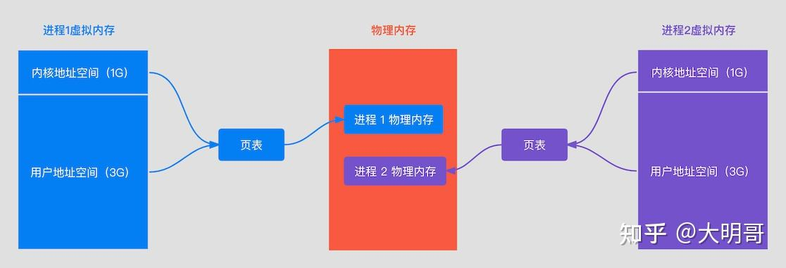
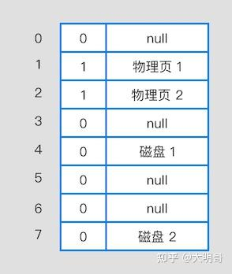
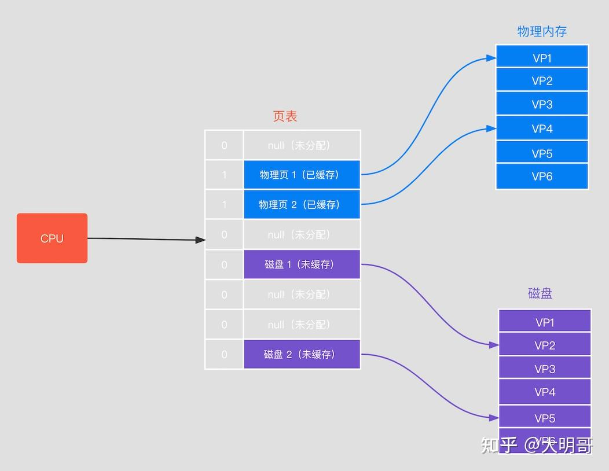
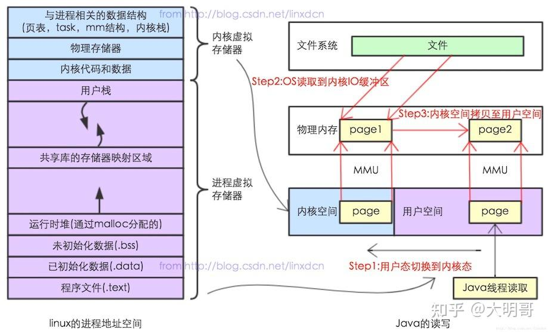
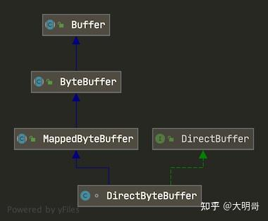

ByteBuffer 分为两种，一种是直接的，另外一种是间接的。

- 直接缓冲：直接使用内存映射，对于 Java 而言就是直接在 JVM 之外分配[虚拟内存](https://zhida.zhihu.com/search?content_id=239117131&content_type=Article&match_order=1&q=虚拟内存&zhida_source=entity)地址空间，Java 中使用 DirectByteBuffer 来实现，也就是堆外内存。
- 间接缓冲：是在 JVM 堆上实现，Java 中使用 HeapByteBuffer 来实现，也就是堆内内存

# mmap Java 内存映射 

## 虚拟内存和物理内存

**MMC**： Memory Management Unit，CPU的内存管理单元，用来管理虚拟存储器、物理存储器的控制线路，**以及虚拟地址到物理地址的映射**。

**物理内存**：即内存条的内存空间，真实的内存。

**虚拟内存**：计算机系统内存管理的一种技术。它使得应用程序认为它拥有连续的可用的内存（一个连续完整的地址空间），而实际上，它通常是被分隔成多个物理内存碎片，还有部分暂时存储在外部磁盘存储器上，在需要时进行数据交换。

**缺页中断**：当程序试图访问已映射在虚拟地址空间中但未被加载至物理内存的一个分页时，由 MMC 发出的中断。如果操作系统判断此次访问是有效的，则尝试将相关的页从虚拟内存文件中载入物理内存。

## 为什么要用虚拟内存？

1. 程序运行困难。为什么会困难，因为内存有限。对于 32 位的系统而言，每个进程在运行的时候都需要分配 4G（2^32） 的内存，对于一个系统而言，你有多少物理内存可供分配，而且在很多应用中我们服务器的标配一般都是 2C4G，这只能运行一个进程了。
2. 没有虚拟内存，我们程序就直接访问物理内存了，这就意味着一个程序可以任意访问内存中的所有地址，如果有人搞破坏修改了其他程序在用的地址中的数据，这就可能导致其他程序崩溃。
   虚拟内存的出现解决了上面的问题，进程运行时都会分配 4G 的虚拟内存，进程认为它有了 4G 的内存空间了（只是它以为），但实际上，在虚拟内存对应的物理内存上可能只有一点点，实际用了多少内存就会对应多少物理内存。同时进程得到的 4G 虚拟内存是一个连续的内存空间（也只是它认为的），而实际上，它通常会被分割为多个物理内存碎片，而且可能有一部分内存还存储在磁盘上，在需要的时候进行数据交换。

## 虚拟内存和物理内存是怎么关联起来的？

进程使用的是虚拟内存，但是我们数据还是存储在物理内存上，那虚拟内存是怎样和物理内存对应起来的呢？ **[页表](https://zhida.zhihu.com/search?content_id=239117131&content_type=Article&match_order=1&q=页表&zhida_source=entity)**，虚拟内存和物理内存建立对应关系采用的是页表页映射的方式，如下：



页表记录了虚拟内存每个页和物理内存之间的对应关系，如下图：



它有两个栏位：有效位和路径

- 有效位：有效位有两个值，0 和 1 ，其中 1 表示已经在物理内存上了，0 表示不在物理内存上
- 路径：具体的物理页号编码或者磁盘地址

当 CPU 寻址时，它有三种状态：

- 未分配：虚拟地址所在的那一页并未被分配，代表没有数据和他们关联，这部分也不会占用物理内存。
- 未缓存：虚拟地址所在的那一页被分配了，但并不在物理内存中。
- 已缓存：虚拟地址所在的那一页就在物理内存中。

CPU 访问虚拟内存地址过程如下：

1. 首先查看页表，判断该页的有效位是否为 1，如果为 1，则命中缓存，根据物理内存页号编码找到物理内存当中的内容，返回。
2. 如果有效位为 0，表示不在物理内存上，则参数[缺页异常](https://zhida.zhihu.com/search?content_id=239117131&content_type=Article&match_order=1&q=缺页异常&zhida_source=entity)，调用系统内核缺页异常处理程序，操作系统会立刻阻塞该进程，并将磁盘中对应的页加载到物理内存且有效位设置为 1，然后使该进行就绪。如果物理内存满了，则会通过页面置换算法选择一个页来覆盖即可。




## 标准IO和内存文件映射mmap读取文件的步骤

通过下图可以看出，标准IO中当要读取某个文件的时候，分为3个步骤：

1. 从用户态切换到内核态
2. 在内核态中通过系统调用，将文件从磁盘中读取到内核IO缓冲区
3. 在物理内存中将数据从从内核空间拷贝至用户空间

而内存映射只需要2个步骤：

1. 将文件的地址映射到用户空间的虚拟地址上
2. 第一次调用的时候发生缺页中断，由 MMC 发出的中断。操作系统将相关的页从虚拟内存文件中载入物理内存。

**标准IO**



**内存文件映射**

****

## MappedByteBuffer使用

先看 MappedByteBuffer 和 DirectByteBuffer 的类图：



MappedByteBuffer 是一个抽象类，DirectByteBuffer 则是他的子类。可以通过调用  FileChanne 的 `map()` 方法来创建，如下：

```java
FileInputStream inputStream = new FileInputStream("/Users/chenssy/Downloads/test.txt");
FileChannel fileChannel = inputStream.getChannel();
MappedByteBuffer mappedByteBuffer = fileChannel.map(FileChannel.MapMode.READ_ONLY, 0,fileChannel.size());

for (int i = 0 ; i < length ; i += 1024) {
    if (length - i > BUFFER_SIZE) {
        mappedByteBuffer.get(b);
    } else {
        mappedByteBuffer.get(new byte[length - i]);
    }
}
```

```java
//java.nio.channels.FileChannel#map
public abstract MappedByteBuffer map(MapMode mode, long position, long size)
    throws IOException;
```

该map方法可以把文件的从 position 开始的 size 大小的区域映射为 MappedByteBuffer，mode 定义了可访问该内存映射文件的访问方式，共有三种

- `MapMode.READ_ONLY`（只读）： 试图修改得到的缓冲区将导致抛出 ReadOnlyBufferException。
- `MapMode.READ_WRITE`（读/写）： 对得到的缓冲区的更改最终将写入文件；但该更改对映射到同一文件的其他程序不一定是可见的。
- `MapMode.PRIVATE`（专用）： 可读可写,但是修改的内容不会写入文件,只是buffer自身的改变，这种能力称之为”copy on write”

MappedByteBuffer 作为 ByteBuffer 的子类，它同时也是一个抽象类，相比 ByteBuffer ，它新增了三个方法：

- `isLoaded()`：如果缓冲区的内容在物理内存中，则返回真，否则返回。
- `load()`：将缓冲区的内容载入内存，并返回该缓冲区的引用。
- `force()`：缓冲区是READ_WRITE模式下，此方法对缓冲区内容的修改强行写入文件。


## DirectByteBuffer

DirectByteBuffer 作为 MappedByteBuffer的子类

**分配内存**

DirectByteBuffer 可以通过 `ByteBuffer.allocateDirect(int capacity)` 进行构造。

```java
public static ByteBuffer allocateDirect(int capacity) {
    return new DirectByteBuffer(capacity);
}

//DirectByteBuffer#DirectByteBuffer(int) 构造方法
DirectByteBuffer(int cap) {
      super(-1, 0, cap, cap);
      boolean pa = VM.isDirectMemoryPageAligned();
      int ps = Bits.pageSize();
      long size = Math.max(1L, (long)cap + (pa ? ps : 0));
      Bits.reserveMemory(size, cap);// ①

      long base = 0;
      try {
          
          base = unsafe.allocateMemory(size); // ②
      } catch (OutOfMemoryError x) {
          Bits.unreserveMemory(size, cap);
          throw x;
      }
      unsafe.setMemory(base, size, (byte) 0);
      if (pa && (base % ps != 0)) {
          // Round up to page boundary
          address = base + ps - (base & (ps - 1));
      } else {
          address = base;
      }
      cleaner = Cleaner.create(this, new Deallocator(base, size, cap));  // ③
      att = null;

  }
```

这段代码中有三个方法非常重要：

1. Bits.reserveMemory(size, cap)

   - 总分配内存(按页分配)的大小和实际内存的大小，确保有足够的内存可以进行分配。
   - 判断堆外内存是否足够，不够进行 GC 操作

2. base = unsafe.allocateMemory(size)

   - 真正的进行分配内存，调用`unsafe.allocateMemory(size)`是这个 native 方法，它是在堆外内存（C_HEAP）中分配一块内存空间，并返回堆外内存的基地址。

3. cleaner = Cleaner.create(this, new Deallocator(base, size, cap));

   - 创建一个 `Cleaner` 对象，用于堆外内存的清理动作，Cleaner是 PhantomReference 的子类，PhantomReference 为虚引用，当该对象被垃圾收集器回收的时候，会收到一个系统通知。所以Cleaner的作用就是在JVM回收DirectByteBuffer对象的时，能够保证对应的堆外内存也释放。

     1. Object referent：引用对象
     2. Runnable thunk：清理线程

     ```java
     //Deallocator#run
     public void run() {
         if (address == 0) {
             // Paranoia
             return;
         }
           // 释放内存
         unsafe.freeMemory(address);
         address = 0;
         Bits.unreserveMemory(size, capacity);
     }
     ```

     


