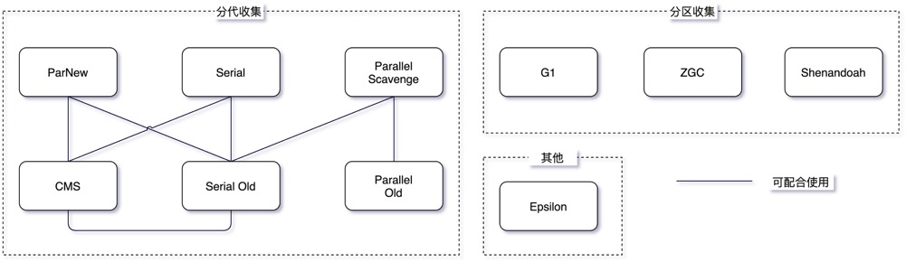
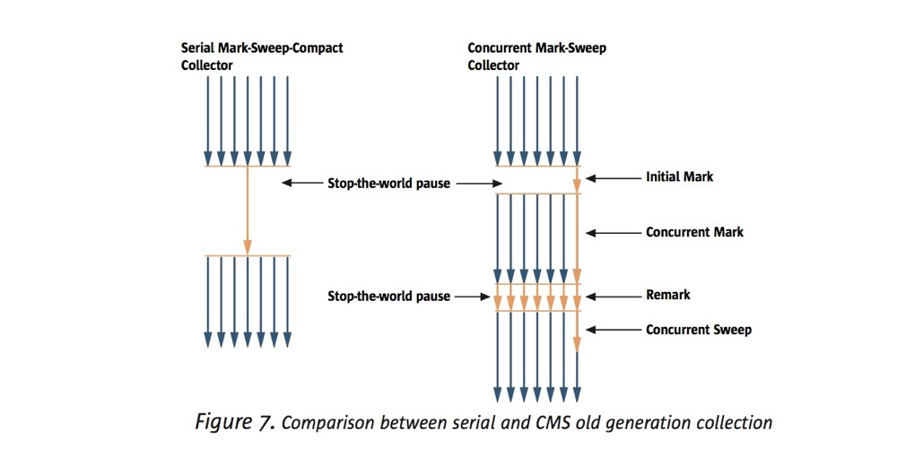

## 从intern看不同版本常量池的变化

[深入解析intern](https://tech.meituan.com/2014/03/06/in-depth-understanding-string-intern.html)

```java
String str1 = new StringBuilder("计算机").append("软件").toString(); 
System.out.println(str1.intern() == str1);
//JDK6 false
//JDK7 true
```

JDK7中，将字符串常量池的实现从 永久代（方法区的具体实现）  移至 堆 中。

在执行第一行代码后，由于 “计算机”，‘’软件“ 是显示声明的，所以会直接去字符串常量池中创建，但 str1 指向的却是堆中的对象 ”计算机软件“，这个对象目前并没有在字符串常量池中出现。

在执行 str1.inter() 后，要将 str1 指向的 “计算机软件” 放入常量池，如果是在JDK6中，永久代和堆是分开的，所以需要将这个字符串复制到永久代中的字符串常量池。而在JDK7中，常量池不需要再存储一份数据了，直接存储的是该对象堆中的引用。这份引用指向 str1 引用的对象。


**从上述的例子代码可以看出 jdk7 版本对 intern 操作和常量池都做了一定的修改。主要包括2点：**

- 将String常量池 从 Perm 区移动到了 Java Heap区
- `String#intern` 方法时，如果存在堆中的对象，会直接保存对象的引用，而不会重新创建对象。


## 创建对象

Java 中创建一个对象前，需要分配对应的内存空间。

### 分配内存

- 指针碰撞：假设内存使用的很规整，使用过的内存空间放一边，未使用的放另一边，中间的分界点是一个指针，当需要分配新的对象空间时，会计算该对象所占的内存大小，然后将指针向未使用过的一侧移动。
- 空闲列表：内存的使用肯定不是规整的，使用过和未使用的相互交错在一起，这样指针碰撞就不行了，只能通过虚拟机来维护一个空闲内存列表，记录哪块内存是可用的。

使用哪种分配方式，其实和虚拟机的堆是否规整相关，堆的规整又和垃圾回收算法相关，使用标记清除的算法（如CMS），就会产生内存碎片，只能使用空闲列表的方式，如果使用标记整理或标记复制算法，就可以使用简单高效的指针碰撞方式了。

### 指针压缩

参考链接：https://blog.csdn.net/liujianyangbj/article/details/108049482

### TLAB

Thread Local Allocation Buffer

虚拟机中对象的创建非常频繁，即使只修改一个指针的位置，在并发情况下也并不是线程安全的，可能出现正在给对象 A分配内存，指针还没来得及修改，对象B又同时使用了原来的指针来分配内存的情况，通常有两种解决办法：

- CAS加上失败重试
- 提前给线程分配一小块私有内存，将分配的动作变成不操作共享变量的方式。

## 收集对象

### 垃圾识别

- **引用计数法（Reference Counting）：** 对每个对象的引用进行计数，每当有一个地方引用它时计数器 +1、引用失效则 -1，引用的计数放到对象头中，大于 0 的对象被认为是存活对象。虽然循环引用的问题可通过 Recycler 算法解决，但是在多线程环境下，引用计数变更也要进行昂贵的同步操作，性能较低，早期的编程语言会采用此算法。
- **可达性分析，又称引用链法（Tracing GC）：** 从 GC Root 开始进行对象搜索，可以被搜索到的对象即为可达对象，此时还不足以判断对象是否存活/死亡，需要经过多次标记才能更加准确地确定，整个连通图之外的对象便可以作为垃圾被回收掉。目前 Java 中主流的虚拟机均采用此算法。

### 收集算法

自从有自动内存管理出现之时就有的一些收集算法，不同的收集器也是在不同场景下进行组合。

- **Mark-Sweep（标记-清除）：** 回收过程主要分为两个阶段，第一阶段为追踪（Tracing）阶段，即从 GC Root 开始遍历对象图，并标记（Mark）所遇到的每个对象，第二阶段为清除（Sweep）阶段，即回收器检查堆中每一个对象，并将所有未被标记的对象进行回收，整个过程不会发生对象移动。整个算法在不同的实现中会使用三色抽象（Tricolour Abstraction）、位图标记（BitMap）等技术来提高算法的效率，存活对象较多时较高效。
- **Mark-Compact （标记-整理）：** 这个算法的主要目的就是解决在非移动式回收器中都会存在的碎片化问题，也分为两个阶段，第一阶段与 Mark-Sweep 类似，第二阶段则会对存活对象按照整理顺序（Compaction Order）进行整理。主要实现有双指针（Two-Finger）回收算法、滑动回收（Lisp2）算法和引线整理（Threaded Compaction）算法等。
- **Copying（复制）：** 将空间分为两个大小相同的 From 和 To 两个半区，同一时间只会使用其中一个，每次进行回收时将一个半区的存活对象通过复制的方式转移到另一个半区。有递归（Robert R. Fenichel 和 Jerome C. Yochelson提出）和迭代（Cheney 提出）算法，以及解决了前两者递归栈、缓存行等问题的近似优先搜索算法。复制算法可以通过碰撞指针的方式进行快速地分配内存，但是也存在着空间利用率不高的缺点，另外就是存活对象比较大时复制的成本比较高。

## 垃圾收集器

目前在 Hotspot VM 中主要有 分代收集 和 分区收集 两大类，不过未来会逐渐向分区收集发展。




CMS不能收集年轻代的垃圾，

## 常用工具

工欲善其事，必先利其器，此处列出一些笔者常用的工具，具体情况大家可以自由选择，本文的问题都是使用这些工具来定位和分析的。

###  命令行终端

标准终端类：jps、jinfo、jstat、jstack、jmap

功能整合类：jcmd、vjtools、arthas、greys

- jinfo - 用于实时查看和调整目标 JVM 的各项参数。
- jstack - 用于获取目标 Java 进程内的线程堆栈信息，可用来检测死锁、定位死循环等。
- jmap - 用于获取目标 Java 进程的内存相关信息，包括 Java 堆各区域的使用情况、堆中对象的统计信息、类加载信息等。
- jstat - 一款轻量级多功能监控工具，可用于获取目标 Java 进程的类加载、JIT 编译、垃圾收集、内存使用等信息。
- jcmd - 相比 jstat 功能更为全面的工具，可用于获取目标 Java 进程的性能统计、JFR、内存使用、垃圾收集、线程堆栈、JVM 运行时间等信息

### 可视化界面

- 简易：JConsole、JVisualvm、HA、GCHisto、GCViewer
- 进阶：MAT、JProfiler

命令行推荐 arthas ，可视化界面推荐 JProfiler

- 

## 垃圾回收算法实现细节

### 根结点枚举

如果是可达性分析法的话，GC时会从GC Roots集合开始向下遍历，判断对象是否可达。固定可作为GC Roots的节点主要在全局性的引用（例如常量或类静态属性）与执行上下文（例如 栈帧中的本地变量表）。

枚举根结点需要停顿所有用户线程，这点上CMS、G1、ZGC都不例外。


### 记忆集和卡表

记忆集（Rememberd Set）是为了解决跨代引用的问题，例如，只想要回收新生代的一些对象，但是不知道老年代是否有引用指向新生代的这些对象，去遍历整个老年代又不现实，所以引入记忆集来解决这一问题。

所谓的记忆集，就是用来记录这种跨代引用的指向关系，记忆集本质是一种用于记录从非收集区域指向收集区域的指针集合的抽象数据结构。

卡表（Card Table）只是记忆集的一种实现。它的记录精确到一块内存区域，记录该内存区域是否有跨代指针。当然记忆集不止这一种实现，还可以用记录一个对象内是否有跨代指针的来实现记忆集，考虑到存储和维护的成本，常用卡表来实现记忆集，这两者是具体和抽象的关系，不可混淆。

卡表可以简单的理解为一个字节数组，卡表中的每个元素称为卡页（Card Page，占1byte）表示一个内存区域块（一般是2^9=512byte），这一个内存区域块中往往包含很多对象，但只要其中有一个对象存在跨代指针，那么整个卡页就被标记为脏页，会将该元素的值设为1，没有的话则默认为0。

在垃圾收集发生时，只要筛选出卡表中的脏页，就能轻易得出哪些卡页内存块中包含跨代指针，把它们加入GC Roots中一并扫描。

> 虽然值的范围是 1和 0，但是没有使用bit数组，是因为速度上的考量，计算机中都是最小按照字节寻址的，并没有直接存储一个bit的指令，所以这里为了性能，舍弃了一点点空间。

### 写屏障

前边介绍可以通过卡表标记脏页的方式来缩减了GC Roots的扫描范围，但谁来操作的，什么时候操作又是新的问题。

什么时候操作？当发生跨代引用后，卡页就变成了脏页，最好的时机就是在完成新的引用赋值那一刻。如果是解释执行的字节码，虚拟机负责执行每条字节码指令，自然有充分的介入空间，如果是通过 JIT 编译后的机器码（机器指令流），虚拟机就不太操作了。所以需要通过机器码层面的手段，将维护卡表的动作放到每一次赋值操作中。

虚拟机是通过写屏障来维护卡表状态的。写屏障可以看作是虚拟机层面对 “引用类型字段赋值” 操作的一个AOP切面。

在引用对象赋值时会产生一个环形（Around）通知，供程序执行额外的动作，也就是说赋值的前后都在写屏障的覆盖范畴内。

> 在赋值前的部分的写屏障叫作写前屏障（Pre-Write Barrier），在赋值 后的则叫作写后屏障（Post-Write Barrier）。HotSpot虚拟机的许多收集器中都有使用到写屏障，但直 至G1收集器出现之前，其他收集器都只用到了写后屏障。

有了写屏障后，虚拟机就会为所有赋值操作生成相应的指令，一旦收集器在写屏障中增加了更新卡表操作，无论更新的是不是老年代对新生代对象的引用，每次只要对引用进行更新，就会产生额外的开销，不过这个开销与Minor GC时扫描整个老年代的代价相比还是低得多的。

### 并发的可达性分析-三色标级算法

在垃圾回收过程中，根据对象是否被完整扫描可以分三个阶段，没有被扫描标记白色，部分被扫描标记为灰色（扫描到了这个对象，但是对象中引用的其他对象还没扫描完），完全被扫描标记为黑色（该对象及其中的引用都被扫描完了）。

**并发的可达性分析过程**

从 GCROOT 出发，将被扫描的对象先标记灰色，等完整扫描后再标记为黑色，扫描结束后没有被访问到的对象默认是白色，这样垃圾收集器就可以对白色的垃圾对象进行回收。

**对象消失问题**

在扫描过程中，标记为黑色的对象表示扫描完成，如果此时发生了黑色对象对白色对象的引用，因为黑色对象不会被重新扫描，所以这个白色对象最终会被当作垃圾回收掉，但其实这个一个存活的对象。

出现对象消失问题需要**同时满足**的条件：

- 赋值器插入了一条或多条从黑色对象到白色对象的新引用；


- 赋值器删除了全部从灰色对象到该白色对象的直接或间接引用。

**解决办法**

- **增量更新，**发生黑色对象引用白色对象时，将引用关系记录下来，等到并发扫描结束后，再根据记录重新扫描一遍，这个其实就是 CMS 并发标记结束后的重新标记阶段。
- **原始快照，SATB**  当灰色对象要删除指向白色对象的引用关系时，就将这个要删除的引用记录下来，在并发扫描结束之后，再对记录的引用对象中的灰色对象为根，重新扫描一次。


## CMS

CMS 追求的是最短停顿时间的垃圾回收器，它更关注的是整个系统的吞吐量，减少垃圾回收占总时间的百分比。

### CMS垃圾回收过程

**初始标记阶段（initial mark）**CMS 收集过程首先是一段小停顿 stop-the-world，用于确定 GC Roots。

**并发标记阶段（concurrent mark）**，标记 GC Roots 可达的所有存活对象。

**再次标记阶段（remark）** 由于这个阶段应用程序同时也在运行，所以并发标记阶段结束后，并不能标记出所有的存活对象。为了解决这个问题，需要再次停顿应用程序，遍历在并发标记阶段应用程序修改的对象（标记出应用程序在这个期间的活对象），由于这次停顿比初始标记要长得多，**所以会使用多线程并行执行来增加效率**。

**并发清理阶段（concurrent sweep）** 再次标记阶段结束后，能保证所有存活对象都被标记完成，然后就地回收垃圾对象所占空间。



### CMS的特点

CMS 在并发标记期间是和用户线程并发进行的，所以刚标记存活的对象可能会立马变成垃圾，而这部分**浮动垃圾**只能等到下次垃圾回收清理。

CMS 的垃圾清楚方式是，标记清除，它没有对内存进行整理，这会导致出现很多内存碎片。这会导致空闲的内存不是连续的，使得在分配对象的时候不能使用简单的**指针碰撞**，而是需要采用空闲列表的方式。内存碎片还会导致在新生代晋升老年代的时候，老年代空间够但是不连续，导致晋升失败，这样会触发 full GC。进行整堆回收。

但由于它对老年代是整堆进行回收的，如果堆空间比较大的时候，持续的时间会比较久，如果在这个时间内没有完成垃圾回收，那么可能会触发full GC。可以通过设置 **预设占用率** 提早进行CMS垃圾回收。

### CMS的VM参数

```java
-XX:+UseCMSCompactAtFullCollection
```

默认是0，意思是每次在Full GC之后要进行“Stop the World”，停止工作线程，然后进行碎片整理，就是把存活对象挪到一起，空出来大片连续内存空间，避免内存碎片，如果这个值配置的是5的话，相当于每5次full GC才进行一次碎片整理，这样其实会令CMS的内存碎片问题更严重。

```java
-XX:CMSInitiatingOccupancyFraction=n
```

CMS 收集器不能等到老年代满了才开始收集，如果老年代空间被消耗了 **预设占用率（initiating occupancy）**，也将会触发一次垃圾收集。n 为老年代空间的占用百分比，这个数字到 Java8 的时候已经变为默认 92 了。

## G1

由于现在机器内存越来越大，并且要求低延时来响应交互。所以G1就被设计用来取代CMS，G1的关注点是 **可控的停顿时间**。

在设计上，之前的垃圾收集器是分代收集，而G1在逻辑上保留了分代的思想，实际将堆划分成了一个个大小相等的分区。每一小块的内存是连续的，然后由多个小分区组成，新生代、老年代。每个分区都可以去充当  Eden、Survivor、Old 三种角色，但是它们不是固定的，这使得内存使用更加地灵活。

执行垃圾收集时，和 CMS 一样，G1 收集线程在标记阶段和应用程序线程**并发**执行。但G1使用了 **停顿预测模型** 来达到可控的停顿时间，CMS 是全部回收，而G1是对回收价值比较高的进行部分区块回收。它会尽力去满足 我们设置的停顿时间，但也不是绝对的。它基于之前垃圾收集的数据统计，估计出在用户指定的停顿时间内能收集多少个区块。

G1会根据历史的GC统计信息和停顿时间的目标，它的年轻代会动态调整。

### **G1的VM参数**

