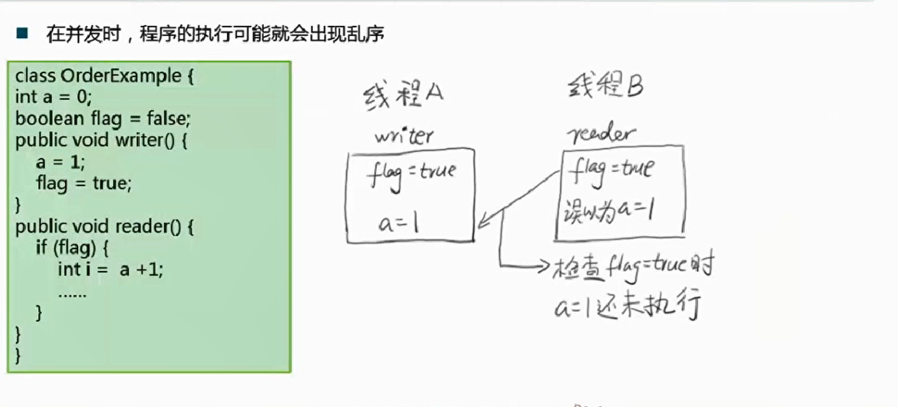
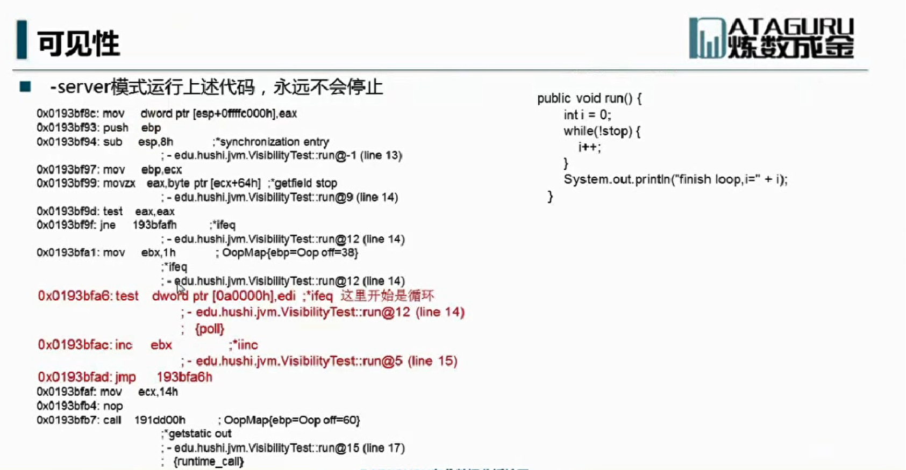

[Semaphore](#Semaphore)
## 并行
### 同步(synchronous)和异步(asynchronous)


同步是指代码调用IO操作时，必须等待IO操作完成才返回的调用方式。  
异步是指代码调用IO操作时，不必等IO操作完成就返回的调用方式。  

### 并发(concurrency)和并行(parallelism)


并行是多个线程同一时刻运行，单核CPU在同一时刻无法做到，而多核CPU可以  
并发是多个线程在同一时间段运行，cpu把这个时间段分片给多个线程，由于整个时间段很小，所以我们感觉CPU好像在同时运行这些线程

### 临界区
临界区用来表示一种公共资源或者说是共享数据，可以被多个线程使用，但是每一次，只能一个线程使用它，一旦临界区资源被占用，其他线程想要使用这个资源，就必须等待


### 阻塞(Blocking)和非阻塞(Non-Blocking)
阻塞和非阻塞通常用来形容多线程间的相互影响，比如一个线程占用了临界区资源，那么其他所有需要这个资源的线程就必须在这个临界区外进行等待，等待会导致线程挂起。这种情况就是阻塞。此时，如果占用资源的线程一直不愿意释放资源，那么其他所有阻塞在这个临界区上的线程都不能工作  
非阻塞允许多个线程同时进入临界区

### 并发级别
- 阻塞
难进易出，当一个线程进入临界区后，其他线程必须在临界区外等待，进入后完成操作就可以释放资源
- 非阻塞
  - 无障碍  
易进难出，无障碍是一种最弱的非阻塞调度，自由进入临界区，但是在释放资源时，会判断是否发生数据竞争，比如A线程读取数据x，要释放资源时，系统会判断当前的临界区内x值是否发生变化，如果发生变化，则会回滚A线程的操作
  - 无锁  
无锁的前提是无障碍的，而且要保证有一个线程可以胜出  
通过一个实例可以很好的理解，线程A修改了x的值，要释放资源出临界区时，线程B修改了x的值，系统会回滚线程A的操作，线程B要出临界区时，线程C又修改了x的值，这下该回滚B的操作了，线程C要出临界区的时候，之前被回滚的A完成了修改操作，所以C也要被回滚了，此处A打算出临界区，B又来了，这样就形成了一个闭环  
还是A、B、C三个线程修改x值的问题，要想打破之前形成的闭环，就必须要有一个线程先出去，通过竞争的方式每次选出一个线程胜出，胜出的可以释放临界区资源
  - 无等待  
无状态的前提是无锁的，要求所有线程都必须在有限步内完成，而且也是无饥饿的

### 有关并行的2个重要定理
Amdahi定律（阿姆达尔定律）

Gustafson定律（古斯塔夫森定律）


## 线程
### 线程状态的转换


### 线程的基本操作
- 线程启动   
调用线程的start方法，而不是run方法
```java
Thread t1 = new Thread();
t1.start();
```
    直接调用run方法会在当前线程进行方法调用，通过start方法启动，则会创建一个新的线程来执行

- 线程终止   
stop 不推荐使用，stop会立即释放掉该线程所持有的锁  
如果修改了一半就被stop掉，那数据也只会被修改一半

- 线程中断  
interrupt
```java
public void Thread.interrupt()  //中断线程，其实是将线程状态改为中断状态，并不会直接中断线程
public boolean Thread.isInterrupted() //判断是否被中断
public static boolean Thread.interrupted()  //判断是否被中断，并清除当前中断状态

//错误写法  虽然线程设置为中断状态，但内部程序一直在执行
public void run(){
  while(true){
    ...
  }
}
t1.interrupt()

//正确写法   当线程被中断后，会执行完当前的操作后，进入下一轮循环的时候停止
public void run(){
  while(true){
    if(Thread.currentThread().isInterrupted()){
      System.out.println("Interrupted!");
      break;
    }
    ...
  }
}
t1.interrupt()
```

sleep
```java
//当线程在休眠中，被别的线程打断时会抛出InterruptedExecption异常，通过这种方式来提前中断线程的休眠
public static native void sleep(long millis) throws InterruptedExecption
public void run(){
  while(true){
    if(Thread.currentThread().isInterrupted()){
      System.out.println("Interrupted!");
      break;
    }
    try{
      Thread.sleep(10000);
    }catch(InterruptedException e){
      //设置中断状态，抛出异常后会清除中断标记位
      Thread.currentThread().interrupted();
    }
  }
  }
}
```

- 线程挂起(suspend)和线程继续执行(resume)  
不推荐使用，suspend()不会释放锁，如果resume在suspend前调用则会发生死锁  
线程一旦被挂起，下一次被唤醒会导致上下文切换  
让步式上下文切换耗费CPU时钟非常严重，通常高达80,000个时钟周期  
主频为3GHz的处理器每秒钟可用时钟周期为3,000,000,000  
jps 查看当前的Java进程、
jstack JVM自带的堆栈跟踪工具

- 等待线程结束(join)和谦让(yeild)  

join  
```java
public final void join() throws InterruptedException
public final synchronized void join(long millis) throws  InterruptedException

//主线程会等待线程t执行完，再进行下一步操作
public static void main(String[]args) throws InterruptedException{
  Thread t=new Thread(A)
  t.start();
  t.join()
  System.out.println("ok")
}
```
```java
join的本质
while(isAlive()){
  wait(0);  //一直等待，直到被唤醒
}
```
线程执行完毕后，系统会调用notifyAll()  
因此不要在Thread实例上使用wait()和notify()  

yeild  
使当前线程放弃当前时间片，重新参与竞争，竞争成功后还是会执行的


### 守护线程
在后台默默的完成一些系统性的服务，比如垃圾回收线程，JIT线程
守护线程是为非守护线程服务的，如果JVM中只剩守护线程，JVM自然会退出
```java
Thread t=new ThreadT();
t.setDaemon(true);
t.start();
```

### 线程优先级
优先级高的线程更容易抢到cpu时间片
```java
public final static int MIN_PRIORITY=1;
public final static int NORM_PRIORITY=5;
public final static int MAX_PRIORITY=10;
```
### Synchronized
- 指定加锁对象：对定对象加锁，进入同步代码块前要获得给定对象的锁
- 直接作用于实例方法：相当于对当前实例加锁，进入同步代码块前要获得当前实例的锁
- 直接作用于静态方法：相当于对当前类加锁，进入同步代码块前要获得当前类的锁，其实锁的是字节码对象

### wait和notify
为什么将这两个方法定义在Object，我个人有如下理解  
wait和notify执行的前提是需要持有锁，而Java中锁可以是任意的Object对象，例如在字段上锁的是字段的对象，所以不能对基础类型加锁，除非封装为包装类，
加在方法上，锁的是调用这个方法的实例对象，加在静态方法上，锁的其实是该类对应的字节码对象，所以将这两个方法定义在Object中，也只能定义在Object中


Object.wait()  
线程等待在当前对象上,调用的前提是获得object的锁对象,因为调用wait()方法会释放锁，那么必须先持有锁
```java
synchronized(obj){
  obj.wait();
}
```
Object.notify()/notifyAll()  
通知在这个对象上等待的线程，进行唤醒  
调用的前提也是获得object的锁对象,唤醒在这个锁对象上的一个线程(notifyAll会唤醒全部线程)，被唤醒的线程还不会立即执行，因为要等当前线程执行完释放锁后，才能去抢锁

## Java内存模型和线程安全
### 原子性
原子性是指一个操作是不可中断的，即使是在多个线程一起执行的时候，一个操作一旦开始，就不会被其他线程干扰  
i++ 就不是原子操作  
操作1 读i  
操作2 进行i+1  
操作3 将结果写回i  

### 有序性
在并发时，程序的执行可能会出现乱序，原因是cpu为优化代码，会发生指令重排  

write()方法的代码执行顺序可能会调整，如果先设置为true，那reader()此时读到的数据就有误 


标X的地方可以理解为硬件工作的一个空档期，指令重排是改变代码的执行顺序，来填补这些空档期，但是指令重排不能改变程序语义的串行性


### 可见性
可见性是指当一个线程修改了某个共享变量的值，其他线程是否能够立即知道这个修改  
有序性问题和可见性问题主要还是来自于程序的优化

虚拟机层面的可见性问题  




### Happen-Before
- 程序顺序原则：一个线程内保证语义的串行性
- volatile规则：volatile变量的写，先发生于读，这保证了volatile变量的可见性
- 锁规则：解锁必然发生在随后的加锁前
- 传递性：A先于B，B先于C，那么A必先于C
- 线程的start()先于它的每一个动作
- 线程的所有操作先于线程的终结(Thread.join()) 
- 线程的中断先于被中断线程的代码
- 对象的构造函数执行结束先于finalize()方法

### 线程安全的概念
指某个函数在多线程环境中被调用时，能够正确地处理各个线程的局部变量，使程序正确完成

## 无锁
### 无锁类的原理详解
CAS  
CAS有三个操作数：内存值(也就是要更新的变量)V、旧的预期值A、要修改的值(新值)B，当且仅当预期值A和内存值V相同时，将内存值修改为B并返回true，否则什么都不做并返回false。  
虽然CAS会先读取值，然后比较，最后再赋值，但是这整个操作是一个原子操作，由一条CPU指令完成，通过比较交换指令实现，省去了线程频繁调度的开销，所以比基于锁的方式性能更好

### 无锁类的使用
- AtomicXXX类  
底层维护一个被volatile修饰的基本类型值  
AtomicXXX只是对其的一个封装  
```java
//无锁的方式大都是通过这样的方式实现，
public final int getAndIncrement(){
  for(;;){
    int current =get(); //获取内存中当前的值，旧的预期值A
    int next=current+1; //对已获取到的值递增，要修改为的新值B
    //判断内存中当前的值是否和current相等
    //如果相等，则将当前值修改为目标值next，并返回true
    //如果不等，则会返回false，说明内存中已经有别的线程修改了值且进行提交，那么当前线程会进入下一次循环，重新获取新值，再重复上面的动作，直至内存的值和get()的值一样，也就是没人修改内存的值
    if(compareAndSet(current,next)){ 
      return current;  //返回修改前的值
    }
  }
}
```  
- AtomicReference<V>   
针对线程引用来保证线程安全
- AtomicStampedReference<V>  
解决过程状态上敏感的问题  
A->B->A  
线程1先get(),线程2将A改为B，线程3又将B改为A，线程1compareAndSet时发现还是A,返回true，但其实已经不是之前的那个A了，如果是数值的话，只关注结果，不会出现问题，但如果是过程状态，则会出现问题  
使用AtomicStampedReference，会给每个状态打上时间戳，compareAndSet的时候不光会比较值还会比较时间戳

- Unsafe  
提供了非安全的操作，提供内JDK内部使用，非公开的API，在不同JDK中可能有较大差异
可以根据偏移量去设置值
提供park()  把线程停下来
负责底层的CAS操作，如AtomicInter的底层实现

- AtomicIntergerArray  
作用和AtomicInteger类似，通过CAS原理保证数组中每个元素的线程安全

- AtomicIntegerFieldUpdater
将已有的基本类型的变量，封装到AtomicIntegerFieldUpdater
底层使用反射技术

- LockFreeVector   
无锁vector  使用二维数组模拟一维数组  
```java
//第一数组放8个元素，第二个数组放16个元素，第三个数组放32个元素。。，减少数组扩容的性能消耗
private final AtomicReferenceArray<AtomicReferenceArray<E>> buckets; 
```
- ConcurrentLinkedQueue 非阻塞队列
- ConcurrentSkipList 跳表

## JDK并发包
### ReentrantLock  
可以理解为synchronized关键字的一个增强，JDK1.5后对synchronized进行了优化，现在两者差距并不是很大  
- 可重入：同一把锁可以在持有的时候再进行获取(synchronized也可以)，同时获取几次也必须要释放几次，不然会造成死锁  

- 可中断：当通过这个方法去获取锁时，如果线程正在等待获取锁，则这个线程能够响应中断，即中断线程的等待状态。  
也就使说，当两个线程同时通过lock.lockInterruptibly()想获取某个锁时，假若此时线程A获取到了锁，而线程B只有在等待，  
那么对线程B调用threadB.interrupt()方法能够中断线程B的等待过程  
synchronized对中断信号是没有响应的，而ReentrantLock可以对中断信号做出响应  

- 可限时：起到了定时锁的作用，如果在指定时间内没有获得锁，将会返回false  

- 公平锁：谁等的时间长，谁获得锁，基本上一人一次

### ReentrantLock实现
- CAS状态
- 等待队列
- park()

### Condition
Condition与ReentrantLock结合使用，这两者之间的关系可以参考synchronized和wait()/notify()的关系  
通过API的方式来对ReentrantLock进行类似于wait和notify的操作  
```java
// Codition方法
void await() throws InterruptedException;
boolean await(long time, TimeUnit unit) throws InterruptedException;
void signal();
void signalAll();


ReentrantLock reentrantLock = new ReentrantLock();
        Condition condition = reentrantLock.newCondition();
```
### Semaphore
信号量 撒门否儿,共享锁 可以指定信号量的个数，如果个数为1，就只有一个线程可以拿到该信号量，作用就类似于锁  
如果信号量为10，就有10个线程可以拿到该信号量，进而执行下一步的操作
```java
public void acquire() throws InterruptedException   //获取信号量
public void release()   //释放信号量
```

### ReadWriteLock
读写锁，在锁的功能上进行划分，可以让多个读线程进入  
读-读不互斥，读读之间不阻塞  
读-写互斥，读阻塞写，写也阻塞读
写-写互斥，写写阻塞
```java
ReadWriteLock readWriteLock=new ReentrantReadWriteLock();
private static Lock readLock = readWriteLock.readLock()
private static Lock writeLock = readWriteLock.writeLock()
```

### CountDownLatch
```java
CountDownLatch end = new CountDownLatch(10);
public void run(){
  //每次调用这个countDown方法，end的值减1
  end.countDown();
}
//只有当end被countdown到0的时候，主线程里的end.await()才会被唤醒
public void main(){
  end.await();
}
```

### CyclicBarrier
循环栅栏，这个计数器可以反复使用，假设计数器设置为10，那么第一批10个线程后，计数器会重置，然后接着处理第二批的10个线程  

### LockSupport
类比于 suspend/resume，推荐使用LockSupport的原因是，即使unpark在park之前调用，也不会导致线程永久被挂起  
能够响应中断，但不抛出异常，中断的响应结果是，park()函数的返回，可以从Thread.interrupted()得到中断标志
```java
LockSupport.park(); //线程挂起
LockSupport.unpark(t1); //线程继续执行
```
