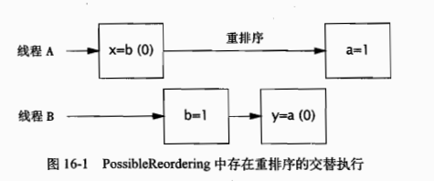

# Java内存模型
之前所讲的设计问题，如安全发布，同步策略和规范以及一致性等，它们的安全性都来自于JMM，理解JMM你可以更容易的使用它们。

## 什么是内存模型，为什么需要它
在编译器中生成的指令顺序，可以与源代码中的顺序不同；此外编译器还会把变量保存在寄存器而不是内存中；处理器何以采用乱序或并行等方式来执行指令；缓存可能会改变写入变量提交到主内存的次序；而且保存在处理器本地缓存的值，对其他处理器是不可见的。这些因素都会使一个线程无法看到变量的最新值，如果没有正确使用同步，会导致其他线程中的内存执行操作似乎存在乱序执行。
近些年计算机性能的提升原因除了时钟频率的提高，其他很大程度上归功于指令重排序措施，此外还用不断提升的并行性——动态指令调度，猜测执行以及完备的多级缓存。随着处理变得越来越强大，编译器也不断改进，通过对指令重新排序来实现优化执行，以及使用成熟的全局寄存器分配算法，由于时钟频率越来越难以提高，因此多处理器制造厂商转而生成多核处理器，因为能够提高的只有硬件的并行性。
在多线程环境中，维护程序的串行性将导致很大的性能开销，在并发应用程序中的线程，大部分时间都在执行各自的人刷，多线程之间的协调操作只会降低应用程序的运行速度，只有多个线程要共享数据时，才必须协调它们之间的操作，并且JVM依赖程序通过同步操作来找出这些协调操作将在何时发生。

现代处理器和编译器中使用的程序性能提升措施：

### 操作系统平台的内存模型
在共享内存的多处理器体系架构中，每个处理器都拥有自己的缓存，并且定期与主内存进行协调。在不同的处理器架构中提供了不同级别的缓存一致性，其中一部分只提供最小的保证，即允许不同处理器在任意时刻从同一个存储位置上看到不同的值，大多数情况下每个处理器不需要知道其他处理器正在执行的工作，因此处理器会适当放宽存储一致性的保证，以换取性能的提升，此外还定义了一些特殊的指令（称为内存栅栏或栅栏），当需要共享数据时，这些指令就能实现额外的存储协调保证，Java提供了自己的内存模型(JMM)，并且JVM通过在适当的位置插入内存栅栏来屏蔽在JMM与底层平台模型之间的差异。

### 重排序
在没有充分同步的程序中，如果调度器采用不恰当的方式来交替执行不同线程的操作，那么将导致不正确的结果。
更糟的是，JMM还使得不同的线程看到的执行操作是不同的，从而导致在缺少同步的情况下，要推断执行顺序将变得更加复杂，各种使操作延迟或者看似乱序执行的不同原因，都可以归为重排序。
```java
    public class possibleReordering{
        static int x=0,y=0;
        static int a=0,b=0;
        public static void main(String[]args){
            Thread a=new Thread(()->{
                a=1;
                x=b;
            });
            Thread b=new Thread(()->{
                b=1;
                y=a;
            })
            a.start();b.start();
            a.join();b.join();
            System.out.println("("+x+" , "+y+")");
        }
    }
```
由于缺少同步机制，输出的结果可能是(0,0)、(1,0)、(0,1)，甚至可能是(0,0)，由于每个线程中的各个操作之间不存在数据流的依赖性，因此这些操作可以是乱序执行的。（即使这些操作按照顺序执行，在将缓存刷新到主内存的不同时序也可能出现这种情况）

下图为由于执行重排序导致输出(0,0)的情况：


仅仅是一个简单的程序因为重排序列举结果都比较困难，内存级别的重排序会使程序行为变得不可预测。如果没有同步，那么推断执行顺序将是非常困难，相比而言在程序中正确使用同步是多么简单。同步将限制编译器、运行时和硬件对内存重排序的方式，从而在实施重排序的时不会破坏JMM提供的可见性保证。当前主流处理器架构中，内存模型都非常强大，使得读取volatile变量的性能与读取非volatile变量的性能大致相当。

### Java内存模型简介
Java内存模型是通过各种操作来定义的，包括对变量的读/写操作，监视器的加锁和释放操作，以及线程的启动和合并操作。JMM为程序中所有的操作定义了一个偏序关系，称为Happens-Before。要想保证执行操作B的线程看到操作A的结果，无论A和B是否在同一个线程中执行，那么A和B之间必须满足Happens-Before关系。如果两个操作之间缺乏Happens-Before关系，那么JVM可以对它们任意的排序。
当一个变量被多个线程读取并且至少被一个线程写入是，如果在读操作和写操作之间没有依照Happens-Before来排序，那么就会产生数据竞争问题。在正确同步的程序中不存在数据竞争，并会变形出串行一致性，这意味着程序中所有的操作都会按照一种固定的和全局的顺序执行。

>数据竞争(Data Race)：所谓的数据竞争，很容易理解，多个线程同时访问同一数据导致冲突（数据不正确）就产生了数据竞争。其中，“访问”包括读和写操作，所以自然，数据竞争就包括了读写竞争、写写竞争。


Happens-Before的规则包括：
程序顺序规则：如果程序中操作A在操作B之前，那么在线程中A操作将在B操作之前执行。
监视器锁规则：在监视器上解锁操作必须在同一个监视器锁上的加锁操作之前执行。
volatile变量规则：对volatile变量的写入操作必须在对该变量的读操作之前执行。
线程启动规则：在线程上对Thread.start()的调用必须在该线程中执行任何操作之前执行。
线程结束规则：线程中的任何操作都必须在其他线程检测到该线程已经结束之前执行，或者从Thread.join中成功返回，或者调用Thread.isAlive时返回false。
中断规则：当一个线程在另一个线程上调用interrupt时，必须在被中断线程检测到interrupt调用之前执行(通过抛出InterruptedException，或者调用isInterrupted和interrupted)。
终结器规则：对象的构造函数必须在启动该对象的终结器之前执行完成。
传递性：如果操作A在操作B之前执行，并且操作B在操作C之前执行，那么操作A必须在操作C之前执行。

### 借助同步
由于Happens-Before的排序功能很强大，因此有时候可以“借助”现有同步机制的可见性属性。这需要将Happens-Before的程序顺序规则与其他某个顺序规则（通常是监视器锁规则或者volatile变量规则）结合起来，从而对某个未被锁保护的变量的访问操作进行排序。这项技术由于对语句的顺序非常敏感，因此很容易出错。它是一项高级技术，而且只有当需要最大限度地提升某些类（例如ReentrantLock）的性能时，才应该使用这项技术。
在FutureTask的AbstractQueuedSynchronizer中就使用了这种技术，AQS维护了一个表示同步器状态的整数，FutureTask用这个整数来保存任务的状态：正在运行，已完成和已取消。但FutureTask还维护了其他一些变量，例如计算的结果。当一个线程调用set来保存结果并且另一个线程调用get来获取该结果时，这两个线程最好按照Happens-Before进行排序。这可以通知将执行结果的引用声明为volatile类型来实现，但利用现有的同步机制可以更容易地实现相同的功能。
FutureTask在设计时能够确保，在调用tryAcquireShared之前总能成功调用tryReleaseShared。
