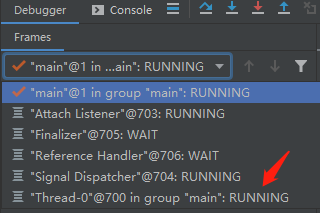

## 前言： 
前面大致了解了线程的创建和生命周期，线程在生命周期中并不是固定处于某一个状态而是随着代码的执行在不同状态之间切换。本篇通过对Thread类中方法的讲解来展示线程生命周期的变化，同时也会对Thread类本身进行理解。

## [Thread的使用](#Thread的使用)
- [1.1　Thread中的属性](#1.1　Thread中的属性)
  - [1.1.1实现Runnable接口](#1.1.1实现Runnable接口)
  - [1.1.2继承Thread类](#1.1.2继承Thread类)
  - [1.1.3实现Callable接口](#1.1.3实现Callable接口)
  - [1.1.4对创建线程的一些个人理解](#1.1.4对创建线程的一些个人理解)
- [1.2线程的生命周期和状态](#1.2线程的生命周期和状态)
- [Reference](#Reference)


## 面试问题
Q ：wait和sleep方法的区别？  
Q ：为什么wait和notify/notifyAll要定义在Object中？

# Thread的使用
## 1.1　Thread中的属性
```java
    public class Thread implements Runnable {
        private volatile String name;
        private boolean  daemon = false;
        private Runnable target;
        private volatile Interruptible blocker;
        volatile Object parkBlocker;
        private volatile int threadStatus = 0;

        private int priority;
        public final static int MIN_PRIORITY = 1;
        public final static int NORM_PRIORITY = 5;
        public final static int MAX_PRIORITY = 10;

        private volatile UncaughtExceptionHandler uncaughtExceptionHandler;
        private static volatile UncaughtExceptionHandler defaultUncaughtExceptionHandler;
        ...
    }

```
&emsp;&emsp;**name** ：是表示Thread的名字，可以通过Thread类的构造器中的参数来指定线程名字，通过getName（）来获取线程的名称，建议根据任务或功能对线程进行合理命名，以便调试。    

&emsp;&emsp;**dameon** ：表示线程是否是守护线程,默认为false，守护线程是为非守护线程服务的，在后台默默的完成一些系统性的服务，比如垃圾回收线程，JIT线程，如果JVM中只剩守护线程，JVM会直接退出。守护线程的设置务必在线程启动前完成。
```java
    Thread t=new Thread();
    t.setDaemon(true);
    t.start();
```
&emsp;&emsp;**target** ：用来存放需要执行的任务。也就是构造方法中传入的Runnable实现，FutureTask也会存在这里。    

&emsp;&emsp;**blocker** ：中断标志位，用于判断是否被中断，中断可以理解为打断，如果需要停止一个正在执行任务的线程，可以通过线程的实例方法interrupt（）或者Thread.interrupted（）来设置其中断标志。

&emsp;&emsp;**parkBlocker** ：和中断标志位类似，不过修改这个状态的方法不在Threa中，而是通过JUC包下的LockSupport来操作。

&emsp;&emsp;**threadStatus** ：线程当前的状态。NEW、RUNNABLE、BLOCKED、WAITING、TIMED_WAITING和TERMINATED。

&emsp;&emsp;**priority** ：表示线程的优先级，优先级不是谁先谁后，而是权重，优先级高的线程更容易抢到cpu时间片,优先级分为1-10共10个等级，1表示最低优先级，5是默认级别。setPriority()用来设定线程的优先级，需要在线程start（）调用之前进行设定。  

&emsp;&emsp;**uncaughtExceptionHandler** ：未捕获异常的处理器，由于线程的本质特性，无法在当前线程捕获到从其他线程中逃逸的异常，一旦异常逃逸出run方法，它就会向外传播到控制台，而我们通常需要记录异常日志,所以就需要对线程做运行时的异常处理可以使用实例方法setUncaughtExceptionHandler() 来配置未捕获异常处理器。
```java
    public void test() {
        try {
            new Thread(() -> {
                throw new RuntimeException();
            }).start();
        } catch (Exception e) {
            //不能捕获到其他线程的异常，所以下面这行代码不会被打印
            System.out.println("出错了");
        }
    }

    public static class MyUnCatchExceptionHandler implements Thread.UncaughtExceptionHandler {
        @Override
        public void uncaughtException(Thread t, Throwable e) {
            System.out.println("this is MyUnCatchExceptionHandler ");
            System.out.println("catch " + e + " 记录日志");
        }
    }

    //通过对线程实例设置unCaughtExceptionHandler,
    public void test2() {
        Thread thread = new Thread(() -> {
            throw new RuntimeException();
        });
        thread.setUncaughtExceptionHandler(new MyUnCatchExceptionHandler());
        thread.start();
    }
```
JDK5 之后可以使用Executor的ThreadFactory来解决这个问题,通过给 Thread实例 设置一个(实现 UnCatchExceptionHandler接口)未捕获异常处理器，也可以使用 Thread.setDefaultUnCatchExceptionHandler() 来配置默认的未捕获异常处理器。
```java
    //通过在ThreadFactory中设置defaultUnCatchExceptionHandler
    public void test3() {
        ExecutorService cachedThreadPool = Executors.newCachedThreadPool(new MyThreadFactory());
        cachedThreadPool.execute(() -> {
            throw new RuntimeException();
        });
    }


    public static class MyThreadFactory implements ThreadFactory {
        @Override
        public Thread newThread(Runnable r) {
            Thread thread = new Thread(r);
            //thread.setUncaughtExceptionHandler(new MyUnCatchExceptionHandler());
            Thread.setDefaultUncaughtExceptionHandler(new MyUnCatchExceptionHandler());
            return thread;
        }
    }
```

&emsp;&emsp;**defaultUncaughtExceptionHandler** :Thread类提供的默认未捕获异常的处理器。
 

## 1.2 Thread中的方法
&emsp;&emsp;通过Thread中的属性，大致了解了Thread类的结构，下面我们通过线程状态转换图来学习Thread类中的方法。  


### 1.2.1　start()、run()和stop()
在我们实例化一个Thread对象后，这个对象处于初始状态，也就是threadStatus为NEW，此时这个对象只是堆中的一个普通Java对象，虽然被称为线程对象，但其实在操作系统中并没有与之对应的线程，只有当调用该对象的start，操作系统才会创建一个新线程，我们可以通过断点进行查看。  

在执行thread.start()之前


在执行thread.start()之后



Java的线程是不允许启动两次的，第二次调用会抛出IllegalThreadStateException，这是一种运行时异常。

run()不需要我们手动调用，通过start()方法启动线程之后，当线程获得CPU执行时间，便进入run()方法体去执行具体的任务。直接调用run方法会被当前线程当作一次普通的方法调用，归属于当前的线程栈。  

在run()方法正常执行完成后，线程会处于终止状态。但也总是会有例外情况，如果需要提前终止一个正在运行的线程，可以使用interrupt 方式或者stop()方法：  

(1) 使用stop方法强行终止线程，**不推荐使用**，stop会立即释放掉该线程所持有的锁，可能无法正常释放自己所持有的资源，造成未知错误。如果修改了一半就被stop掉，那数据也只会被修改一半，可能产生不可预料的结果； 

(2) 使用interrupt的方式，interrupt()方法并未真正停止线程，只不过在线程中修改了blocker标记，此时可以使用抛异常的方式使线程停止。  

windows的线程是抢占式的，意味着线程可以强制结束其他线程，例如通过任务管理器结束一个无响应的应用程序。   
Java的线程工作方式是协作式，这样设计是为了让线程自身能够在线程关闭前处理自己的数据。

### 1.2.2 suspend()和resume()
**不推荐使用**  
如果想让一个线程暂停执行，而不是终止这个线程，可以使用suspend()将线程挂起，需要线程继续执行时使用resume()。正常情况下是先suspend()再resume()，如果将这两个方法的调用顺序调换，那么线程将永远被挂起，而且suspend()不会释放锁，这种情况下则会发生死锁。而且被suspend挂起的线程状态显示为"RUNNABLE"状态，这给排查bug带来困难。  
因此在JUC中提供了LockSupport类来代替suspend()和resume()，可以看到线程状态转换图中的LockSupport.park()和LockSupport.unpark(),后面会的对LockSupport的实现进行详细的讲解。

```java
    public static void main(String[] args) throws InterruptedException {
        Thread thread = new Thread(() -> {
            int i = 0;
            while (true) {
                    System.out.println(i++);
            }
        });
        thread.start();
        TimeUnit.NANOSECONDS.sleep(1);
        //先挂起再继续执行
        thread.resume();
        thread.suspend();
    }
    //Output
    // 这种情况程序会一直执行，不停的打印i的值
```

```java
    public static void main(String[] args) throws InterruptedException {
        Thread thread = new Thread(() -> {
            int i = 0;
            while (true) {
                    System.out.println(i++);
            }
        });
        thread.start();
        TimeUnit.NANOSECONDS.sleep(1);
        //先继续执行再挂起
        thread.suspend();
        thread.resume();
    }
    //Output
    // 这种情况线程会被挂起，控制台只会显示在挂起前打印的值，
```

### 1.2.3 sleep()和TimeUnit
static sleep(long millis) 的作用是当前正在执行的线程睡眠一段时间，出 CPU 让其去执行其他的任务，睡眠结束后获取到时间片才会继续执行任务。  
调用sleep()，会抛出编译期异常InterruptedException，你需要捕获或者将该异常继续上抛。   
sleep方法不会释放锁，也就是说如果当前线程持有对某个对象的锁，其他线程无法访问这个对象。  
由于sleep(long millis)中控制睡眠时长的单位是毫秒级，这样可读性比较差，建议使用TimeUnit：

- TimeUnit.DAYS 日的工具类 
- TimeUnit.HOURS 时的工具类 
- TimeUnit.MINUTES 分的工具类 
- TimeUnit.SECONDS 秒的工具类 
- TimeUnit.MILLISECONDS 毫秒的工具类
```java
    public void test() throws InterruptedException {
        //休眠一天
        Thread.sleep(1000*60*60*24);
        TimeUnit.DAYS.sleep(1);
    }
```


### 1.2.4 interrupt()、isInterrupted()和Thread.interrupted()
Java没有提供任何机制来安全的终止线程，但它提供了中断（Interruption），这是一种协作机制，能够使一个线程终止另一个线程的当前工作。我们很少希望某个任务、线程或服务立即停止，因为这种立即停止会使共享的数据结构处于不一致的状态。通过协作的方式，我们可以让要退出的程序清理当前正在执行的工作，然后再结束，这提供了更好的灵活性，因为任务本身的代码比发出取消请求的代码更清楚如何清除工作。  
Java通过协作式中断，通过推迟中断请求的处理，开发人员能制定更灵活的中断策略，使程序在响应性和健壮性之间实现合理的平衡。

**interrupt()**  
设置中断状态为true，如果线程处于就绪状态则不会直接中断，而是将线程状态改为中断状态，需要手动去检测线程的中断状态，如果线程被阻塞则能抛出InterruptedException异常，当抛出InterruptedException异常或者调用Thread.interrupted()时，中状态将被复位。
```java
    //错误写法  虽然将线程设置为中断状态，但内部程序一直在执行
    public void run(){
      //线程处于就绪状态
      while(true){
        ...
      }
    }
    thred.interrupt()

    //当线程被中断后，会执行完当前的操作后，进入下一轮循环的时候停止
    public void run(){
      while(true){
        if(Thread.currentThread().isInterrupted()){
          System.out.println("Interrupted!");
          break;
        }
        ...
      }
    }
    thred.interrupt()
```

**isInterrupted()**   
判断线程是否被中断
```java
    public boolean isInterrupted() {
      //不清除中断状态
      return isInterrupted(false);
    }
```

 **Thread.interrupted()**  
判断是否被中断，并清除当前中断状态，实现Runnable接口的只能调用这个方法。
 ```java
    public static boolean Thread.interrupted(){ 
      return currentThread().isInterrupted(true);
    }
 ```

### 无法响应中断的阻塞

执行同步的SocketI/O无法响应中断。  

InputStream和OutputStream的read和write等方法都不会响应中断，但可以通过关闭底层的套接字，使因read或write等方法被阻塞的线程抛出一个SocketException。  

等待获得内置锁（synchronized）而阻塞，无法响应中断。但使用Lock类中提供了lockInterruptibly方法，该方法允许在等待一个锁的同时仍能响应中断。

### 1.2.5 wait()和notify()/notifyAll()
调用这三个方法的前提是对调用者持有锁，不然会抛出IllegalMonitorStateException异常。
```java
    Object lock =new Object();
    synchronized(lock){
        lock.wait();
    }
    ...
    synchronized(lock){
        lock.notify();
        lock.notifyAll();
        ...
    }

```
wait()会释放当前持有的锁，让出CPU，使线程进入等待状态。  
notify()唤醒一个等待该对象锁的线程，然后继续执行，直至退出临界区（锁住notify()的区域），锁才会被释放，等待该锁的线程才能去抢锁。  
notifyAll()唤醒所有在对象锁上等待的线程。  

之前展示的所有方法都是定义在Thread中的，但是这三个被定义在Object对象中。
```java
    public class Object {
        public final void wait() throws InterruptedException {
                wait(0);
        }
        public final native void notify();
        public final native void notifyAll();
    }
```
为什么将这三个方法定义在Object？  
https://www.cnblogs.com/hapjin/p/5492645.html
https://blog.csdn.net/Ultraman_hs/article/details/78947082
wait和notify执行的前提是需要持有锁，而Java中锁可以是任意的对象，但不能对基础类型加锁，除非封装为包装类，
加在方法上，锁的是调用这个方法的实例对象，加在静态方法上，锁的其实是该类对应的字节码对象，而且等待和唤醒必须是同一个锁

为什么wait()方法要放在同步块中？  
https://blog.csdn.net/qq_35508033/article/details/89299305  
在多线程环境下有著名问题“Lost wake-up”，
假如有两个线程，一个消费者线程，一个生产者线程。生产者线程的任务可以简化成将count加一，而后唤醒消费者；消费者则是将count减一，而后在减到0的时候陷入睡眠

生产者是两个步骤：

count+1;

notify();

消费者也是两个步骤：

检查count值；

睡眠或者减一；

在jdk1.5以后，将同步synchronized替换成了Lock，将同步锁对象换成了Condition对象，并且Condition对象可以有多个，这样可以解


Object.wait()  
线程等待在当前对象上,调用的前提是获得object的锁对象,因为调用wait()方法会释放锁，那么必须先持有锁
```java
synchronized(obj){
  obj.wait();
}
```
Object.notify()/notifyAll()  
通知在这个对象上等待的线程，进行唤醒  
调用的前提也是获得object的锁对象,唤醒在这个锁对象上的一个线程(notifyAll会唤醒全部线程)，被唤醒的线程还不会立即执行，因为要等当前线程执行完释放锁后，才能去抢锁


### 1.2.6join()和yeild()
等待线程结束(join)和谦让(yeild)  
```java
public final void join() throws InterruptedException
public final synchronized void join(long millis) throws  InterruptedException

//主线程会等待线程t执行完或者抛出中断异常，再进行下一步操作
public static void main(String[]args) {
  Thread t=new Thread(A)
  t.start();
  try{
    t.join()
  }catch(IntrrruptedExection e){
  }
  System.out.println("ok")
}
```
```java
join的本质
while(isAlive()){
  wait(0);  //一直等待，直到被唤醒
}
```
线程执行完毕后，系统会调用notifyAll()  
因此不要在Thread实例上使用wait()和notify()  

yeild  
使当前线程放弃当前时间片，重新参与竞争，竞争成功后还是会执行的


12. 说说 sleep() 方法和 wait() 方法区别和共同点?
        两者最主要的区别在于：sleep 方法没有释放锁，而 wait 方法释放了锁 。
        两者都可以暂停线程的执行。
        Wait 通常被用于线程间交互/通信，sleep 通常被用于暂停执行。
        wait() 方法被调用后，线程不会自动苏醒，需要别的线程调用同一个对象上的 notify() 或者 notifyAll() 方法。sleep() 方法执行完成后，线程会自动苏醒。或者可以使用wait(long timeout)超时后线程会自动苏醒。


16. sleep与wait的比较
    (1)/wait是Object类中的方法，sleep是Thread类中的方法；
    (2).sleep是Thread类的静态方法，谁调用，谁睡觉；
    (3).sleep方法调用之后并没有释放锁，使得线程仍然可以同步控制，sleep不会让出系统资源；
    (4).wait是进入线程等待池中等待，让出系统资源；
    (5).调用wait方法的线程，不会自己唤醒，需要线程调用notify/notifyAll方法唤醒等待池中的所有线程，
    才会进入就绪队列中等待系统分配资源。sleep方法会自动唤醒，如果时间不到，想要唤醒，可以使用interrupt方法强行打断；
    (6).sleep可以在任何地方使用，而wait/notify/notifyAll只能在同步控制方法或者同步控制块中使用；
    (7).sleep和wait必须捕获异常，notify/notifyAll不需要捕获异常；
    (8).wait通常被用于线程间交互，sleep通常被用于暂停执行。


17. sleep与yield的比较
    (1).sleep方法给其它线程运行机会时不考虑线程的优先级，因此会给低优先级的线程以运行的机会；
    yield方法只会给相同或更高优先级的线程以运行的机会；
    (2).sleep方法之后转入阻塞状态，yield方法之后转入就绪状态；
    (3).sleep方法声明抛出InterruptedException，而yield方法没有声明任何异常；
    (4).sleep方法具有更好的可移植性（yield不好控制，只是瞬间放弃CPU的执行权，有可能马上又抢回
    接着执行，而sleep更容易被控制）；
    (5).另外，Thread类的sleep和yield方法将在当前正在执行的线程上运行，所以在其它处于等待状态的
    线程上调用这些方法是没有意义的。这就是为什么这些方法是静态的。它们可以在当前正在执行的线程中
    工作，并避免程序员错误地认为可以在其它非运行线程调用这些方法。


18. 为什么wait/notify/notifyAll都必须放在同步方法/同步块中
        简单地说，由于wait、notify、notifyAll都是锁级别的操作，所以把它们定义在Object类中，因为锁属于对象。
       
21. 对守护线程的理解
守护线程创建的线程也是守护线程
    在Java中有两类线程：User Thread(用户线程)、Daemon Thread(守护线程)
    用个比较通俗的比喻，任何一个守护线程都是整个JVM中所有非守护线程的保姆：只要当前JVM实例中尚存在任何一个非守护线程没有结束，守护线程就全部工作；只有当最后一个非守护线程结束时，守护线程随着JVM一同结束工作。

    退出的先后顺序：非守护线程 > 守护线程 > jvm。
    Daemon的作用是为其它线程的运行提供便利服务，守护线程最典型的应用就是 GC (垃圾回收器)，它就是一个很称职的守护者。

    User和Daemon两者几乎没有区别，唯一的不同之处就在于虚拟机的离开：如果 User Thread已经全部退出运行了，只剩下Daemon Thread存在了，虚拟机也就退出了。因为没有了被守护者，Daemon也就没有工作可做了，也就没有继续运行程序的必要了。

    优先级：守护线程的优先级比较低，用于为系统中的其它对象和线程提供服务。  值得一提的是，守护线程并非只有虚拟机内部提供，用户在编写程序时也可以自己设置守护线程。

    这里有几点需要注意：
    (1) thread.setDaemon(true)必须在thread.start()之前设置，否则会抛出一个IllegalThreadStateException异常。你不能把正在运行的常规线程设置为守护线程。
    (2) 在Daemon线程中产生的新线程也是Daemon的。
    (3) 不要认为所有的应用都可以分配给Daemon来进行服务，比如读写操作或者计算逻辑。


    
## Reference
&emsp;&emsp;《Java 并发编程实战》  
&emsp;&emsp;《Java 编程思想(第4版)》  
&emsp;&emsp;https://blog.csdn.net/justloveyou_/article/details/54347954   
&emsp;&emsp;https://blog.csdn.net/qq_35508033/article/details/89299305


