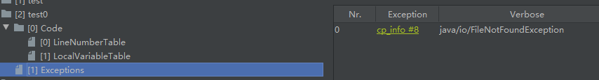

# 12.异常处理

Exception 和 Error 都是继承了 Throwable类，只有 Throwable 类型的实例才可以被抛出 throw 或者被捕获 catch，它是异常处理机制的基本组成类型。

## 12.1 异常的概念

### 12.1.1 **Error** 

Error 是在正常情况下，不大可能出现的情况，绝大部分Error都会导致程序处于非正常状态、不可恢复状态，不需要捕获，如 OutOfMemoryError 之类，都是 Error 的子类。Error是 Throwable 但不是 Exception。

### 12.1.2 **Exception**

Exception 可以分 检查型（check）异常 和 非检查型（unchecked）异常。

1. **检查型异常 **在源代码中需要显示的进行捕获处理，编译器强制要求程序员为这样的异常做预备处理工作（使用   try…catch…finally或者throws）。在方法中要么用try-catch语句捕获它并处理，要么用throws子句声明抛出它，否则编译不会通过，这是编译期检查的一部分，这样的异常一般是由程序的运行环境导致的。因为程序可能被运行在各种未知的环境下，而我们需要考虑到在这种情况下会发生的一些异常。如SQLException 、IOException、ClassNotFoundException 等。
2. **非检查型异常** 就是所谓的运行时异常，javac在编译时，不会提示和发现这样的异常，同样也不要求在程序处理这些异常。所以如果愿意，我们可以编写代码处理（使用try…catch…finally），也可以选择不处理。例如  ClassCastException（错误的强制类型转换异常），ArrayIndexOutOfBoundsException（数组索引越界），NullPointerException（空指针异常）等等。


## 12.2 从JVM角度看异常处理
### 12.2.1 JVM是如何使用异常表处理异常的

JVM采用异常表（Exception table）的方式来对异常进行处理，存放处理异常的信息，每个exception_table表，是由start_pc、end_pc、hangder_pc、catch_type组成

- start_pc、end_pc：表示在code数组中从start_pc到end_pc（包含start_pc，不包含end_pc）的指令抛出的异常会由这个表项（hangder_pc）来处理
- hangder_pc：表示处理异常的代码的开始处。
- catch_type：表示会被处理的异常类型，它指向常量池中的一个异常类。当catch_type=0时，表示处理所有的异常。

```java
package com.lwj.bytecode;

import java.io.FileInputStream;
import java.io.FileNotFoundException;
import java.io.IOException;
import java.io.InputStream;
import java.net.ServerSocket;

public class Test3 {
    public void test() {
        try {
            InputStream is = new FileInputStream("test.txt");
            ServerSocket serverSocket = new ServerSocket(9999);
            serverSocket.accept();
        } catch (FileNotFoundException e) {
			int i = 0;
        } catch (IOException e) {
			int i = 1;
        } catch (Exception e) {
            int i = 2;
        } finally {
            System.out.println("finally");
        }
    }
}
```

对应的反编译结果：

```java
$ javap -v -c Test3.class
Classfile /D:/Repository/Framework/JavaVirtualMachine/jvm/com/lwj/bytecode/Test3.class
  Last modified 2020-3-30; size 756 bytes
  MD5 checksum 5150b854f4ad80e98583822103ad4ac1
  Compiled from "Test3.java"
public class com.lwj.bytecode.Test3
  minor version: 0
  major version: 52
  flags: ACC_PUBLIC, ACC_SUPER
Constant pool:
	// 省略了常量池
{
    // 省略构造方法

  public void test();
    descriptor: ()V
    flags: ACC_PUBLIC
    Code:
     /*
      * 对于 Java 类中的每一个实例方法（非 static 方法），其在编译后所生成的字节码中，
      * 方法参数的数量总是比源代码中方法参数的数量多一个（即为 this），它位于方法的第一个参数位置处。
      * 这样我们就可以在 Java 的实例方法中使用 this 来访问当前对象的属性以及其他方法；
      
      * 该操作在编译期间完成的，即在 Javac 编译器在编译的时候将对 this 的访问转化为对一个普通实例方法的访问，
      * 接下来在运行期间，由 JVM 在实例方法时候，自动的向实例方法传入该 this 参数，
      * 所以在实例方法的局部变量表中，至少会有一个执行当前对象的局部变量。
      */
      //堆栈上最多存3个对象，4个局部变量，有1个参数
      stack=3, locals=4, args_size=1
         // 创建对象，这里就是创建了一个 FileInputStream 对象
         0: new           #2                  // class java/io/FileInputStream
		// dup:复制栈顶数值并将复制值压入栈顶，相当于压栈
         3: dup
		// ldc：从运行期的常量池中推一个 item，就是将常量池中的 test.txt 推进去，使其能构造出该对象
         4: ldc           #3                  // String test.txt
         // 调用父类的相应构造方法    
         6: invokespecial #4                  // Method java/io/FileInputStream."<init>":(Ljava/lang/String;)V
         // 将应用存储到一个局部变量中，就是将 FileInputStream 创建处理实例的引用存储到局部变量 is 中，	   
         // astore_1 中 a 代表操作一个引用 _1 代表存放到局部变量表中的索引为1的位置，0索引位置一般存放 this引用
         9: astore_1
        10: getstatic     #5                  // Field java/lang/System.out:Ljava/io/PrintStream;
		// 可以看出下面这部是 finally 中的内容，也就是try中的代码没有发生异常，会正常走到 finally中
        13: ldc           #6                  // String finally
        15: invokevirtual #7                  // Method java/io/PrintStream.println:(Ljava/lang/String;)V
		// 因为可能报错，因此真正的执行顺序在运行期才能确定，在编译期只能使用 goto 语句做可能的跳转，
        // 这里是try中没有发生异常，直接进行返回
        18: goto          74
		// 正常情况下是无法走到这里的，但是如果发生异常，JVM会根据 Exception table（异常表）中进行相应的指令跳转到这里
        21: astore_1
		// 将int型0推送至栈顶，结合代码可以看到这里是捕获到 FileNotFoundException 异常的处理代码
        22: iconst_0
        23: istore_2
        24: getstatic     #5                  // Field java/lang/System.out:Ljava/io/PrintStream;
        27: ldc           #6                  // String finally
        29: invokevirtual #7  
        32: goto          74
        35: astore_1
		// 将int型1推送至栈顶，结合代码可以看到这里是捕获到 IOException 异常的处理代码
        36: iconst_1
        37: istore_2
        38: getstatic     #5                  // Field java/lang/System.out:Ljava/io/PrintStream;
        41: ldc           #6                  // String finally
        43: invokevirtual #7                  // Method java/io/PrintStream.println:(Ljava/lang/String;)V
        46: goto          74
		// 可以看到 PC 21 36 49 都将捕获的变量保存到局部变量表中index为1的位置，
        // 因为这三部分在运行时只会走其中的一个分支，
        49: astore_1
		// 将int型2推送至栈顶，结合代码可以看到这里是捕获到 Exception 异常的处理代码
        50: iconst_2
        51: istore_2
        52: getstatic     #5                  // Field java/lang/System.out:Ljava/io/PrintStream;
        55: ldc           #6                  // String finally
        57: invokevirtual #7                  // Method java/io/PrintStream.println:(Ljava/lang/String;)V
        60: goto          74
        63: astore_3
        64: getstatic     #5                  // Field java/lang/System.out:Ljava/io/PrintStream;
        67: ldc           #6                  // String finally
        69: invokevirtual #7                  // Method java/io/PrintStream.println:(Ljava/lang/String;)V
        72: aload_3
        73: athrow
        74: return

      Exception table:
         from    to  target type
			//从 0到10 之间的指令如果发生了FileNotFoundException 会跳转到21继续执行
             0    10    21   Class java/io/FileNotFoundException
             0    10    35   Class java/io/IOException
             0    10    49   Class java/lang/Exception
             0    10    63   any
            21    24    63   any
            35    38    63   any
            49    52    63   any
	
	//省略行号表
}
SourceFile: "Test3.java"
```

**如果将异常抛出，对应的字节码为**

```java
public void test0() throws FileNotFoundException {
}
```



### 12.2.2 finally中处理返回值是否影响结果返回

 对于返回变量是基本类型：

```java
public int test3() {
    int i;
    try {
        i = 1;
        return i;
    } finally {
        i = 2;
    }
}

bytecode：    
 public int test3();
    descriptor: ()I
    flags: ACC_PUBLIC
    Code:
      stack=1, locals=4, args_size=1
         0: iconst_1    //将int型1推送至栈顶
         1: istore_1	//将栈顶int型数值存入第二个本地变量
         2: iload_1     //这里准备返回值，将第二个int型本地变量推送至栈顶
         3: istore_2	//由于还有finally块中的语句，所以没有直接返回，而是复制一份保存到第三个本地变量
         4: iconst_2	//执行finally块中的语句，将int型2推送至栈顶
         5: istore_1	//这里将第保存在第二个本地变量的i进行了修改
         6: iload_2     //返回第三个本地变量元素，也就是之前保存的1
         7: ireturn     //返回一个int
		//这里是发生了异常的情况
         8: astore_3	//将捕获到的异常引用，保存在第四个本地变量中
         9: iconst_2	//执行finally块中的内容
        10: istore_1
        11: aload_3     //将捕获到的异常引用推送至栈顶，也就是将第四个引用类型本地变量推送至栈顶
        12: athrow      //将栈顶的异常抛出
      Exception table:
         from    to  target type
             0     4     8   any

```

**结论：**finally块 中修改基本类型的返回变量不会对其有影响。

 对于返回变量是引用类型：

```java
private static class Student {
    private int age;
    //constructor(ing age)
    //get()  set()
}

public Student test5() {
    Student student = null;
    try {
        student = new Student(1);
        return student;
    } finally {
        student.setAge(2);
    }
}

bytecode：    
  public com.lwj.bytecode.Test2$Student test5();
    descriptor: ()Lcom/lwj/bytecode/Test2$Student;
    flags: ACC_PUBLIC
    Code:
      stack=3, locals=4, args_size=1
         0: aconst_null
         1: astore_1
         2: new           #25   // class com/lwj/bytecode/Test2$Student
         5: dup
         6: iconst_1
         7: invokespecial #26   // Method com/lwj/bytecode/Test2$Student."<init>":(I)V
        10: astore_1            // 完成初始化，并将student引用保存到局部变量表中第二个位置
        11: aload_1						    
        12: astore_2			// 将student引用复制到第三个位置，两个引用指向堆中同一个对象
        13: aload_1             // 加载的是第二个位置的student引用
        14: iconst_2
        15: invokevirtual #27   // Method com/lwj/bytecode/Test2$Student.setAge:(I)V
        18: aload_2						    
        19: areturn             // 返回第三个位置的引用，但对象已经通过第二个位置的引用被修改
	   	// 下面是try中发生异常执行的指令
        20: astore_3
        21: aload_1
        22: iconst_2
        23: invokevirtual #27   // Method com/lwj/bytecode/Test2$Student.setAge:(I)V
        26: aload_3
        27: athrow
      Exception table:
         from    to  target type
             2    13    20   any
```

**结论：**由于引用的特殊，在finally块 中修改引用类型的返回值会对其有影响，这里就像方法传参中的值传递和引用传递一样。

**从字节码层面分析了虚拟机在处理异常流程的过程，我们可以看出以下几点内容：**

1. JVM采用异常表的方式来对异常进行处理，而不是简单的跳转命令来实现Java异常及finally处理机制。（注：在JDK1.4.2之前的Javac编译器采用了jsr和ret指令实现finally语句。在JDK1.7中，已经完全禁止Class文件中出现jsr和ret指令，如果遇到这两条指令，虚拟机会在类加载的字节码校验阶段抛出异常）
2. 当异常处理存在finally语句块时，编译器会自动在每一段可能的分支路径之后都将finally语句块的内容冗余生成一遍来实现finally语义。
3. 在我们Java代码中，finally语句块是在最后的，但编译器在生成字节码时候进行了指令重排序，将finally语句块的执行指令移到了return指令之前，这样就从字节码角度解释了finally为什么总是会执行。

## 12.3 日常开发中的异常处理

### 12.3.1 异常屏蔽问题

```java
private static class Connection implements AutoCloseable {
    void sendData() throws Exception {
        throw new Exception("sendData() exception ");
    }

    public void close() throws Exception {
        throw new Exception("close() exception ");
    }
}
	
public static void main(String[] args) {
    try {
        Connection connection = new Connection();
        try {
		   // ...  其他的业务逻辑
            connection.sendData();
        } finally {
            connection.close();
        }
    } catch (Exception e) {
        e.printStackTrace();	// 查看最终的异常信息
    }
}
java.lang.Exception: call close exception 
	at _12_异常处理.Test1$Connection.close(Test1.java:33)
	at _12_异常处理.Test1.main(Test1.java:43)
```

`sendData()` 和 `conn.close()` 都发生了错误，在 finally块 中首先会将 try块 抛出的异常保存到局部变量表中，然后执行自己的逻辑，如果在执行过程中没有发生异常，则会将之前保存的异常，从局部变量表加载到操作数栈顶然后抛出，以上是正常关闭资源的情况，如果关闭资源发生异常，也就是finally块 中的代码出错，则会重新抛出位于操作数栈顶的 新异常，看起来就像是新异常将老异常覆盖了，因此我们无法得知问题的根源。

要解决这个问题也很简单，只需要将新老异常关联起来即可，可以使用Throwable接口中的 initCause（Throwable exception）或者 addSuppressed（Throwable exception）。

下面的简化版代码就实现了 将新老异常关联起来抛出。

```java
public static void main(String[] args) {
    try {
        Connection conn = new Connection();
        Throwable exception = null;
        try {
            conn.sendData();
        } catch (Throwable serviceException) {
            exception = serviceException;
            // finally块 中的修改代码不会影响返回的基本类型，但可以影响引用类型的内容
            // serviceException 的内容可以在finally中被修改。但引用指向不会变化
            throw serviceException;
        } finally {
            try {
                conn.close();
            } catch (Throwable IOException) {
                // initCause() 和 addSuppressed() 的输出结果有所不同
                // exception.initCause(IOException);
                exception.addSuppressed(IOException);
            }
        }
    } catch (Exception e) {
        e.printStackTrace();    // 查看最终的异常信息
    }
}

// initCause()
java.lang.Exception: sendData() exception 
	at _12_异常处理.Test1$Connection.sendData(Test1.java:27)
	at _12_异常处理.Test1.main(Test1.java:64)
Caused by: java.lang.Exception: close() exception 
	at _12_异常处理.Test1$Connection.close(Test1.java:31)
	at _12_异常处理.Test1.main(Test1.java:72)
// addSuppressed()
java.lang.Exception: sendData() exception 
	at _12_异常处理.Test1$Connection.sendData(Test1.java:27)
	at _12_异常处理.Test1.main(Test1.java:64)
	Suppressed: java.lang.Exception: close() exception 
		at _12_异常处理.Test1$Connection.close(Test1.java:31)
		at _12_异常处理.Test1.main(Test1.java:72)
```

### 12.3.2 try-with-resources

虽然我们解决了异常屏蔽的问题，但是在处理资源关闭上有大量臃肿的代码，不过随着Java语言的发展，这一问题已经很好的被解决，在Java 1.7中新增的语法糖 `try-with-resources`，我们用可它打开资源，而无需手动资源关闭代码，为了配合try-with-resources，资源必须实现 AutoClosable 接口，底层还是在编译器做的优化，帮我们自动生成了finally块，并在里边调用了close（）方法。并且使用了 `addSuppressed`来解决之前异常屏蔽的问题。

```java
public static void main(String[] args) {
    try {
        // try-with-resources 方式 不仅美观，美观而且简洁
        try (Connection connection = new Connection()) {
            // ...  其他的业务逻辑
            connection.sendData();
        }
    } catch (Exception e) {
        e.printStackTrace();
    }
}

java.lang.Exception: sendData() exception 
	at _12_异常处理.Test1$Connection.sendData(Test1.java:29)
	at _12_异常处理.Test1.main(Test1.java:40)
	Suppressed: java.lang.Exception: close() exception 
		at _12_异常处理.Test1$Connection.close(Test1.java:33)
		at _12_异常处理.Test1.main(Test1.java:41)
```

我们可以通过反编译查看 使用 try-with-resources 时 ，编译器生成的 finally块：

```java
public static void main(String[] var0) {
    try {
        Test1.Connection var1 = new Test1.Connection();
        Throwable var2 = null;
        try {
            var1.sendData();
        } catch (Throwable var12) {
            var2 = var12;
            throw var12;
        } finally {
            if (var1 != null) {
                if (var2 != null) {
                    try {
                        var1.close();
                    } catch (Throwable var11) {
                        var2.addSuppressed(var11);	//here
                    }
                } else {
                    var1.close();
                }
            }
        }
    } catch (Exception var14) {
        var14.printStackTrace();
    }
}
```


### 12.3.3 处理异常的基本原则

1. 尽量不要捕获类似 Exception 这样的通用异常，而应该捕获特定异常，保证程序不会捕获到我们不希望捕获的异常。

   错误示例：

   ```java
   try{
   	// 业务代码
   }catch(Exception e){
   	// ...
   }
   
   ```

2. 不要生吞异常。这里的生吞是指输出到标准错误流，正确的做法应该是输出到日志系统里。

   ```java
   try{
   	//业务代码
   }catch(IOException e){
       e.printStackTrace();
   }
   ```

3. 不要在 finally 块中处理返回值，修改基本类型的返回值与引用类型的返回值的产生的结果不同。

4. throw early ，catch late。  尽量在第一时间暴露问题，捕获异常后，切勿 ”生吞异常“ ，不知道如何处理可以保留原有异常信息，直接再抛出或构建新异常跑出去，在更高层面有了清晰的逻辑，会更清楚处理方式。

   ```java
   public void throwEarly(String fileName){
       Objects.requireNonNull(fileName);	//throw early
   	otherFun(fileName);
   }
   ```

### 12.3.4 从性能角度审视Java异常处理机制

- try - catch 代码会产生额外的性能开销，但也不至于谈虎色变，正常合理的使用即可。尽量不要一个大的 try 包住整段代码，同时也不要利用异常控制代码流程。
- Java 每实例化一个 Exception ，都会对当前的栈进行快照，这是一个相对比较重的操作，如果发生的非常频繁，这个开销就不能被忽略了。

**Reference**
[《Java核心技术36讲》](https://time.geekbang.org/column/intro/82)