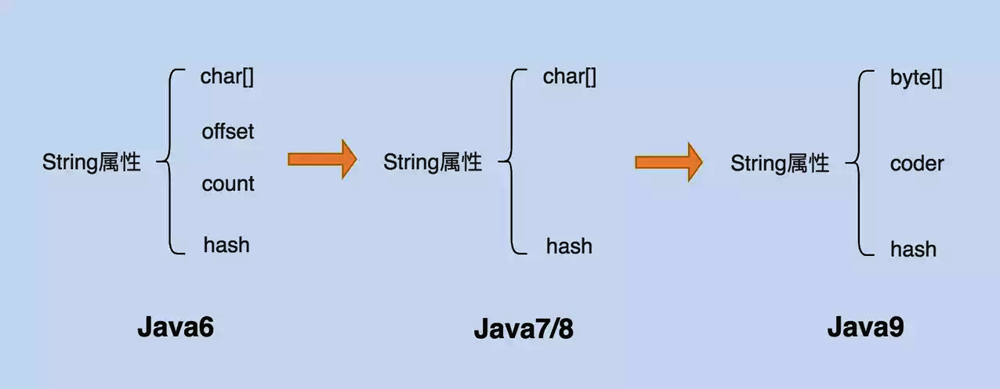

# 13.字符串

## 13.1 String 简介

String 类是Java中非常基础和重要的类，提供了构造和管理字符串的基本逻辑，它是典型的 Immutable 类，被声明成为 final class，所有的属性也是 fianl 的。由于它的不可变性，类似拼接、裁剪字符串等动作，都会产生新的 String 对象，因此字符串相关性能的效率对应用性能有明显影响。

## 13.2 String 对象的创建

### **通过字符串常量的方式**

`String str = "a"`的形式，使用这种形式创建字符串时， JVM 会在字符串常量池中先检查是否存在该对象，如果存在，返回该对象的引用地址，如果不存在，则在字符串常量池中创建该字符串对象并且返回引用。使用这种方式创建的好处是：避免了相同值的字符串重复创建，节约了内存。

### **String()构造函数的方式**

`String str = new String("a")`的形式，使用这种方式创建字符串对象过程就比较复杂，分成两个阶段，首先在编译时，字符串`a`会被加入到常量结构中，类加载时候就会在常量池中创建该字符串。然后就是在调用new()时，JVM 将会调用`String`的构造函数，同时引用常量池中的`a`字符串， 在堆内存中创建一个`String`对象并且返回堆中的引用地址。

了解了`String`对象两种创建方式，我们来分析一下下面这段代码，加深我们对这两种方式的理解，下面这段代码片中，`str`是否等于`str1`呢？

```
  String str = "a";
  String str1 = new String("a");
  system.out.println(str==str1)
复制代码
```

我们逐一来分析这几行代码，首先从`String str = "a"`开始，这里使用了字符串常量的方式创建字符串对象，在创建`a`字符串对象时，JVM会去常量池中查找是否存在该字符串，这里的答案肯定是没有的，所以JVM将会在常量池中创建该字符串对象并且返回对象的地址引用，所以`str`指向的是`a`字符串对象在常量池中的地址引用。

然后是`String str1 = new String("a")`这行代码，这里使用的是构造函数的方式创建字符串对象，根据我们上面对构造函数方式创建字符串对象的理解，`str1`得到的应该是堆中`a`字符串的引用地址。由于`str`指向的是`a`字符串对象在常量池中的地址引用而`str1`指向的是堆中`a`字符串的引用地址，所以`str`肯定不等于`str1`。

## 13.3 String常用方法

```java
public final class String
    implements java.io.Serializable, Comparable<String>, CharSequence {
    // String类使用final作为一个不可变类，实现了序列化接口、比较接口、字符序列接口
    // CharSequence 字符序列接口 常用实现类有String StringBuilder StringBuffer
    public int length() { return value.length;}  
    
    public char charAt(int index) {
       //...
        return value[index];
    }
    
    public String toString();
    
    // 拆分字符序列，包左不包右
    public CharSequence subSequence(int beginIndex, int endIndex) {
        return this.substring(beginIndex, endIndex);
    }

	// replace 和 replaceAll 两者都是可以全部替换 replaceAll 支持正则表达式
    public String replace(CharSequence target, CharSequence replacement) {
        return Pattern.compile(target.toString(), Pattern.LITERAL).matcher(
                this).replaceAll(Matcher.quoteReplacement(replacement.toString()));
    }    
    
    public String replaceAll(String regex, String replacement) {
        return Pattern.compile(regex).matcher(this).replaceAll(replacement);
    }
    
	// equals是Object的方法，contenEquals可以判断字符序列内容是否相等
    public boolean equals(Object anObject) {
    		//...
    	}
    public boolean contentEquals(CharSequence cs) {
        	//...
    	}

	// 是否包含指定 字符序列
    public boolean contains(CharSequence s) {  	
   		return indexOf(s.toString()) > -1;
    }

    /*
     * 在调用”ab”.intern()方法的总是会返回常量池中”ab”的引用
     * 该方法会首先检查字符串池中是否有”ab”这个字符串，如果存在则返回该字符串的引用，
     * 否则就将这个字符串添加到常量池中，然会返回该字符串的引用。
     */
	public native String intern();  
    
    // 返回指定索引的字符
    public char charAt(int index) {    
        if ((index < 0) || (index >= value.length)) {
            throw new StringIndexOutOfBoundsException(index);
        }
        return value[index];
    }

    //判断字符串中是否包含 指定字符，如包含返回索引，否则返回-1
    public int indexOf(String str) {
        //...
    }
    
    // 将输入值转为字符串
    public static String valueOf(int i) {   
        return Integer.toString(i);
    }
    
    // 按regex分割成String数组，limit默认为0，是分成几块
    public String[] split(String regex, [int limit])  

	// 分割字符串包左不包右 
	public String substring(int beginIndex, [int endIndex]) {}  
	
    // 向当前字符串对象末尾追加str
	public String concat(String str) {}     

    // 变成字符数组 
	public char[] toCharArray() {}       

    // 字符串反转
	StringBuilder public AbstractStringBuilder reverse() {}  
```

### **灵活的字符串的分割**

字符串的分割是字符串操作的常用操作之一，对于字符串的分割，大部分人使用的都是 Split() 方法，Split() 方法大多数情况下使用的是正则表达式，这种分割方式本身没有什么问题，但是由于正则表达式的性能是非常不稳定的，使用不恰当会引起回溯问题，很可能导致 CPU 居高不下。在以下两种情况下 Split() 方法不会使用正则表达式：

- 传入的参数长度为1，且不包含“.$|()[{^?*+\”regex元字符的情况下，不会使用正则表达式
- 传入的参数长度为2，第一个字符是反斜杠，并且第二个字符不是ASCII数字或ASCII字母的情况下，不会使用正则表达式

**所以我们在字符串分割时，应该慎重使用 Split() 方法，首先考虑使用 String.indexOf() 方法进行字符串分割，如果 String.indexOf() 无法满足分割要求，再使用 Split() 方法，使用 Split() 方法分割字符串时，需要注意回溯问题。**


## 13.4 String 为什么设计为不可变类

1. 保证 String 对象的安全性。假设 String 对象是可变的，那么 String 对象将可能被恶意修改。
2. 保证 hash 属性值不会频繁变更，确保了唯一性，使得类似 HashMap 容器才能实现相应的 key-value 功能。
3. 可以实现字符串常量池

## 13.5 String的缓存

通过对常见应用的堆转储（Dump Heap），分析对象组成，会发现25%的对象是字符串，其中有半数是重复的，如果能避免创建重复的字符串，那么可以有效降低内存消耗和对象创建开销，这便是 字符串常量池 存在的意义。

编译期间，编译器就会将代码中用到的所有字符串汇总到一起，保存在字节码文件中某个位置，这一部分就是字符串常量池了，以上是静态地生成常量池的过程。在程序运行期间，字符串也可以被动态的添加至池中。

String 在 Java 6 以后提供了 intern（）方法，目的是提示JVM把对应的字符串缓存起来，以备重复使用。在我们对字符串对象调用 intern（）方法的时候，如果常量池中已经有缓存的字符串，则会返回缓存的实例引用，否则先将其缓存起来，再返回实例引用。这样就可以避免创建重复的对象，帮助我们节约不少的空间。

Intern 是一种显示的排重机制，但它也有一定的副作用，一个是因为常量池的实现机制，类似于HashTable的实现方式，存储的数据量越大，遍历的时间复杂度就会增加，背离了intern的初衷；另一个是写起来不方便，而且在开发时，很难统计字符串的重复情况。因此，我们要结合场景使用。

> Oracle JDK 8u20之后，推出了一个新特性，在G1 GC 下的字符串排重，它是通过将相同数据的字符串指向同一份数据来做到的，是JVM底层的改变，不需要Java类库做什么修改。

**一般情况下JVM 会将 类似 "abc"这样的文本字符串，或者字符串常量之类的缓存起来。**

在Java 6及以前的版本中，HotSpot 虚拟机通过用永久代来实现了JVM中方法区的概念（其他虚拟机实现可没有永久代的概念），这个空间是有限的，基本不会被FullGC以外的垃圾收集照顾到，因此，容易发生OOM。

Java 7中将字符串常量从永久代移出，放置在堆中，这样就极大的避免了永久带占满的问题。

JDK 8中永久代被 MetaSpace （元数据区）代替了，这个区域并不在JVM中，而是属于本地内存，因此可以随着物理机的内存增长而增长。元空间存储类的元信息，静态变量和常量池等并入堆中。

## 13.6 字符串的拼接

 字符串的拼接是对字符串操作使用最频繁的操作之一，因此编译器会对其进行优化。

### **字面量的直接拼接**

```java
// 字面量（文本字符串）直接拼接
public void test0() {
    String str = "111" + "222";
}

	// 反编译后：
  public void test0();
    Code:
       0: ldc           #2	// String 111222   将int,float或String型常量值从常量池中推送至栈顶
       2: astore_1
       3: return
```

前面提到JVM会将类似 “abc” 这样的文本字符串缓存起来，代码中 “111”+“222”，编译器可以直接判断出结果是 “111222”，所以会将 “111222” 这个字符字面量存放到常量池中，还需要注意的是，常量池中不会缓存 “111” 和 “222”。

```java
public void test1() {
    final  String str1 = "111";
    final  String str2 = "222";
    String str = str1 + str2;
}
```

字符串常量也会被JVM在编译期缓存起来，上面的代码在反编译后会和 test0（）的反编译结果相同。

### **字符串变量的拼接**

```java
// 字符串变量的拼接
public void test1() {
    String str1 = "111";
    String str2 = "222";
    String str = str1 + str2;
}

  public void test1();
    Code:
       0: ldc           #3                  // String 111
       2: astore_1
       3: ldc           #4                  // String 222
       5: astore_2
       6: new           #5                  // class java/lang/StringBuilder
       9: dup
      10: invokespecial #6                  // Method java/lang/StringBuilder."<init>":()V
      13: aload_1
      14: invokevirtual #7                  // Method java/lang/StringBuilder.append:(Ljava/lang/String;)Ljava/lang/StringBuilder;
      17: aload_2
      18: invokevirtual #7                  // Method java/lang/StringBuilder.append:(Ljava/lang/String;)Ljava/lang/StringBuilder;
      21: invokevirtual #8                  // Method java/lang/StringBuilder.toString:()Ljava/lang/String;
      24: astore_3
      25: return

```

在JDK 8中，使用 “ + ” 进行的字符串变量拼接操作会自动被 Java编译器转换为 StringBuilder 操作，下面的代码进行编译后会生成和上面一样的字节码指令，但写法比较繁琐。

```java
public void test2() {
    String str1 = "111";
    String str2 = "222";
    String str=new StringBuilder().append(str1).append(str2).toString();
}
```

由于这个特性的存在，我们要尽量不要在循环中使用字符串拼接，因为这种做法会导致创建大量的StringBuilder对象，从而容易引起OOM。

```java
String str = "str";
for(int i=0; i<1000; i++) {
      str = str + i;
}
//编译器优化后
String str = "str";
for(int i=0; i<1000; i++) {
    str = (new StringBuilder(String.valueOf(str))).append(i).toString();
}
```

所以我们在做字符串拼接时，如果不涉及到线程安全的情况下，我们显示的使用 StringBuilder 进行拼接，提升系统性能，如果涉及到线程安全的话，可以使用 StringBuffer 来进行字符串拼接。

```java
StringBuilder str = new StringBuilder("str");
for (int i = 0; i < 1000; i++) {
    str = str.append(i);
}
```

> 在JDK 9中为了更加统一字符串的操作优化，提供了 StringConcatFactory。

### 字符串面试题

```java
// 创建了几个对象	
String st1 = new String(“adasfbc”);	// 2个 一个位于字符串常量池  一个位于堆中
String st2 = new String(“java");	// 1个 java 这个字符在jvm启动的时候就被用了，所以只有堆中一个
```

> 个人觉得应该一个对象，位于字符串常量池中的字面量不算对象，只能算是字符串，而在堆中创建的才是真正的对象。

```java
String str1 = "ab";
String str2 = "ab";
System.out.println(str1 == str2);
// true
```

```java
String str1 = new String("ab");
String str2 = "ab";
System.out.println(str1 == str2);
//	false
```

```java
String str1 = "a" + "b";
String str2 = "ab";
System.out.println(str1 == str2);
// true
```

```java
String str1 = "a";
String str2 = str1 + "b";
String str3 = "ab";
System.out.println(str2 == str3);
// false
```

```java
final String str1 = "a";
String str2 = str1 + "b";
String str3 = "ab";
System.out.println(str2 == str3);
// true
```


## 13.7 String 的自身演化



**Java6 以及以前版本**

String 对象是对 char 数组进行了封装实现的对象，主要有四个成员变量： char 数组、偏移量 offset、字符数量 count、哈希值 hash。

String 对象是通过 offset 和 count 两个属性来定位 char[]  数组，获取字符串。这么做可以高效、快速地共享数组对象，同时节省内存空间，但这种方式很有可能会导致内存泄漏。

**Java7 版本开始到 Java8 版本**

从 Java7 版本开始，Java 对 String 类做了一些改变。String 类中不再有 offset 和 count 两个变量了。这样的好处是String 占用的内存稍微少了些，同时 String.substring  方法也不再共享 char[]，从而解决了使用该方法可能导致的内存泄漏问题。

 **Java9 版本开始**

将 char[] 数组改为了 byte[] 数组，并增加一个标识编码的属性 coder。coder 属性默认有 0 和 1 两个值， 0 代表Latin-1（单字节编码），1 代表 UTF-16 编码。在计算字符串长度或者调用 indexOf() 方法时，会用到这个属性。

Java中char 是两个字节大小，但我们平时使用的26个字母和数字都可以用一个byte来表示，只有在存中文字符的时候才会用到两个字节，因此为了节约空间，将字符串的实现由之前的两个字节，改为一个字节，我们可以明显感受到紧凑字符串带来的优势，即更小的内存占用，更快的传输和操作速度。

## 13.8 String 的 hashCode () 中的31

- 31 是一个不大不小的质数，在设计hash算法时，选择一个特殊的质数可以很好的控制哈希算法的冲突率。这个质数如果太小，则哈希值会分布在一个较小的数值区间，分布性不佳，导致冲突率上升；同样如果质数太大，虽然很会冲突率会降低，但是用int类型来表示的话会溢出，而且会占用更多的空间。
- 31 可以被 JVM 优化 31* i  = (i<<5) - i

### 哈希值冲突率计算

计算哈希算法冲突率并不难，比如可以一次性将所有单词的 hash code 算出，并放入 Set 中去除重复值。之后拿单词数减去 set.size() 即可得出冲突数，有了冲突数，冲突率就可以算出来了。当然，如果使用 JDK8 提供的流式计算 API，则可更方便算出，代码片段如下：

```java
public static Integer hashCode(String str, Integer multiplier) {
    int hash = 0;
    for (int i = 0; i < str.length(); i++) {
        hash = multiplier * hash + str.charAt(i);
    }

    return hash;
}
    
/**
 * 计算 hash code 冲突率，顺便分析一下 hash code 最大值和最小值，并输出
 * @param multiplier
 * @param hashs
 */
public static void calculateConflictRate(Integer multiplier, List<Integer> hashs) {
    Comparator<Integer> cp = (x, y) -> x > y ? 1 : (x < y ? -1 : 0);
    int maxHash = hashs.stream().max(cp).get();
    int minHash = hashs.stream().min(cp).get();

    // 计算冲突数及冲突率
    int uniqueHashNum = (int) hashs.stream().distinct().count();
    int conflictNum = hashs.size() - uniqueHashNum;
    double conflictRate = (conflictNum * 1.0) / hashs.size();

    System.out.println(String.format("multiplier=%4d, minHash=%11d, maxHash=%10d, conflictNum=%6d, conflictRate=%.4f%%",
                multiplier, minHash, maxHash, conflictNum, conflictRate * 100));
}
```

结果如下：


从上图可以看出，使用较小的质数做为乘子时，冲突率会很高。尤其是质数2，冲突率达到了 55.14%。同时我们注意观察质数2作为乘子时，哈希值的分布情况。可以看得出来，哈希值分布并不是很广，仅仅分布在了整个哈希空间的正半轴部分，即 0 ~ 231-1。而负半轴 -231 ~ -1，则无分布。这也证明了我们上面断言，即质数2作为乘子时，对于短字符串，生成的哈希值分布性不佳。然后再来看看我们之前所说的 31、37、41 这三个不大不小的质数，表现都不错，冲突数都低于7个。而质数 101 和 199 表现的也很不错，冲突率很低，这也说明哈希值溢出并不一定会导致冲突率上升。但是这两个家伙一言不合就溢出，我们认为他们不是哈希算法的优选乘子。最后我们再来看看 32 和 36 这两个偶数的表现，结果并不好，尤其是 32，冲突率超过了了50%。尽管 36 表现的要好一点，不过和 31，37相比，冲突率还是比较高的。当然并非所有的偶数作为乘子时，冲突率都会比较高，大家有兴趣可以自己验证。

### 哈希值分布可视化

上一节分析了不同数字作为乘子时的冲突率情况，这一节来分析一下不同数字作为乘子时，哈希值的分布情况。在详细分析之前，我先说说哈希值可视化的过程。我原本是打算将所有的哈希值用一维散点图进行可视化，但是后来找了一圈，也没找到合适的画图工具。加之后来想了想，一维散点图可能不合适做哈希值可视化，因为这里有超过23万个哈希值。也就意味着会在图上显示超过23万个散点，如果不出意外的话，这23万个散点会聚集的很密，有可能会变成一个大黑块，就失去了可视化的意义了。所以这里选择了另一种可视化效果更好的图表，也就是 excel 中的平滑曲线的二维散点图（下面简称散点曲线图）。当然这里同样没有把23万散点都显示在图表上，太多了。所以在实际绘图过程中，我将哈希空间等分成了64个子区间，并统计每个区间内的哈希值数量。最后将分区编号做为X轴，哈希值数量为Y轴，就绘制出了我想要的二维散点曲线图了。这里举个例子说明一下吧，以第0分区为例。第0分区数值区间是[-2147483648, -2080374784)，我们统计落在该数值区间内哈希值的数量，得到 `<分区编号, 哈希值数量>` 数值对，这样就可以绘图了。分区代码如下：

```java
 /**
 * 将整个哈希空间等分成64份，统计每个空间内的哈希值数量
 * @param hashs
 */
public static Map<Integer, Integer> partition(List<Integer> hashs) {
    // step = 2^32 / 64 = 2^26
    final int step = 67108864;
    List<Integer> nums = new ArrayList<>();
    Map<Integer, Integer> statistics = new LinkedHashMap<>();
    int start = 0;
    for (long i = Integer.MIN_VALUE; i <= Integer.MAX_VALUE; i += step) {
        final long min = i;
        final long max = min + step;
        int num = (int) hashs.parallelStream()
                .filter(x -> x >= min && x < max).count();

        statistics.put(start++, num);
        nums.add(num);
    }

    // 为了防止计算出错，这里验证一下
    int hashNum = nums.stream().reduce((x, y) -> x + y).get();
    assert hashNum == hashs.size();

    return statistics;
}
```

接下来，让我们对照上面的分区表，对数字2、3、17、31、101的散点曲线图进行简单的分析。先从数字2开始，数字2对于的散点曲线图如下：


上面的图还是很一幕了然的，乘子2算出的哈希值几乎全部落在第32分区，也就是 `[0, 67108864)`数值区间内，落在其他区间内的哈希值数量几乎可以忽略不计。这也就不难解释为什么数字2作为乘子时，算出哈希值的冲突率如此之高的原因了。所以这样的哈希算法要它有何用啊，拖出去斩了吧。接下来看看数字3作为乘子时的表现：


3作为乘子时，算出的哈希值分布情况和2很像，只不过稍微好了那么一点点。从图中可以看出绝大部分的哈希值最终都落在了第32分区里，哈希值的分布性很差。这个也没啥用，拖出去枪毙5分钟吧。在看看数字17的情况怎么样：


数字17作为乘子时的表现，明显比上面两个数字好点了。虽然哈希值在第32分区和第34分区有一定的聚集，但是相比较上面2和3，情况明显好好了很多。除此之外，17作为乘子算出的哈希值在其他区也均有分布，且较为均匀，还算是一个不错的乘子吧。


接下来来看看我们本文的主角31了，31作为乘子算出的哈希值在第33分区有一定的小聚集。不过相比于数字17，主角31的表现又好了一些。首先是哈希值的聚集程度没有17那么严重，其次哈希值在其他区分布的情况也要好于17。总之，选31，准没错啊。


最后再来看看大质数101的表现，不难看出，质数101作为乘子时，算出的哈希值分布情况要好于主角31，有点喧宾夺主的意思。不过不可否认的是，质数101的作为乘子时，哈希值的分布性确实更加均匀。所以如果不在意质数101容易导致数据信息丢失问题，或许其是一个更好的选择。

## 13.9 StringBuffer & StringBuilder 

StringBuffer 是为了解决上面提到的拼接产生太多中间对象的问题而提供的一个类，它是Java1.5中新增的，我们可以用appened 或者 add 方法，把字符串添加到已有序列的末尾或者指定位置，StringBuffer 本质是一个线程安全的可修改字符序列，初始容量为16，它在保证线程安全的同时也带来了额外的性能开销，除非有线程安全的需要，不然还是推荐使用StringBuilder，这两者都继承自 AbstractStringBuilder，在重写父类方法时，只是简单的调用了父类对应方法，区别在于StringBuffer 会在方法上加上 synchronized 来保证线程的安全。

**StirngBuileder动态扩容** 

构建时初始的字符数组长度为16，每次在拼接字符串的时候，都会修改底层的字符数组，不过在正式修改之前，先会确定当前字符数组的容量是否足够，不够的话会进行扩容，扩容之后还要进行数组拷贝。这一过程会产生多重开销，因此如果我们能确定拼接会发生非常多次且容量大致可预计，那么就可以指定合适的初始大小，避免多次扩容带来的性能开销。