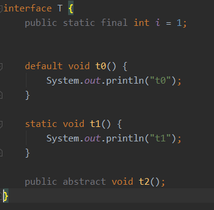
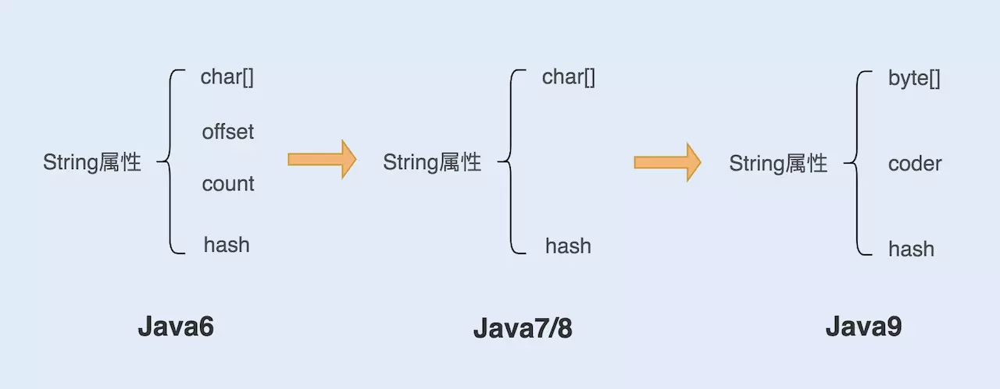

# 1.基本数据类型

基本类型的表示范围：


比特/位（bit）：二进制位，要么为0，要么为1 。

字节（byte）：由8个bit位 构成。

boolean 类型所占存储空间的大小没有明确指定，仅定义为能够取字面值true或false，在内存中占用1位  所以位运算符才可以操作boolean型。

Java 中每个 字符的 尺寸都是 16位（2个字节），以此来提供对Unicode字符集的支持，默认值为 `\u0000(null)`

如果按二进制来看的话，8位(bits) 最多表示255个数，而表示数值的基本类型都有正负之分，Java是将最高位作为符号位来表示，一个数的正负，最高位为0则是正数，1则是负数。这也就是为什么byte类型 表示正数的最大值是+127，分别代表1（128）1（64）1（32）1（16）1（8）1（4）1（2）1（1）。`0（0000，0000） ` 是` +0` 来表示0 ，`128（1000，0000）`也就是`-0` 来表示 -128，`129（1000，0001）` 表示 -127，`255（1111,1111）`表示-1。

Java中没有无符号基本数据类型，`byte`、`short`、`int` 和 `long`都是带符号整型，最高位是符号位。

如上例中，byte  带符号整型 -1 对应 无符号整型 255。可以通过 `Byte.toUnsingedInt()` 查看。

Java 提供了两个用于高精度计算的类：BigInteger 和 BigDecimal，对应整形和实型，通过调用这两个类的方法来替代操作符。

> 引用数据类型:   4个字节 用来代表对象的地址

## 数值的表示

```java
int a = 0b11;	//二进制	表示3
int b = 011;	//八进制	表示9
int c = 11;		//十进制	表示11
int d = 0x1f;	//十六进制	表示31
```

```java
long l = 10L;
float f = 1.1f;
double d = 1.1d;
```

Integer 和 Long 的toBinaryString()，可以将整型的数字转化为二进制的。

还要注意不同类型变量的转换，每个变量的大小和表示范围参考 基本数据类型 中的图片。

表示范围小的变量  转换=》 表示范围大的变量，可以直接转换。

```java
int i1 = 1;
long l = i1;
```

 表示范围大的变量  转换=》表示范围小的变量，需要进行强制转换。

```java
long l=1;
int i2= (int) l;
```

注意：强制转换可以会导致数据发生异常，如下例：

```java
byte b1 =(byte)127;	//0111,1111 127
byte b1 =(byte)128;	//1000,0000 -128
byte b1 =(byte)129;	//1000,0001 -127
byte b1 =(byte)255;	//1111,1111 -1
byte b1 =(byte)256;	//1，0000,0000 0
```

将int型（32位）的256转为byte型（8位），只会保留后边的8位，因此转换结果为0。

整型的数值运算后默认用 int 类型来接收，如果操作数中有long类型，则转化为long类型运算，结果也为long，实型的数值(小数)运算默认用 double 接收。

在能表示最大范围值的基础上再进行+1，就会发生溢出。

```java
byte res = (byte) ((byte) 127 + (byte) 1); //这里先用int类型来保存128，再进行转换，发生了溢出
System.out.println(res);	//-128 
```

## [字符编码](./think of Java：1-字符编码.md)

# 3.操作符

## ==  与 ！=

对于引用类型来说，`== ` 比较的是两个引用是否指向同一个对象，如果想比较两个对象的实际内容是否相同，可以重写Object类的方法 `equals()`并进行比较。基本类型直接使用 `==` 和 `！=` 。

== 代表比较双方是否相同，如果是基本类型则表示值相等，如果是引用类型则表示地址相等，即是同一个对象
equals 提供定义“对象内容相等”的逻辑

## 逻辑操作符

“与（&&）”、“或（||）”、“非（！）”，这里有一个需要注意的地方是，逻辑操作符会遇到一种 **短路** 现象，例如 “与” 操作， (表达式A) && (表达式B)，其中的表达式A可以为一个变量的引用，也可以是返回boolean类型的方法，B同理，如果 A 的结果为false，那么不用计算表达式B的结果（如果B是方法，那么这个方法都不会去执行），直接判定整个表达式结果为false。这样可以获得潜在的性能提升。

## 按位操作符

按位操作符有与（&）、或（|）、非（～）和异或（^），按位进行运算。

与运算的规则是，必须两个数同时为`1`，结果才为`1`：

```java
n = 0 & 0; // 0
n = 0 & 1; // 0
n = 1 & 0; // 0
n = 1 & 1; // 1
```

或运算的规则是，只要任意一个为`1`，结果就为`1`：

```java
n = 0 | 0; // 0
n = 0 | 1; // 1
n = 1 | 0; // 1
n = 1 | 1; // 1
```

非运算的规则是，`0`和`1`互换：

```java
n = ~(1000,0000); //0111,1111 127
```

异或运算的规则是，如果两个数不同，结果为`1`，否则为`0`：

```java
n = 0 ^ 0; // 0
n = 0 ^ 1; // 1
n = 1 ^ 0; // 1
n = 1 ^ 1; // 0
```

## 移位操作符

在计算机中，整数总是以二进制的形式表示。例如，`int`类型的整数`7`使用4字节表示的二进制如下：

```ascii
00000000 0000000 0000000 00000111
```

可以对整数进行移位运算。对整数`7`左移1位将得到整数`14`，左移两位将得到整数`28`：

```java
int n = 7;       // 00000000 00000000 00000000 00000111 = 7
int a = n << 1;  // 00000000 00000000 00000000 00001110 = 14
int b = n << 2;  // 00000000 00000000 00000000 00011100 = 28
int c = n << 28; // 01110000 00000000 00000000 00000000 = 1879048192
int d = n << 29; // 11100000 00000000 00000000 00000000 = -536870912
```

左移29位时，由于最高位变成`1`，因此结果变成了负数。

类似的，对整数28进行右移，结果如下：

```java
int n = 7;       // 00000000 00000000 00000000 00000111 = 7
int a = n >> 1;  // 00000000 00000000 00000000 00000011 = 3
int b = n >> 2;  // 00000000 00000000 00000000 00000001 = 1
int c = n >> 3;  // 00000000 00000000 00000000 00000000 = 0
```

如果对一个负数进行右移，最高位的`1`不动，结果仍然是一个负数：

```java
int n = -536870912;
int a = n >> 1;  // 11110000 00000000 00000000 00000000 = -268435456
int b = n >> 2;  // 10111000 00000000 00000000 00000000 = -134217728
int c = n >> 28; // 11111111 11111111 11111111 11111110 = -2
int d = n >> 29; // 11111111 11111111 11111111 11111111 = -1
```

还有一种不带符号的右移运算，使用`>>>`，它的特点是符号位跟着动，因此，对一个负数进行`>>>`右移，它会变成正数，原因是最高位的`1`变成了`0`：

```java
int n = -536870912;
int a = n >>> 1;  // 01110000 00000000 00000000 00000000 = 1879048192
int b = n >>> 2;  // 00111000 00000000 00000000 00000000 = 939524096
int c = n >>> 29; // 00000000 00000000 00000000 00000111 = 7
int d = n >>> 31; // 00000000 00000000 00000000 00000001 = 1
```

对`byte`和`short`类型进行移位时，会首先转换为`int`再进行位移。

仔细观察可发现，左移实际上就是不断地×2，右移实际上就是不断地÷2。

## 三目运算符

（boolean）？A：B

如果boolean为true，则执行A，否则执行B，其中，如果遇到可以转换为数字的类型，会做自动类型提升。

```java
Object o1 = (false) ? new Double(1) : new Integer(2);
System.out.println(o1);	//2.0
```


# 5.初始化与清理

## 构造器初始化

​		从概念上讲，“创建”与“初始化”是彼此独立的，创建是指对象在内存分配对象空间的过程，而初始化是在对象完成创建后，在被正式使用前的定义初始状态的过程。

​		但在Java中，”创建“和”初始化“是捆绑在一起的，这是为了确保每个对象在使用前都能被正确的初始化，因此设计出构造方法来完成对类的创建及初始化。

​		如果代码中没有提供构造器的话，编译器会默认提供一个无参构造器，但是如果已经定义了一个构造器（无论是否有参数），编译器就不会提供默认无参构造。

​		构造之间可以相互调用，但不能循环调用，可以使用this关键字，`this()`或`this(int)`，这里还要注意的是必须将this()放置在构造器的调用的最初始位置。this指的是调用方法的当前对象，作为方法的隐藏参数传入。

**创建一个对象分为如下三步：**

1. 分配对象的内存空间，并根据对象成员变量的类型进行相应的初始化（如整型的默认值为0，char默认值为"\u0000"（NULL空字符串），boolean默认为false，引用类型默认为null）。
2. 执行编译后字节码中的`<init>方法`（构造方法），这个构造方法不仅仅是构造器中的内容，还包括成员变量的初始化，以及代码块初始化，这部分的内容由程序开发者来定义，对类中的成员变量进行初始化。
3. 通过new表达式返回对新建对象的引用，构造器本身不会返回任何值，它只负责执行操作。

## 构造方法

​		`<init>方法`内容不仅仅局限于 **构造方法中代码**，还有对 **成员变量（非static）定义时的赋值操作** 以及 **`{}`中的初始化代码块**，编译器会以上三者的内容都编译为字节码，一起存放在`<init>`方法中。**字节码的先后顺序决定执行的先后顺序。**

​		构造方法中的代码对应的字节码总是放在对应构造方法的最后。

​		而定义时的初始化操作和初始化代码的先后顺序取决于源码中这两者定义的先后顺序。

​		静态变量的初始化和静态代码块同理。

​	示例如下：

- ```java
  public class Test3 {
      int i = 1;	
      { i = 0; }
  
      public static void main(String[] args) {
          System.out.println(new Test3().i);		
      }
  }	
  	//Output
  	//0
  ```

- ```java
  public class Test4 {
      { i = 0; }	
      int i = 1;
  
      public static void main(String[] args) {
          System.out.println(new Test4().i);		
      }
  }	
  	//Output
  	//1
  ```

  

## 方法重载

- 方法名相同，参数类型不同。参数类型不同也可以重载。
- 由于基本类型可以自动从一个”较小“的类型提升到一个”较大“的类型，在没有当前参数类型的重载方法时，整型的变量会逐级扩大去寻找（byte-》short-》int-》long），char类型会提升到int型，实型（float-》double）。
- 如果想让实参的类型变小来适应形参的话，则需要手动转换。
- 需要注意的是，无法用返回值来区分重载方法，重载其实是方法的静态分派

## 方法重写

​    1.方法参数相同
​    2.返回类型和声明异常类型，子类小于等于父类
​    3.访问权限，子类大于等于父类

## finalize()

​		finalize 是基础类 java.lang.Object 的一个方法，它的设计目的是保证对象在被垃圾收集前完成特定资源的回收， finalize 机制现在已经不推荐使用了，在 JDK 9 中开始被标记为 deprecated。

​		当我们不再使用某个对象时，这个对象的内存空间就需要被回收，以便分配新的对象，在Java中不需要我们手动来终结一个对象，JVM的垃圾收集线程会代替我们来做这件事。

​		如果判定某个对象需要回收，会判断该对象是否重写了`finalize()`方法或者该方法是否已经被调用过了，如果没有重写或者已经被调用过了，那么本次垃圾回收会回收该对象。

​		如果重写了但`finalize()`方法没被调用过，那么有必要执行该finalize方法，具体的执行过程是具体过程是将该对象放置到一个叫做 F-Queue 的队列之中，**并在稍后由一个由虚拟机自动建立的、低优先级的 Finalizer 线程去执行它，这里所谓的“执行”是指虚拟机会触发这个方法，但并不承诺会等待它运行结束**，这样做的原因是，如果一个对象在 finalize() 方法中执行缓慢或者发生了死循环，将很可能会导致 F-Queue 队列中其他对象永久处于等待，甚至导致整个内存回收系统崩溃。

​		因此一旦实现了非空的 finalize 方法，就会导致相应对象回收呈现数量级上的变慢，比使用try-with-resources机制慢50倍，finalize 成为了快速回收对象的阻碍者。

​		Java 平台目前逐步使用( java.lang.ref.Cleaner ) Cleaner机制来替换掉原有的 finalize 实现。Cleaner的实现利用了 幻象引用（PhantomReference），这是一种常见的 post - mortem 清理机制。利用幻象引用和引用队列，可以保证对象被彻底销毁前做一些类似资源回收的工作，吸取了 finalize 的教训，每个Cleaner的操作都是独立的，它运行在ReferenceHandler线程，这是一个最大优先级的守护线程。Cleaner机制不如Finalizer机制那样危险，但仍然是不可预测，运行缓慢并且通常是不必要的。

​		Finalizer机制和Cleaner机制的缺陷，在《Effective Java》第三版中对[避免使用 finalize 和 Cleaner](./https://www.jianshu.com/p/45b4df2bd7aa)进行了详细说明。	


## 数组初始化

三种数组初始化的方式：

```java
    int[] arr = new int[10];
    int[] arr1 = new int[]{1, 2, 3};
    int arr2[] = {1, 2, 3};
```


# 7.复用类

## 继承

父类也叫超类，基类，衍生类；java中单继承，多实现。
子类继承父类，可以得到父类的全部属性和方法(除了构造方法)，但是无法使用父类私有的属性和方法，PS:反射可以使用父类私有属性和方法。

OOP语言中有一个特性就是继承，它设面向对象程序设计的基石，继承的目标就是复用已有的类，通过 关键字 `extends`实现。

Java中的类总是在继承，当我们定义一个类时，总是在继承，除非已明确指出其要继承的父类，否则就是隐式地继承Object。

## 初始化

​		对于继承了父类的子类，从外部来看，它好像是与父类具有了相同的接口，或许自身还会额外实现一些方法和字段。但 **继承并不是复制父类的内容** 。当创建一个子类的对象时，该对象包含了一个父类的对象，这个父类的对象和通过父类直接创建是一样的，两者的区别是，后者来自于外部，前者包装在子类对象内部。

​		因此在实例化一个子类对象之前，需要先完成其父类的实例化，如果父类还有父类的话，就先实例化其父类的父类，所以最先被实例化的一定是Object类。

​		我们在子类的构造器中，通过 `super` 关键字来完成对父类的实例化，由于上面的原因，所以构造父类的 `super()` 或 `super(int)` 一定要位于构造器中的顶端，否则的话会提示编译期异常。

以下是 **错误示例：**

```java
public class Test1 extends Test0 {
    Test1(){
        System.out.println(1);
        super();    //Call to 'super()' must be first statement in constructor body
    }
    Test1(int i){
        System.out.println(1);
        this();     //Call to 'this()' must be first statement in constructor body
    }
    Test1(long i){
        super();
        this();     //Call to 'this()' must be first statement in constructor body
    }
}
```

​		之前提到编译器会在我们没有定义构造器的情况下，为类提供无参构造器，同样，如果我们不主动声明`super` 语句的话，编译器会在构造器的可执行代码的顶端隐式加上 `super()` 来调用父类的无参构造，如果父类没有无参构造，则子类无法通过编译。

​		在同一个构造器中，用于直接指定父类构造（super语句）或者间接指定父类构造（this）的语句一定位于构造器的顶端。这里的间接指定父类构造的意思是，通过使用 `this`关键字调用子类的其他构造器。

```java
public class Test2 {
    public static void main(String[] args) {
        Zi zi = new Zi();
    }
}

class Fu {
    Fu(int i) {
        System.out.println("fu " + i);
    }
    void print(int i) {
        System.out.println("fu " + i);
    }
}

class Zi extends Fu {
    Zi() {
        this(1);
        System.out.println("zi " + 3);
        super.print(4);
    }
    Zi(int i) {
        super(1);
        this.print(2);
    }
    @Override
    void print(int i) {
        System.out.println("zi " + i);
    }
}
	//Output
        fu 1
        zi 2
        zi 3
        fu 4
```

## 组合和代理

复用类的方式不局限于继承，还有组合和代理。

**组合：**只需要将对象引用定义在新类中即可，通过该引用操作目标类对外暴露的接口。那么到底是使用继承还是组合，一个最简单的判断就是，**新类是否需要向父类进行向上转型？**如果必须向上转型，则继承是必要的，否则使用组合的方式，具体可以参考阿里的Java编程手册。

**代理：**这是继承和组合的中庸之道，代理类需要持有被代理对象的引用，（这就像组合），同时还需要在代理类中暴露该被代理对象的所有方法，这个通常是通过代理类实现被代理类的接口，（这里就像继承）。

## final 关键字

final 修饰类、方法、变量，参数分别有不同的意义。

1. final 修饰变量

   被`final` 修饰的变量只能被赋值一次，修饰引用的话，则该引用不能指向其他对象，但已经指向的对象内容是可变的，如果被 `staic final ` 修饰的变量 作为编译期常量。

   由于final 变量产生了一定程度的不可变效果，所以可以用于保护只读数据，尤其是在并发编程中，合理使用 final 有利于减少额外的同步开销。

2. final 修饰参数

   在方法中无法修改参数引用所指向的对象，这一特征主要向匿名内部类传递数据。

3. final 修饰方法

   final方法无法被子类重写，以防继承类修改它的含义。private 权限默认就是 final的。

   在子类中重新定义父类中的private 的方法，其实是重新定义了一个相同方法签名的方法，可以用@Override检测。

4. final 修饰类

   被final修饰的类无法被继承，在Java 核心类库中，或者第三方类库的一些基础类，都会被声明为 final class，搭配类加载机制可以有效的避免 API 使用者更改基础功能，可以保证平台的安全性。

final 也可能有助于JVM将方法进行内联、可以帮助改善编译器进行条件编译的能力等等，但这并不是我们关注的重点，因为现代高性能JVM足够智能，它判断方法内联未必依赖 final 的提示，**因此我们需要关注的是 final 关键字的语义上的使用**，因此在日常开发中，除非有特殊考虑或者确实有效，不然最好不要指望这种技巧带来的所谓的性能好处。

# 8.多态

继承是多态的基础，多态是为了消除类型之间的耦合关系，将变化的和不变的事物分离开来，比如父类及其接口是不变的，子类及具体的接口实现是变化的。接口中定义的方法都需在实现类中实现，并且由于它是被动态绑定的，所以通过泛化的父类引用来调用，也能产生正确的行为，称之为多态。

## 方法调用绑定

将一个方法调用同一个方法主体关联起来被称为绑定，

若在程序执行前就进行绑定（如果有的和，由编译器和连接程序实现）叫做前期绑定（静态绑定）；

而后期绑定（动态绑定），便是在运行时期根据对象的类型进行绑定。

这里编译期和运行期可以片面的理解为程序是否需要运用，Java中除了static和final方法之外，其他的所有方法都是后期绑定。

```java
class Fu{
    private void f(){
        System.out.println("fu");
    }
}
class Zi extends  Fu{
    public void f(){
        System.out.println("zi");
    }
}
public static void main(String[] args){
    Fu zi = new Zi();
    zi.f();
    Zi zi2 = new Zi();
    zi2.f();
}
	//Output
	//fu
	//zi

```

# 9.接口

## 抽象类

抽象类中不一定有抽象方法，但抽象方法一定在抽象类中，如果继承抽象类，则必须实现抽象类中的抽象方法
抽象类可以包含属性、方法、构造方法，但是构造方法不能用new实例，只能用来被子类调用。

示例一：

```java
public class Test2 {
    public static void main(String[] args) {
        T2 t21 = new T21();
        t21.print();
    }

}

abstract class T2 {
    abstract void print();

    public T2() {   //public T2(this) 这里其实隐式的将this对象传了进来，this指的是调用该方法的对象，也就是子类对象，这里还没有完成构造器的初始化。
        this.print();	//因此这里调用的是当前状态下子类的print()，此时定义初始化和构造初始化还没有执行(也就是int i=1; i=2;)，i 的值是int的默认值，也就是0。
    }
}

class T21 extends T2 {
    int i = 1;
    
    public T21() {
        super();
        //int i=1 对应的字节码 在<init>方法中会放在super()的后边和我们在构造器中定义代码的前边
        i=2;	//在执行该行代码前，i已经被赋值为1了.
    }

    @Override
    void print() {
        System.out.println(i);
    }
}
	//Output
	//0
	//1
```

示例二：

```java
public class Test {
    //抽象父类T没有定义print方法，因此虽然可以接受子类的类型，但还要向下转型才能调用子类补充的方法
    //这里就发生了耦合，如果以后的实现类出现T2，T3，那么此处的代码就需要修改了
    public static void testPrint(T t) {
        ((T1) t).print();
    }

    //抽象父类D中定义了抽象方法print，因此不用向下转型，就可以调用该方法
    //至于具体调用的方法内容，则由实现类来决定
    public static void testPrint(D d) {
        d.print();
    }

    public static void main(String[] args) {
        T1 t1 = new T1();
        D1 d1 = new D1();
        testPrint(t1);
        testPrint(d1);
    }
}

abstract class T {
}

class T1 extends T {
    void print() {
        System.out.println("t1");
    }
}

abstract class D {
    abstract void print();
}

class D1 extends D {
    @Override
    void print() {
        System.out.println("d1");
    }
}
```


## 接口

接口其实是完全抽象的类，它不提供任何方法实现。

代码中灰色的关键字是IDEA对我们的提示，表示这些可以省略，因为 interface 中对方法和字段的默认定义就是那样，所以不用我们手动写出来。

实现类可以不必覆写`default`方法。`default`方法的目的是，当我们需要给接口新增一个方法时，会涉及到修改全部子类。如果新增的是`default`方法，那么子类就不必全部修改，只需要在需要覆写的地方去覆写新增方法。

`default`方法和抽象类的普通方法是有所不同的。因为`interface`没有字段，`default`方法无法访问字段，而抽象类的普通方法可以访问实例字段。



```java
    public static void main(String[] args) {
        T t = new T() {
            @Override
            public void t2() {
                System.out.println("t2");
            }
        };
        t.t0();
        T.t1();
        t.t2();
    }
```

抽象类和接口搭配使用效果更佳，接口层次代表抽象程度，抽象类中定义公共逻辑，具体实现逻辑放到各个子类。

```ascii
┌───────────────┐
│   Iterable    │
└───────────────┘
        ▲                ┌───────────────────┐
        │                │      Object       │
┌───────────────┐        └───────────────────┘
│  Collection   │                  ▲
└───────────────┘                  │
        ▲     ▲          ┌───────────────────┐
        │     └──────────│AbstractCollection │
┌───────────────┐        └───────────────────┘
│     List      │                  ▲
└───────────────┘                  │
              ▲          ┌───────────────────┐
              └──────────│   AbstractList    │
                         └───────────────────┘
                                ▲     ▲
                                │     │
                                │     │
                     ┌────────────┐ ┌────────────┐
                     │ ArrayList  │ │ LinkedList │
                     └────────────┘ └────────────┘
```

使用的时候，实例化的对象只能是某个具体的子类，但总是通过接口去引用它，因为接口比抽象类更抽象。

# 10.内部类

- 内部类，相当于外部类的一个成员，想要使用这个成员，需要明确指明该对象的类型：`OutClassName.InnerClassName` 。

  下面通过一个例子来体现：

- ```java
  public interface Iterator {
      boolean hashNext();
      Object next();
  }
  public class Sequence {
      private Object[] items;
      private int next = 0;
  
      public Sequence(int size) {
          items = new Object[size];
      }
  
      public void add(Object o) {
          if (next < items.length) {
              items[next++] = o;
          }
      }
  
      private class SequenceSelector implements MyIterator {
          private int i = 0;
  
          @Override
          public boolean hashNext() {
              return i != next;
          }
  
          @Override
          public Object next() {
              return items[i++];
          }
      }
  
      public MyIterator iterator() {
          return new SequenceSelector();
      }
  }
  public class Demo2 {
      private String str;
  
      public Demo2(String str) {
          this.str = str;
      }
  
      @Override
      public String toString() {
          return "Demo2{" +"str='" + str + '\'' +'}';
      }
  }
  public class Test2 {
      public static void main(String[] args) {
          Sequence sequence = new Sequence(10);
          sequence.add(new Demo2("a"));
          sequence.add(new Demo2("b"));
          sequence.add(new Demo2("c"));
          sequence.add(new Demo2("d"));
          MyIterator iterator = sequence.iterator();
          while (iterator.hashNext()) {
              Object next = iterator.next();
              System.out.println(next.toString());
          }
      }
  }
  	//Output
  	//Demo2{str='a'}
  	//Demo2{str='b'}
  	//Demo2{str='c'}
  	//Demo2{str='d'}
  ```

上面的例子其实就是一个简单的容器，容器包含了一个迭代器来遍历该容器，通过外部类对象的`iterator()`来获取私有内部类的实例，也就是迭代器对象，再通过迭代器对象来遍历容器中的元素。

- 在内部类中可以通过 `OutClassName.this` 来获取外部对象的引用，内部类可以直接在外部类中的初始化阶段就进行创建，也可以在需要时手动创建，但要注意的是，如果内部类的构造器私有的话，是无法在外部类以外的地方手动创建内部类对象的。

  ```java
  OuterClass outer =new OuterClass();
  OuterClass.InnerClass inner = outer.new Inner(); 
  ```

- 在拥有外部类对象之前是不会创建内部类对象的，因为内部类对象会连接到它的外部类对象上。但如果是 **静态内部类** 则不需要对外部类对象的引用。因此静态内部类的实例化方式也有所不同。

  ```java
  //正确
  OuterClass.StaticInnerClass staticInnerClass =  new OuterClass.StaticInnerClass() ;
  //错误
  OuterClass outer =new OuterClass();
  OuterClass.StaticInnerClass staticInnerClass =  outer.new StaticInnerClass();
  ```

- **匿名内部类** 通过new表达式返回一个被 自动向上转型为实现类或者接口的引用。

  ```
          ClassOrInterface inner = new ClassOrInterface() {
          	...
          };
  ```

### 成员内部类和静态成员内部类

- 成员内部类可以无条件访问外部类的所有成员属性和成员方法（包括private和静态成员）。
- 如果要访问外部类的同名成员，可以通过OuterClassName.this.成员变量(成员方法) 访问。
- 内部类自动拥有外部类所有成员的访问权，包括私有，并且可以直接访问。外部类无法直接访问内部类的属性，需要通过内部类对象才可以（静态内部类的静态成员还支持用类名访问）。
- 要创建成员内部类的对象，必须存在外部类对象（静态内部类除外），通过 `外部类名.内部类名  引用 = 外部类对象.new 内部类名()`来创建内部类对象，静态内部类只能使用，`new  外部类名.内部类名()`创建。
- 内部类可以看作是外部类的一个成员，因此可以被任意权限修饰符修饰，可以被abstract  interface final 修饰。还可以被static修饰，这样就是成为了静态成员内部类。
- 只有静态内部类才能定义静态成员，静态方法无法使用非静态变量。
- 普通的内部类对象隐式地保持了一个指向外部类对象的引用。

### 局部内部类

- 局部内部类就像是方法里面的一个局部变量一样，不能被权限修饰符和static修饰，但可以被abstract和final修饰

### 匿名内部类

- 通过new表达式返回一个被 自动向上转型为实现类或者接口的引用。
-  和局部内部类一样，没有通过 `class` 关键字来定义类，因此也 **不能直接使用** 权限修饰符来修饰，但是匿名内部类返回的是引用，而引用可以定义在方法中作为局部变量，也可以定义在类中作为成员变量，当作为成员变量时，那么便可以通过权限修饰符修饰引用以达到间接修饰匿名内部类。
- 因为没有名称，所以没有显式的构造方法，但是可以通过定义在类中的构造代码块`{}` 来进行构造。

### 为什么 局部内部类 和 匿名内部类 只能访问 final 局部变量？

这里需要注意的是 **final 局部变量** ，访问成员变量则不需要 final修饰。

局部变量有一个特点，在方法栈帧栈出后，栈帧中的局部变量也会跟着一起销毁。但内部类的对象可能会长时间存活，为了保证内部类对象始终能访问到局部变量，因此在内部类的构造时，会将局部变量作为参数传入，这一操作变相的延长了局部变量的生命周期。考虑到内部类对象中的局部变量是以方法中的变量作为模板拷贝而来，为了保证实际上两个不同变量的一致性(表现为同一变量)，采用了final关键字进行修饰，达到基本类型的值一致，引用类型的指向一致。

>  在JDK8之前，局部内部类和匿名内部类 访问的局部变量需要手动用 `final` 关键字进行修饰，但在JDK8及之后，如果我们不添加，则编译器会隐式地帮我们添加。

### 为什么需要内部类？

内部类可以继承多个具体或抽象的类的能力，使多重继承的解决方案变得完整。接口的多实现解决了部分问题，而内部类机制有效地实现了“多重继承”。比如一种接口需要表现出不同的行为，比如实现跑步的接口，为我们添加的跑步的行为，但如果分为正着跑和倒着跑两种实现，直接实现跑步接口就无法支持了，此时可以使用内部类实现两种不同的跑步方式。或者说要继承多个抽象或具体的类，而不是接口，这样只有内部类才能完成。

# 11.容器

通过泛型 编译器防止将错误类型的对象放入容器，取出时不用向下转型。

## 添加一组元素

- Arrays.asList(T... a)

  将一个可变参的数组转换为一个List类型的集合，具体的类型是Arrays$ArrayList，这个类是Arrays的一个静态内部类，是一个不可变的List，无法进行添加操作。

- Collections.addAll(Collection<? super T> c, T... elements)   

  将可变参的 elements的数组 填充到 集合 c 中

- Collection.addAll(Collection<? extends E> c)

```java
List<Integer> integers = Arrays.asList(1, 2, 3, 4);
System.out.println(integers.getClass());
List<Integer> integers2 = new ArrayList<>();
System.out.println(integers2.getClass());
//Output
//class java.util.Arrays$ArrayList	这个List是无法被修改的
//class java.util.ArrayList
```

## 容器的打印

由于数组没有重写toString() 方法，因此直接打印数组对象会出现该 `对象的类型信息 @ 哈希码的无符号十六进制表示`

想要看到数组中的值，则需要通过 `Arrays.toString()` 来返回要打印的内容。

而容器则默认为我们实现了toString方法，这个方法属于公共逻辑，所以被定义在了公共的抽象类  `AbstractCollection` 中，方法逻辑是获取实现类的迭代器，遍历其中元素，用 `StringBuilder` 进行拼装返回。 

## 容器的遍历

在这里以List为例，Map的话需要获取EntrySet然后再遍历。

```java
//方法一：for
for (int i = 0; i < list.size(); i++) {
    Object obj = list.get(i);
}
//方法二：foreach
for (Object obj :list ) {
    System.out.println(obj.toString());
}
//方法三：使用容器的迭代器
Iterator<Object> iterator = list.iterator();
while (iterator.hasNext()){
    Object obj = iterator.next();
}
```

## Iterator和Iterable

### Iterator

Iterator 是一个迭代器接口，定义了两个要实现的方法 `hashNext()` 和 `next()`。

在不知道容器底层结构的情况下，可以使用迭代器遍历并选择容器中的对象。同时，迭代器也是一种设计模式，这种设计很好的将数据与容器分离。

List接口下还支持更强大的迭代器 `ListIterator`  可以双向移动。

### Iterable

Iterable是JDK5引入的接口，该接口包含一个能够产生Iterator的iterator()方法。`foreach`  底层调用的就是该方法。

```java
public class Test1 implements Iterable<String> {

    private String[] arr = "abcdef".split("");

    @Override
    public Iterator<String> iterator() {
        return new Iterator<String>() {
            private int index=0;
            @Override
            public boolean hasNext() {
                return index<arr.length;
            }

            @Override
            public String next() {
                return arr[index++];
            }
        };
    }

    public static void main(String[] args){
        for (String  s:new Test1()){
            System.out.println(s);
        }
    }
}
```

### 为什么foreach遍历的时候不能删除元素？

在我们使用 `foreach` 的时候其实调用的是目标对象的 `iterator()` 方法来获取迭代器进行遍历。

```java
    public Iterator<E> iterator() {
        return new Itr();
    }
	private class Itr implements Iterator<E> {
        int cursor;       // cursor是下个要返回元素的索引
        int lastRet = -1; // lastRet是上个返回元素的索引,-1代表没有这个元素
        int expectedModCount = modCount; 
        //modCount是ArrayList从抽象父类继承而来的成员变量，用于描述容器被修改的次数，添加或删除操作都会使modCount++
        //expectedModCount 预期的修改次数，定义在容器实现类的迭代器中，在构建迭代器时进行赋值，执行迭代器的next()时，会首先检查expectedModCount是否等于modCount，不等则说明在构建迭代器之后，在使用之前，这段时间内有其他线程对容器进行了操作，由于ArrayList并不是线程安全的，那么此时遍历使用容器中的元素就会只出现线程安全问题,为了防止这个问题的发生，提前抛出了ConcurrentModificationException异常来提醒我们。

        Itr() {}

        public boolean hasNext() {
            return cursor != size;	//size是集合的元素个数，
        }

        @SuppressWarnings("unchecked")
        public E next() {
            checkForComodification();
            int i = cursor;
            if (i >= size)
                throw new NoSuchElementException();
            Object[] elementData = ArrayList.this.elementData;
            if (i >= elementData.length)
                throw new ConcurrentModificationException();
            cursor = i + 1;
            return (E) elementData[lastRet = i];
        }

        final void checkForComodification() {
            if (modCount != expectedModCount)
                throw new ConcurrentModificationException();
        }        
```

**那如何在遍历集合时删除元素？**

- 使用for循环而不是foreach。

- 使用Iterator进行遍历删除。

  上面提到过foreach底层其实用的就是Iterator，那么为什么直接使用Iterator迭代器就可以，而使用foreach却不行？原因在于Iterator的实例对象额外提供了一个 `remove()` 方法。

  这是迭代器提供的 remove（）方法：

  ```java
          public void remove() {
              if (lastRet < 0)
                  throw new IllegalStateException();
              checkForComodification();
  
              try {
                  ArrayList.this.remove(lastRet);
                  cursor = lastRet;
                  lastRet = -1;
                  expectedModCount = modCount;	//重点关注的代码
              } catch (IndexOutOfBoundsException ex) {
                  throw new ConcurrentModificationException();
              }
          }
  ```

  这是ArrayList提供的 remove（）方法：

  ```java
  public boolean remove(Object o) {
      if (o == null) {
          for (int index = 0; index < size; index++)
              if (elementData[index] == null) {
                  fastRemove(index);
                  return true;
              }
      } else {
          for (int index = 0; index < size; index++)
              if (o.equals(elementData[index])) {
                  fastRemove(index);
                  return true;
              }
      }
      return false;
  }
  ```

  可以看出Iterator中的remove方法 会重新给 expectedModCount 赋值，这样每次next方法检查时就不会出现ConcurrentModificationException 异常了。同时 Iterator还提供了 `public void forEachRemaining(Consumer<? super E> consumer) {}` ，这个方法传入的Lambda表达式可以对集合中所有的元素进行处理操作。

## List

- ArrayList

  底层数组实现，所以支持随机访问，可以动态扩容。

  [ArrayList 源码分析](./think of Java：11-ArrayList 源码分析.md)

- LinkedList

  LinkedList和ArrayList一样实现类基本的List接口，但它还添加了额外的方法，使其可以当作栈、队列或者双端队列来使用。

  这些方法只是名称不同，具体实现上只存在些许差异，这样设计是为了便于我们理解当前容器是以什么数据结构来使用的。如 `getFirst()` 和 `element()` 都会返回列表的第一个元素，而不移除它，如果List为null，则会抛出异常，`peek()` 也会返回第一个元素，如果列表为空的话返回null。类似的还有 `removeFirst()` 和 `remover()` 和 `pull`，其中 `peek` `pop` `push` 这些是和 栈Stack 相关的方法，在使用这些方法时，我们是把LinkedList当作栈来看待的。

  在IinkedList的基础上添加 `element()` 、`offer()`、 `remove()`、`poll()` 和  `peek()`方法，以使其可以用作为一个Queue的实现。

## Set

- HashSet
- LinkedHashSet
- TreeSet

## HashMap

- HashMap是基于拉链法实现的一个散列表，内部由数组、链表和红黑树实现。

- 它根据键的hashCode值存储数据，大多数情况下可以直接定位到它的值，因而具有很快的访问速度，但遍历顺序却与插入顺序不同的。 HashMap最多只允许一条记录的键为null，允许多条记录的值为null。
- HashMap非线程安全，即任一时刻可以有多个线程同时写HashMap，可能会导致数据的不一致。如果需要满足线程安全，可以用 Collections的synchronizedMap方法使HashMap具有线程安全的能力，或者使用ConcurrentHashMap。
- [HashMap源码分析](./think of Java：11-HashMap 源码分析.md)

## Hashtable

- Hashtable是遗留类，很多映射的常用功能与HashMap类似，不同的是它承自Dictionary类，并且是线程安全的，任一时间只有一个线程能写Hashtable，并发性不如ConcurrentHashMap
- ConcurrentHashMap引入了分段锁。Hashtable不建议在新代码中使用，不需要线程安全的场合可以用HashMap替换，需要线程安全的场合可以用 ConcurrentHashMap 替换。

## LinkedHashMap

-  LinkedHashMap是HashMap的一个子类，保存了记录的插入顺序，在用Iterator遍历LinkedHashMap时，先得到的记录肯定是先插入的，也可以在构造时带参数，按照访问次序排序。
- [LinkedHashMap源码分析](./think of Java：11-LinkedHashMap源码分析.md)  **TODO**

## TreeMap

- 基于红黑树(red-black tree)数据结构实现, 按 key 排序.TreeMap实现SortedMap接口，能够把它保存的记录根据键排序，默认是按键值的升序排序，也可以指定排序的比较器，当用Iterator遍历TreeMap时，得到的记录是排过序的。             
- 如果使用排序的映射，建议使用TreeMap。在使用TreeMap时，key必须实现Comparable接口或者在构造TreeMap传入自定义的Comparator，否则会在运行时抛出java.lang.ClassCastException类型的异常。
- 我们平时可以使用String类作为key的原因是，String 已经实现了Comparble接口

对于上述四种Map类型的类，要求映射中的key是不可变对象。不可变对象是该对象在创建后它的哈希值不会被改变。如果对象的哈希值发生变化，Map对象很可能就定位不到映射的位置了。

# [12.异常处理](./think of Java：12-异常处理.md)

# 14.类型信息

## RTTI 和 反射

Java在运行时识别对象和类信息的，主要有两种方式：

- 传统的RTTI（Run-Time Type Identification 运行时类型识别），在运行时识别一个对象的类型，前提是类型在编译期已知。

  ```java
  Student stu = new Student();
  List<Person> list = new ArrayList<>();
  list.add(stu);
  ```

  在上例中，将stu对象放入list中时会进行向上转型，在向上转型时，stu也丢失了自己的具体类型，对集合而言，它们都是Person类的对象，当从集合中取出元素时，本质上其实是去集合持有的Object数组中去取元素，取出的元素是Object类型，然后会自动的转型为Person，就是RTTI的最基本的使用形式，Java中所有的类型转换的正确性检查都是在运行时期进行。

  虽然进行了RTTI，但并不彻底，因为Object被转型为Person，而不是Student。这是因为我们只知道`List<Person>` 中保存的是Person，在编译时，由容器和泛型系统来强制确保这一点，而在运行时，由类型转换操作来确保这一点。

  转型到Person时，后边就是多态机制的事情了。

- 反射机制，允许我们在运行时发现和使用类的信息。

  这是对RTTI的一种补充，假设获取了一个指向某个不在你的程序空间的对象引用，例如在程序运行期间，需要通过网络连接或者数据库读取某个由字节码组成的字节流，这个字节流代表一个需要被动态加载的类，在你的程序编译时，无法感知这个类的存在，更无法获知这个对象所属的类。这时就需要反射机制了。

  Class类与java.lang.reflect类库对反射进行了支持，在对某个对象使用反射之前，必须加载那个类的Class对象。

## RTTI 和 反射的区别

## Class对象

## 如何获取

```java
//方法一：通过实例的 getClass()
Class clazz1 = person.getClass();
//方法二：通过类字面常量（不会初始化类）
Class clazz2 = Person.class;
//方法三：通过Class的静态方法forName（默认会加载初始化）
Class clazz3 = Class.forName("_14_类型信息._02_反射.Person");
```

## Class的常用方法

```java
//true if {@code obj} is an instance of this class
public native boolean isInstance(Object obj);
//判断cls的对象是否可以被分配给当前调用者类型
public native boolean isAssignableFrom(Class<?> cls);

```

动态加载类、动态获取类的信息（属性、方法、构造器）
    进行安全检查的反射方法调用大概是普通方法调用耗时的30倍
    不进行安全检查的反射方法调用大概是普通方法调用耗时的5倍
    setAccessbile(true)
动态构造对象
动态调用类和对象的任意方法、构造器
    在调用main方法的时候 m.invoke(null,(Object)new String[]{"ss","ff"}) 因为main方法是静态方法，所以第一个参数可以为null，
    如果不进行强制转换，编译器解析的时候会把数组当作可变参数来解析，["ss","ff"]解析为"ss","ff"，
动态调用和处理属性
获取泛型信息
    method.getGenericParameterType()    返回参数的泛型
    method.getGenericReturnType()   返回返回值的泛型
处理注解
    获取注解 getAnnotations()/getAnnotation(class)

## 动态代理

代理对象（或者InvocationHandler的实现类 ）需持有真实对象的引用。

具体创建代理对象的方式：`Proxy.newProxyInstance(ClassLoader,interface.class[],handler)`

```java
BuyInterface proxy = (BuyInterface) Proxy.newProxyInstance(ProxyDemo.class.getClassLoader(), new Class[]{BuyInterface.class}, buyHandler);
```

# 15.泛型

## 泛型介绍

一般的类和方法，只能使用具体的类型，要么是基本类型，要么是自定义的类。如果编写可以应用于多种类型的代码，这种刻板的限制代码的束缚就会很大。

在面向对象编程语言中，多态算是一种泛化机制。参数类型为父类的方法，可以接受任意继承该父类的子类作为参数。这样的方法更加通用一些，但由于类的单继承，所以如果方法的参数是一个接口，而不是一个类，会使这种限制放松了许多。

使用接口也存在问题，因为一旦指明了接口，它就要求你的代码必须使用某个特定的接口。而我们更希望的是代码能够应用于 “某种不具体的类型”，而不是一个具体的接口或类。

于是在Java SE5中推出了 `泛型` ，泛型的本质是 **参数化类型**，使用时才确定具体的类型，就像填入方法的参数一样，设置 `<>` 中的类名。这里的参数化类型与上文的泛化并不冲突，可以说是通过参数化类型来实现了 能够应用于"未知类型"的泛化。

而促成泛型出现的很大原因是为了创造容器类。容器也就是存放对象的地方，数组也是，不过与简单的数组相比，容器更加灵活，具备更多不同的功能。容器的底层是Object数组，因此可以存储任意类型的对象，但通常我们会用来存储一种类型的对象。泛型的主要目的之一就是来指定容器要持有对象的类型，而且由编译器来保证类型的正确性。

## 实际上引入泛型的主要目标：

- 类型安全

  泛型的主要目标是提高Java程序的类型安全，可以在编译期就检查出因Java类型不正确所导致的ClassCastException异常，符合 越早出错代价越小 原则。

- 消除强制类型转换

  使用时可以直接得到目标类型，消除许多强制类型转换，使代码更可读，使用泛型在字节码层面上是没有区别的，都需要通过 `checkcast` 指令进行类型转换，只是编译器来帮我们进行转换罢了。

- 潜在的性能收益

  由于泛型的实现方式，支持泛型几乎不需要JVM或类文件更改，所以的工作都是在编译器中完成。

## 泛型接口

这里的 “接口” 泛指接口、抽象类还有具体的类，按照我们之前所理解的参数化类型，那么我们如何将具体的类型作为方法的参数传入呢，传入后又该如何使用呢。

```java
public class MyTest1<T>{	//在类名后边用 <> 表示传入一个类型参数，T相当于代替传入类型的一个别名
	T get(T i) {	//在定义类时已经指定类型的别名，因此这里就使用该类型，当作传入的参数或者返回类型
        return i;
    }
    
    public static void main(String[] args) {
        MyTest1<String> test1 = new MyTest1<>();	//传入要使用的类名
        String a = test1.get("A");	//不需要进行强制类型转换就可以获得我们想要的类型
    }
}
```

## 泛型方法

泛型方法和泛型接口的区别在于，传入参数化类型的位置不同，泛型接口是在类名或者接口名的后边，而泛型方法则不依赖于泛型接口，可以单独存在于普通类中。

```java
public class MyTest2{
	<T> T get(T i){	//将定义从类名后移至方法返回类型前
		return i;
	}
    
    public static void main(String[] args){
        MyTest2 myTest2 = new MyTest2();
        String b = myTest2.<String>get("B");	//在方法调用前指定参数化类型
    }
}
```

## 类型擦除

Java中的泛型和C++中的模板有一个很大的不同：

- C++ 中模板的实例化会为每一种类型都产生一套不同的代码，这就是所谓的代码膨胀。
- Java 中并不会产生这个问题。虚拟机中并没有泛型类型对象，所有的对象都是普通类。

当编译器对带有泛型的Java代码进行编译时，它会去执行 **类型检查** 和 **类型推断** ，然后生成普通的不带泛型的字节码，这种普通的字节码可以被Java虚拟机接收执行，这个就是 **类型擦除** 。

既然在编译期擦除了泛型的信息，那运行中如何保证取出的类型就是擦除之前的声明呢？

泛型就是一个语法糖，它运行时没有存储任何类型信息，它只是在编译期根据类型信息，对使用泛型的代码做了类型转换，将原始类型转换成想要的类型，并擦除擦除泛型代码，这一切操作都是编译器在后台进行，可以保证类型安全。

泛型中没有逻辑上的父子关系，如下例，在编译擦除泛型后，两个方法的全限定名完全一致，因此会报错。

```java
//error 
void dispose(List<Integer> a){}	
void dispose(List<Object> a){}
```

## 边界

普通的类型变量在为指定边界的情况下，默认是擦除为Object，也就是会转换为Object类型。

```java
public class Test1<T> {
    void disposeNumber(T t){
        t.	//由于t被转换为了Object类型，因此此时只能调用Object中的方法
    }
}
```

而诸如 `List<T>` 这样的类型将会被擦除为List 

```java
<T> void test1(List<T> list) {
    list.size();
}
```

disposeNumber 方法是用来处理Number的，因此在使用的时候，具体的参数类型也一定要为Number的实现类，那我们如何让编译器知道这一点。

```java
class Test2<T extends Number> {	//注意这里使用了 extends 关键字
    void disposeNumber(T t) {
	    t.intValue();
    }
}
```

我们显式的指定 类型参数 T 是 "继承" 自Number，因此编译器将对应代码转换为Number类型，这样就像指定了擦除的边界。

上边的继承用引号标了起来，原因是这里不能只理解为继承，这里重用了 extends 关键字，表示的是，Number及其子类都可以作为具体从泛型参数传入。

```java
class Test2<T extends Integer> {
    void disposeNumber(T t) {
        t.intValue();
    }
}

@Test
public void test(){
Test2<Integer> integerTest2 = new Test2<>();
}

final class F{}
class FF extends F{}	//error 无法继承 final修饰的 F类
```

## PECS原则

何时使用`extends`，何时使用`super`？为了便于记忆，我们可以用PECS原则：Producer Extends Consumer Super。

即：如果需要返回`T`，它是生产者（Producer），要使用`extends`通配符；如果需要写入`T`，它是消费者（Consumer），要使用`super`通配符。

还是以`Collections`的`copy()`方法为例：

```
public class Collections {
    public static <T> void copy(List<? super T> dest, List<? extends T> src) {
        for (int i=0; i<src.size(); i++) {
            T t = src.get(i); // src是producer
            dest.add(t); // dest是consumer
        }
    }
}
```

需要返回`T`的`src`是生产者，因此声明为`List`，需要写入`T`的`dest`是消费者，因此声明为`List`。

**上面说到使用 Object 来达到复用，会失去泛型在安全性和直观表达性上的优势，那为什么 ArrayList 等源码中的还能看到使用 Object 作为类型？**

根据《Effective Java》中所述，这里涉及到一个 “移植兼容性”：

> 泛型出现时，Java 平台即将进入它的第二个十年，在此之前已经存在了大量没有使用泛型的 Java 代码。人们认为让这些代码全部保持合法，并且能够与使用泛型的新代码互用，非常重要。

这样都是为了兼容，新代码里要使用泛型而不是原始类型。

泛型是通过擦除来实现的。因此泛型只在编译时强化它的类型信息，而在运行时丢弃(或者擦除)它的元素类型信息。擦除使得使用泛型的代码可以和没有使用泛型的代码随意互用。


**Java 中 `List<Object>` 和原始类型 `List` 之间的区别？**

- 在编译时编译器不会对原始类型进行类型安全检查，却会对带参数的类型进行检查
- 通过使用 Object 作为类型，可以告知编译器该方法可以接受任何类型的对象，比如String 或 Integer
- 你可以把任何带参数的类型传递给原始类型 List，但却不能把 List< String> 传递给接受 List< Object> 的方法，因为泛型的不可变性，会产生编译错误。

# 16.数组

数组初始化
    1.静态初始化 int [] a={1,2,3};
    2.默认初始化 int [] a=new int[3]; 长度为3 每个元素按照实例变量同样的方式被隐式初始化
    3.动态初始化 int [] a=new int[2]; a[0]=0 a[1]=1

# 17.Java核心类

## Object

#### 1、为什么重写equals还要重写hashcode

​    参考：https://blog.csdn.net/javazejian/article/details/51348320
​        equals方法是Object类的基本方法，用比较两个对象引用地址的方式来检测两个对象是否相同，

Object中equals()方法  源码如下：
    public boolean equals(Object obj) {   return (this == obj);     }
运算符 两边如果是对象的话，比较的是对象的引用地址是否相同，如果是基础类型的话，则是比较基础类型的值是否相同，包括boolean类型
所以默认情况下也就是从超类Object继承而来的equals方法与 是完全等价的，比较的都是对象的内存地址，但我们可以重写equals方法，使其按照我们的需求的方式进行比较，如String类重写了equals方法，使其比较的是字符的序列，而不再是内存地址。

Object中 hashCode()方法  源码如下：
    public native int hashCode();     
    在Object类中， hashcode是本地方法，由c/c++实现，hashCode方法返回的int值是通过Object对象的地址计算出来的，对于不同的对象，由于地址不同，所获取的哈希码自然也不会相等。

Java API中有如下规定:
    hashcode()为true,equals()不一定为true   hashcode返回的是根据对象计算出的一个整型的哈希码，类似于md5生成的校验码，基本上是不可逆的，但不同的对象可能会生成相同的哈希码，虽然这个几率比较低，但依然可能发生
    equals()为true,hashcode()一定为true   

只重写equals，不重写hashcode    在使用集合类，例如map 将没有重写hashcode的对象作为键时，那么会根据该对象的内存地址计算哈希值，然后取模定位到要存储的散列表中，取值时需要用内存地址一模一样的对象才能取到值(不考虑不同对象哈希值相同)
只重写hashcode,不重写equals     如果发生散列冲突的话，hashcode可以正常定位，但是通过equals比较内存，地址会永远返回fasle，造成无法取出

## 包装类

包装类的"=="运算在不遇到算术运算的情况下不会自动拆箱
包装类的equals()方法不处理数据转型

```java
public static int parseInt(String s){}   将字符串转为int
public static Integer valueOf(String s) throws NumberFormatException {}    将字符串转为Integer
 public int intValue() {}   将当前Integer 转为int返回
相当把基本类型的值作为成员变量封装在对象中，产生这个对象的类就是包装类。
自动拆箱、装箱的原理是jdk1.5之后对编译器进行如下优化，
 Integer i=129 <=> Integer i=new Integer(129); 
 int i=new Integer(129) <=> int i=(new Intgeger(129)).intValue();
```
笔试题：   方便频繁使用-128～127之间的整数，会有一块缓存区域存放-128～127之间的数字，所以比地址相等，注意只存放整数

```java
Integer i1 = 127;
Integer i2 = 127;
System.out.println(i1 == i2);   //true
Integer i3 = 128;
Integer i4 = 128;
System.out.println(i3==i4);   //false
```


## String

### String常用方法

  代码的复用性很高，System Arrays 
​    replace contains  contentEquals 支持操作字符序列

      CharSequence 字符序列接口 常用实现类有String StringBuilder StringBuffer
        int length()   char charAt(int index)  public String toString();
        CharSequence subSequence(int start, int end)
    
    replace 和 replaceAll 两者都是可以全部替换 replaceAll的形参名称是regex 所以支持正则表达式 all意思应该是更全面的意思
    equals 和 contentEquals equals 只能判断字符串，contenEquals可以判断字符序列
    public boolean contentEquals(CharSequence cs) {}    判断 字符序列 内容是否相同
    
    public String replace(CharSequence target, CharSequence replacement) {  
        return Pattern.compile(target.toString(), Pattern.LITERAL).matcher(
                this).replaceAll(Matcher.quoteReplacement(replacement.toString()));
    }
    
        public boolean contains(CharSequence s) {  是否包含指定 字符序列
        return indexOf(s.toString()) > -1;
    }
    
    ～～public native String intern();  在调用”ab”.intern()方法的时候会返回”ab”，但是这个方法会首先检查字符串池中是否有”ab”这个字符串，
    如果存在则返回这个字符串的引用，否则就将这个字符串添加到字符串池中，然会返回这个字符串的引用。


    public char charAt(int index) {     返回指定索引的字符
        if ((index < 0) || (index >= value.length)) {
            throw new StringIndexOutOfBoundsException(index);
        }
        return value[index];
    }
    
    indexOf(int ch,[int fromIndex]) {}  判断字符串中是否包含 数字对应的ASCll码字符，如包含返回索引，否则返回-1
    
    public int indexOf(String str, [int fromIndex]) {    判断字符串中是否包含 指定字符，如包含返回索引，否则返回-1
        return indexOf(value, 0, value.length,
                str.value, 0, str.value.length, fromIndex);
    }
    public static String valueOf(int i) {   将输入值转为字符串
        return Integer.toString(i);
    }
    public String[] split(String regex, [int limit]) {}   按regex分割成String数组，limit默认为0，是分成几块
    
    public String substring(int beginIndex, [int endIndex]) {}  分割字符串包左不包右 
    
    public String concat(String str) {}     向当前字符串对象末尾追加str
    
    public char[] toCharArray() {}      变成字符数组   
    
    public void getChars(int srcBegin, int srcEnd, char dst[], int dstBegin) {}
    从当前字符数组的 srcBegin 开始到 srcEnd （包左不包右）保存到 dst 字符数组中，从 dstBegin 开始存放
    底层调用System.arraycopy(value, srcBegin, dst, dstBegin, length: srcEnd - srcBegin);


### String 对象的实现

`String`对象是 Java 中使用最频繁的对象之一，所以 Java 公司也在不断的对`String`对象的实现进行优化，以便提升`String`对象的性能，看下面这张图，一起了解一下`String`对象的优化过程。





##### 1. 在 Java6 以及之前的版本中

`String`对象是对 char 数组进行了封装实现的对象，主要有四个成员变量： char 数组、偏移量 offset、字符数量 count、哈希值 hash。

`String`对象是通过 offset 和 count 两个属性来定位 char[]  数组，获取字符串。这么做可以高效、快速地共享数组对象，同时节省内存空间，但这种方式很有可能会导致内存泄漏。

##### 2. 从 Java7 版本开始到 Java8 版本

从 Java7 版本开始,Java 对`String`类做了一些改变。`String`类中不再有 offset 和 count 两个变量了。这样的好处是`String`对象占用的内存稍微少了些，同时 String.substring  方法也不再共享 char[]，从而解决了使用该方法可能导致的内存泄漏问题。

##### 3. 从 Java9 版本开始

将 char[] 数组改为了 byte[] 数组，为什么需要这样做呢？我们知道 char 是两个字节，如果用来存一个字节的字符有点浪费，为了节约空间，Java 公司就改成了一个字节的byte来存储字符串。这样在存储一个字节的字符是就避免了浪费。

在 Java9 维护了一个新的属性 coder，它是编码格式的标识，在计算字符串长度或者调用 indexOf() 函数时，需要根据这个字段，判断如何计算字符串长度。coder 属性默认有 0 和 1 两个值， 0 代表Latin-1（单字节编码），1 代表 UTF-16 编码。如果 `String`判断字符串只包含了 Latin-1，则 coder 属性值为 0 ，反之则为 1。

### String 对象的创建方式

#### 1、通过字符串常量的方式

`String str= "pingtouge"`的形式，使用这种形式创建字符串时， JVM 会在字符串常量池中先检查是否存在该对象，如果存在，返回该对象的引用地址，如果不存在，则在字符串常量池中创建该字符串对象并且返回引用。使用这种方式创建的好处是：避免了相同值的字符串重复创建，节约了内存

#### 2、String()构造函数的方式

`String str = new String("pingtouge")`的形式，使用这种方式创建字符串对象过程就比较复杂，分成两个阶段，首先在编译时，字符串`pingtouge`会被加入到常量结构中，类加载时候就会在常量池中创建该字符串。然后就是在调用new()时，JVM 将会调用`String`的构造函数，同时引用常量池中的`pingtouge`字符串， 在堆内存中创建一个`String`对象并且返回堆中的引用地址。

了解了`String`对象两种创建方式，我们来分析一下下面这段代码，加深我们对这两种方式的理解，下面这段代码片中，`str`是否等于`str1`呢？

```
  String str = "pingtouge";
  String str1 = new String("pingtouge");
  system.out.println(str==str1)
复制代码
```

我们逐一来分析这几行代码，首先从`String str = "pingtouge"`开始，这里使用了字符串常量的方式创建字符串对象，在创建`pingtouge`字符串对象时，JVM会去常量池中查找是否存在该字符串，这里的答案肯定是没有的，所以JVM将会在常量池中创建该字符串对象并且返回对象的地址引用，所以`str`指向的是`pingtouge`字符串对象在常量池中的地址引用。

然后是`String str1 = new String("pingtouge")`这行代码，这里使用的是构造函数的方式创建字符串对象，根据我们上面对构造函数方式创建字符串对象的理解，`str1`得到的应该是堆中`pingtouge`字符串的引用地址。由于`str`指向的是`pingtouge`字符串对象在常量池中的地址引用而`str1`指向的是堆中`pingtouge`字符串的引用地址，所以`str`肯定不等于`str1`。

### String 对象的不可变性

从我们知道`String`对象的那一刻起，我想大家都知道了`String`对象是不可变的。那它不可变是怎么做到的呢？`Java` 这么做能带来哪些好处？我们一起来简单的探讨一下，先来看看`String` 对象的一段源码：

```
public final class String
    implements java.io.Serializable, Comparable<String>, CharSequence {
    /** The value is used for character storage. */
    private final char value[];

    /** Cache the hash code for the string */
    private int hash; // Default to 0

    /** use serialVersionUID from JDK 1.0.2 for interoperability */
    private static final long serialVersionUID = -6849794470754667710L;
    }
复制代码
```

从这段源码中可以看出，`String`类用了 final 修饰符，我们知道当一个类被 final 修饰时，表明这个类不能被继承，所以`String`类不能被继承。这是`String`不可变的第一点

再往下看，用来存储字符串的`char value[]`数组被`private` 和`final`修饰，我们知道对于一个被`final`的基本数据类型的变量，则其数值一旦在初始化之后便不能更改。这是`String`不可变的第二点。

Java 公司为什么要将`String`设置成不可变的，主要从以下三方面考虑：

- 1、保证 String 对象的安全性。假设 String 对象是可变的，那么 String 对象将可能被恶意修改。
- 2、保证 hash 属性值不会频繁变更，确保了唯一性，使得类似 HashMap 容器才能实现相应的 key-value 缓存功能。
- 3、可以实现字符串常量池

### String 对象的优化

字符串是我们常用的`Java`类型之一，所以对字符串的操作也是避免不了的，在对字符串的操作过程中，如果使用不当，性能会天差地别。那么在字符串的操作过程中，有哪些地方需要我们注意呢？

#### 优雅的拼接字符串

字符串的拼接是对字符串操作使用最频繁的操作之一，由于我们知道`String`对象的不可变性，所以我们在做拼接时尽可能少的使用`+`进行字符串拼接或者说潜意识里认为不能使用`+`进行字符串拼接，认为使用`+`进行字符串拼接会产生许多无用的对象。事实真的是这样吗？我们来做一个实验。我们使用`+`来拼接下面这段字符串。

```
String str8 = "ping" +"tou"+"ge";
复制代码
```

一起来分析一下这段代码会产生多少个对象？如果按照我们理解的意思来分析的话，首先会创建`ping`对象，然后创建`pingtou`对象，最后才会创建`pingtouge`对象，一共创建了三个对象。真的是这样吗？其实不是这样的，Java 公司怕我们程序员手误，所以对编译器进行了优化，上面的这段字符串拼接会被我们的编译器优化，优化成一个`String str8 = "pingtouge";`对象。除了对常量字符串拼接做了优化以外，对于使用`+`号动态拼接字符串，编译器也做了相应的优化，以便提升`String`的性能，例如下面这段代码：

```
String str = "pingtouge";

for(int i=0; i<1000; i++) {
      str = str + i;
}

复制代码
```

编译器会帮我们优化成这样

```
String str = "pingtouge";

for(int i=0; i<1000; i++) {
        	  str = (new StringBuilder(String.valueOf(str))).append(i).toString();
}

复制代码
```

可以看出 Java 公司对这一块进行了不少的优化，防止由于程序员不小心导致`String`性能急速下降，尽管 Java 公司在编译器这一块做了相应的优化，但是我们还是能看出 Java 公司优化的不足之处，在动态拼接字符串时，虽然使用了 StringBuilder 进行字符串拼接，但是每次循环都会生成一个新的 StringBuilder 实例，同样也会降低系统的性能。

所以我们在做字符串拼接时，我们需要从代码的层面进行优化，**在动态的拼接字符串时，如果不涉及到线程安全的情况下，我们显示的使用 StringBuilder 进行拼接，提升系统性能，如果涉及到线程安全的话，我们使用 StringBuffer 来进行字符串拼接**

#### 巧妙的使用 intern() 方法

```
     * <p>
     * When the intern method is invoked, if the pool already contains a
     * string equal to this {@code String} object as determined by
     * the {@link #equals(Object)} method, then the string from the pool is
     * returned. Otherwise, this {@code String} object is added to the
     * pool and a reference to this {@code String} object is returned.
     * <p>
     public native String intern();
复制代码
```

这是 intern() 函数的官方注释说明，大概意思就是 intern 函数用来返回常量池中的某字符串，如果常量池中已经存在该字符串，则直接返回常量池中该对象的引用。否则，在常量池中加入该对象，然后 返回引用。

有一位`Twitter`工程师在`QCon`全球软件开发大会上分享了一个他们对 `String`对象优化的案例，他们利用`String.intern()`方法将以前需要20G内存存储优化到只需要几百兆内存。这足以体现`String.intern()`的威力，我们一起来看一个例子，简单的了解一下`String.intern()`的用法。

```
    public static void main(String[] args) {
        String str = new String("pingtouge");
        String str1 = new String("pingtouge");
        System.out.println("未使用intern()方法："+(str==str1));
        System.out.println("未使用intern()方法,str："+str);
        System.out.println("未使用intern()方法,str1："+str1);

        String str2= new String("pingtouge").intern();
        String str3 = new String("pingtouge").intern();
        System.out.println("使用intern()方法："+(str2==str3));
        System.out.println("使用intern()方法,str2："+str2);
        System.out.println("使用intern()方法,str3："+str3);

    }
复制代码
```


从结果中可以看出，未使用`String.intern()`方法时，构造相同值的字符串对象返回不同的对象引用地址，使用`String.intern()`方法后，构造相同值的字符串对象时，返回相同的对象引用地址。这能帮我们节约不少空间


**`String.intern()`方法虽然好，但是我们要结合场景使用，不能乱用，因为常量池的实现是类似于一个`HashTable`的实现方式，`HashTable` 存储的数据越大，遍历的时间复杂度就会增加。如果数据过大，会增加整个字符串常量池的负担。**

#### 灵活的字符串的分割

字符串的分割是字符串操作的常用操作之一，对于字符串的分割，大部分人使用的都是 Split() 方法，Split() 方法大多数情况下使用的是正则表达式，这种分割方式本身没有什么问题，但是由于正则表达式的性能是非常不稳定的，使用不恰当会引起回溯问题，很可能导致 CPU 居高不下。在以下两种情况下 Split() 方法不会使用正则表达式：

- 传入的参数长度为1，且不包含“.$|()[{^?*+\”regex元字符的情况下，不会使用正则表达式
- 传入的参数长度为2，第一个字符是反斜杠，并且第二个字符不是ASCII数字或ASCII字母的情况下，不会使用正则表达式

**所以我们在字符串分割时，应该慎重使用 Split() 方法，首先考虑使用 String.indexOf() 方法进行字符串分割，如果 String.indexOf() 无法满足分割要求，再使用 Split() 方法，使用 Split() 方法分割字符串时，需要注意回溯问题。**

### String 的 hashCode () 中的31

- 31 是一个不大不小的质数，在设计hash算法时，选择一个特殊的质数可以很好的控制哈希算法的冲突率。这个质数如果太小，则哈希值会分布在一个较小的数值区间，分布性不佳，导致冲突率上升；同样如果质数太大，虽然很会冲突率会降低，但是用int类型来表示的话会溢出，而且会占用更多的空间。
- 31 可以被 JVM 优化 31* i  = (i<<5) - i

#### 哈希值冲突率计算

计算哈希算法冲突率并不难，比如可以一次性将所有单词的 hash code 算出，并放入 Set 中去除重复值。之后拿单词数减去 set.size() 即可得出冲突数，有了冲突数，冲突率就可以算出来了。当然，如果使用 JDK8 提供的流式计算 API，则可更方便算出，代码片段如下：

```java
public static Integer hashCode(String str, Integer multiplier) {
    int hash = 0;
    for (int i = 0; i < str.length(); i++) {
        hash = multiplier * hash + str.charAt(i);
    }

    return hash;
}
    
/**
 * 计算 hash code 冲突率，顺便分析一下 hash code 最大值和最小值，并输出
 * @param multiplier
 * @param hashs
 */
public static void calculateConflictRate(Integer multiplier, List<Integer> hashs) {
    Comparator<Integer> cp = (x, y) -> x > y ? 1 : (x < y ? -1 : 0);
    int maxHash = hashs.stream().max(cp).get();
    int minHash = hashs.stream().min(cp).get();

    // 计算冲突数及冲突率
    int uniqueHashNum = (int) hashs.stream().distinct().count();
    int conflictNum = hashs.size() - uniqueHashNum;
    double conflictRate = (conflictNum * 1.0) / hashs.size();

    System.out.println(String.format("multiplier=%4d, minHash=%11d, maxHash=%10d, conflictNum=%6d, conflictRate=%.4f%%",
                multiplier, minHash, maxHash, conflictNum, conflictRate * 100));
}
```

结果如下：


从上图可以看出，使用较小的质数做为乘子时，冲突率会很高。尤其是质数2，冲突率达到了 55.14%。同时我们注意观察质数2作为乘子时，哈希值的分布情况。可以看得出来，哈希值分布并不是很广，仅仅分布在了整个哈希空间的正半轴部分，即 0 ~ 231-1。而负半轴 -231 ~ -1，则无分布。这也证明了我们上面断言，即质数2作为乘子时，对于短字符串，生成的哈希值分布性不佳。然后再来看看我们之前所说的 31、37、41 这三个不大不小的质数，表现都不错，冲突数都低于7个。而质数 101 和 199 表现的也很不错，冲突率很低，这也说明哈希值溢出并不一定会导致冲突率上升。但是这两个家伙一言不合就溢出，我们认为他们不是哈希算法的优选乘子。最后我们再来看看 32 和 36 这两个偶数的表现，结果并不好，尤其是 32，冲突率超过了了50%。尽管 36 表现的要好一点，不过和 31，37相比，冲突率还是比较高的。当然并非所有的偶数作为乘子时，冲突率都会比较高，大家有兴趣可以自己验证。

#### 哈希值分布可视化

上一节分析了不同数字作为乘子时的冲突率情况，这一节来分析一下不同数字作为乘子时，哈希值的分布情况。在详细分析之前，我先说说哈希值可视化的过程。我原本是打算将所有的哈希值用一维散点图进行可视化，但是后来找了一圈，也没找到合适的画图工具。加之后来想了想，一维散点图可能不合适做哈希值可视化，因为这里有超过23万个哈希值。也就意味着会在图上显示超过23万个散点，如果不出意外的话，这23万个散点会聚集的很密，有可能会变成一个大黑块，就失去了可视化的意义了。所以这里选择了另一种可视化效果更好的图表，也就是 excel 中的平滑曲线的二维散点图（下面简称散点曲线图）。当然这里同样没有把23万散点都显示在图表上，太多了。所以在实际绘图过程中，我将哈希空间等分成了64个子区间，并统计每个区间内的哈希值数量。最后将分区编号做为X轴，哈希值数量为Y轴，就绘制出了我想要的二维散点曲线图了。这里举个例子说明一下吧，以第0分区为例。第0分区数值区间是[-2147483648, -2080374784)，我们统计落在该数值区间内哈希值的数量，得到 `<分区编号, 哈希值数量>` 数值对，这样就可以绘图了。分区代码如下：

```java
 /**
 * 将整个哈希空间等分成64份，统计每个空间内的哈希值数量
 * @param hashs
 */
public static Map<Integer, Integer> partition(List<Integer> hashs) {
    // step = 2^32 / 64 = 2^26
    final int step = 67108864;
    List<Integer> nums = new ArrayList<>();
    Map<Integer, Integer> statistics = new LinkedHashMap<>();
    int start = 0;
    for (long i = Integer.MIN_VALUE; i <= Integer.MAX_VALUE; i += step) {
        final long min = i;
        final long max = min + step;
        int num = (int) hashs.parallelStream()
                .filter(x -> x >= min && x < max).count();

        statistics.put(start++, num);
        nums.add(num);
    }

    // 为了防止计算出错，这里验证一下
    int hashNum = nums.stream().reduce((x, y) -> x + y).get();
    assert hashNum == hashs.size();

    return statistics;
}
```

接下来，让我们对照上面的分区表，对数字2、3、17、31、101的散点曲线图进行简单的分析。先从数字2开始，数字2对于的散点曲线图如下：


上面的图还是很一幕了然的，乘子2算出的哈希值几乎全部落在第32分区，也就是 `[0, 67108864)`数值区间内，落在其他区间内的哈希值数量几乎可以忽略不计。这也就不难解释为什么数字2作为乘子时，算出哈希值的冲突率如此之高的原因了。所以这样的哈希算法要它有何用啊，拖出去斩了吧。接下来看看数字3作为乘子时的表现：


3作为乘子时，算出的哈希值分布情况和2很像，只不过稍微好了那么一点点。从图中可以看出绝大部分的哈希值最终都落在了第32分区里，哈希值的分布性很差。这个也没啥用，拖出去枪毙5分钟吧。在看看数字17的情况怎么样：


数字17作为乘子时的表现，明显比上面两个数字好点了。虽然哈希值在第32分区和第34分区有一定的聚集，但是相比较上面2和3，情况明显好好了很多。除此之外，17作为乘子算出的哈希值在其他区也均有分布，且较为均匀，还算是一个不错的乘子吧。


接下来来看看我们本文的主角31了，31作为乘子算出的哈希值在第33分区有一定的小聚集。不过相比于数字17，主角31的表现又好了一些。首先是哈希值的聚集程度没有17那么严重，其次哈希值在其他区分布的情况也要好于17。总之，选31，准没错啊。


最后再来看看大质数101的表现，不难看出，质数101作为乘子时，算出的哈希值分布情况要好于主角31，有点喧宾夺主的意思。不过不可否认的是，质数101的作为乘子时，哈希值的分布性确实更加均匀。所以如果不在意质数101容易导致数据信息丢失问题，或许其是一个更好的选择。

## StringBuffer & StringBuilder

### StirngBuileder动态扩容 

​    StringBuilder.append("a")  AbstaractStringBuilder中有 字符数组value int类型的计数器count 用来统计value的使用情况
​    字符数组长度默认为16，在添加前计算要添加到str的长度，然后ensureCapacityInternal(minimumCapacity) 确保容量的方法，
​    会将count计数器和str长度相加作为追加后的长度传入minimumCapacity，然后由minimumCapacity和当前数组长度进行比较，
​    如果追加后的长度>当前数组长度就调用扩容方法  expandCapacity(minimumCapacity) ，扩容的方式是 int newCapacity=value.length * 2 + 2;
​    如果新定义的newCapacity(新容量) 比 minimumCapacity(追加后长度)小，则newCapacity=minimumCapacity，
​    然后value=Arrays.copyOf(value, newCapacity); 对字符数组进行动态扩充，先建一个新数组，然后进行数据迁移
​    进行以上操作后，此时的value进行完成扩容，str.getChars(0, len, value, count);  进行追加，然后将count计数器更新。
​    完成后返回当前对象。

StringBuilder    public AbstractStringBuilder reverse() {}  字符串反转

Arrays public static String toString(Object[] a) {} 打印一维数组


## Random

用来生产随机数，在创建 Random 对象时，可以传入一个`seed(种子)` ，对于特定的种子总是会生成相同的随机数列，可以调用方法 `nextInt(int bound)` 获取，结果会从 `[0,bound)` 里取，包左不包右。


# 19.枚举类型

我们经常会定义一些常量来表示某些状态，如 ` int is_delete` ，用1来表示删除，0来表示未删除。

但是这些规定只有我们自己知道，Java程序并不知道，因此编译器无法检查传入 `is_delete`值的合理性。

因此Java 提供了枚举类，为了让编译器自动检查某个值在枚举的集合内。

```java
enum Weekday {
    SUN, MON, TUE, WED, THU, FRI, SAT;
}
```

首先，`enum`常量本身带有类型信息，即`Weekday.SUN`类型是`Weekday`，编译器会自动检查出类型错误，不可能引用到非枚举的值，因为无法通过编译，最后，不同类型的枚举不能互相比较或者赋值，因为类型不符

## enum的比较

使用`enum`定义的枚举类是一种引用类型。前面我们讲到，引用类型比较，要使用`equals()`方法，如果使用`==`比较，它比较的是两个引用类型的变量是否是同一个对象。因此，引用类型比较，要始终使用`equals()`方法，但`enum`类型可以例外。

这是因为`enum`类型的每个常量在JVM中只有一个唯一实例，所以可以直接用`==`比较：

```java
if (day == Weekday.FRI) { // ok!
}
if (day.equals(Weekday.SUN)) { // ok, but more code!
}
```

## enum类型

通过`enum`定义的枚举类，和其他的`class`有什么区别？

答案是没有任何区别。`enum`定义的类型就是`class`，只不过它有以下几个特点：

- 定义的`enum`类型总是继承自`java.lang.Enum`，且无法被继承；
- 只能定义出`enum`的实例，而无法通过`new`操作符创建`enum`的实例；
- 定义的每个实例都是引用类型的唯一实例；
- 可以将`enum`类型用于`switch`语句。

例如，我们定义的`Color`枚举类：

```
public enum Color {
    RED, GREEN, BLUE;
}
```

编译器编译出的`class`大概就像这样：

```
public final class Color extends Enum { // 继承自Enum，标记为final class
    // 每个实例均为全局唯一:
    public static final Color RED = new Color();
    public static final Color GREEN = new Color();
    public static final Color BLUE = new Color();
    // private构造方法，确保外部无法调用new操作符:
    private Color() {}
}
```

## 小结

Java使用`enum`定义枚举类型，它被编译器编译为`final class Xxx extends Enum { … }`；

默认提供用于打印的`toString()` ，以及`static values()`方法，用来按照enum常量的声明顺序，产生由这些常量值构成的数组。

通过`name()`获取常量定义的字符串，注意不要使用`toString()`；

可以为`enum`编写构造方法、字段和方法

`enum`的构造方法要声明为`private`，字段强烈建议声明为`final`；

`enum`适合用在`switch`语句中。

# 20.注解

@Override   重写父类方法
@Deprecated   不建议使用这个方法，可能被废弃
@SuppressWarnings("all")   压制警告，可以加在类或方法上，参数可以设置为all

元注解：用来解释注解的注解
@Target  用于描述注解的使用范围
@Target(value={ElementType.TYPE,ElementType.METHOD})
@Retention  表示需要在什么级别保存该注解信息，用于描述注解的生命周期
    SOURCE CLASS RUNTIME(在运行时有效，可以被反射机制读取)

如果注解只有一个value属性，赋值时可以直接写值例如 test(value=1)<=>test(1)

# 21.正则表达式

正则表达式（regex）用来高效匹配，Java标准库 `java.util.regex` 包内置了正则表达式引擎。

而我们只需要一个描述一个字符串规则就可以判断目标字符串是否匹配规则。

```java
//检测是否是11位手机号
String phoneRegex = "152xxxxxxxx";
boolean res = phone.matches("\\d{11}");
```

上例中，用 ` \d` 表示一个数字，`{11}` 表示有前边类型的个数。（在Java的字符串中，反斜线`\` 表示转义字符，比如 `\r` 表示回车 `\n` 表示换行，而 `\\` 则表示一个 反斜线 `\`）。

```java
String s1 = "152\\d{8}" //表示152开头的总共11位数字
```

## 简单匹配规则

正则表达式的匹配规则是从左到右按规则匹配。

对于正则表达式`abc`来说，它只能精确地匹配字符串`"abc"`，不能匹配`"ab"`，`"Abc"`，`"abcd"`等其他任何字符串。

如果正则表达式有特殊字符，那就需要用`\`转义。例如，正则表达式`a\&c`，在Java中的用字符串表示的话是 `"a\\&c"`，其中`\&`是用来匹配特殊字符`&`的，它能精确匹配字符串`"a&c"`，但不能匹配`"ac"`、`"a-c"`、`"a&&c"`等。

如果想匹配非ASCII字符，例如中文，那就用`\u####`的十六进制表示，例如：`a\u548cc`匹配字符串`"a和c"`，中文字符`和`的Unicode编码是`548c`。很多网站对输入的关键字过滤就是通过这种方式。

**匹配任意字符**

大多数情况下我们需要模糊匹配 ，可以使用 `.`  来匹配一个任意字符。

例如，正则表达式 `a.c` 可以匹配 "abc"、”a&c”、“acc”，但是不能匹配“ac”、“abbc”。

**匹配数字**

如果我们只想匹配一个0～9的数字可以使用 `\d`。

`00\d` 可以匹配”008“、”009“，但是不能匹配 ”0010“、”00a“。

**匹配常用字符**

`\w` 可以匹配一个字母、数字或下划线，w代表word。不能匹配到 ”#“和 ” “(空格)。

### 小结

单个字符的匹配规则如下：

| 正则表达式 | 规则                     | 可以匹配                       |
| :--------- | :----------------------- | :----------------------------- |
| `A`        | 指定字符                 | `A`                            |
| `\u548c`   | 指定Unicode字符          | `和`                           |
| `.`        | 任意字符                 | `a`，`b`，`&`，`0`             |
| `\d`       | 数字0~9                  | `0`~`9`                        |
| `\w`       | 大小写字母，数字和下划线 | `a`~`z`，`A`~`Z`，`0`~`9`，`_` |
| `\s`       | 空格、Tab键              | 空格，Tab                      |
| `\D`       | 非数字                   | `a`，`A`，`&`，`_`，……         |
| `\W`       | 非\w                     | `&`，`@`，`中`，……             |
| `\S`       | 非\s                     | `a`，`A`，`&`，`_`，……         |

多个字符的匹配规则如下：

| 正则表达式 | 规则             | 可以匹配                 |
| :--------- | :--------------- | :----------------------- |
| `A*`       | 任意个数字符     | 空，`A`，`AA`，`AAA`，…… |
| `A+`       | 至少1个字符      | `A`，`AA`，`AAA`，……     |
| `A?`       | 0个或1个字符     | 空，`A`                  |
| `A{3}`     | 指定个数字符     | `AAA`                    |
| `A{2,3}`   | 指定范围个数字符 | `AA`，`AAA`              |
| `A{2,}`    | 至少n个字符      | `AA`，`AAA`，`AAAA`，……  |
| `A{0,3}`   | 最多n个字符      | 空，`A`，`AA`，`AAA`     |

## 复杂匹配规则

用正则表达式进行多行匹配时，我们用`^`表示开头，`$`表示结尾。例如，`^A\d{3}$`，可以匹配`"A001"`、`"A380"`，但是不能匹配 `"A0001"`，原因是A后边第一个0没有对应上，我们稍微修改一下就可以了，如  `^A.\\d{3}$`或者 `^A\\d{4}$` 都可以。

复杂匹配规则主要有：

| 正则表达式 | 规则                 | 可以匹配                             |
| :--------- | :------------------- | :----------------------------------- |
| ^          | 开头                 | 字符串开头                           |
| $          | 结尾                 | 字符串结束                           |
| [ABC]      | […]内任意字符        | A，B，C                              |
| [A-F0-9xy] | 指定范围的字符       | `A`，……，`F`，`0`，……，`9`，`x`，`y` |
| [^A-F]     | 指定范围外的任意字符 | 非`A`~`F`                            |
| AB\|CD\|EF | AB或CD或EF           | `AB`，`CD`，`EF`                     |

## 分组匹配

通过`()`将正则表达式进行分组，分组并不会影响匹配结果，只是方便在匹配成功后提取相关字符串，不然还要用String的`indexOf()`和`substring()`等方法。

```java
Pattern pattern = Pattern.compile("(.*)-([a-z]{4})");
Matcher matcher = pattern.matcher("hello-java");
if (matcher.matches()) {	//判断匹配的结果
    System.out.println(matcher.group(0));	//获取整个字符串
    System.out.println(matcher.group(1));	//获取第一个子串分组  .*
    System.out.println(matcher.group(2));	//获取第二个子串分组 [a-z]{4}
}
/* Output
hello-java
hello
java
*/
```

## 非贪婪匹配

正则表达式默认使用的是贪婪匹配，同时满足前后子串的情况下，让前边子串尽可能的多匹配。而通过在表达式后边加 `?` 可以设置为非贪婪匹配。

举个例子:

**贪婪匹配：** `(\d*)(\d*)`

```java
        Pattern pattern = Pattern.compile("(\\d*)(\\d*)");
        Matcher matcher = pattern.matcher("12345");
        if (matcher.matches()) {
            System.out.println("group1=" + matcher.group(1));
            System.out.println("group2=" + matcher.group(2));
        }
		/* Output
			group1=12345
			group2=
		*/
```

**非贪婪匹配：** `(\d*?)(\d*)`

```java
        Pattern pattern = Pattern.compile("(\\d*?)(\\d*)");
        Matcher matcher = pattern.matcher("12345");
        if (matcher.matches()) {
            System.out.println("group1=" + matcher.group(1));
            System.out.println("group2=" + matcher.group(2));
        }
		/* Output
			group1=
			group2=12345
		*/
```

这里还有一个要注意的点，在简单匹配规则中我们提过 `?` 还表示匹配0个或1个，如 `\d?` 表示0个或1个数字。

那这里如何区分表达两种不同含义的 `?` ，表示非贪婪匹配的问号要放在后面。

例如，`(\d??)(9*)`，`\d?`表示匹配0个或1个数字，后面第二个`?`表示非贪婪匹配，因此，给定字符串`"9999"`，匹配到的两个子串分别是`""`和`"9999"`，因为对于`\d?`来说，可以匹配1个`9`，也可以匹配0个`9`，但是因为后面的`?`表示非贪婪匹配，它就会尽可能少的匹配，结果是匹配了0个`9`。

## 搜索、分割和替换

使用正则表达式还可以搜索字符串。

```java
    String s = "the quick brown fox jumps over the lazy dog.";
    Pattern p = Pattern.compile("\\wo\\w");
    Matcher m = p.matcher(s);
    while (m.find()) {
        String sub = s.substring(m.start(), m.end());
        System.out.println(sub);
    }
	/* Output
        row
        fox
        dog
	*/
```

Java的String类提供了 分割和替换 的支持，对应的方法是 `split()` 和 `replaceAll()`。

**练习：模板引擎**

模板引擎，也就是一个字符串模板，可以应用在很多方面，如动态的拼装sq。

这里除了之前用的`Matcher.find()`、`Matcher.start()`、 `Matcher.end()`还需要用到Matcher的两个方法：

```java
// 对每次匹配到的字符串替换追加到sb的末尾
public Matcher appendReplacement(StringBuffer sb, String replacement) 
// 将最后匹配到的字符串追加到sb的末尾
public StringBuffer appendTail(StringBuffer sb) 
```

代码如下：

```java
        HashMap<String,String> map =new HashMap<>();
        map.put("field","name");
        map.put("table","user");
        String sql="select #{field} from #{table} order by id ";
        Pattern templateEngine = Pattern.compile("\\#\\{(\\w+)}");
        Matcher matcher = templateEngine.matcher(sql);
        StringBuffer res = new StringBuffer();
        while(matcher.find()){
            //用于截取获得 "#{field}" 中的 field
            String key=sql.substring(matcher.start() + 2, matcher.end() - 1);   //field
            //这里第一次find到的内容是 "select #{field}"，appendReplacement方法将 #{field} 替换为map.get(key)的内容，然后将结果 "select name" 添加到res中
            matcher.appendReplacement(res,map.get(key));
        }
		//第三次找到的内容是 “order by id”，但是与pattern 不符合，所以返回false，退出了while循环，因此这句“order by id” 并没有添加到res中，所以需要我们手动添加。
        matcher.appendTail(res);	
        System.out.println(res.toString());
```

**练习：IP地址解析**

IP地址的长度为32位(共有2^32个IP地址)，分为4段，每段8位。用十进制数字表示，每段数字范围为0～255，段与段之间用句点隔开。// 0.0.0.0 ～ 255.255.255.255

根据规则：每段相同，范围都在 0 ~ 255，每段对应的正则表达式为 `(2(5[0-5]|[0-4]\d))|[0-1]?\d{1,2}`

这个表达式由两部分组成，`(2(5[0-5]|[0-4]\d))` 匹配 200～255，`[0-1]?\d{1,2}` 匹配 0 ~ 199。

通过 `|` 将两个子串连起来，就表示0～255，后边还有 `.255.255.255` 这里可以用`(\.((2(5[0-5]|[0-4]\d))|[0-1]?\d{1,2})){3}`来表示。


# 22.设计模式相关

## 策略模式

能够根据所传递的参数对象的不同而有不同的行为

```java
public interface Operator {
    int process(int i1,int i2);
}
public class Addition implements Operator {
    @Override
    public int process(int i1, int i2) {
        return i1 + i2;
    }
}
public class Subtraction implements Operator {
    @Override
    public int process(int i1, int i2) {
        return i1-i2;
    }
}
public class Test1 {
    public static int process(Operator operator, int i1, int i2) {
        return operator.process(i1, i2);
    }
    public static void main(String[] args) {
        System.out.println(process(new Addition(), 2, 1));
        System.out.println(process(new Subtraction(), 2, 1));
        //Output
        // 3
        // 1
    }
}
```


## 适配器模式

适配器模式其实用的代理思想，有一个已有的类作为参数传入到它没有实现的接口中，创建一个实现该接口的类，同时，该类中要么继承已有类，要么进行组合（持有已有类的引用）。

```java
public class Multiply {
    public int multiply(int i1, int i2) {
        return i1 * i2;
    }
}
public interface Operator {
    int process(int i1, int i2);
}
public class Test1 {
    public static int process(Operator operator, int i1, int i2) {
        return operator.process(i1, i2);
    }

    public static void main(String[] args) {
//        process(new Multiply(),1,2);  //Multiply没有实现Operator接口，所以无法作为参数传入。
        //下面采用适配器模式来进行适配
        Operator multiplyAdapter1 = new MultiplyAdapter1();
        System.out.println(process(multiplyAdapter1, 2, 3));
        Operator multiplyAdapter2 = new MultiplyAdapter2(new Multiply());
        System.out.println(process(multiplyAdapter2, 2, 3));
    }
}
public class MultiplyAdapter1 extends Multiply implements Operator  {
    @Override
    public int process(int i1, int i2) {
        return multiply(i1,i2);
    }
}
public class MultiplyAdapter2 implements Operator {
    Multiply multiply;

    public MultiplyAdapter2(Multiply multiply) {
        this.multiply = multiply;
    }

    @Override
    public int process(int i1, int i2) {
        return multiply.multiply(i1, i2);
    }
}
```

这个简单的例子只是为了说明适配器模式大致的原理，真正在用的时候，已有接口和已有类的方法是不同的，可能接口中的方法有三个参数，而你的已有类中只有两个参数。

## 迭代器模式

```java
public class Test1 implements Iterable<String> {

    private String[] arr = "abcdef".split("");

    @Override
    public Iterator<String> iterator() {
        return new Iterator<String>() {
            private int index=0;
            @Override
            public boolean hasNext() {
                return index<arr.length;
            }

            @Override
            public String next() {
                return arr[index++];
            }
        };
    }

    public static void main(String[] args){
        for (String  s:new Test1()){
            System.out.println(s);
        }
    }
}
```

## 工厂方法模式

```java
public class Part {
    @Override
    public String toString() {
        return getClass().getSimpleName();
    }

    static List<Class<? extends Part>> partFactories = new ArrayList<>();

    static {
        partFactories.add(AFilter.class);
        partFactories.add(BFilter.class);
    }

    private static Random rand = new Random(47);

    public static Part createRandom() {
        int n = rand.nextInt(partFactories.size());
        try {
            return partFactories.get(n).newInstance();
        } catch (InstantiationException | IllegalAccessException e) {
            e.printStackTrace();
        }
        return null;
    }

    public static void main(String[] args) {
        for (int i = 0; i < 10; i++) {
            System.out.println(Part.createRandom());
        }
    }
}

interface Factory<T> {
    T create();
}

class Filter extends Part {
}

class AFilter extends Filter {
    public static class Factory implements _97_设计模式._03_工厂模式.demo14.Factory {
        @Override
        public Object create() {
            return new AFilter();
        }
    }
}

class BFilter extends Filter {
    public static class Factory implements _97_设计模式._03_工厂模式.demo14.Factory {
        @Override
        public Object create() {
            return new BFilter();
        }
    }
}
```

## 代理模式

跟踪RealObject中的方法调用，如日志的记录，又或者是统计方法调用的开销。


# 其他

java使用的是Unicode而不是ASCII字符集，所以标识符中的字母不仅是英文，也可以是"$" 或者 ”_“，还包括汉字（每个汉字占两个字节），但不建议使用汉字。

方法名和参数列表合起来被称为 **方法签名**。

`System.getProperties().list(System.out);` 可以提供环境信息

## 静态分派和动态分派

不需要运行就只能知道调用的是哪个方法的调用就是静态分派，（在IDE中用Ctrl+鼠标左键可以直接点进去的），而需要运行时才能知道的调用就是动态分派（在IDE中用Ctrl+鼠标左键会出现其实现方法列表）。

那么动态绑定是如何实现的？这里需要某种机制，可以在运行时判断对象的实际类型（而不是传入的父类类型），从而调用恰当的方法，如果子类重写了该方法，那么调用子类的重写方法，否则调用父类的方法。

## Log相关

之前使用Commons Logging日志框架和Log4j来实现日志打印。

但由于Log4j中打印日志需要字符串拼接。

```java
log.info("Set score " + score + " for Person " + p.getName() + " ok.");
```

所以现在流行的日志框架SLF4J，搭配Logback来做日志实现。

打印日志就变成了：

```java
logger.info("Set score {} for Person {} ok.", score, p.getName());
```

以这着占位符的方式，使用起来更加便捷。

日志文件的配置可以参考：https://www.liaoxuefeng.com/wiki/1252599548343744/1264739155914176

## 自动装箱和拆箱

基本类型和包装类型可以自动转换。自动装箱和自动拆箱只发生在编译阶段，目的是为了少写代码。

```java
Integer n = 100; // 编译器自动使用 static Integer.valueOf(int)
int x = n; // 编译器自动使用	integer.intValue()
```

拆箱的时候使用的是Integer对象的 IntValue() 方法，但如果Integer n只是一个引用的话，拆箱就会出现空指针异常。

```java
Integer n = null;
int i = n;	//会在运行期报空指针异常
```

这些包装类都是被 `final` 修饰的不可变类，在比较Integer的时候要使用 `equals()` 而不是 `==`。

```java
Integer n0 = 127;
Integer n1 = Integer.valueOf(127);
System.out.println(n0==n1);	//true
Integer n2 = Integer.valueOf(127);
Integer n3 = Integer.valueOf(128);
Integer n4 = Integer.valueOf(128);
System.out.println(n1==n2);	//true
System.out.println(n3==n4);	//false
Integer n5 = new Integer(127);
System.out.println(n1==n5); //false
```

`n0==n1` 为true，是因为自动装箱，相当于调用了Integer.valueOf()方法。

`n1==n2` 为true，`n3==n4` 为false 的原因是编译器对127以内的数字进行了缓存优化。

`n1==n5 ` 为 false 是因为，通过new 关键字总是创建新的 Integer 实例。

## 反射

通过Class实例来获取相关类信息的方法称为反射。

获取Class实例的三种方法：

```java
Class clazz = String.class;
Class clazz2 = "String".getClass();
Class clazz3 = Class.forName("java.lang.String");
```


# 最后

从大二接触Java至今，近3年多的时间，一直学习Java相关的知识，工作中也在使用Java，只是时至今日才有幸读完这本书，感受颇深。之前匆匆的学完Java基础，就去学Java Web及SSH、SSM框架，后来也学习了Java虚拟机相关的知识，现在回过头来再看书中的内容，作者其实早已将Java基础、虚拟机相关及程序设计方面的内容编排在一起，呈现给我们。


**致谢**

感谢《Java编程思想》的作者及译者。

感谢廖雪峰老师通俗易懂的 [Java教程](https://www.liaoxuefeng.com/wiki/1252599548343744)。

