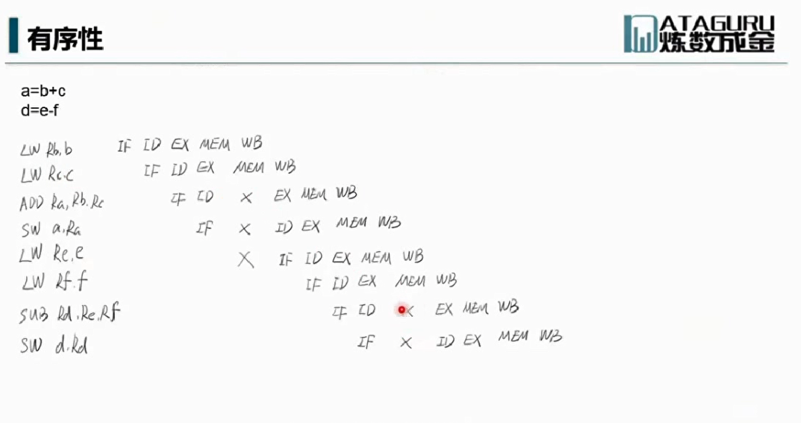

## 并行
### 同步(synchronous)和异步(asynchronous)


同步与异步是关于指令执行顺序的。  
同步是指代码调用IO操作时，必须等待IO操作完成才返回的调用方式。  
异步是指代码调用IO操作时，不必等IO操作完成就返回的调用方式。  
异步则需要多线程，多CPU或者非阻塞IO的支持。


### 阻塞(Blocking)和非阻塞(Non-Blocking)
https://blog.csdn.net/historyasamirror/article/details/5778378
阻塞非阻塞是关于线程与进程的。  
阻塞是指调用线程或者进程被操作系统挂起。非阻塞是指调用线程或者进程不会被操作系统挂起。
阻塞和非阻塞通常用来形容多线程间的相互影响，比如一个线程占用了临界区资源，那么其他所有需要这个资源的线程就必须在这个临界区外进行等待，等待会导致线程挂起。这种情况就是阻塞。此时，如果占用资源的线程一直不愿意释放资源，那么其他所有阻塞在这个临界区上的线程都不能工作  
非阻塞允许多个线程同时进入临界区

### 临界区
临界区用来表示一种公共资源或者说是共享数据，可以被多个线程使用，但是每一次，只能一个线程使用它，一旦临界区资源被占用，其他线程想要使用这个资源，就必须等待


### 并发级别
- 阻塞
难进易出，当一个线程进入临界区后，其他线程必须在临界区外等待，进入后完成操作就可以释放资源
- 非阻塞
  - 无障碍  
易进难出，无障碍是一种最弱的非阻塞调度，自由进入临界区，但是在释放资源时，会判断是否发生数据竞争，比如A线程读取数据x，要释放资源时，系统会判断当前的临界区内x值是否发生变化，如果发生变化，则会回滚A线程的操作
  - 无锁  
无锁的前提是无障碍的，而且要保证有一个线程可以胜出  
通过一个实例可以很好的理解，线程A修改了x的值，要释放资源出临界区时，线程B修改了x的值，系统会回滚线程A的操作，线程B要出临界区时，线程C又修改了x的值，这下该回滚B的操作了，线程C要出临界区的时候，之前被回滚的A完成了修改操作，所以C也要被回滚了，此处A打算出临界区，B又来了，这样就形成了一个闭环  
还是A、B、C三个线程修改x值的问题，要想打破之前形成的闭环，就必须要有一个线程先出去，通过竞争的方式每次选出一个线程胜出，胜出的可以释放临界区资源
  - 无等待  
无状态的前提是无锁的，要求所有线程都必须在有限步内完成，而且也是无饥饿的

## 线程
### 线程的基本操作
- 线程启动   
调用线程的start方法，而不是run方法
```java
Thread t1 = new Thread();
t1.start();
```
直接调用run方法会被当前线程当作一次普通的方法调用，归属于当前的线程栈  
通过start方法启动，则会创建一个新的线程来执行

- 线程终止   
stop 不推荐使用，stop会立即释放掉该线程所持有的锁，能无法正常释放自己所持有的资源，造成未知错误  
如果修改了一半就被stop掉，那数据也只会被修改一半  
windows的线程是抢占式的，意味着线程可以强制结束其他线程 
java的线程工作方式是协作式，这样设计是为了让线程自身能够在线程关闭前处理自己的数据  

- 线程挂起(suspend)和线程继续执行(resume)  
不推荐使用，suspend()不会释放锁，如果resume在suspend前调用则会发生死锁  
线程一旦被挂起，下一次被唤醒会导致上下文切换  
让步式上下文切换耗费CPU时钟非常严重，通常高达80,000个时钟周期  
主频为3GHz的处理器每秒钟可用时钟周期为3,000,000,000  
jps 查看当前的Java进程、
jstack JVM自带的堆栈跟踪工具


- 线程中断  
interrupt
```java
//中断
//设置中断状态为true，如果线程被阻塞则能抛出InterruptedException异常
//如果线程处于就绪状态则不会直接中断，而是将线程状态改为中断状态，需要手动去检测线程的中断状态
//当抛出InterruptedException异常或者调用Thread.interrupted()时，中状态将被复位
public void Thread.interrupt()  //判断是否被中断，如果线程被阻塞则抛出异常
public boolean Thread.isInterrupted() //判断是否被中断
public static boolean Thread.interrupted(){ //实现Runnable接口的只能调用这个方法
  //判断是否被中断，并清除当前中断状态
  return currentThread().isInterrupted(true);
}

//错误写法  虽然线程设置为中断状态，但内部程序一直在执行
public void run(){
  while(true){
    //线程处于就绪状态
    ...
  }
}
t1.interrupt()

//正确写法   当线程被中断后，会执行完当前的操作后，进入下一轮循环的时候停止
public void run(){
  while(true){
    if(Thread.currentThread().isInterrupted()){
      System.out.println("Interrupted!");
      break;
    }
    ...
  }
}
t1.interrupt()

//当线程在休眠中，被别的线程打断时会抛出InterruptedExecption异常，通过这种方式来提前中断线程的休眠
public static native void sleep(long millis) throws InterruptedExecption
public void run(){
  while(true){
    if(Thread.currentThread().isInterrupted()){
      System.out.println("Interrupted!");
      break;
    }
    try{
      Thread.sleep(10000);
    }catch(InterruptedException e){
      //设置中断状态，抛出异常后会清除中断标记位
      Thread.interrupted();
    }
  }
  }
}
```
在JDK5后，新的concurrent类库尽可能的在避免直接对Thread类的操作，尽量使用Executor  
如果执行Executor上的shutdownNow，将发送一个interrupt()调用给它启动的所有线程  
如果想中断某一个线程，则需要用使用submit()来启动任务，通过Future<?>的cancel(true)来中断线程
```java
public void 中断Executors的某个线程() {
        ExecutorService cachedThreadPool = Executors.newCachedThreadPool();
        Future<?> submit = cachedThreadPool.submit(() -> {
            try {
                TimeUnit.SECONDS.sleep(100);
            } catch (InterruptedException e) {
                System.out.println("over");
            }

        });
        try {
            TimeUnit.SECONDS.sleep(2);
        } catch (InterruptedException e) {
            e.printStackTrace();
        }
        submit.cancel(true);
    }
```
 
sleep类型的阻塞，是可中断阻塞  
IO类型的阻塞，无法被中断  
试图获取synchronized锁类型的阻塞，无法被中断

- 等待线程结束(join)和谦让(yeild)  

join  
```java
public final void join() throws InterruptedException
public final synchronized void join(long millis) throws  InterruptedException

//主线程会等待线程t执行完或者抛出中断异常，再进行下一步操作
public static void main(String[]args) {
  Thread t=new Thread(A)
  t.start();
  try{
    t.join()
  }catch(IntrrruptedExection e){
  }
  System.out.println("ok")
}
```
```java
join的本质
while(isAlive()){
  wait(0);  //一直等待，直到被唤醒
}
```
线程执行完毕后，系统会调用notifyAll()  
因此不要在Thread实例上使用wait()和notify()  

yeild  
使当前线程放弃当前时间片，重新参与竞争，竞争成功后还是会执行的


### 守护线程
在后台默默的完成一些系统性的服务，比如垃圾回收线程，JIT线程
守护线程是为非守护线程服务的，如果JVM中只剩守护线程，JVM自然会退出
```java
Thread t=new ThreadT();
t.setDaemon(true);
t.start();
```

### 线程优先级
优先级高的线程更容易抢到cpu时间片
```java
public final static int MIN_PRIORITY=1;
public final static int NORM_PRIORITY=5;
public final static int MAX_PRIORITY=10;
```
### Synchronized
- 指定加锁对象：对定对象加锁，进入同步代码块前要获得给定对象的锁
- 直接作用于实例方法：相当于对当前实例加锁，进入同步代码块前要获得当前实例的锁
- 直接作用于静态方法：相当于对当前类加锁，进入同步代码块前要获得当前类的锁，其实锁的是字节码对象

### wait和notify
为什么将这两个方法定义在Object，我个人有如下理解  
wait和notify执行的前提是需要持有锁，而Java中锁可以是任意的Object对象，例如在字段上锁的是字段的对象，所以不能对基础类型加锁，除非封装为包装类，
加在方法上，锁的是调用这个方法的实例对象，加在静态方法上，锁的其实是该类对应的字节码对象，所以将这两个方法定义在Object中，也只能定义在Object中


Object.wait()  
线程等待在当前对象上,调用的前提是获得object的锁对象,因为调用wait()方法会释放锁，那么必须先持有锁
```java
synchronized(obj){
  obj.wait();
}
```
Object.notify()/notifyAll()  
通知在这个对象上等待的线程，进行唤醒  
调用的前提也是获得object的锁对象,唤醒在这个锁对象上的一个线程(notifyAll会唤醒全部线程)，被唤醒的线程还不会立即执行，因为要等当前线程执行完释放锁后，才能去抢锁

## Java内存模型和线程安全
### 原子性
原子性是指一个操作是不可中断的，即使是在多个线程一起执行的时候，一个操作一旦开始，就不会被其他线程干扰  
i++ 就不是原子操作  
操作1 读i  
操作2 进行i+1  
操作3 将结果写回i  

### 有序性
在并发时，程序的执行可能会出现乱序，原因是cpu为优化代码，会发生指令重排  

write()方法的代码执行顺序可能会调整，如果先设置为true，那reader()此时读到的数据就有误 


标X的地方可以理解为硬件工作的一个空档期，指令重排是改变代码的执行顺序，来填补这些空档期，但是指令重排不能改变程序语义的串行性


### 可见性
可见性是指当一个线程修改了某个共享变量的值，其他线程是否能够立即知道这个修改  
有序性问题和可见性问题主要还是来自于程序的优化

虚拟机层面的可见性问题  


### Happen-Before
- 程序顺序原则：一个线程内保证语义的串行性
- volatile规则：volatile变量的写，先发生于读，这保证了volatile变量的可见性
- 锁规则：解锁必然发生在随后的加锁前
- 传递性：A先于B，B先于C，那么A必先于C
- 线程的start()先于它的每一个动作
- 线程的所有操作先于线程的终结(Thread.join()) 
- 线程的中断先于被中断线程的代码
- 对象的构造函数执行结束先于finalize()方法

### 线程安全的概念
指某个函数在多线程环境中被调用时，能够正确地处理各个线程的局部变量，使程序正确完成

## 死锁
产生死锁的4个条件  
- 互斥条件，使用的资源无法共享
- 至少有一个任务必须持有资源且正在等待获取一个被别的任务持有的资源
- 资源不能被其他任务抢占
- 循环等待，A等待B、B等待A

## 无锁
### 无锁类的原理详解
CAS  
CAS有三个操作数：内存值(也就是要更新的变量)V、旧的预期值A、要修改的值(新值)B，当且仅当预期值A和内存值V相同时，将内存值修改为B并返回true，否则什么都不做并返回false。  
虽然CAS会先读取值，然后比较，最后再赋值，但是这整个操作是一个原子操作，由一条CPU指令完成，通过比较交换指令实现，省去了线程频繁调度的开销，所以比基于锁的方式性能更好

### 无锁类的使用
- AtomicXXX类  
底层维护一个被volatile修饰的基本类型值  
AtomicXXX只是对其的一个封装  
```java
//无锁的方式大都是通过这样的方式实现，
public final int getAndIncrement(){
  for(;;){
    int current =get(); //获取内存中当前的值，旧的预期值A
    int next=current+1; //对已获取到的值递增，要修改为的新值B
    //判断内存中当前的值是否和current相等
    //如果相等，则将当前值修改为目标值next，并返回true
    //如果不等，则会返回false，说明内存中已经有别的线程修改了值且进行提交，那么当前线程会进入下一次循环，重新获取新值，再重复上面的动作，直至内存的值和get()的值一样，也就是没人修改内存的值
    if(compareAndSet(current,next)){ 
      return current;  //返回修改前的值
    }
  }
}
```  
- AtomicReference<V>   
针对线程引用来保证线程安全
- AtomicStampedReference<V>  
解决过程状态上敏感的问题  
A->B->A  
线程1先get(),线程2将A改为B，线程3又将B改为A，线程1compareAndSet时发现还是A,返回true，但其实已经不是之前的那个A了，如果是数值的话，只关注结果，不会出现问题，但如果是过程状态，则会出现问题  
使用AtomicStampedReference，会给每个状态打上时间戳，compareAndSet的时候不光会比较值还会比较时间戳

- Unsafe  
提供了非安全的操作，提供内JDK内部使用，非公开的API，在不同JDK中可能有较大差异
可以根据偏移量去设置值
提供park()  把线程停下来
负责底层的CAS操作，如AtomicInter的底层实现

- AtomicIntergerArray  
作用和AtomicInteger类似，通过CAS原理保证数组中每个元素的线程安全

- AtomicIntegerFieldUpdater
将已有的基本类型的变量，封装到AtomicIntegerFieldUpdater
底层使用反射技术

- LockFreeVector   
无锁vector  使用二维数组模拟一维数组  
```java
//第一数组放8个元素，第二个数组放16个元素，第三个数组放32个元素。。，减少数组扩容的性能消耗
private final AtomicReferenceArray<AtomicReferenceArray<E>> buckets; 
```
- ConcurrentLinkedQueue 非阻塞队列
- ConcurrentSkipList 跳表

## JDK并发包
### ReentrantLock  
可以理解为synchronized关键字的一个细化，JDK1.5后对synchronized进行了优化，现在两者差距并不是很大  
显式的Lock对象在加锁和释放锁方面，相对于内建的synchronized锁来说，还赋予了更细粒度的控制
- 可重入：同一把锁可以在持有的时候再进行获取(synchronized也可以)，同时获取几次也必须要释放几次，不然会造成死锁  

- 可中断：当通过这个方法去获取锁时，如果线程正在等待获取锁，则这个线程能够响应中断，即中断线程的等待状态。  
也就使说，当两个线程同时通过lock.lockInterruptibly()想获取某个锁时，假若此时线程A获取到了锁，而线程B只有在等待，  
那么对线程B调用threadB.interrupt()方法能够中断线程B的等待过程  
synchronized对中断信号是没有响应的，而ReentrantLock可以对中断信号做出响应  


- 可限时：起到了定时锁的作用，如果在指定时间内没有获得锁，将会返回false  

- 公平锁：谁等的时间长，谁获得锁，基本上一人一次

### ReentrantLock实现
- CAS状态  
尝试去拿CAS锁

- 等待队列  
用于保存等待在锁上的队列

- park()  
等待队列中的操作进行park挂起

### Condition
Condition与ReentrantLock结合使用，这两者之间的关系可以参考synchronized和wait()/notify()的关系  
通过API的方式来对ReentrantLock进行类似于wait和notify的操作  
```java
// Codition方法
void await() throws InterruptedException;
boolean await(long time, TimeUnit unit) throws InterruptedException;
void signal();
void signalAll();
 

ReentrantLock reentrantLock = new ReentrantLock();
        Condition condition = reentrantLock.newCondition();
```
### Semaphore
信号量 撒门否儿,共享锁 可以指定信号量的个数，如果个数为1，就只有一个线程可以拿到该信号量，作用就类似于锁  
如果信号量为10，就有10个线程可以拿到该信号量，进而执行下一步的操作
```java
public void acquire() throws InterruptedException   //获取信号量
public void release()   //释放信号量
```

### ReadWriteLock
读写锁，在锁的功能上进行划分，可以让多个读线程进入  
读-读不互斥，读读之间不阻塞  
读-写互斥，读阻塞写，写也阻塞读
写-写互斥，写写阻塞
```java
ReadWriteLock readWriteLock=new ReentrantReadWriteLock();
private static Lock readLock = readWriteLock.readLock()
private static Lock writeLock = readWriteLock.writeLock()
```

### CountDownLatch
```java
CountDownLatch end = new CountDownLatch(10);
public void run(){
  //每次调用这个countDown方法，end的值减1
  end.countDown();
}
//只有当end被countdown到0的时候，主线程里的end.await()才会被唤醒
public void main(){
  end.await();
}
```

### CyclicBarrier
循环栅栏，这个计数器可以反复使用，假设计数器设置为10，那么第一批10个线程后，计数器会重置，然后接着处理第二批的10个线程  

### LockSupport
类比于 suspend/resume，推荐使用LockSupport的原因是，即使unpark在park之前调用，也不会导致线程永久被挂起  
能够响应中断，但不抛出异常，中断的响应结果是，park()函数的返回，可以从Thread.interrupted()得到中断标志
```java
LockSupport.park(); //线程挂起
LockSupport.unpark(t1); //线程继续执行
```
### BlockingQueue
在任何时刻都只允许一个任务插入或移除元素  
可以挂起和恢复消费者   
LinkedBlockingQueue   无界队列
ArrayBlockingQueue  
DelayQueue  延时的无界队列，用于放置实现类Delayed接口的对象，其中的对象只能在其到期后才能从队列取走
PriorityBlockingQueue 基础的优先级队列，可以阻塞读取操作

插入   
- add() 队满则抛异常
- offer() 队满返回false
- offer(e,time,unit) 队满则会在给定时间内阻塞
- put() 如果队列已满则会进入阻塞，直到可插入

移除  
- remove()  队空则抛异常
- poll() 队空则返回null
- poll(e,time,unit) 队空则会在给定时间内阻塞
- take()  队空则进入阻塞，直到可返回

检查  
- element()   队空则抛异常
- peek() 队空则返回null


### ConcurrentHashMap


## 线程池的基本使用
### 为什么需要线程池
线程的创建和销毁需要消耗大量CPU的资源，线程池可以复用已有线程

## 多线程中的设计模式
### 单例模式
### 不变模式
类似于String,Integer,Long等包装类
### Future模式
核心思想是异步调用，例如 Callable  
```java
public class Client {
  public static void main(String[] args) throws InterruptedException {
          Client client = new Client();
          FutureData data = (FutureData) client.request("test");
          while (true) {
              if (data.isReady) {
                  System.out.println(data.getResult());
                  return;
              }
          }
      }

  //主线程在异步调用的时候该方法时，会开启另一个线程，直接返回给主线程一个空的结果类
  public Data request(final String queryStr) {
          final FutureData futureData = new FutureData();
          new Thread(() -> {
              ReadlData readlData = new ReadlData(queryStr);
              futureData.setReadlData(readlData);
          }).start();
          return futureData;
      }
}

public class FutureData implements Data {
    protected volatile boolean isReady = false;
    protected ReadlData readlData = null;

    @Override
    public synchronized String getResult() {
        while (!isReady) {
            try {
                wait();
            } catch (InterruptedException e) {
                e.printStackTrace();
            }
        }
        return readlData.getResult();
    }

    public synchronized void setReadlData(ReadlData readlData) {
        if (isReady) {
            return;
        }
        this.readlData = readlData;
        isReady = true;
        notifyAll();
    }
}

public class ReadlData implements Data {
    protected final String result;

    public ReadlData(String str){
        try {
            //假设获取真实数据很慢，模拟用户等待
            TimeUnit.SECONDS.sleep(1);
        } catch (InterruptedException e) {
            e.printStackTrace();
        }
        result=str;
    }
    @Override
    public String getResult() {
        return result;
    }

}

```
### 生产者消费者模式


# 锁优化

## 锁优化思路
### 减少锁持有时间
只对需要同步的代码块进行加锁，不建议把整个方法锁住，这样会增大线程因同时访问临界资源的而产生锁竞争的几率

### 减小锁粒度
- 将大对象拆成小对象，大大增加并行度，降低锁竞争
- 偏向锁，轻量级锁成功率提高
- HashMap的同步实现
Collections.synchronizdMap(Map<K,V> m)  返回SynchronizedMap对象   
- ConcurrentHashMap
将之前的哈希表逻辑上拆分为若干个Segment片段，Segment<K,V>[] segments  
Segment中维护HashMap<K,V>,进行操作时，先定位到Segment，然后在进行锁竞争，执行对应操作  
在减小锁粒度后，ConcurrentHashMap允许若干个线程同时进入  

### 锁分离
根据功能进行锁的读写分离，使用ReadWriteLock，在读多写少的情况下，可以提高性能  
读写分离思想的延伸，只要操作互不影响，锁就可以分离  
LinkedBlockingQueue

### 锁粗化
通常情况下,为了保证多线程间的有效并发,会要求每个线程持有锁的时间尽量短,即在使用完公共资源后,应该立即释放锁。只有这样,等待在这个锁上的其他线程才能尽早的获得资源执行任务。但是,凡事都有一个度,如果对同一个锁不停的进行请求、同步和释放,其本身也会消耗.系统宝贵的资源,反而不利于性能的优化

### 锁消除
在即时编译器时，如果发现不可能被共享的对象，则可以消除这些对象的锁操作  
比如使用StringBuffer、 Vector，会引入锁，JVM会对一些进行锁消除，前提是开启 -server  
开启锁消除 -server -XX:+DOEscapeAnalysis -XX:+ELiminateLocks   
进行逃逸分析后，如果变量没有逃出了当前作用域，JVM对进行锁优化  
逃逸分析：判断程序的其他地方会不会用到这个被加锁的变量  

## 虚拟机内的锁优化
### 对象头
Mark Word，对象头的标记，32位  
描述对象的hash、锁信息、垃圾回收标记，年龄  
- 指向锁记录的指针  
- 指向monitor的指针
- GC标记
- 偏向锁线程ID  
### 偏向锁
- 大部分情况是没有竞争的，所以可以通过偏向来提高性能
- 所谓偏向，就是偏心，即锁会偏向于当前已经占有锁的线程
- 将对象头Mark的标记设置为偏向，并将线程ID写入对象头Mark
- 只要没有竞争，获得偏向锁的线程，在将来进入同步块，不需要做同步
- 当其他线程请求相同锁时，偏向模式结束
- -XX：+UseBiasedLocking 启用偏向锁 -XX:BiasedLockingStartupDelay=0 JVM启动后延时0s启动偏向锁
- 在竞争激烈的场合，偏向锁会增加系统负担
### 轻量级锁
普通的锁处理性能不够理想，轻量级锁是一种快速锁定方法   
如果对象没有被锁定，将对象头的Mark指针保存到锁对象中，将对象头设置为指向锁的指针（在线程栈空间中）  
如果轻量级锁失败，表示存在竞争，升级为重量级锁（常规锁，操作系统层面的）  
在没有锁竞争的前提下，减少传统锁使用OS互斥量产生的性能损耗  
在竞争激烈时，轻量级锁会做很多额外操作

### 自旋锁
一次挂起操作会消耗80000个时钟周期，自旋锁在尝试获取锁失败时，不会直接被挂起，而是循环的再去尝试拿锁    
当竞争存在时，如果线程可以很快获得锁，那么可以不在OS层挂起线程，让线程做几个空操作（自旋）    
如果同步块很长，自旋失败，会降低系统性能  
如果同步块很短，自旋成功，节省线程挂起切换时间，提升系统性能

### 偏向锁，轻量级锁，自旋锁总结
不是Java语言层面的锁优化方法  
内置于JVM中的获取锁的优化方法和获取锁的步骤
- 偏向锁可用会先尝试偏向锁
- 轻量级锁可用会先尝试轻量级锁
- 以上都失败，尝试自旋锁
- 再失败，尝试普通锁，使用OS互斥量在操作系统层挂起

### 一个错误使用锁的案例
```java
public class ThreadNotSafeDemo {
    public static class T extends Thread {
        static Integer i = 0;

        @Override
        public void run() {
            for (int j = 0; j < 1000; j++) {
                synchronized (i) {
                    i++;
                }
            }
        }
        public static void main(String[] args) throws InterruptedException {
            T t1 = new T();
            T t2 = new T();
            t1.start();
            t2.start();
            t1.join();
            t2.join();
            System.out.println(i);
        }
    }
}
```
上边这段代码，看起来没问题，但实际上是线程不安全的，原因在于Integer和String一样是不可变的  
一旦被赋值之后，这个Integer的value就不会再发生改变了，而i++这个操作建立在自动拆箱和装箱的基础上  
每次进行++操作后，都会把结果赋给一个新的Integer对象，这就导致每次获取的不是同一把锁，最终导致结果偏小  

### ThreadLocal及其源码分析
用空间换时间，给每个线程内部都设置一个局部变量

# 并发调试和JDK8新特性
### 多线程调试的方法
使用条件断点或异常断点
### 线程dump及分析
jstack 进程号
jstack -l 进程号 查看详细情况
### JDK8对并发的新支持
- LongAdder  
和ConcurroncurrentHashMap的思想类似，将一个整数划分为多个单元，将并发线程的读写操作分发到多个单元上  
以保证CAS更新能够成功，取值前需要对各个单元进行求和，返回sum  
考虑到如果并发不高的话，这种做法会损耗系统资源，所以默认会维持一个long，如果发生冲突，则会拆分为多个单元  
和AtomicInteger类似的使用方式，在AtomicInteger上进行了热点分离  
```java
public void add(long x)
public void increment()
public void decrement()
public long sum()
public long longValue()
public int intValue()
```
- CompletableFuture   
工具类，实现了CompletionStage，Java8中对Future的增强，可以流式调用
- StampedLock 
读写锁的改进，之前的ReadWriteLock是读写互斥的，StampedLock在读写互斥上做了改进  
读写互斥时，在读线程比较多而写线程比较少的情况下，写线程容易发生饥饿现象，导致一直写不进去  
StampedLock的读可以不阻塞写，读线程在 读取后返回前的时候，写线程完成了数据修改，则读线程需要重新读取  
锁内部维护了一个等待线程队列，所有申请锁，但是没成功的线程都记录在这个队列中，每个节点都有一个标记位，判断当前节点是否已经释放锁  
当一个线程试图获取锁时，会判断当前等待队列尾部节点的标记位是否已经成功释放锁

