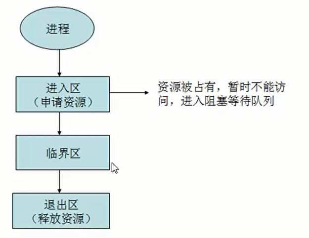
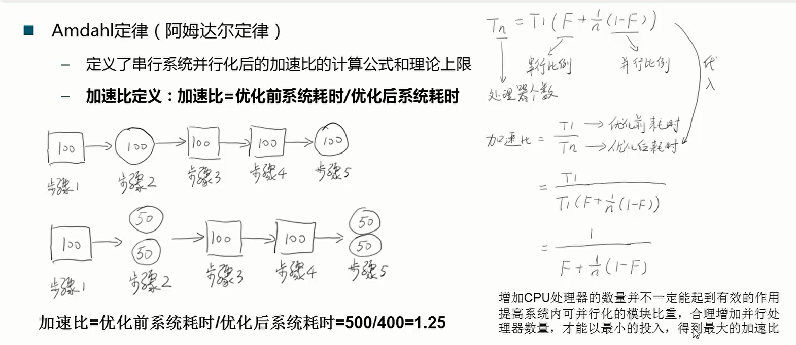
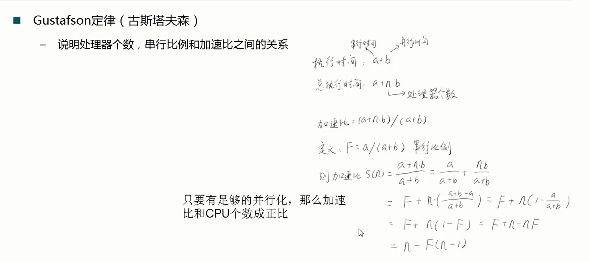

## 并行
### 同步(synchronous)和异步(asynchronous)


同步是指代码调用IO操作时，必须等待IO操作完成才返回的调用方式。  
异步是指代码调用IO操作时，不必等IO操作完成就返回的调用方式。  

### 并发(concurrency)和并行(parallelism)


并行是多个线程同一时刻运行，单核CPU在同一时刻无法做到，而多核CPU可以  
并发是多个线程在同一时间段运行，cpu把这个时间段分片给多个线程，由于整个时间段很小，所以我们感觉CPU好像在同时运行这些线程

### 临界区
临界区用来表示一种公共资源或者说是共享数据，可以被多个线程使用，但是每一次，只能一个线程使用它，一旦临界区资源被占用，其他线程想要使用这个资源，就必须等待


### 阻塞(Blocking)和非阻塞(Non-Blocking)
阻塞和非阻塞通常用来形容多线程间的相互影响，比如一个线程占用了临界区资源，那么其他所有需要这个资源的线程就必须在这个临界区外进行等待，等待会导致线程挂起。这种情况就是阻塞。此时，如果占用资源的线程一直不愿意释放资源，那么其他所有阻塞在这个临界区上的线程都不能工作  
非阻塞允许多个线程同时进入临界区

### 并发级别
- 阻塞
难进易出，当一个线程进入临界区后，其他线程必须在临界区外等待，进入后完成操作就可以释放资源
- 非阻塞
  - 无障碍  
易进难出，无障碍是一种最弱的非阻塞调度，自由进入临界区，但是在释放资源时，会判断是否发生数据竞争，比如A线程读取数据x，要释放资源时，系统会判断当前的临界区内x值是否发生变化，如果发生变化，则会回滚A线程的操作
  - 无锁  
无锁的前提是无障碍的，而且要保证有一个线程可以胜出  
通过一个实例可以很好的理解，线程A修改了x的值，要释放资源出临界区时，线程B修改了x的值，系统会回滚线程A的操作，线程B要出临界区时，线程C又修改了x的值，这下该回滚B的操作了，线程C要出临界区的时候，之前被回滚的A完成了修改操作，所以C也要被回滚了，此处A打算出临界区，B又来了，这样就形成了一个闭环  
还是A、B、C三个线程修改x值的问题，要想打破之前形成的闭环，就必须要有一个线程先出去，通过竞争的方式每次选出一个线程胜出，胜出的可以释放临界区资源
  - 无等待
无状态的前提是无锁的，要求所有线程都必须在有限步内完成，而且也是无饥饿的

### 有关并行的2个重要定理
Amdahi定律（阿姆达尔定律）

Gustafson定律（古斯塔夫森定律）


## 线程
### 线程状态的转换


### 线程的基本操作
- 线程启动   
调用线程的start方法，而不是run方法
```java
Thread t1 = new Thread();
t1.start();
```
直接调用run方法会在当前线程进行方法调用，通过start方法启动，则会创建一个新的线程来执行

- 线程终止   
stop 不推荐使用，stop会立即释放掉该线程所持有的锁  
如果修改了一半就被stop掉，那数据也只会被修改一半

- 线程中断  
interrupt
```java
public void Thread.interrupt()  //中断线程，其实是将线程状态改为中断状态，并不会直接中断线程
public boolean Thread.isInterrupted() //判断是否被中断
public static boolean Thread.interrupted()  //判断是否被中断，并清除当前中断状态

//错误写法  虽然线程设置为中断状态，但内部程序一直在执行
public void run(){
  while(true){
    ...
  }
}
t1.interrupt()

//正确写法   当线程被中断后，会执行完当前的操作后，进入下一轮循环的时候停止
public void run(){
  while(true){
    if(Thread.currentThread().isInterrupted()){
      System.out.println("Interrupted!");
      break;
    }
    ...
  }
}
t1.interrupt()
``` 

