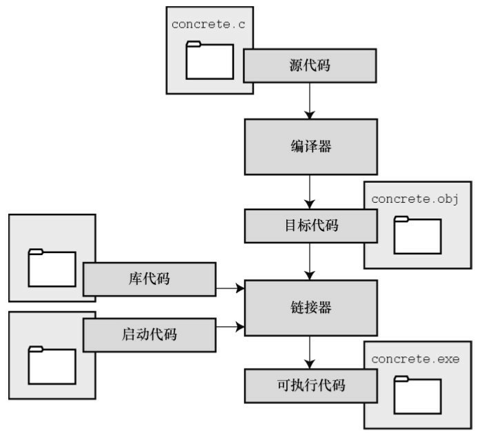
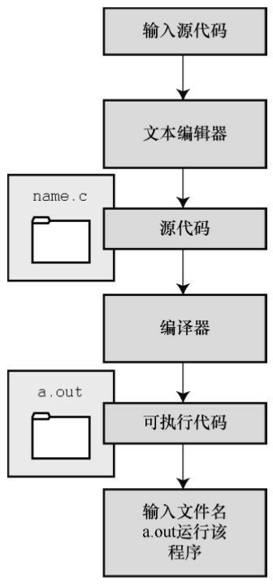
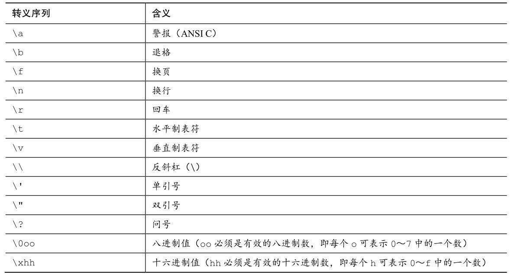
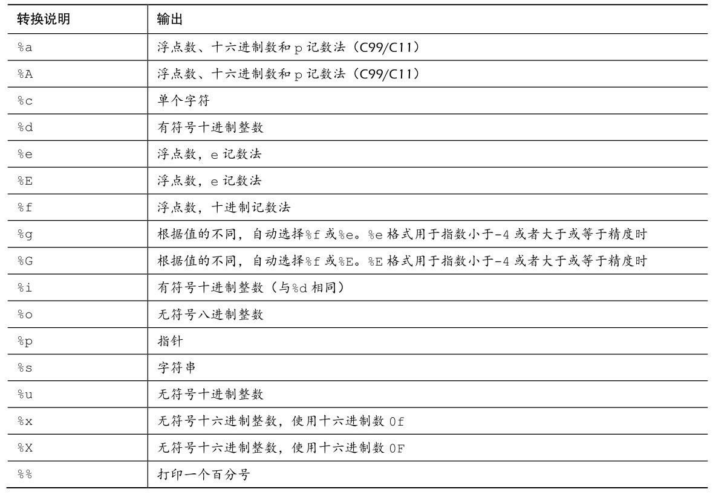
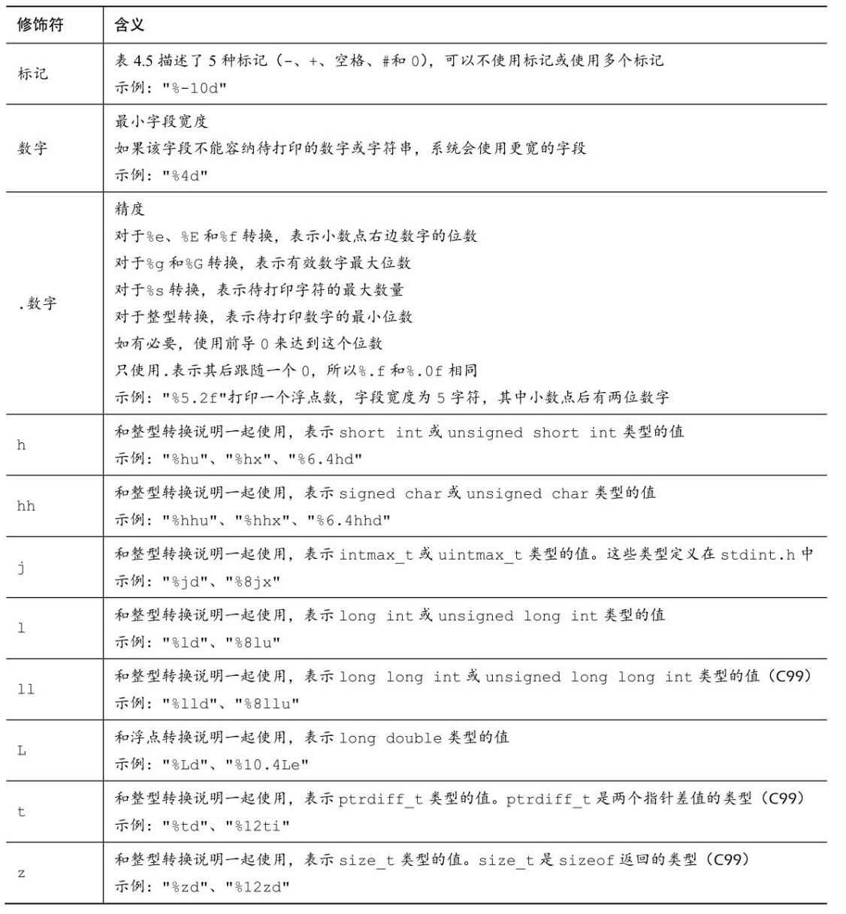

## C的编译机制

C是编译型语言。C编译器和链接器是把C语言源代码转换成可执行代码 的程序。

源代码经过编译后生成目标代码，目标代码中不包含源代码中引用的库函数指令（比如 prinf函数），所以需要链接器将依赖的库代码、启动代码还有目标代码这三部分进行合并，最终成为可执行代码。





## C的编译器集合

GNU项目始于1987年，是一个开发大量免费UNIX软件的集合（GNU的 意思是“GNU’s Not UNIX”，即GNU不是UNIX）。GNU编译器集合（也被称 为GCC，其中包含GCC C编译器）是该项目的产品之一。GCC在一个指导委 员会的带领下，持续不断地开发，它的C编译器紧跟C标准的改动。GCC有 各种版本以适应不同的硬件平台和操作系统，包括UNIX、Linux和 Windows。用gcc命令便可调用GCC C编译器。许多使用gcc的系统都用cc作 为gcc的别名。

LLVM项目成为cc的另一个替代品。该项目是与编译器相关的开源软件 集合，始于伊利诺伊大学的2000份研究项目。它的 Clang编译器处理 C代 码，可以通过 clang调用。有多种版本供不同的平台使用，包括Linux。2012 年，Clang成为FreeBSD的默认C编译器。Clang也对最新的C标准支持得很 好。

GNU和LLVM都可以使用-v选项来显示版本信息，因此各系统都使用cc 别名来代替gcc或clang命令。以下组合：

```sh
cc -v
```


## 数据类型

基本数据类型关键字：int、long、short、unsigned、char、 float、double、signed、_Bool。

**有符号整型**：

有符号整型可用于表示正整数和负整数。

int ——系统给定的基本整数类型。C语言规定int类型不小于16位。

short或short int ——最大的short类型整数小于或等于最大的int类型整 数。C语言规定short类型至少占16位。

long或long int ——该类型可表示的整数大于或等于最大的int类型整数。 C语言规定long类型至少占32位。

long long或long long int ——该类型可表示的整数大于或等于最大的long 类型整数。Long long类型至少占64位。

一般而言，long类型占用的内存比short类型大，int类型的宽度要么和 long类型相同，要么和short类型相同。

例如，旧DOS系统的PC提供16位的 short和int，以及32位的long；Windows 95系统提供16位的short以及32位的int 和long。

**无符号整型：**

无符号整型只能用于表示零和正整数，因此无符号整型可表示的正整数 比有符号整型的大。在整型类型前加上关键字unsigned表明该类型是无符号 整型：unsignedint、unsigned long、unsigned short。单独的unsigned相当于 unsignedint。

**字符类型：**

可打印出来的符号（如A、&和+）都是字符。根据定义，char类型表示 一个字符要占用1字节内存。出于历史原因，1字节通常是8位，但是如果要 表示基本字符集，也可以是16位或更大。

char ——字符类型的关键字。有些编译器使用有符号的char，而有些则 使用无符号的char。在需要时，可在char前面加上关键字signed或unsigned来 指明具体使用哪一种类型。

**布尔类型**： 

布尔值表示true和false。C语言用1表示true，0表示false。 

_Bool ——布尔类型的关键字。布尔类型是无符号 int类型，所占用的空间只要能储存0或1即可。 

**浮点类型：** 

实浮点类型可表示正浮点数和负浮点数。

 float ——系统的基本浮点类型，可精确表示至少6位有效数字。 

double ——储存浮点数的范围（可能）更大，能表示比 float 类型更多 的有效数字（至少 10位，通常会更多）和更大的指数。 

long long ——储存浮点数的范围（可能）比double更大，能表示比 double更多的有效数字和更大的指数。

```c
int main(void) {
    /* C99为类型大小提供%zd转换说明 */
    printf("Type _Bool has a size of %zd bytes.\n", sizeof(_Bool));
    printf("Type char has a size of %zd bytes.\n", sizeof(char));
	  printf("Type int has a size of %zd bytes.\n", sizeof(int));
    printf("Type short has a size of %zd bytes.\n", sizeof(short));
    printf("Type long has a size of %zd bytes.\n", sizeof(long));
    printf("Type long long has a size of %zd bytes.\n", sizeof(long long));
    printf("Type float has a size of %zd bytes.\n", sizeof(float));
    printf("Type double has a size of %zd bytes.\n", sizeof(double));
    printf("Type long double has a size of %zd bytes.\n", sizeof(long double));
    return 0;
}
/*
Type _Bool has a size of 1 bytes.
Type char has a size of 1 bytes.
Type int has a size of 4 bytes.
Type short has a size of 2 bytes.
Type long has a size of 8 bytes.
Type long long has a size of 8 bytes.
Type float has a size of 4 bytes.
Type double has a size of 8 bytes.
Type long double has a size of 16 bytes.
*/

```

## 数据类型的表示

整数可以表示为十进制、八进制或十六进制。0前缀表示八进制数，0x 或0X前缀表示十六进制数。

例如，32、040、0x20 分别以十进制、八进制、 十六进制表示同一个值。l（小写L）或L前缀表明该值是long类型， ll或LL前缀表明该 值是long long类型。

在C语言中，直接表示一个字符常量的方法是：把该字符用单引号括起 来，如'Q'、'8'和'$'。

C语言的转义序列（如，'\n'）表示某些非打印字符。另外，还可以在八进制或十六进制数前加上一个反斜杠（如，'\007'），表示 ASCII码中的一个字符。

## 转义字符



浮点数可写成固定小数点的形式（如，9393.912）或指数形式（如， 7.38E10）。

printf()函数根据转换说明打印各种类型的值。转换说明最简单的形式由 一个百分号（%）和一个转换字符组成，如%d、%ld（表示long）或%f。

注意打印long型的值需要用 %ld。

```c
    long l = INT_MAX + 1;
    printf("%ld\n", l);
    printf("%d", l);
/*
2147483648
-2147483648
*/
```

## 转换说明



## 转换说明的修饰符



## Scanf函数

scanf() 读取指定形式的输入失败，就把无法读取的输入留在输入队列中，供下次读取。

```c
int main(void) {
    char c;
    int status;
    status = scanf("%d", &c);
    printf("第一次读取%d字符\n", status);
    status = scanf("%c", &c);
    printf("第二次读取%d字符\n", status);
    return 0;
}
/*
q(手动输入)
第一次读取0字符
第二次读取1字符
*/
```

上面的代码中虽然有两个 scanf 函数，但只需要输入一次 `q` ，因此第一次没有读取到，数据就停留在了输入缓冲区中，第二次不用输入，直接去缓冲区取了。
