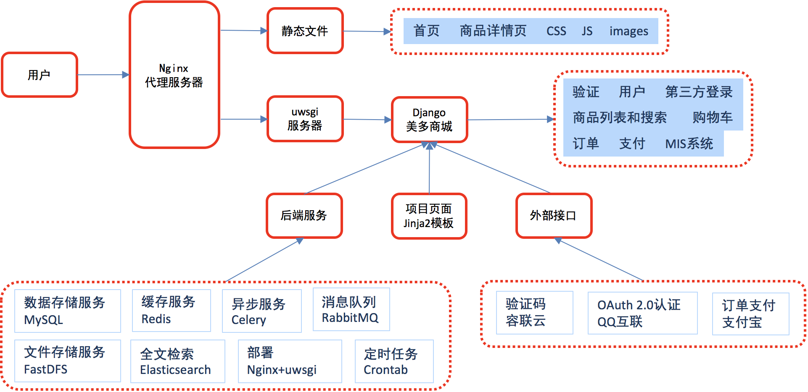

# 包和模块

在 Python 中，`from ... import ...` 语句用于从模块或包中导入特定的类、函数或变量。这种导入方式允许你直接使用导入的组件，而不需要通过模块或包的名称来引用。

以下是 `from ... import ...` 语句的一些用法：

## 导入单个组件

你可以从模块中导入一个特定的函数或类，并直接使用它。

```python
from math import sqrt

result = sqrt(16)  # 使用导入的 sqrt 函数
```

## 导入多个组件

你可以使用括号来从模块中导入多个组件。

```python
from math import sqrt, pow, ceil

result = sqrt(16)
power = pow(2, 3)
rounded = ceil(3.7)  # 使用导入的 pow 和 ceil 函数
```

## 导入所有组件（不推荐）

你可以使用星号（*）来导入模块中的所有组件。这种做法通常不推荐，因为它会污染命名空间，使得代码难以理解和维护。 

```python
# 需要math包的init中定义  __all__ = ['my_module1']
from math import *

sqrt(16)  # 直接使用 sqrt
pow(2, 3)  # 直接使用 pow
```

## 重命名导入的组件

你可以使用 `as` 关键字给导入的组件重命名，这在解决命名冲突或简化命名时很有用。

```python
from math import sqrt as square_root

result = square_root(16)  # 使用重命名后的 square_root 函数
```

## 从包中导入模块

你可以从包中导入模块，然后使用模块中的组件。

```python
from mypackage import module1

module1.foo()  # 使用导入的 module1 中的 foo 函数
```

## 从包中导入特定组件

你也可以直接从包中导入特定的函数或类。

```python
from mypackage.module1 import foo

foo()  # 直接使用导入的 foo 函数
```

使用 `from ... import ...` 语句时，确保你导入的组件是你需要的，避免导入不必要的内容，这样可以提高代码的清晰度和性能。

# 常用包

## retrying

https://blog.csdn.net/weixin_45418194/article/details/121115575

`retrying` 是一个 Python 包，用于提供一个装饰器（以及一个重试控制机制），允许你将其应用于任何函数或方法上，使得在遇到特定的异常或者返回条件不满足时自动重试。使用 `retrying` 包中的 `retry` 函数可以帮助简化代码中处理瞬时错误或不稳定操作（如网络请求）的逻辑。

当你使用 `@retry` 装饰器装饰一个函数时，可以指定多个参数来控制重试行为，包括：

- `stop_max_attempt_number`: 重试的最大次数。

- `stop_max_delay`: 最大的重试延迟时间（毫秒），超过这个时间后不再重试。

- `wait_fixed`: 两次重试之间的固定等待时间（毫秒）。

- `wait_random_min` 和 `wait_random_max`: 两次重试之间的随机等待时间的最小值和最大值（毫秒）。

- `retry_on_exception`: 一个函数，当它返回 `True` 时，会在抛出的异常上重试，根据函数抛出的异常判断是否重试。

  ```python
  def retry_if_io_error(exception):
      return isinstance(exception, IOError)
    
  @retry(retry_on_exception=retry_if_io_error)
  def might_io_error():
      raise IOError(print("永远重试，无需等待。"))
  ```

- `retry_on_result`: 一个函数，当目标函数返回值使得该函数返回 `True` 时进行重试，根据函数的结果来判断是否重试。

  ```python
  def retry_if_result_none(result):
      """如果我们应该重试，则返回True（在本例中，结果为None），否则返回False"""
      return result is None
  
  
  @retry(retry_on_result=retry_if_result_none)
  def might_return_none():
      print("如果返回值为None，则永远重试忽略异常而不等待")
      return None
  ```

例如，假设你有一个网络请求的函数，由于网络波动，你希望在遇到连接错误时自动重试，但最多重试3次，每次重试之间等待2秒：

```python
from retrying import retry
import requests
 
@retry(stop_max_attempt_number=3, wait_fixed=2000)
def fetch_data(url):
    response = requests.get(url)
    response.raise_for_status()  # 如果响应码不是 200，会抛出异常
    return response.json()
 
# 使用这个函数，它会在失败时尝试最多3次，每次尝试之间等待2秒
data = fetch_data("https://example.com/api/data")
```

在这个例子中，如果 `requests.get(url)` 因为网络问题抛出异常（比如 `requests.exceptions.ConnectionError`），`fetch_data` 函数会自动重试，直到尝试了3次或者成功获取数据为止


# python 虚拟环境

为了避免污染系统环境下的python，在开发项目时，会在项目的根目录下使用python虚拟环境。

## pipenv

可以指定不同版本的python环境，可信文件通过 pipfile来管理。

```python
# pipenv 前置安装
pip install pipenv 

# 查看已经创建了的虚拟环境，可以在项目中复用虚拟环境，减少重复包的下载
pipenv --venv 
```

```python
# 在当前目录创建 python 3.12.4 的虚拟环境
pipenv --python 3.12.4 

# 激活虚拟环境，激活后 在当前目录下的 python 和 pip 命令都会指向虚拟环境中对应的命令
pipenv shell 

# 可以查看pip命令的指向
which pip
~/.local/share/virtualenvs/py-r_NpycGu/bin/pip

# 可以像使用 pip 命令一样简单
pip install requests 

# 移除当前虚拟环境，但不会删除pipfile
pipenv --rm
```


# 并发编程

线程是真正被CPU调度的最小单位，进程是为线程提供资源的单位（同样也是资源分配的最小单位）。

## fork 和 spawn 

不同系统创建子进程的方式不一样。Linux系统fork，win:spawn，mac支持：fork和spawn （python3.8默认设置spawn）

python在创建子进程的操作必须要在main函数里，不然会报错。

 mac手动指定fork创建进程的方式，也可以解决。

```python
multiprocessing.set_start_method('fork')
```


首先fork和spawn都是构建子进程的不同方式，区别在于：

fork：除了必要的启动资源外，其他变量，包，数据等都继承自父进程，并且是copy-on-write的，也就是共享了父进程的一些内存页，因此启动较快，但是由于大部分都用的父进程数据，所以是不安全的进程。

spawn：从头构建一个子进程，父进程的数据等拷贝到子进程空间内，拥有自己的Python解释器，所以需要重新加载一遍父进程的包，因此启动较慢，由于数据都是自己的，安全性较高。

## GIL锁

GIL，全局解释器锁（Global Interpreter Lock），是CPython中，让一个进程同一时刻只能有一个线程可以被CPU调用。无法充分利用多核CPU的性能。但可以用于IO密集的运算场景。

因此如果想利用CPU的多核优势，也就是CPU密集型运算适合多进程开发（即使资源开销大），如果是IO密集型的话可以使用多线程的方式，或者协程。


## 线程锁

加锁的另外一种方式

```python
with lock:
	# 自动加锁和释放锁
```

**Lock 和 RLock**

Lock 和 RLock 都是 threading模块下的类，使用上基本相似。

两者区别是RLock 支持可重入锁。


## 协程

python 除了支持进程、线程，还支持协程（使用asyncio），这种需要 手动的 await 来将控制权交还给 event loop。

但有些情况下，单纯的协程也不好用，例如一个需要长时间处理的计算任务不着急可以慢慢做，还有一些小的需要在低延迟时间下解决的响应任务， 如果不做任何处理，  协程可能会陷入到计算任务中出不来，需要低延迟的响应任务无法得到及时响应。

当然，现在可以在 asyncio 中使用 run_in_executor来解决这个问题。


# Django

## MTV框架模式


## DRY

do not repeat yourself，强调快速开发和代码复用

提供了丰富的组件：

- ORM（对象关系映射）映射类来构建数据模型 
- URL 支持正则表达式
- 模板可继承

- 内置用户认证，提供用户认证和权限功能 
- admin 管理系统
- 内置表单模型、Cache 缓存系统、国际化系统等

## 版本

建议使用稳定版本

```python
# 直接安装
pip install django==2.2.13

# 升级版本
pip install --upgrade django==2.2.13

# 查看Django版本号 
pip list | grep Django     

import django
print(django.__version__)
```


## 环境搭建

```python
django-admin startproject mall

python manage.py help    

python manage.py startapp index

python manage.py runserver 

# 指的是服务器启动后会监听所有网络接口上的8888接口
python manage.py runserver  0.0.0.0:8888 
```


# 商城项目实战

前后端不分离的开发模式，有助于SEO

后端框架采用 Django + Jinja2模版引擎，整体由后端完成渲染。

前端框架采用 Vue.js，局部部分由前端完成渲染。


## 项目整体架构




- Uwsgi 服务器类似于 Tomcat Web服务器
- Celery 类似于Java 的 Quartz

## Django

创建Django项目

```django
django-admin startproject mall
```

切换到 manage.py 目录下启动项目

```python
python manage.py runserver
```


创建项目下的子应用

```sh
mall/mall/apps git:master*  
(mall) ❯ pwd                                  
/Users/networkcavalry/Documents/PyCharmProjects/mall/mall/mall/apps


mall/mall/apps git:master*  
(mall) ❯ python ../../manage.py startapp users
/Users/networkcavalry/Documents/PyCharmProjects/mall/mall/mall
                                                                                                         
mall/mall/apps git:master*  
(mall) ❯ ls
__init__.py users
```


# 其他

## 查看导包的路径

```
print(sys.path)
```


