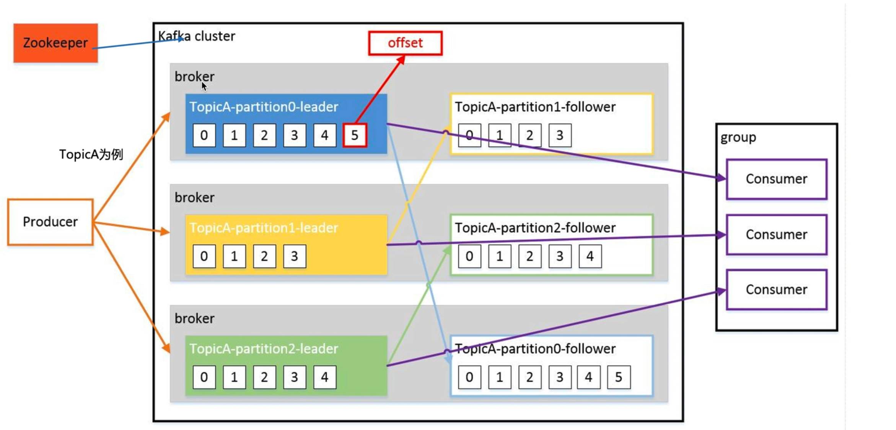
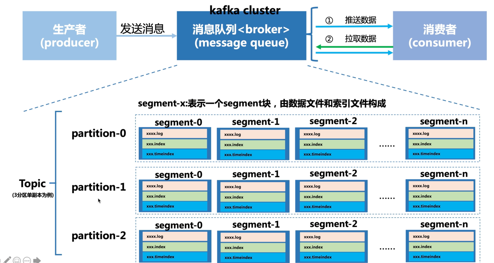
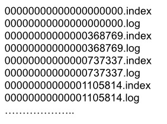
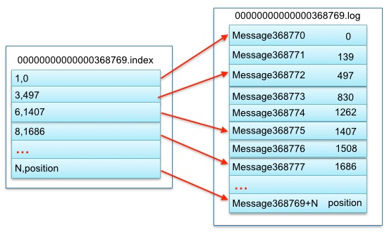
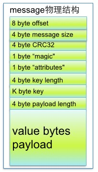

## 相关资料

[Kafka相关博客](https://www.cnblogs.com/qingyunzong/p/9004509.html)

## 整体架构

例如TopicA，有3个分区，每个分区都有一个副本。 

## 主体核心流程

 每个partition是一个逻辑上的队列，实际物理上是按照segment分段存储数据的。不过每个partition都是存放在一个broker上的，副本会存在不同的broker上。

## Kafka文件存储机制

-  [Kafka文件存储机制](https://tech.meituan.com/2015/01/13/kafka-fs-design-theory.html)
- [Kafka集群partitions/replicas默认分配解析](https://blog.csdn.net/lizhitao/article/details/41778193)

### partition

每个partion(目录)相当于一个巨型文件被平均分配到多个大小相等segment(段)数据文件中。但每个段segment file消息数量不一定相等，这种特性方便old segment file快速被删除。

每个partiton只需要支持顺序读写就行了，segment文件生命周期由服务端配置参数决定。

### segment

- segment file组成：由2大部分组成，分别为index file和data file，此2个文件一一对应，成对出现，后缀”.index”和“.log”分别表示为segment索引文件、数据文件.

- segment文件命名规则：partion全局的第一个segment从0开始，后续每个segment文件名为上一个segment文件最后一条消息的offset值。数值最大为64位long大小，19位数字字符长度，没有数字用0填充。

下面文件列表是笔者在Kafka broker上做的一个实验，创建一个topicXXX包含1 partition，设置每个segment大小为500MB,并启动producer向Kafka broker写入大量数据,如下图2所示segment文件列表形象说明了上述2个规则：

以上述图2中一对segment file文件为例，说明segment中index<—->data file对应关系物理结构如下：

- index中采用稀疏索引结构，并不会索引每一条记录，而是抽取出一部分建立的索引。可以大幅降低index文件元数据占用空间大小。
- 例如：（3，497）1代表对应数据文件中第3个message（全局partition中第368771个message），497代表，该消息的物理偏移地址。而下一个就是第6条message。

### Message

| 关键字              |                           解释说明                           |
| :------------------ | :----------------------------------------------------------: |
| 8 byte offset       | 在parition(分区)内的每条消息都有一个有序的id号，这个id号被称为偏移(offset),它可以唯一确定每条消息在parition(分区)内的位置。即offset表示partiion的第多少message |
| 4 byte message size |                         message大小                          |
| 4 byte CRC32        |                      用crc32校验message                      |
| 1 byte “magic”      |             表示本次发布Kafka服务程序协议版本号              |
| 1 byte “attributes” |         表示为独立版本、或标识压缩类型、或编码类型。         |
| 4 byte key length   |        表示key的长度,当key为-1时，K byte key字段不填         |
| K byte key          |                             可选                             |
| value bytes payload |                      表示实际消息数据。                      |

### 在partition中如何通过offset查找message

1. 先查找对应的segment文件，这里会根据segment文件名里包含偏移量的特点，快速定位文件。也就是找对对应的log文件。
2. 查找segment文件中的消息，根据偏移量offset去index文件去查log文件。

### Kafka高效文件存储设计特点

- Kafka把topic中一个parition大文件分成多个小文件段，通过多个小文件段，就容易定期清除或删除已经消费完文件，减少磁盘占用。
- 通过索引信息可以快速定位message和确定response的最大大小。
- 通过index元数据全部映射到memory，可以避免segment file的IO磁盘操作。
- 通过索引文件稀疏存储，可以大幅降低index文件元数据占用空间大小。