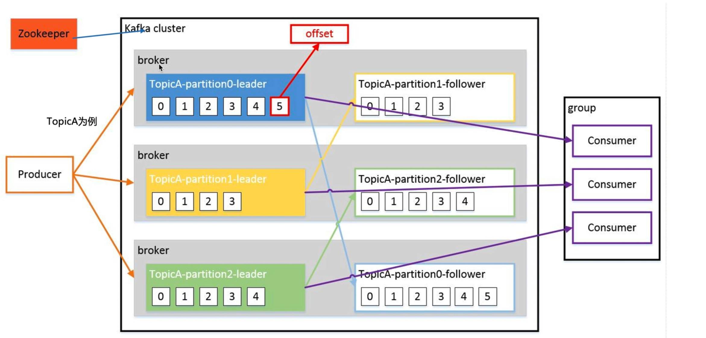
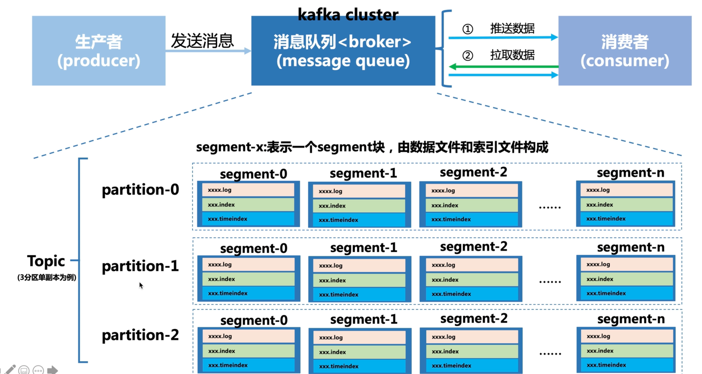
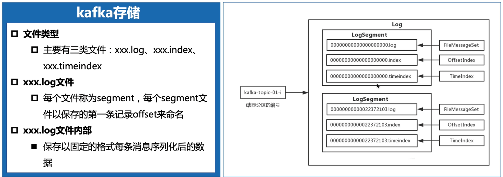
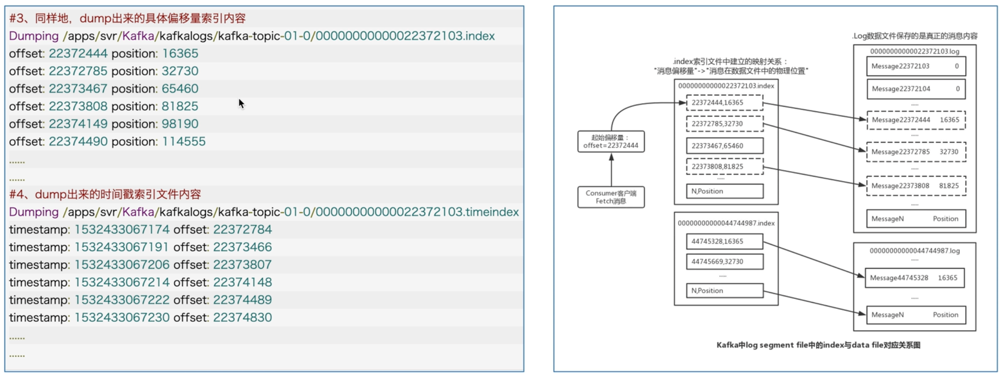

# 消息队列对比

# 消息推拉方案对比

# 消费者模型

# Kafka整体架构

例如TopicA，有3个分区，每个分区都有一个副本。 

## 主体核心流程

 每个partition是一个逻辑上的队列，实际物理上是按照segment分段存储数据的。

## segment的结构

最大化结合磁盘特性，重逢利用顺序IO写；同时采用文件分段存储方式组织，每条消息附加一个编号（offset），还保存了一些索引文件。

## 如何查找消息

## 旧数据何时删除

- 基于每个日志文件中最大记录时间戳删除
- 基于设定文件个数阈值删除

## kafka集群数据复制

## kafka集群故障转移

## kafka集群数据一致性

## kafka集群数据粉片

## 消息队列选型

RocketMQ特点：
十万吞吐量，分布式架构，扩展方便，Java开发，可以深入研究，方便定制，社区活跃度高

Kafka特点：

1. 吞吐量大。
2. 巨大缺点：无法动态扩展。因为broker与存储是耦合的。导致扩展的时候需要剥离topic和。

Pulsar特点：

1. 最大特点：计算与存储分离，所以扩展非常容易。遇到大流量情况可以动态扩展。
2. 支持多租户配置，可以根据不同业务域来进行配额。
3. 支持流处理与普通的消息发布订阅。
4. 数据分级存储。可以将一些老的数据存到冷盘中。

### 为什么使用消息队列，消息队列有什么优点和缺点

**优点**

- 系统解耦：用 MQ 消息队列，可以实现系统间解耦，隔离系统上下游环境变化带来的不稳定因素，下游系统的需求无论怎么调整，上游系统都不用做出任何改变。实现上下游服务的解耦，做到了系统的高可用。
- 流量控制：遇到秒杀等流量突增的场景，通过 MQ 还可以实现流量的“削峰填谷”的作用，可以根据下游的处理能力自动调节流量。

**缺点**

- 引入 MQ 消息中间件实现系统解耦，会影响系统之间数据传输的一致性。 在分布式系统中，如果两个节点之间存在数据同步，就会带来数据一致性的问题。如消息生产端和消息消费端的消息数据一致性问题，即如何确保消息不丢失。
- 引入 MQ 消息中间件解决流量控制，还需考虑消息队列和其他系统之间处理关系。如果下游处理消息的速度低于上游发消息的速度，那么可能会导致消息积压。
- 引入消息中间价，会使系统的整体复杂性会变高，消息队列故障后可能会导致整个系统瘫痪，

- rocketmq：
- kafka：十万吞吐量，功能简单，分布式系统，扩展方便，适合大数据领域的实时计算和日志采集

### 如何保证消息队列的高可用

RabbitMQ
单机模式
普通集群模式
　　普通集群模式就是启动多个RabbitMQ实例。在你创建的queue，只会放在一个rabbtimq实例上，但是每个实例都同步queue的元数据。在消费的时候完了，上如果连接到了另外一个实例，那么那个实例会从queue所在实例上拉取数据过来。

　　这种方式确实很麻烦，也不怎么好，没做到所谓的分布式，就是个普通集群。因为这导致你要么消费者每次随机连接一个实例然后拉取数据，要么固定连接那个queue所在实例消费数据，前者有数据拉取的开销，后者导致单实例性能瓶颈。

　　而且如果那个放queue的实例宕机了，会导致接下来其他实例就无法从那个实例拉取，如果你开启了消息持久化，让RabbitMQ落地存储消息的话，消息不一定会丢，得等这个实例恢复了，然后才可以继续从这个queue拉取数据。

镜像集群模式
　镜像集群模式是所谓的RabbitMQ的高可用模式，跟普通集群模式不一样的是，你创建的queue，无论元数据还是queue里的消息都会存在于多个实例上，然后每次你写消息到queue的时候，都会自动把消息到多个实例的queue里进行消息同步。

　　优点在于你任何一个实例宕机了，没事儿，别的实例都可以用。缺点在于性能开销太大和扩展性很低，同步所有实例，这会导致网络带宽和压力很重，而且扩展性很低，每增加一个实例都会去包含已有的queue的所有数据，并没有办法线性扩展queue。

　　开启镜像集群模式可以去RabbitMQ的管理控制台去增加一个策略，指定要求数据同步到所有节点的，也可以要求就同步到指定数量的节点，然后你再次创建queue的时候，应用这个策略，就会自动将数据同步到其他的节点上去了。

RocketMQ
多master部署，防止单点故障
消息冗余（主从结构），防止消息丢失
故障恢复

kafka
broker 相当于kafka的进程
　Kafka天生就是一个分布式的消息队列，它可以由多个broker组成，每个broker是一个节点；你创建一个topic，这个topic可以划分为多个partition，每个partition可以存在于不同的broker上，每个partition就放一部分数据。

　　kafka 0.8以前，是没有HA机制的，就是任何一个broker宕机了，那个broker上的partition就废了，没法写也没法读，没有什么高可用性可言。

　　kafka 0.8以后，提供了HA机制，就是replica副本机制。kafka会均匀的将一个partition的所有replica分布在不同的机器上，来提高容错性。每个partition的数据都会同步到吉他机器上，形成自己的多个replica副本。然后所有replica会选举一个leader出来，那么生产和消费都去leader，其他replica就是follower，leader会同步数据给follower。当leader挂了会自动去找replica，然后会再选举一个leader出来，这样就具有高可用性了。

　　写数据的时候，生产者就写leader，然后leader将数据落地写本地磁盘，接着其他follower自己主动从leader来pull数据。一旦所有follower同步好数据了，就会发送ack给leader，leader收到所有follower的ack之后，就会返回写成功的消息给生产者。（当然，这只是其中一种模式，还可以适当调整这个行为）

　　消费的时候，只会从leader去读，但是只有一个消息已经被所有follower都同步成功返回ack的时候，这个消息才会被消费者读到。

#### ActiveMQ

进行高可用架构可以采用主从方式（Master-Slave）或负载均衡（集群）方式

### 如何保证消息不被重复消费(幂等性)

需要结合具体业务场景

- 比如你拿个数据要写库,你先根据主键查一下,如果这数据都有了,你就别插入了, update一下好吧
- 比如你是写redis,那没问题了,反正每次都是set,天然幕等性
- 比如你不是上面两个场景,那做的稍微复杂一点,你需要让生产者发送每条数据的时候,里面加一个全局唯一的id,类似订单id之类的东西,然后你这里消费到了之后,先根据这个id去比如redis里查一下,之前消费过吗?如果没有消费过,你就处理,然后这个id写redis。如果消费过了,那你就别处理了,保证别重复处理相同的消息即可。

# 如何保证消息的可靠性传输(消息丢失)

- **消息生产阶段：** 从消息被生产出来，然后提交给 MQ 的过程中，只要能正常收到 MQ Broker 的 ack 确认响应，就表示发送成功，所以只要处理好返回值和异常，这个阶段是不会出现消息丢失的。
- **消息存储阶段：** 这个阶段一般会直接交给 MQ 消息中间件来保证，但是你要了解它的原理，比如 Broker 会做副本，保证一条消息至少同步两个节点再返回 ack。
- **消息消费阶段：** 消费端从 Broker 上拉取消息，只要消费端在收到消息后，不立即发送消费确认给 Broker，而是等到执行完业务逻辑后，再发送消费确认，也能保证消息的不丢失。

- 如何知道有消息丢失？
- 哪些环节可能丢消息？
- 如何确保消息不丢失？

- 生产者把消息搞丢  
  confirm
  此时可以选择用rabbitmq提供的事务功能，就是生产者发送数据之前开启rabbitmq事务（channel.txSelect），然后发送消息，如果消息没有成功被rabbitmq接收到，那么生产者会收到异常报错，此时就可以回滚事务（channel.txRollback），然后重试发送消息；如果收到了消息，那么可以提交事务（channel.txCommit）。但是问题是，rabbitmq事务机制一搞，基本上吞吐量会下来，因为太耗性能。

所以一般来说，如果你要确保说写rabbitmq的消息别丢，可以开启confirm模式，在生产者那里设置开启confirm模式之后，你每次写的消息都会分配一个唯一的id，然后如果写入了rabbitmq中，rabbitmq会给你回传一个ack消息，告诉你说这个消息ok了。如果rabbitmq没能处理这个消息，会回调你一个nack接口，告诉你这个消息接收失败，你可以重试。而且你可以结合这个机制自己在内存里维护每个消息id的状态，如果超过一定时间还没接收到这个消息的回调，那么你可以重发。

事务机制和cnofirm机制最大的不同在于，事务机制是同步的，你提交一个事务之后会阻塞在那儿，但是confirm机制是异步的，你发送个消息之后就可以发送下一个消息，然后那个消息rabbitmq接收了之后会异步回调你一个接口通知你这个消息接收到了。

所以一般在生产者这块避免数据丢失，都是用confirm机制的。

- RabbitMq把消息搞丢
  持久化
- 消费者把消息搞丢
  取消自动ack

- 

### 如何保证从消息队列里拿到的数据按顺序执行

rabbitmq：拆分多个queue，每个queue一个consumer，就是多一些queue而已，确实是麻烦点；或者就一个queue但是对应一个consumer，然后这个consumer内部用内存队列做排队，然后分发给底层不同的worker来处理

### 如何解决消息队列的过期失效、消息队列满了以后该怎么处理、几百万消息积压了几个小时问题

消息积压问题
通过添加临时的消费者来加快消费，或者提高消费者消费的能力，如减缓消费者所在机器的其他运算，提高消费能力