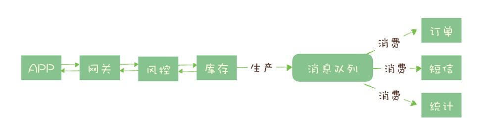
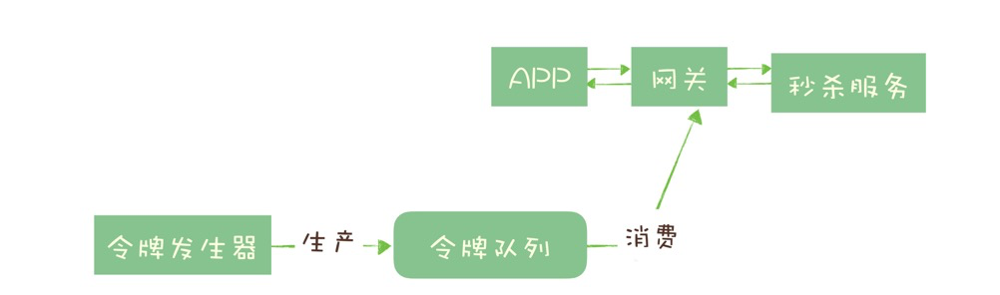
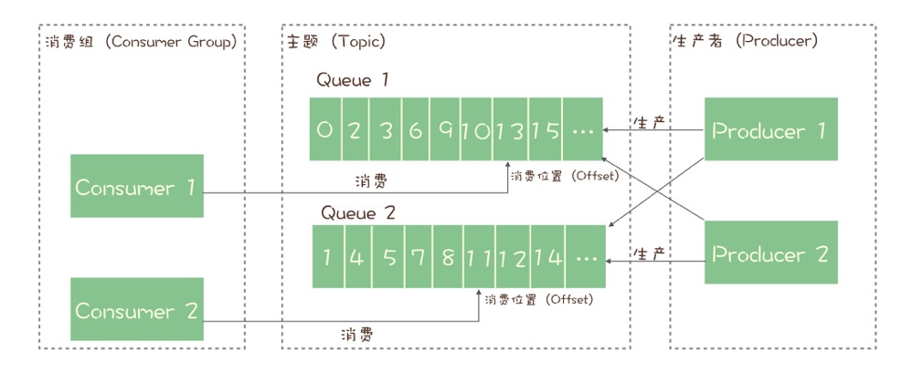
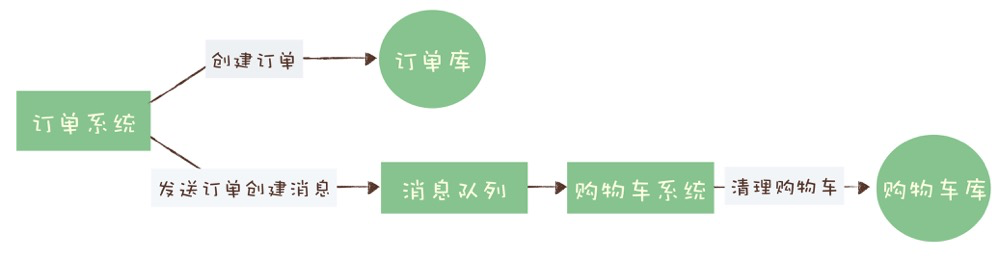
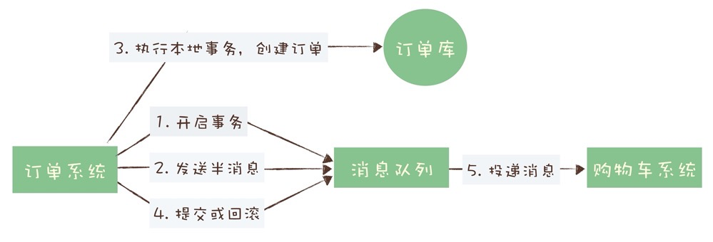
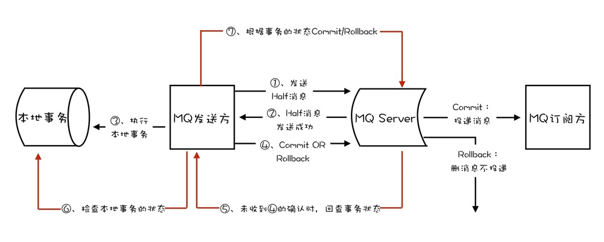

## 哪些问题适合使用消息队列解决

### 异步处理

例如一个秒杀操作，处理一个秒杀请求包含了很多步骤，例如：

- 风险控制
- 库存锁定
- 生成订单
- 短信通知
- 更新统计数据



如果没有任何优化，正常的处理流程是：App 将请求发送给网关，依次调用上述 5 个流程，然后将结果返回给 APP。

对于对于这 5 个步骤来说，能否决定秒杀成功，实际上只有风险控制和库存锁定这 2 个步骤。只要用户的秒杀请求通过风险控制，并在服务端完成库存锁定，就可以给用户返回秒杀结果了。

对于后续的生成订单、短信通知和更新统计数据等步骤，并不一定要在秒杀请求中处理完成，这些步骤就可以被异步处理。

在商品系统中，对商家商品进行停售操作，会将该商家下所有的地点商品都进行下架。由于从商家到地点会发生数据裂变，所以停售商家商品是发送停售消息后同步返回，下架商品则是通过监听停售消息来异步处理。

### 流量控制

对于突然激增的流量，可以使用消息队列来进行流量控制，起到缓冲的作用，以防流量将机器打爆。

用消息队列一般有两种流量控制的方法：

**方法一：**


1. 网关在收到请求后，将请求放入请求消息队列；
2. 后端服务从请求消息队列中获取 APP 请求，完成后续秒杀处理过程，然后返回结果。

秒杀开始后，当短时间内大量的秒杀请求到达网关时，不会直接冲击到后端的秒杀服务，而是先堆积在消息队列中，后端服务按照自己的最大处理能力，从消息队列中消费请求进行处理。

对于超时的请求可以直接丢弃，APP 将超时无响应的请求处理为秒杀失败即可。运维人员还可以随时增加秒杀服务的实例数量进行水平扩容，而不用对系统的其他部分做任何更改。

这种设计的优点是：能根据下游的处理能力自动调节流量，达到“削峰填谷”的作用。但这样做同样是有代价的：

- 增加了系统调用链环节，导致总体的响应时延变长。
- 上下游系统都要将同步调用改为异步消息，增加了系统的复杂度。

**方法二：**



提供一种类似于令牌桶的方式来可以更简单的控制流量。

令牌桶控制流量的原理是：单位时间内只发放固定数量的令牌到令牌桶中，规定服务在处理请求之前必须先从令牌桶中拿出一个令牌，如果令牌桶中没有令牌，则拒绝请求。这样就保证单位时间内，能处理的请求不超过发放令牌的数量，起到了流量控制的作用。

令牌桶可以简单地用一个有固定容量的消息队列加一个“令牌发生器”来实现：令牌发生器按照预估的处理能力，匀速生产令牌并放入令牌队列（如果队列满了则丢弃令牌），网关在收到请求时去令牌队列消费一个令牌，获取到令牌则继续调用后端秒杀服务，如果获取不到令牌则直接返回秒杀失败。

### 服务解耦

消息队列的另外一个作用，就是实现系统应用之间的解耦。

比如商户的组织架构变动，如商家调整销售范围，那么商品测对于被移除销售范围的商品要进行下架操作，这样就实现了上下游服务之间的解耦。

### 其他

- 作为发布 / 订阅系统实现一个微服务级系统间的观察者模式；
- 连接流计算任务和数据；
- 用于将消息广播给大量接收者。

简单的说，我们在单体应用里面需要用队列解决的问题，在分布式系统中大多都可以用消息队列来解决。

同时我们也要认识到，消息队列也有它自身的一些问题和局限性，包括：

- 引入消息队列带来的延迟问题；
- 增加了系统的复杂度；
- 可能产生数据不一致的问题。

所以我们说没有最好的架构，只有最适合的架构，根据目标业务的特点和自身条件选择合适的架构。

## 消息队列选型  TODO

在消息队列选型时，考虑如下特性：

- 消息的可靠传递：确保不丢消息；
- Cluster：支持集群，确保不会因为某个节点宕机导致服务不可用，当然也不能丢消息；
- 性能：具备足够好的性能，能满足绝大多数场景的性能要求。

### RocketMQ

RocketMQ 的性能比 RabbitMQ 要高一个数量级，每秒钟大概能处理几十万条消息。

RocketMQ 对在线业务的响应时延做了很多的优化，大多数情况下可以做到毫秒级的响应，**如果你的应用场景很在意响应时延，那应该选择使用 RocketMQ。**

RocketMQ 有非常活跃的中文社区，大多数问题你都可以找到中文的答案，也许会成为你选择它的一个原因。另外，RocketMQ 使用 Java 语言开发，它的贡献者大多数都是中国人，源代码相对也比较容易读懂，你很容易对 RocketMQ 进行扩展或者二次开发。

### Kafka

**Kafka 与周边生态系统的兼容性是最好的没有之一，尤其在大数据和流计算领域，几乎所有的相关开源软件系统都会优先支持 Kafka。**

Kafka 使用 Scala 和 Java 语言开发，设计上大量使用了批量和异步的思想，这种设计使得 Kafka 能做到超高的性能。Kafka 的性能，尤其是异步收发的性能，是三者中最好的，但与 RocketMQ 并没有量级上的差异，大约每秒钟可以处理几十万条消息。

但是 Kafka 这种异步批量的设计带来的问题是，它的同步收发消息的响应时延比较高，因为当客户端发送一条消息的时候，Kafka 并不会立即发送出去，而是要等一会儿攒一批再发送，在它的 Broker 中，很多地方都会使用这种“先攒一波再一起处理”的设计。当你的业务场景中，每秒钟消息数量没有那么多的时候，Kafka 的时延反而会比较高。所以，**Kafka 不太适合在线业务场景。**

### Pulsar

云原生时代最合适的消息中间件，采用存储和计算分离的设计。统一了多种消息模型，支持多租户

## 消息模型

**为了保证消息不丢失**，几乎所有的消息队列产品都使用一种非常朴素的“请求 - 确认”机制，确保消息不会在传递过程中由于网络或服务器故障丢失。具体的做法也非常简单。在生产端，生产者先将消息发送给服务端，也就是 Broker，服务端在收到消息并将消息写入主题或者队列中后，会给生产者发送确认的响应。

如果生产者没有收到服务端的确认或者收到失败的响应，则会重新发送消息；在消费端，消费者在收到消息并完成自己的消费业务逻辑（比如，将数据保存到数据库中）后，也会给服务端发送消费成功的确认，服务端只有收到消费确认后，才认为一条消息被成功消费，否则它会给消费者重新发送这条消息，直到收到对应的消费成功确认。

这个确认机制很好地保证了消息传递过程中的可靠性，但是，引入这个机制在消费端带来了一个不小的问题。什么问题呢？为了确保消息的有序性，在某一条消息被成功消费之前，下一条消息是不能被消费的，否则就会出现消息空洞，违背了有序性这个原则。

也就是说，每个主题在任意时刻，至多只能有一个消费者实例在进行消费，那就没法通过水平扩展消费者的数量来提升消费端总体的消费性能。为了解决这个问题，RocketMQ 在主题下面增加了队列的概念。

在 RocketMQ 有队列（Queue）这个概念，**每个主题包含多个队列，通过多个队列来实现多实例并行生产和消费。**需要注意的是，RocketMQ 只在队列上保证消息的有序性，主题层面是无法保证消息的严格顺序的。

在 Topic 的消费过程中，由于消息需要被不同的组进行多次消费，所以消费完的消息并不会立即被删除，这就需要 RocketMQ 为每个消费组在每个队列上维护一个消费位置（Consumer Offset），这个位置之前的消息都被消费过，之后的消息都没有被消费过，每成功消费一条消息，消费位置就加一。这个消费位置是非常重要的概念，我们在使用消息队列的时候，丢消息的原因大多是由于消费位置处理不当导致的。



注：上图中是一个消费组内的多个消费者同时消费一个topic，如果是2个消费组，另外一个消费组也有两个消费者，那么这四个消费者总共会维护四个消费位置。

kafka 和 pulsar 中这个queue被称为分区（Partition），含义和功能并无区别。

## 分布式事务

分布式事务就是要在分布式系统中的实现事务。在分布式系统中，在保证可用性和不严重牺牲性能的前提下，光是要实现数据的一致性就已经非常困难了，所以出现了很多“残血版”的一致性，比如顺序一致性、最终一致性等等。

显然实现严格的分布式事务是更加不可能完成的任务。所以，目前大家所说的分布式事务，更多情况下，是在分布式系统中事务的不完整实现。在不同的应用场景中，有不同的实现，目的都是通过一些妥协来解决实际问题。

在实际应用中，比较常见的分布式事务实现有 2PC（Two-phase Commit，也叫二阶段提交）、TCC(Try-Confirm-Cancel) 和事务消息。每一种实现都有其特定的使用场景，也有各自的问题，都不是完美的解决方案。

## 事务消息

消息队列可以用事务消息来实现分布式事务。Kafka 和 RocketMQ 都提供了事务相关功能。

其实很多场景下，我们“发消息”这个过程，目的往往是通知另外一个系统或者模块去更新数据，**消息队列中的“事务”，主要解决的是消息生产者和消息消费者的数据一致性问题。**



对于订单系统来说，它创建订单的过程中实际上执行了 2 个步骤的操作：

1. 在订单库中插入一条订单数据，创建订单；
2. 发消息给消息队列，消息的内容就是刚刚创建的订单。

购物车系统订阅相应的主题，接收订单创建的消息，然后清理购物车，在购物车中删除订单中的商品。

在分布式系统中，上面提到的这些步骤，任何一个步骤都有可能失败，如果不做任何处理，那就有可能出现订单数据与购物车数据不一致的情况，比如说：

- 创建了订单，没有清理购物车；
- 订单没创建成功，购物车里面的商品却被清掉了。

那我们需要解决的问题可以总结为：在上述任意步骤都有可能失败的情况下，还要保证订单库和购物车库这两个库的数据一致性。

**简单来说，更新db 和 发消息 要保证一致。要么都成功，要么都失败。**

本地事务中包含 更新db 和发消息，可能存在如下几种情况：

- 更新db失败，事务直接回滚，通知调用方操作失败，数据一致。
- 更新db成功，消息发送失败，事务回滚，通知调用方操作失败，数据一致。
- 更新db成功，消息发送成功，但是事务提交失败，更新db的发生回滚，但是发出去的消息无法回滚，数据不一致。


**事务消息操作流程**




在第四步，提交或回滚操作失败时，kafka 和 rocketMQ 有不同的处理方式，kafka会直接报错，由调用方来进行重试，rocketMQ 则提供了一种事务反查的机制，Broker 如果没有收到提交或者回滚的请求， Broker 会定期去 Producer 上反查事务的提交状态，这就需要我们的业务代码提供一个反查本地事务状态的接口。

这个反查本地事务的实现，并不依赖消息的发送方，也就是订单服务的某个实例节点上的任何数据。这种情况下，即使是发送事务消息的那个订单服务节点宕机了，RocketMQ 依然可以通过其他订单服务的节点来执行反查，确保事务的完整性。



## 流程引擎

流程引擎，不适于强一致的场景，可以结合业务场景用在保证最终一致性的场景下。

**使用方式一**：本地事务中包含 更新db 和 任务引擎点火，在引擎的步骤中发送消息，这种方式和直接发消息类似，区别是步骤中可以先去判断事务是否提交，如果提交的话再发消息（发消息失败的话可以支持重试），如果回滚的话就不进行消息发送。

如果是插入操作，可以查询数据唯一键来判断事务是否提交成功。这里边也容易出问题，如果未查询到对应行，不代表那个事务就提交失败。

- 问题1：它可能提交成功，但是在查询前被另外一个事务删除或者修改了。
- 问题2：可能是事务还在进行中，然后不久后事务提交成功，当然也可能失败。

上边问题的根本原因是我们是用数据来判断事务的提交结果，所以会出现各种判断不准确的情况，如果是基于数据库日志来判断的话，结果会更准确，如根据 redolog 来记录 commit log，后续的查询也是根据commit log来判断。

**使用方式二**：本地不使用事务，直接进行任务引擎点火，点火成功则返回操作成功（虽然此时还未真正执行），引擎会将操作异步化。

在流程中包含了两个步骤，分别是 更新db 和 发送消息，由外部的引擎服务来触发业务方对两个步骤的调用，如果调用失败的话可以进行重试，重试达到一定次数后会进行预警。由于步骤可能会重试，所以需要做好幂等。通过重试的方式来保证一个流程中多个步骤间的最终一致性。

## 消息重复消费

保障消息不会重复消费:1. 可以采用状态机的方式。2.消息数据唯一键+redis setnx来保障。3.本地消息表，要确保插入本地消息表和执行消息消费业务在同一事务里。


## 微服务处理大量文本

尝试回答下课后习题，老师有空帮忙看下哦 如果有一个微服务是处理大量的文本，感觉这种一般不会要求时延，大部分都会进行异步处理，更加注重服务的吞吐率，服务可以在更大的内存服务器进行部署，然后把新生代的eden设置的更大些，因为这些文本处理完不会再拿来复用，朝生夕灭，可以在新生代Minor GC，防止对象晋升到老年代，防止频繁的Major GC，如果晋升的对象过多大于老年代的连续内存空间也会有触发Full Gc，然后在这些处理文本的业务流程中，防止频繁的创建一次性的大对象，把文本对象做为业务流程直接传递下去，如果这些文本需要复用可以将他保存起来，防止频繁的创建。也为了保证服务的高可用，也需对服务做限流、负载、兜底的一些策略。


## JVM垃圾回收概念

简单整理下jvm的一些概念，帮大家回忆回忆这些理论哈哈 垃圾回收算法： 标记清除：效率较低，会产生内存碎片 复制算法：将内存一分为二，通过不断将活着的对象移动到内存另一面，再清除这面，解决了效率低、内存碎片的问题，引来新的问题：内存一分为二代价太高 标记-整理算法：先标记（过程跟标记清除一样）再将存活对象都向一端移动，清理掉端边界以外的内存。适用于老年代 分代收集算法：将内存划分为几块，新生代采用复制算法，老年代采用标记-整理算法 垃圾收集器： Serial收集器：新生代采用复制算法，会stop the world；老年代采用标记-整理算法，也会stop the world ParNew收集器：Serial收集器的多线程版本，其他一模一样 Parallel Scavenge收集器：特点：可控制的吞吐量 CMS收集器：特点：重视服务响应速度，降低GC停顿时间 大致分为4个步骤 初始标记 并发标记 重新标记 并发清除 会在初始标记和重新标记这两步stop the world G1收集器：特点：可预测的停顿，可以明确指定在一个长度为M毫秒的时间片段内，消耗在GC上的时间不得超过N毫秒 G1的运作大致分为以下几步： 初始标记 并发标记 最终标记 筛选回收 会在初始标记、最终标记、筛选回收时stop the world


课后思考及问题 1：这个算法有一个最大问题就是，在执行标记和清除过程中，必须把进程暂停，否则计算的结果就是不准确的。这也就是为什么发生垃圾回收的时候，我们的程序会卡死的原因。后续产生了许多变种的算法，这些算法更加复杂，可以减少一些进程暂停的时间，但都不能完全避免暂停进程。 对于这段有几个问题？ 1-1：进程必须暂停，是在标记阶段还是在清除阶段？还是两者都会？ 1-2：进程暂停这个实现过程是怎样的？暂停后需要再启动，这个又是一个怎样的过程？ 1-3：后面解释进程必须暂停的原因是为了使计算结果更加准确，我觉得好比打扫卫生，我一个房间一个房间来，也不耽误其他房间的事，是不是暂停是不必须的，其实 young gc 几乎不停的在发生，只有发生full gc 的时候性能才会大大降低？ 1-4：内存清除这个动作具体是怎么实现的？是电平复位？还是打上可以继续使用的标位？如果打标位这个该怎么打呢？一位一位的打？还是一个字节一个字节的打？更或者是一块一块的打？

作者回复: A1： 标记阶段需要暂停，清除阶段一般是不需要的。 A2：这个问题有点复杂，你可以参考一下：https://stackoverflow.com/questions/16558746/what-mechanism-jvm-use-to-block-threads-during-stop-the-world-pause A3：对于GC来说只有一个房间，你是没有办法分成多个完全独立的小房间的。 像java中的young gc就是为了缓解这个问题，而产生的变种算法，它可以减少FullGC的次数，但没有办法完全避免FullGC。 A4：内存是按页为单位管理的，也就是一块一块的，对于JVM来说，它有一套复杂的数据结构来记录它管理的所有页面与对象引用之间的关系。所谓清除和移动对象，就是修改这个记录关系的数据结构。


通过jstat 观察gc情况和分析gc日志，来合理分配堆内存，年轻代，年老代大小，尽量让对象在minor gc就能被回收，而不需要执行full gc。因为full gc执行速度慢，程序暂停时间就长


## 为什么在高并发下程序会卡死？

在理解了自动内存管理的基本原理后，我再带你分析一下，为什么在高并发场景下，这种自动内存管理的机制会更容易触发进程暂停。

一般来说，我们的微服务在收到一个请求后，执行一段业务逻辑，然后返回响应。这个过程中，会创建一些对象，比如说请求对象、响应对象和处理中间业务逻辑中需要使用的一些对象等等。随着这个请求响应的处理流程结束，我们创建的这些对象也就都没有用了，它们将会在下一次垃圾回收过程中被释放。

你需要注意的是，直到下一次垃圾回收之前，这些已经没有用的对象会一直占用内存。

那么，虚拟机是如何决定什么时候来执行垃圾回收呢？这里面的策略非常复杂，也有很多不同的实现，我们不展开来讲，但是无论是什么策略，如果内存不够用了，那肯定要执行一次垃圾回收的，否则程序就没法继续运行了。

在低并发情况下，单位时间内需要处理的请求不多，创建的对象数量不会很多，自动垃圾回收机制可以很好地发挥作用，它可以选择在系统不太忙的时候来执行垃圾回收，每次垃圾回收的对象数量也不多，相应的，程序暂停的时间非常短，短到我们都无法感知到这个暂停。这是一个良性的循环。

在高并发的情况下，一切都变得不一样了。

我们的程序会非常繁忙，短时间内就会创建大量的对象，这些对象将会迅速占满内存，这时候，由于没有内存可以使用了，垃圾回收被迫开始启动，并且，这次被迫执行的垃圾回收面临的是占满整个内存的海量对象，它执行的时间也会比较长，相应的，这个回收过程会导致进程长时间暂停。

进程长时间暂停，又会导致大量的请求积压等待处理，垃圾回收刚刚结束，更多的请求立刻涌进来，迅速占满内存，再次被迫执行垃圾回收，进入了一个恶性循环。如果垃圾回收的速度跟不上创建对象的速度，还可能会产生内存溢出的现象。

于是，就出现了我在这节课开始提到的那个情况：一到大促，大量请求过来，我们的服务就卡死了。

## 高并发下的内存管理技巧

对于开发者来说，垃圾回收是不可控的，而且是无法避免的。但是，我们还是可以通过一些方法来降低垃圾回收的频率，减少进程暂停的时长。

我们知道，只有使用过被丢弃的对象才是垃圾回收的目标，所以，我们需要想办法在处理大量请求的同时，尽量少的产生这种一次性对象。

最有效的方法就是，优化你的代码中处理请求的业务逻辑，尽量少的创建一次性对象，特别是占用内存较大的对象。比如说，我们可以把收到请求的 Request 对象在业务流程中一直传递下去，而不是每执行一个步骤，就创建一个内容和 Request 对象差不多的新对象。这里面没有多少通用的优化方法，你需要根据我告诉你的这个原则，针对你的业务逻辑来想办法进行优化。

对于需要频繁使用，占用内存较大的一次性对象，我们可以考虑自行回收并重用这些对象。实现的方法是这样的：我们可以为这些对象建立一个对象池。收到请求后，在对象池内申请一个对象，使用完后再放回到对象池中，这样就可以反复地重用这些对象，非常有效地避免频繁触发垃圾回收。

如果可能的话，使用更大内存的服务器，也可以非常有效地缓解这个问题。

以上这些方法，都可以在一定程度上缓解由于垃圾回收导致的进程暂停，如果你优化的好，是可以达到一个还不错的效果的。

当然，要从根本上来解决这个问题，办法只有一个，那就是绕开自动垃圾回收机制，自己来实现内存管理。但是，自行管理内存将会带来非常多的问题，比如说极大增加了程序的复杂度，可能会引起内存泄漏等等。

流计算平台 Flink，就是自行实现了一套内存管理机制，一定程度上缓解了处理大量数据时垃圾回收的问题，但是也带来了一些问题和 Bug，总体看来，效果并不是特别好。因此，一般情况下我并不推荐你这样做，具体还是要根据你的应用情况，综合权衡做出一个相对最优的选择。

现代的编程语言，大多采用自动内存管理机制，虚拟机会不定期执行垃圾回收，自动释放我们不再使用的内存，但是执行垃圾回收的过程会导致进程暂停。

在高并发的场景下，会产生大量的待回收的对象，需要频繁地执行垃圾回收，导致程序长时间暂停，我们的程序看起来就像卡死了一样。为了缓解这个问题，我们需要尽量少地使用一次性对象，对于需要频繁使用，占用内存较大的一次性对象，我们可以考虑自行回收并重用这些对象，来减轻垃圾回收的压力。

## Kafka如何实现高性能IO

全异步化的线程模型、高性能的异步网络传输、自定义的私有传输协议和序列化、反序列化等等。

课后思考及问题 kafka之所以那么快的秘密

-  1：消息批处理——减少网络通信开销 
- 2：磁盘顺序写——减少寻道移臂开销 
- 3：缓存页——减少磁盘IO开销 
- 4：零拷贝——减少数据多次拷贝的开销 以上基本是一个快速的数据处理组件或系统的标配了，再加上池化技术、异步化技术、不可变技术、多线程并发编程、事件驱动模型、无锁化技术。

### **使用批量消息提升服务端处理能力**

我们知道，批量处理是一种非常有效的提升系统吞吐量的方法。在 Kafka 内部，消息都是以“批”为单位处理的。一批消息从发送端到接收端，是如何在 Kafka 中流转的呢？

我们先来看发送端，也就是 Producer 这一端。

在 Kafka 的客户端 SDK（软件开发工具包）中，Kafka 的 Producer 只提供了单条发送的 send() 方法，并没有提供任何批量发送的接口。原因是，Kafka 根本就没有提供单条发送的功能，是的，你没有看错，虽然它提供的 API 每次只能发送一条消息，但实际上，Kafka 的客户端 SDK 在实现消息发送逻辑的时候，采用了异步批量发送的机制。

当你调用 send() 方法发送一条消息之后，无论你是同步发送还是异步发送，Kafka 都不会立即就把这条消息发送出去。它会先把这条消息，存放在内存中缓存起来，然后选择合适的时机把缓存中的所有消息组成一批，一次性发给 Broker。简单地说，就是攒一波一起发。

在 Kafka 的服务端，也就是 Broker 这一端，又是如何处理这一批一批的消息呢？

在服务端，Kafka 不会把一批消息再还原成多条消息，再一条一条地处理，这样太慢了。Kafka 这块儿处理的非常聪明，每批消息都会被当做一个“批消息”来处理。也就是说，在 Broker 整个处理流程中，无论是写入磁盘、从磁盘读出来、还是复制到其他副本这些流程中，**批消息都不会被解开，一直是作为一条“批消息”来进行处理的。**

在消费时，消息同样是以批为单位进行传递的，Consumer 从 Broker 拉到一批消息后，在客户端把批消息解开，再一条一条交给用户代码处理。

比如说，你在客户端发送 30 条消息，在业务程序看来，是发送了 30 条消息，而对于 Kafka 的 Broker 来说，它其实就是处理了 1 条包含 30 条消息的“批消息”而已。显然处理 1 次请求要比处理 30 次请求要快得多。

构建批消息和解开批消息分别在发送端和消费端的客户端完成，不仅减轻了 Broker 的压力，最重要的是减少了 Broker 处理请求的次数，提升了总体的处理能力。

这就是 Kafka 用批量消息提升性能的方法。

我们知道，相比于网络传输和内存，磁盘 IO 的速度是比较慢的。对于消息队列的服务端来说，性能的瓶颈主要在磁盘 IO 这一块。接下来我们看一下，Kafka 在磁盘 IO 这块儿做了哪些优化。

### 使用顺序读写提升磁盘 IO 性能

对于磁盘来说，它有一个特性，就是顺序读写的性能要远远好于随机读写。在 SSD（固态硬盘）上，顺序读写的性能要比随机读写快几倍，如果是机械硬盘，这个差距会达到几十倍。为什么呢？

操作系统每次从磁盘读写数据的时候，需要先寻址，也就是先要找到数据在磁盘上的物理位置，然后再进行数据读写。如果是机械硬盘，这个寻址需要比较长的时间，因为它要移动磁头，这是个机械运动，机械硬盘工作的时候会发出咔咔的声音，就是移动磁头发出的声音。

顺序读写相比随机读写省去了大部分的寻址时间，它只要寻址一次，就可以连续地读写下去，所以说，性能要比随机读写要好很多。

Kafka 就是充分利用了磁盘的这个特性。它的存储设计非常简单，对于每个分区，它把从 Producer 收到的消息，顺序地写入对应的 log 文件中，一个文件写满了，就开启一个新的文件这样顺序写下去。消费的时候，也是从某个全局的位置开始，也就是某一个 log 文件中的某个位置开始，顺序地把消息读出来。

这样一个简单的设计，充分利用了顺序读写这个特性，极大提升了 Kafka 在使用磁盘时的 IO 性能。

### 利用 PageCache 加速消息读写

在 Kafka 中，它会利用 PageCache 加速消息读写。PageCache 是现代操作系统都具有的一项基本特性。通俗地说，PageCache 就是操作系统在内存中给磁盘上的文件建立的缓存。无论我们使用什么语言编写的程序，在调用系统的 API 读写文件的时候，并不会直接去读写磁盘上的文件，应用程序实际操作的都是 PageCache，也就是文件在内存中缓存的副本。

应用程序在写入文件的时候，操作系统会先把数据写入到内存中的 PageCache，然后再一批一批地写到磁盘上。读取文件的时候，也是从 PageCache 中来读取数据，这时候会出现两种可能情况。

一种是 PageCache 中有数据，那就直接读取，这样就节省了从磁盘上读取数据的时间；另一种情况是，PageCache 中没有数据，这时候操作系统会引发一个缺页中断，应用程序的读取线程会被阻塞，操作系统把数据从文件中复制到 PageCache 中，然后应用程序再从 PageCache 中继续把数据读出来，这时会真正读一次磁盘上的文件，这个读的过程就会比较慢。

用户的应用程序在使用完某块 PageCache 后，操作系统并不会立刻就清除这个 PageCache，而是尽可能地利用空闲的物理内存保存这些 PageCache，除非系统内存不够用，操作系统才会清理掉一部分 PageCache。清理的策略一般是 LRU 或它的变种算法，这个算法我们不展开讲，它保留 PageCache 的逻辑是：优先保留最近一段时间最常使用的那些 PageCache。

Kafka 在读写消息文件的时候，充分利用了 PageCache 的特性。一般来说，消息刚刚写入到服务端就会被消费，按照 LRU 的“优先清除最近最少使用的页”这种策略，读取的时候，对于这种刚刚写入的 PageCache，命中的几率会非常高。

也就是说，大部分情况下，消费读消息都会命中 PageCache，带来的好处有两个：一个是读取的速度会非常快，另外一个是，给写入消息让出磁盘的 IO 资源，间接也提升了写入的性能。

### ZeroCopy：零拷贝技术

Kafka 的服务端在消费过程中，还使用了一种“零拷贝”的操作系统特性来进一步提升消费的性能。

我们知道，在服务端，处理消费的大致逻辑是这样的：

- 首先，从文件中找到消息数据，读到内存中；
- 然后，把消息通过网络发给客户端。

这个过程中，数据实际上做了 2 次或者 3 次复制：

1. 从文件复制数据到 PageCache 中，如果命中 PageCache，这一步可以省掉；
2. 从 PageCache 复制到应用程序的内存空间中，也就是我们可以操作的对象所在的内存；
3. 从应用程序的内存空间复制到 Socket 的缓冲区，这个过程就是我们调用网络应用框架的 API 发送数据的过程。

Kafka 使用零拷贝技术可以把这个复制次数减少一次，上面的 2、3 步骤两次复制合并成一次复制。直接从 PageCache 中把数据复制到 Socket 缓冲区中，这样不仅减少一次数据复制，更重要的是，由于不用把数据复制到用户内存空间，DMA 控制器可以直接完成数据复制，不需要 CPU 参与，速度更快。

下面是这个零拷贝对应的系统调用：

```
#include <sys/socket.h>
ssize_t sendfile(int out_fd, int in_fd, off_t *offset, size_t count);
```

它的前两个参数分别是目的端和源端的文件描述符，后面两个参数是源端的偏移量和复制数据的长度，返回值是实际复制数据的长度。

如果你遇到这种从文件读出数据后再通过网络发送出去的场景，并且这个过程中你不需要对这些数据进行处理，那一定要使用这个零拷贝的方法，可以有效地提升性能。

### Kafka 和 RocketMQ的log区别

RocketMQ的consumerQueue文件和Kafka的index file作用是差不多的，都是log文件（保存真正的消息）的索引，消费的时候，都需要先读索引，再读log，这个方面，两者并没有什么不同。它们存储设计的真正的差异的是log文件的设计，RocketMQ每个Broker只有一组log文件，而Kafka是每个分区一组log文件，


## 缓存

只读缓存和读写缓存。

我们之前的课中讲到 Kafka 使用的 PageCache，它就是一个非常典型的读写缓存。操作系统会利用系统空闲的物理内存来给文件读写做缓存，这个缓存叫做 PageCache。应用程序在写文件的时候，操作系统会先把数据写入到 PageCache 中，数据在成功写到 PageCache 之后，对于用户代码来说，写入就结束了。

然后，操作系统再异步地把数据更新到磁盘的文件中。应用程序在读文件的时候，操作系统也是先尝试从 PageCache 中寻找数据，如果找到就直接返回数据，找不到会触发一个缺页中断，然后操作系统把数据从文件读取到 PageCache 中，再返回给应用程序。

我们可以看到，在数据写到 PageCache 中后，它并不是同时就写到磁盘上了，这中间是有一个延迟的。操作系统可以保证，即使是应用程序意外退出了，操作系统也会把这部分数据同步到磁盘上。但是，如果服务器突然掉电了，这部分数据就丢失了。

另外，写缓存的实现是非常复杂的。应用程序不停地更新 PageCache 中的数据，操作系统需要记录哪些数据有变化，同时还要在另外一个线程中，把缓存中变化的数据更新到磁盘文件中。在提供并发读写的同时来异步更新数据，这个过程中要保证数据的一致性，并且有非常好的性能，实现这些真不是一件容易的事儿。因此一般情况下，不推荐使用读写缓存。

