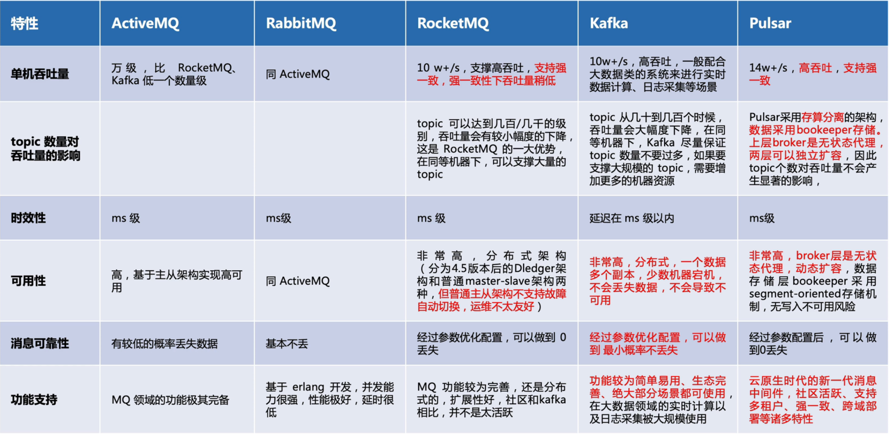
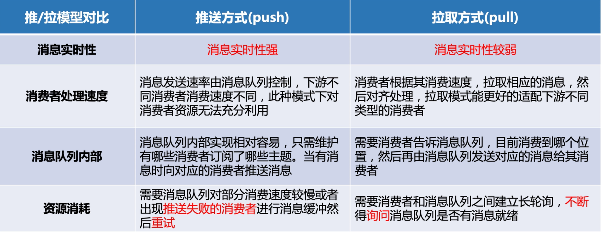
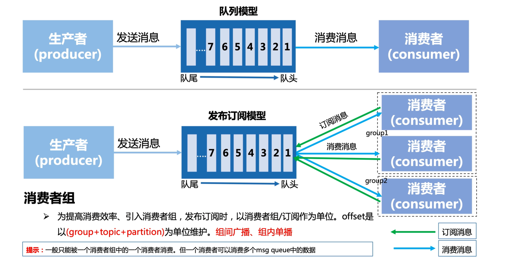

## 为什么使用消息队列

**优点**

- 系统解耦：用 MQ 消息队列，可以实现系统间解耦，隔离系统上下游环境变化带来的不稳定因素，下游系统的需求无论怎么调整，上游系统都不用做出任何改变。实现上下游服务的解耦，做到了系统的高可用。
- 流量控制：遇到秒杀等流量突增的场景，通过 MQ 还可以实现流量的“削峰填谷”的作用，可以根据下游的处理能力自动调节流量。

**缺点**

- 引入 MQ 消息中间件实现系统解耦，会影响系统之间数据传输的一致性。 在分布式系统中，如果两个节点之间存在数据同步，就会带来数据一致性的问题。如消息生产端和消息消费端的消息数据一致性问题，即如何确保消息不丢失。
- 引入 MQ 消息中间件解决流量控制，还需考虑消息队列和其他系统之间处理关系。如果下游处理消息的速度低于上游发消息的速度，那么可能会导致消息积压。
- 引入消息中间价，会使系统的整体复杂性会变高，消息队列故障后可能会导致整个系统瘫痪

## 消息队列对比

## 消息推拉方案对比

## 消费者模型

上边是kafka 下边是pulsar

## 消息队列的高可用

kafka
broker 相当于kafka的进程
　Kafka天生就是一个分布式的消息队列，它可以由多个broker组成，每个broker是一个节点；你创建一个topic，这个topic可以划分为多个partition，每个partition可以存在于不同的broker上，每个partition就放一部分数据。

　　kafka 0.8以前，是没有HA机制的，就是任何一个broker宕机了，那个broker上的partition就废了，没法写也没法读，没有什么高可用性可言。

　　kafka 0.8以后，提供了HA机制，就是replica副本机制。kafka会均匀的将一个partition的所有replica分布在不同的机器上，来提高容错性。每个partition的数据都会同步到吉他机器上，形成自己的多个replica副本。然后所有replica会选举一个leader出来，那么生产和消费都去leader，其他replica就是follower，leader会同步数据给follower。当leader挂了会自动去找replica，然后会再选举一个leader出来，这样就具有高可用性了。

　　写数据的时候，生产者就写leader，然后leader将数据落地写本地磁盘，接着其他follower自己主动从leader来pull数据。一旦所有follower同步好数据了，就会发送ack给leader，leader收到所有follower的ack之后，就会返回写成功的消息给生产者。（当然，这只是其中一种模式，还可以适当调整这个行为）

　　消费的时候，只会从leader去读，但是只有一个消息已经被所有follower都同步成功返回ack的时候，这个消息才会被消费者读到。

## 消息重复消费(幂等性)

**产生问题场景：**

1. 发送时消息重复

   当一条消息已被成功发送到服务端并完成持久化，此时出现了网络闪断或者客户端宕机，导致服务端对客户端应答失败。 如果此时生产者意识到消息发送失败并尝试再次发送消息，消费者后续会收到两条内容相同并且Message ID也相同的消息。

2. 投递时消息重复

   消息消费的场景下，消息已投递到消费者并完成业务处理，当客户端给服务端反馈应答的时候网络闪断。为了保证消息至少被消费一次，消息队列RocketMQ版的服务端将在网络恢复后再次尝试投递之前已被处理过的消息，消费者后续会收到两条内容相同并且Message ID也相同的消息。

3. 负载均衡时消息重复（包括但不限于网络抖动、Broker重启以及消费者应用重启）

   当消息队列RocketMQ版的Broker或客户端重启、扩容或缩容时，会触发Rebalance，此时消费者可能会收到重复消息

**消息幂等解决：**

消息幂等需要结合具体业务场景。

- 需要插入数据时，利用数据库的唯一约束实现幂等，主键索引，唯一索引都可以。本地消息防重表也可以。
- redis分布式锁，setNx 对业务唯一键标记，处理前先去redis查看是对应key是否存在。需要设计过期时间
- 可以通过版本号属性；例如品牌状态更新，外域需要感知，就可以通过发送带有版本号的消息。

## 消息的可靠性传输(消息丢失)

消费端不是自动ACK，而是手动ACK。

- **消息生产阶段：** 从消息被生产出来，然后提交给 MQ 的过程中，只要能正常收到 MQ Broker 的 ack 确认响应，就表示发送成功，所以只要处理好返回值和异常，这个阶段是不会出现消息丢失的。
- **消息存储阶段：** 这个阶段一般会直接交给 MQ 消息中间件来保证，但是你要了解它的原理，比如 Broker 会做副本，保证一条消息至少同步两个节点再返回 ack。
- **消息消费阶段：** 消费端从 Broker 上拉取消息，只要消费端在收到消息后，不立即发送消费确认给 Broker，而是等到执行完业务逻辑后，再发送消费确认，也能保证消息的不丢失。

- 如何知道有消息丢失？
- 哪些环节可能丢消息？
- 如何确保消息不丢失？

- 生产者把消息搞丢  
  confirm
  此时可以选择用rabbitmq提供的事务功能，就是生产者发送数据之前开启rabbitmq事务（channel.txSelect），然后发送消息，如果消息没有成功被rabbitmq接收到，那么生产者会收到异常报错，此时就可以回滚事务（channel.txRollback），然后重试发送消息；如果收到了消息，那么可以提交事务（channel.txCommit）。但是问题是，rabbitmq事务机制一搞，基本上吞吐量会下来，因为太耗性能。

所以一般来说，如果你要确保说写rabbitmq的消息别丢，可以开启confirm模式，在生产者那里设置开启confirm模式之后，你每次写的消息都会分配一个唯一的id，然后如果写入了rabbitmq中，rabbitmq会给你回传一个ack消息，告诉你说这个消息ok了。如果rabbitmq没能处理这个消息，会回调你一个nack接口，告诉你这个消息接收失败，你可以重试。而且你可以结合这个机制自己在内存里维护每个消息id的状态，如果超过一定时间还没接收到这个消息的回调，那么你可以重发。

事务机制和cnofirm机制最大的不同在于，事务机制是同步的，你提交一个事务之后会阻塞在那儿，但是confirm机制是异步的，你发送个消息之后就可以发送下一个消息，然后那个消息rabbitmq接收了之后会异步回调你一个接口通知你这个消息接收到了。

所以一般在生产者这块避免数据丢失，都是用confirm机制的。

- RabbitMq把消息搞丢
  持久化
- 消费者把消息搞丢
  取消自动ack

## 消息堆积和延迟

**问题描述：**

- 业务系统上下游能力不匹配造成的持续堆积，且无法自行恢复。
- 业务系统对消息的消费实时性要求较高，即使是短暂的堆积造成的消息延迟也无法接受。

**问题原因：**

代码中如果没有复杂的递归和循环的话，内部计算耗时相对外部I/O操作来说几乎可以忽略。

外部I/O操作通常包括如下业务逻辑：

- 读写外部数据库，例如MySQL数据库读写。
- 读写外部缓存等系统，例如Redis读写。
- 复杂的ES查询聚会等。
- 下游系统调用，例如Dubbo调用或者下游HTTP接口调用。

**线上出现时解决办法：**

- 加机器或者逐步调大消费线程，可以通过添加临时的消费者来加快消费
- 提高消费者的消费能力，如减缓消费者所在机器的其他运算，提高消费能力

**如何从根本上避免消息堆积和延迟**

需要在前期设计阶段对整个业务逻辑进行完善的排查和梳理。整理出正常业务运行场景下的性能基线，才能在故障场景下迅速定位到阻塞点。其中最重要的就是梳理消息的消费耗时和消息消费的并发度。

- 梳理消息的消费耗时

  通过压测获取消息的消费耗时，并对耗时较高的操作的代码逻辑进行分析。查询消费耗时，梳理消息的消费耗时需要关注以下信息：

  - 消息消费逻辑的计算复杂度是否过高，代码是否存在无限循环和递归等缺陷。
  - 消息消费逻辑中的I/O操作（如：外部调用、读写存储等）是否是必须的，能否用本地缓存等方案规避。
  - 消费逻辑中的复杂耗时的操作是否可以做异步化处理，如果可以是否会造成逻辑错乱（消费完成但异步操作未完成）。

- 设置消息的消费并发度

  - 逐步调大线程的单个节点的线程数，并观测节点的系统指标，得到单个节点最优的消费线程数和消息吞吐量。
  - 得到单个节点的最优线程数和消息吞吐量后，根据上下游链路的流量峰值计算出需要设置的节点数，节点数=流量峰值/单线程消息吞吐量。

## 消息顺序消费

1. topic强制采用一个分区，所有消息放到一个队列里，这样能达到全局顺序性。但是会损失高并发特性。
2. 

## 不丢失消息TODO

前提条件
任何消息组件不丢数据都是在特定场景下一定条件的，kafka要保证消息不丢，有两个核心条件。

第一，必须是已提交的消息，即committed message。kafka对于committed message的定义是，生产者提交消息到broker，并等到多个broker确认并返回给生产者已提交的确认信息。而这多个broker是由我们自己来定义的，可以选择只要有一个broker成功保存该消息就算是已提交，也可以是令所有broker都成功保存该消息才算是已提交。不论哪种情况，kafka只对已提交的消息做持久化保证。

第二，也就是最基本的条件，虽然kafka集群是分布式的，但也必须保证有足够broker正常工作，才能对消息做持久化做保证。也就是说 kafka不丢消息是有前提条件的，假如你的消息保存在 N 个kafka broker上，那么这个前提条件就是这 N 个broker中至少有 1 个存活。只要这个条件成立，kafka就能保证你的这条消息永远不会丢失。

如何保证消息不丢
一条消息从产生，到发送到kafka保存，到被取出消费，会有多个场景和流程阶段，可能会出现丢失情况，我们聊一下kafka通过哪些手段来保障消息不丢。

生产端
Producer端可能会丢失消息。目前Kafka Producer是异步发送消息的，也就是说如果你调用的是producer.send(msg)这个API，那么它通常会立即返回，但此时你不保证消息发送已成功完成。可能会出现：网络抖动，导致消息压根就没有发送到Broker端；或者消息本身不合规导致Broker拒绝接收（比如消息太大了，超过了Broker的限制）。

实际上，使用producer.send(msg, callback)接口就能避免这个问题，根据回调，一旦出现消息提交失败的情况，就可以有针对性地进行处理。如果是因为那些瞬时错误，Producer重试就可以了；如果是消息不合规造成的，那么调整消息格式后再次发送。总之，处理发送失败的责任在Producer端而非Broker端。当然，如果此时broker宕机，那就另当别论，需要及时处理broker异常问题。

消费端
Consumer端丢数据的情况，稍微复杂点。Consumer有个”位移“(offset)的概念，表示Consumer当前消费到topic分区的哪个位置。如图：

在这里插入图片描述

kafka通过先消费消息，后更新offset，来保证消息不丢失。但是这样可能会出现消息重复的情况，具体如何保证only-once，后续再单独分享。

当我们consumer端开启多线程异步去消费时，情况又会变得复杂一些。此时consumer自动地向前更新offset，假如其中某个线程运行失败了，它负责的消息没有被成功处理，但位移已经被更新了，因此这条消息对于consumer而言实际上是丢失了。这里的关键就在自动提交offset，如何真正地确认消息是否真的被消费，再进行更新offset。

这个问题的解决起来也简单：如果是多线程异步处理消费消息，consumer不要开启自动提交offset，consumer端程序自己来处理offset的提交更新。提醒你一下，单个consumer程序使用多线程来消费消息说起来容易，写成代码还是有点麻烦的，因为你很难正确地处理offset的更新，也就是说避免无消费消息丢失很简单，但极易出现消息被消费了多次的情况。

实践配置
最后分享下kafka无消息丢失配置：

producer端使用producer.send(msg, callback)带有回调的send方法。
设置acks = all。acks是Producer的一个参数，代表“已提交”消息的定义。如果设置成all，则表明所有Broker都要接收到消息，该消息才算是“已提交”。
设置retries为一个较大的值。同样是Producer的参数。当出现网络抖动时，消息发送可能会失败，此时配置了retries的Producer能够自动重试发送消息，尽量避免消息丢失。
设置unclean.leader.election.enable = false。这是Broker端的参数，在kafka版本迭代中社区也多次反复修改过他的默认值，之前比较具有争议。它控制哪些Broker有资格竞选分区的Leader。如果一个Broker落后原先的Leader太多，那么它一旦成为新的Leader，将会导致消息丢失。故一般都要将该参数设置成false。
设置replication.factor >= 3。这也是Broker端的参数。保存多份消息冗余，不多解释了。
设置min.insync.replicas > 1。Broker端参数，控制消息至少要被写入到多少个副本才算是“已提交”。设置成大于 1 可以提升消息持久性。在生产环境中不要使用默认值 1。确保replication.factor > min.insync.replicas。如果两者相等，那么只要有一个副本离线，整个分区就无法正常工作了。推荐设置成replication.factor = min.insync.replicas + 1。
确保消息消费完成再提交。Consumer端有个参数enable.auto.commit，最好设置成false，并自己来处理offset的提交更新。
