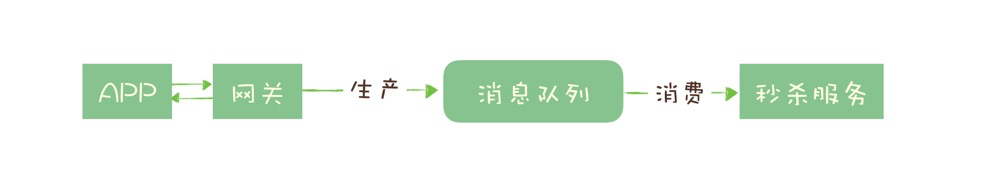

## 哪些问题适合使用消息队列解决

### 异步处理

例如一个秒杀操作，处理一个秒杀请求包含了很多步骤，例如：

- 风险控制
- 库存锁定
- 生成订单
- 短信通知
- 更新统计数据

如果没有任何优化，正常的处理流程是：App 将请求发送给网关，依次调用上述 5 个流程，然后将结果返回给 APP。

对于对于这 5 个步骤来说，能否决定秒杀成功，实际上只有风险控制和库存锁定这 2 个步骤。只要用户的秒杀请求通过风险控制，并在服务端完成库存锁定，就可以给用户返回秒杀结果了。

对于后续的生成订单、短信通知和更新统计数据等步骤，并不一定要在秒杀请求中处理完成，这些步骤就可以被异步处理。

在商品系统中，对商家商品进行停售操作，会将该商家下所有的地点商品都进行下架。由于从商家到地点会发生数据裂变，所以停售商家商品是发送停售消息后同步返回，下架商品则是通过监听停售消息来异步处理。

### 流量控制

对于突然激增的流量，可以使用消息队列来进行流量控制，起到缓冲的作用，以防流量将机器打爆。

用消息队列一般有两种流量控制的方法：

**方法一：**

1. 网关在收到请求后，将请求放入请求消息队列；
2. 后端服务从请求消息队列中获取 APP 请求，完成后续秒杀处理过程，然后返回结果。

秒杀开始后，当短时间内大量的秒杀请求到达网关时，不会直接冲击到后端的秒杀服务，而是先堆积在消息队列中，后端服务按照自己的最大处理能力，从消息队列中消费请求进行处理。

对于超时的请求可以直接丢弃，APP 将超时无响应的请求处理为秒杀失败即可。运维人员还可以随时增加秒杀服务的实例数量进行水平扩容，而不用对系统的其他部分做任何更改。

这种设计的优点是：能根据下游的处理能力自动调节流量，达到“削峰填谷”的作用。但这样做同样是有代价的：

- 增加了系统调用链环节，导致总体的响应时延变长。
- 上下游系统都要将同步调用改为异步消息，增加了系统的复杂度。

**方法二：**

提供一种类似于令牌桶的方式来可以更简单的控制流量。

令牌桶控制流量的原理是：单位时间内只发放固定数量的令牌到令牌桶中，规定服务在处理请求之前必须先从令牌桶中拿出一个令牌，如果令牌桶中没有令牌，则拒绝请求。这样就保证单位时间内，能处理的请求不超过发放令牌的数量，起到了流量控制的作用。

令牌桶可以简单地用一个有固定容量的消息队列加一个“令牌发生器”来实现：令牌发生器按照预估的处理能力，匀速生产令牌并放入令牌队列（如果队列满了则丢弃令牌），网关在收到请求时去令牌队列消费一个令牌，获取到令牌则继续调用后端秒杀服务，如果获取不到令牌则直接返回秒杀失败。

### 服务解耦

消息队列的另外一个作用，就是实现系统应用之间的解耦。

比如商户的组织架构变动，如商家调整销售范围，那么商品测对于被移除销售范围的商品要进行下架操作，这样就实现了上下游服务之间的解耦。

### 其他

- 作为发布 / 订阅系统实现一个微服务级系统间的观察者模式；
- 连接流计算任务和数据；
- 用于将消息广播给大量接收者。

简单的说，我们在单体应用里面需要用队列解决的问题，在分布式系统中大多都可以用消息队列来解决。

同时我们也要认识到，消息队列也有它自身的一些问题和局限性，包括：

- 引入消息队列带来的延迟问题；
- 增加了系统的复杂度；
- 可能产生数据不一致的问题。

所以我们说没有最好的架构，只有最适合的架构，根据目标业务的特点和自身条件选择合适的架构。

## 消息队列选型  TODO

在消息队列选型时，考虑如下特性：

- 消息的可靠传递：确保不丢消息；
- Cluster：支持集群，确保不会因为某个节点宕机导致服务不可用，当然也不能丢消息；
- 性能：具备足够好的性能，能满足绝大多数场景的性能要求。

### RocketMQ

RocketMQ 的性能比 RabbitMQ 要高一个数量级，每秒钟大概能处理几十万条消息。

RocketMQ 对在线业务的响应时延做了很多的优化，大多数情况下可以做到毫秒级的响应，**如果你的应用场景很在意响应时延，那应该选择使用 RocketMQ。**

RocketMQ 有非常活跃的中文社区，大多数问题你都可以找到中文的答案，也许会成为你选择它的一个原因。另外，RocketMQ 使用 Java 语言开发，它的贡献者大多数都是中国人，源代码相对也比较容易读懂，你很容易对 RocketMQ 进行扩展或者二次开发。

### Kafka

**Kafka 与周边生态系统的兼容性是最好的没有之一，尤其在大数据和流计算领域，几乎所有的相关开源软件系统都会优先支持 Kafka。**

Kafka 使用 Scala 和 Java 语言开发，设计上大量使用了批量和异步的思想，这种设计使得 Kafka 能做到超高的性能。Kafka 的性能，尤其是异步收发的性能，是三者中最好的，但与 RocketMQ 并没有量级上的差异，大约每秒钟可以处理几十万条消息。

但是 Kafka 这种异步批量的设计带来的问题是，它的同步收发消息的响应时延比较高，因为当客户端发送一条消息的时候，Kafka 并不会立即发送出去，而是要等一会儿攒一批再发送，在它的 Broker 中，很多地方都会使用这种“先攒一波再一起处理”的设计。当你的业务场景中，每秒钟消息数量没有那么多的时候，Kafka 的时延反而会比较高。所以，**Kafka 不太适合在线业务场景。**

### Pulsar

云原生时代最合适的消息中间件，采用存储和计算分离的设计。统一了多种消息模型，支持多租户

## 消息模型

**为了保证消息不丢失**，几乎所有的消息队列产品都使用一种非常朴素的“请求 - 确认”机制，确保消息不会在传递过程中由于网络或服务器故障丢失。具体的做法也非常简单。在生产端，生产者先将消息发送给服务端，也就是 Broker，服务端在收到消息并将消息写入主题或者队列中后，会给生产者发送确认的响应。

如果生产者没有收到服务端的确认或者收到失败的响应，则会重新发送消息；在消费端，消费者在收到消息并完成自己的消费业务逻辑（比如，将数据保存到数据库中）后，也会给服务端发送消费成功的确认，服务端只有收到消费确认后，才认为一条消息被成功消费，否则它会给消费者重新发送这条消息，直到收到对应的消费成功确认。

这个确认机制很好地保证了消息传递过程中的可靠性，但是，引入这个机制在消费端带来了一个不小的问题。什么问题呢？为了确保消息的有序性，在某一条消息被成功消费之前，下一条消息是不能被消费的，否则就会出现消息空洞，违背了有序性这个原则。

也就是说，每个主题在任意时刻，至多只能有一个消费者实例在进行消费，那就没法通过水平扩展消费者的数量来提升消费端总体的消费性能。为了解决这个问题，RocketMQ 在主题下面增加了队列的概念。

在 RocketMQ 有队列（Queue）这个概念，**每个主题包含多个队列，通过多个队列来实现多实例并行生产和消费。**需要注意的是，RocketMQ 只在队列上保证消息的有序性，主题层面是无法保证消息的严格顺序的。

在 Topic 的消费过程中，由于消息需要被不同的组进行多次消费，所以消费完的消息并不会立即被删除，这就需要 RocketMQ 为每个消费组在每个队列上维护一个消费位置（Consumer Offset），这个位置之前的消息都被消费过，之后的消息都没有被消费过，每成功消费一条消息，消费位置就加一。这个消费位置是非常重要的概念，我们在使用消息队列的时候，丢消息的原因大多是由于消费位置处理不当导致的。

注：上图中是一个消费组内的多个消费者同时消费一个topic，如果是2个消费组，另外一个消费组也有两个消费者，那么这四个消费者总共会维护四个消费位置。

kafka 和 pulsar 中这个queue被称为分区（Partition），含义和功能并无区别。

## 分布式事务

分布式事务就是要在分布式系统中的实现事务。在分布式系统中，在保证可用性和不严重牺牲性能的前提下，光是要实现数据的一致性就已经非常困难了，所以出现了很多“残血版”的一致性，比如顺序一致性、最终一致性等等。

显然实现严格的分布式事务是更加不可能完成的任务。所以，目前大家所说的分布式事务，更多情况下，是在分布式系统中事务的不完整实现。在不同的应用场景中，有不同的实现，目的都是通过一些妥协来解决实际问题。

在实际应用中，比较常见的分布式事务实现有 2PC（Two-phase Commit，也叫二阶段提交）、TCC(Try-Confirm-Cancel) 和事务消息。每一种实现都有其特定的使用场景，也有各自的问题，都不是完美的解决方案。

## 事务消息

消息队列可以用事务消息来实现分布式事务。Kafka 和 RocketMQ 都提供了事务相关功能。

其实很多场景下，我们“发消息”这个过程，目的往往是通知另外一个系统或者模块去更新数据，**消息队列中的“事务”，主要解决的是消息生产者和消息消费者的数据一致性问题。**

对于订单系统来说，它创建订单的过程中实际上执行了 2 个步骤的操作：

1. 在订单库中插入一条订单数据，创建订单；
2. 发消息给消息队列，消息的内容就是刚刚创建的订单。

购物车系统订阅相应的主题，接收订单创建的消息，然后清理购物车，在购物车中删除订单中的商品。

在分布式系统中，上面提到的这些步骤，任何一个步骤都有可能失败，如果不做任何处理，那就有可能出现订单数据与购物车数据不一致的情况，比如说：

- 创建了订单，没有清理购物车；
- 订单没创建成功，购物车里面的商品却被清掉了。

那我们需要解决的问题可以总结为：在上述任意步骤都有可能失败的情况下，还要保证订单库和购物车库这两个库的数据一致性。

**简单来说，更新db 和 发消息 要保证一致。要么都成功，要么都失败。**

本地事务中包含 更新db 和发消息，可能存在如下几种情况：

- 更新db失败，事务直接回滚，通知调用方操作失败，数据一致。
- 更新db成功，消息发送失败，事务回滚，通知调用方操作失败，数据一致。
- 更新db成功，消息发送成功，但是事务提交失败，更新db的发生回滚，但是发出去的消息无法回滚，数据不一致。

**事务消息操作流程**

在第四步，提交或回滚操作失败时，kafka 和 rocketMQ 有不同的处理方式，kafka会直接报错，由调用方来进行重试，rocketMQ 则提供了一种事务反查的机制，Broker 如果没有收到提交或者回滚的请求， Broker 会定期去 Producer 上反查事务的提交状态，这就需要我们的业务代码提供一个反查本地事务状态的接口。

这个反查本地事务的实现，并不依赖消息的发送方，也就是订单服务的某个实例节点上的任何数据。这种情况下，即使是发送事务消息的那个订单服务节点宕机了，RocketMQ 依然可以通过其他订单服务的节点来执行反查，确保事务的完整性。

## 流程引擎

流程引擎，不适于强一致的场景，可以结合业务场景用在保证最终一致性的场景下。

**使用方式一**：本地事务中包含 更新db 和 任务引擎点火，在引擎的步骤中发送消息，这种方式和直接发消息类似，区别是步骤中可以先去判断事务是否提交，如果提交的话再发消息（发消息失败的话可以支持重试），如果回滚的话就不进行消息发送。

如果是插入操作，可以查询数据唯一键来判断事务是否提交成功。这里边也容易出问题，如果未查询到对应行，不代表那个事务就提交失败。

- 问题1：它可能提交成功，但是在查询前被另外一个事务删除或者修改了。
- 问题2：可能是事务还在进行中，然后不久后事务提交成功，当然也可能失败。

上边问题的根本原因是我们是用数据来判断事务的提交结果，所以会出现各种判断不准确的情况，如果是基于数据库日志来判断的话，结果会更准确，如根据 redolog 来记录 commit log，后续的查询也是根据commit log来判断。

**使用方式二**：本地不使用事务，直接进行任务引擎点火，点火成功则返回操作成功（虽然此时还未真正执行），引擎会将操作异步化。

在流程中包含了两个步骤，分别是 更新db 和 发送消息，由外部的引擎服务来触发业务方对两个步骤的调用，如果调用失败的话可以进行重试，重试达到一定次数后会进行预警。由于步骤可能会重试，所以需要做好幂等。通过重试的方式来保证一个流程中多个步骤间的最终一致性。

## 消息重复消费

保障消息不会重复消费:1. 可以采用状态机的方式。2.消息数据唯一键+redis setnx来保障。3.本地消息表，要确保插入本地消息表和执行消息消费业务在同一事务里。

