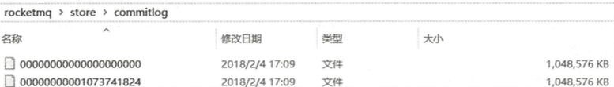
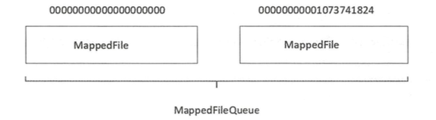

### 技术架构


RocketMQ架构上主要分为四部分，如上图所示：

- Producer：消息发布的角色，支持分布式集群方式部署。Producer通过MQ的负载均衡模块选择相应的Broker集群队列进行消息投递，投递的过程支持快速失败并且低延迟。
- Consumer：消息消费的角色，支持分布式集群方式部署。支持以push推，pull拉两种模式对消息进行消费。同时也支持集群方式和广播方式的消费，它提供实时消息订阅机制，可以满足大多数用户的需求。
- NameServer：NameServer是一个非常简单的Topic路由注册中心，其角色类似Dubbo中的zookeeper，支持Broker的动态注册与发现。主要包括两个功能：Broker管理，NameServer接受Broker集群的注册信息并且保存下来作为路由信息的基本数据。然后提供心跳检测机制，检查Broker是否还存活；路由信息管理，每个NameServer将保存关于Broker集群的整个路由信息和用于客户端查询的队列信息。然后Producer和Consumer通过NameServer就可以知道整个Broker集群的路由信息，从而进行消息的投递和消费。NameServer通常也是集群的方式部署，各实例间相互不进行信息通讯。Broker是向每一台NameServer注册自己的路由信息，所以每一个NameServer实例上面都保存一份完整的路由信息。当某个NameServer因某种原因下线了，Broker仍然可以向其它NameServer同步其路由信息，Producer和Consumer仍然可以动态感知Broker的路由的信息。
- BrokerServer：Broker主要负责消息的存储、投递和查询以及服务高可用保证，为了实现这些功能，Broker包含了以下几个重要子模块。
  1. Remoting Module：整个Broker的实体，负责处理来自Client端的请求。
  2. Client Manager：负责管理客户端(Producer/Consumer)和维护Consumer的Topic订阅信息。
  3. Store Service：提供方便简单的API接口处理消息存储到物理硬盘和查询功能。
  4. HA Service：高可用服务，提供Master Broker 和 Slave Broker之间的数据同步功能。
  5. Index Service：根据特定的Message key对投递到Broker的消息进行索引服务，以提供消息的快速查询。


### RocketMQ 网络部署特点


- NameServer是一个几乎无状态节点，可集群部署，节点之间无任何信息同步。
- Broker部署相对复杂，Broker分为Master与Slave，一个Master可以对应多个Slave，但是一个Slave只能对应一个Master，Master与Slave 的对应关系通过指定相同的BrokerName，不同的BrokerId 来定义，BrokerId为0表示Master，非0表示Slave。Master也可以部署多个。每个Broker与NameServer集群中的所有节点建立长连接，定时注册Topic信息到所有NameServer。 注意：当前RocketMQ版本在部署架构上支持一Master多Slave，但只有BrokerId=1的从服务器才会参与消息的读负载。
- Producer与NameServer集群中的其中一个节点（随机选择）建立长连接，定期从NameServer获取Topic路由信息，并向提供Topic 服务的Master建立长连接，且定时向Master发送心跳。Producer完全无状态，可集群部署。
- Consumer与NameServer集群中的其中一个节点（随机选择）建立长连接，定期从NameServer获取Topic路由信息，并向提供Topic服务的Master、Slave建立长连接，且定时向Master、Slave发送心跳。Consumer既可以从Master订阅消息，也可以从Slave订阅消息，消费者在向Master拉取消息时，Master服务器会根据拉取偏移量与最大偏移量的距离（判断是否读老消息，产生读I/O），以及从服务器是否可读等因素建议下一次是从Master还是Slave拉取。

结合部署架构图，描述集群工作流程：

- 启动NameServer，NameServer起来后监听端口，等待Broker、Producer、Consumer连上来，相当于一个路由控制中心。
- Broker启动，跟所有的NameServer保持长连接，定时发送心跳包。心跳包中包含当前Broker信息(IP+端口等)以及存储所有Topic信息。注册成功后，NameServer集群中就有Topic跟Broker的映射关系。
- 收发消息前，先创建Topic，创建Topic时需要指定该Topic要存储在哪些Broker上，也可以在发送消息时自动创建Topic。
- Producer发送消息，启动时先跟NameServer集群中的其中一台建立长连接，并从NameServer中获取当前发送的Topic存在哪些Broker上，轮询从队列列表中选择一个队列，然后与队列所在的Broker建立长连接从而向Broker发消息。
- Consumer跟Producer类似，跟其中一台NameServer建立长连接，获取当前订阅Topic存在哪些Broker上，然后直接跟Broker建立连接通道，开始消费消息。


### Producer发送消息

首先会查找查找topic的发布信息，然后找到一个消息队列MessageQueue，默认是轮询的选择，MessageQueue中存储着对应的brokerName，通过brokerName就能找到具体的brokerIP，随后获取producer客户端与这台broker的channel，随后就可以向这台broker发送消息了，注意消息只会被发送到主Broker中，即Master节点。

### Broker接收消息入口

brokerController在启动中会调用registerProcessor来注册消息处理器。其中消息发送类型的code都由SendMessageProcessor 来处理。当底层服务端收到消息时，会由NettyRemotingServer中定义的NettyServerHandler这个InboundHandler来处理。这个handler会调用NettyRemotingAbstract中的processMessageReceived逻辑，根据消息是请求还是响应区分处理。

如果是请求，则会根据调用请求code找负责处理该code的消息处理器，并由抽象父类NettyRemotingAbstract的buildProcessRequestHandler方法 封装成一个处理请求的Runnable任务提交到消息处理器绑定的线程池中异步执行。这个封装过程其实也是一个模版方法，还包含处理前后的hook调用。

SendMessageProcessor 实现了NettyRequestProcessor接口，其中有两个方法processRequest 和 rejectRequest。这两个方法都会在NettyRemotingAbstract 中被调用。在processRequest中会去解析V2类型消息的压缩请求头，还会构建出发送消息上下文sendMessageContext，并根据单条还是批量有不同的处理逻辑。发送消息真正的刷盘保存处理就在sendBatchMessage和sendMessage 中。

客户端会把消息封装为 RemotingCommand ，其中包含了code表示消息的类型，还有具体的消息体，其中如果是V2类型的消息还会对消息头进行压缩。

### SendMessageProcessor处理消息

**SendMessageProcessor#sendMessage**

首先会进行 org.apache.rocketmq.broker.processor.SendMessageProcessor#preSend，该方法会检查topic是否存在，如果没有的话会自动创建topic。

> 线上不建议开启自动创建topic，第一个发现topic不存在的broker会在自己的节点上创建topic并同步nameServer，由于producer会定时30s从nameServer更新路由数据，其他的producer也向该topic投递消息的时候，发现topic的路由存在这个一个broker中，那么所有的消息都会发到这一个broker节点上，其他的broker节点没有机会创建自己节点上的topic，这样broker集群就不能实现压力的均摊。

根据传入的RemotingCommand请求去构建要保存着要存入commitLog的数据MessageExtBrokerInner对象，同时 还会处理重试和死信队列消息，将会对死信消息替换为死信topic，根据是否是事务消息和是否是异步写入做了区分处理

具体的写入commitLog 是由 putMessage  完成的。

```java
//if broker 异步写入
//		if (发送的是事务准备消息 sendTransactionPrepareMessage)
//				future=this.brokerController.getTransactionalMessageService().asyncPrepareMessage(msgInner);
//		else	
//				future=this.brokerController.getMessageStore().asyncPutMessage(msgInner);
//   异步处理消息存放的结果
//   future.thenAcceptAsync(putMessageResult->{
//			handlePutMessageResult(putMessageResult,...);
 //})
//else  broker 同步写入
//		if (发送的是事务准备消息 sendTransactionPrepareMessage)
//				result=this.brokerController.getTransactionalMessageService().prepareMessage(msgInner);
//		else	
//				result=this.brokerController.getMessageStore().putMessage(msgInner);
//    同步处理消息存放的结果
//    handlePutMessageResult(result,..);
```

### DefaultMessageStore#asyncPutMessage 保存消息

通过putMessageHookList来完成前置的校验逻辑。例如：

- 如果DefaultMessageStore是shutdown状态，返回SERVICE_NOT_AVAILABLE。
- 如果broker是SLAVE角色，则返回SERVICE_NOT_AVAILABLE，不能将消息写入SLAVE角色。
- 如果不支持写入，那么返回SERVICE_NOT_AVAILABLE，可能因为broker的磁盘已满、写入逻辑队列错误、写入索引文件错误等等原因。
- 如果操作系统页缓存繁忙，则返回OS_PAGECACHE_BUSY，如果broker持有锁的时间超过osPageCacheBusyTimeOutMills，则算作操作系统页缓存繁忙。

CommitLog#asyncPutMessages 完成真正的消息保存，大概步骤如下：

> CommitLog 是RocketMQ 最核心的数据存储，它是一个顺序写的文件，用于存储 Producer 发送的消息和 Consumer 消费的消息，也就是全部通过消息中间件传递的消息。每一个写入 commitLog 的消息都会被分配一个唯一的 offset （偏移量），用于标识该条消息在 commitLog 中的位置。 commitLog 中消息的存储格式包括消息长度、消息属性（如是否压缩、是否顺序消费、是否是事务消息等）、消息体等信息。DLedgerCommitLog 是 RocketMQ 用作持久化存储的一种实现方式，它基于Apache DistributedLog (DLedger) 实现了高可靠、高性能的分布式日志存储，也正是它，使得 CommitLog 拥有了选举复制的能力。

1.根据topic_队列取模32加分段锁。

```java
topicQueueLock.lock(topicQueueKey);// MY_TOPIC-3
```

2.消息编码，放入直接缓冲区中。

```java
//获取当前线程本地变量中的putMessage工具，将消息进行编码，存放在encoder中的byteBuf中
PutMessageResult encodeResult = putMessageThreadLocal.getEncoder().encode(msg);
```

3.加锁并写入消息到commitLog中。

- 一个broker将所有的消息都追加到同一个逻辑CommitLog日志文件中，因此需要通过获取putMessageLock锁来控制并发。有两种锁，一种是ReentrantLock可重入锁，另一种spin则是CAS锁。根据StoreConfig的useReentrantLockWhenPutMessage决定是否使用可重入锁，默认为true，使用可重入锁。
- 从mappedFileQueue中的mappedFiles集合中获取最后一个MappedFile。如果最新mappedFile为null，或者mappedFile满了，那么会新建mappedFile。
- 通过mappedFile调用appendMessage方法追加消息，这里仅仅是追加消息到byteBuffer的内存中。如果是writeBuffer则表示消息写入了堆外内存中，如果是mappedByteBuffer，则表示消息写入了page chache中。总之，都是存储在内存之中。writeBuffer是RocketMQ的内存映射增强方案，mappedByteBuffer是Java提供的原生内存映射(mmap)
- 追加成功之后解锁。如果是剩余空间不足，则会重新初始化一个MappedFile并再次尝试追加。

4.如果存在写满的MappedFile并且启用了文件内存预热，那么这里调用unlockMappedFile对MappedFile执行解锁。

5.更新消息统计信息。随后调用submitFlushRequest方法提交刷盘请求，将会根据刷盘策略进行刷盘。随后调用submitReplicaRequest方法提交副本请求，用于主从同步。


至此，我们已经知道了RocketMQ根据配置的不同，可能会使用来自TransientStorePool的writeBuffer或者MappedByteBuffer来存储数据，接下来，我们就来看一看存储数据的过程是如何实现的。

MappedFile提交实际上是将writeBuffer中的数据，传入FileChannel，所以只有在transientStorePoolEnable为true时才有实际作用：„


### **二、特殊场景下的写入行为**

#### **1. 主从自动切换（DLedger 模式）**

若 Broker 集群启用了 **DLedger 模式**（基于 Raft 协议的高可用方案）：

- **写入目标**：Producer 仍然只向当前的 Leader（即逻辑上的 Master）写入。
- **故障转移**：当 Leader 宕机时，DLedger 集群会选举新的 Leader（原 Slave 晋升为 Master），Producer 自动重试将消息发送到新 Leader。

#### **2. 读写分离模式（不推荐）**

在非 DLedger 的普通主从模式下，**Slave Broker 不参与写操作**，但可通过以下配置实现 **读负载均衡**：

```
// Consumer 可从 Slave 读取消息（默认不启用）
consumer.setUnitMode(true); // 允许从 Slave 读取
```

但 **Producer 的写入仍仅指向 Master**。


#### **1. 同步双写（同步复制模式）**

- **配置**：在 Broker 中设置 `brokerRole=SYNC_MASTER`。
- **行为**：Master 将消息写入本地后，**同步等待 Slave 写入成功**，再返回 Producer 发送成功的 ACK。
- **优点**：确保主从数据强一致，避免 Master 宕机导致数据丢失。
- **缺点**：增加写入延迟，降低吞吐量。

#### **2. 异步复制（默认模式）**

- **配置**：`brokerRole=ASYNC_MASTER`。
- **行为**：Master 写入成功后立即返回 ACK，异步复制到 Slave。
- **优点**：低延迟、高吞吐。
- **缺点**：极端情况下（Master 宕机且数据未同步到 Slave）可能丢失数据。


- 主要是记录消息的偏移量，有多个消费者进行消费
- 集群模式下采用 RemoteBrokerOffsetStore，broker 控制 offset 的值
- 广播模式下采用 LocalFileOffsetStore，消费端存储

- 本地文件类型
  - DefaultMQPushConsumer 的 BROADCASTING 广播模式，各个 Consumer 没有互相干扰，使用 LocalFileOffsetStore，把 Offset 存储在本地
- Broker 代存储类型
  - DefaultMQPushConsumer 的 CLUSTERING 集群模式，由 Broker 端存储和控制 Offset 的值，使用 RemoteBrokerOffsetStore


#### **CommitLog**

- **定义**
  CommitLog是RocketMQ的底层存储文件，所有消息都会以追加的方式写入CommitLog中。
  - CommitLog是一个物理文件，按顺序存储所有的消息数据。
  - 每条消息在CommitLog中都有一个全局唯一的偏移量（Offset），用于标识消息的位置。
- **作用**
  - CommitLog是RocketMQ的核心存储结构，负责持久化所有消息。
  - 生产者发送的消息首先会被写入CommitLog，然后通过异步线程将消息分发到对应的消费队列中。

------

####  **消费队列（ConsumeQueue）**

- **定义**
  消费队列是基于CommitLog构建的逻辑队列，用于加速消息的消费。
  - 每个Topic的每个队列（Message Queue）对应一个消费队列。
  - 消费队列中存储的是指向CommitLog中消息的索引信息（包括消息的物理偏移量、消息大小等）。
- **作用**
  - 消费队列是Consumer读取消息的直接来源，Consumer通过消费队列快速定位到CommitLog中的消息。
  - 消费队列的存在避免了直接扫描CommitLog带来的性能开销。
- **与读队列的关系**
  - **消费队列就是读队列的底层实现**。
  - Consumer从读队列中读取消息时，实际上是通过消费队列获取消息的索引信息，再从CommitLog中读取具体的消息内容。

MessageQueue 也是写队列，每个分区对应一个写队列。


#### MappedFileQueue

RocketMQ中在存储方面有很多思路值得我们学习，比如通过使用内存映射文件来提高IO访问性能，无论是CommitLog、 ConsumeQueue还是IndexFile，单个文件都被设计为固定长度，如果一个文件写满以后再创建一个新文件，文件名就为该文件第一条消息对应的全局物理偏移量。例如CommitLog的[文件组织方式](https://zhida.zhihu.com/search?content_id=168332024&content_type=Article&match_order=1&q=文件组织方式&zhida_source=entity)如下图所示。



RocketMQ使用 MappedFile、 MappedFileQueue来封装存储文件。以commitLog为例，其中MappedFileQueue 封装的是commitLog所在的目录，里边维护了MappedFile才是对于commitLog真正的映射。



MappedFile 中其实包含了两种实现，一种是Java提供原生的MappedByteBuffer内存映射方案，另外一种是RocketMQ的内存映射增强方案，增强方案中会对MappedByteBuffer再进行一次封装。根据 transientStorePoolEnable这个配置决定是否要开启。

```java
public class DefaultMappedFile extends AbstractMappedFile {
  ...
// 堆外内存ByteBuffer，如果不为空，数据首先将存储在该Buffer中，然后提交到MappedFile对应的内存映射文件Buffer。transientStorePoolEnable为true时不为空。
    protected ByteBuffer writeBuffer = null;
    // 堆外内存池，transientStorePoolEnable为true时启用。
    protected TransientStorePool transientStorePool = null;
		...
    // 物理文件对应的内存映射Buffer，真正使用的是其子类 DirectByteBuffer
    protected MappedByteBuffer mappedByteBuffer;
}
...
public AppendMessageResult appendMessagesInner(final MessageExt messageExt, final AppendMessageCallback cb) {
  ...
   //在真正追加消息写入的时候，优先会使用writeBuffer，也就是内存映射增强的方式
   ByteBuffer byteBuffer = writeBuffer != null ? writeBuffer.slice() : this.mappedByteBuffer.slice();
  ....
}

```

这里简单补充一下内存映射的相关知识，它和传统的read/write有什么区别。