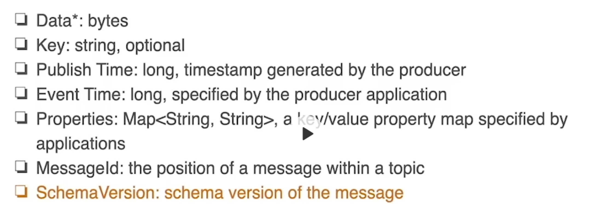
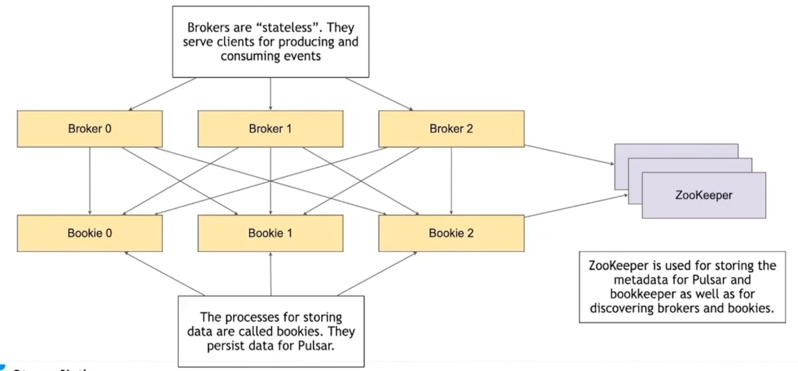
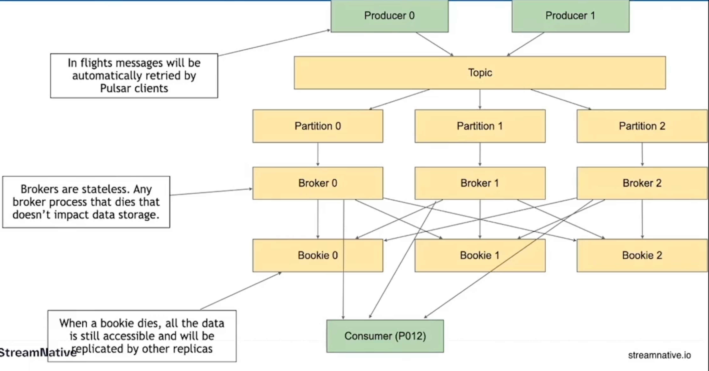
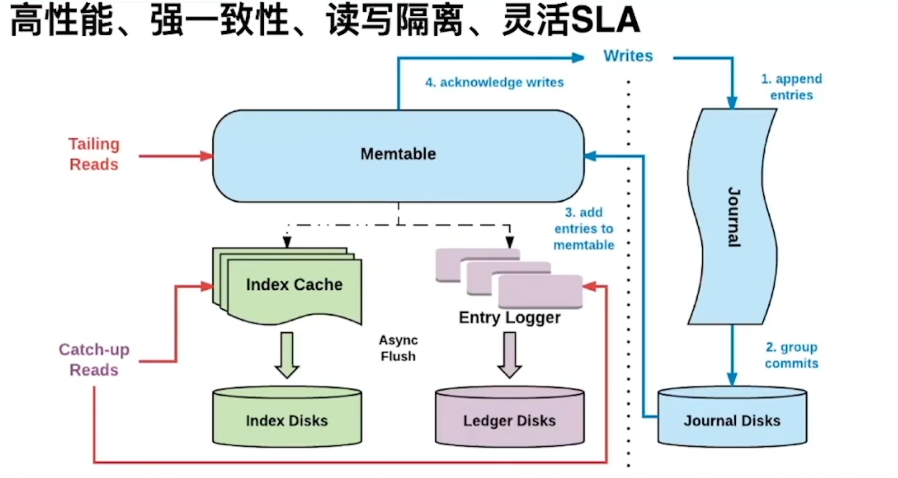
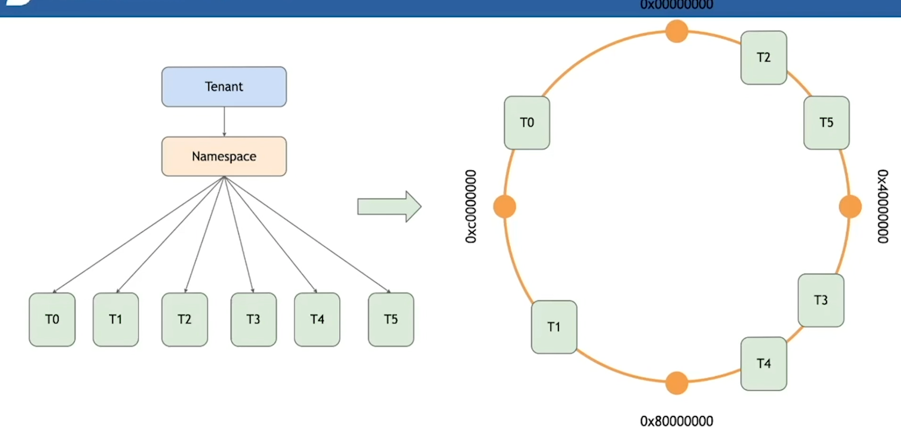
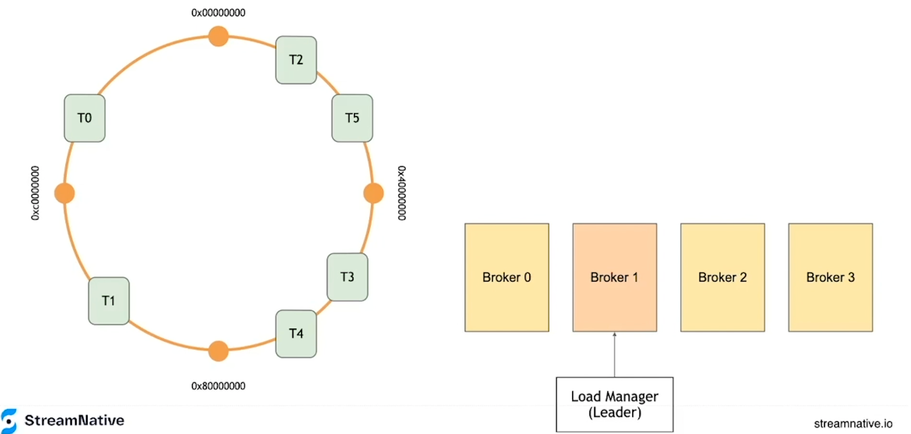
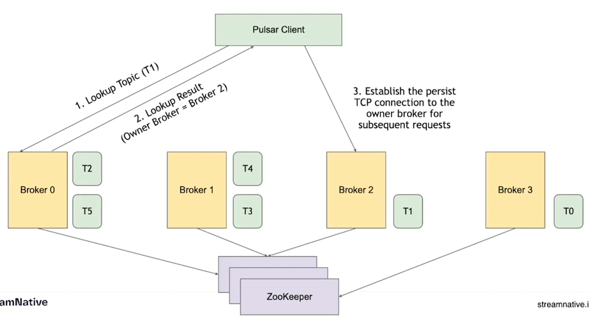

#  Plusar

## Plusar 的优势

- 存储和计算分离
- 节点对等
- 独立扩展
- 灵活扩容
- 快速容错

## 架构图

## Producers

**producer**  是消息的源头，是发送消息的地方。

## Topics

**producer** 会把消息发送到 **topic** 中，**topic** 是一个逻辑单元。

具体的数据会被分发到不同的 **partition** 中，**partition** 既是逻辑分区也是物理分区。

**partition** 是真正数据要落地的地方，但实际是落地 **bookie** 中。这里的 **partition** 和 ES 中的分片很类似，分片的数量是会影响后期扩容的。同时还会影响你的消息写的有多快，消费的有多快，以及并发度。

## Brokers

**broker** 是真正做消息服务的地方，是无状态的，为 **producer** 提供存储能力，也可以对发送消息的客户端进行限流，同时也为 **consumer** 提供消费能力。

下图是一个 **partition** 对应一个 **broker**，实际上，我们往往一个 **partition** 对应多个 **broker**，

## Subscription

下图中可以看到 **broker** 对 **consumer** 提供的消息消费能力，具体的逻辑是一个 **consumer** 绑定一个 **subScription**，这个订阅（**subscription**）或者说这个消费组会绑定一个主题（**topic**）的所有分区（**partition**），并和分片下的 **Broker** 建立连接，这些 **broker** 共同维护操作这个订阅。当然我们可以建立多个订阅消费组来消费同一条消息，这个类似于kafka 的多播。

## Subscription Mode

订阅/消费组 的消费模型

### failover 模型

故障转移订阅(Failover sub streaming):使用故障转移订阅，多个使用者可以附加到同一订阅。 但是，对于给定的主题分区，将选择一个使用者作为该主题分区的主使用者，其他消费者将被指定为故障转移消费者，当主消费者断开连接时，分区将被重新分配给其中一个故障转移消费者，而新分配的消费者将成为新的主消费者。 发生这种情况时，所有未确认的消息都将传递给新的主消费者，这类似于Apache Kafka中的使用者分区重新平衡。 图2显示了故障转移订阅，消费者B-0和B-1通过订阅B订阅消费消息.B-0是主消费者并接收所有消息，B-1是故障转移消费者，如果消费者B-0出现故障，将接管消费。

### shared 模型

保证并发度，可以开多个消费方来加速消息的消费。

共享订阅(队列)：使用共享订阅，可以将所需数量的消费者附加到同一订阅。消息以多个消费者的循环尝试分发形式传递，并且任何给定的消息仅传递给一个消费者。当消费者断开连接时，所有传递给它并且未被确认的消息将被重新安排，以便发送给该订阅上剩余的剩余消费者。图3说明了共享订阅。消费者C-1，C-2和C-3都在同一主题分区上消费消息。每个消费者接收大约1/3的消息。如果您想提高消费率，您可以在不增加分区数量的情况下为更多的消费者提供相同的订阅（尽可能多的消费者）。

### key_shared 模型

在保证并发的同时保证有序性，确保key不会被重复消费。

独占和故障转移订阅仅允许每个订阅每个主题分区仅有一个消费者。它们按分区顺序使用消息。它们最适用于需要严格排序的流用例。另一方面，共享订阅允许每个主题分区有多个消费者，同一订阅中的每个消费者仅接收发布到主题分区的一部分消息。共享订阅最适用于不需要排序的并且可以扩展超出分区数量的使用者数量的队列用例。

Pulsar中的subscription(订阅)实际上与Apache Kafka中的消费者群体相同。创建订阅具有高度可扩展性且非常低廉的。可以根据需要创建任意数量的订阅，对同一主题的不同订阅不必具有相同的订阅类型。这意味着可以在同一主题上有10个消费者的故障转移订阅或有20个消费者的共享订阅。如果共享订阅处理事件的速度很慢，则可以在不更改分区数的情况下向共享订阅添加更多消费者。图4描绘了一个包含3个订阅A，B和C的主题，并说明了消息如何从生产者流向消费者。

除了统一消息传递API之外，由于Pulsar主题分区实际上是存储在Apache BookKeeper中的分布式日志，它还提供了一个读取器(reader) API（类似于消费者(consumer) API但没有游标管理），以便用户完全控制如何使用消息本身

## 消息确认(Message Ackmowledgment)

当使用跨机器分布的消息传递系统时，可能会发生故障。在消费者从消息传递系统中的主题消费消息的情况下，消费消息的消费者和服务于主题分区的消息代理都可能失败。当发生这样的故障时，能够从消费者停止的地方恢复消费，这样既不会错过消息，也不必处理已经确认的消息。在Apache Kafka中，恢复点通常称为偏移，更新恢复点的过程称为消息确认或提交偏移。在Apache Pulsar中，游标(cursors)用于跟踪每个订阅(subscription)的消息确认(message acknowledgment)。每当消费者在主题分区上确认消息时，游标都会更新，更新游标可确保消费者不会再次收到消息，但是游标并不像Apache Kafka那样简单。Apache Pulsar有两种方法可以确认消息，个体确认ack或累积确认消息。通过累积确认，消费者只需要确认它收到的最后一条消息，主题分区中的所有消息（包括）提供消息ID将被标记为已确认，并且不会再次传递给消费者，累积确认与Apache Kafka中的偏移更新实际上相同。Apache Pulsar的区别特征是能够个体单独进行ack，也就是选择性acking。消费者可以单体确认消息。Acked消息将不会被重新传递。图5说明了ack个体和ack累积之间的差异（灰色框中的消息被确认并且不会被重新传递）。在图的顶部，它显示了ack累积的一个例子，M12之前的消息被标记为acked。在图的底部，它显示了单独进行acking的示例。仅确认消息M7和M12 - 在消费者失败的情况下，除了M7和M12之外，将重新传送所有消息。

独占(exclusive)或故障转移(failover)订阅的消费者能够单个或累积地发送消息(ack message);而共享订阅中的消费者只允许单独发送消息(ack messages)。单独确认消息的能力为处理消费者故障提供了更好的体验。对于某些应用来说，处理那些已经确认过的消息可能是非常耗时的，防止重新传送已经确认的消息是非常重要。

## Topic 和 Partition

**Segment** 分片是单调递增的，**plusar** 的 **broker** 会把一段时间内的消息存放到一个分片上，比如最少10分钟，最大100分钟。分片大小为1G，假设数据量比较大，5分钟的数据量就达到1G，10分钟达到了2G，**broker** 还是会把这个2G作为一个分片来存储的。

**Entry** 是存储消息的实体，有着唯一键，Plusar作为MQ时，每个 **Entry** 实体都只有一个 **Msg** 包，如果是 **Stream** 的场景，消息产生的特别快，可能需要一个批量操作，客户端会把一批消息打成一个包传给 **broker**，然后 **broker** 调用 **bookkeeper** 将消息存储为一个 **Entry**。

分片在创建的时候会根据存储节点（Bookie）的情况来进行资源的平衡，它的灵活扩容也是基于此的。

BookKeeper 是以 appendOnly  的模式来写 分片的。

## Msg

Key 和 分区的路由有关。

MessageId 是标记消息在 topic 中的位置

### MessageId 的组成

ledger 是在 Bookkeeper 中的概念，在 plusar 中对应 Segment。

## Cursor

 游标 和消费者的消费顺序相关。

### Acknowledge Cumulatively

Ack 的过程，其实就是移动光标的操作。

### Reet Cursor

## Tenant & Namespace

- persistent 是持久化的，会刷到bookkeeper中，这个过程是实时刷盘的，所以磁盘IO性能对消息也会有影响。 
- non-persistent 是只在内存中。

示例：

## Zookeeper

## Write Path

上图中 Broker 可以根据备份策略来决定要同备份几份，备份的过程是对Bookie进行并发写的过程，还可以根据业务场景中对数据一致性要求，来设置策略是等待全部写成功再返回，还是只要有一个写成功就返回，在延迟和一致性上做怎样的一个权衡。

## Read Path 

Consumer 会先通过订阅的topic 找到对应的 Broker，由 Broker 来提供服务。

Consumer 读取的数据会优先从 Broker 的缓存里取，取不到的时候才会去调用 Bookie的客户端去磁盘上找。

Consumer 处理完消息后 进行 ack，Broker 收到 ack 会更新一下 Cursor。

## FailureHandling

- producer 在发送失败时，客户端内部有缓存，会进行重试。
- broker 出错时，由于broker 不存储数据，只保留了部分缓存来提供服务，所以 broker 宕机时，producer 会去寻找其他可用的 broker进行连接，如果新 broker 没有 consumer 要的数据的时候，broker 会去 bookie里进行加载。
- bookie 出错时，因为 bookie 是有备份的，可以从其他备份的 bookie 中返回。

## Broker 和 Bookie

## Bookkeeper 稳定的IO质量

## Namespce Bundles

命名空间下会分为多个Bundles，在做load balance 方便topic的迁移，迁移整个Namespce太大，一个一个搬topic又太小，所以暴露出了 Bundles，会根据topic名称的hash值来计算落在哪个bundles。

## Load Manager

Leader broker 会去收集其他 broker 机器的繁忙程度，比如cpu 内存 利用率、网络带宽、延时等等。

选举过程是去zk是抢节点，谁拿到谁就是leader。

## Load Manager Assign bundles to brokers

如果broker0 宕机，Leader 会对 broker0 所在的区域进行再hash，然后根据当前可用的 broker的机器情况，重新分配 Broker0 上的topic。

## Topic Lockup

##  Broker Proxy

## Topic Lockup with Proxies

