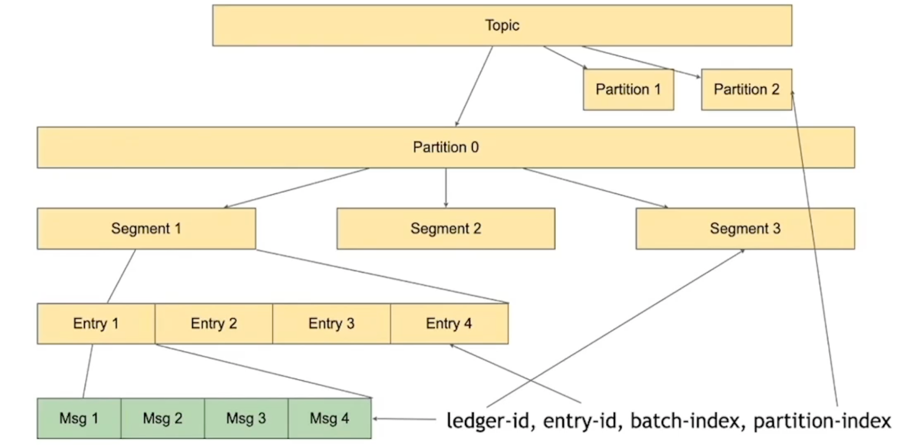

#  Plusar


## Plusar 的优势

- 存储和计算分离
- 节点对等
- 独立扩展
- 灵活扩容
- 快速容错

## 架构图


## Producers

**producer**  是消息的源头，是发送消息的地方。


## Topics

**producer** 会把消息发送到 **topic** 中，**topic** 是一个逻辑单元。

具体的数据会被分发到不同的 **partition** 中，**partition** 既是逻辑分区也是物理分区。

**partition** 是真正数据要落地的地方，但实际是落地 **bookie** 中。这里的 **partition** 和 ES 中的分片很类似，分片的数量是会影响后期扩容的。同时还会影响你的消息写的有多快，消费的有多快，以及并发度。


## Brokers

**broker** 是真正做消息服务的地方，是无状态的，为 **producer** 提供存储能力，也可以对发送消息的客户端进行限流，同时也为 **consumer** 提供消费能力。

下图是一个 **partition** 对应一个 **broker**，实际上，我们往往一个 **partition** 对应多个 **broker**，


## Subscription

下图中可以看到 **broker** 对 **consumer** 提供的消息消费能力，具体的逻辑是一个 **consumer** 绑定一个 **subScription**，这个订阅（**subscription**）或者说这个消费组会绑定一个主题（**topic**）的所有分区（**partition**），并和分片下的 **Broker** 建立连接，这些 **broker** 共同维护操作这个订阅。当然我们可以建立多个订阅消费组来消费同一条消息，这个类似于kafka 的多播。


## Subscription Mode

订阅/消费组 的消费模型


### exclusive 模型

独占模型 独占当前订阅（消费组）的消息，如果是分区主题，则第一个消费者订阅所有的分区主题，其他消费者不会被分配分区，只会收到错误。

### failover 模型

Multiple consumers can attach to the same subscription, yet only the first consumer is active, and others are standby. When the active consumer is disconnected, messages will be dispatched to one of standby consumers, and the standby consumer then becomes active consumer.

一个消费组/订阅组的订阅模型设置为Failover 故障转移，则第一个连接的是consumer是活跃的，后边连接的是备用，当活跃的consumer断开的时候，会将备用的consumer中找一个设置为活跃状态。

如果是分区主题，则每个分区只有一个活跃消费者， 一个分区的消息只分发给一个消费者，多个分区的消息分发给多个消费者。

```java
consumer = client.newConsumer()
                        .topic("my-topic")
                        .subscriptionName("my-subscription")
                        .subscriptionType(SubscriptionType.Failover)
                        .subscribe();
```


### shared 模型

一个订阅组内可以有多个consumer轮询去消费一个partation分区中的消息。保证并发度但不能保证有序。


### key_shared 模型

在保证并发的同时保证有序性，确保key不会被重复消费。

```java
        producer.newMessage().key("key-1").value("message-1-1").send();
        producer.newMessage().key("key-1").value("message-1-2").send();
        producer.newMessage().key("key-1").value("message-1-3").send();
        producer.newMessage().key("key-2").value("message-2-1").send();
        producer.newMessage().key("key-2").value("message-2-2").send();
```

根据在发送时指定的key，可以确保相同的key会被有序的发送到同一个consumer中


除了统一消息传递API之外，由于Pulsar主题分区实际上是存储在Apache BookKeeper中的分布式日志，它还提供了一个读取器(reader) API（类似于消费者(consumer) API但没有游标管理），以便用户完全控制如何使用消息本身

## 消息确认(Message Ackmowledgment)

当使用跨机器分布的消息传递系统时，可能会发生故障。在消费者从消息传递系统中的主题消费消息的情况下，消费消息的消费者和服务于主题分区的消息代理都可能失败。当发生这样的故障时，能够从消费者停止的地方恢复消费，这样既不会错过消息，也不必处理已经确认的消息。在Apache Kafka中，恢复点通常称为偏移，更新恢复点的过程称为消息确认或提交偏移。在Apache Pulsar中，游标(cursors)用于跟踪每个订阅(subscription)的消息确认(message acknowledgment)。每当消费者在主题分区上确认消息时，游标都会更新，更新游标可确保消费者不会再次收到消息，但是游标并不像Apache Kafka那样简单。Apache Pulsar有两种方法可以确认消息，个体确认ack或累积确认消息。通过累积确认，消费者只需要确认它收到的最后一条消息，主题分区中的所有消息（包括）提供消息ID将被标记为已确认，并且不会再次传递给消费者，累积确认与Apache Kafka中的偏移更新实际上相同。Apache Pulsar的区别特征是能够个体单独进行ack，也就是选择性acking。消费者可以单体确认消息。Acked消息将不会被重新传递。图5说明了ack个体和ack累积之间的差异（灰色框中的消息被确认并且不会被重新传递）。在图的顶部，它显示了ack累积的一个例子，M12之前的消息被标记为acked。在图的底部，它显示了单独进行acking的示例。仅确认消息M7和M12 - 在消费者失败的情况下，除了M7和M12之外，将重新传送所有消息。


独占(exclusive)或故障转移(failover)订阅的消费者能够单个或累积地发送消息(ack message);而共享订阅中的消费者只允许单独发送消息(ack messages)。单独确认消息的能力为处理消费者故障提供了更好的体验。对于某些应用来说，处理那些已经确认过的消息可能是非常耗时的，防止重新传送已经确认的消息是非常重要。

## Topic 和 Partition


**Segment** 分片是单调递增的，**plusar** 的 **broker** 会把一段时间内的消息存放到一个分片上，比如最少10分钟，最大100分钟。分片大小为1G，假设数据量比较大，5分钟的数据量就达到1G，10分钟达到了2G，**broker** 还是会把这个2G作为一个分片来存储的。

**Entry** 是存储消息的实体，有着唯一键，Plusar作为MQ时，每个 **Entry** 实体都只有一个 **Msg** 包，如果是 **Stream** 的场景，消息产生的特别快，可能需要一个批量操作，客户端会把一批消息打成一个包传给 **broker**，然后 **broker** 调用 **bookkeeper** 将消息存储为一个 **Entry**。

分片在创建的时候会根据存储节点（Bookie）的情况来进行资源的平衡，它的灵活扩容也是基于此的。

BookKeeper 是以 appendOnly  的模式来写 分片的。

## Msg

Key 和 分区的路由有关。

MessageId 是标记消息在 topic 中的位置


### MessageId 的组成

ledger 是在 Bookkeeper 中的概念，在 plusar 中对应 Segment。



## Cursor

 游标 和消费者的消费顺序相关。


### Acknowledge Cumulatively

Ack 的过程，其实就是移动光标的操作。


### Reet Cursor


