## Tenant & Namespace

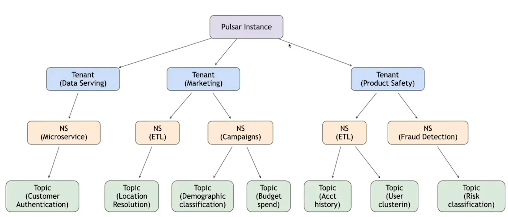

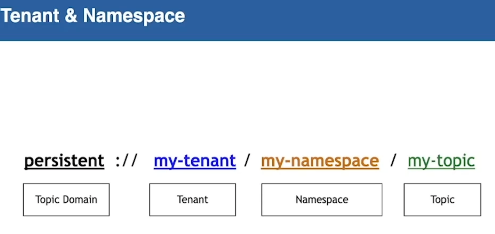

- persistent 是持久化的，会刷到bookkeeper中，这个过程是实时刷盘的，所以磁盘IO性能对消息也会有影响。 
- non-persistent 是只在内存中。

示例：

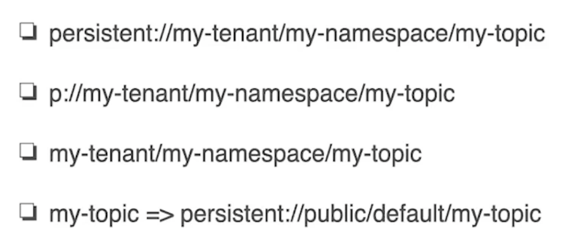

## Zookeeper

## Write Path

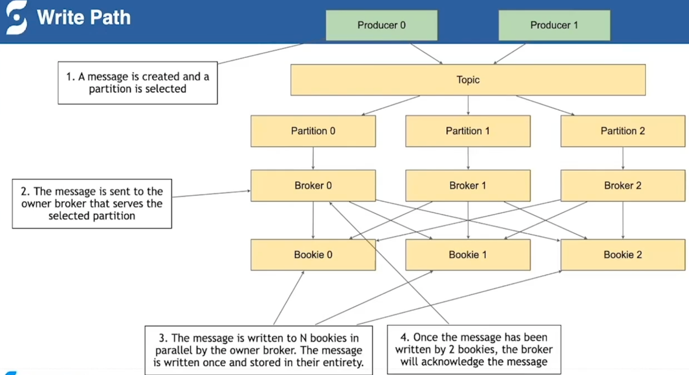

上图中 Broker 可以根据备份策略来决定要同备份几份，备份的过程是对Bookie进行并发写的过程，还可以根据业务场景中对数据一致性要求，来设置策略是等待全部写成功再返回，还是只要有一个写成功就返回，在延迟和一致性上做怎样的一个权衡。

## Read Path 

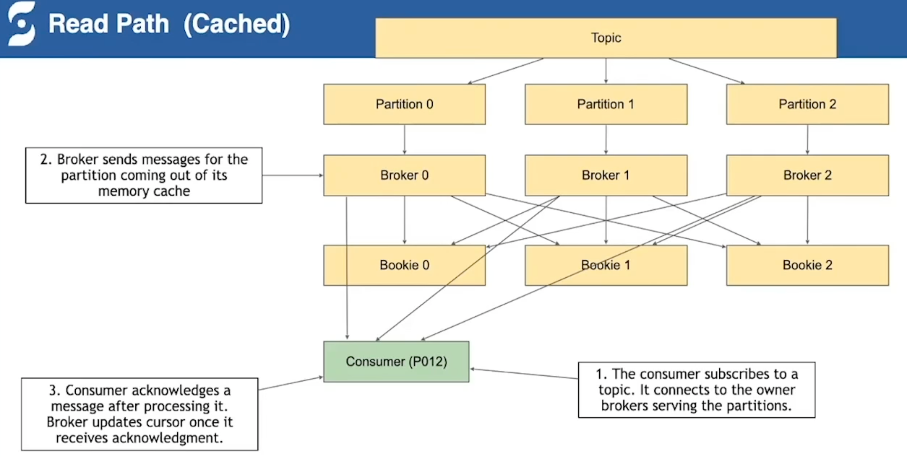

Consumer 会先通过订阅的topic 找到对应的 Broker，由 Broker 来提供服务。

Consumer 读取的数据会优先从 Broker 的缓存里取，取不到的时候才会去调用 Bookie的客户端去磁盘上找。

Consumer 处理完消息后 进行 ack，Broker 收到 ack 会更新一下 Cursor。

## FailureHandling

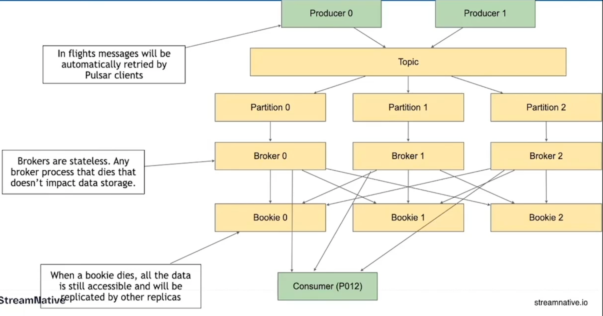

- producer 在发送失败时，客户端内部有缓存，会进行重试。
- broker 出错时，由于broker 不存储数据，只保留了部分缓存来提供服务，所以 broker 宕机时，producer 会去寻找其他可用的 broker进行连接，如果新 broker 没有 consumer 要的数据的时候，broker 会去 bookie里进行加载。
- bookie 出错时，因为 bookie 是有备份的，可以从其他备份的 bookie 中返回。

## Broker 和 Bookie

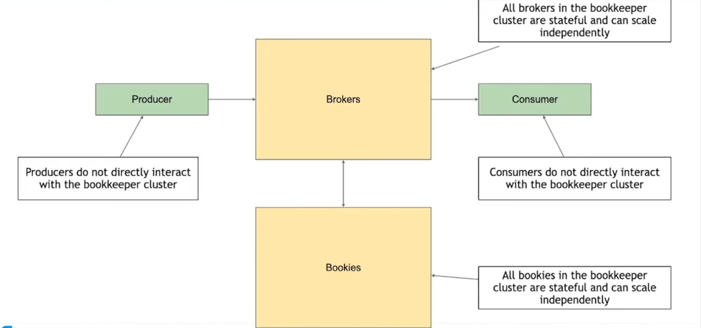

## Bookkeeper 稳定的IO质量

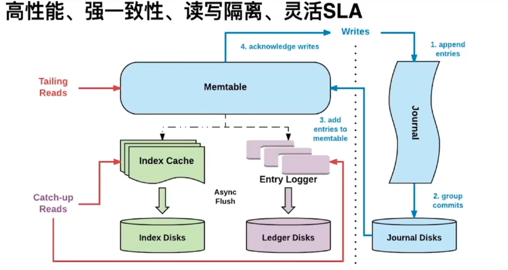

## Namespce Bundles

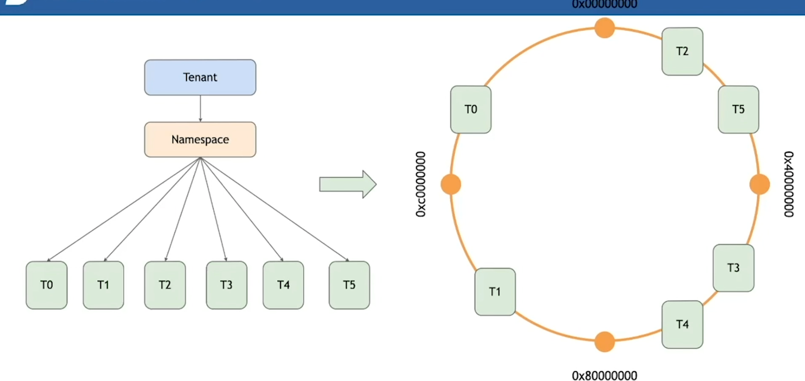

命名空间下会分为多个Bundles，在做load balance 方便topic的迁移，迁移整个Namespce太大，一个一个搬topic又太小，所以暴露出了 Bundles，会根据topic名称的hash值来计算落在哪个bundles。

## Load Manager

Leader broker 会去收集其他 broker 机器的繁忙程度，比如cpu 内存 利用率、网络带宽、延时等等。

选举过程是去zk是抢节点，谁拿到谁就是leader。

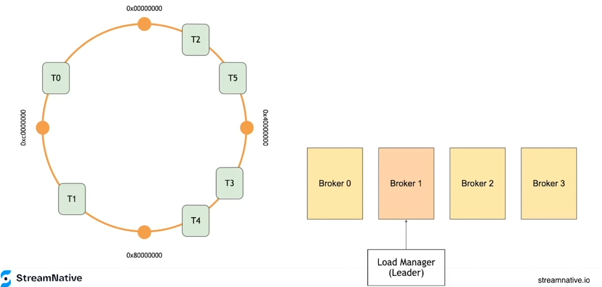

## Load Manager Assign bundles to brokers

如果broker0 宕机，Leader 会对 broker0 所在的区域进行再hash，然后根据当前可用的 broker的机器情况，重新分配 Broker0 上的topic。

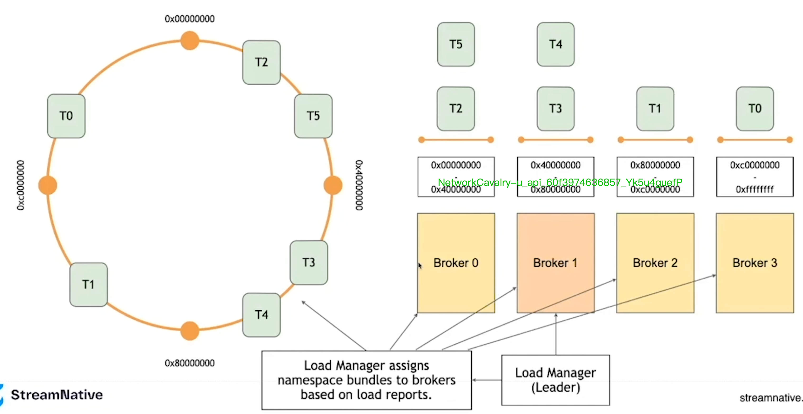

## Topic Lockup

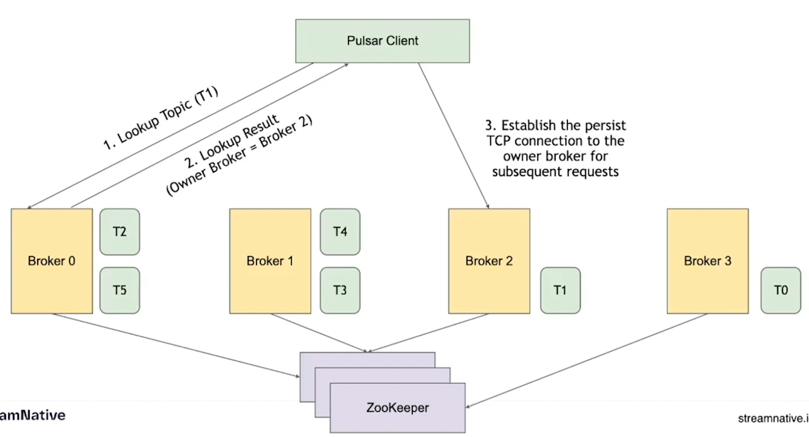

##  Broker Proxy

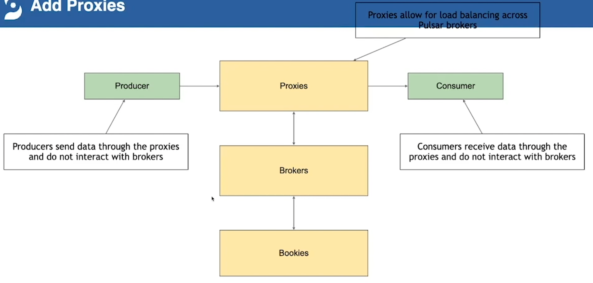

## Topic Lockup with Proxies

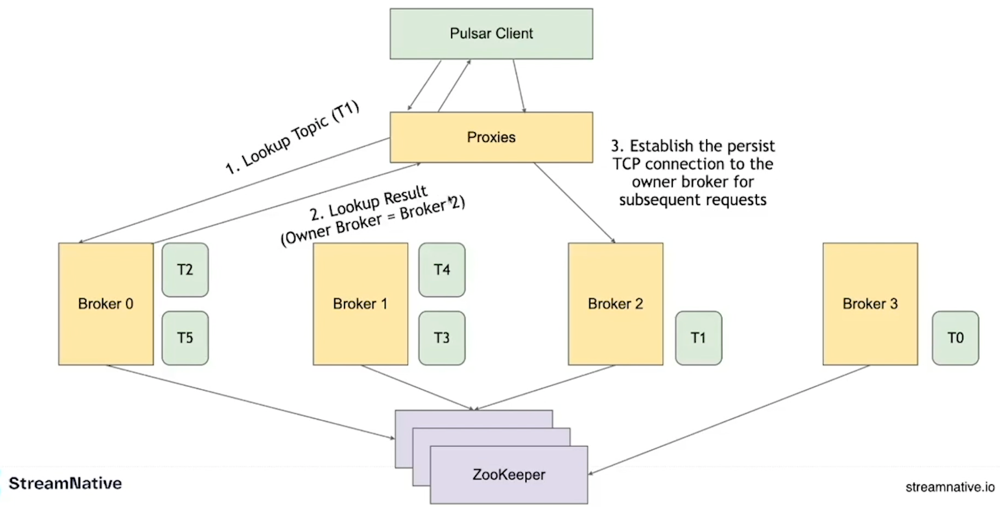