## Cluster & Geo-Replication

跨地域复制

初始化pulsar时需要指定的信息

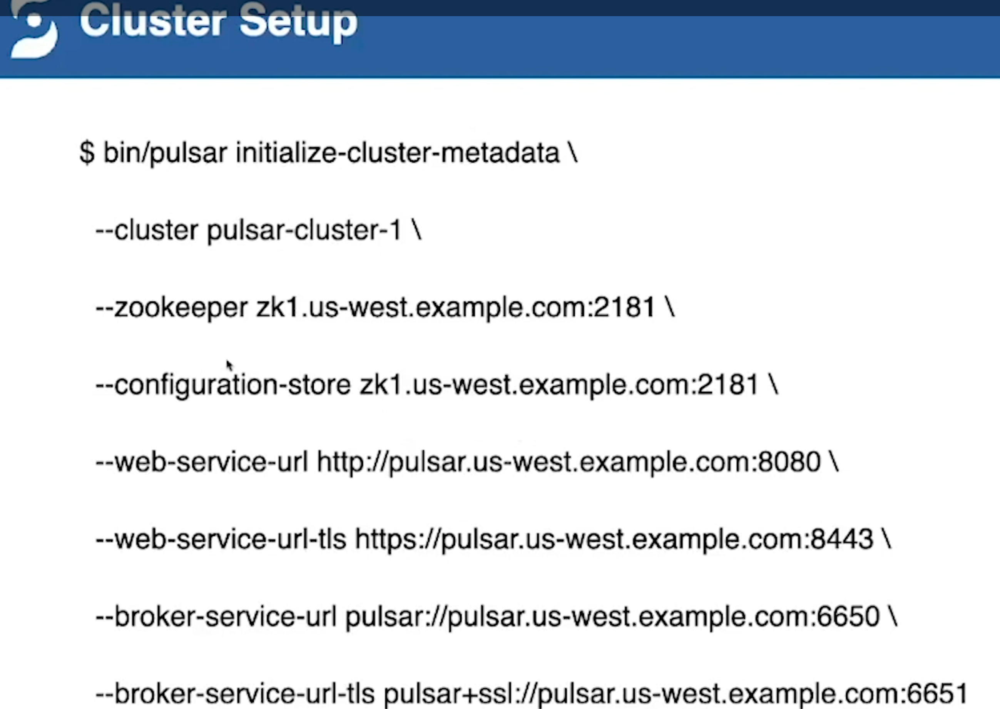

ZK是跨机房的zk集群

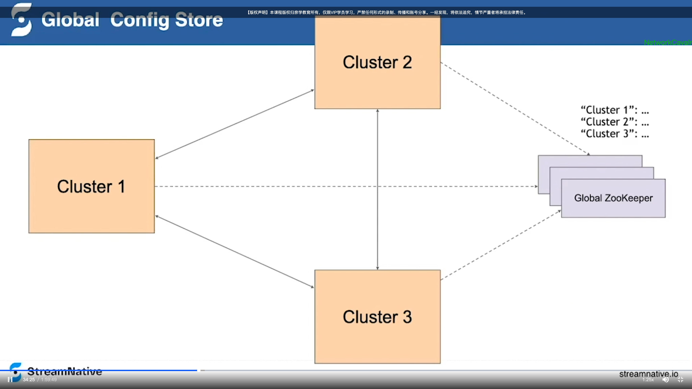

跨地域复制的前置配置，配置跨地域复制的租户和命名空间

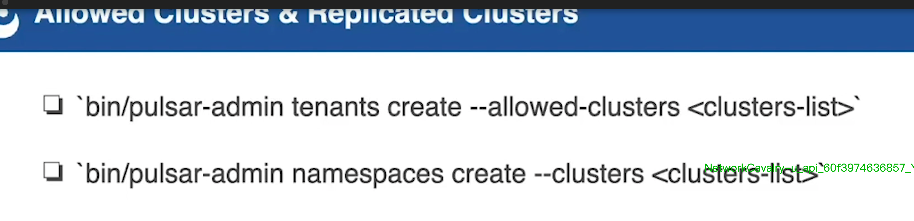

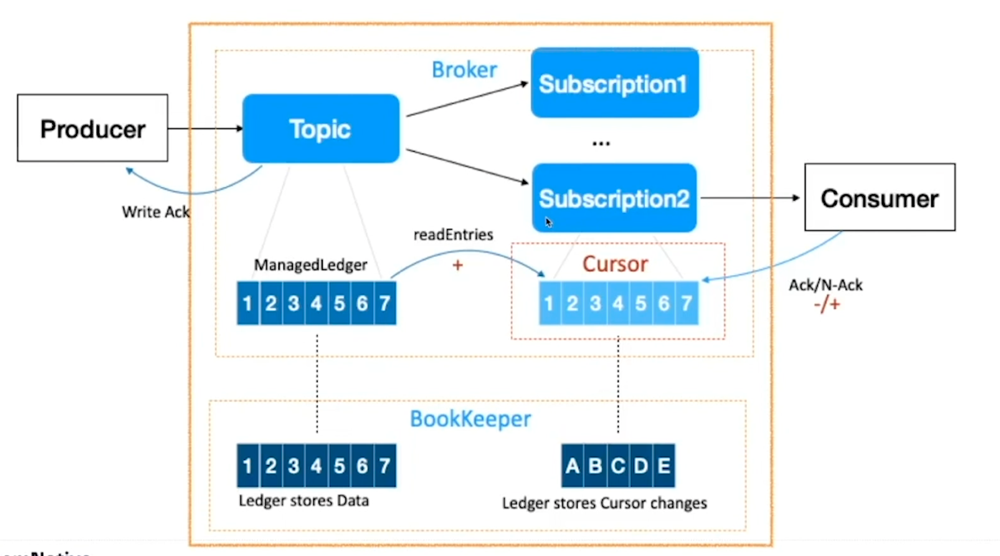

Topic1 配置了北京和上海机房跨地域复制，当有消息进来后，其 broker 内部会检查这个 **topic** （之前配置的复制租户和命名空间）和 **msg** 要不要复制（这个用到了Msg的属性字段，检查消息的来源，本地来源的消息才会复制），如果需要复制的话，会为其创建一个 Replicator，这个是类似于一个 Consumer和producer合体 ，其内部也持有一个游标，会消费消息，并将消息发送到需要复制的机房，来达到跨地域复制。  

低延时，异步的方式。

因为Replicator 是和 Broker 在统一 JVM 中，从MemoryCache 中取数据也会很快。

Cursor 的 ack 机制也可以保证消息的顺序性和一致性，数据不会被重复消费。

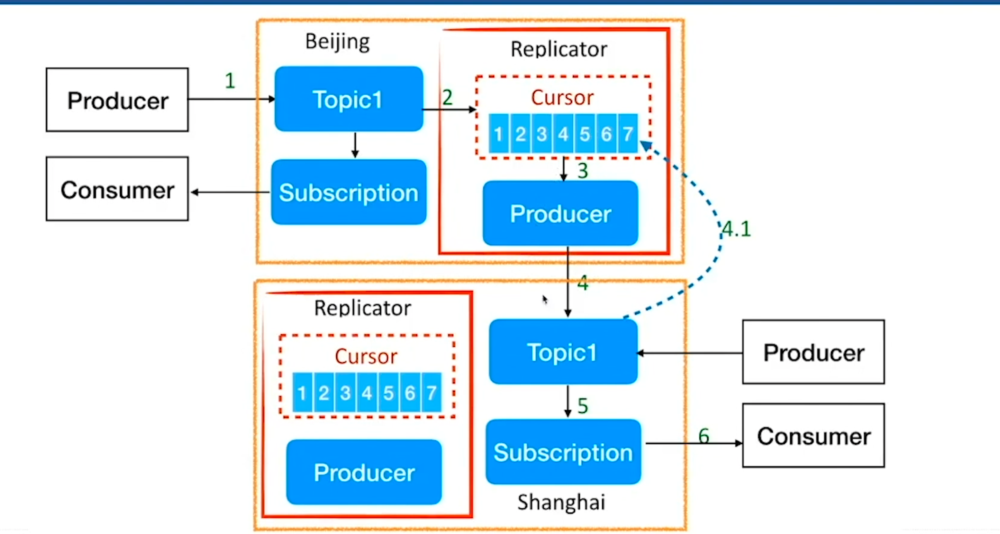

本地配置

考虑到可能没有跨机房集群，也可以在本地zk集群里配置 cluster 节点信息

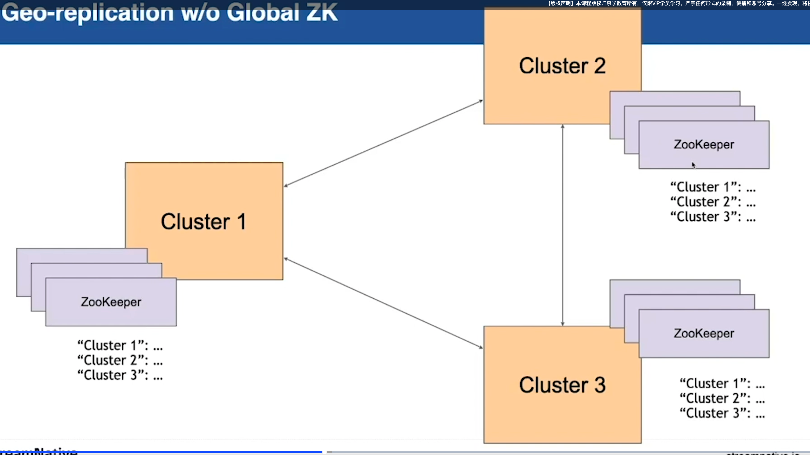

本地ZK 比 全局的zk配置更灵活，本地zk 可以支持单向复制。比如边缘节点 往中心节点汇聚数据。

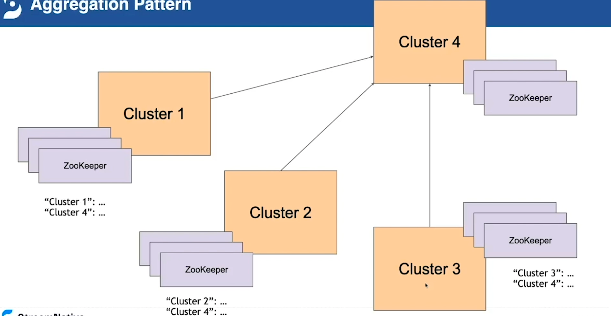

failover pattern

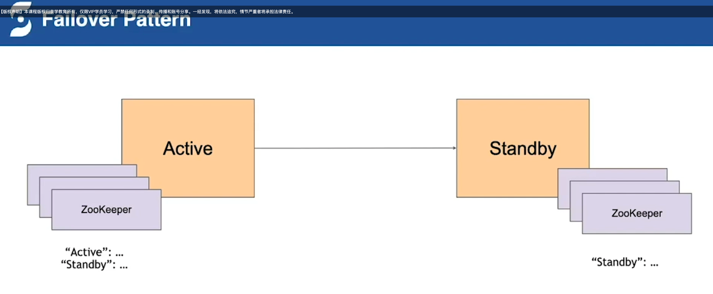

## Java Client

### Client

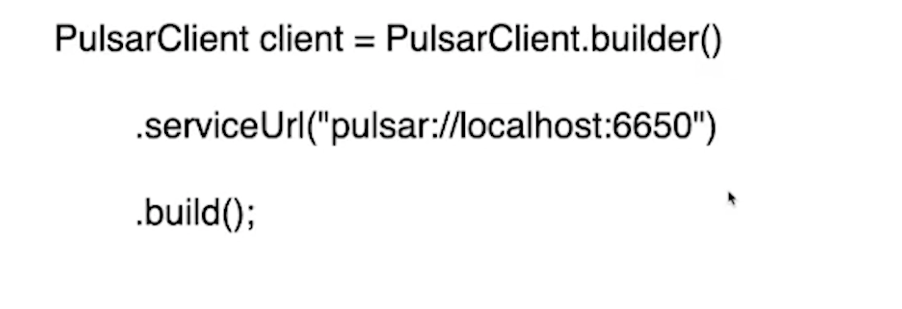

### Producer

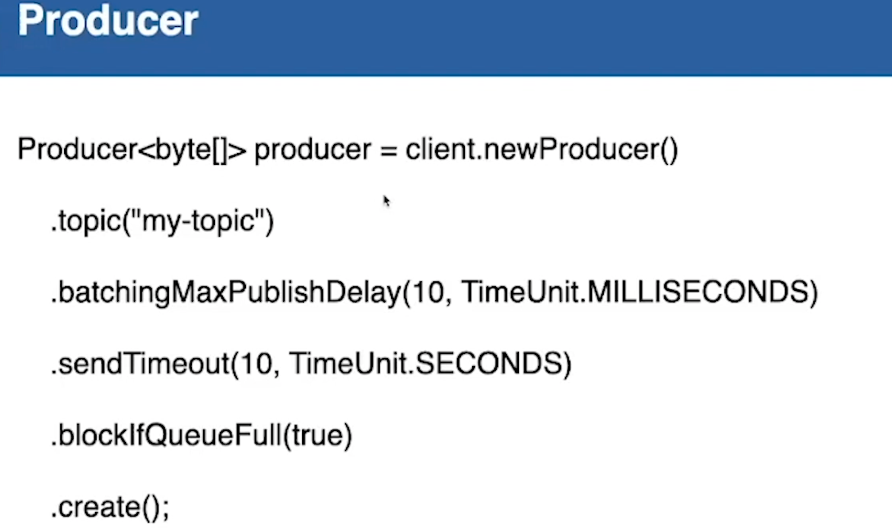

### Consumer 

## Receiver Queue Size

Broker 可能有消息堆积，Consumer 在连接到 Broker后，会告诉 Broker 自己的消息消费队列的大小，然后 Broker 会推送一大批消息过来，等到 queue 的可用空间过半时，Consumer 会再给 Broker 发送消息，让它再推送一批消息过来。

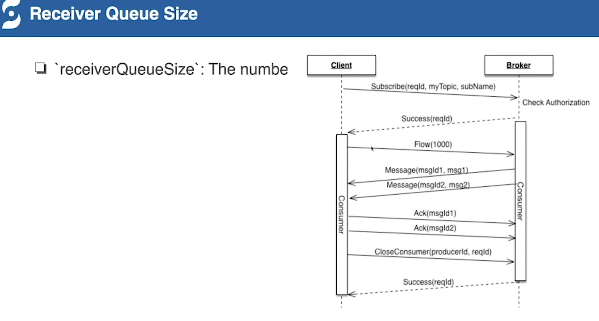

Pulsar 的消息时 推拉结合的，如果Broker 有消息则会不停的推送，如果没有的话则由Consumer 不停的去拉。

这个Queue Size 可以设置为0，防止在 shard 模式下，有的 consumer ack 消息过慢，然后导致处理消息快的consumer 处于空闲状态。

## NameSpace Manager

### tools

pulsar-admin（Java）

pulsarctl（Go）

这两个工具底层都是采用 broker 提供的对外服务来完成的，不过 Java 实现的方式依赖JVM 所以对执行效率有影响

### Namespace Policy 

命名空间策略

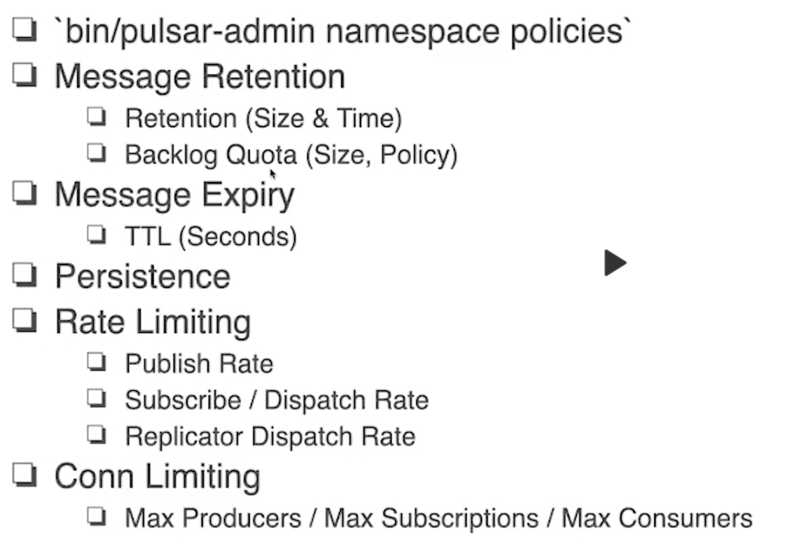

