## Metrics & Monitoring

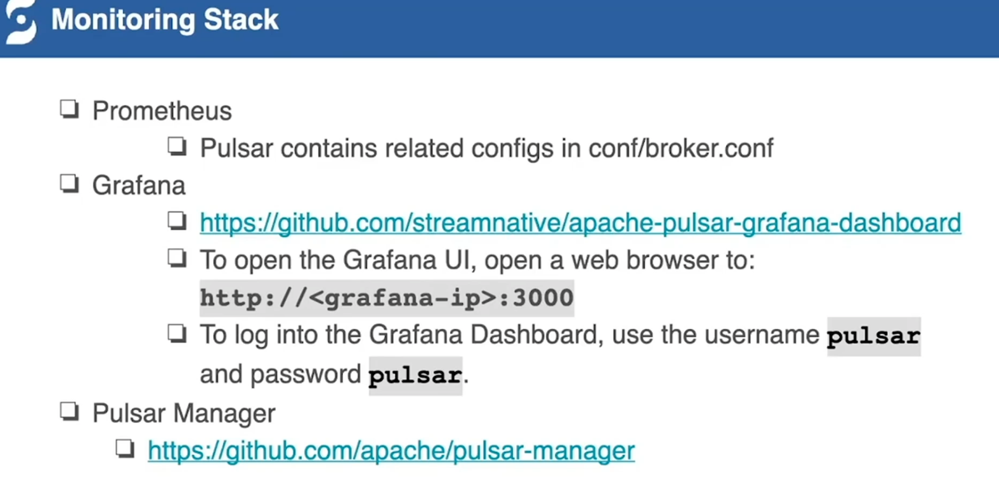

## Deployment & Performance Tuning

### zookeeper

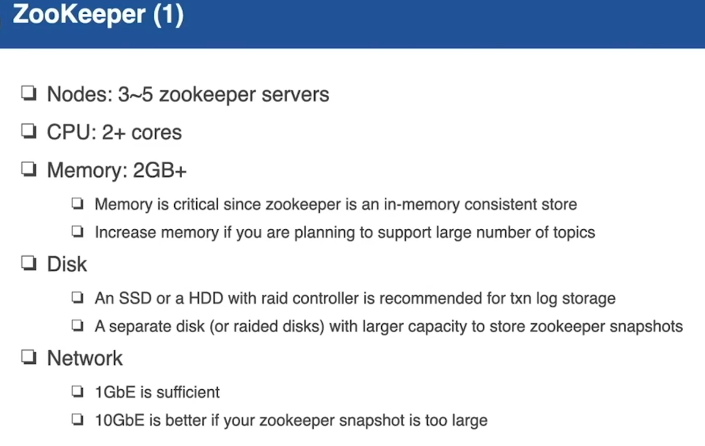 

### Bookies

- 每次写几个节点
- 每次要写保留几个备份
- 每次等几份数据落盘后返回

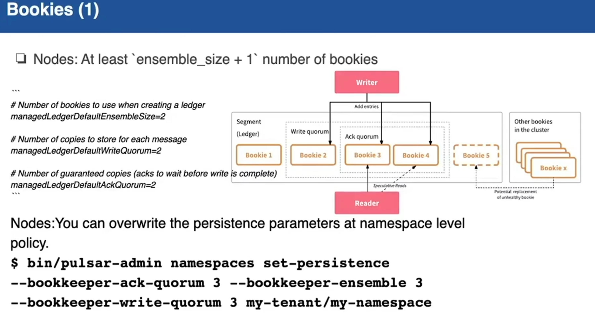

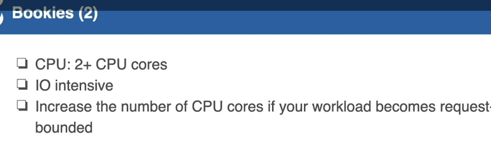

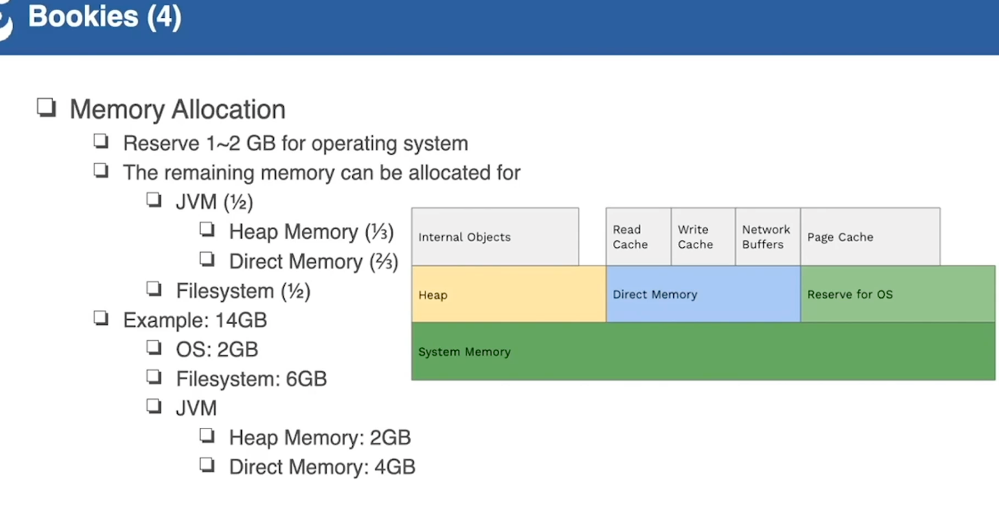

Journal缓解写压力

Ledger缓解读压力

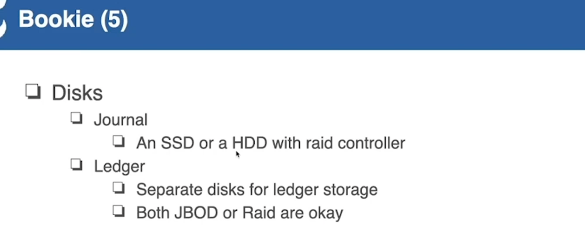

分配大比例的堆外内存，来减少文件IO对JVM的影响。

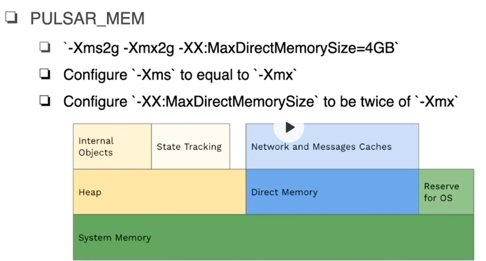

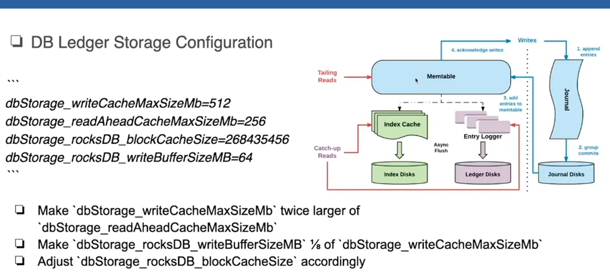

### Broker

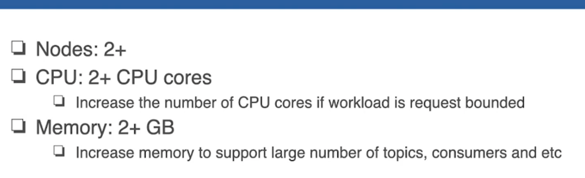

### Other Tuning

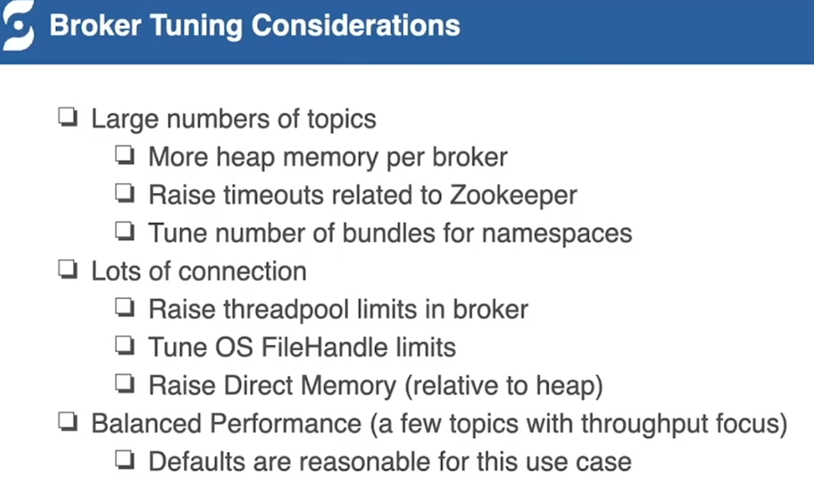

## Schema

Broker 会根据 Schema 来对消息进行序列化和反序列化，省区了Client的步骤。

同时也对 Producer 和 Consumer 进行了约束。

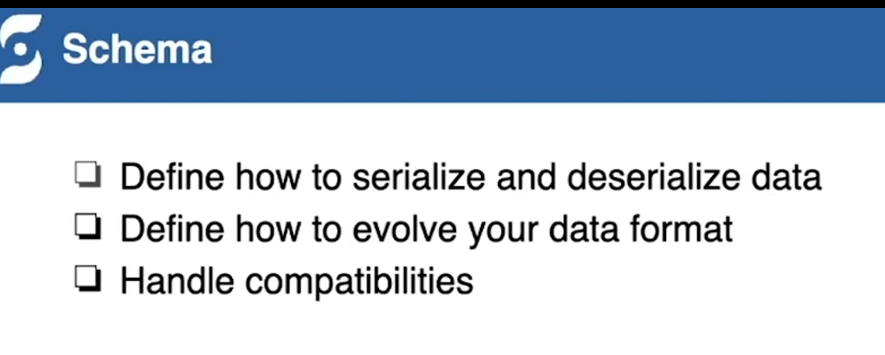

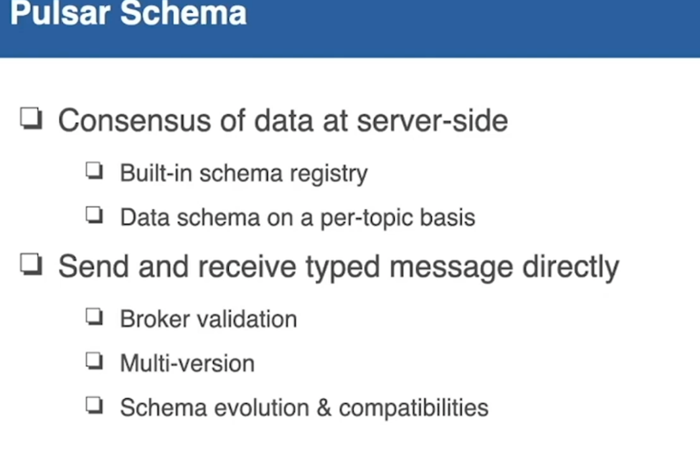

### Typed Client

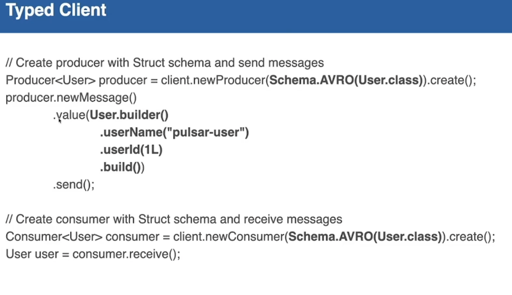

Schema 有确定的pojo

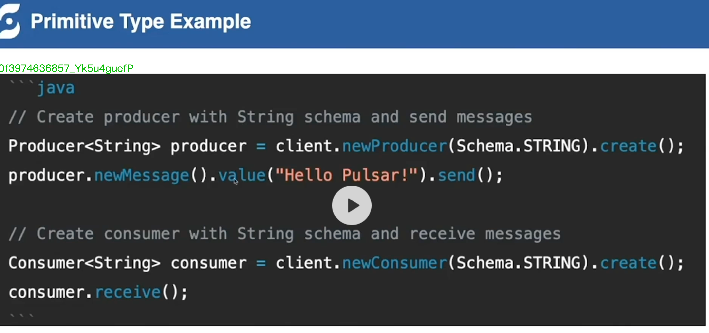

没有确定pojo，手动生成Schema

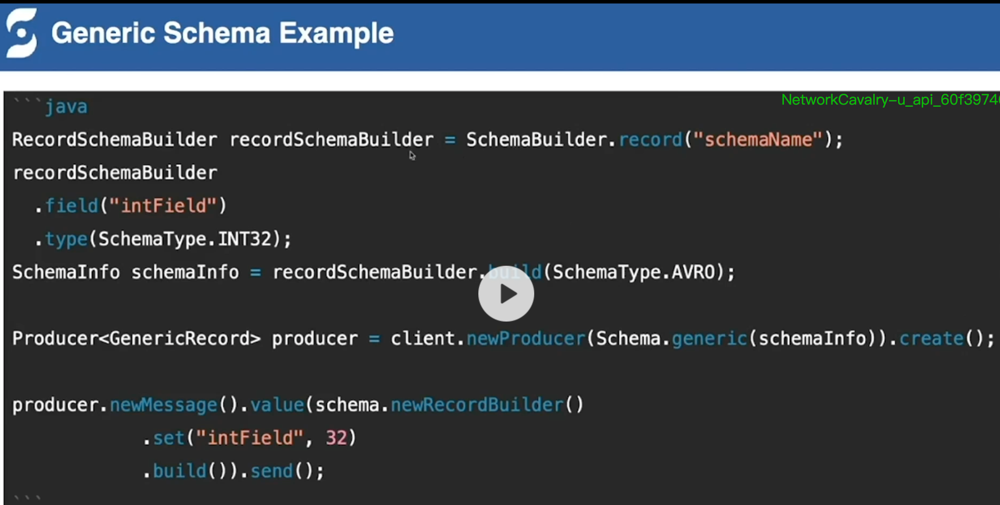

pulsar 内部是如何做 schema 校验的

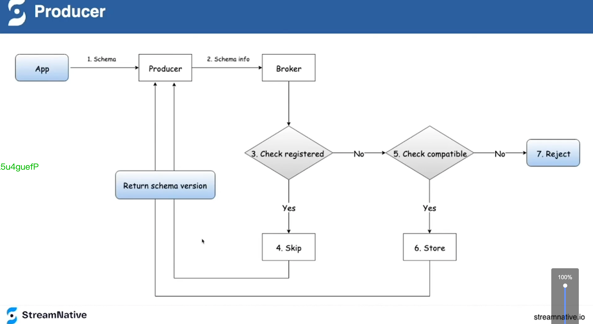

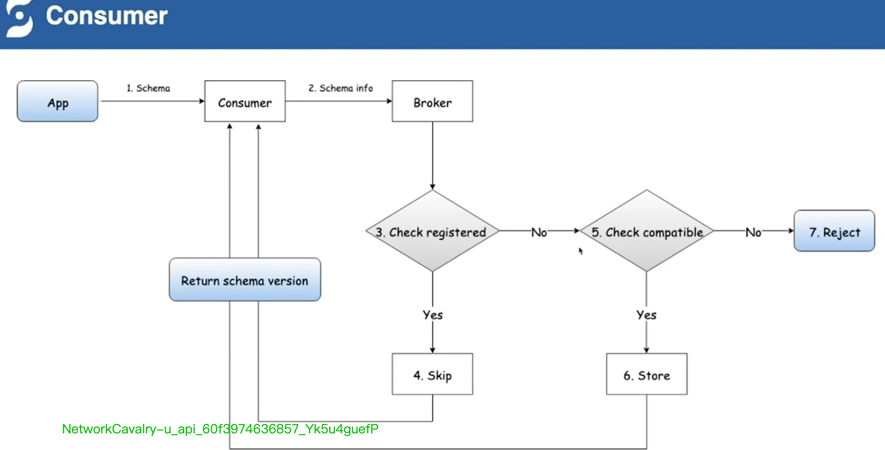

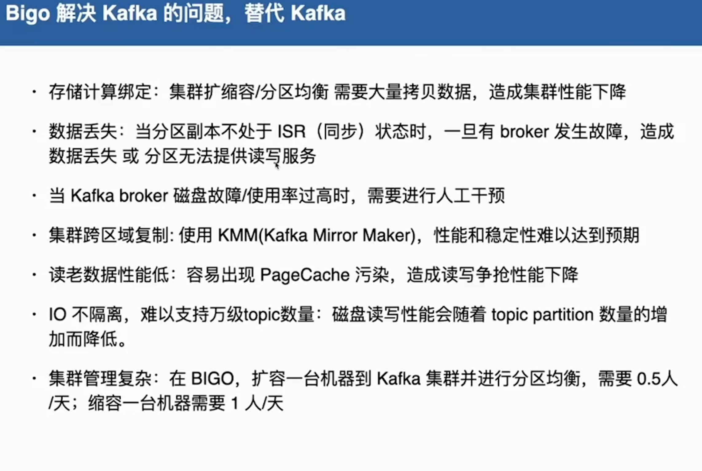

