# MySQL常用命令

```mysql
# 查看版本
select version();
# 备份工具
mysqldump -uroot -proot  --single-transaction database
# 表级锁
lock tables ... read/write
unlock tables
# 开启事务
start transaction
# 开启事务，执行快照读
start transaction with consistent snapshot
# 查看当前会话的隔离级别
show VARIABLES like 'TRANSACTION_ISOLATION';
# 查看事务隔离级别
select @@tx_isolation;
# 设置事务隔离级别
set tx_isolation='READ-UNCOMMITTED';
set tx_isolation='READ-COMMITTED'; 
set tx_isolation='REPEATABLE-READ';
set tx_isolation='SERIALIZABLE';

# 查看锁的概况
select * from information_schema.innodb_locks;
# InnoDB整体状态，其中包括锁的情况
show engine innodb status;

# 查看事务状态
SELECT * FROM information_schema.INNODB_TRX;
# 查看行锁信息（8.0）
select * from performance_schema.data_locks; 
# 查看正在锁的事务(5.x)
SELECT * FROM INFORMATION_SCHEMA.INNODB_LOCKS;
# 查看等待锁的事务(5.x)
SELECT * FROM INFORMATION_SCHEMA.INNODB_LOCK_WAITS;

# 查询表中索引信息
show INDEX from t
# 重新统计索引信息 
analyze table t
# 强制走指定索引
select * from t force index(a) where a between 10000 and 20000;
```

# 一条SQL的执行流程

[一条update语句的执行过程](https://gsmtoday.github.io/2019/02/08/how-update-executes-in-mysql/)

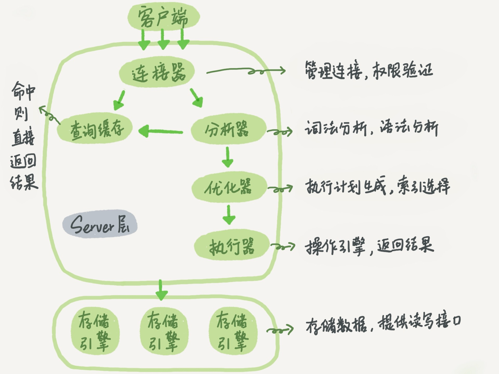

## 服务层

**连接层**：长连接是指连接成功后，如果客户端持续有请求，则一直使用同一个连接。 短连接则是指每次执行完很少的几次查询就断开连接，下次查询再重新建立一个。建立连接的过程通常比较复杂，尽量减少建立连接的动作。使用长连接。

如果一直保持连接的话，MySQL的内存会涨的比较快。原因是在执行过程中产生的临时数据，只有断开时才会释放。

解决办法：

- 定期断开长连接。
- MySQL5.7以后，可以通过mysql_reset_connection来重新初始化连接资源，这个过程中不用重连和权限校验。

**查询缓存**：作用不大，8.0版本已经移除。

**分析器**：进行词法分析和语法分析。

**优化器**：进行SQL的优化，如决定用哪个索引，

MySQL 在真正开始执行语句之前，并不能精确地知道满足这个条件的记录有多少条，只能根据统计信息来估算记录数。而具体选择哪个索引又会参考估算出的记录数，所以可能会发生选错索引的情况。

解决办法：

- 可以通过强制走指定索引 force index()
- 或者新建一个更合适的索引

```mysql
# 查询表中索引信息
show INDEX from t
# 重新统计索引信息 只是对表的索引信息做重新统计，没有修改数据，这个过程中加了 MDL 读锁；
analyze table t
# 强制走指定索引
select * from t force index(a) where a between 10000 and 20000;
```

**执行器：**执行SQL语句。


执行器，调用存储层接口只能获取最原始的数据，后续加工数据的操作像order join group 这些操作都是在执行器中完成的，

## 存储引擎层

# redolog 和 binlog

## redolog

**redo log 出现背景**

由于数据文件是持久化在磁盘上的，每次读取数据都需要经过磁盘的 **IO**，效率比较低下。因此 InnoDB 提供了一个缓存机制，包含了磁盘中的部分数据页。作为访问数据库的一个缓冲区。

读数据时，先读缓冲区，没有再去读数据库，然后再将读到的数据放入缓冲区中；写数据时，也是写到缓冲区就返回，定期将 缓冲区中脏页上数据刷新到磁盘上，进行持久化。

这里存在风险是，buffer 中已被修改的数据还没来得及持久化，MySQL发生宕机，那么就会造成数据丢失。

因此引入了 redo log 来解决这个问题。

**redo log 原理**

redo log 是一种预写式日志，它会将所有的修改先写入日志，再更新数据页，这样宕机恢复后就可以从 redo log 中恢复数据。

**redo log 写入机制**

事务执行的时候写redo log buffer =》write 事务提交的时候写入文件系统 page cache =》fsync 到磁盘binlog文件

redo log 会在事务执行过程中，将生成的redo log 先写入 redo log buffer。哪怕事务没有提交redo log buffer中的内容也可能会被持久化到磁盘上，因为全局共用一个redo log buffer。

**buffer 中 redo log 同步磁盘的时机**

通过 innodb_flush_log_at_trx_commit 来配置 redo log 的同步时机。

- 设置为 0 的时候，表示每次事务提交时都只是把 redo log 留在 redo log buffer 中 。

  InnoDB 有一个后台线程，每隔 1 秒，就会把 redo log buffer 中的日志，调用 write写到文件系统的 page cache，然后调用 fsync 持久化到磁盘。

- 设置为 1 的时候，表示每次事务提交时都将 redo log 直接持久化到磁盘；

- 设置为 2 的时候，表示每次事务提交时都只是把 redo log 写到 page cache。

**redo log 也是要将操作记录日志写到磁盘，为什么不直接将 buffer 中数据写入磁盘？**

- buffer 中的数据写入磁盘是随机读写IO，而 redo log 是往日志文件中追加写的，是顺序读写IO。效率会比较高。
- buffer 持久化数据是以数据页 page 为单位的，默认配置大小是16k，一点修改都需要将整个 page 页的数据写入磁盘，存在大量无效的IO，而 redo log 只会同步发生操作的数据，所以比较快。

## binlog

**binlog 写入机制**

事务执行的时候写binlog cache =》write 事务提交的时候写入文件系统 page cache =》fsync 到磁盘binlog文件

在事务执行过程中，binlog 会先将日志写入到binlog cache（内存中，每个线程都有自己的，binlog_cache_size 用于控制单个线程内 binlog cache 所占内存的大小），等事务提交的时候再写入binlog（磁盘上） 文件。并清空binlog cache。

在写入binlog磁盘文件的时候，其实还有一层文件系统的缓存page cache，写到这个page cache时，并没有把文件写入到物理磁盘中，所以速度比较快，由于是在page cache中，系统宕机也可能会发生数据丢失。

从page cache到真正持久化到物理磁盘上是通过刷盘 fsync 来完成的。fsync 才占磁盘的 IOPS。

write 和 fsync 的时机，是由参数 sync_binlog 控制的：

1. sync_binlog=0 的时候，表示每次提交事务都只 write，不 fsync；
2. sync_binlog=1 的时候，表示每次提交事务都会执行先write 再 fsync；
3. sync_binlog=N(N>1) 的时候，表示每次提交事务都 write，但累积 N 个事务后才 fsync。

因此，在出现 IO 瓶颈的场景里，将 sync_binlog 设置成一个比较大的值，可以提升性 能。在实际的业务场景中，考虑到丢失日志量的可控性，一般不建议将这个参数设成 0， 比较常见的是将其设置为 100~1000 中的某个数值。

但是，将 sync_binlog 设置为 N，对应的风险是：如果主机发生异常重启，会丢失最近 N 个事务的 binlog 日志。

**bin log 内容格式**

[binlog查看](https://blog.csdn.net/vkingnew/article/details/81170290)

```mysql
SHOW VARIABLES LIKE 'log_bin';
 SHOW VARIABLES LIKE 'binlog_format';
 set binlog_format = ROW
 set binlog_format = STATEMENT
 show binary logs;
 show master status;
 reset master;
 show binlog events in 'binlog.000001';
```

statement 、row 格式 和mixed。

statement 记录的是语句，row 记录的是行的操作类型。mixed是根据sql情况进行选择一种内容格式。

比如要删age=10的记录，假设有100条age=10的记录。statement 记录的是这条语句，而row要记录这100条记录执行的操作。

所以推出了这种mixed 的方式。

**bin log 和 redo log的刷盘都设置为非1的场景：**

如 innodb_flush_logs_at_trx_commit=2、sync_binlog=1000

1. 业务高峰期。一般如果有预知的高峰期，DBA 会有预案，把主库设置成“非双 1”。
2. 备库延迟，为了让备库尽快赶上主库。@永恒记忆和 @Second Sight 提到了这个场 景。
3. 用备份恢复主库的副本，应用 binlog 的过程，这个跟上一种场景类似。
4. 批量导入数据的时候。

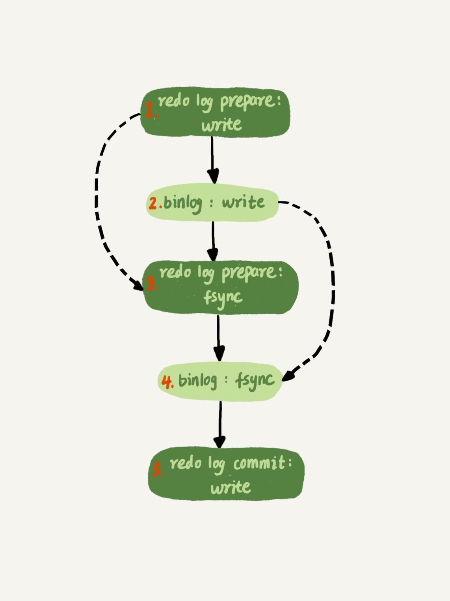


## redolog 和 binlog 区别

1. redo log 是 InnoDB 引擎特有的；binlog 是 MySQL 的 Server 层实现的，所有引擎都可以使用。
2. redo log 是物理日志，记录的是“在某个数据页上做了什么修改”；binlog 是逻辑日志，记录的是这个语句的原始逻辑，比如“给 ID=2 这一行的 c 字段加 1 ”。
3. redo log 是循环写的，空间固定会用完；binlog 是可以追加写入的。“追加写”是指 binlog 文件写到一定大小后会切换到下一个，并不会覆盖以前的日志。
3. 一个事务的binlog是不能被打断的，必须要连续写，而redo log 没有这个要求。所以binlog cache 是每个线程自己维护的，而redo log buffer 是全局共用的，

## 两阶段提交

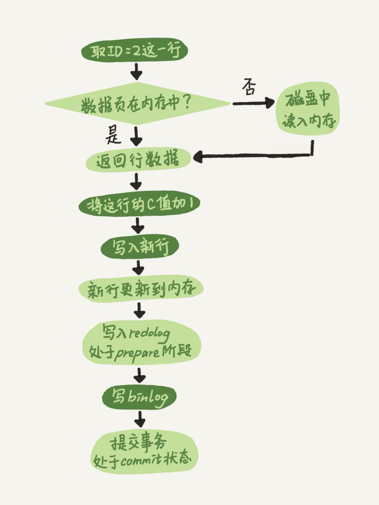


注意最后三步，是先写redolog处于prepare阶段，然后写binlog，最后再提交事务（redolog处于commit状态），更新完成。

相当于写redolog分为了两个阶段。第一个阶段是准备阶段，第二个阶段是提交阶段。

**为什么是两阶段？**

可以通过反证法来证明。

**先写 redolog 后写 binlog**，比如将原来的值从0改为1 ，redolog写成功了，但是binlog写失败了。这样主库的内存数据（值为1）和binlog（值为0）就存在不一致了，如果用binlog来恢复临时库的话，临时库就会少了这一次更新，与原库数据不一致。主库为1，临时库为0。

**先写 binlog 后写 redolog**，还是将值从0改为1，binlog写成功了，但是redolog写失败了。这样主库是0，而通过binlog恢复的临时库就变成了1。数据不一致。

**两段提交的步骤**

当redolog在写入，还没有到达prepare阶段时，发生服务重启，这种情况就直接回滚。

当redolog处于prepare阶段，写binlog服务重启，导致失败。重启后检查redolog，发现处于prepare阶段的数据，**不存在**对应binlog，则认为没有完成事务提交，触发回滚操作。

当redolog处于prepare阶段，写binlog后，提交事务时服务重启，重启后检查redolog，发现处于prepare阶段的数据，**存在**对应binlog，则认为事务已经完成了，会执行事务提交操作。


# InnoDB内部结构

## change Buffer

当需要更新一条数据时，如果该数据所在的数据页在内存中，就直接更新。如果没有的话，在不影响数据一致性的前提下，InnoDB会将这些更新操作缓存在 change buffer中，这样就不用从磁盘中读入该数据页，避免了一次磁盘的IO（数据库里成本最高的操作之一）。

在下次查询需要访问这个数据页的时候，将数据页读入内存，会进行merge操作（也就是执行change buffer 中与该页相关的命令），通过这样的方式来保证数据逻辑的正确性。

除了访问这个数据页会触发merge外，系统有后台线程会定期merge，数据库关闭的过程中，也会执行merge。

change buffer 不仅仅是停留在内存中，也会被持久化到磁盘上。

唯一索引的更新或插入是需要判断唯一性约束的，因此必须将数据页读入内存才能判断，所以change buffer就排不上用场了。只有普通索引可以使用。

## change Buffer 和 redo log

redo log 也是将要修改的操作先记在内存中的redo log，也会对redo log持久化。但redo log 的目标是保证数据的持久性。

change buffer 是为了在保证数据一致性的前提下，提高更新操作的性能。

这里，我们假设当前 k 索引树的状态，查找到位置后，k1 所在的数据页在内存 (InnoDB buffer pool) 中，k2 所在的数据页不在内存中。下图所示是带 change buffer 的更新 状态图。

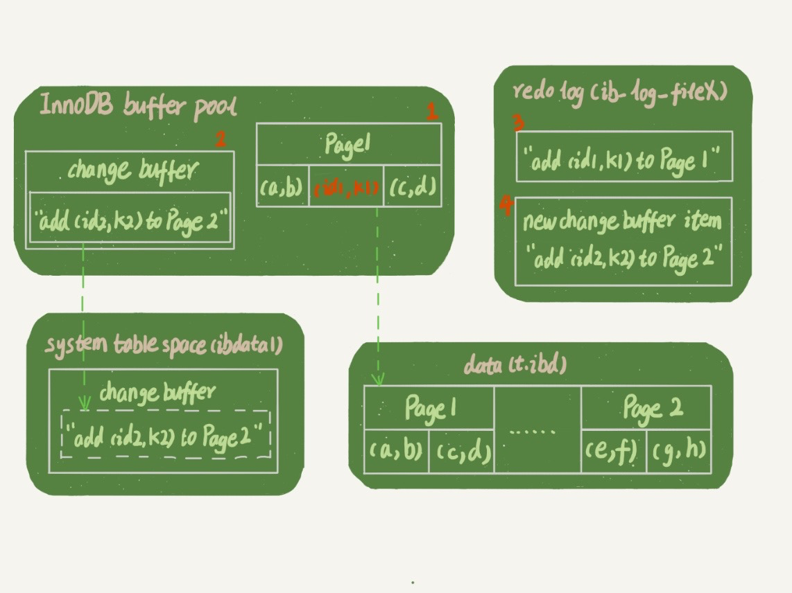

1. Page 1 在内存中，直接更新内存；

2. Page 2 没有在内存中，就在内存的 change buffer 区域，记录下“我要往 Page 2 插 入一行”这个信息
3. 将上述两个动作记入 redo log 中（图中步骤 3 和 步骤4）。

做完这些操作，事务就可以完成了。一共包含了2次内存操作，和一次顺序IO操作。因为redo log是追加写。

同时，图中的两个虚线箭头，是后台操作，不影响更新的响应时间。

如果读语句发生在更新语句后不久，内存中的数据都还在，那么此时的这两个读操作就与 系统表空间（ibdata1）和 redo log（ib_log_fileX）无关了。

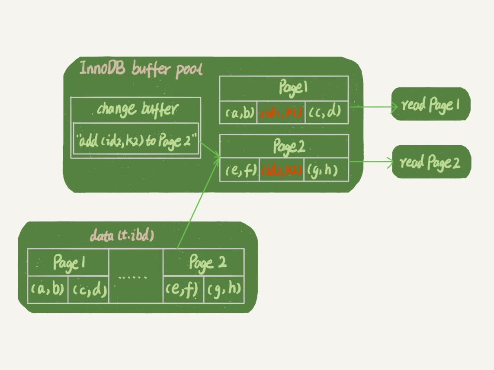

1. 读 Page 1 的时候，直接从内存返回。有几位同学在前面文章的评论中问到，WAL 之后 如果读数据，是不是一定要读盘，是不是一定要从 redo log 里面把数据更新以后才可 以返回？其实是不用的。你可以看一下图 3 的这个状态，虽然磁盘上还是之前的数据， 但是这里直接从内存返回结果，结果是正确的。
2. 要读 Page 2 的时候，需要把 Page 2 从磁盘读入内存中，然后应用 change buffer 里 面的操作日志，生成一个正确的版本并返回结果。

**小结**

redo log 主要节省的 是随机写磁盘的 IO 消耗（转成顺序写），而 change buffer 主要节省的则是随机读磁盘 的 IO 消耗。

将变更的操作记录在 change buffer ，这样就不需要频繁将磁盘上的数据页读取至内存。

## 脏页的刷新

由于InnoDB尽可能希望在内存中操作，所以当要修改的数据在内存页中存在的话，直接在内存中修改，然后记redo log就返回。不进行磁盘IO，这样性能会很高。

当内存数据页跟磁盘数据页内容不一致的时候，我们称这个内存页为“脏页”。内存数据写入到磁盘后，内存和磁盘上的数据页的内容就一致了，称为“干净页”。

将脏页刷新到磁盘上要进行磁盘IO，而平时的更新操作是写内存和日志，相比之下刷新脏页时，MySQL对于相同的更新操作就会变的特别慢。而且很难复现，不止随机，而且时间还很短。

**脏页的刷新时机**

1. redo log写满的时候，出现这种情况的时候整个系统就不能再接受更新了，所有的更新都会堵住。
2. 内存不够用了，要将脏页写到磁盘上，清理出干净页来。这个情况最常见。（如果一次查询要的数据比较多，那么对应淘汰的脏页页比较多，会导致查询响应时间明显变长。）
3. MySQL系统空闲的时候，或者数据库要关闭的时候。

**脏页刷新的控制策略**

一方面是脏页的比例，另一方面是redo log的写盘速度。这个速度是和innodb_io_capacity参数相关的。

尽量控制脏页比例不要接近75%。

innodb_io_capacity这个参数可以告诉InnoDB当前机器的磁盘能力，这个值建议设置为IOPS。具体的IOPS值可以通过fio来测试。

这个值小的话，InnoDB会认为磁盘IO能力差，所以刷新脏页会比较慢，甚至比脏页生成的速度还慢，这样就会导致脏页累积，影响查询和更新性能。


# InnoDB事务

## 原子性

Atomic，事务是一个最小的执行单位，不可分割。事务中的多个操作要么都成功，要么都失败。已经执行的SQL语句要执行回滚，回滚到事务之前到状态。

回滚的实现原理是 **undo log**，这个是 InnoDB数据库引擎，提供的两种事务日志之一，另外一种是 **redo log**。

当事务对数据库修改的时候，InnoDB生成对应的 undo log，如果事务发生回滚，那么会执行相反的操作。

## 持久性

Durability，事务一旦提交，那么对数据库的影响是永久性的。实现原理是 **redo log**。

## 隔离性

Isolation，数据库允许多个并发事务同时对其数据进行读写和修改的能力，隔离性可以防止多个事务并发执行时由于交叉执行而导致数据的不一致。隔离性是通过MVCC或锁机制来保证的。

MySQL 支持4种事务隔离级别，包括读未提交（Read uncommitted）、读提交（read committed）、可重复读（repeatable read）和串行化（Serializable）。

**事务隔离级别**

- READ UNCOMMITTED：可以读取未提交的数据，未提交的数据称为脏数据，所以又称脏读。
- READ COMMITTED：RC隔离级别要求解决脏读，只能读取已经提交的数据；
- REPEATABLE READ：InnoDB默认，同一个事务中多次执行同一个select,读取到的数据没有发生改变；RR隔离级别要求解决不可重复读。
- SERIALIZABLE: 幻读，不可重复读和脏读都不允许，所以serializable要求解决幻读；

**事务隔离性问题**

- 脏读：读取到其他事务未提交的数据。
- 不可重复读：读到其他其他事务已经提交的数据。
- 幻读：同一个事务中多次执行同一个select, 读取到的数据行发生改变。也就是行数减少或者增加了(被其它事务delete/insert并且提交)。

## 一致性

Consistency， 事务操作之后, 数据库所处的状态和业务规则是一致的。数据库通过原子性、隔离性、持久性来保证一致性，一致性是目的，AID是手段。


# 数据库锁

## 全局锁

做全局逻辑备份时，需要对整个数据库加锁，让整个数据库处于只读状态，FTWRL（flush tables with read lock），数据更新、表字段定义等语句会被阻塞。

主库上备份，备份期间业务不能执行写入。从库上备份，备份期间无法执行主库同步过来的binlog，导致主从延迟。

如果不加锁的话，可能导致数据不一致的情况。如下图：

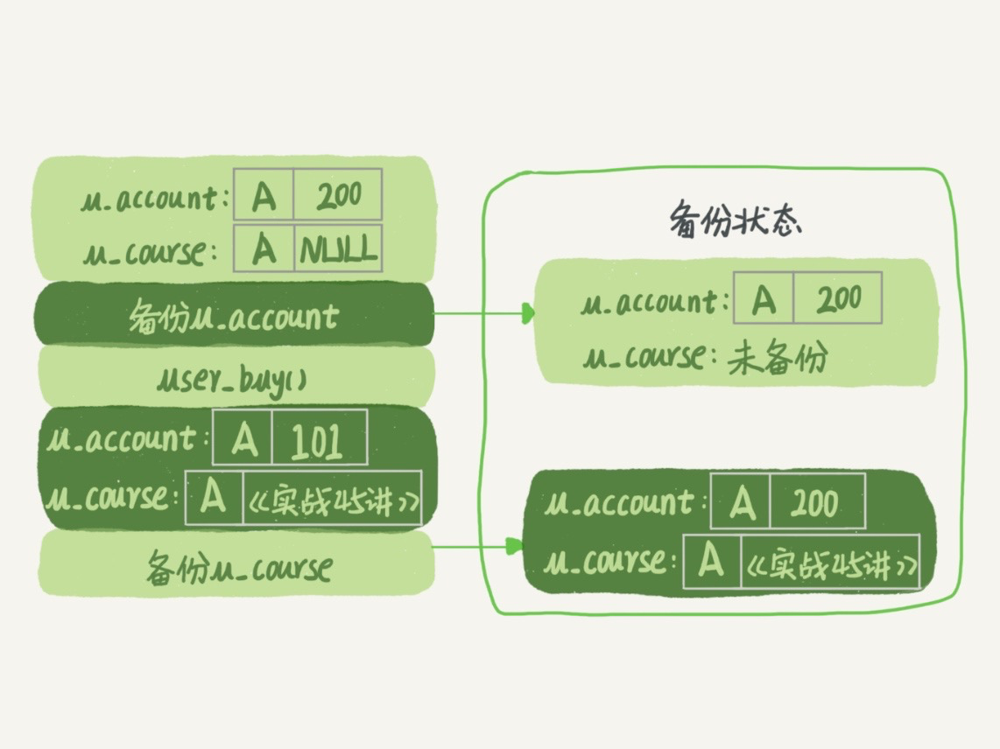

除了FTWRL，MySQL还自带逻辑备份工具mysqldump。会在导出数据前启动一个事务，确保能拿到一致性视图。

但这种方式只适用所有的表都使用事务引擎的库。索引建议都是用InnoDB引擎。

```mysql
# 备份工具
mysqldump -uroot -proot  --single-transaction database
```

**既然要全库只读，为什么不使用 set global readonly=true 的方式呢？**

在异常处理机制上有差异。如果执行 FTWRL 命令之后由于客户端发生异常断开，那么 MySQL 会自动释放这个全局锁，整个库回到可以正常更新的状态。

而将整个库设置为 readonly 之后，如果客户端发生异常，则数据库就会一直保持 readonly 状 态，这样会导致整个库长时间处于不可写状态，风险较高。

## 表级锁-表锁

```mysql
# 表级锁
lock tables ... read/write  # lock tables t1 read, t2 write;
unlock tables
```

FTWRL 类似，可以用 unlock tables 主动 释放锁，也可以在客户端断开的时候自动释放。

## 表级锁-元数据锁

MySQL5.5版本引入MDL锁，不需要显示使用，在访问一个表的时候会自动加上，防止在查询遍历数据的时候，表结构发生变更。

**当对表数据做增删改查的时候，加MDL读锁。对表结构变更时，加MDL写锁。**

读锁之间不互斥，读写之间、写锁之间是互斥的。

并且事务中的MDL，会在语句执行时申请，但语句执行后不会马上释放，而是等到事务提交后才释放。注意，可能存在死锁。

当查询的事务没提交时，持有的MDL锁不会释放，这时候申请MDL写锁的话会发生阻塞，而其他想要申请DML读锁的线程会阻塞在申请MDL写锁线程的后边。这个时候就表现为完全不可读写了。

## 行级锁-行锁

行锁时在引擎层由各个引擎自己实现的，MyISAM引擎就不支持行锁。

在 InnoDB 事务中，行锁是在执行语句的时候才加上的，但并不是执行完该条语句就立刻释放，而是要等到事务结束时才释放。这个就是两阶段锁协议。

实际使用中，如果你的事务中需要锁多个行，要把最可能造成锁冲突、最可能影响并发度的锁尽量往后放。

使用中还可能会发生死锁，两个事务分别持有自己的资源然后想访问对方的资源，然后就会陷入相互等待的局面。

解决策略上，通常不会采用 **设置最大超时时间** 来让线程中止线程的等待，因为这个时间是不可控的，可能会影响一些本身耗时但不会发生死锁的事务操作。

而是采用 **主动死锁检测**，这个默认是开启的（innodb_deadlock_detect），它会在发生死锁时，快速发现并处理。

实现方式上，还是会去检查所依赖的线程是否被别人锁住，如此循环，判断出是否循环等待。也就是死锁。

## 幻读

```mysql
CREATE TABLE `t` (
  `id` int(11) NOT NULL,
  `c` int(11) DEFAULT NULL,
  `d` int(11) DEFAULT NULL,
  PRIMARY KEY (`id`),
  KEY `c` (`c`)
) ENGINE=InnoDB;

insert into t values(0,0,0),(5,5,5),
(10,10,10),(15,15,15),(20,20,20),(25,25,25);
```

幻读指的是一个事务在 前后两次查询同一个范围的时候，后一次查询看到了前一次查询没有看到的行。（可能是新插入的，也可能是更新的）

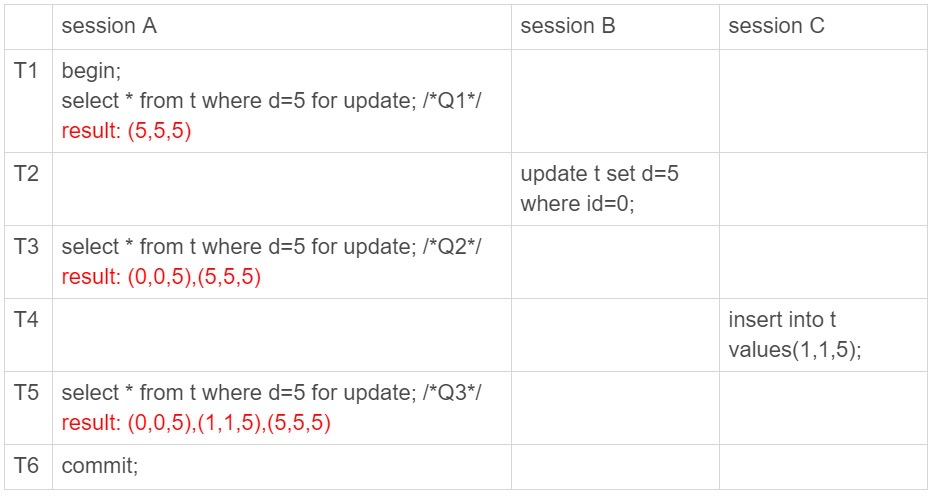

是同一个事务中，T1，T3，T5读到的数据行不一致。这个就是幻读现象。

- 在可重复读隔离级别下，普通的查询是快照读，是不会看到别的事务插入的数据的。因此，幻读在“当前读”下才会出现。
-  session B 的修改结果，被 session A 之后的 select 语句用“当前读”看到，不能称为幻读。幻读仅专指“新插入的行”。

## **幻读的问题**

**1.语义上的破坏**

T1 的语句是要锁住所有d=5的数据行，不让别的事务进行读写操作。而实际上幻读破坏了这个语义。

db中已经有一条id=5 d=5 c=5的数据。sessionA锁住了db中当前符合d=5条件的记录行，但是sessionB 将其他的记录行的d值改为了5、sessionC 直接创建了一条d=5的记录。这两条记录就不在之前sessionA的锁定范围内了，这样就发生了幻读问题。

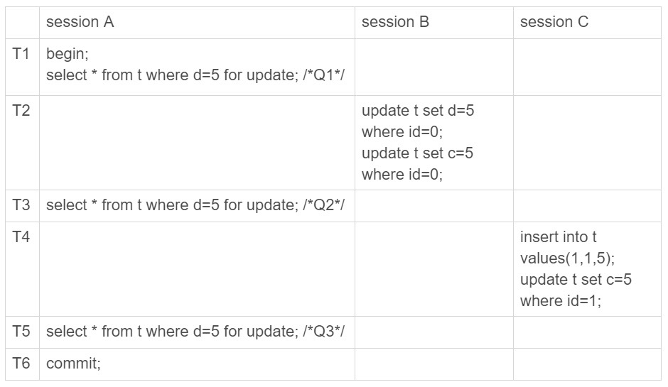

**2.数据一致性的破坏**

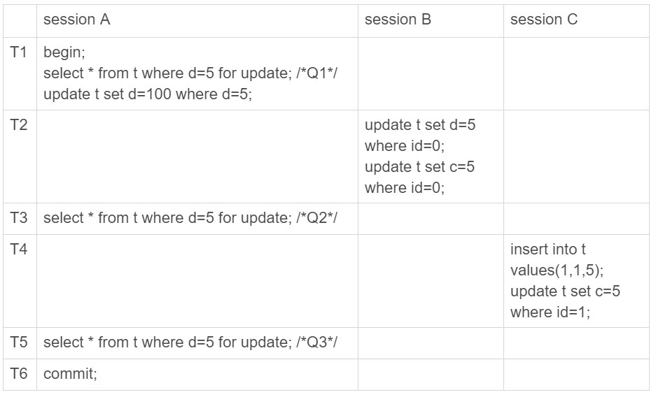

上图中按时间顺序执行完后，db中的数据：（5，5，100），（0，5，5），（1，5，5），看起来好像没什么问题，这时候来看binlog中的数据。

T2 时刻，session B 事务提交，写入了两条语句；

T4 时刻，session C 事务提交，写入了两条语句；

T6 时刻，session A 事务提交，写入了 update t set d=100 where d=5 这条语句。

按顺序整理起来：

```mysql
update t set d=5 where id=0; /*(0,0,5)*/

update t set c=5 where id=0; /*(0,5,5)*/

insert into t values(1,1,5); /*(1,1,5)*/

update t set c=5 where id=1; /*(1,5,5)*/

update t set d=100 where d=5;/* 所有 d=5 的行， d 改成 100*/
```

这个语句序列，无论拿到备库执行，还是通过binlog来克隆库，这三行的结果会变成（5，5，100），（0，5，100），（1，5，100）这样就发生了数据不一致性。

## 幻读的解决

产生幻读的原因是，行锁只能锁住行，但是新插入记录这个动作，要更新的是记录之间的“间隙”。因此，为了解决幻读问题，InnoDB 只好引入新的锁，也就是 间隙锁 (Gap Lock)。

### 行级锁-间隙锁

Gap Lock，锁住两条数据之间的空隙。是开区间。间隙锁之间不会冲突，也就是可以有多个事务持有间隙锁，间隙锁只会和 往这个间隙中插入一条记录 这个操作冲突。

**间隙锁会降低并发度，还可能会造成死锁。**

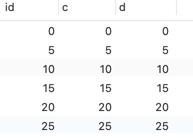

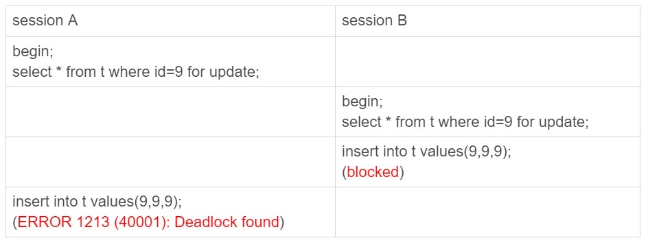

上图中，SessionA先去查id=9的并加锁，如果不存在对应记录则会加上间隙锁（5，10）。

SessionB同样也会加上（5，10）的间隙锁，然后SessionB要插入的（9，9，9）数据的时候，被SessionA的间隙锁阻塞了，只好进入等待。

SessionA要插入相同数据，被SessionB阻挡了，这样就形成死锁了。当InnoDB的死锁检测发现后，就让SessionA的插入语句报错返回。

**间隙锁是在可重复读隔离级别下才会生效。**

如果读提交的隔离级别够用，也就是业务不需要可重复读的保证，为了提高并发度，可以调整隔离级别。

如果把隔离级别设置为读 提交的话，就没有间隙锁了。同时，需要解决可能出现的数据和日志不一致问题，就要把 binlog 格式设置为 row。

**间隙锁的查看和配置**

根据innodb_locks_unsafe_for_binlog查看间隙锁开启状态，为OFF时开启间隙锁，默认开启，

```mysql
 show variables like 'innodb_locks_unsafe_for_binlog'; 
```

关闭间隙锁，在my.cnf中配置，重启mysql服务

```bash
[mysqld]
innodb_locks_unsafe_for_binlog = 1
```


### 行级锁-临键锁

临键锁，间隙锁和行锁合称 next-key lock。间隙锁锁的是从上一条记录开始到这一条记录之间。该锁是前开后闭区间。


如果执行` select * from t where c= 7 lock in share mode`语句。t 表中没有 c=7 的这条记录，因此加的间隙锁是 （5，10）。如果存在 c=7 这条记录，那么间隙锁就变成了（5，7）再加上 c=7 的的记录行。加锁的区间就变成了 （5，7]了，也就是Next-key Lock。

## 加锁规则

https://blog.csdn.net/javaanddonet/article/details/111187345

加锁规则：

- **原则 1：加锁的基本单位是临键锁next-key lock。next-key lock是前开后闭区间。**

- **原则 2：查找过程中访问到的对象才会加锁。**

- **原则 3：读锁不回表则不会加到主键索引上，写锁一定会加在主键索引上。**

- **优化 1：索引内部的等值查询，给唯一索引加锁的时候，next-key lock 退化为行锁。**

- **优化 2：索引内部的等值查询，向右遍历时且最后一个值不满足等值条件的时候，next-key lock 退化为间隙锁。**

  比如给普通索引age=18加锁，先是通过等值查询，找到第一个等于18的，根据原则1和原则2，这条记录会加临键锁（next-key lock），假设前一条记录是age=15，那么加在刚才那条记录的临键锁就是（15，18 ] ，然后下一条还是age为18，继续临键锁（18，18 ] ，接下如果为age=20，那么符合优化2，对age为20的记录加间隙锁，也就是（18，20）。

- **一个 bug：唯一索引上的范围查询会访问到不满足条件的第一个值为止，这个在MySQL8.0以后已经修复，但是在MySQL5.7版本中有这个问题。**

  **注意：**上边说的索引内部的等值查询，并不是指 `where id = 12` ，而是指通过索引树的搜索去定位数据的方法叫做等值查询，例如 `where id < 12`，索引也会用到等值查询的方法，引擎内部它会先去找 `id = 12` 的记录（这个就是等值查询），找到的话从该记录向左遍历就是我们要找的数据，如果发现id为10的下一条数据 `id = 15`，那么说明 `id = 12` 的数据不存在，那么就会去加（10，15]的间隙锁。

加锁结论：

- 查询只在一个索引上返回不回表，加读锁，就只加这个索引；如果回表查到其他索引(主键)就其他索引也加读锁；
- 加写锁就直接加到主键索引上
- 默认先加next-key lock，然后根据条件进行优化，将锁的范围变小。
- 锁是加在索引上的，如果锁发生在覆盖索引上，就不会去锁主键索引了。如果锁的行，在返回数据时发生了回表操作，也会锁定主键索引中对应的行。
- 根据主键等值查询，next-key lock 会退化为行锁。
- 如果发生了索引失效的情况，会锁全表。ps：对索引字段进行显式（month函数）或隐式（字段和查询参数类型不一致）的函数运算会导致索引失效。

```mysql
# SessionA
START TRANSACTION;
SELECT * from userinfo where id<11  for UPDATE;
SELECT * from userinfo where id<11 ORDER BY id desc for UPDATE;

#SessionB
SELECT * from userinfo where id=15 for UPDATE;
```

测试数据：

```mysql
CREATE TABLE `userinfo` (
  `id` int(11) NOT NULL COMMENT '主键',
  `name` varchar(255) DEFAULT NULL COMMENT '姓名',
  `age` int(11) DEFAULT NULL COMMENT '年龄，普通索引列',
  `phone` varchar(255) DEFAULT NULL COMMENT '手机，唯一索引列',
  `remark` varchar(255) DEFAULT NULL COMMENT '备注',
  PRIMARY KEY (`id`),
  UNIQUE KEY `idx_userinfo_phone` (`phone`) USING BTREE COMMENT '手机号码，唯一索引',
  KEY `idx_user_info_age` (`age`) USING BTREE COMMENT '年龄，普通索引'
) ENGINE=InnoDB DEFAULT CHARSET=utf8mb4;

INSERT INTO `userinfo`(`id`, `name`, `age`, `phone`, `remark`) VALUES (0, 'mayun', 20, '0000', '马云');
INSERT INTO `userinfo`(`id`, `name`, `age`, `phone`, `remark`) VALUES (5, 'liuqiangdong', 23, '5555', '刘强东');
INSERT INTO `userinfo`(`id`, `name`, `age`, `phone`, `remark`) VALUES (10, 'mahuateng', 18, '1010', '马化腾');
INSERT INTO `userinfo`(`id`, `name`, `age`, `phone`, `remark`) VALUES (15, 'liyanhong', 27, '1515', '李彦宏');
INSERT INTO `userinfo`(`id`, `name`, `age`, `phone`, `remark`) VALUES (20, 'wangxing', 23, '2020', '王兴');
INSERT INTO `userinfo`(`id`, `name`, `age`, `phone`, `remark`) VALUES (25, 'zhangyiming', 38, '2525', '张一鸣');
```


# MVCC

多版本并发控制，支持了读写操作的并行，对数据进行**多版本处理**，并通过事务的可见性来保证事务能看到自己应该看到的数据版本。 多版本控制很巧妙地将稀缺资源的独占互斥转换为并发，大大提高了数据库的吞吐量及读写性能。

先简单介绍两个概念。当前读和快照读读。

## 当前读和快照读

当前读：读取的是记录的最新版本，并且当前读返回的记录，都会加锁，保证其他事务不会并发修改这条数据。

更新数据前会进行一次当前读，如 insert/delete/update 。

select 语句加锁，也是当前读。

```mysql
# 加读锁（S锁，共享锁）
select k from t where id=1 lock in share mode;
# 写锁（X锁，排它锁）
select k from t where id=1 for update;
```

快照读：通过select读取记录的快照版本（有可能是历史版本），不用加锁。至于能应该读取到哪个快照版本，则是由事务所创建的ReadView来控制。

现在再来看看MySQL是如何维护一条数据的多个历史版本的。

## 一条数据的多版本

**记录行的隐含字段**：

row_id：标识具体的某一行，通常用的是主键。

trx_id：记录上次修改这条记录的事务id。

roll_pt：回滚指针，指向undo log中上一个版本的记录行。

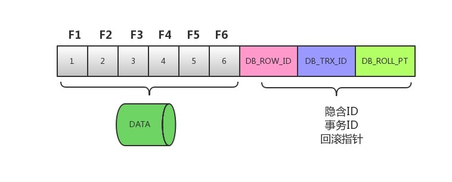

当记录发生变更时，会将变更前的数据在undo log中保留一份，再将当前记录修改，并修改当前行的 trx_id 和 roll_pt。

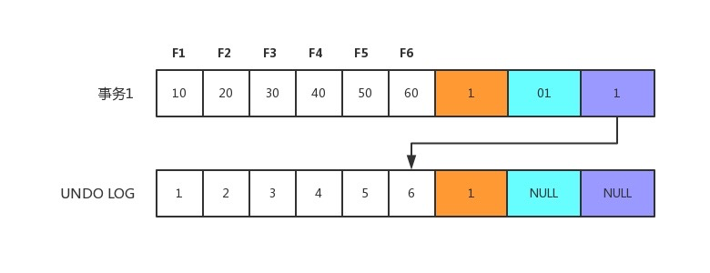

当还有后续的事务来修改这条记录时，会继续刚才的操作。

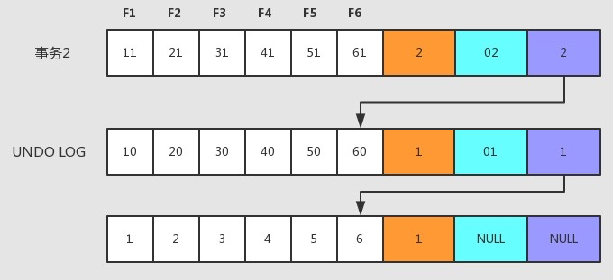

通过这样这种类似 COW 的方式，已经记录了数据的多个版本。至于事务之间的隔离性，也就是不同事务看到不同版本的数据，是怎么来实现的？这个就要引出 ReadView 来。

## ReadView

Consistent Read View，一致性读视图，用于支持 RC（Read Commit，读提交）和 RR（Repeatable Read，可重复读）隔离级别的实现。**简单来说就是控制事务能读取到哪个版本的数据。**

RR级别下的事务，能保证重复读到相同数据，是通过快照读来实现的。这里的快照并不是将所有的数据进行快照，而是对当前的活跃事务进行快照，这些活跃事务id会记录在ReadView中的数组里。

ReadView中还额外记录了活跃事务数组中的最小事务id。以及整个MySQL中最大的事务id+1，也就是全局里下一个要分配的事务id，并不是数组中的最大事务id。

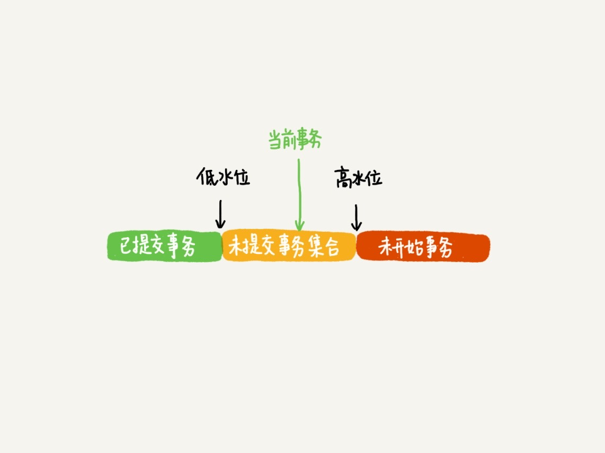

1. 如果落在绿色部分，表示这个版本是已提交的事务或者是当前事务自己生成的，这个数据是可见的；
2. 如果落在红色部分，表示这个版本是由将来启动的事务生成的，是肯定不可见的；
3. 如果落在黄色部分，那就包括两种情况
   - 若 row trx_id 在数组中，表示这个版本是由还没提交的事务生成的，不可见；
   - 若 row trx_id 不在数组中，表示这个版本是已经提交了的事务生成的，可见。

**归纳一下：**

1. 事务未提交，不可见；

2. 事务已提交，在ReadView创建后提交的，不可见；

3. 事务已提交，在ReadView创建前提交的，可见。

   

## 读提交和可重复读

RC和RR的区别是在于创建读快照的时机不同。

读提交：RC 是在每次查询的时候生成一个新的 ReadView，一个事务可能生成多个 ReadView

可重复读：RR 是在第一次查询的时候生成一个ReadView，后边的查询都使用同一个。一个事务只会生成一个ReadView

**InnoDB 引擎的默认隔离级别虽然是「可重复读」，但是它通过next-key lock 锁（行锁和间隙锁的组合）来锁住记录之间的“间隙”和记录本身，防止其他事务在这个记录之间插入新的记录，这样就避免了幻读现象。**

## 小结

MVCC是为了解决MySQL读写冲突的并发版本控制机制。

个人理解，MVCC的核心其实就是通过写时复制（Copy On Write）来保留多个版本的数据，维护成一条可追溯的版本链，在查询时通过比较可见性规则来返回其可见的数据，以达到无锁解决读写冲突。

具体实现：

1. MySQL设计了当前读和快照读两种读取模式。加锁的当前读查询出的一定是最新数据，不加锁的快照读查询出符合事务特性的数据，可能不是最新数据，所以被称为快照读。

2. 为了实现快照读取多个版本机制，需要一条数据维护多个历史版本，这个是通过行记录上的隐含字段和undo log 来维护可追溯的版本链。

3. 有了多个版本的数据，需要来判断当前事务查看时，到底该返回哪个版本的数据，这里是通过ReadView来实现的。

4. 读提交和可重复读，其实是根据ReadView的创建时机不同，实现的不同事务特性。

   

# 索引

## 索引的数据结构

索引是用来加快查找的数据结构，类似于书本的目录，可以不用扫描所有数据，找到想要的数据。

索引的实现方式通常有 **hash**、**有序数组 ** 和 **搜索树**。

- hash只适合等值查询，不适合范围查询。
- 有序数组的等值查询和范围查询性能都很好，但是插入需要挪动后边节点，所以有序数组只适合存放静态数据。
- 搜索树，同时兼顾查询和插入的性能，二叉搜索树是二分查找的物理实现。这里MySQL没有使用简单的二叉搜索树，而是使用B+树。

**覆盖索引**：索引上的信息足够满足查询请求，不需要 再回到主键索引上去取数据。

## B树和B+树的区别 TODO

## 索引类型

**按照叶子节点是否包含完整的行记录数据可以分为，主键索引（聚簇索引）和非主键索引（非聚簇索引）。**

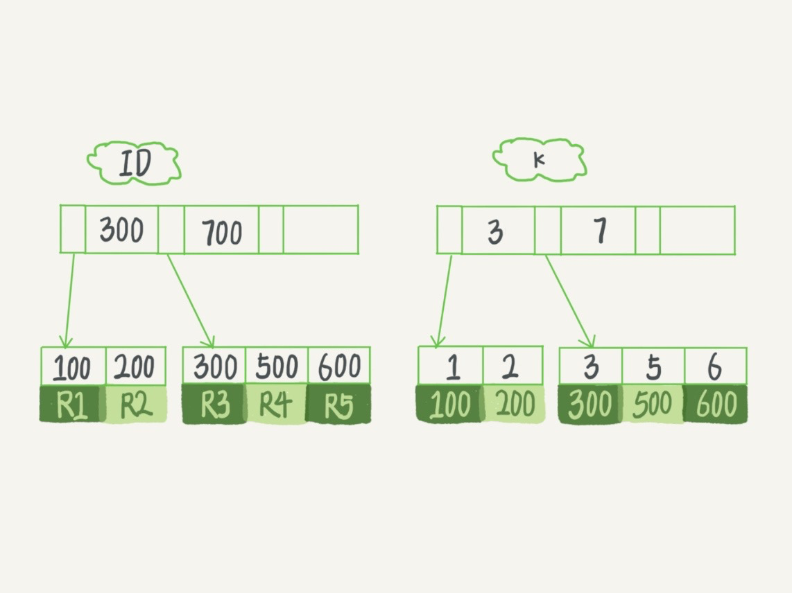

聚簇索引 构成的B+树，叶子节点存放的是这一条记录的完整数据。

非聚簇索引，所构成的B+树，的叶子结点只保留了该记录的主键，如果想要通过非聚簇索引查询主键以外的其他信息，还需要用主键去聚簇索引中再进行一次查找，这个查找叫做回表。

## **联合索引**

每次回表都要重新去主键索引中查找，可能还会进行磁盘IO，从而拖慢整个查询的性能。因此减少回表，可以显著提升查询性能。

如果只取id的话就不需要进行回表，但实际我们要的是具体的数据而不是id。那只能多在索引节点上多放些常用数据了。相当于在多个字段上建立了联合索引。

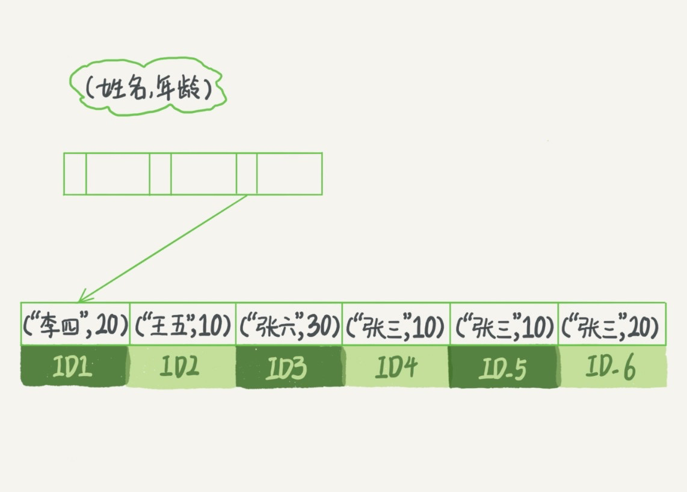

这样的话我们可以通过 “张三” 迅速定位到 ID4，然后再通过年龄筛选，过滤符合查询条件的数据。

甚至可以使用 “张%” 来模糊查询，再用年龄查询，但不能只用年龄来查。因为数据是先按 “姓名” 排序，再对相同姓名的按 “年龄”排序。

这里就引出了**联合索引的最左前缀规则**。需要考虑索引内的字段顺序，会影响查询是否走索引。

**小结**

其实联合索引，简单来说就是按多个字段依次排序，如 index (a_b)，先按a排序，在a相等的基础上，再按b排序。因此直接拿b来查是无法走索引的。

## 唯一索引和普通索引

从名称可以看出，唯一索引需要保证索引列的唯一性。因此变更时需要额外多做一些校验，性能自然也会受到影响。

**查询时两者的区别**

例如执行 select id from T where k=5 语句。

对于普通索引，先从B+树的根节点开始，按层通过二分查找搜索到满足条件的第一条记录后，还需要查看下一个记录，直到碰到第一个不满足k=5条件的记录才停止。

唯一索引，则是由于其数据唯一性的特点，只要找到满足条件的第一条记录后，就停止检索。

**插入时两者的区别**

- 要更新的数据页**在内存中**

  普通索引，找到记录的插入位置，执行插入。

  唯一索引，找到记录的插入位置，通过唯一性判断，执行插入。

- 要更新的数据页**不在内存中**

  普通索引，将更新记录在 change buffer，语句执行就结束了。

  唯一索引，需要将数据页读入内存，判断到没有冲突，插入这个值，语句执行结束

## 重建索引注意

InnoDB删除了表的数据记录，但它的索引还存在，可能会导致索引占用空间比实际内容大小还有多的情况，因此需要重建索引。

索引可能因为删除或者页分裂等原因导致数据页有空洞，重建索引的过程会创建一个新索引，把数据按顺序插入，这样索引数据更紧凑，更省空间。

```mysql
# 普通索引可以这样操作
alter table T drop index k; 
alter table T add index(k);
# 主键索引可以使用如下方式
alter table T engine=InnoDB
```

## 索引下推

索引下推（INDEX CONDITION PUSHDOWN，简称 ICP），简单来说就是将一部分数据过滤能力从服务层下沉到存储引擎里。从而减少回表的次数以及上传到服务层的数据。

https://segmentfault.com/a/1190000039869289

## 前缀索引

**前缀索引和最左前缀规则是两个东西。**针对字符串类型的字段，可能存在后缀一致的情况，那么就可以不对完整的字段加索引，而是对前边有区分的部分加索引，这样可以减小索引的占用空间。

```mysql
# 普通索引
alter table SUser add index index1(email);
# 前缀索引
alter table SUser add index index2(email(6));
```

还需要注意的是，前缀索引可能会影响覆盖索引。结合上边的语句，使用普通索引查询查询email的时候不用回表，而前缀索引还需进行一次回表才能返回完整的email信息。

## 索引中的NULL值

如果MySQL表的某一列含有NULL值，那么包含该列的索引是否有效？

有效，MySQL可以在含有NULL的列上使用索引，但建议设置NOT NULL，并给一个默认值，比如0或空字符串。

因为对MySQL来说，NULL是一个特殊的值，代表一个未知值，它的处理方式与其他值有些不同。比如：不能使用=，<，>这样的运算符，对NULL做算术运算的结果都是NULL，count时不会包括NULL行等，NULL列需要增加额外空间来记录其值是否为NULL，NULL比空字符串需要更多的存储空间等。

## 索引设计注意

主键索引设计需要注意：

- 尽量不要用业务唯一键来作为主键。自增id追加插入成本小于业务主键的随机插入。

  从最后边追加插入不涉及调整其他节点位置。但如果用带有业务逻辑的字段作为主键，往往不容易保证有序插入，会增加一定的写成本。

- 尽量保持主键长度小一些，这样普通索引的叶子结点就越小，普通索引所占空间就越小。

## 索引使用注意

**条件字段函数操作**

查询时对索引字段做函数操作，优化器会决定放弃走索引树的搜索功能，但是还是可能会通过索引来遍历所有数据。

注意，这里是对索引字段进行函数，而不是对参数进行函数。

```mysql
select count(*) from tradelog where month(t_modified)=7;
```

**隐式类型转换**

https://xiaomi-info.github.io/2019/12/24/mysql-implicit-conversion/

数据库中 tradeid 的数据类型是 varchar(32)，而输入的参数是整型，所以需要类型转换。

```mysql
select * from tradelog where tradeid=110717;
```

发生类型转换，相当于对索引字段做函数操作，优化器会放弃走索引树的搜索功能。

```mysql
select * from tradelog where CAST(tradid AS signed int) = 110717;
```

MySQL中字符串和数据做比较的话，默认是将字符串转成数字。

**查询时传入超过字段最大长度的参数**

例如 对一个 varchar(10) 的字段，查询参数是 超过10位的，那么查询结果会直接返回

varchar(10) 表示该字段的最大长度是10个字符，如果where条件里改字段的查询参数超过了10个字节，在传给引擎执行时，会做字符串截断，例如查询参数 name='1234567890abc'，查询参数一共13位，但字段的最大长度是10位，所以传给引擎的是一个截断后的字符串，也就是 ’1234567890‘。根据name索引返回满足该条件的数据id，做完回表后返回的整行数据，到server层一条一条判断，是否与'1234567890abc' 相等，显然这个是一个永远不相等的判断，所以最终返回的结果是空，让数据库白白做了很多无用的计算。

# Other

## explain

**select_type**

表示查询的类型。最常见的查询类型是SIMPLE，表示没有子查询也没用到UNION查询。 

- SIMPLE ： 表示查询语句不包含子查询或union 
- PRIMARY：表示此查询是最外层的查询 
- UNION：表示此查询是UNION的第二个或后续的查询 
- DEPENDENT UNION：UNION中的第二个或后续的查询语句，使用了外面查询结果 
- UNION RESULT：UNION的结果 
- SUBQUERY：SELECT子查询语句 
- DEPENDENT SUBQUERY：SELECT子查询语句依赖外层查询的结果。 

**type** 

表示存储引擎查询数据时采用的方式。通过它可以判断出查询是全表扫描还 是基于索引的部分扫描。

常用属性值如下，从上至下效率依次增强。

- ALL：表示全表扫描，性能最差。
- index：表示基于索引的全表扫描，先扫描索引再扫描全表数据。 通常优化器会选最小的索引树。
- range：表示使用索引范围查询。使用>、>=、<、<=、in等等。
- ref：表示使用非唯一索引进行单值查询。 
- eq_ref：一般情况下出现在多表join查询，表示前面表的每一个记录，都只能匹配后面表的一 行结果。 
- const：表示使用主键或唯一索引做等值查询，常量查询。 
- NULL：表示不用访问表，速度最快。 

**Extra**

表示很多额外的信息，各种操作会在Extra提示相关信息，常见几种如下：

- Using where，表示查询需要通过索引回表查询数据。

- Using index，表示查询只需要通过索引就可以满足所需数据，也就是使用了覆盖索引。
- Using filesort，表示查询出来的结果需要额外排序，数据量小在内存，大的话在磁盘，因此有Using filesort 建议优化。
- Using temprorary，查询使用到了临时表，一般出现于去重、分组等操作。

**key** 

表示查询时真正使用到的索引，显示的是索引名称。

**possible_keys**

表示查询时能够使用到的索引。注意并不一定会真正使用，显示的是索引名称。

**rows** 

MySQL查询优化器会根据统计信息，估算SQL要查询到结果需要扫描多少行记录。原则上rows是 越少效率越高，可以直观的了解到SQL效率高低。

**key_len** 

表示查询使用了索引的字节数量。可以判断是否全部使用了组合索引。

## 收缩表空间

如果要收缩一个表，只是 delete 掉表里面不用的数据的话，表文件的大小是不会变的，因为只是将数据做删除标记，下次有数据进来的时候可能会复用这个位置，但是磁盘文件的大小并不会缩小。

如果要缩小表的物理空大小，还需要使用alter table 命令重建表。

```mysql
alter table t engine=InnoDB；
```

重建后的表其实会比之前的更紧凑，这里的紧凑并不意味着填满整个数据页，而是每个页都会留1/16，以便后续数据插入。

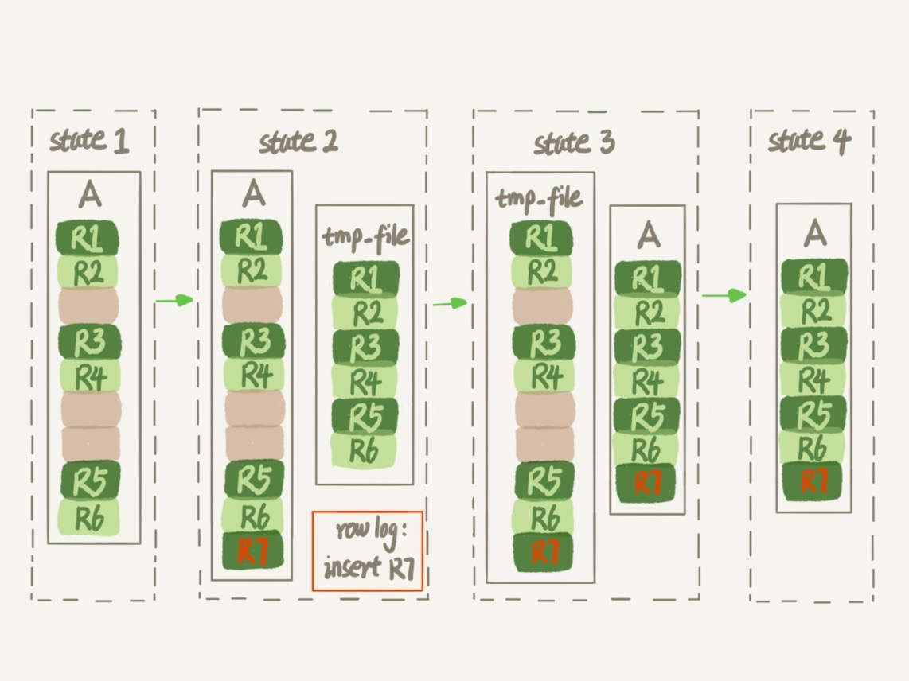

## on duplicate key update

https://www.cnblogs.com/better-farther-world2099/articles/11737376.html

## count

count() 是一个聚合函数，对于返回的结果集， 一行行地判断，如果 count 函数的参数不是 NULL，累计值就加 1，否则不加。最后返回 累计值。

MyISAM将表的总行数，保存在磁盘上，所以可以直接返回。而InnoDB，由于支持了事务及版本并发控制，所以同一时刻不同事务查询的总行数可能存在不同。因此需要遍历每一条数据判断。

InnoDB，RR级别下同一时刻不同事务查询到不同的总行数。

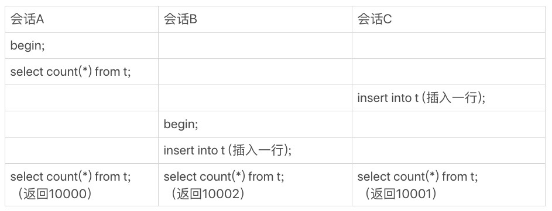

为了遍历出每一条数据，在保证逻辑正确的前提下，尽量减少扫描的数据量，是数据库系统设计的通用法则之一。

InnoDB 是索引组织表，主键索引树的叶子节点是数据，而普通索引树的叶子节点是主键值。所以，普通索引树比主键索引树小很多。对于 count(*) 这样的操作，遍历哪个索引树得到的结果逻辑上都是一样的。因此，**MySQL 优化器会找到最小的那棵树来遍历。**

**count(字段)<count(主键 id)<count(1)≈count(*)**

对于 count(字段) 来说：

1. 如果这个“字段”是定义为 not null 的话，一行行地从记录里面读出这个字段，判断不能为 null，按行累加；
2. 如果这个“字段”定义允许为 null，那么执行的时候，判断到有可能是 null，还要把值取出来再判断一下，不是 null 才累加。

但是 count(*) 是例外，并不会把全部字段取出来，而是专门做了优化，不取值。 肯定不是 null，按行累加。

## order by

MySQL会给每个线程分配一块内存用于排序，称为 sort_buffer。

引擎查找出符合条件的数据行返回给Server层，由Server在sort_buffer中完成排序做结果返回。

排序的动作是在内存中完成的，但数据量过大（大于 sort_buffer_size 时，内存放不下）也会使用到外部磁盘临时文件来辅助完成排序。具体的话，采用归并排序。将需要排序文件分为多份，每一份单独排序后存在这些临时文件中，最后把这 12 个有序文件再合并成一个有序的大文件。

默认返回的是整条记录行数据，如果一条单行长度大于 max_length_for_sort_data ，则MySQL会使用 rowid 来排序，然后根据id值重新查完整数据返回。

**小结**

如果 MySQL 实在是担心排序内存太小，会影响排序效率，才会采用 rowid 排序算法，这 样排序过程中一次可以排序更多行，但是需要再回到原表去取数据。

如果 MySQL 认为内存足够大，会优先选择全字段排序，把需要的字段都放到 sort_buffer 中，这样排序后就会直接从内存里面返回查询结果了，不用再回到原表去取数据。

这也就体现了 MySQL 的一个设计思想：如果内存够，就要多利用内存，尽量减少磁盘访问。

## 主键自增

由于自增主键可以让主键索引尽量地保持递增顺序插入，避免了页分裂，因此索引更紧凑。

**注意 AUTO_INCREMENT 只能保证递增，但不能保证连续递增。**

show create table 命令可以查看下次插入数据的主键自增值。

**自增值保存的位置**

首先主键自增值的保存位置不同引擎是不一样的，MyISAM是保存在在数据文件中的。而InnoDB引擎在8.0之后才将自增值持久化到数据文件的。之前是保存在内存中，并没有持久化，第一打开表的时候，会找自增值的最大值max(id)，然后将最大值+1 保存到内存中。后续都是从内存中来取。8.0后将自增值的变更记录在redo log中，重启依靠redo log 恢复之前的值。

**自增值修改机制**

- 当插入字段指定为0、null 或未制定值时，就将当前表的AUTO_INVREMENT值填到自增字段。
- 如果插入时自增字段指定了具体的值，就直接使用具体的值插入。然后根据指定值和当前自增值的大小来决定要不要修改自增值。
  - 如果指定值 < 当前自增值，则不变
  - 如果指定值 >= 当前自增值，则将自增值修改为指定值+1。

**自增值的生成算法**

自增值可以设置起始值和步长。在双M的主备结构里，要求双写的时候，可以设置成 auto_increment_increment=2，让 一个库的自增 id 都是奇数，另一个库的自增 id 都是偶数，避免两个库生成 的主键发生冲突。

**自增值的修改时机**

这个自增值就像是一个发号器，不支持回退。它并不会去管拿到这个号的操作是否执行成功，因此会有多种情况导致自增主键id不连续。

- 唯一键冲突导致插入失败
- 事务回滚

**自增锁的优化**

在获取自增id的时候也会加锁，叫做自增id锁，这个并不是一个事务锁。而是每次申请完就释放，加锁时为了防止并发申请的时候，申请到相同的自增id。


## 存储过程批量插入数据

```mysql
delimiter 
create procedure batchInsert()
begin
    declare num int; 
    set num=1;
    while num<=1000000 do
        insert into user(`id`,
    `name`) values(num,concat('测试用户', num));
        set num=num+1;
    end while;
end
delimiter;

# 执行存储过程
CALL batchInsert;
# 删除存储过程
drop procedure batchInsert; 
```

## 主备同步

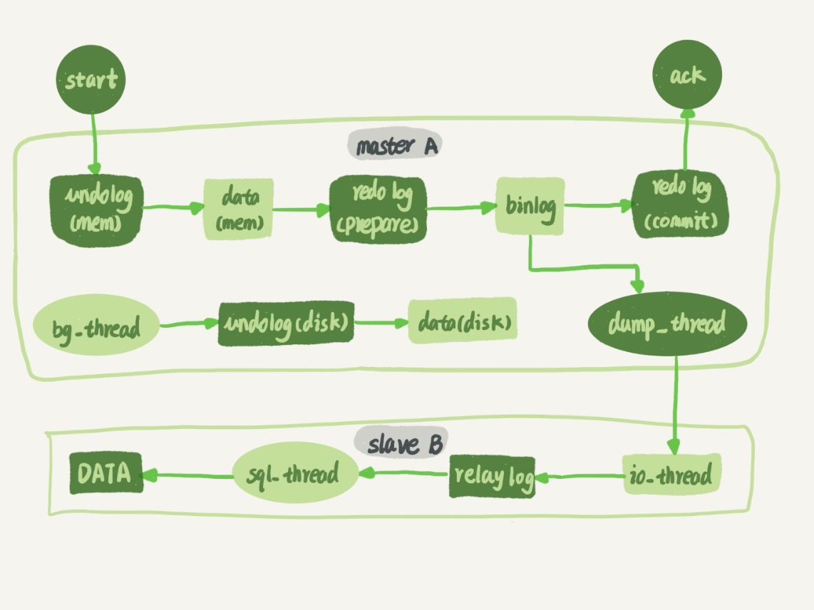

图中包含 binlog 和 redo log 的写入机制相关的流程。可以看到：主库接收到客户端的更新请求后，执行内部事务的更新逻辑，同时写 binlog。

备库 B 跟主库 A 之间维持了一个长连接。主库 A 内部有一个线程，专门用于服务备库 B 的这个长连接。

一个事务日志同步的完整过程是这样的：

1. 在备库 B 上通过 change master 命令，设置主库 A 的 IP、端口、用户名、密码，以及 要从哪个位置开始请求 binlog，这个位置包含文件名和日志偏移量。
2. 在备库 B 上执行 start slave 命令，这时候备库会启动两个线程，就是图中的 io_thread 和 sql_thread。其中 io_thread 负责与主库建立连接。 
3. 主库 A 校验完用户名、密码后，开始按照备库 B 传过来的位置，从本地读取 binlog， 发给 B。
4. 备库 B 拿到 binlog 后，写到本地文件，称为中转日志（relay log）。
5. sql_thread 读取中转日志，解析出日志里的命令，并执行。

## 主备延迟

遇到过下面几种造成主从延迟的情况:
1.主库DML语句并发大,从库qps高
2.从库服务器配置差或者一台服务器上几台从库(资源竞争激烈,特别是io)
3.主库和从库的参数配置不一样
4.大事务(DDL,我觉得DDL也相当于一个大事务)
5.从库上在进行备份操作
6.表上无主键的情况(主库利用索引更改数据,备库回放只能用全表扫描,这种情况可以调整slave_rows_search_algorithms参数适当优化下)
7.设置的是延迟备库
8.备库空间不足的情况下

这期的问题：
看这曲线,应该是从库正在应用一个大事务,或者一个大表上无主键的情况(有该表的更新)
应该是T3随着时间的增长在增长,而T1这个时间点是没变的,造成的现象就是
随着时间的增长,second_behind_master也是有规律的增长

主备同步延迟，工作中常遇到几种情况：
1.主库做大量的dml操作，引起延迟
2.主库有个大事务在处理，引起延迟
3.对myisam存储引擎的表做dml操作，从库会有延迟。
4.利用pt工具对主库的大表做字段新增、修改和添加索引等操作，从库会有延迟。

## 为什么要分库分表（设计高并发系统的时候，数据库层面该如何设计）？

|     场景     |          分库分表前          |                  分库分表后                  |
| :----------: | :--------------------------: | :------------------------------------------: |
| 并发支撑情况 | MySQL 单机部署，扛不住高并发 |  MySQL从单机到多机，能承受的并发增加了多倍   |
| 磁盘使用情况 |  MySQL 单机磁盘容量几乎撑满  | 拆分为多个库，数据库服务器磁盘使用率大大降低 |
| SQL 执行性能 | 单表数据量太大，SQL 越跑越慢 |     单表数据量减少，SQL 执行效率明显提升     |

单库最多支撑到并发 2000，健康的单库并发值你最好保持在每秒 1000 左右

**单表数据量太大**，会极大影响你的 sql **执行的性能**，因此将每个表的记录数量控制在200w到500w左右

## 用过哪些分库分表中间件？

- 客户端：分片逻辑在应用层，封装在jar包中，通过修改或封装JDBC层来实现，如当当网的Sharding-JDBC
- 中间件代理：在业务层和数据库中间加了一个代理层，分片逻辑统一维护在中间件服务中，该服务需要独立部署，也可以多台部署，Mycat就是这种架构的实现

## 不同的分库分表中间件都有什么优点和缺点？

Sharding-jdbc 这种 client 层方案的**优点在于不用部署，运维成本低，不需要代理层的二次转发请求，性能很高**，但是如果遇到升级啥的需要各个系统都重新升级版本再发布，各个系统都需要**耦合** Sharding-jdbc 的依赖；

Mycat 这种 proxy 层方案的**缺点在于需要部署**，自己运维一套中间件，运维成本高，但是**好处在于对于各个项目是透明的**，如果遇到升级之类的都是自己中间件那里搞就行了。

通常来说，这两个方案其实都可以选用，但是我个人建议中小型公司选用 Sharding-jdbc，client 层方案轻便，而且维护成本低，不需要额外增派人手，而且中小型公司系统复杂度会低一些，项目也没那么多；但是中大型公司最好还是选用 Mycat 这类 proxy 层方案，因为可能大公司系统和项目非常多，团队很大，人员充足，那么最好是专门弄个人来研究和维护 Mycat，然后大量项目直接透明使用即可。

## 你们具体是如何对数据库如何进行垂直拆分或水平拆分的

# 数据库连接池

​	定义
​		数据库连接池负责分配、管理和释放数据库连接，它允许引用程序重复使用一个现有的数据库连接，而不是重新建立一个。
​	作用
​		在应用启动时建立足够的数据库连接，并将这些连接组成一个连接池，由程序动态的对池中的连接进行申请、使用和释放，提升系统性能
​		减少了每次连接数据库时的tcp连接，减少网络IO消耗
​	流程
​		不使用数据库连接池流程
​			图例
​				

步骤
	1、TCP建立连接（三次握手）
	2、MySQL权限认证
	3、SQL执行
	4、TCP关闭连接（四次挥手）

使用数据库连接池流程
	图例
		

步骤
	1、第一次访问时建立TCP连接
	2、SQL执行使用的都是连接池中的连接
	3、服务停止时释放连接池

工作原理
	连接池建立
		系统初始化时，连接池会根据系统配置建立，并在池中创建几个连接对象，连接池中的连接不能随意创建和关闭，避免随意连接和关闭造成的系统开销
	连接池管理
		首先查看连接池中是否有空闲连接，如果存在空闲连接，则将连接分配给客户使用；如果没有空闲连接，则查看当前所开的连接数是否已经达到最大连接数，如果没达到就重新创建一个连接给请求的客户；如果达到就按设定的最大等待时间进行等待，如果超出最大等待时间，则抛出异常；
	连接池关闭
		当客户端释放数据库连接时，先判断该连接的引用次数是否超过了规定值，如果超过就从连接池中删除该连接，否则保留
常用参数（HikariCP）
	1、autoCommit=true 
		连接是否自动提交事务，默认true
	2、connectionTimeout
		连接超时时间，如果超时，将抛出SQLException
	3、idleTimeout
		连接在连接池中闲置多久被抛弃，默认600000 ms
	4、minimumIdle
		最小空闲连接数
	5、maximumPoolSize
		最大连接数
	6、poolName
		连接池名称
分类
	HikariCP
	Druid

# 分库分表

​	sharding-jdbc
​		定义
​		SQL执行流程
​			图例
​				

步骤
	SQL解析
		词法解析
		语法解析
	SQL路由
		sharding-jdbc根据上下文匹配用户对这句SQL所涉及的库和表配置的分片策略（用户配置的分片策略），并根据分片策略生成路由后的SQL。路由后的SQL有一条或多条，每一条都对应着各自真实的物理分片
	SQL改写
		将SQL改写成在真实数据库中可以执行的语句（例如把逻辑表名改为带编号的物理表）
	SQL执行
		通过多线程执行器异步执行改写后得到的 SQL 语句
	结果归并
		将多个执行结果集归并以便于通过统一的 JDBC 接口输出

核心概念
	逻辑表和物理表
	分片键
	路由
	分片策略
		标准分片策略
		复合分片策略
		Hint分片策略
		Inline分片策略
		不分片策略
	分片算法
	绑定表
使用方式
	引入依赖包
	水平分片规格配置
	创建数据源
	执行SQL


```

```


