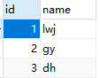
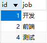
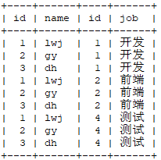
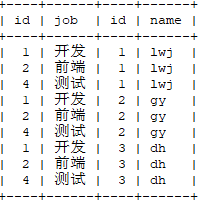

## 关联查询

### inter join & left join & right join 区别？

表 **ta**  & 表 **tb**

| 表名 |                     ta                      |                             tb                              |
| :--: | :-----------------------------------------: | :---------------------------------------------------------: |
| 内容 |  |  |

**inter join**

**select * from ta inter join tb;   /  select * from ta,tb;**



**select * from tb inter join ta;	/	 select * from tb,ta;**



可以看到如果只是用 **inter join** 的话相当于做了两个表的笛卡尔积。

### SQL中过滤条件放在on和where中的区别？

**在 inner join 的情况下，结果是一样的。**

**在 left join / right join 情况下 ，on 的过滤只对右边表有效 ，where 则会对 join 之后的所有记录再进行过滤。**

join过程可以这样理解：首先两个表做一个笛卡尔积，on后面的条件是对这个笛卡尔积做一个过滤形成一张临时表，如果没有where就直接返回结果，如果有where就对上一步的临时表再进行过滤。下面看实验：

拿 left join 来说，由于left join 的特性，一定会将 left join 左边表的所有记录显示出来，而left join 右边表的记录可以通过  on 来过滤（左边表的记录使用on过滤没有效果）。

下面结合sql和执行结果看一下：

- 没有使用 on 对右边表进行过滤， 注意看sql中【】的内容。

```mysql
select u.name ,u.uid ,r.rtid ,r.sleep_avg_heartrate heartrate ,r.sleep_avg_breatherate breatherate,r.oxygen,r.szy,r.ssy
from  user u left join report r on 【u.uid =r.uid 】group by u.uid;
```

.jpg)

- 使用 on 对右边表进行过滤，可以看到相对应的字段的值都变成了null。

```mysql
select u.name ,u.uid ,r.rtid ,r.sleep_avg_heartrate heartrate ,r.sleep_avg_breatherate breatherate,r.oxygen,r.szy,r.ssy
from  user u left join report r on 【u.uid =r.uid and r.uid!=4 】group by u.uid;
```

.jpg)

- 在使用 on 对右边表进行过滤的基础上，同时也对左边表进行过滤，发现并没有什么效果。

```sql
select u.name ,u.uid ,r.rtid ,r.sleep_avg_heartrate heartrate ,r.sleep_avg_breatherate breatherate,r.oxygen,r.szy,r.ssy
    from  user u left join report r on 【u.uid =r.uid and r.uid!=4 and u.uid!=4 】group by u.uid;
```

.jpg)

- 在前边使用left join 的基础上，再加上 where 进行过滤。

```sql
select u.name ,u.uid ,r.rtid ,r.sleep_avg_heartrate heartrate ,r.sleep_avg_breatherate breatherate,r.oxygen,r.szy,r.ssy
    from  user u left join report r on 【u.uid =r.uid  and r.uid!=4 where u.uid=4 】group by u.uid;
```

.jpg)


## 从主表复制数据到副表

```mysql
insert into 
stock_change_record_copy1(order_id,sale_item_sku_id,quantity,ext,gmt_create,gmt_modified)
select 
order_id,sale_item_sku_id,quantity,ext,gmt_create,gmt_modified 
from stock_change_record
```

