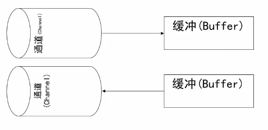

## NIO介绍
NIO是New I/O的简称,与旧式的基于流的I/O方法相对,从名字看,它表示新的一套JavaI/O标准。它是在Java 1.4中被纳入到JDK中的,并具有以下特性:
- NIO是基于块(Block )的,它以块为基本单位处理数据
- 为所有的原始类型提供(Buffer)缓存支持
- 增加通道(Channel)对象,作为新的原始I/O抽象,原来使用的是流
- 支持锁和内存映射文件的文件访问接口
- 提供了基于Selector的异步网络I/O  
改变线程调度，充分利用线程
##　AIO
读完了再通知
不会加快IO，只会在读完后进行通知
使用回调函数，进行业务处理

### Buffer&Channel


```java
FileInputStream  fin = new FileInputStream(new File("d:\\temp_buffer.tmp"));
FileChannel fc = fln.getChannel();

ByteBuffer buteBuffer= ByteBuffer.allocate(1024);
fc.read(byteBuffer);

fc.close();
byteBuffer.flip();  //读写转换
```

### NIO复制文件
```java
FileInputStream fis = new FileInputStream(resource);
FileOutputStream fos = new FileOutputStream(destination);
FileChannel readChannel = fis.getChannel();
FileChannel writeChannel = fos.getChannel();
ByteBuffer buffer = ByteBuffer.allocate(1024);
 while(true){
     buffer.clear();
     int len = readChannel.read(buffer);
     if(len==-1){
         break;
         //读取完毕
     }
     buffer.flip();
     writeChannel.write(buffer);
 }
 readChannel.close();
 writeChannel.close();
```

### Buffer
- capacity (容量) 缓冲区的总大小  
- limit  (限制) 其所在的索引位置及后边的位置无法被读取或写入
- position (位置) 下一次读取或写入的索引位置
- mark (标记)  使用reset()可以回到标记位置

- Buffer rewind()  
标记清除，位置position值归0，limit不变  rewind()用于重新读取缓冲区中数据使用  
与clear()的区别是 rewind不改变limit，clear会重置limit，clear()用于对缓冲区存储数据前调用  
- Buffer flip()   
当向缓冲区中存储数据，然后再从缓冲区是中读取这些数据时，就是flip()方法的最佳时机  
反转此缓冲区.首先将限制设置为当前位置,然后将位置设置为0,如果已定义标记,则丢弃该标记.  
- Buffer flip()    
当向缓冲区中存储数据，然后再从缓冲区是中读取这些数据时，就是flip()方法的最佳时机  
反转此缓冲区.首先将限制设置为当前位置,然后将位置设置为0,如果已定义标记,则丢弃该标记.  
