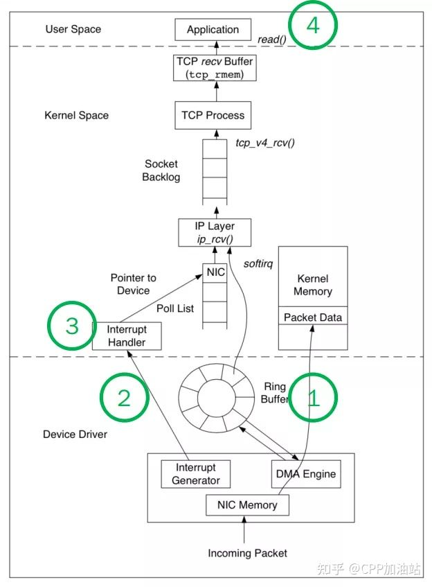
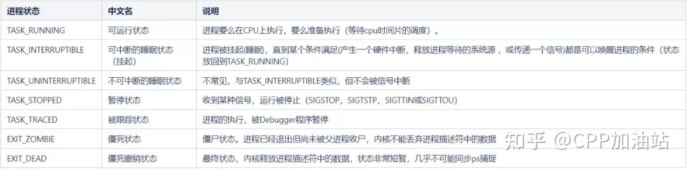

# IO多路复用

epoll和kqueue比select 和poll的优势在于监听的更多的文件描述符，也就是socket的fd。

这里的监听的socket其实是有潜在条件的，指的是非活跃的网络连接。epoll 在应对大量网络连接时，只有活跃连接很少的情况下才能表现的性能优异。换句话说，epoll 在处理大量非活跃的连接时性能才会表现的优异。如果15000个 socket 都是活跃的，epoll 和 select 其实差不了太多。

1. NIC（网卡） 接收到数据，通过 DMA 方式写入内存(Ring Buffer 和 sk_buff)。
2. NIC 发出中断请求（IRQ），告诉内核有新的数据过来了。
3. Linux 内核响应中断，系统切换为内核态，处理 Interrupt Handler，从RingBuffer 拿出一个 Packet， 并处理协议栈，填充 Socket 并交给用户进程。
4. 系统切换为用户态，用户进程处理数据内容。

网卡何时接收到数据是依赖发送方和传输路径的，这个延迟通常都很高，是毫秒(ms)级别的。而应用程序处理数据是纳秒(ns)级别的。也就是说整个过程中，内核态等待数据，处理协议栈是个相对很慢的过程。这么长的时间里，用户态的进程是无事可做的，因此用到了“阻塞（挂起）”。

**阻塞**是进程调度的关键一环，指的是进程在等待某事件发生之前的等待状态

从说明中其实就可以发现，“可运行状态”会占用 CPU 资源，另外创建和销毁进程也需要占用 CPU 资源（内核）。重点是，当进程被"阻塞/挂起"时，是不会占用 CPU 资源的。

换个角度来讲。为了支持多任务，Linux 实现了进程调度的功能（CPU 时间片的调度）。而这个时间片的切换，只会在“可运行状态”的进程间进行。因此“阻塞/挂起”的进程是不占用 CPU 资源的。

为了方便时间片的调度，所有“可运行状态”状态的进程，会组成一个队列，就叫**“工作队列”**。